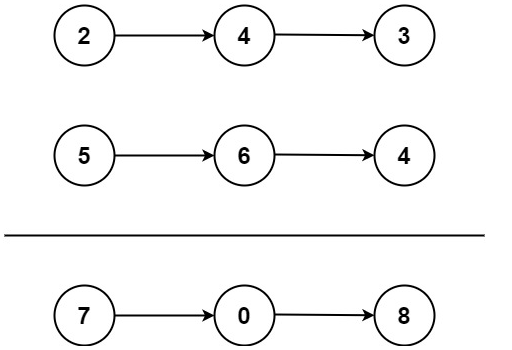

# <font color='bb000'>两数相加【链表】</font>
## **`下面的链接是——————我做的所有的题解`**

# [包括基础提高以及一些零散刷的各种各样的题](https://www.acwing.com/blog/content/33005/) 


## 题目介绍

给你两个 **非空** 的链表，表示两个非负的整数。它们每位数字都是按照 **逆序** 的方式存储的，并且每个节点只能存储 **一位** 数字。

请你将两个数相加，并以相同形式返回一个表示和的链表。

你可以假设除了数字 0 之外，这两个数都不会以 0 开头。

**示例 1：**

 


```
输入：l1 = [2,4,3], l2 = [5,6,4]
输出：[7,0,8]
解释：342 + 465 = 807.
```

**示例 2：**

```
输入：l1 = [0], l2 = [0]
输出：[0]
```

**示例 3：**

```
输入：l1 = [9,9,9,9,9,9,9], l2 = [9,9,9,9]
输出：[8,9,9,9,0,0,0,1]
```

**提示：**

- 每个链表中的节点数在范围 `[1, 100]` 内
- `0 <= Node.val <= 9`
- 题目数据保证列表表示的数字不含前导零


## 思考

这题其实类比高精度加法，只不过我们不能自己定义变长数组存值，给我们已经提供好了，而且不需要自己反转链表，已经是从个位开始排序的状态了。

我们需要存进位，一旦链表有一个没有遍历完，或者是进位不为0的情况下，都需要给答案加节点。

为了能返回答案，显然我们需要开一个虚拟头节点，这个头节点的值无所谓，因为我们最后返回的时候，只需要返回头节点的下一个节点的地址。


## java

```java
/**
 * Definition for singly-linked list.
 * public class ListNode {
 *     int val;
 *     ListNode next;
 *     ListNode() {}
 *     ListNode(int val) { this.val = val; }
 *     ListNode(int val, ListNode next) { this.val = val; this.next = next; }
 * }
 */
class Solution {
    public ListNode addTwoNumbers(ListNode l1, ListNode l2) {
                        
        int t = 0;
        ListNode dummy = new ListNode(0);
        ListNode cur = dummy;

        while(t != 0 || l1 != null || l2 != null){
            int val = 0;
            if (l1 != null){
                t += l1.val;
                l1 = l1.next;
            }
            if (l2 != null){
                t += l2.val;
                l2 = l2.next;
            }
            
            cur.next = new ListNode(t % 10);
            cur = cur.next;
            t /= 10;
        }
        return dummy.next;
    }
}
```