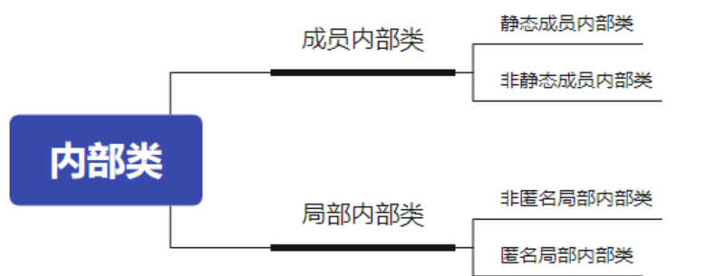
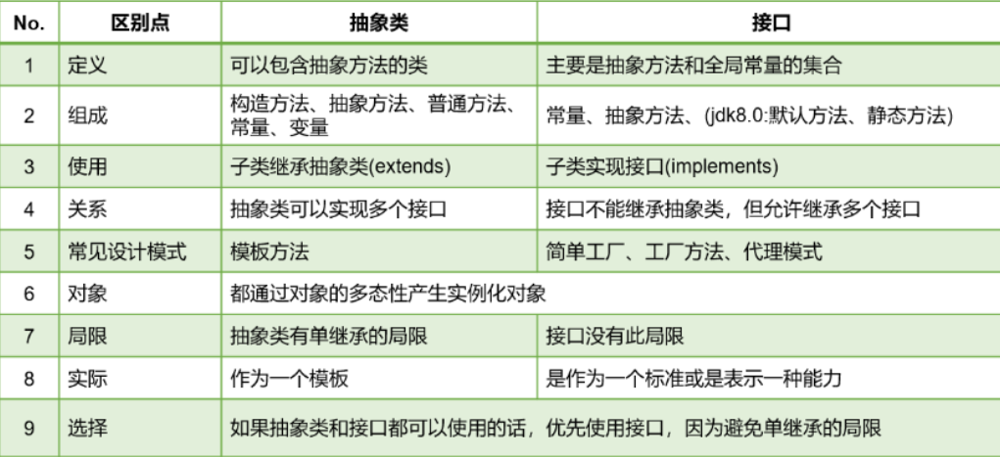
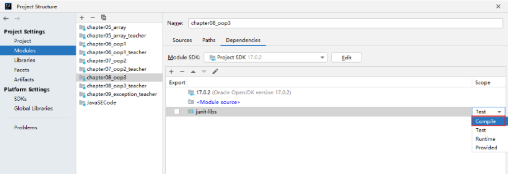
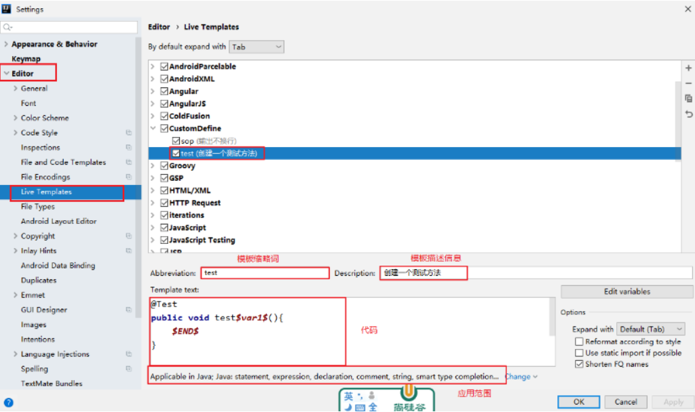
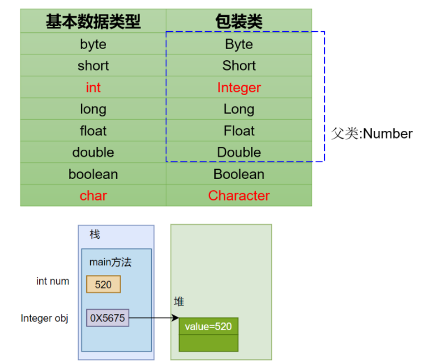
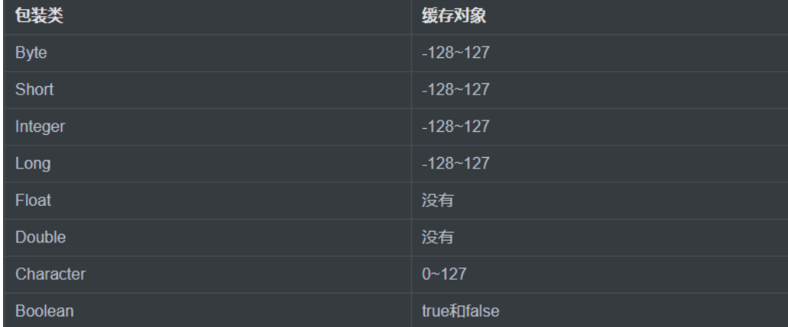

#  **1 类的五大成员：属性（成员变量），方法，构造器，代码块，内部类**

## 1.1 **属性（成员变量）**

### 1.1.1 成员变量与局部变量的区别

- 属性 vs 局部变量
  - 声明的位置: 属性声明在类中，局部变量声明在方法内，或者是在方法的形参列表
  - 内存中存放的位置: 属性在堆中存放，局部变量在栈存放
  - 作用域：属性在整个类中有效，局部变量在方法中有效
  - 权限修饰符： 属性有 局部变量没有
  - 初始化值： 属性有默认初始化值，而局部变量调用前必须显式赋值
  - 生命周期： 属性随着对象的创建而出现，对象的消亡而消失，局部变量存在方法内，而方法存储在栈帧中，局部变量随着方法的出栈而消失
- `属性` <=> `成员变量` <=> `field` <=> `字段、域`


### 1.1.2 Java 的引用类型和基本数据类型有哪几种，字节数量

8大基本数据类型：

- `boolean` 占1字节位并且其值只有`ture`和`false`两个 
- `char` 占2个字节
- `byte` 占1个字节范围
- `short` 占2个字节范围
- `int` 4个字节范围
- `long` 8个字节范围
- `float` 占4个字节
- `double` 占8个字节

6大引用数据类型：类、数组、接口；枚举、注解、记录


### 1.1.3 Java中内存结构的划分

1. Java中内存结构划分为：`虚拟机栈、堆、方法区`；程序计数器、本地方法栈
2. 虚拟机栈：以栈帧为基本单位，有入栈和出栈操作；每个栈帧入栈操作对应一个方法的执行；方法内的局部变量会存储在栈帧中。
3. 堆空间：new 出来的结构（数组、对象）：① 数组，数组的元素在堆中 ② 对象的成员变量在堆中。
4. 方法区：加载的类的模板结构。


### 1.1.4 Java中非静态属性（即实例变量）赋值的位置和顺序

1. 默认初始化
2. 显式初始化 或 5. 代码块初始化 (取决于在类中声明的顺序)
3. 构造器初始化
---------------------`对象生成`---------------------
4. 对象.属性 或 对象.方法


### 1.1.5 Java中字节码文件中的`<init>`简单说明(通过`jclasslib bytecode viewer`）

1. `<init>`方法在字节码文件中可以看到，每个`<init>`方法对应一个类的构造器（类中声明几个构造器就会有几个`<init>`）

2. 编写的代码中的构造器在编译后就会以`<init>`方法的方式呈现
3. `<init>`方法内部的代码包含了实例变量的显式赋值，代码块的赋值和构造器的代码
4. `<init>`方法用来初始化当前创建的对象的信息 和构造器并不能等同


------

## 1.2 方法

### 1.2.1 方法的参数传递机制：值传递

> 如果形参是基本数据类型的变量，则将实参保存的数据值赋给形参。
> 如果形参是引用数据类型的变量，则将实参保存的地址值赋给形参。


### 1.2.2 方法的重载(overload)

- 方法的重载的要求：“两同一不同” _> 同一个类 同一个方法名 不同的形参列表
- 调用方法时，如何确定调用的是某个指定的方法呢？① 方法名 ② 形参列表


### 1.2.3 可变个数形参的方法 格式：(`int ... args`)

------

## 1.3 构造器

### 1.3.1 **构造方法和普通方法的区别**

编写代码的角度：没有共同点。声明格式、作用都不同。

字节码文件的角度：构造器会以`<init>()方法`的形态呈现，用以初始化对象。


### 1.3.2 构造器Constructor是否可被overload?

- 可以重载 但不能重写


### 1.3.3 我们知道子类默认会调用父类构造器 那么我们new一个子类，内存中有几个对象?

> 只有一个对象，即new后面对应构造器对应的类的对象


### 1.3.4 变量赋值和构造方法加载的优先级问题

> 变量显式赋值先于构造器中的赋值。
> 如何证明？字节码文件。

------

## 1.4 代码块

- 代码块(或初始化块)的`作用`： 对Java类或对象进行初始化
- 代码块(或初始化块)的`分类`：
  - 一个类中代码块若有修饰符，则只能被static修饰，称为静态代码块(static block)
  - 没有使用static修饰的，为非静态代码块。


### 1.4.1 静态代码块

1. 可以有输出语句。
2. 可以对类的属性、类的声明进行初始化操作。
3. 不可以对非静态的属性初始化。即：不可以调用非静态的属性和方法。
4. 若有多个静态的代码块，那么按照从上到下的顺序依次执行。
5. 静态代码块的执行要先于非静态代码块。
6. 静态代码块随着类的加载而加载，且只执行一次。


### 1.4.2 非静态代码块

**如果多个重载的构造器有公共代码，并且这些代码都是先于构造器其他代码执行的，那么可以将这部分代码抽取到非静态代码块中，减少冗余代码。**

1. 可以有输出语句。
2. 可以对类的属性、类的声明进行初始化操作。
3. 除了调用非静态的结构外，还可以调用静态的变量或方法。
4. 若有多个非静态的代码块，那么按照从上到下的顺序依次执行。
5. 每次创建对象的时候，都会执行一次。且先于构造器执行。


------

## 1.5 内部类

将一个类A定义在另一个类B里面，里面的那个类A就称为**内部类（`InnerClass`）**，类B则称为**外部类（`OuterClass`）。**当一个事物A的**内部**，还有一个部分**需要一个完整的结构B进行描述**，而这个**内部的完整的结构B又只为外部事物A提供服务**，**不在其他地方单独使用**，那么整个内部的完整结构B**最好使用**内部类。**“高内聚、低耦合”。**

### 1.5.1 内部类的分类



### 1.5.2 成员内部类

如果成员**内部类中不使用外部类的非静态成员**，那么通常将内部类**声明为静态内部类**，否则声明为**非静态内部类。**

- **实例化静态内部类**

> 外部类名.静态内部类名 变量 = 外部类名.静态内部类名();
> 变量.非静态方法();


- **实例化非静态内部类**

> 外部类名 变量1 = new 外部类();
> 外部类名.非静态内部类名 变量2 = 变量1.new 非静态内部类名();
> 变量2.非静态方法();


#### 成员内部类的使用特征<两种角色>

**成员内部类作为 **类的成员的角色

- 和外部类不同，Inner class还可以声明为private或protected；
- 可以调用外部类的结构。（注意：在静态内部类中不能使用外部类的非静态成员）
- Inner class 可以声明为static的，但此时就不能再使用外层类的非static的成员变量；


**成员内部类作为** 类的角色

- 可以在内部定义属性、方法、构造器等结构
- 可以继承自己的想要继承的父类，实现自己想要实现的父接口们，和外部类的父类和父接口无关
- 可以声明为abstract类 ，因此可以被其它的内部类继承
- 可以声明为final的，表示不能被继承
- 编译以后生成`OuterClass$InnerClass.class`字节码文件（也适用于局部内部类）


**注意点**

1. 外部类访问成员内部类的成员，需要“内部类.成员”或“内部类对象.成员”的方式
2. 成员内部类可以直接使用外部类的所有成员，包括私有的数据
3. 当想要在外部类的静态成员部分使用内部类时，可以考虑内部类声明为静态的


### 1.5.2 局部内部类

#### 非匿名局部内部类

- 和成员内部类不同的是，它**前面不能有权限修饰符**等

- 局部内部类如同局部变量一样，**有作用域**

- 局部内部类中**是否能访问外部类的非静态的成员**，**取决于所在的方法**

```java
[修饰符] class 外部类{
    [修饰符] 返回值类型  方法名(形参列表){
            [final/abstract] class 内部类{
        }
    }    
}
```


#### 匿名内部类

因为考虑到这个子类或实现类**是一次性的**，那么我们“费尽心机”的给它取名字，就显得多余。那么我们完全可以使用匿名内部类的方式来实现，避免给类命名的问题。

```java
new 父类([实参列表]){
    重写方法...
}
new 父接口(){
    重写方法...
}
```


**举例1：使用匿名内部类(或称为接口的匿名实现类)的匿名对象直接调用方法：**

```java
interface A{
    void a();
}
public class Test{
    public static void main(String[] args){
        new A(){
            @Override
            public void a() {
                System.out.println("aaaa");
            }
        }.a();
    }
}
```


**举例2：通过父类或父接口的变量多态引用匿名内部类(或称为接口的匿名实现类)的对象**

```java
interface A{
    void a();
}
public class Test{
    public static void main(String[] args){
        A obj = new A(){
            @Override
            public void a() {
                System.out.println("aaaa");
            }
        };
        obj.a();
    }
}
```


**举例3：匿名内部类的对象作为实参**

```java
interface A{
    void method();
}
public class Test{
    public static void test(A a){
        a.method();
    }
    
    public static void main(String[] args){
        test(new A(){

            @Override
            public void method() {
                System.out.println("aaaa");
            }
        });
    }   
}
```


------

# **2 面向对象三大特征：封装性 继承性 多态性**

## 2.1 封装性

### **2.1.1 oop（面向对象程序设计(Object Oriented Programming）的特征之一 封装性在开发中如何体现?**

```java
随着我们系统越来越复杂，类会越来越多，那么类之间的访问边界必须把握好面向对象的开发原则要遵循
“高内聚、低耦合”。
• 高内聚：类的内部数据操作细节自己完成，不允许外部干涉；
• 低耦合：仅暴露少量的方法给外部使用，尽量方便外部调用。
Java提供了四种权限修饰符：public、protected、缺省、private，我们可以通过权限修饰符来修
饰类或类的内部成员。当它们被调用的时候体现可见性的大小。
举例：
1.私有化（private）类的成员变量，提供公共的 get 和 set 方法，对外暴露获取和修改属性的功能
2.将类中不想被外界调用的方法设置为private
3.单例模式中构造器private的了，避免在类的外部创造实例
```


### **2.1.2 main方法中的public能否换成private？为什么？**

```java
可以换,但换了之后main方法就不再是程序的入口了，仅仅代表一个普通的方法
```


### **2.1.3 四种修饰符的范围？**

| 修饰符    | 本类内部 | 本包内                     | 其他包的子类                      | 其他包非子类 |
| --------- | -------- | -------------------------- | --------------------------------- | ------------ |
| private   | √        | ×                          | ×                                 | ×            |
| 缺省      | √        | √【本包子类非子类都可见 】 | ×                                 | ×            |
| protected | √        | √【本包子类非子类都可见 】 | **√** 【其他包仅限于子类中可见 】 | ×            |
| public    | √        | √                          | √                                 | √            |

### **2.1.4**  this关键字的使用

```java
- this调用的结构：属性、方法；构造器
- this调用属性或方法时，理解为：当前对象或当前正在创建的对象。
```


------

## 2.2 继承性

```java
- 继承性的好处
  - 减少了代码的冗余，提高了复用性；
  - 提高了扩展性
  - 为多态的使用，提供了前提。
- Java中继承性的特点
  - 局限性：类的单继承性。后续我们通过类实现接口的方式，解决单继承的局限性。
  - 支持多层继承，一个父类可以声明多个子类。
- 基础：class A extends B{}
- 理解：子类就获取了父类中声明的全部的属性、方法。可能受封装性的影响，不能直接调用。
```


### 2.2.1 super关键字

```java
- super可以调用的结构：属性、方法；构造器
- super：父类的
- super调用父类的属性、方法：
  - 如果子父类中出现了同名的属性，此时使用super.的方式，表明调用的是父类中声明的属性。
  - 子类重写了父类的方法。如果子类的任何一个方法中需要调用父类被重写的方法时，需要使用super.
- super调用构造器：
  - 在子类的构造器中，首行要么使用了"this(形参列表)"，要么使用了"super(形参列表)"
```


#### super关键字调用构造器的注意事项

```java
① 子类继承父类时，不会继承父类的构造器。只能通过“super(形参列表)”的方式调用父类指定的构造器。
② 规定：“super(形参列表)”，必须声明在构造器的首行。
③ 我们前面讲过，在构造器的首行可以使用"this(形参列表)"，调用本类中重载的构造器， 结合②，
结论：在构造器的首行，"this(形参列表)" 和 "super(形参列表)"只能二选一。
④ 如果在子类构造器的首行既没有显示调用"this(形参列表)"，也没有显式调用"super(形参列表)"， 
则子类此构造器默认调用"super()"，即调用父类中空参的构造器。
⑤ 由③和④得到结论：子类的任何一个构造器中，要么会调用本类中重载的构造器，要么会调用父类的构造
器。 只能是这两种情况之一。
⑥ 由⑤得到：一个类中声明有 n 个构造器，最多有 n-1 个构造器中使用了"this(形参列表)"，则剩下
的那个一定使用"super(形参列表)"。
开发中常见错误：
如果子类构造器中既未显式调用父类或本类的构造器，且父类中又没有空参的构造器，则编译出错。
```


### 2.2.2 方法的重写

```java
- 前提：类的继承关系
- 子类对父类中同名同参数方法的覆盖、覆写。
- 子类重写的方法使用的访问权限`不能小于`父类被重写的方法的访问权限 子类方法抛出的异常不能大于
父类被重写方法的异常    注意：① 父类私有方法不能重写   ② 跨包的父类缺省的方法也不能重写
- 此外，子类与父类中同名同参数的方法必须同时声明为非static的(即为重写)，或者同时声明为static
的（不是重写）。因为static方法是属于类的，子类无法覆盖父类的方法
```


### 2.2.3 子类对象实例化的全过程

```java
- 结果上来说：体现为继承性
- 过程上来说：子类调用构造器创建对象时，一定会直接或间接的调用其父类的构造器，以及父类的父类
  的构造器，...，直到调用到Object()的构造器。
```


### 2.2.4 父类哪些成员可以被继承，属性可以被继承吗？

```java
父类的属性、方法可以被继承。构造器可以被子类调用。
```


------

## 2.3 多态性

```java
- 广义上的理解：子类对象的多态性、方法的重写；方法的重载
  狭义上的理解：子类对象的多态性。
- 格式：Object obj = new String("hello");   父类的引用指向子类的对象。
- 多态的好处：减少了大量的重载的方法的定义；开闭原则
  - 举例：public boolean equals(Object obj)
- 多态的使用：虚拟方法调用。“编译看左边，运行看右边”。属性，不存在多态性。
- 多态的逆过程：向下转型，使用强转符()。
  - 为了避免出现强转时的ClassCastException，建议()之前使用instanceOf进行判断。
```


### 2.3.1 **Object类的使用**

```java
- 根父类
- equals()的使用
  - 重写和不重写的区别
  - 面试题： == 和 equals()
- toString()的使用
  - Object中toString()调用后，返回当前对象所属的类和地址值。
  - 开发中常常重写toString()，用于返回当前对象的属性信息。
```


### 2.3.2 多态new出来的对象跟不多态new出来的对象区别在哪？

```java
Person p = new Man();  //虚方法调用。屏蔽了子类Man类特有的属性和方法。
Man m = new Man(); 
```


### 2.3.3 重写equals方法要注意什么？

```java
- 明确判定两个对象实体equals()的标准。是否需要所有的属性参与。
- 对象的属性，又是自定义的类型，此属性也需要重写equals()
```


------

# **3 面向对象关键字及一些补充特性**

## 3.1 static关键字

**类在什么时候会加载？**

以下7种方式会触发类加载：

1. `new`关键字

2. 调用静态属性
3. 调用静态方法
4. 接口 包含1.8 新特性 default 关键字
5. 反射 【`Class.forName()` 类名.class】
6. 子类调用会触发父类的静态代码块
7. 触发类的入口方法main


- static：静态的，随着类的加载而加载、执行。优先于对象存在。访问权限允许时，可不创建对象，直接被类调用静态变量的get/set方法也静态的，当局部变量与静态变量`重名时`，使用“`类名.静态变量`”进行区分。
- static用来修饰：属性、方法、代码块、内部类
- 类变量：类的生命周期内，只有一个。被类的多个实例共享。

- 掌握：我们遇到属性或方法时，需要考虑是否声明为static
- 当声明属性为静态，判断当前类的多个实例是否能共享此成员变量且值不变。开发中经常把常量设置为它
- 当方法内操作的变量都是静态变量（而非实例变量）此方法建议设置为静态方法开发中常常把工具类中的方法设置为静态方法，如Arrays类，Math类


### 3.1.1 static修饰的类变量、类方法与不使用static修饰的区别

> 静态变量              

- 静态变量的默认值规则和实例变量一样。
- 静态变量值是所有对象共享。
- 静态变量在本类中，可以在任意方法、代码块、构造器中直接使用。
- 如果权限修饰符允许，在其他类中可以通过“`类名.静态变量`”直接访问，也可以通过“`对象.静态变量`”的方式访问（但是更推荐使用类名.静态变量的方式）。
- 静态变量的get/set方法也静态的，当局部变量与静态变量`重名时`，使用“`类名.静态变量`”进行区分
                              

> 静态方法

- 静态方法在本类的任意方法、代码块、构造器中都可以直接被调用。
- 只要权限修饰符允许，静态方法在其他类中可以通过“类名.静态方法“的方式调用。也可以通过
  ”对象.静态方法“的方式调用（但是更推荐使用类名.静态方法的方式）。
- 在static方法内部只能访问类的static修饰的属性或方法，不能访问类的非static的结构。
- 静态方法可以被子类继承，但不能被子类重写。
- 静态方法的调用都只看编译时类型。
- 因为不需要实例就可以访问static方法，因此static方法内部不能有this，也不能有super。如果有重名问题，使用“类名.”进行区别。


### 3.1.2 单例设计模式

- 经典的设计模式有23种
- 解决的问题：在整个软件系统中，只存在当前类的唯一实例。
- 实现方式：饿汉式、懒汉式、枚举类等
- 对比饿汉式和懒汉式
  - 饿汉式：随着类的加载“立即加载”，私有化构造器，在类里设置唯一私有并且“静态”属性的实例，设置 `public` 静态的方法，在类外通过“类名.静态方法“访问，线程是安全的（缺点）内存中占用时间长
  - 懒汉式："延迟加载"，当调用此静态方法时才加载，线程不安全。（优点）内存中占用时间短

应用场景
- `Windows` 的 `Task Manager` (任务管理器) 就是很典型的单例模式
- `Windows` 的 `Recycle Bin` (回收站)也是典型的单例应用。在整个系统运行过程中，回收站一直维护着仅有的一个实例。
- `Application` 也是单例的典型应用
- 应用程序的日志应用，一般都使用单例模式实现，这一般是由于共享的日志文件一直处于打开状态，因为只能有一个实例去操作，否则内容不好追加。
- 数据库连接池的设计一般也是采用单例模式，因为数据库连接是一种数据库资源。


### **3.1.3 面试题** 

1. #### 静态属性和静态方法是否可以被继承？是否可以被重写？以及原因？

`<静态方法不存在多态性，不能重写可重载>`              

静态方法不能被重写。不存在多态性。如果在子类声明和父类同名同参数的方法，代表想要重写父类的方法
但是，如果父类的方法带有static属性，子类必须也加static属性，此时仍不是重写，而仅仅是重名，因为静态方法是类所属的方法，子类写了同名的仅代表子类也有一个同名所属子类的静态方法


1. #### 是否可以从一个static方法内部发出对非static方法的调用？

> 只能通过对象来对非静态方法的调用。


------

## 3.2 final关键字

**被修饰的结构为最终的，不可更改的，不可扩展的。如果是变量应该写为大写（习惯）**

1.final修饰类
表示这个类不能被继承，没有子类。提高安全性，提高程序的可读性。
例如：String类、System类、StringBuffer类

2.final修饰方法
表示这个方法不能被子类重写。
例如：Object类中的getClass()

3.final修饰变量
- final修饰某个变量（成员变量或局部变量），一旦赋值，它的值就不能被修改，即常量，常量名建议
使用大写字母。
- 如果某个成员变量用final修饰后，没有set方法，并且必须初始化（可以显式赋值、或在初始化块赋值、实例变量还可以在构造器中赋值）,可以先声明再赋值，但是只能赋值一次,并且调用它之前必须赋值
- 若修饰的局部变量在方法的形参列表，则调用此方法时给形参进行赋值，并且赋值后不可更改
- 若一个变量兼备final和static两个字段，则它就是这个类内部的全局常量 


### 3.2.1 面试题

1. #### 使用final修饰一个变量时，是引用不能改变，引用指向的对象可以改变？

> 引用不能改变。 引用指向的对象实体中的属性，如果没有使用final修饰，则可以改变。


------

## 3.3 abstract关键字(抽象类和抽象方法）

随着继承层次中一个个新子类的定义，类变得越来越具体，而父类则更一般，更通用。类的设计应该保证父类和子类能够共享特征。**有时将一个父类设计得非常抽象，以至于它没有具体的实例**，这样的类叫做抽象类。我们把没有方法体的方法称为**抽象方法**。Java语法规定，包含抽象方法的类必须是**抽象类**。

### 3.3.1 抽象类和抽象方法

1. 抽象类《不能创建对象》，如果创建，编译无法通过而报错。只能创建其非抽象子类的对象。
   > 理解：假设创建了抽象类的对象，调用抽象的方法，而抽象方法没有具体的方法体，没有意义。
   > 抽象类是用来被继承的，抽象类的子类必须重写父类的抽象方法，并提供方法体。若没有重写全部的抽象方法，仍为抽象类。

2. 抽象类中，也有构造方法，是供子类创建对象时，初始化父类成员变量使用的。
   > 理解：子类的构造方法中，有默认的super()或手动的super(实参列表)，需要访问父类构造方法。

3. 抽象类中，不一定包含抽象方法，但是有抽象方法的类必定是抽象类。
   > 理解：未包含抽象方法的抽象类，目的就是不想让调用者创建该类对象，通常用于某些特殊的类结构设计。

4. 抽象类的子类，必须重写抽象父类中《所有的》抽象方法，否则，编译无法通过而报错。除非该子类也是抽象类。 
   > 理解：假设不重写所有抽象方法，则类中可能包含抽象方法。那么创建对象后，调用抽象的方法，没有意义。

5. 不能用 abstract 修饰
   变量、代码块、构造器；
   私有方法(父类的私有方法无法被子类重写）
   静态方法(抽象方法不能被调用—》无法创建对象所以对象无法调用—》无法修饰静态方法所以类无法调用
   final的方法（final方法无法被重写，而抽象方法无方法体就是需要子类重写）
   final的类（final类无法被继承，但抽象方法就是需要被继承的子类去重写它的抽象方法）


### 3.3.2 模板设计模式

抽象类体现的就是一种模板模式的设计，抽象类作为多个子类的通用模板，**子类在抽象类的基础上进行扩展、改造，但子类总体上会保留抽象类的行为方式。同时也体现了使用抽象的地方都离不开多态。**

解决的问题：
- 当功能内部一部分实现是确定的，另一部分实现是不确定的。这时可以把不确定的部分暴露出去，让子类去实现。
- 换句话说，在软件开发中实现一个算法时，整体步骤很固定、通用，这些步骤已经在父类中写好了。但是某些部分易变，易变部分可以抽象出来，供不同子类实现。这就是一种模板模式


------

# **4 接口**

接口的定义，它与定义类方式相似，但是使用 **interface** 关键字。它也会被编译成.class文件，但一定要明确它并不是类，而是另外一种引用数据类型。**接口中没有构造器，没有初始化块，因为接口中没有成员变量需要动态初始化。**

## 4.1 声明格式

```java
[修饰符] interface 接口名{
    //接口的成员列表：
    // 公共的静态常量
    // 公共的抽象方法
    
    // 公共的默认方法（JDK1.8以上）
    // 公共的静态方法（JDK1.8以上）
    // 私有方法（JDK1.9以上）
}
```


------

## 4.2 接口的成员说明

《在JDK8.0 之前》，接口中只允许出现：
（1）公共的静态的常量：其中`public static final`可以省略
（2）公共的抽象的方法：其中`public abstract`可以省略
> 理解：接口是从多个相似类中抽象出来的规范，不需要提供具体实现

《在JDK8.0 时》，接口中允许声明`默认方法`和`静态方法`：

（3）公共的默认的方法：其中 `public` 可以省略，建议保留，但是 `default` 不能省略
（4）公共的静态的方法：其中 `public` 可以省略，建议保留，但是 `static` 不能省略

《在JDK9.0 时》，接口又增加了：

（5）私有方法
除此之外，接口中没有构造器，没有初始化块，因为接口中没有成员变量需要动态初始化。可以减少代码冗余，给接口内部的默认方法或者是静态方法共同冗余代码封装使用


------

## 4.3 接口的使用规则

### 4.3.1 **类实现接口（implements）**

接口**不能创建对象**，但是可以被类实现（`implements` ，类似于被继承）**因此：**当形参列表出现声明一个接口对象的情况，势必是使用了多态，实际放入的应该是它的实现类。

类与接口的关系为实现关系，即**类实现接口**，该类可以称为接口的实现类。实现的动作类似继承，格式相仿，只是关键字不同，实现使用 `implements` 关键字

```java
【修饰符】 class 实现类  implements 接口{
    // 重写接口中抽象方法【必须】，当然如果实现类是抽象类，那么可以不重写
      // 重写接口中默认方法【可选】
}

【修饰符】 class 实现类 extends 父类 implements 接口{
    // 重写接口中抽象方法【必须】，当然如果实现类是抽象类，那么可以不重写
      // 重写接口中默认方法【可选】
}
```

1如果接口的实现类是非抽象类，那么必须`重写接口中所有抽象方法`。
2. 默认方法可以选择保留，也可以重写。
   > 重写时，default单词就不要再写了，它只用于在接口中表示默认方法，到类中就没有默认方法的概念了
3. 接口中的静态方法不能被继承也不能被重写


### **4.3.2 接口的多实现（implements）**

之前学过，在继承体系中，一个类只能继承一个父类。而**对于接口而言，一个类是可以实现多个接口的，这叫做接口的多实现。并且，一个类能继承一个父类，同时实现多个接口。**

接口中，有多个抽象方法时，实现类必须重写所有抽象方法。**如果抽象方法有重名的，只需要重写一次**。

```java
【修饰符】 class 实现类 extends 父类 implements 接口1，接口2，接口3。。。{
    // 重写接口中所有抽象方法【必须】，当然如果实现类是抽象类，那么可以不重写
      // 重写接口中默认方法【可选】
}
```


### **4.3.3 接口的**多继承(extends)

一个接口能继承另一个或者多个接口，接口的继承也使用 **extends 关键字**，子接口继承父接口的方法。


### **4.3.4 接口与实现类对象构成多态引用**

实现类实现接口，类似于子类继承父类，因此，接口类型的变量与实现类的对象之间，也可以构成多态引用。通过接口类型的变量调用方法，**最终执行的是你new的实现类对象实现的方法体。**


### **4.4.5 使用接口的静态成员**

**接口不能直接创建对象**，但是可以通过**接口名直接调用接口的静态方法和静态常量。** 不能使用其实现类进行调用。


### **4.4.6 使用接口的非静态方法**

- 对于接口的静态方法，直接使用“接口名.”进行调用即可
    - 也只能使用“接口名."进行调用，不能通过实现类的对象进行调用
- 对于接口的抽象方法、默认方法，只能通过实现类对象才可以调用
    - 接口不能直接创建对象，只能创建实现类的对象


------

## 4.4 JDK8中相关冲突问题

### 4.4.1 **类优先原则**

当一个类，**既继承一个父类，又实现若干个接口时**，父类中的成员方法与接口中的**抽象方法重名**，**子类就近选择执行父类的成员方法**。


### 4.4.2 接口冲突（左右为难）

当一个类同时实现了**多个父接口**，而多个父接口中**包含方法签名相同的**默认方法**时,**要么选择重写。

**要么选择保留其中一个**，通过“`接口名.super.方法名`"的方法选择保留哪个接口的默认方法。

```java
    @Override
    public void date() {
        //(1)保留其中一个父接口的
//        Friend.super.date();
//        BoyFriend.super.date();
        //(2)完全重写
        System.out.println("跟康师傅学Java");
    }
}
```


### 4.4.3 常量冲突问题

当**子类继承父类又实现父接口**，而**父类中存在与父接口常量同名的成员变量**，并且该成员变量名**在子类中仍然可见。**

当子类同时实现多个接口，而多个接口存在相同名常量。

此时在**子类中想要引用父类或父接口的同名的常量或成员变量**时，就会有冲突问题。

------

## 4.5 接口与抽象类之间的对比

**在开发中，常看到一个类不是去继承一个已经实现好的类，而是要么继承抽象类，要么实现接口**



## 4.6 面试题

### 4.6.1 **为什么接口中只能声明公共的静态的常量？**

```java
因为接口是标准规范，那么在规范中需要声明一些底线边界值，当实现者在实现这些规范时，不能去随意修
改和触碰这些底线，否则就有“危险”。

例如：USB1.0规范中规定最大传输速率是1.5Mbps，最大输出电流是5V/500mA
           USB3.0规范中规定最大传输速率是5Gbps(500MB/s)，最大输出电流是5V/900mA
```


### 4.6.2 **为什么JDK8.0 之后允许接口定义静态方法和默认方法呢？因为它违反了接口作为一个抽象标准定义的概念。**

```java
`静态方法`：因为之前的标准类库设计中，有很多Collection/Colletions或者Path/Paths这样成对的
接口和类，后面的类中都是静态方法，而这些静态方法都是为前面的接口服务的，那么这样设计一对API，
不如把静态方法直接定义到接口中使用和维护更方便。

`默认方法`：
（1）我们要在已有的老版接口中提供新方法时，如果添加抽象方法，就会涉及到原来使用这些
接口的类就会有问题，那么为了保持与旧版本代码的兼容性，只能允许在接口中定义默认方法实现。比如：
Java8中对Collection、List、Comparator等接口提供了丰富的默认方法。
（2）当我们接口的某个抽象方法，在很多实现类中的实现代码是一样的，此时将这个抽象方法设计为默认
方法更为合适，那么实现类就可以选择重写，也可以选择不重写。
```


### 4.6.**3** 为什么JDK1.9要允许接口定义私有方法呢？因为我们说接口是规范，规范是需要公开让大家遵守的

```java
私有方法：因为有了默认方法和静态方法这样具有具体实现的方法，那么就可能出现多个方法由共
同的代码可以抽取，而这些共同的代码抽取出来的方法又只希望在接口内部使用，所以就增加了私有方法。
```


### 4.6.**4** 接口是否可继承接口？抽象类是否可实现（implements）接口？抽象类是否可继承实现类（concrete class）？

```java
是；是；是；
```


### 4.6.**5** 接口可以有自己属性吗？

```java
可以。必须是public static final的
```


### 4.6.**6** 访问接口的默认方法如何使用

```java
使用实现类的对象进行调用。而且实现还可以重写此默认方法。
```


------

# **5 枚举类**

```java
【修饰符】 enum 枚举类名{
    常量对象列表
}

【修饰符】 enum 枚举类名{
    常量对象列表;
    
    对象的实例变量列表;
}
```


枚举类型本质上也是一种类，只不过是这个**类的对象是有限的、固定的几个，不能让用户随意创建。**

**若枚举只有一个对象, 则可以作为一种单例模式的实现方式。**

## 5.1 `enum` 方式定义的要求和特点

1 枚举类的常量对象列表必须在枚举类的首行，因为是常量，所以建议大写。

2 列出的实例系统会自动添加 public static final 修饰。

3 如果常量对象列表后面没有其他代码，那么“；”可以省略，否则不可以省略“；”。

4 编译器给枚举类默认提供的是private的无参构造，如果枚举类需要的是无参构造，就不需要声明，写常量对象列表时也不用加参数

5 如果枚举类需要的是有参构造，需要手动定义，有参构造的private可以省略，调用有参构造的方法就是在常量对象名后面加(实参列表)就可以。

6 枚举类默认继承的是`java.lang.Enum`类，因此不能再继承其他的类型。

7 JDK5.0 之后switch，提供支持枚举类型，case后面可以写枚举常量名，无需添加枚举类作为限定。


## 5.2 `enum` 中常用方法

String toString(): 默认返回的是常量名（对象名），可以继续手动重写该方法！
    
static 枚举类型[] values():返回枚举类型的对象数组。该方法可以很方便地遍历所有的枚举值，是一个静态方法
    
static 枚举类型 valueOf(String name)：可以把一个字符串转为对应的枚举类对象。要求字符串
必须是枚举类对象的“名字”。如不是，会有运行时异常：IllegalArgumentException
    
String name():得到当前枚举常量的名称。建议优先使用toString()
    
int ordinal():返回当前枚举常量的次序号，默认从0开始

​    

## **5.3 实现接口的枚举类**

- 和普通 Java 类一样，枚举类可以实现**一个或多个接口**

- 若每个枚举值在调用实现的接口方法呈现**相同的行为方式，则只要统一实现该方法即可**

- 若需要每个枚举值在调用实现的接口方法**呈现出不同的行为方式**，则可以**让每个枚举值分别来实现该方法**

```java
//1、枚举类可以像普通的类一样，实现接口，并且可以多个，但要求必须实现里面所有的抽象方法！
enum A implements 接口1，接口2{
    //抽象方法的实现
}

//2、如果枚举类的常量可以继续重写抽象方法!
enum A implements 接口1，接口2{
    常量名1(参数){
        //抽象方法的实现或重写
    },
    常量名2(参数){
        //抽象方法的实现或重写
    },
    //...
}
```


------

# **5 注解**

注解（Annotation）是从JDK5.0开始引入，**以“@注解名”在代码中存在**。注解也可以看做是一种注释，通过使用 Annotation，程序员可以在不改变原有逻辑的情况下，在源文件中嵌入一些补充信息。但是，注解，不同于单行注释和多行注释。

- 对于**单行注释和多行注释是给程序员看的**。

- 而**注解是可以被**编译器或其他程序读取的。程序还可以根据注解的不同，做出相应的处理。

## 5.1 常见的注解作用

**生成文档相关的注解**

> @author 标明开发该类模块的作者，多个作者之间使用,分割
> @version 标明该类模块的版本
> @see 参考转向，也就是相关主题
> @since 从哪个版本开始增加的
> @param 对方法中某参数的说明，如果没有参数就不能写
> @return 对方法返回值的说明，如果方法的返回值类型是void就不能写
> @exception 对方法可能抛出的异常进行说明 ，如果方法没有用throws显式抛出的异常就不能写


**在编译时进行格式检查(JDK内置的三个基本注解)**

> @Override: 限定重写父类方法，该注解只能用于方法
> @Deprecated: 表示所修饰的元素(类，方法等)已过时。通常是因为所修饰的结构危险或存在更好的选择
> @SuppressWarnings: 抑制编译器警告


## 5.2 元注解

JDK1.5在`java.lang.annotation`包定义了**4个标准的meta-annotation类型，它们被用来提供对其它 annotation类型作说明。**

> （1）@Target：用于描述注解的使用范围
> 可以通过枚举类型ElementType的10个常量对象来指定
> TYPE，METHOD，CONSTRUCTOR，PACKAGE.....
>
> （2）@Retention：用于描述注解的生命周期
>
> 可以通过枚举类型RetentionPolicy的3个常量对象来指定
> SOURCE（源代码）、CLASS（字节码）、RUNTIME（运行时）<唯有RUNTIME阶段才能被反射读取到>
>
> （3）@Documented：表明这个注解应该被 `javadoc` 工具记录。
> （4）@Inherited：允许子类继承父类中的注解


## 5.3 自定义注解的使用

**一个完整的注解应该包含三个部分：（1）声明（2）使用（3）读取**

```java
【元注解】
【修饰符】 @interface 注解名{
    【成员列表】
}
```

> 1 自定义注解可以通过四个元注解@Retention,@Target，@Inherited,@Documented，分别说明它的声明周期，使用位置，是否被继承，是否被生成到API文档中。
>
> 2 Annotation 的成员在 Annotation 定义中以无参数有返回值的抽象方法的形式来声明，我们又称为配置参数。返回值类型只能是八种基本数据类型、String类型、Class类型、enum类型、Annotation类型、以上所有类型的数组
>
> 3 可以使用 default 关键字为抽象方法指定默认返回值
>
> 4 如果定义的注解含有抽象方法，那么使用时必须指定返回值，除非它有默认值。格式是“方法名 = 返回值”，如果只有一个抽象方法需要赋值，且方法名为value，可以省略“value=”，所以如果注解只有一个抽象方法成员，建议使用方法名value。

## 5.4 JUnit单元测试介绍




### 5.4.1 编写和运行@Test单元测试方法

JUnit4版本，要求@Test标记的方法必须满足如下要求：
- 所在的类必须是public的，非抽象的，包含唯一的无参构造器。
- @Test标记的方法本身必须是public，非抽象的，非静态的，void无返回值，()无参数的。想要测试有参数返回值的方法只需要把它放入一个新的无参public非抽象非静态方法，用变量和输出形式进行测试即可验证


### 5.4.2 设置执行JUnit用例时支持控制台输入

**1设置数据：**

默认情况下，在单元测试方法中使用**Scanner**时，并不能实现控制台数据的输入。需要做如下设置：

在**idea64.exe.vmoptions配置文件**中加入下面一行设置，**重启idea**后生效。

```java
-Deditable.java.test.console=true
```


**2. 配置文件位置：**


**3. 如果上述位置设置不成功，需要继续修改如下位置**

> 修改位置1：IDEA安装目录的bin目录（例如：`D:\develop_tools\IDEA\IntelliJ IDEA 2022.1.2\bin`）下的`idea64.exe.vmoptions`文件。 
>
> 修改位置2：C盘的用户目录`C:\Users\用户名\AppData\Roaming\JetBrains\IntelliJIdea2022.1` 下的`idea64.exe.vmoptions`件。


### **5.4.3 定义test测试方法模板**

**选中自定义的模板组，点击”+”（1.Live Template）来定义模板。**



------

# **6 包装类**

**为了使得基本数据类型的变量具备引用数据类型的变量特征（继承，多态等）Java针对八种基本数据类型定义了相应的引用类型：包装类（封装类）。有了类的特点，就可以调用类中的方法，Java才是真正的面向对象。**



## 6.1 自定义包装类

```java
public class MyInteger {
    int value;

    public MyInteger() {
    }

    public MyInteger(int value) {
        this.value = value;
    }

    @Override
    public String toString() {
        return String.valueOf(value);
    }
}
```


## 6.2 **包装类与基本数据类型间的转换**

### 6.2.1 **装箱：把基本数据类型转为包装类对象**

> **转为包装类的对象，是为了使用专门为对象设计的API和特性**

```java
Integer obj1 = new Integer(4);//使用构造函数函数
Float f = new Float(“4.56”);
Long l = new Long(“asdf”);  //NumberFormatException

Integer obj2 = Integer.valueOf(4);//使用包装类中的valueOf方法
```


### 6.2.2 拆箱**：**把包装类对象拆为基本数据类型

> **转为基本数据类型，一般是因为需要运算，Java中的大多数运算符是为基本数据类型设计的。比较、算术等**

```java
Integer obj = new Integer(4);
int num1 = obj.intValue();
```


**自动装箱与拆箱：**

由于我们经常要做基本类型与包装类之间的转换，从JDK5.0开始，**基本类型与包装类的装箱、拆箱动作可以自动完成**。例如：

```java
Integer i = 4;//自动装箱。相当于Integer i = Integer.valueOf(4);
i = i + 5;//等号右边：将i对象转成基本数值(自动拆箱) i.intValue() + 5;
//加法运算完成后，再次装箱，把基本数值转成对象
```


> 注意：只能与自己对应的类型之间才能实现自动装箱与拆箱。

```java
Integer i = 1;
Double d = 1;//错误的，1是int类型
```


### 6.2.3 基本数据类型、包装类与字符串间的转换

**（1）基本数据类型转为字符串**

**方式1：**调用字符串重载的valueOf()方法

```java
int a = 10;
//String str = a;//错误的
String str = String.valueOf(a);
```


**方式2：**更直接的方式

```java
int a = 10;
String str = a + "";
```


**（2）字符串转为基本数据类型**

**方式1：除了Character类之外**，其他所有包装类都具有parseXxx静态方法可以将字符串参数转换为对应的基本类型，例如：

```java
public static int parseInt(String s)：将字符串参数转换为对应的int基本类型
public static long parseLong(String s)：将字符串参数转换为对应的long基本类型
public static double parseDouble(String s)：将字符串参数转换为对应的double基本类型
```


**方式2：**字符串转为包装类，然后可以自动拆箱为基本数据类型

> 如果字符串参数的内容无法正确转换为对应的基本类型，则会抛出java.lang.NumberFormatException异常

```java
public static Integer valueOf(String s)：将字符串参数转换为对应的Integer包装类，
然后可以自动拆箱为int基本类型
public static Long valueOf(String s)：将字符串参数转换为对应的Long包装类，
然后可以自动拆箱为long基本类型
public static Double valueOf(String s)：将字符串参数转换为对应的Double包装类，
然后可以自动拆箱为double基本类型
```


**方式3：**通过包装类的构造器实现

```java
int a = Integer.parseInt("整数的字符串");
double d = Double.parseDouble("小数的字符串");
boolean b = Boolean.parseBoolean("true或false");

int a = Integer.valueOf("整数的字符串");
double d = Double.valueOf("小数的字符串");
boolean b = Boolean.valueOf("true或false");

int i = new Integer(“12”);
```


### 6.2.4 包装类的其它API

#### 1 数据类型的最大最小值

```java
Integer.MAX_VALUE和Integer.MIN_VALUE
    
Long.MAX_VALUE和Long.MIN_VALUE
    
Double.MAX_VALUE和Double.MIN_VALUE
```


#### 2 字符转大小写

```java
Character.toUpperCase('x');

Character.toLowerCase('X');
```


#### 3 整数转进制

```java
Integer.toBinaryString(int i) 
    
Integer.toHexString(int i)
    
Integer.toOctalString(int i)
```


#### 4 比较的方法

```java
Double.compare(double d1, double d2)
    
Integer.compare(int x, int y) 
```


### 6.2.5 包装类对象的特点

#### 1 包装类缓存对象



#### 2 类型转换问题

```java
Integer i = 1000;
double j = 1000;
System.out.println(i==j);
//true  会先将i自动拆箱为int，然后根据基本数据类型“自动类型转换”规则，转为double比较
Integer i = 1000;
int j = 1000;
System.out.println(i==j);//true 会自动拆箱，按照基本数据类型进行比较
Integer i = 1;
Double d = 1.0
System.out.println(i==d);//编译报错
```


------