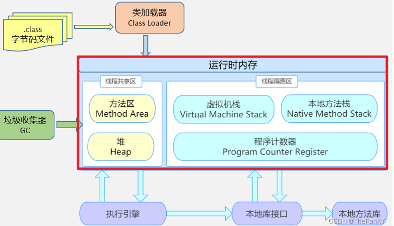
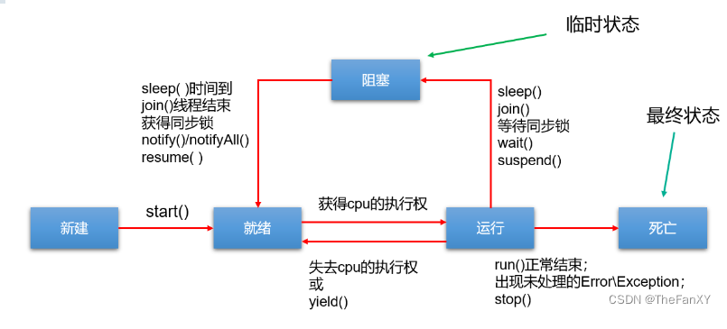

# 1. 相关概念

## 1.1 程序、进程与线程

- **程序（program）**：为完成特定任务，用某种语言编写的`一组指令的集合`。**即指`一段静态的代码`，静态对象。**
- **进程（process）**：**程序的一次执行过程，或是正在内存中运行的应用程序。**如：运行中的QQ，运行中的网易音乐播放器。
  - **每个进程都有一个独立的内存空间，系统运行一个程序即是一个进程从创建、运行到消亡的过程。（生命周期）**
  - **程序是静态的，进程是动态的**
  - **进程作为`操作系统调度和分配资源的最小单位`（亦是系统运行程序的基本单位）**，**系统在运行时会为每个进程分配不同的内存区域。**
  - 现代的操作系统，大都是支持多进程的，支持同时运行多个程序。比如：现在我们上课一边使用编辑器，一边使用录屏软件，同时还开着画图板，dos窗口等软件。
- **线程（thread）**：**进程可进一步细化为线程，是程序内部的`一条执行路径`。一个进程中至少有一个线程。**
  - **一个进程同一时间若`并行`执行多个线程**，**就是支持多线程的。**
  - **线程作为`CPU调度和执行的最小单位`。**
  - **一个进程中的多个线程共享相同的内存单元，它们从同一个堆中分配对象，可以访问相同的变量和对象。**这就使得线程间通信更简便、高效。**但多个线程操作共享的系统资源可能就会带来`安全的隐患`。**
  - 下图中，红框的蓝色区域为线程独享，黄色区域为线程共享。



**不同的进程之间是不共享内存的。**

**进程之间的数据交换和通信的成本很高。**

## 1.2 线程调度

- **分时调度**

  **所有线程`轮流使用` CPU 的使用权，并且平均分配每个线程占用 CPU 的时间。**

- **抢占式调度**

  让**`优先级高`的线程以`较大的概率`优先使用 CPU**。如果线程的**优先级相同**，**那么会随机选择一个(线程随机性)**，**Java使用的为抢占式调度。**

## 1.3 多线程程序的优点

**背景：**以单核CPU为例，只使用单个线程先后完成多个任务（调用多个方法），肯定比用多个线程来完成用的时间更短，为何仍需多线程呢？

**多线程程序的优点：**

1. 提高应用程序的响应。对图形化界面更有意义，可增强用户体验。
2. 提高计算机系统CPU的利用率
3. 改善程序结构。将既长又复杂的进程分为多个线程，独立运行，利于理解和修改

## 1.4 单核CPU和多核CPU

**单核CPU，在一个时间单元内，只能执行一个线程的任务。**例如，可以把CPU看成是医院的医生诊室，在一定时间内只能给一个病人诊断治疗。所以单核CPU就是，代码经过前面一系列的前导操作（类似于医院挂号，比如有10个窗口挂号），然后到`cpu`处执行时发现，就只有一个CPU（对应一个医生），大家排队执行。

这时候想要提升系统性能，只有两个办法，要么提升CPU性能（让医生看病快点），要么多加几个CPU（多整几个医生），即为多核的CPU。

`问题: 多核的效率是单核的倍数吗？`譬如4核A53的`cpu`，性能是单核A53的4倍吗？理论上是，但是实际不可能，至少有两方面的损耗。

- **`一个是多个核心的其他共用资源限制`。**譬如，4核CPU对应的内存、cache、寄存器并没有同步扩充4倍。这就好像医院一样，1个医生换4个医生，但是做B超检查的还是一台机器，性能瓶颈就从医生转到B超检查了。
- **`另一个是多核CPU之间的协调管理损耗`。**譬如多个核心同时运行两个相关的任务，需要考虑任务同步，这也需要消耗额外性能。好比公司工作，一个人的时候至少不用开会浪费时间，自己跟自己商量就行了。两个人就要开会同步工作，协调分配，所以工作效率绝对不可能达到2倍。

## 1.5 并行与并发

**并行（parallel）**：**指两个或多个事件在`同一时刻`发生（同时发生）。指在同一时刻，有`多条指令`在`多个CPU`上`同时`执行。**比如：多个人同时做不同的事。


 **并发（concurrency）**：**指两个或多个事件在`同一个时间段内`发生。即在一段时间内，有`多条指令`在`单个CPU`上`快速轮换、交替`执行，使得在宏观上具有多个进程同时执行的效果。**


**在操作系统中，启动了多个程序，`并发`指的是在一段时间内宏观上有多个程序同时运行，这在单核 CPU 系统中，每一时刻只能有一个程序执行，即微观上这些程序是分时的交替运行，只不过是给人的感觉是同时运行，那是因为分时交替运行的时间是非常短的。**

而在**多核 CPU 系统**中，则这些可以**`并发`执行的程序便可以分配到多个CPU上**，实现多任务并行执行，**即利用每个处理器来处理一个可以并发执行的程序，这样多个程序便可以同时执行。**目前电脑市场上说的多核 CPU，便是多核处理器，**核越多，`并行`处理的程序越多，能大大的提高电脑运行的效率。**

# 2.创建和启动线程

## 2.1 概述

- Java语言的JVM允许程序运行多个线程，使用**`java.lang.Thread`类代表线程**，所有的线程对象都必须是Thread类或其子类的实例
- **Thread类的特性**
  - 每个线程都是通过某个特定**Thread对象的run()方法**来完成操作的，**因此把run()方法体称为`线程执行体`**
  - 通过该**Thread对象的start()方法来启动这个线程**，而非直接调用**run()**
  - 要想实现多线程，**必须在主线程中创建新的线程对象**

## 2.2 方式1：继承Thread类

Java通过继承Thread类来**创建**并**启动多线程**的步骤如下：

1. 定义**Thread类的子类**，并**重写该类的run()方法**，该**run()方法的方法体就代表了线程需要完成的任务**
2. **创建Thread子类的实例，即创建了线程对象**
3. **调用线程对象的start()方法来启动该线程（也可以通过调用匿名对象生成子类并在内部重写run方法并调用start（）方法）**

```java
// 1.创建一个继承于Thread类的子类
class PrintNumber extends Thread{
    // 2.重写Thread类run() ————》将此线程要执行的操作，声明在此方法体中
    @Override
    public void run() {
        for (int i = 1; i <= 100; i++) {
            if(i % 2 == 0)
                System.out.println(i);
        }
    }
}
```


 **注意**

1. 如果自己**手动调用run()方法**，那么就**只是普通方法**，**没有启动多线程模式**
2. **run()方法由JVM调用**，什么时候调用，执行的过程控制都有**操作系统的CPU调度决定**。
3. 想要启动**多线程，必须调用start方法**
4. **一个线程对象只能调用一次start()方法启动**，如果**重复调用**了，则将抛出以上的异常**illegalThreadStateException**

## 2.3 方式2：实现Runnable接口

**Java有单继承的限制**，当我们**无法继承Thread类**时，那么该如何做呢？在核心类库中提供了Runnable接口，我们可以**实现Runnable接口**，**重写run()方法**，然后再通过Thread类的对象代理**启动和执行我们的线程体run()方法**

**步骤如下：**

1. **定义Runnable接口的实现类，并重写该接口的run()方法，该run()方法的方法体同样是该线程的线程执行体**
2. 创建**Runnable实现类的实例，并以此实例作为Thread的target参数来创建Thread对象，该Thread对象才是真正的线程对象**
3. **调用线程对象的start()方法**，**启动线程。调用Runnable接口实现类的run方法**

```java
public class ThreadTest {
    public static void main(String[] args) {
        //3 创建当前实现类的对象
        EvenNumberPrint p = new EvenNumberPrint();
        //4 将此对象作为参数传递到Thread类的构造器中，创建Thread实例
        Thread t1 = new Thread(p);
        //5 调用Thread实例的start()方法：1.启动线程 2.调用当前线程的run()
        t1.start();
        //main方法主线程的操作
        for (int i = 1; i <= 50; i++) {
            System.out.println(Thread.currentThread().getName() + ":" + i);
        }
    }
}
//1 创建一个实现Runnable接口的类
class EvenNumberPrint implements Runnable{
//2 重写Runnable接口的实现类的run()方法
    @Override
    public void run() {
        for (int i = 1; i <= 100; i++) {
            if(i % 2 == 0)
                System.out.println(Thread.currentThread().getName() + ":" + i);
        }
    }
}
```


 **匿名写法：**

```java
new Thread("新的线程！"){
	@Override
	public void run() {
		for (int i = 0; i < 10; i++) {
			System.out.println(getName()+"：正在执行！" + i);
		}
	}
}.start();

new Thread(new Runnable(){
	@Override
	public void run() {
		for (int i = 0; i < 10; i++) {
			System.out.println(Thread.currentThread().getName()+"：" + i);
		}
	}
}).start();
```


**说明：Runnable对象仅仅作为Thread对象的target，Runnable实现类里包含的run()方法仅作为线程执行体。 而实际的线程对象依然是Thread实例，只是该Thread线程负责执行其target的run()方法。**

## 2.4 对比两种方式

**联系**

**实际上，所有的多线程代码都是通过运行Thread的start()方法来运行的。因此，不管是继承Thread类还是实现 Runnable接口来实现多线程，最终还是通过Thread的对象的API来控制线程的。Thread类实际上也是实现了Runnable接口的类。即：**

```java
public class Thread extends Object implements Runnable
```


**区别**

- **继承Thread**：线程代码存放**Thread子类run方法中**。
- **实现Runnable**：线程代码存在**接口的子类的run方法**。

**实现Runnable接口比继承Thread类所具有的优势**

- **避免了单继承的局限性**
- **多个线程可以共享同一个接口实现类的对象，非常适合多个相同线程来处理同一份资源**
- **增加程序的健壮性，实现解耦操作，代码可以被多个线程共享，代码和线程独立**

# 3.Thread类的常用结构

## 3.1 构造器

```java
- public Thread() //分配一个新的线程对象
- public Thread(String name) //分配一个指定名字的新的线程对象
- public Thread(Runnable target) //指定创建线程的目标对象，它实现了Runnable接口中的run方法
- public Thread(Runnable target,String name) //分配一个带有指定目标新的线程对象并指定名字
```


## 3.2 常用方法系列1

```java
此线程要执行的任务在此处定义代码
public void run()

导致此线程开始执行; Java虚拟机调用此线程的run方法
public void start() 

获取当前线程名称
public String getName()

设置该线程名称
public void setName(String name)

返回对当前正在执行的线程对象的引用。在Thread子类中就是this，通常用于主线程和Runnable实现类
public static Thread currentThread()

使当前正在执行的线程以指定的毫秒数暂停（暂时停止执行）
public static void sleep(long millis)

yield只是让当前线程暂停一下，让系统的线程调度器重新调度一次，希望优先级与当前线程相同或更高
的其他线程能够获得执行机会，但是这个不能保证，完全有可能的情况是，当某个线程调用了yield方法
暂停之后，线程调度器又将其调度出来重新执行
public static void yield()
```


## 3.3 常用方法系列2

```java
测试线程是否处于活动状态。如果线程已经启动且尚未终止，则为活动状态。 
public final boolean isAlive()：

在线程A中通过线程B调用该方法,A等待该线程终止。 
void join() 

等待该线程终止的时间最长为 millis 毫秒。如果millis时间到，将不再等待。 
void join(long millis) 

等待该线程终止的时间最长为 millis 毫秒 + nanos 纳秒。 
void join(long millis, int nanos) ：

已过时，不建议使用。强行结束一个线程的执行，直接进入死亡状态。run()即刻停止，可能会导致
一些清理性的工作得不到完成，如文件，数据库等的关闭。同时，会立即释放该线程所持有的所有的
锁，导致数据得不到同步的处理，出现数据不一致的问题。
public final void stop()

这两个操作就好比播放器的暂停和恢复。二者必须成对出现，否则非常容易发生死锁。suspend()调
用会导致线程暂停，但不会释放任何锁资源，导致其它线程都无法访问被它占用的锁，直到调用
resume()。已过时，不建议使用。
void suspend() / void resume() 
```


## 3.3 常用方法系列3

每个线程都有一定的优先级，**同优先级线程组成先进先出队列（先到先服务）**，使用**分时调度策略**。**优先级高的线程采用抢占式策略**，获得**较多**的执行机会。**每个线程默认的优先级都与创建它的父线程具有相同的优先级。**

- Thread类的三个优先级常量：
  - **MAX_PRIORITY（10）：最高优先级**
  - **MIN _PRIORITY （1）：最低优先级**
  - **NORM_PRIORITY （5）：普通优先级，默认情况下main线程具有普通优先级**

- **public final int getPriority() ：返回线程优先级**
- **public final void setPriority(int newPriority)** ：**改变线程的优先级，范围在[1,10]之间**

## 3.4 守护线程（了解）

**见我的`juc`基础篇**

# **4. 多线程的生命周期**

**Java语言使用Thread类及其子类的对象来表示线程，在它的一个完整的生命周期中通常要经历如下一些状态：**

## 4.1 JDK1.5之前：5种状态

线程的生命周期有**五种状态**：**新建（New）、就绪（Runnable）、运行（Running）、阻塞（Blocked）、死亡（Dead）**。CPU需要在多条线程之间切换，于是线程状态会多次在运行、阻塞、就绪之间切换。



### 4.1.**1 新建**

当一个Thread类或其子类的对象被**声明并创建时**，新生的线程对象处于新建状态。此时它和其他Java对象一样，**仅仅由JVM为其分配了内存，并初始化了实例变量的值。此时的线程对象并没有任何线程的动态特征，程序也不会执行它的线程体run()**

### **4.1.2 就绪**

但是当线程对象调用了**start()方法**之后，就不一样了，线程就从新建状态转为**就绪状态**。**JVM会为其创建方法调用栈和程序计数器**，当然，处于这个状态中的线程并没有开始运行，只是表示已具备了运行的条件，**随时可以被调度**。至于什么时候被调度，**取决于JVM里线程调度器的调度**

> **注意：**
>
> 程序只能对新建状态的线程调用start()，并且只能调用一次，如果对非新建状态的线程，如已启动的线程或已死亡的线程调用start()都会报错`IllegalThreadStateException`异常。

### 4.1.3 运行

如果处于就绪状态的线程**获得了CPU资源**时，开始执行**run()方法的线程体代码**，则该线程处于运行状态。如果计算机只有**一个CPU核心**，在任何时刻只有**一个线程处于运行状态**，如果计算机有**多个核心**，将会有**多个线程并行(Parallel)执行**。

当然，美好的时光总是短暂的，而且CPU讲究雨露均沾。**对于抢占式策略的系统而言，系统会给每个可执行的线程一个小时间段来处理任务，当该时间用完，系统会剥夺该线程所占用的资源，让其回到就绪状态等待下一次被调度。**此时其他线程将获得执行机会，而在**选择下一个线程时，系统会适当考虑线程的优先级。**

### **4.1.4 阻塞**

当在运行过程中的线程遇到如下情况时，会让出 CPU 并临时中止自己的执行，进入阻塞状态：

- 线程调用了**sleep()方法**，**主动放弃所占用的CPU资源**
- 线程试图获取一个**同步监视器**，**但该同步监视器正被其他线程持有**
- 线程执行过程中，**同步监视器调用了wait()，让它等待某个通知（notify）**
- 线程执行过程中，**同步监视器调用了wait(time)**
- 线程执行过程中，**遇到了其他线程对象的加塞（join）**
- 线程被调用**suspend方法被挂起       (已过时，因为容易发生死锁）**

当前正在执行的线程被阻塞后，其他线程就有机会执行了。针对如上情况**，当发生如下情况时会解除阻塞，让该线程重新进入就绪状态，等待线程调度器再次调度它：**

- 线程的**sleep()时间到**
- **线程成功获得了同步监视器**
- 线程等到了**通知(notify)**
- **线程wait的时间到了**
- **加塞的线程结束了**
- 被挂起的线程**又被调用了resume恢复方法（已过时，因为容易发生死锁）**

### **4.1.5 死亡**

线程会以以下三种方式之一结束，结束后的线程就处于死亡状态：

- **run()方法执行完成，线程正常结束**
- **线程执行过程中抛出了一个未捕获的异常（Exception）或错误（Error）**
- **直接调用该线程的stop()来结束该线程（已过时）**

##  4.2 JDK1.5及之后：6种状态

**在java.lang.Thread.State的枚举类中这样定义：**

```java
public enum State {
	NEW,
	RUNNABLE,
	BLOCKED,
	WAITING,
	TIMED_WAITING,
	TERMINATED;
}
```

- **`NEW（新建）`：**线程刚被创建，但是并未启动。还没调用start方法。
- **`RUNNABLE（可运行）`：**这里没有区分就绪和运行状态。因为**对于Java对象来说，只能标记为可运行**，至于**什么时候运行**，不是JVM来控制的了，是**OS来进行调度的**，而且时间非常短暂，因此对于Java对象的状态来说，无法区分。
- **`Teminated（被终止）`：**表明此线程已经**结束生命周期，终止运行**。
- 重点说明，根据**`Thread.State`**的定义，**阻塞状态分为三种**：**`BLOCKED`、`WAITING`、`TIMED_WAITING`。**
  - **`BLOCKED（锁阻塞）`**：在API中的介绍为：一个正在阻塞、等待一个监视器锁（锁对象）的线程处于这一状态。只有获得锁对象的线程才能有执行机会。
    - 比如，线程A与线程B代码中使用同一锁，如果线程A获取到锁，线程A进入到Runnable状态，那么线程B就进入到Blocked锁阻塞状态。
  - **`TIMED_WAITING（计时等待）`**：在API中的介绍为：一个正在限时等待另一个线程执行一个（唤醒）动作的线程处于这一状态。
    - 当前线程执行过程中遇到Thread类的`sleep`或`join`，Object类的`wait`，LockSupport类的`park`方法，并且在调用这些方法时，`设置了时间`，那么当前线程会进入TIMED_WAITING，直到时间到，或被中断。
  - **`WAITING（无限等待）`**：在API中介绍为：一个正在无限期等待另一个线程执行一个特别的（唤醒）动作的线程处于这一状态。
    - 当前线程执行过程中遇到遇到Object类的`wait`，Thread类的`join`，`LockSupport`类的`park`方法，并且在调用这些方法时，`没有指定时间`，那么当前线程会进入WAITING状态，直到被唤醒。
      - 通过Object类的wait进入WAITING状态的要有Object的notify/notifyAll唤醒；
      - 通过Condition的await进入WAITING状态的要有Condition的signal方法唤醒；
      - 通过`LockSupport`类的park方法进入WAITING状态的要有`LockSupport`类的`unpark`方法唤醒
      - 通过Thread类的join进入WAITING状态，只有调用join方法的线程对象结束才能让当前线程恢复；

说明：当从WAITING或TIMED_WAITING恢复到Runnable状态时，如果发现当前线程没有得到监视器锁，那么会立刻转入BLOCKED状态。

# 5. 线程安全问题及解决

当我们使用多个线程访问**同一资源**（可以是同一个变量、同一个文件、同一条记录等）的时候，若多个线程**`只有读操作`**，那么不会发生线程安全问题。但是如果多个线程中对资源有**`读和写`**的操作，就容易出现线程安全问题。

## 5.1 同步机制解决线程安全问题

要解决上述多线程并发访问一个资源的安全性问题:也就是解决重复票与不存在票问题，**Java中提供了同步机制 (synchronized)来解决。** 

### 5.1.1 同步锁机制

在《Thinking in Java》中，是这么说的：对于并发工作，你需要某种方式来防止**两个任务访问相同的资源（其实就是共享资源竞争）**。 防止这种冲突的方法就是当资源被一个任务使用时，在其上加锁。第一个访问某项资源的任务必须**锁定**这项资源，使其他任务在其被解锁之前，就无法访问它了，而在其被**解锁**之时，另一个任务就可以锁定并使用它了。

### 5.1.2 同步机制解决线程安全问题的原理

同步机制的原理，其实就相当于给某段代码加“锁”，任何线程想要执行这段代码，都要先获得“锁”，我们称它为同步锁。因为Java对象在堆中的数据分为分为**对象头、实例变量、空白的填充。**而对象头中包含：

- **Mark Word：记录了和当前对象有关的GC、锁标记等信息。**
- **指向类的指针：每一个对象需要记录它是由哪个类创建出来的。**
- **数组长度（只有数组对象才有）**

**哪个线程获得了“同步锁”对象之后，”同步锁“对象就会记录这个线程的ID，这样其他线程就只能等待了，除非这个线程”释放“了锁对象，其他线程才能重新获得/占用”同步锁“对象。**

### 5.1.3 同步代码块和同步方法

```java
同步代码块：synchronized 关键字可以用于某个区块前面，表示只对这个区块的资源实行互斥访问。
synchronized(同步锁){
     需要同步操作的代码
}

同步方法：synchronized 关键字直接修饰方法，表示同一时刻只有一个线程能进入这个方法，其他线
程在外面等着。
public synchronized void method(){
    可能会产生线程安全问题的代码
}
```


### 5.1.4 synchronized的锁是什么

同步锁对象可以是任意类型，但是必须保证竞争“同一个共享资源”的多个线程必须使用同一个“同步锁对象”。

**对于同步代码块来说，同步锁对象是由程序员手动指定的（很多时候也是指定为this或类名.class），但是对于同步方法来说，同步锁对象只能是默认的：**

- **静态方法：当前类的Class对象（类名.class）**
- **非静态方法：this**

### 5.1.5 同步操作的思考顺序

1、如何找问题，即代码是否存在线程安全？**（非常重要）**

**（1）明确哪些代码是多线程运行的代码 （2）明确多个线程是否有共享数据 （3）明确多线程运行代码中是否有多条语句操作共享数据**

2、如何解决呢？**（非常重要）**

**对多条操作共享数据的语句，只能让一个线程都执行完，在执行过程中，其他线程不可以参与执行。 即所有操作共享数据的这些语句都要放在同步范围中**

3、切记：

**范围太小：不能解决安全问题**

**范围太大：因为一旦某个线程抢到锁，其他线程就只能等待，所以范围太大，效率会降低，不能合理利用CPU资源。**

## 5.2 代码演示

```java
示例一：静态方法加锁
class TicketSaleThread extends Thread{
    private static int ticket = 100;
    public void run(){//直接锁这里，肯定不行，会导致，只有一个窗口卖票
        while (ticket > 0) {
            saleOneTicket();
        }
    }
    //锁对象是TicketSaleThread类的Class对象，而一个类的Class对象在内存中肯定只有一个
    public synchronized static void saleOneTicket(){
        //不加条件，相当于条件判断没有进入锁管控，线程安全问题就没有解决
        if(ticket > 0) {
            System.out.println(Thread.currentThread().getName() + "卖出一张票，票号:" + ticket);
            ticket--;
        }
    }
}
public class SaleTicketDemo3 {
    public static void main(String[] args) {
        TicketSaleThread t1 = new TicketSaleThread();
        TicketSaleThread t2 = new TicketSaleThread();
        TicketSaleThread t3 = new TicketSaleThread();

        t1.setName("窗口1");
        t2.setName("窗口2");
        t3.setName("窗口3");

        t1.start();
        t2.start();
        t3.start();
    }
}
```


```java
示例二：非静态方法加锁
public class SaleTicketDemo4 {
    public static void main(String[] args) {
        TicketSaleRunnable tr = new TicketSaleRunnable();
        Thread t1 = new Thread(tr, "窗口一");
        Thread t2 = new Thread(tr, "窗口二");
        Thread t3 = new Thread(tr, "窗口三");

        t1.start();
        t2.start();
        t3.start();
    }
}

class TicketSaleRunnable implements Runnable {
    private int ticket = 100;

    public void run() {//直接锁这里，肯定不行，会导致，只有一个窗口卖票
        while (ticket > 0) {
            saleOneTicket();
        }
    }
    //锁对象是this，这里就是TicketSaleRunnable对象，因为上面3个线程使用同一个
    //TicketSaleRunnable对象，所以可以
    public synchronized void saleOneTicket() {
        //不加条件，相当于条件判断没有进入锁管控，线程安全问题就没有解决
        if (ticket > 0) {
            System.out.println(Thread.currentThread().getName() + "卖出一张票，票号:" + ticket);
            ticket--;
        }
    }
}
```


```java
示例三：同步代码块
public class SaleTicketDemo5 {
    public static void main(String[] args) {
        //2、创建资源对象
        Ticket ticket = new Ticket();

        //3、启动多个线程操作资源类的对象
        Thread t1 = new Thread("窗口一") {
        //不能给run()直接加锁，因为t1,t2,t3的三个run方法分别属于三个Thread类对象，
            public void run() {
                // run方法是非静态方法，那么锁对象默认选this，那么锁对象根本不是同一个
                while (true) {
                    synchronized (ticket) {
                        ticket.sale();
                    }
                }
            }
        };
        Thread t2 = new Thread("窗口二") {
            public void run() {
                while (true) {
                    synchronized (ticket) {
                        ticket.sale();
                    }
                }
            }
        };
        Thread t3 = new Thread(new Runnable() {
            public void run() {
                while (true) {
                    synchronized (ticket) {
                        ticket.sale();
                    }
                }
            }
        }, "窗口三");


        t1.start();
        t2.start();
        t3.start();
    }
}

//1、编写资源类
class Ticket {
    private int ticket = 1000;

    public void sale() {//也可以直接给这个方法加锁，锁对象是this，这里就是Ticket对象
        if (ticket > 0) {
            System.out.println(Thread.currentThread().getName() + "卖出一张票，票号:" + ticket);
            ticket--;
        } else {
            throw new RuntimeException("没有票了");
        }
    }

    public int getTicket() {
        return ticket;
    }
}
```


## 5.3 练习

**银行有一个账户。 有两个储户分别向同一个账户存3000元，每次存1000，存3次。每次存完打印账户余额。问题：该程序是否有安全问题，如果有，如何解决？**

```java
public class AccountTest {
    public static void main(String[] args) {

        Account acct = new Account();
        Customer customer1 = new Customer(acct, "甲");
        Customer customer2 = new Customer(acct, "乙");

        customer1.start();
        customer2.start();

    }
}

class Account {//账户
    private double balance;//余额

    //this 是唯一的（acct）只new了一个 线程安全
    public synchronized void deposit(double amt) {
        //这里在同步方法内睡，未解锁故其他线程也无法执行同步方法
        try {
            Thread.sleep(1000);
        } catch (InterruptedException e) {
            e.printStackTrace();
        }
        if (amt > 0) {
            balance += amt;
        }

        System.out.println(Thread.currentThread().getName() + "存钱1000，余额为: " + balance);
    }
}

class Customer extends Thread {
    Account account;
    private String name;

    public Customer(Account account, String name) {
        super(name);
        this.account = account;
    }

    @Override
    public void run() {
        for (int i = 0; i < 3; i++) {
            //这里的sleep是为了体现线程交互
            try {
                Thread.sleep(1);
            } catch (InterruptedException e) {
                e.printStackTrace();
            }

            account.deposit(1000);

        }
    }
}
```


## 6. 再谈同步

### 6.1 单例设计模式的线程安全问题

### 6.1.1 饿汉式没有线程安全问题

**饿汉式：在类初始化时就直接创建单例对象**，而类初始化过程是**没有线程安全问题的**

**1. 形式一：**

```java
public class HungrySingle {
    //对象是否声明为final 都可以
    private static HungrySingle INSTANCE = new HungrySingle();
    
    private HungrySingle(){}
    
    public static HungrySingle getInstance(){
        return INSTANCE;
    }
}
```


**2. 形式二：**  

```java
/*
public class HungryOne{
    public static final HungryOne INSTANCE = new HungryOne();
    private HungryOne(){}
}*/

public enum HungryOne{
    INSTANCE
}
```


### 6.1.2 懒汉式线程安全问题

**懒汉式：延迟创建对象**，**第一次调用`getInstance`方法再创建对象**

**1. 形式一：**

```java
public class LazyOne {
    private static LazyOne instance;

    private LazyOne(){}

    //方式1：
    public static synchronized LazyOne getInstance1(){
        if(instance == null){
            instance = new LazyOne();
        }
        return instance;
    }
    //方式2：
    public static LazyOne getInstance2(){
        synchronized(LazyOne.class) {
            if (instance == null) {
                instance = new LazyOne();
            }
            return instance;
        }
    }
    //方式3：
    public static LazyOne getInstance3(){
        if(instance == null){
            synchronized (LazyOne.class) {
                try {
                    Thread.sleep(10);//加这个代码，暴露问题
                } catch (InterruptedException e) {
                    e.printStackTrace();
                }
                if(instance == null){
                    instance = new LazyOne();
                }
            }
        }

        return instance;
    }
    /*
    注意：上述方式3中，有指令重排问题
    mem = allocate(); 为单例对象分配内存空间
    instance = mem;   instance引用现在非空，但还未初始化
    ctorSingleton(instance); 为单例对象通过instance调用构造器
    从JDK2开始，分配空间、初始化、调用构造器会在线程的工作存储区一次性完成，然后复制
    到主存储区。但是需要volatile关键字，避免指令重排。
    */
}
```


**形式二：使用内部类**

```java
public class LazySingle {
    private LazySingle(){}
    
    public static LazySingle getInstance(){
        return Inner.INSTANCE;
    }
    
    private static class Inner{
        static final LazySingle INSTANCE = new LazySingle();
    }
    
}
```


>  **内部类只有在外部类被调用才加载，产生INSTANCE实例；又不用加锁。**
>
> **此模式具有之前两个模式的优点，同时屏蔽了它们的缺点，是最好的单例模式。**
>
> **此时的内部类，使用enum进行定义，也是可以的。**

## 6.2 死锁

**不同的线程分别占用对方需要的同步资源不放弃，都在等待对方放弃自己需要的同步资源，就形成了线程的死锁。 一旦出现死锁，整个程序既不会发生异常，也不会给出任何提示，只是所有线程处于阻塞状态，无法继续。**


**诱发死锁的原因：**

- **互斥条件**
- **占用且等待**
- **不可抢夺（或不可抢占）**
- **循环等待**

**以上4个条件，同时出现就会触发死锁。**

**解决死锁：**

死锁一旦出现，基本很难人为干预，只能尽量规避。可以考虑打破上面的诱发条件。

**针对条件1：互斥条件基本上无法被破坏。因为线程需要通过互斥解决安全问题。**

**针对条件2：可以考虑一次性申请所有所需的资源，这样就不存在等待的问题。**

**针对条件3：占用部分资源的线程在进一步申请其他资源时，如果申请不到，就主动释放掉已经占用的资源。**

**针对条件4：可以将资源改为线性顺序。申请资源时，先申请序号较小的，这样避免循环等待问题。**

## 6.3 JDK5.0新特性：Lock(锁)

- **JDK5.0的新增功能，保证线程的安全。与采用synchronized相比，Lock可提供多种锁方案，更灵活、更强大。Lock通过显式定义同步锁对象来实现同步。同步锁使用Lock对象充当。**
- **`java.util.concurrent.locks.Lock`**接口是控制多个线程对共享资源进行访问的工具。锁提供了对共享资源的独占访问，每次只能有一个线程对Lock对象加锁，线程开始访问共享资源之前应先获得Lock对象。
- **在实现线程安全的控制中，比较常用的是`ReentrantLock`，可以显式加锁、释放锁。**
  - **ReentrantLock类实现了 Lock 接口，它拥有与 synchronized 相同的并发性和内存语义，但是添加了类似锁投票、定时锁等候和可中断锁等候的一些特性。此外，它还提供了在激烈争用情况下更佳的性能。**
- **Lock锁也称同步锁，加锁与释放锁方法，如下：**
  - **public void lock() :加同步锁**
  - **public void unlock() :释放同步锁**

```java
class A{
    //1. 创建Lock的实例，必须确保多个线程共享同一个Lock实例
	private final ReentrantLock lock = new ReenTrantLock();
	public void m(){
        //2. 调动lock()，实现需共享的代码的锁定
		lock.lock();
		try{
			//保证线程安全的代码;
		}
		finally{
            //3. 调用unlock()，释放共享代码的锁定
			lock.unlock();  
		}
	}
}
```


# 7. 线程的通信

### 7.1 线程间通信

**为什么要处理线程间通信：**

当我们`需要多个线程`来共同完成一件任务，并且我们希望他们`有规律的执行`，那么多线程之间需要一些通信机制，可以协调它们的工作，以此实现多线程共同操作一份数据。

比如：线程A用来生产包子的，线程B用来吃包子的，包子可以理解为同一资源，线程A与线程B处理的动作，一个是生产，一个是消费，此时B线程必须等到A线程完成后才能执行，那么线程A与线程B之间就需要线程通信，即—— **等待唤醒机制。**

### 7.2 等待唤醒机制

这是多个线程间的一种`协作机制`。谈到线程我们经常想到的是线程间的`竞争（race）`，比如去争夺锁，但这并不是故事的全部，线程间也会有协作机制。

在一个线程满足某个条件时，就进入**等待状态（`wait() / wait(time)`）**， 等待其他线程执行完他们的指定代码过后再将其**唤醒（`notify()`）**;或可以指定wait的时间，等时间到了自动唤醒；在有多个线程进行等待时，如果需要，可以使用 **`notifyAll()`**来唤醒所有的等待线程。wait/notify 就是线程间的一种协作机制。

1. **wait：线程不再活动，不再参与调度，进入 `wait set` 中，因此不会浪费 CPU 资源，也不会去竞争锁了，这时的线程状态是 WAITING 或 TIMED_WAITING。它还要等着别的线程执行一个`特别的动作`，也即“`通知（notify）`”或者等待时间到，在这个对象上等待的线程从wait set 中释放出来，重新进入到调度队列（`ready queue`）中**
2. **notify：则选取所通知对象的 wait set 中的一个线程释放；**
3. **notifyAll：则释放所通知对象的 wait set 上的全部线程。**

> 注意：
>
> 被通知的线程被唤醒后也不一定能立即恢复执行，因为它当初中断的地方是在同步块内，而此刻它已经不持有锁，所以它需要再次尝试去获取锁（很可能面临其它线程的竞争），成功后才能在当初调用 wait 方法之后的地方恢复执行。
>
> 总结如下：
>
> - 如果能获取锁，线程就从 WAITING 状态变成 RUNNABLE（可运行） 状态；
> - 否则，线程就从 WAITING 状态又变成 BLOCKED（等待锁） 状态

##  7.3 举例

**例题：使用两个线程打印 1-100。线程1, 线程2 交替打印**

```java
class Communication implements Runnable {
    int i = 1;
    public void run() {
        while (true) {
            synchronized (this) {
                notify();
                if (i <= 100) {
                    System.out.println(Thread.currentThread().getName() + ":" + i++);
                } else
                    break;
                try {
                    wait();
                } catch (InterruptedException e) {
                    e.printStackTrace();
                }
            }
        }
    }
}
```


### 7.4 调用wait和notify需注意的细节

1. wait方法与notify方法必须要由**`同一个锁对象调用`**。因为：对应的锁对象可以通过notify唤醒使用同一个锁对象调用的wait方法后的线程。
2. **wait方法与notify方法是属于Object类的方法的**。**因为：锁对象可以是任意对象，而任意对象的所属类都是继承了Object类的。**
3. **wait方法与notify方法必须要在`同步代码块`或者是`同步函数`中使用。**因为：必须要`通过**锁对象**`调用这2个方法。否则会报java.lang.IllegalMonitorStateException异常。

### 7.5 生产者与消费者问题

等待唤醒机制可以解决经典的“生产者与消费者”的问题。生产者与消费者问题（英语：Producer-consumer problem），也称有限缓冲问题（英语：Bounded-buffer problem），是一个多线程同步问题的经典案例。该问题描述了两个（多个）`共享固定大小缓冲区的线程`——即所谓的“生产者”和“消费者”——在实际运行时会发生的问题。

生产者的主要作用是生成一定量的数据放到缓冲区中，然后重复此过程。与此同时，消费者也在缓冲区消耗这些数据。**该问题的关键就是要保证生产者不会在缓冲区满时加入数据，消费者也不会在缓冲区中空时消耗数据。**

**举例：**

**生产者(Productor)将产品交给店员(Clerk)，而消费者(Customer)从店员处取走产品**，店员一次只能持有固定数量的产品(比如:20），如果生产者试图生产更多的产品，店员会叫生产者停一下，如果店中有空位放产品了再通知生产者继续生产；如果店中没有产品了，店员会告诉消费者等一下，如果店中有产品了再通知消费者来取走产品。

类似的场景，比如厨师和服务员等。

**生产者与消费者问题中其实隐含了两个问题：**

- **线程安全问题**：因为生产者与消费者共享数据缓冲区，产生安全问题。不过这个问题可以使用同步解决。
- **线程的协调工作问题**：
  - 要解决该问题，就必须让生产者线程在缓冲区满时等待(wait)，暂停进入阻塞状态，等到下次消费者消耗了缓冲区中的数据的时候，通知(notify)正在等待的线程恢复到就绪状态，重新开始往缓冲区添加数据。同样，也可以让消费者线程在缓冲区空时进入等待(wait)，暂停进入阻塞状态，等到生产者往缓冲区添加数据之后，再通知(notify)正在等待的线程恢复到就绪状态。通过这样的通信机制来解决此类问题。

**代码实现：**

```java
public class ConsumerProducerTest {
	public static void main(String[] args) {
		Clerk clerk = new Clerk();
		Producer p1 = new Producer(clerk);
		
		Consumer c1 = new Consumer(clerk);
		Consumer c2 = new Consumer(clerk);
		
		p1.setName("生产者1");
		c1.setName("消费者1");
		c2.setName("消费者2");
		
		p1.start();
		c1.start();
		c2.start();
	}
}

//生产者
class Producer extends Thread{
	private Clerk clerk;
	
	public Producer(Clerk clerk){
		this.clerk = clerk;
	}
	
	@Override
	public void run() {
		
		System.out.println("=========生产者开始生产产品========");
		while(true){
			
			try {
				Thread.sleep(40);
			} catch (InterruptedException e) {
				e.printStackTrace();
			}
			
			//要求clerk去增加产品
			clerk.addProduct();
		}
	}
}

//消费者
class Consumer extends Thread{
	private Clerk clerk;
	
	public Consumer(Clerk clerk){
		this.clerk = clerk;
	}
	@Override
	public void run() {
		System.out.println("=========消费者开始消费产品========");
		while(true){
			
			try {
				Thread.sleep(90);
			} catch (InterruptedException e) {
				e.printStackTrace();
			}
			
			//要求clerk去减少产品
			clerk.minusProduct();
		}
	}
}

//资源类
class Clerk {
	private int productNum = 0;//产品数量
	private static final int MAX_PRODUCT = 20;
	private static final int MIN_PRODUCT = 1;
	
	//增加产品
	public synchronized void addProduct() {
		if(productNum < MAX_PRODUCT){
			productNum++;
			System.out.println(Thread.currentThread().getName() + 
					"生产了第" + productNum + "个产品");
			//唤醒消费者
			this.notifyAll();
		}else{
			
			try {
				this.wait();
			} catch (InterruptedException e) {
				e.printStackTrace();
			}
		}
	}

	//减少产品
	public synchronized void minusProduct() {
		if(productNum >= MIN_PRODUCT){
			System.out.println(Thread.currentThread().getName() + 
					"消费了第" + productNum + "个产品");
			productNum--;
			
			//唤醒生产者
			this.notifyAll();
		}else{
			
			try {
				this.wait();
			} catch (InterruptedException e) {
				e.printStackTrace();
			}
		}
	}
	
}
```


## 7.6 面试题：区分sleep()和wait()

相同点：**一旦执行，都会使得当前线程结束执行状态，进入阻塞状态。**

不同点：

① **定义方法所属的类：**sleep():Thread中定义。 wait():Object中定义

② **使用范围的不同：**sleep()可以在任何需要使用的位置被调用； wait():必须使用在同步代码块或同步方法中

③ **都在同步结构中使用的时候**，**是否释放同步监视器的操作不同：sleep():不会释放同步监视器 ;wait():会释放同步监视器**

④ **结束等待的方式不同**：**sleep()：指定时间一到就结束阻塞。 wait():可以指定时间也可以无限等待直到notify或notifyAll。**

## 7.7 是否释放锁的操作

任何线程进入同步代码块、同步方法之前，必须先获得对同步监视器的锁定，那么何时会释放对同步监视器的锁定呢？

### **7.7.1 释放锁的操作**

当前线程的同步方法、同步代码块**执行结束**。

当前线程在同步代码块、同步方法中遇到**break、return终止了该代码块、该方法的继续执行**。

当前线程在同步代码块、同步方法中**出现了未处理的Error或Exception，导致当前线程异常结束。**

当前线程在同步代码块、同步方法中**执行了锁对象的wait()方法，当前线程被挂起，并释放锁。**

### 7.7.2 不会释放锁的操作

线程执行同步代码块或同步方法时，程序调用**Thread.sleep()、Thread.yield()**方法暂停当前线程的执行。

线程执行同步代码块时，其他线程调用了该线程的**suspend()方法**将该该线程挂起，该线程不会释放锁（同步监视器）。

- **应尽量避免使用suspend()和resume()这样的过时来控制线程。**

# 8. JDK5.0新增线程创建方式

## 8.1 新增方式一：实现Callable接口

- 与使用Runnable相比， Callable功能更强大些
  - **相比run()方法，可以有返回值**
  - **方法可以抛出异常**
  - **支持泛型的返回值（需要借助FutureTask类，获取返回结果）**
- Future接口（了解）
  - **可以对具体Runnable、Callable任务的执行结果进行取消、查询是否完成、获取结果等。**
  - **FutureTask是Futrue接口的唯一的实现类**
  - **FutureTask 同时实现了Runnable, Future接口。它既可以作为Runnable被线程执行，又可以作为Future得到Callable的返回值**
- **缺点：在获取分线程执行结果的时候，当前线程（或是主线程）受阻塞，效率较低。**
- 代码举例

```java
/*
 * 创建多线程的方式三：实现Callable （jdk5.0新增的）
 */
//1.创建一个实现Callable的实现类
class NumThread implements Callable {
    //2.实现call方法，将此线程需要执行的操作声明在call()中
    @Override
    public Object call() throws Exception {
        int sum = 0;
        for (int i = 1; i <= 100; i++) {
            if (i % 2 == 0) {
                System.out.println(i);
                sum += i;
            }
        }
        return sum;
    }
}

public class CallableTest {
    public static void main(String[] args) {
        //3.创建Callable接口实现类的对象
        NumThread numThread = new NumThread();

        //4.将此Callable接口实现类的对象作为传递到FutureTask构造器中，创建FutureTask的对象
        FutureTask futureTask = new FutureTask(numThread);
        //5.将FutureTask的对象作为参数传递到Thread类的构造器中，创建Thread对象，并调用start()
        new Thread(futureTask).start();

//      接收返回值
        try {
            //6.获取Callable中call方法的返回值
            //get()返回值即为FutureTask构造器参数Callable实现类重写的call()的返回值。
            Object sum = futureTask.get();
            System.out.println("总和为：" + sum);
        } catch (InterruptedException e) {
            e.printStackTrace();
        } catch (ExecutionException e) {
            e.printStackTrace();
        }
    }
}
```


## 8.2 新增方式二：使用线程池

**现有问题：**

如果并发的线程数量很多，并且每个线程都是执行一个时间很短的任务就结束了，这样频繁创建线程就会大大降低系统的效率，因为频繁创建线程和销毁线程需要时间。

**那么有没有一种办法使得线程可以复用，即执行完一个任务，并不被销毁，而是可以继续执行其他的任务？**

**思路：提前创建好多个线程，放入线程池中，使用时直接获取，使用完放回池中。可以避免频繁创建销毁、实现重复利用。类似生活中的公共交通工具。**

编辑

**好处：**

- **提高响应速度（减少了创建新线程的时间）**
- **降低资源消耗（重复利用线程池中线程，不需要每次都创建）**
- **便于线程管理**
  - **corePoolSize**：**核心池的大小**
  - **maximumPoolSize**：**最大线程数**
  - **keepAliveTime：线程没有任务时最多保持多长时间后会终止**
  - …

**线程池相关API**

- **JDK5.0之前，我们必须手动自定义线程池。从JDK5.0开始，Java内置线程池相关的API**。**在java.util.concurrent包下提供了线程池相关API：`ExecutorService` 和 `Executors`。**
- **`ExecutorService`**：**真正的线程池接口。常见子类ThreadPoolExecutor**
  - **`void execute(Runnable command)`** ：**执行任务/命令，没有返回值，一般用来执行Runnable**
  - **`<T> Future<T> submit(Callable<T> task)`**：**执行任务，有返回值，一般又来执行Callable**
  - **`void shutdown()`** ：**关闭连接池**
- **`Executors`**：**一个线程池的工厂类，通过此类的静态工厂方法可以创建多种类型的线程池对象。**
  - **`Executors.newCachedThreadPool()`**：**创建一个可根据需要创建新线程的线程池**
  - **`Executors.newFixedThreadPool(int nThreads)`**; **创建一个可重用固定线程数的线程池**
  - **`Executors.newSingleThreadExecutor()`** ：**创建一个只有一个线程的线程池**
  - **`Executors.newScheduledThreadPool(int corePoolSize)`：****创建一个线程池，它可安排在给定延迟后运行命令或者定期地执行。**

**代码举例：**

```java
class NumberThread implements Runnable{

    @Override
    public void run() {
        for(int i = 0;i <= 100;i++){
            if(i % 2 == 0){
                System.out.println(Thread.currentThread().getName() + ": " + i);
            }
        }
    }
}

class NumberThread1 implements Runnable{

    @Override
    public void run() {
        for(int i = 0;i <= 100;i++){
            if(i % 2 != 0){
                System.out.println(Thread.currentThread().getName() + ": " + i);
            }
        }
    }
}

class NumberThread2 implements Callable {
    @Override
    public Object call() throws Exception {
        int evenSum = 0;//记录偶数的和
        for(int i = 0;i <= 100;i++){
            if(i % 2 == 0){
                evenSum += i;
            }
        }
        return evenSum;
    }

}

public class ThreadPoolTest {

    public static void main(String[] args) {
        //1. 提供指定线程数量的线程池
        ExecutorService service = Executors.newFixedThreadPool(10);
        ThreadPoolExecutor service1 = (ThreadPoolExecutor) service;
//        //设置线程池的属性
//        System.out.println(service.getClass());//ThreadPoolExecutor
        service1.setMaximumPoolSize(50); //设置线程池中线程数的上限

        //2.执行指定的线程的操作。需要提供实现Runnable接口或Callable接口实现类的对象
        service.execute(new NumberThread());//适合适用于Runnable
        service.execute(new NumberThread1());//适合适用于Runnable

        try {
            Future future = service.submit(new NumberThread2());//适合使用于Callable
            System.out.println("总和为：" + future.get());
        } catch (Exception e) {
            e.printStackTrace();
        }
        //3.关闭连接池
        service.shutdown();
    }

}
```


# 9. JDK5.0新增线程创建方式

## 9.1 线程概述

### 9.1.1 线程和进程有什么区别(*团、腾*、*云网络、神**岳、言*有物、直*科技)

```java
进程：对应一个运行中的程序。

线程：运行中的进程的一条或多条执行路径。
```


### 9.1.2 多线程使用场景（嘉*医疗）

```java
手机app应用的图片的下载

迅雷的下载

Tomcat服务器上web应用，多个客户端发起请求，Tomcat针对多个请求开辟多个线程处理
```


## 9.2 如何实现多线程

### 9.2.1. 如何在Java中出实现多线程？(阿*校招、当*置业、鸿*网络、奥*医药、*科软、慧*、上海驿*软件、海*科)

> ```
> 类似问题：
> > 创建多线程用Runnable还是Thread(北京中*瑞飞)
> > 多线程有几种实现方法，都是什么？（锐*（上海）企业管理咨询）
> ```

```java
四种。见上面。
```


### 9.2.2. Thread类中的start()和run()有什么区别？(北京中油**、爱*信、神*泰岳、直*科技，*软国际，上海*学网络)

```java
start()：① 开启线程 ② 调用线程的run()
```


### 9.2.3. Java中Runnable和Callable有什么不同？(平*金服、银*数据、好*在、亿*征信、花儿**网络)

```java
与之前的方式的对比：与Runnable方式的对比的好处
> call()可以有返回值，更灵活
> call()可以使用throws的方式处理异常，更灵活
> Callable使用了泛型参数，可以指明具体的call()的返回值类型，更灵活

有缺点吗？如果在主线程中需要获取分线程call()的返回值，则此时的主线程是阻塞状态的。
```


### 9.2.4. 什么是线程池，为什么要使用它？(上海明*物联网科技)

```java
此方式的好处：
> 提高了程序执行的效率。（因为线程已经提前创建好了）
> 提高了资源的复用率。（因为执行完的线程并未销毁，而是可以继续执行其他的任务）
> 可以设置相关的参数，对线程池中的线程的使用进行管理
```


## 9.3 常用方法、生命周期

### 9.3.1. sleep() 和 yield()区别？(神*泰岳)

```java
sleep()：一旦调用，就进入“阻塞”（或TIMED_WAITING状态）

yield():释放cpu的执行权，处在RUNNABLE的状态
```


### 9.3.2. 线程创建的中的方法、属性情况？(招通**、数*互融)

略

### 9.3.3. 线程的生命周期？(中国**电子商务中心、*科软、慧*)

略

### 9.3.4. 线程的基本状态以及状态之间的关系？(直*科技)

> ```
> 类似问题：
> > 线程有哪些状态？如何让线程进入阻塞？（华*中*，*兴）
> > 线程有几个状态，就绪和阻塞有什么不同。（美*）
> > Java的线程都有哪几种状态（字*跳动、*东、*手）
> ```

### 9.3.5. stop()和suspend()方法为何不推荐使用？（上海驿*软件）

> stop()：一旦执行，线程就结束了，导致run()有未执行结束的代码。**stop()会导致释放同步监视器，导致线程安全问题。**
>
> suspend()：与resume()搭配使用，导致死锁。

### 9.3.6. Java 线程优先级是怎么定义的？（软*动力）

> **三个常量。[1,10]**

### 9.4 线程安全与同步机制

### 9.4.1. 你如何理解线程安全的？线程安全问题是如何造成的？（*软国际）

> ```
> 类似问题：
> > 线程安全说一下？（奥*医药）
> > 对线程安全的理解（*度校招）
> > 什么是线程安全？(银*数据)
> ```

### 9.4.2. 多线程共用一个数据变量需要注意什么？（史*夫软件）

> 线程安全问题

### 9.4.3. 多线程保证线程安全一般有几种方式？（来*科技、北京*信天*）

> ```
> 类似问题：
> > 如何解决其线程安全问题，并且说明为什么这样子去解决？（北京联合**）
> > 请说出你所知道的线程同步的方法。（天*伟业）
> > 哪些方法实现线程安全？（阿*）   
> > 同步有几种实现方法，都是什么? （锐*企业管理咨询）
> > 你在实际编码过程中如何避免线程安全问题？（*软国际）
> > 如何让线程同步?（*手）
> > 多线程下有什么同步措施（阿*校招）
> > 同步有几种实现方法，都是什么？（海*科）
> ```
>
> - 同步机制
> - Lock接口

### 9.4.4. 用什么关键字修饰同步方法?（上海驿*软件）

> **synchronized**

### 9.4.5. synchronized加在静态方法和普通方法区别（来*科技）

> 同步监视器不同。静态：当前类本身 非静态：this

### 9.4.6. Java中synchronized和ReentrantLock有什么不同(三*重工)

> ```
> 类似问题：
> > 多线程安全机制中 synchronized和lock的区别（中*国际、*美、鸿*网络）
> > 怎么实现线程安全，各个实现方法有什么区别？（美*、字*跳动）
> > synchronized 和 lock 区别（阿*、*壳）
> ```

```java
synchronized不管是同步代码块还是同步方法，都需要在结束一对{}之后，释放对同步监视器的调用。
Lock是通过两个方法控制需要被同步的代码，更灵活一些。
Lock作为接口，提供了多种实现类，适合更多更复杂的场景，效率更高。
```


### 9.4.7. 当一个线程进入一个对象的一个synchronized方法后，其它线程是否可进入此对象的其它方法?（鸿*网络）

> **需要看其他方法是否使用synchronized修饰，同步监视器的this是否是同一个。**
>
> **只有当使用了synchronized，且this是同一个的情况下，就不能访问了。**

### 9.4.8. 线程同步与阻塞的关系？同步一定阻塞吗？阻塞一定同步吗？

> **同步一定阻塞；阻塞不一定同步。**

## 9.5 死锁

### 9.5.1. 什么是死锁，产生死锁的原因及必要条件（腾、阿）

> ```
> 1. 如何看待死锁？
> 不同的线程分别占用对方需要的同步资源不放弃，都在等待对方放弃自己需要的同步资源，就形成了线程的死锁。
> 我们编写程序时，要避免出现死锁。
> 
> 2. 诱发死锁的原因？
> - 互斥条件
> - 占用且等待
> - 不可抢夺（或不可抢占）
> - 循环等待
> 
> 以上4个条件，同时出现就会触发死锁。
> 
> 3. 如何避免死锁？
> 针对条件1：互斥条件基本上无法被破坏。因为线程需要通过互斥解决安全问题。
> 针对条件2：可以考虑一次性申请所有所需的资源，这样就不存在等待的问题。
> 针对条件3：占用部分资源的线程在进一步申请其他资源时，如果申请不到，就主动释放掉已经占用的资源。
> 针对条件4：可以将资源改为线性顺序。申请资源时，先申请序号较小的，这样避免循环等待问题。
> ```

### 9.6 线程通信

### 9.6.1. Java中notify()和notifyAll()有什么区别(汇*天下)

```
notify():一旦执行此方法，就会唤醒被wait()的线程中优先级最高的那一个线程。（如果被wait()的多个线程的优先级相同，则
         随机唤醒一个）。被唤醒的线程从当初被wait的位置继续执行。
notifyAll():一旦执行此方法，就会唤醒所有被wait的线程。
```

### 9.6.2. 为什么wait()和notify()方法要在同步块中调用(北京*智)

因为调用者必须是同步监视器。

### 9.6.3. 多线程：生产者，消费者代码（同步、wait、notifly编程）（猫*娱乐）

```
类似问题：
> 如何写代码来解决生产者消费者问题(上海明*物联网)
> 多线程中生产者和消费者如何保证同步（*为）
> 消费者生产者，写写伪代码（字*）
```

略

### 9.6.4. wait()和sleep()有什么区别？调用这两个函数后，线程状态分别作何改变？（字*、*东）

> ```
> 类似问题：
> > 线程中sleep()和wait()有什么区别？（外派*度）
> > Java线程阻塞调用 wait 函数和 sleep 区别和联系（阿*）
> > wait和sleep的区别，他们两个谁会释放锁（软*动力、*创）
> 相同点：一旦执行，当前线程都会进入阻塞状态
> 
> 不同点：
> > 声明的位置：wait():声明在Object类中
>             sleep():声明在Thread类中，静态的
> > 使用的场景不同：wait():只能使用在同步代码块或同步方法中
>                sleep():可以在任何需要使用的场景
> > 使用在同步代码块或同步方法中：wait():一旦执行，会释放同步监视器
>                           sleep():一旦执行，不会释放同步监视器
> > 结束阻塞的方式：wait(): 到达指定时间自动结束阻塞 或 通过被notify唤醒，结束阻塞
>                sleep(): 到达指定时间自动结束阻塞
> ```


## 9.7 单例模式（线程安全）

### 9.7.1. 手写一个单例模式(Singleton)，还要安全的（*通快递、君*科技）

> 饿汉式；安全的懒汉式；内部类；

### 9.7.2. 手写一个懒汉式的单例模式&解决其线程安全问题，并且说明为什么这样子去解决（5*）

> ```
> 类似问题：
> > 手写一个懒汉式的单例模式（北京联合**）
> ```