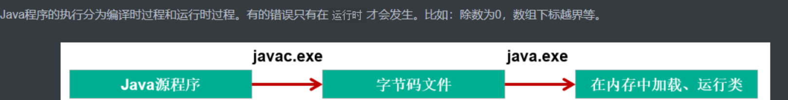

# 1. 异常处理概述

**Java中把不同的异常用不同的类表示**，**一旦发生某种异常，就`创建该异常类型的对象`，并且抛出（throw）。然后程序员可以捕获(catch)到这个异常对象，并处理；如果没有捕获(catch)这个异常对象，那么这个异常对象将会导致程序终止。**

## 1.1 Java异常体系

### 1.1.1 Throwable

**`java.lang.Throwable`** 类是Java程序执行过程中发生的异常事件对应的类的根父类

**Throwable中的常用方法：**

- **`public void printStackTrace()`**：打印异常的详细信息

  包含了异常的类型、异常的原因、异常出现的位置、在开发和调试阶段都得使用printStackTrace

- **`public String getMessage()`：**获取发生异常的原因

### 1.1.2 **Error和Exception**

**Error：Java虚拟机无法解决的严重问题。**如：JVM系统内部错误、资源耗尽等严重情况。一般不编写针对性的代码进行处理。

- 例如：StackOverflowError（栈内存溢出）和OutOfMemoryError（堆内存溢出，简称OOM）

**Exception:** **其它因编程错误或偶然的外在因素导致的一般性问题，需要使用针对性的代码进行处理，使程序继续运行。否则一旦发生异常，程序也会挂掉。**例如：1.空指针访问 2.试图读取不存在的文件 3.网络连接中断 4.数组角标越界



 根据异常可能出现的阶段，可以将异常分为：

> 编译时期异常（即checked异常、受检异常）：在代码编译阶段，编译器就能明确`警示`当前代码`
> 可能发生（不是一定发生）`xx异常，并`明确督促`程序员提前编写处理它的代码。如果程序员`没有编写`对应的异常处理代码，则编译器就会直接判定编译失败，从而不能生成字节码文件。通常，这类异常的发生不是由程序员的代码引起的，或者不是靠加简单判断就可以避免的，例如：FileNotFoundException（文件找不到异常）。
> 
> 运行时期异常（即runtime异常、unchecked异常、非受检异常）：在代码编译阶段，编译器完全不做任何检查，无论该异常是否会发生，编译器都不给出任何提示。只有等代码运行起来并确实发生了xx异常，它才能被发现。通常，这类异常是由程序员的代码编写不当引起的，只要稍加判断，或者细心检查就可以避免。

   

    

```java
java.lang.Throwable:异常体系的根父类
    |---java.lang.Error:错误。Java虚拟机无法解决的严重问题。如：JVM系统内部错误、
                        资源耗尽等严重情况。一般不编写针对性的代码进行处理。
               |---- StackOverflowError、OutOfMemoryError

    |---java.lang.Exception:异常。我们可以编写针对性的代码进行处理。
               |----编译时异常：(受检异常)在执行javac.exe命令时，出现的异常。
                    |----- ClassNotFoundException
                    |----- FileNotFoundException
                    |----- IOException
               |----运行时异常：(非受检异常)在执行java.exe命令时，出现的异常。
                    |---- ArrayIndexOutOfBoundsException
                    |---- NullPointerException
                    |---- ClassCastException
                    |---- NumberFormatException
                    |---- InputMismatchException
                    |---- ArithmeticException
```


# 2. 异常处理方式

​              

## 2.1 **方式一：try-catch-finally 抓抛模型**

前面提到，Java程序的执行过程中如出现异常，**会生成一个异常类对象**，该异常对象将被提交给Java运行时系统，这个过程称为**`抛出(throw)异常 `**如果一个方法内抛出异常，该异常对象会被抛给调用者方法中处理。如果异常没有在调用者方法中处理，它继续被抛给这个调用方法的**上层方法**。这个过程将一直继续下去，**直到异常被处理**。这一过程称为`捕获(catch)异常`。如果一个异常回到**main()方法**，并且main()也不处理，则**程序运行终止**。

```java
try{
	......	//可能产生异常的代码
}
catch( 异常类型1 e ){
	......	//当产生异常类型1型异常时的处置措施
}
catch( 异常类型2 e ){
	...... 	//当产生异常类型2型异常时的处置措施
}  
finally{
	...... //无论是否发生异常，都无条件执行的语句
} 
```

   

- 如果在程序运行时，try块中的代码没有发生异常，那么catch所有的分支都不执行。
- 如果在程序运行时，try块中的代码发生了异常，根据异常对象的类型，将从上到下选择第一个匹配的catch分支执行。此时try中发生异常的语句下面的代码将不执行，而整个try...catch之后的代码可以继续运行。
- 如果在程序运行时，try块中的代码发生了异常，但是所有catch分支都无法匹配（捕获）这个异常，那么JVM将会终止当前方法的执行，并把异常对象“抛”给调用者。如果调用者不处理，程序就挂了。

### 2.1.1 **catch (Exceptiontype e)**

- 如果明确知道产生的是何种异常，可以用该异常类作为catch的参数；**也可以用其父类作为catch的参数。**

  比如：可以用**ArithmeticException**类作为参数的地方，就可以用**RuntimeException**类作为参数，或者用所有异常的父类**Exception**类作为参数。但**不能是与ArithmeticException类无关的异常，如NullPointerException（catch中的语句将不会执行）。**

- 每个try语句块可以伴随一个或多个catch语句，用于处理可能产生的不同类型的异常对象。

- 如果有多个catch分支，并且多个异常类型有父子类关系，**必须保证小的子异常类型在上，大的父异常类型在下。否则，报错。**

catch中常用异常处理的方式

- **`public String getMessage()`：****获取异常的描述信息，返回字符串**
- **`public void printStackTrace()`：**打**印异常的跟踪栈信息并输出到控制台。包含了异常的类型、异常的原因、还包括异常出现的位置，在开发和调试阶段，都得使用printStackTrace()**

###  2.1.2 异常处理的体会

- 前面使用的异常都是**`RuntimeException类`**或是它的`子类`，这些类的异常的特点是：**即使没有使用try和catch捕获，Java自己也能捕获，并且编译通过 ( 但运行时会发生异常使得程序运行终止 )**。所以，**对于这类异常，可以不作处理**，因为这类异常很普遍，若全处理可能会对程序的可读性和运行效率产生影响。
- 如果抛出的异常是IOException等类型的**`非运行时异常`，则必须捕获**，**否则`编译错误`**。也就是说，我们必须处理编译时异常，将异常进行捕捉，转化为运行时异常。

### 2.1.3 finally使用及举例

- 因为异常会引发程序跳转，从而会导致有些语句执行不到。而**程序中有一些特定的代码无论异常是否发生，都`需要执行`**。例如，**数据库连接、输入流输出流、Socket连接、Lock锁的关闭等**，这样的代码通常就会放到finally块中。所以，我们通常**将一定要被执行的代码声明在finally中。**
  - **唯一的例外**，使用 **System.exit(0)** 来终止当前正在运行的 Java 虚拟机。
- **不论在try代码块中是否发生了异常事件，catch语句是否执行，catch语句是否有异常，catch语句中是否有return，finally块中的语句都会被执行而且先被执行。**
- finally语句和catch语句是可选的，但**finally不能单独使用**。

## 2.2 **方式二：throws + 异常类型1, 异常类型2，····**

### **2.2.1 throws的注意事项**

如果在编写方法体的代码时，某句代码可能发生某个`编译时异常`，不处理编译不通过，但是在当前方法体中**可能`不适合处理`或`无法给出合理的处理方式`**，则此方法应**`显示地`声明抛出异常**，表明该方法将不对这些异常进行处理，而**由该方法的调用者负责处理**

 在方法声明中用`throws语句`可以声明抛出异常的列表，throws后面的异常类型**可以是方法中产生的异常类型，也可以是它的父类**

throws后面也可以写**运行时异常类型**，只是运行时异常类型，写或不写对于编译器和程序执行来说都没有任何区别。**如果写了**，唯一的区别就是**调用者调用该方法后**，**使用try...catch结构时，IDEA可以获得更多的信息，需要添加哪种catch分支**

### **2.2.2** 方法重写中throws的要求

方法重写时 ，对于方法签名是有严格要求的。复习：

```java
（1）方法名必须相同
（2）形参列表必须相同
（3）返回值类型
	- 基本数据类型和void：必须相同
	- 引用数据类型：<=
（4）权限修饰符：>=，而且要求父类被重写方法在子类中是可见的
（5）不能是static，final修饰的方法
```

   

 **对于throws异常列表要求：**

```java
- 如果父类被重写方法的方法签名后面没有 “throws  编译时异常类型”，那么重写方法时，方法
签名后面也不能出现“throws  编译时异常类型”。

- 如果父类被重写方法的方法签名后面有 “`throws  编译时异常类型`”，那么重写方法时，throws
的编译时异常类型必须 <= 被重写方法throws的编译时异常类型，或者不throws编译时异常。

- 方法重写，对于“`throws 运行时异常类型`”没有要求。
```

   

### **2.2.3** 两种异常处理方式的选择

对于异常，使用相应的处理方式。此时的异常，主要指的是编译时异常。

- 如果程序代码中，涉及到**资源的调用（流、数据库连接、网络连接等）**，则必须考虑使用**try-catch-finally**来处理，保证不出现内存泄漏。
- 如果**父类被重写的方法没有throws异常类型**，则**子类重写的方法中如果出现异常**，只能考虑使用**try-catch-finally**进行处理，不能throws。
- 开发中，方法a中依次调用了方法b,c,d等方法，方法b,c,d之间是递进关系。此时，如果方法**b,c,d中有异常，我们通常选择使用throws**，而**方法a中通常选择使用try-catch-finally**。

# 3. 手动抛出异常对象和自定义异常

## 3.1 手动抛出异常对象

Java 中异常对象的生成有两种方式：

- 由虚拟机**自动生成**：程序运行过程中，虚拟机检测到程序发生了问题，那么针对当前代码，就会在后台自动创建一个对应异常类的实例对象并抛出。
- 由开发人员**手动创建**：`new 异常类型([实参列表]);`，如果创建好的异常对象不抛出对程序没有任何影响，和创建一个普通对象一样，但是一旦throw抛出，就会对程序运行产生影响了。

```java
throw new 异常类名(参数);
```

   

hrow语句抛出的异常对象，和JVM自动创建和抛出的异常对象一样。

- 如果是**编译时异常类型的对象，同样需要使用throws或者try...catch处理，否则编译不通过**。
- 如果是**运行时异常类型的对象，编译器不提示。**
- 可以抛出的异常必须是**Throwable或其子类的实例**。下面的语句在编译时将会产生语法错误：

```java
throw new String("want to throw");
```

   

无论是编译时异常类型的对象，还是运行时异常类型的对象，**如果没有被try..catch合理的处理，都会导致程序崩溃。**

**throw语句会导致程序执行流程被改变**，throw语句是明确抛出一个异常对象，**因此它`下面的代码将不会执行`。**

如果当前方法没有try...catch处理这个异常对象，throw语句就会`代替return语句`提前终止当前方法的执行，并返回一个异常对象给调用者。

## 3.2 自定义异常

Java中不同的异常类，分别表示着某一种具体的异常情况。那么在开发中总是有些异常情况是核心类库中没有定义好的，此时我们需**要根据自己业务的异常情况来定义异常类**。例如年龄负数问题，考试成绩负数问题，某员工已在团队中等。

### 3.2.1 如何自定义异常类

```java
class MyException extends Exception {
    static final long serialVersionUID = 23423423435L;
    private int idnumber;

    public MyException(String message, int id) {
        super(message);
        this.idnumber = id;
    }

    public int getId() {
        return idnumber;
    }
}
```

   

（1）要继承一个异常类型

自定义一个编译时异常类型：**自定义类继承`java.lang.Exception`**

自定义一个运行时异常类型：**自定义类继承`java.lang.RuntimeException`**

（2）建议大家提供至少两个构造器，一个是无参构造，一个是(String message)构造器。

（3）自定义异常需要提供**`serialVersionUID`**

### 3.2.2 注意

1. 自定义的异常**只能通过throw抛出**。
2. 自定义异常**最重要的是异常类的名字和message属性**。当异常出现时，可以根据名字判断异常类型。比如：`TeamException("成员已满，无法添加");`、 `TeamException("该员工已是某团队成员");`
3. 自定义异常对象只能手动抛出。抛出后由try..catch处理，**也可以甩锅throws给调用者处理**。

# 4 面试题

##   4.1 运行时异常与一般异常有何异同？

```java
运行时异常：RuntimeException
- 编译可以通过。在运行时可能抛出。出现的概率高一些；一般针对于运行时异常，都不处理。

一般异常：Exception
- 编译不能通过。要求必须在编译之前，考虑异常的处理。不处理编译不通过。
```

   

## 4.2 如果不使用try-catch，程序出现异常会如何？

对于**当前方法**来讲，如果不使用try-catch，则在**出现异常对象以后会抛出此对象**。**如果调用它（出现异常的方法）的方法中没有处理方案，就会终止程序的执行。**

## 4.3 try ... catch捕捉的是什么异常？

**Exception。非Error。**