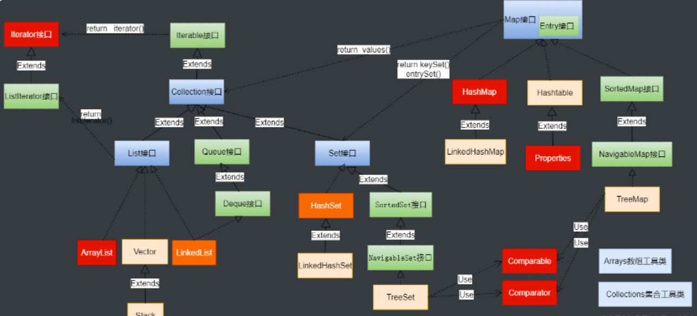
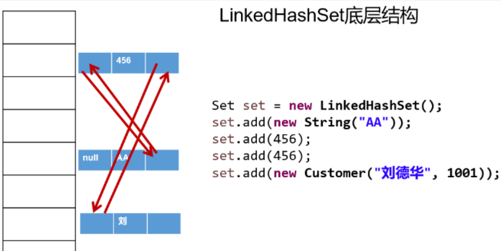
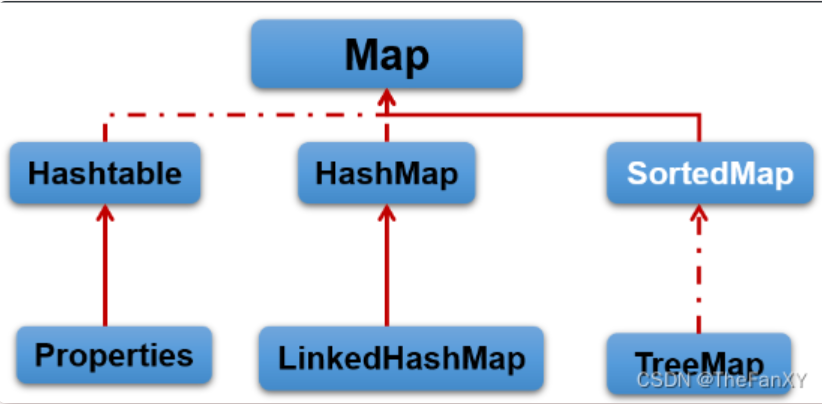
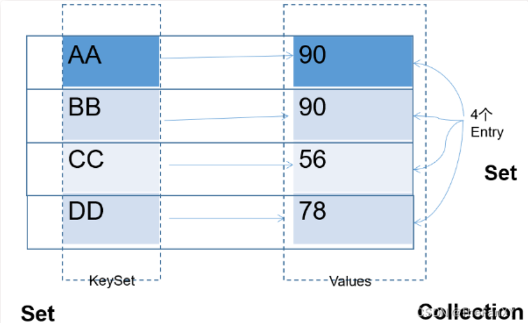
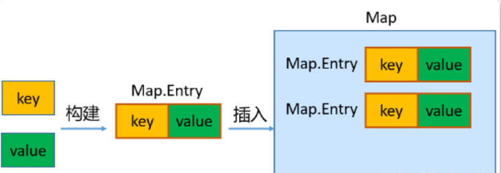

# 1. 集合框架概述

## 1.1 数组的特点与弊端

- 一方面，面向对象语言对事物的体现都是以对象的形式，为了方便对多个对象的操作，就要对对象进行存储。
- 另一方面，使用数组存储对象方面具有`一些弊端`，而Java 集合就像一种容器，可以`动态地`把多个对象的引用放入容器中。
- 数组在内存存储方面的**`特点`**：
  - **数组初始化以后，长度就确定了。**
  - **数组中的添加的元素是依次紧密排列的，有序的，可以重复的。**
  - **数组声明的类型，就决定了进行元素初始化时的类型。不是此类型的变量，就不能添加。**
  - **可以存储基本数据类型值，也可以存储引用数据类型的变量**
- **数组在存储数据方面的`弊端`**：
  - **数组初始化以后，长度就不可变了，不便于扩展**
  - **数组中提供的属性和方法少，不便于进行添加、删除、插入、获取元素个数等操作，且效率不高。**
  - **数组存储数据的特点单一，只能存储有序的、可以重复的数据**
- **Java 集合框架中的类可以用于存储多个`对象`，还可用于保存具有`映射关系`的关联数组。**

##  1.2 Java集合框架体系

**Java 集合可分为 Collection 和 Map 两大体系：**

- **Collection接口**：用于存储一个一个的数据，也称**`单列数据集合`**。
  - **List子接口**：用来存储有序的、可以重复的数据（主要用来替换数组，"动态"数组）
    - 实现类：**ArrayList(主要实现类)、LinkedList、Vector**
  - **Set子接口**：用来存储无序的、不可重复的数据（类似于高中讲的"集合"）
    - 实现类：HashSet(主要实现类)、LinkedHashSet、TreeSet
- **Map接口**：用于存储具有映射关系“key-value对”的集合，即一对一对的数据，也称`双列数据集合`。(类似于高中的函数、映射。(x1,y1),(x2,y2) ---> y = f(x) )
  - **HashMap(主要实现类)、LinkedHashMap、TreeMap、Hashtable、Properties**
- JDK提供的集合API位于java.util包内

  

  

   

# 2. Collection接口及方法

- **JDK不提供此接口的任何直接实现**，**而是提供更具体的子接口（如：Set和List）去实现。**
- **Collection 接口是 List和Set接口的父接口**，该接口里定义的方法既可用于操作 Set 集合，也可用于操作 List 集合。方法如下：

## 2.1 添加

（1）**add(E obj)**：添加元素对象到当前集合中

（2）**addAll(Collection other)**：添加other集合中的所有元素对象到当前集合中，即this = this ∪ other

**注意：add和addAll的区别**

```java
import org.junit.Test;
import java.util.ArrayList;
import java.util.Collection;

public class TestCollectionAdd {
    @Test
    public void testAdd(){
        //ArrayList是Collection的子接口List的实现类之一。
        Collection coll = new ArrayList();
        coll.add("小李广");
        coll.add("扫地僧");
        coll.add("石破天");
        System.out.println(coll);
    }

    @Test
    public void testAddAll(){
        Collection c1 = new ArrayList();
        c1.add(1);
        c1.add(2);
        System.out.println("c1集合元素的个数：" + c1.size());//2
        System.out.println("c1 = " + c1);

        Collection c2 = new ArrayList();
        c2.add(1);
        c2.add(2);
        System.out.println("c2集合元素的个数：" + c2.size());//2
        System.out.println("c2 = " + c2);

        Collection other = new ArrayList();
        other.add(1);
        other.add(2);
        other.add(3);
        System.out.println("other集合元素的个数：" + other.size());//3
        System.out.println("other = " + other);
        System.out.println();

        c1.addAll(other);
        System.out.println("c1集合元素的个数：" + c1.size());//5
        System.out.println("c1.addAll(other) = " + c1);

        c2.add(other);
        System.out.println("c2集合元素的个数：" + c2.size());//3
        System.out.println("c2.add(other) = " + c2);
    }
}
```

  

>  **注意：coll.addAll(other);    与coll.add(other);**

  

## 2.2 判断

**（3）int size()：获取当前集合中实际存储的元素个数** 

**（4）boolean isEmpty()：判断当前集合是否为空集合**

**（5）boolean contains(Object obj)：判断当前集合中是否存在一个与obj对象equals返回true的元素** 

**（6）boolean containsAll(Collection coll)：判断coll集合中的元素是否在当前集合中都存在。即coll集合是否是当前集合的“子集”** 

**（7）boolean equals(Object obj)：判断当前集合与obj是否相等**

```java
import org.junit.Test;

import java.util.ArrayList;
import java.util.Arrays;
import java.util.Collection;

public class TestCollectionContains {
    @Test
    public void test01() {
        Collection coll = new ArrayList();
        System.out.println("coll在添加元素之前，isEmpty = " + coll.isEmpty());
        coll.add("小李广");
        coll.add("扫地僧");
        coll.add("石破天");
        coll.add("佛地魔");
        System.out.println("coll的元素个数" + coll.size());

        System.out.println("coll在添加元素之后，isEmpty = " + coll.isEmpty());
    }

    @Test
    public void test02() {
        Collection coll = new ArrayList();
        coll.add("小李广");
        coll.add("扫地僧");
        coll.add("石破天");
        coll.add("佛地魔");
        System.out.println("coll = " + coll);
        System.out.println("coll是否包含“小李广” = " + coll.contains("小李广"));
        System.out.println("coll是否包含“宋红康” = " + coll.contains("宋红康"));

        Collection other = new ArrayList();
        other.add("小李广");
        other.add("扫地僧");
        other.add("尚硅谷");
        System.out.println("other = " + other);

        System.out.println("coll.containsAll(other) = " + coll.containsAll(other));
    }

    @Test
    public void test03(){
        Collection c1 = new ArrayList();
        c1.add(1);
        c1.add(2);
        System.out.println("c1集合元素的个数：" + c1.size());//2
        System.out.println("c1 = " + c1);

        Collection c2 = new ArrayList();
        c2.add(1);
        c2.add(2);
        System.out.println("c2集合元素的个数：" + c2.size());//2
        System.out.println("c2 = " + c2);

        Collection other = new ArrayList();
        other.add(1);
        other.add(2);
        other.add(3);
        System.out.println("other集合元素的个数：" + other.size());//3
        System.out.println("other = " + other);
        System.out.println();

        c1.addAll(other);
        System.out.println("c1集合元素的个数：" + c1.size());//5
        System.out.println("c1.addAll(other) = " + c1);
        System.out.println("c1.contains(other) = " + c1.contains(other));
        System.out.println("c1.containsAll(other) = " + c1.containsAll(other));
        System.out.println();

        c2.add(other);
        System.out.println("c2集合元素的个数：" + c2.size());
        System.out.println("c2.add(other) = " + c2);
        System.out.println("c2.contains(other) = " + c2.contains(other));
        System.out.println("c2.containsAll(other) = " + c2.containsAll(other));
    }

}
```

  

## 2.3 删除

**（8）void clear()：清空集合元素** 

**（9）boolean remove(Object obj) ：从当前集合中删除第一个找到的与obj对象equals返回true的元素。** 

**（10）boolean removeAll(Collection coll)：从当前集合中删除所有与coll集合中相同的元素。即this = this - this ∩ coll** 

**（11）boolean retainAll(Collection coll)：从当前集合中删除两个集合中不同的元素，使得当前集合仅保留与coll集合中的元素相同的元素，即当前集合中仅保留两个集合的交集，即this = this ∩ coll**

```java
import org.junit.Test;

import java.util.ArrayList;
import java.util.Collection;
import java.util.function.Predicate;

public class TestCollectionRemove {
    @Test
    public void test01(){
        Collection coll = new ArrayList();
        coll.add("小李广");
        coll.add("扫地僧");
        coll.add("石破天");
        coll.add("佛地魔");
        System.out.println("coll = " + coll);

        coll.remove("小李广");
        System.out.println("删除元素\"小李广\"之后coll = " + coll);
        
        coll.clear();
        System.out.println("coll清空之后，coll = " + coll);
    }

    @Test
    public void test02() {
        Collection coll = new ArrayList();
        coll.add("小李广");
        coll.add("扫地僧");
        coll.add("石破天");
        coll.add("佛地魔");
        System.out.println("coll = " + coll);

        Collection other = new ArrayList();
        other.add("小李广");
        other.add("扫地僧");
        other.add("尚硅谷");
        System.out.println("other = " + other);

        coll.removeAll(other);
        System.out.println("coll.removeAll(other)之后，coll = " + coll);
        System.out.println("coll.removeAll(other)之后，other = " + other);
    }

    @Test
    public void test03() {
        Collection coll = new ArrayList();
        coll.add("小李广");
        coll.add("扫地僧");
        coll.add("石破天");
        coll.add("佛地魔");
        System.out.println("coll = " + coll);

        Collection other = new ArrayList();
        other.add("小李广");
        other.add("扫地僧");
        other.add("尚硅谷");
        System.out.println("other = " + other);

        coll.retainAll(other);
        System.out.println("coll.retainAll(other)之后，coll = " + coll);
        System.out.println("coll.retainAll(other)之后，other = " + other);
    }
}
```

  

## 2.4 其它

**（12）Object[] toArray()：返回包含当前集合中所有元素的数组** 

**（13）hashCode()：获取集合对象的哈希值** 

**（14）iterator()：返回迭代器对象，用于集合遍历**


# 3. Iterator(迭代器)接口

## 3.1 Iterator接口

- 在程序开发中，经常需要遍历集合中的所有元素。针对这种需求，JDK专门提供了一个接口**`java.util.Iterator`**。`Iterator`接口也是Java集合中的一员，**但它与`Collection`、`Map`接口有所不同。**
  - **Collection接口与Map接口主要用于`存储`元素**
  - **`Iterator`，被称为迭代器接口，本身并不提供存储对象的能力，主要用于`遍历`Collection中的元素**
- Collection接口**继承了java.lang.Iterable接口**，**该接口有一个iterator()方法**，那么所有实现了Collection接口的集合类都有一个iterator()方法，用以返回一个实现了Iterator接口的对象。
  - **`public Iterator iterator()`**: 获取集合对应的迭代器，用来遍历集合中的元素的。
  - **集合对象每次调用iterator()方法都得到一个全新的迭代器对象，默认游标都在集合的第一个元素之前。**
- Iterator接口的常用方法如下：
  - **`public E next()`:返回迭代的下一个元素。**
  - **`public boolean hasNext()`:如果仍有元素可以迭代，则返回 true。**
- **注意：在调用it.next()方法之前必须要调用it.hasNext()进行检测。若不调用，且下一条记录无效，直接调用it.next()会抛出`NoSuchElementException异常`。**

```java
public class TestIterator {
    @Test
    public void test01(){
        Collection coll = new ArrayList();
        coll.add("小李广");
        coll.add("扫地僧");
        coll.add("石破天");

        Iterator iterator = coll.iterator();
        System.out.println(iterator.next());
        System.out.println(iterator.next());
        System.out.println(iterator.next());
        System.out.println(iterator.next()); //报NoSuchElementException异常
    }

    @Test
    public void test02(){
        Collection coll = new ArrayList();
        coll.add("小李广");
        coll.add("扫地僧");
        coll.add("石破天");

        Iterator iterator = coll.iterator();//获取迭代器对象
        while(iterator.hasNext()) {//判断是否还有元素可迭代
            System.out.println(iterator.next());//取出下一个元素
        }
    }
}
```

  

##  3.2 迭代器的执行原理

Iterator迭代器对象在遍历集合时，**内部采用指针的方式来跟踪集合中的元素**，接下来通过一个图例来演示Iterator对象迭代元素的过程：

  

 **使用Iterator迭代器删除元素：java.util.Iterator迭代器中有一个方法：void remove() ;**

```java
Iterator iter = coll.iterator();//回到起点
while(iter.hasNext()){
    Object obj = iter.next();
    if(obj.equals("Tom")){
        iter.remove();
    }
}
```

  

**注意：**

- **Iterator可以删除集合的元素，但是遍历过程中通过迭代器对象的remove方法，不是集合对象的remove方法。**
- **如果还未调用next()或在上一次调用 next() 方法之后已经调用了 remove() 方法，再调用remove()都会报IllegalStateException。**
- **Collection已经有remove(xx)方法了，为什么Iterator迭代器还要提供删除方法呢？因为迭代器的remove()可以按指定的条件进行删除。**

**这就是 `jdk stream` 流的条件删除的基线方法。**

## 3.3 foreach循环

- **foreach循环（也称增强for循环）是 JDK5.0 中定义的一个高级for循环，专门用来`遍历数组和集合`的。**

- **foreach循环的语法格式：**

```java
for(元素的数据类型 局部变量 : Collection集合或数组){ 
  	//操作局部变量的输出操作
}
//这里局部变量就是一个临时变量，自己命名就可以
```

  

- **举例：**  

```java
import org.junit.Test;

import java.util.ArrayList;
import java.util.Collection;

public class TestForeach {
    @Test
    public void test01(){
        Collection coll = new ArrayList();
        coll.add("小李广");
        coll.add("扫地僧");
        coll.add("石破天");
		//foreach循环其实就是使用Iterator迭代器来完成元素的遍历的。
        for (Object o : coll) {
            System.out.println(o);
        }
    }
    @Test
    public void test02(){
        int[] nums = {1,2,3,4,5};
        for (int num : nums) {
            System.out.println(num);
        }
        System.out.println("-----------------");
        String[] names = {"张三","李四","王五"};
        for (String name : names) {
            System.out.println(name);
        }
    }
}
```

  

# 4. Collection子接口1：List

## 4.1 List接口特点

- 鉴于Java中数组用来存储数据的局限性，我们通常使用 **`java.util.List` 替代数组**
- List集合类中`元素有序`、且`可重复`，集合中的每个元素都有其对应的顺序索引。
- JDK API中List接口的实现类常用的有：**`ArrayList`、`LinkedList`和`Vector`。**


## 4.2 List接口方法

List除了从Collection集合继承的方法外，List 集合里添加了**一些`根据索引`来操作集合元素的方法。**

- 插入元素
  - **`void add(int index, Object ele)`**:在index位置插入ele元素
  - **boolean addAll(int index, Collection eles)**:从index位置开始将eles中的所有元素添加进来
- 获取元素
  - **`Object get(int index)`**:获取指定index位置的元素
  - **List subList(int fromIndex, int toIndex)**:返回从fromIndex到toIndex位置的子集合
- 获取元素索引
  - **int indexOf(Object obj)**:返回obj在集合中首次出现的位置
  - **int lastIndexOf(Object obj)**:返回obj在当前集合中末次出现的位置
- 删除和替换元素
  - **`Object remove(int index)`**:移除指定index位置的元素，并返回此元素
  - **`Object set(int index, Object ele)`**:设置指定index位置的元素为ele
- 注意：在JavaSE中List名称的类型有两个，一个是**java.util.List集合接口**，一个是**java.awt.List图形界面的组件**，别导错包了。


## 4.3 List接口主要实现类：ArrayList

- ArrayList 是 List 接口的**`主要实现类`**
- 本质上，ArrayList是对象引用的一个**”变长”数组**
- **Arrays.asList(…) 方法返回的 List 集合，既不是 ArrayList 实例，也不是 Vector 实例。 Arrays.asList(…) 返回值是一个固定长度的 List 集合**


## 4.4 List的实现类之二：LinkedList

- **对于频繁的插入或删除元素的操作，建议使用LinkedList类，效率较高。这是由底层采用链表（双向链表）结构存储数据决定的。**
- **特有方法：**
  - **void addFirst(Object obj)**
  - **void addLast(Object obj)**
  - **Object getFirst()**
  - **Object getLast()**
  - **Object removeFirst()**
  - **Object removeLast()**

**练习1：**

- 定义学生类，属性为姓名、年龄，提供必要的getter、setter方法，构造器，toString()，equals()方法。
- 使用ArrayList集合，保存录入的多个学生对象。
- 循环录入的方式，1：继续录入，0：结束录入。
- 录入结束后，用foreach遍历集合。

```java
import java.util.ArrayList;
import java.util.Scanner;

public class StudentTest {
    public static void main(String[] args) {

        Scanner scanner = new Scanner(System.in);
        ArrayList stuList = new ArrayList();

        while(true) {

            System.out.println("选择（录入 1 ；结束 0）");
            int x = scanner.nextInt();//根据x的值，判断是否需要继续循环

            if (x == 1) {
                System.out.println("姓名");
                String name = scanner.next();
                System.out.println("年龄");
                int age = scanner.nextInt();
                Student stu = new Student(age, name);
                stuList.add(stu);

            } else if (x == 0) {
                break;

            } else {
                System.out.println("输入有误，请重新输入");
            }
        }

        for (Object stu : stuList) {
            System.out.println(stu);
        }
    }
}

public class Student {

    private int age;
    private String name;

    public Student() {
    }
    
    public Student(int age, String name) {
		super();
		this.age = age;
		this.name = name;
	}

	public int getAge() {
        return age;
    }

    public void setAge(int age) {
        this.age = age;
    }

    public String getName() {
        return name;
    }

    public void setName(String name) {
        this.name = name;
    }

	@Override
	public String toString() {
		return "Student [age=" + age + ", name=" + name + "]";
	}
}
```

  

## 4.5 List的实现类之三：Vector

- Vector 是一个`古老`的集合，JDK1.0就有了。**大多数操作与ArrayList相同，区别之处在于Vector是`线程安全`的**。
- **在各种List中，**最好把`ArrayList作为默认选择`。当插入、删除频繁时，使用LinkedList；Vector总是比ArrayList慢，所以尽量避免使用。
- 特有方法：
  - void addElement(Object obj)
  - void insertElementAt(Object obj,int index)
  - void setElementAt(Object obj,int index)
  - void removeElement(Object obj)
  - void removeAllElements()
  
  

# 5. Collection子接口2：Set

## 5.1 Set接口概述

- **Set接口是Collection的子接口，Set接口相较于Collection接口没有提供额外的方法**
- Set 集合**不允许包含相同的元素**，如果试把两个相同的元素加入同一个 Set 集合中，则添加操作失败。
- **Set集合支持的遍历方式和Collection集合一样：foreach和Iterator。**
- Set的常用实现类有**：HashSet、TreeSet、LinkedHashSet**。


## 5.2 Set主要实现类：HashSet

### 5.2.1 HashSet概述

- HashSet 是 **Set 接口的主要实现类**，大多数时候使用 Set 集合时都使用这个实现类。
- HashSet 按 **Hash 算法来存储集合中的元素，因此具有很好的存储、查找、删除性能。**
- HashSet 具有以下`特点`：
  - **不能保证元素的排列顺序**
  - **HashSet 不是线程安全的**
  - **集合元素可以是 null**
- **HashSet 集合`判断两个元素相等的标准`：两个对象通过 `hashCode()` 方法得到的哈希值相等，并且两个对象的 `equals()`方法返回值为true。**
- 对于存放在Set容器中的对象，**对应的类一定要重写hashCode()和equals(Object obj)方法**，以实现对象相等规则。即：“相等的对象必须具有相等的散列码”。
- HashSet集合中**元素的无序性，不等同于随机性**。这里的无序性与元素的添加位置有关。具体来说：我们在添加每一个元素到数组中时，**具体的存储位置是由元素的hashCode()调用后返回的hash值决定的。导致在数组中每个元素不是依次紧密存放的，表现出一定的无序性。**


### 5.2.2 HashSet中添加元素的过程：

- 第1步：当向 HashSet 集合中存入一个元素时，HashSet 会调用该对象的 hashCode() 方法得到该对象的 hashCode值，然后根据 hashCode值，通过某个散列函数决定该对象在 HashSet 底层数组中的存储位置。

- 第2步：如果要在数组中存储的位置上没有元素，则直接添加成功。

- 第3步：如果要在数组中存储的位置上有元素，则继续比较：

  - 如果两个元素的hashCode值不相等，则添加成功；
  - 如果两个元素的hashCode()值相等，则会继续调用equals()方法：
    - 如果equals()方法结果为false，则添加成功。
    - 如果equals()方法结果为true，则添加失败。

  > 第2步添加成功，元素会保存在底层数组中。
  >
  > 第3步两种添加成功的操作，由于该底层数组的位置已经有元素了，则会通过`链表`的方式继续链接，存储。
  
  

### 5.2.3 重写 hashCode() 方法的基本原则

- **在程序运行时，同一个对象多次调用 hashCode() 方法应该返回相同的值。**
- **当两个对象的 equals() 方法比较返回 true 时，这两个对象的 hashCode() 方法的返回值也应相等。**
- **对象中用作 equals() 方法比较的 Field，都应该用来计算 hashCode 值。**

> 注意：**如果两个元素的 equals() 方法返回 true，但它们的 hashCode() 返回值不相等，hashSet 将会把它们存储在不同的位置，但依然可以添加成功**。


### 5.2.4 重写equals()方法的基本原则

- 重写equals方法的时候一般都需要同时复写hashCode方法。**通常参与计算hashCode的对象的属性也应该参与到equals()中进行计算。**
- 推荐：开发中直接调用Eclipse/IDEA里的快捷键自动重写equals()和hashCode()方法即可。
  - 为什么用Eclipse/IDEA复写hashCode方法，有31这个数字？

> 首先，选择系数的时候要选择尽量大的系数。因为如果计算出来的hash地址越大，所谓的“冲突”就越少，查找起来效率也会提高。**（减少冲突）**
>
> 其次，**31只占用5bits,相乘造成数据溢出的概率较小。**
>
> 再次，**31可以 由i\*31== (i<<5)-1来表示,现在很多虚拟机里面都有做相关优化。（提高算法效率）**
>
> 最后，**31是一个素数，素数作用就是如果我用一个数字来乘以这个素数，那么最终出来的结果只能被素数本身和被乘数还有1来整除**！**(减少冲突)** 


## 5.3 Set实现类之二：LinkedHashSet

- **LinkedHashSet 是 HashSet 的子类，不允许集合元素重复。**
- **LinkedHashSet 根据元素的 hashCode 值来决定元素的存储位置，但它同时使用`双向链表`维护元素的次序，这使得元素看起来是以`添加顺序`保存的。**
- **LinkedHashSet`插入性能略低`于 HashSet，但在`迭代访问` Set 里的全部元素时有很好的性能。**

  

## 5.4 Set实现类之三：TreeSet

### 5.4.1 TreeSet概述

- **TreeSet 是 SortedSet 接口的实现类，TreeSet 可以按照添加的元素的指定的属性的大小顺序进行遍历。**
- **TreeSet底层使用`红黑树`结构存储数据**
- 新增的方法如下： (了解)
  - Comparator comparator()
  - Object first()
  - Object last()
  - Object lower(Object e)
  - Object higher(Object e)
  - SortedSet subSet(fromElement, toElement)
  - SortedSet headSet(toElement)
  - SortedSet tailSet(fromElement)
- **TreeSet特点：不允许重复、实现排序（自然排序或定制排序）**
- TreeSet 两种排序方法：`自然排序`和`定制排序`。默认情况下，TreeSet 采用自然排序。
  - **`自然排序`：TreeSet 会调用集合元素的 compareTo(Object obj) 方法来比较元素之间的大小关系，然后将集合元素按升序(默认情况)排列。**
    - **如果试图把一个对象添加到 TreeSet 时，则该对象的类必须实现 Comparable 接口。**
    - **实现 Comparable 的类必须实现 compareTo(Object obj) 方法，两个对象即通过 compareTo(Object obj) 方法的返回值来比较大小。**
  - **`定制排序`：如果元素所属的类没有实现Comparable接口，或不希望按照升序(默认情况)的方式排列元素或希望按照其它属性大小进行排序，则考虑使用定制排序。定制排序，通过Comparator接口来实现。需要重写compare(T o1,T o2)方法。**
    - **利用int compare(T o1,T o2)方法，比较o1和o2的大小：如果方法返回正整数，则表示o1大于o2；如果返回0，表示相等；返回负整数，表示o1小于o2。**
    - **要实现定制排序，需要将实现Comparator接口的实例作为形参传递给TreeSet的构造器。**
- 因为只有相同类的两个实例才会比较大小，**所以向 TreeSet 中添加的应该是`同一个类的对象`**。
- **对于 TreeSet 集合而言，它判断`两个对象是否相等的唯一标准`是：两个对象通过 `compareTo(Object obj) 或compare(Object o1,Object o2)`方法比较返回值。返回值为0，则认为两个对象相等。**


### 5.4.2 举例

```java
import org.junit.Test;
import java.util.Iterator;
import java.util.TreeSet;

public class TreeSetTest {
    /*
    * 自然排序：针对String类的对象
    * */
    @Test
    public void test1(){
        TreeSet set = new TreeSet();

        set.add("MM");
        set.add("CC");
        set.add("AA");
        set.add("DD");
        set.add("ZZ");
        //set.add(123);  //报ClassCastException的异常

        Iterator iterator = set.iterator();
        while(iterator.hasNext()){
            System.out.println(iterator.next());
        }
    }
    /*
    * 自然排序：针对User类的对象
    * */
    @Test
    public void test2(){
        TreeSet set = new TreeSet();

        set.add(new User("Tom",12));
        set.add(new User("Rose",23));
        set.add(new User("Jerry",2));
        set.add(new User("Eric",18));
        set.add(new User("Tommy",44));
        set.add(new User("Jim",23));
        set.add(new User("Maria",18));
        //set.add("Tom");

        Iterator iterator = set.iterator();
        while(iterator.hasNext()){
            System.out.println(iterator.next());
        }

        System.out.println(set.contains(new User("Jack", 23))); //true
    }
}
```

  

# 6. Map接口

现实生活与开发中，我们常会看到这样的一类集合：用户ID与账户信息、学生姓名与考试成绩、IP地址与主机名等，**这种一一对应的关系，就称作映射**。Java提供了专门的集合框架用来存储这种映射关系的对象，即**`java.util.Map`接口。**

## 6.1 Map接口概述

- **Map与Collection并列存在。用于保存具有`映射关系`的数据：key-value**
  - **`Collection`集合称为单列集合，元素是孤立存在的（理解为单身）。**
  - **`Map`集合称为双列集合，元素是成对存在的(理解为夫妻)。**
- Map 中的 key 和 value 都可以是任何引用类型的数据。**但常用String类作为Map的“键”。**
- **Map接口的常用实现类：`HashMap`、`LinkedHashMap`、`TreeMap`和`Properties`。其中，HashMap是 Map 接口使用`频率最高`的实现类。**

  

## 6.2 Map中key-value特点

这里主要以HashMap为例说明。HashMap中存储的key、value的特点如下：

  

 **Map 中的 `key用Set来存放`，`不允许重复`，即同一个 Map 对象所对应的类，须重写hashCode()和equals()方法**

  

- **key 和 value 之间存在单向一对一关系，即通过指定的 key 总能找到唯一的、确定的 value，不同key对应的`value可以重复`。value所在的类要重写equals()方法。**
- **key和value构成一个entry。所有的entry彼此之间是`无序的`、`不可重复的`**


### 6.2 Map接口的常用方法

- **添加、修改操作：**
  - **Object put(Object key,Object value)：将指定key-value添加到(或修改)当前map对象中**
  - **void putAll(Map m):将m中的所有key-value对存放到当前map中**
- **删除操作：**
  - **Object remove(Object key)：移除指定key的key-value对，并返回value**
  - **void clear()：清空当前map中的所有数据**
- **元素查询的操作：**
  - **Object get(Object key)：获取指定key对应的value**
  - **Object getOrDefault(Object key, V defaultValue)：获取指定key对应的value,如果不存在，则返回设置的默认值**
  - **boolean containsKey(Object key)：是否包含指定的key**
  - **boolean containsValue(Object value)：是否包含指定的value**
  - **int size()：返回map中key-value对的个数**
  - **boolean isEmpty()：判断当前map是否为空**
  - **boolean equals(Object obj)：判断当前map和参数对象obj是否相等**
- **元视图操作的方法：**
  - **Set keySet()：返回所有key构成的Set集合**
  - **Collection values()：返回所有value构成的Collection集合**
  - **Set entrySet()：返回所有key-value对构成的Set集合**

举例：

```java
import java.util.HashMap;

public class TestMapMethod {
    public static void main(String[] args) {
        //创建 map对象
        HashMap map = new HashMap();

        //添加元素到集合
        map.put("黄晓明", "杨颖");
        map.put("李晨", "李小璐");
        map.put("李晨", "范冰冰");
        map.put("邓超", "孙俪");
        System.out.println(map);

        //删除指定的key-value
        System.out.println(map.remove("黄晓明"));
        System.out.println(map);

        //查询指定key对应的value
        System.out.println(map.get("邓超"));
        System.out.println(map.get("黄晓明"));

    }
}

public static void main(String[] args) {
    HashMap map = new HashMap();
    map.put("许仙", "白娘子");
    map.put("董永", "七仙女");
    map.put("牛郎", "织女");
    map.put("许仙", "小青");

    System.out.println("所有的key:");
    Set keySet = map.keySet();
    for (Object key : keySet) {
        System.out.println(key);
    }

    System.out.println("所有的value:");
    Collection values = map.values();
    for (Object value : values) {
        System.out.println(value);
    }

    System.out.println("所有的映射关系:");
    Set entrySet = map.entrySet();
    for (Object mapping : entrySet) {
        //System.out.println(entry);
        Map.Entry entry = (Map.Entry) mapping;
        System.out.println(entry.getKey() + "->" + entry.getValue());
    }
}
```

  

## 6.3 Map的主要实现类：HashMap

### 6.3.1 HashMap概述

- **HashMap是 Map 接口`使用频率最高`的实现类。**
- **HashMap是线程不安全的。允许添加 null 键和 null 值。**
- **存储数据采用的哈希表结构，底层使用`一维数组`+`单向链表`+`红黑树`进行key-value数据的存储。与HashSet一样，元素的存取顺序不能保证一致。**
- **HashMap `判断两个key相等的标准`是：两个 key 的hashCode值相等，通过 equals() 方法返回 true。**
- **HashMap `判断两个value相等的标准`是：两个 value 通过 equals() 方法返回 true。**


### 6.3.2 练习

**练习1：**添加你喜欢的歌手以及你喜欢他唱过的歌曲

  

```java
//方式1
public class SingerTest1 {
    public static void main(String[] args) {

        //创建一个HashMap用于保存歌手和其歌曲集
        HashMap singers = new HashMap();
        //声明一组key,value
        String singer1 = "周杰伦";

        ArrayList songs1 = new ArrayList();
        songs1.add("双节棍");
        songs1.add("本草纲目");
        songs1.add("夜曲");
        songs1.add("稻香");
        //添加到map中
        singers.put(singer1,songs1);
        //声明一组key,value
        String singer2 = "陈奕迅";
        List songs2 = Arrays.asList("浮夸", "十年", "红玫瑰", "好久不见", "孤勇者");
        //添加到map中
        singers.put(singer2,songs2);

        //遍历map
        Set entrySet = singers.entrySet();
        for(Object obj : entrySet){
            Map.Entry entry = (Map.Entry)obj;
            String singer = (String) entry.getKey();
            List songs = (List) entry.getValue();

            System.out.println("歌手：" + singer);
            System.out.println("歌曲有：" + songs);
        }
    }
}
```

  

```java
//方式2：改为HashSet实现
public class SingerTest2 {
	@Test
	public void test1() {

		Singer singer1 = new Singer("周杰伦");
		Singer singer2 = new Singer("陈奕迅");

		Song song1 = new Song("双节棍");
		Song song2 = new Song("本草纲目");
		Song song3 = new Song("夜曲");
		Song song4 = new Song("浮夸");
		Song song5 = new Song("十年");
		Song song6 = new Song("孤勇者");

		HashSet h1 = new HashSet();// 放歌手一的歌曲
		h1.add(song1);
		h1.add(song2);
		h1.add(song3);

		HashSet h2 = new HashSet();// 放歌手二的歌曲
		h2.add(song4);
		h2.add(song5);
		h2.add(song6);

		HashMap hashMap = new HashMap();// 放歌手和他对应的歌曲
		hashMap.put(singer1, h1);
		hashMap.put(singer2, h2);

		for (Object obj : hashMap.keySet()) {
			System.out.println(obj + "=" + hashMap.get(obj));
		}

	}
}

//歌曲
public class Song implements Comparable{
	private String songName;//歌名

	public Song() {
		super();
	}

	public Song(String songName) {
		super();
		this.songName = songName;
	}

	public String getSongName() {
		return songName;
	}

	public void setSongName(String songName) {
		this.songName = songName;
	}

	@Override
	public String toString() {
		return "《" + songName + "》";
	}

	@Override
	public int compareTo(Object o) {
		if(o == this){
			return 0;
		}
		if(o instanceof Song){
			Song song = (Song)o;
			return songName.compareTo(song.getSongName());
		}
		return 0;
	}
	
	
}
//歌手
public class Singer implements Comparable{
	private String name;
	private Song song;
	
	public Singer() {
		super();
	}

	public Singer(String name) {
		super();
		this.name = name;
		
	}

	public String getName() {
		return name;
	}

	public void setName(String name) {
		this.name = name;
	}

	public Song getSong() {
		return song;
	}

	public void setSong(Song song) {
		this.song = song;
	}

	@Override
	public String toString() {
		return name;
	}

	@Override
	public int compareTo(Object o) {
		if(o == this){
			return 0;
		}
		if(o instanceof Singer){
			Singer singer = (Singer)o;
			return name.compareTo(singer.getName());
		}
		return 0;
	}
}
```

  

## 6.4 Map实现类之二：LinkedHashMap

- **LinkedHashMap 是 HashMap 的子类**
- **存储数据采用的哈希表结构+链表结构，在HashMap存储结构的基础上，使用了一对`双向链表`来`记录添加元素的先后顺序`，可以保证遍历元素时，与添加的顺序一致。**
- **通过哈希表结构可以保证键的唯一、不重复，需要键所在类重写hashCode()方法、equals()方法。**

```java
public class TestLinkedHashMap {
    public static void main(String[] args) {
        LinkedHashMap map = new LinkedHashMap();
        map.put("王五", 13000.0);
        map.put("张三", 10000.0);
        //key相同，新的value会覆盖原来的value
        //因为String重写了hashCode和equals方法
        map.put("张三", 12000.0);
        map.put("李四", 14000.0);
        //HashMap支持key和value为null值
        String name = null;
        Double salary = null;
        map.put(name, salary);

        Set entrySet = map.entrySet();
        for (Object obj : entrySet) {
        	Map.Entry entry = (Map.Entry)obj;
            System.out.println(entry);
        }
    }
}
```

  

## 6.5 Map实现类之三：TreeMap

- **TreeMap存储 key-value 对时，需要根据 key-value 对进行排序。TreeMap 可以保证所有的 key-value 对处于`有序状态`。**
- **TreeSet底层使用`红黑树`结构存储数据**
- **TreeMap 的 Key 的排序：**
  - **`自然排序`：TreeMap 的所有的 Key 必须实现 Comparable 接口，而且所有的 Key 应该是同一个类的对象，否则将会抛出 ClasssCastException**
  - **`定制排序`：创建 TreeMap 时，构造器传入一个 Comparator 对象，该对象负责对 TreeMap 中的所有 key 进行排序。此时不需要 Map 的 Key 实现 Comparable 接口**
- **TreeMap判断`两个key相等的标准`：两个key通过compareTo()方法或者compare()方法返回0。**

```java
public class TestTreeMap {
    /*
    * 自然排序举例
    * */
    @Test
    public void test1(){
        TreeMap map = new TreeMap();

        map.put("CC",45);
        map.put("MM",78);
        map.put("DD",56);
        map.put("GG",89);
        map.put("JJ",99);

        Set entrySet = map.entrySet();
        for(Object entry : entrySet){
            System.out.println(entry);
        }

    }

    /*
    * 定制排序
    *
    * */
    @Test
    public void test2(){
        //按照User的姓名的从小到大的顺序排列

        TreeMap map = new TreeMap(new Comparator() {
            @Override
            public int compare(Object o1, Object o2) {
                if(o1 instanceof User && o2 instanceof User){
                    User u1 = (User)o1;
                    User u2 = (User)o2;

                    return u1.name.compareTo(u2.name);
                }
                throw new RuntimeException("输入的类型不匹配");
            }
        });

        map.put(new User("Tom",12),67);
        map.put(new User("Rose",23),"87");
        map.put(new User("Jerry",2),88);
        map.put(new User("Eric",18),45);
        map.put(new User("Tommy",44),77);
        map.put(new User("Jim",23),88);
        map.put(new User("Maria",18),34);

        Set entrySet = map.entrySet();
        for(Object entry : entrySet){
            System.out.println(entry);
        }
    }
}

class User implements Comparable{
    String name;
    int age;

    public User(String name, int age) {
        this.name = name;
        this.age = age;
    }

    public User() {
    }

    @Override
    public String toString() {
        return "User{" +
                "name='" + name + '\'' +
                ", age=" + age +
                '}';
    }
    /*
    举例：按照age从小到大的顺序排列，如果age相同，则按照name从大到小的顺序排列
    * */
    @Override
    public int compareTo(Object o) {
        if(this == o){
            return 0;
        }

        if(o instanceof User){
            User user = (User)o;
            int value = this.age - user.age;
            if(value != 0){
                return value;
            }
            return -this.name.compareTo(user.name);
        }
        throw new RuntimeException("输入的类型不匹配");
    }
}
```

  

### 6.6 Map实现类之四：Hashtable

- **Hashtable是Map接口的`古老实现类`，JDK1.0就提供了。不同于HashMap，Hashtable是线程安全的。**
- **Hashtable实现原理和HashMap相同，功能相同。底层都使用哈希表结构（数组+单向链表），查询速度快。**
- **与HashMap一样，Hashtable 也不能保证其中 Key-Value 对的顺序**
- **Hashtable判断两个key相等、两个value相等的标准，与HashMap一致。**
- **与HashMap不同，Hashtable 不允许使用 null 作为 key 或 value。**

**面试题：Hashtable和HashMap的区别**

> **HashMap:底层是一个哈希表（jdk7:数组+链表;jdk8:数组+链表+红黑树）,是一个线程不安全的集合,执行效率高
>  Hashtable:底层也是一个哈希表（数组+链表）,是一个线程安全的集合,执行效率低**
>
> **HashMap集合:可以存储null的键、null的值
>  Hashtable集合,不能存储null的键、null的值**
>
> 
>
> **Hashtable和Vector集合一样,在jdk1.2版本之后被更先进的集合(HashMap,ArrayList)取代了。所以HashMap是Map的主要实现类，Hashtable是Map的古老实现类。**
>
> **Hashtable的子类Properties（配置文件）依然活跃在历史舞台
>  Properties集合是一个唯一和IO流相结合的集合**


##  6.7 Map实现类之五：Properties

- **Properties 类是 Hashtable 的子类，该对象用于处理属性文件**
- **由于属性文件里的 key、value 都是字符串类型，所以 Properties 中要求 key 和 value 都是字符串类型**
- **存取数据时，建议使用setProperty(String key,String value)方法和getProperty(String key)方法**

```java
@Test
public void test01() {
    Properties properties = System.getProperties();
    String fileEncoding = properties.getProperty("file.encoding");//当前源文件字符编码
    System.out.println("fileEncoding = " + fileEncoding);
}
@Test
public void test02() {
    Properties properties = new Properties();
    properties.setProperty("user","songhk");
    properties.setProperty("password","123456");
    System.out.println(properties);
}

@Test
public void test03() throws IOException {
    Properties pros = new Properties();
    pros.load(new FileInputStream("jdbc.properties"));
    String user = pros.getProperty("user");
    System.out.println(user);
}
```

  

# 7. Collections工具类

**参考操作数组的工具类：**Arrays，Collections 是一个操作 Set、List 和 Map 等集合的工具类。

## 7.1 常用方法

**Collections 中提供了一系列静态的方法对集合元素进行排序、查询和修改等操作，还提供了对集合对象设置不可变、对集合对象实现同步控制等方法（均为static方法）：**

**排序操作：**

- **reverse(List)：反转 List 中元素的顺序**
- **shuffle(List)：对 List 集合元素进行随机排序**
- **sort(List)：根据元素的自然顺序对指定 List 集合元素按升序排序**
- **sort(List，Comparator)：根据指定的 Comparator 产生的顺序对 List 集合元素进行排序**
- **swap(List，int， int)：将指定 list 集合中的 i 处元素和 j 处元素进行交换**

**查找**

- **Object max(Collection)：根据元素的自然顺序，返回给定集合中的最大元素**
- **Object max(Collection，Comparator)：根据 Comparator 指定的顺序，返回给定集合中的最大元素**
- **Object min(Collection)：根据元素的自然顺序，返回给定集合中的最小元素**
- **Object min(Collection，Comparator)：根据 Comparator 指定的顺序，返回给定集合中的最小元素**
- **int binarySearch(List list,T key)在List集合中查找某个元素的下标，但是List的元素必须是T或T的子类对象，而且必须是可比较大小的，即支持自然排序的。而且集合也事先必须是有序的，否则结果不确定。**
- **int binarySearch(List list,T key,Comparator c)在List集合中查找某个元素的下标，但是List的元素必须是T或T的子类对象，而且集合也事先必须是按照c比较器规则进行排序过的，否则结果不确定。**
- **int frequency(Collection c，Object o)：返回指定集合中指定元素的出现次数**

**复制、替换**

- **void copy(List dest,List src)：将src中的内容复制到dest中**
- **boolean replaceAll(List list，Object oldVal，Object newVal)：使用新值替换 List 对象的所有旧值**
- **提供了多个unmodifiableXxx()方法，该方法返回指定 Xxx的不可修改的视图。**

**添加**

- **boolean addAll(Collection c,T... elements)将所有指定元素添加到指定 collection 中。**

**同步**

- **Collections 类中提供了多个 `synchronizedXxx()` 方法，该方法可使将指定集合包装成线程同步的集合，从而可以解决多线程并发访问集合时的线程安全问题**


**更多见我 `juc` 的笔记**


## 7.2 举例

```java
import org.junit.Test;

import java.text.Collator;
import java.util.*;

public class TestCollections {
    @Test
    public void test01(){
        /*
        public static <T> boolean addAll(Collection<? super T> c,T... elements)
        将所有指定元素添加到指定 collection 中。Collection的集合的元素类型必须>=T类型
        */
        Collection<Object> coll = new ArrayList<>();
        Collections.addAll(coll, "hello","java");
        Collections.addAll(coll, 1,2,3,4);

        Collection<String> coll2 = new ArrayList<>();
        Collections.addAll(coll2, "hello","java");
        //Collections.addAll(coll2, 1,2,3,4);//String和Integer之间没有父子类关系
    }

	@Test
    public void test02(){
/*
 * public static <T extends Object & Comparable<? super T>> T max(Collection<? extends T> coll)
 * 在coll集合中找出最大的元素，集合中的对象必须是T或T的子类对象，而且支持自然排序
*  
*  public static <T> T max(Collection<? extends T> coll,Comparator<? super T> comp)
*  在coll集合中找出最大的元素，集合中的对象必须是T或T的子类对象，按照比较器comp找出最大者
*
*/
        List<Man> list = new ArrayList<>();
        list.add(new Man("张三",23));
        list.add(new Man("李四",24));
        list.add(new Man("王五",25));

        /*
         * Man max = Collections.max(list);//要求Man实现Comparable接口，或者父类实现
         * System.out.println(max);
         */

        Man max = Collections.max(list, new Comparator<Man>() {
            @Override
            public int compare(Man o1, Man o2) {
                return o2.getAge()-o2.getAge();
            }
        });
        System.out.println(max);
    }

	@Test
    public void test03(){
        /*
         * public static void reverse(List<?> list)
         * 反转指定列表List中元素的顺序。
         */
        List<String> list = new ArrayList<>();
        Collections.addAll(list,"hello","java","world");
        System.out.println(list);

        Collections.reverse(list);
        System.out.println(list);
    }
	@Test
    public void test04(){
        /*
         * public static void shuffle(List<?> list) 
         * List 集合元素进行随机排序，类似洗牌，打乱顺序
         */
        List<String> list = new ArrayList<>();
        Collections.addAll(list,"hello","java","world");

        Collections.shuffle(list);
        System.out.println(list);
    }
	@Test
    public void test05() {
        /*
         * public static <T extends Comparable<? super T>> void sort(List<T> list)
         * 根据元素的自然顺序对指定 List 集合元素按升序排序
         *
         * public static <T> void sort(List<T> list,Comparator<? super T> c)
         * 根据指定的 Comparator 产生的顺序对 List 集合元素进行排序
         */
        List<Man> list = new ArrayList<>();
        list.add(new Man("张三",23));
        list.add(new Man("李四",24));
        list.add(new Man("王五",25));

        Collections.sort(list);
        System.out.println(list);

        Collections.sort(list, new Comparator<Man>() {
            @Override
            public int compare(Man o1, Man o2) {
                return Collator.getInstance(Locale.CHINA).compare(o1.getName(),o2.getName());
            }
        });
        System.out.println(list);
    }
	@Test
    public void test06(){
        /*
         * public static void swap(List<?> list,int i,int j)
         * 将指定 list 集合中的 i 处元素和 j 处元素进行交换
         */
        List<String> list = new ArrayList<>();
        Collections.addAll(list,"hello","java","world");

        Collections.swap(list,0,2);
        System.out.println(list);
    }
	@Test
    public void test07(){
        /*
         * public static int frequency(Collection<?> c,Object o)
         * 返回指定集合中指定元素的出现次数
         */
        List<String> list = new ArrayList<>();
        Collections.addAll(list,"hello","java","world","hello","hello");
        int count = Collections.frequency(list, "hello");
        System.out.println("count = " + count);
    }
	@Test
    public void test08(){
        /*
         * public static <T> void copy(List<? super T> dest,List<? extends T> src)
         * 将src中的内容复制到dest中
         */
        List<Integer> list = new ArrayList<>();
        for(int i=1; i<=5; i++){//1-5
            list.add(i);
        }

        List<Integer> list2 = new ArrayList<>();
        for(int i=11; i<=13; i++){//11-13
            list2.add(i);
        }

        Collections.copy(list, list2);
        System.out.println(list);

        List<Integer> list3 = new ArrayList<>();
        for(int i=11; i<=20; i++){//11-20
            list3.add(i);
        }
		//java.lang.IndexOutOfBoundsException: Source does not fit in dest
        //Collections.copy(list, list3);
        //System.out.println(list);

    }
	
	@Test
    public void test09(){
        /*
         * public static <T> boolean replaceAll(List<T> list，T oldVal，T newVal)
         * 使用新值替换 List 对象的所有旧值
         */
        List<String> list = new ArrayList<>();
        Collections.addAll(list,"hello","java","world","hello","hello");

        Collections.replaceAll(list, "hello","song");
        System.out.println(list);
    }
}
```

  

# 8 企业真题

## 8.1 集合概述

### 1. List，Set，Map是否继承自collection接口？（北京中*译咨询、思*贸易）

> Map不是。

### 2. 说说List,Set,Map三者的区别(民*银行)

> 类似问题：Map与Set、List的区别（纬*） **略**

### 3. 写出list、map、set接口的实现类，并说出其特点（华**为）

> ```
> 类似问题：
> > 集合有哪些， 各自有哪些特点， 各自的API有哪些？（湖**利软件）
> > List Map Set三个接口在存储元素时个有什么特点（*软）
> ```
>
> 略

### 4. 常见集合类的区别和适用场景（饿**）

> 略

### 5. 集合的父类是谁？哪些安全的？（北京中**信）

> 略。 不安全：**ArrayList、HashMap、HashSet** ； 安全：**Vector、Hashtable**

### 6. 集合说一下哪些是线程不安全的（*科软）

> 略

### 7. 遍历集合的方式有哪些？（恒*电子）

> - 迭代器Iterator用来遍历Collection，不能用来遍历Map！
> - 增强for
> - 一般的for：可以用来遍历List

## 8.2 List接口

### 1. List下面有哪些实现（软**力）

> 略

### 2. ArrayList与LinkedList区别？(O**O、滴*、汇*天下、拓*软件、博纳**软件、上海*进天下，北京永生**信息、*联、在*途游)

> ```
> 类似问题：
> > ArrayList跟LinkedList的区别详细说出？（阿*校招、*东）
> ```
>
> 略。 补充上第14章中的源码（底层的数据结构）

### 3. ArrayList与Vector区别呢？为什么要用ArrayList取代Vector呢？(湖**利软件)

> Vector效率低。

### 4. Java.util.ArrayList常用的方法有哪些？（华**为）

> 略

### 5. Arraylist 是有序还是无序？为什么？（蜜*信息）

> 有序；底层使用数组：Object[]


## 8.3 Set接口

### 1. Set集合有哪些实现类，分别有什么特点？（拓*软件）

> ```
> 类似问题：
> > Set的实现类有哪些？（博*科技）
> ```
>
> 略

### 2. List集合和Set集合的区别？（亚*科技、*海*翼科技，*华电*系统，达*贷）

> 略

### 3. Set里的元素是不能重复的，那么用什么方法来区分重复与否呢? 是用==还是equals()? 它们有何区别?（鸿*网络）

> ```
> 类似问题：
> > 1.HashSet如何检查重复(创*科技)
> > 3.Set使用哪个区分不能重复的元素的？（北京创**荣信息）
> ```
>
> hashCode() 、 equals()

### 4. TreeSet两种排序方式在使用的时候怎么起作用？（拓*软件）

> 在添加新的元素时，需要调用compareTo() 或 compare()

### 5. TreeSet的数据结构（*米）

> 红黑树


## 8.4 Map接口

### 1. 说一下Java的集合Map有哪些Map？（奥*医药）

> 略

### 2. final怎么用，修饰Map可以继续添加数据吗？（*深蓝）

> final HashMap map = new HashMap();
>
> map.put("AA",123);
>
> 可以！

### 3. Set和Map的比较（亚*科技）

> **HashSet底层就是HashMap**
>
> **LinkedHashSet底层就是LinkedHashMap**
>
> **TreeSet底层就是TreeMap**

### 4. HashMap说一下，线程安全吗？（*米）

> ```
> 类似问题：
> > HashMap为什么线程不安全？（微*银行）
> > HashMap是线程安全的吗？为什么不安全？（*团、*东、顺*）
> ```
>
> 不安全

### 5. HashMap和Hashbable的区别？(银*数据、阿**巴芝麻信用、*众银行、爱*信、杭州*智公司)

> ```
> 类似问题：
> > HashMap 和 HashTable 有什么区别，以及如何使用，以及他的一些方法？（阿*校招、*东、*度校招、顺*）
> ```
>
> 略

### 6. Hashtable是怎么实现的，为什么线程安全？（迪*创新）

> 数组+单向链表；底层方法使用synchronized修饰

### 7. HashMap和LinkedHashMap的区别（北京*晨阳光）

> 略。

### 8. HashMap 和 TreeMap 的区别（*度，太极**、*线途游、阿*校招）

> 底层的数据结构截然不同。

### 9. HashMap里面实际装的是什么？（惠*）

> JDK7：HashMap内部声明了Entry，实现了Map中的Entry接口。（key，value作为Entry的两个属性出现）
>
> JDK8：HashMap内部声明了Node，实现了Map中的Entry接口。（key，value作为Node的两个属性出现）

### 10. HashMap的key存储在哪里？和value存储在一起吗？那么value存储在哪里？说具体点？（湖**利软件、天*伟业）

> 数组+链表+红黑树。 key、value作为Node的属性出现

### 11. 自定义类型可以作为Key么？（阿*）

> 可以！ 要重写hashCode() 和equals()

## 8.5 Collections

### 1. 集合类的工具类是谁？用过工具类哪些方法？（顺*）

> Collections。略

### 2. Collection 和 Collections的区别？（平*金服、*软）

> 略

### 3. ArrayList 如何实现排序（阿*）

> Collections.sort(list) 或 Collections.sort(list,comparator)

### 4. HashMap是否线程安全，怎样解决HashMap的线程不安全（中*卫星）

> ```
> 类似问题：
> > 怎么实现HashMap线程安全？（*团、*东、顺*）
> ```
>
> 略