# 第 1 章 Linux 文件与目录结构 

## 1.1 Linux 文件 

Linux 系统中一切皆文件。 


## 1.2 Linux 目录结构

如果不进行分区，那么磁盘都会在/根目录下。在boot下分区，挂载点就是boot，在boot里面的所有文件都会存储到磁盘分区1里，而不是根目录磁盘。从硬盘上看，boot与/是平行的，但从目录结构（逻辑）上看，boot是在/下面的。


**这里带箭头的意思是不是实际目录，是逻辑目录。比如下面的bin，发现实际目录是usr下的bin。不要被误导，不是user的缩写，而是 unix system resources。而sbin就是system binary 系统管理员，超级用户才能使用的二进制机器码文件。**


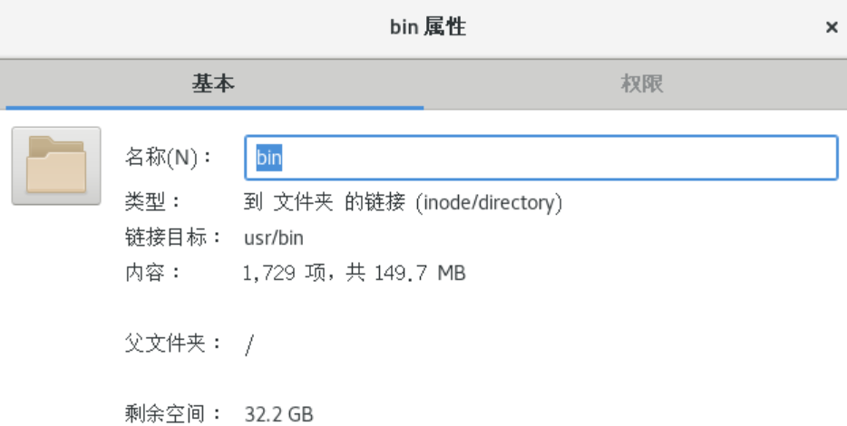

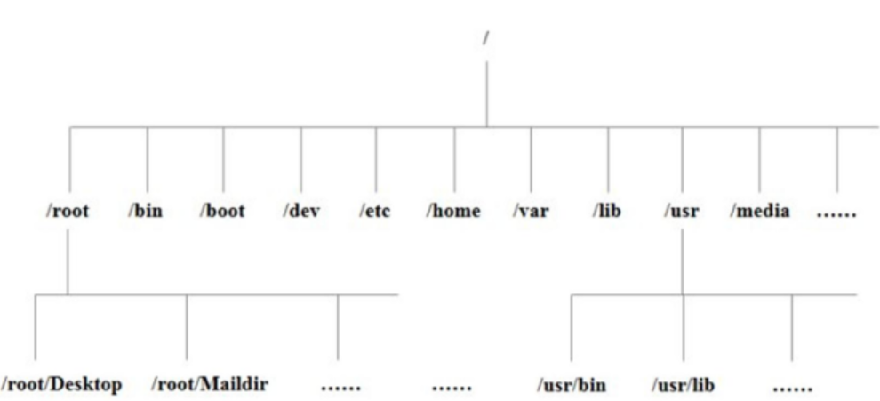

| 目录                | 内容                                                         |
| ------------------- | ------------------------------------------------------------ |
| **/bin**            | Binary的缩写，存放最常用命令                                 |
| /sbin               | s == Super User,系统管理员的系统管理程序                     |
| **/home**           | 家目录，每个用户在此有一个自己的目录                         |
| **/root**           | root 的家目录单独在外面                                      |
| /lib                | 系统开局需要的基本动态连接共享库，作用类似 Windows 的 DDL 文件，几乎所有的应用程序都需要用到这些库 |
| /lost+found         | 一般是空的，系统非法关机存放一些文件                         |
| **/etc**            | 所有系统管理的配置文件和子目录                               |
| **/usr**            | **Unix System File** 不是 User，**非常重要的文件**，用户的很多应用程序和文件都存放在此，类似 Windows 的 program files |
| **/boot**           | 存放 Linux 启动的时候的引导核心文件，包括一些连接文件和镜像文件，不要轻易放文件到此 |
| /proc               | 虚拟目录，系统内存映射，可以访问此，看系统信息               |
| /srv                | service 缩写 存放一些服务启动后需要提取的信息                |
| /sys                | linux 2.6 内核新变化，安装了 2.6 内核新出现的文件系统 sysfs  |
| /tmp                | 临时文件                                                     |
| **/media(CentOS6)** | linux 会自动识别一些设备，如 u 盘，光驱，识别后，会挂载到这里。**CentOS7 存放在 /run/media** |
| **/mnt**            | 系统提供此目录为了让用户临时挂载别的文件系统，可以把外部存储挂载到 /mnt/ ，然后进入即可查看里面的内容 |
| **/opt**            | 给主机额外安装软件摆放的目录，比如安装 mysql 可以放在这【**我为什么不用 docker？**】，默认空 |
| **/var**            | 这里存放不断扩充的东西，习惯把经常被修改的目录放在这，包括各种日志 |


# 第 2 章 VI/VIM 编辑器（重要） 

## 2.1 是什么

VI 是 Unix 操作系统和类 Unix 操作系统中最通用的文本编辑器。 

VIM 编辑器是从 VI 发展出来的一个性能更强大的文本编辑器。可以主动的以字体颜色辨别语法的正确性，方便程序设计。VIM 与 VI 编辑器完全兼容。 


## 2.2 一般模式

**以 vi 打开一个档案就直接进入一般模式了（这是默认的模式）。在这个模式中， 你可以使用『上下左右』按键来移动光标，你可以使用『删除字符』或『删除整行』来处理档案内容， 也可以使用『复制、粘贴』来处理你的文件数据。**

**这里的shifit + 6 （^） shifit + 4 ($) 相当于正则表达式里面的匹配开头和结尾**


## 2.3 编辑模式 

**在一般模式中可以进行删除、复制、粘贴等的动作，但是却无法编辑文件内容的！要等到你按下『i, I, o, O, a, A』等任何一个字母之后才会进入编辑模式。** 

**注意了！通常在Linux中，按下这些按键时，在画面的左下方会出现『INSERT或 REPLACE』的字样，此时才可以进行编辑。而如果要回到一般模式时， 则必须要按下 『Esc』这个按键即可退出编辑模式。** 

**1）进入编辑模式**

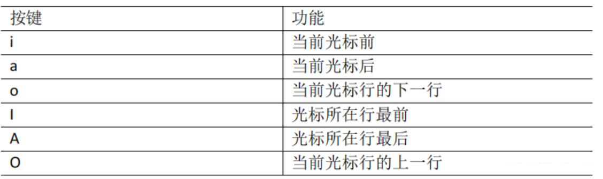

## 2.4 指令模式 

**在一般模式当中，输入『 : / ?』3个中的任何一个按钮，就可以将光标移动到最底下那一行。** 

**在这个模式当中， 可以提供你『搜寻资料』的动作，而读取、存盘、大量取代字符、 离开 vi 、显示行号等动作是在此模式中达成的！**

**1**）基本语法

| 命令          | 功能                                     |
| ------------- | ---------------------------------------- |
| :w            | 保存                                     |
| :q            | quit                                     |
| :!            | 强制                                     |
| /查找的词     | n 下一个。N 上一个                       |
| :noh          | 取消高亮                                 |
| :set nu       | 开启行号                                 |
| :set nonu     | 关闭行号                                 |
| :%s/old/new/g | 替换内容 /g 替换匹配的所有内容【当前行】 |

> **只有s没有百分号：当前行第一个匹配到的替换**
>
> **只有s没有百分号结尾加/g：当前行全部替换**
>
> **:n1， n2s/word1/word2/g：n1与n2为数字，在n1行与n2行之间寻找word1这个字符串，并将该字符串替换为word2
> :1， $s/word1/word2/g：将全文的word1替换为word2**
>
> **:1， $s/word1/word2/gc：将全文的word1替换为word2，且在替换前要求用户确认**
>
> **v：选中文本，按两下ESC取消选中状态**


# 第 3 章 网络配置（重点） 

## 3.1 查看网络 IP 和 网关 

**当前windows下的网络适配器。多了几个网卡。（为什么多了？）**

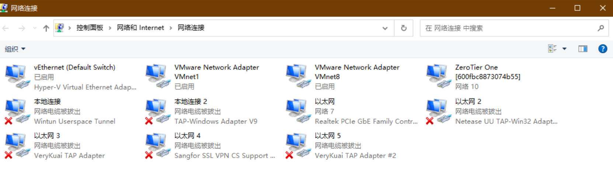


**桥接模式下，相当于通过搭建网桥和交换机，使得虚拟机对于当前局域网的别的设备是同等通信状态，位于同一个局域网。** 

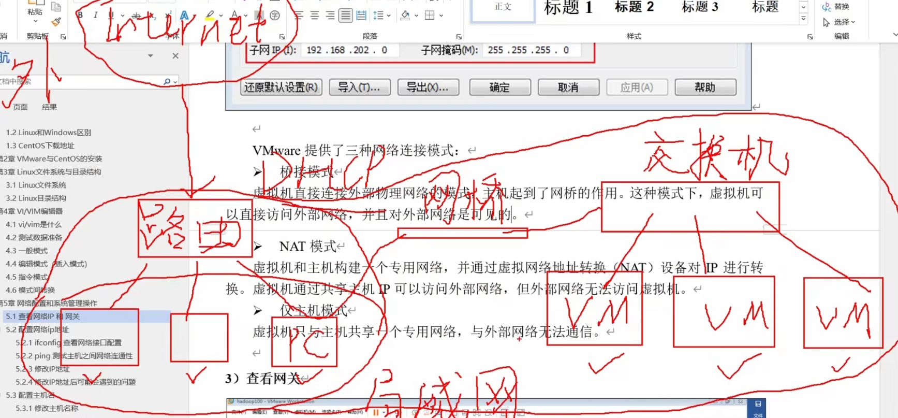


**NAT模式，全称就是Natwork address Thraslation，网络地址转换，虚拟机和主机构建一个专用网络，并通过虚拟网络地址转换（NAT）设备对IP进行转换，虚拟机通过共享主机IP可以访问外部网络，但外部网络无法访问虚拟机。**

**按理说，根据虚拟路由（其实是NAT，起到类似功能，生成一个DHCP服务器动态分配地址，这也是为什么虚拟机网段和外面不同还能ping同我们pc的原因），我们外面的pc不应该能ping同内部的虚拟机。就像我们上网，到达外面的公网，但是访问到的ip只能获取我们最上级的公网ip，而不是我们私网的设备ip。这里VmWare的做法是创建一个新的网卡，在这个网卡下，就相当于pc和这些内部的虚拟机又同在一个网段了，这个网卡，就是我们之前看到的VmWare8。**

**所以这里就是为什么主机虚拟的网卡设置为1，而内部我们查看虚拟机的VmWare8的网关是2。而DHCP设置的分配范围也避开了这两个地址。所以此时他们能够彼此无冲突在一个网段通信。**

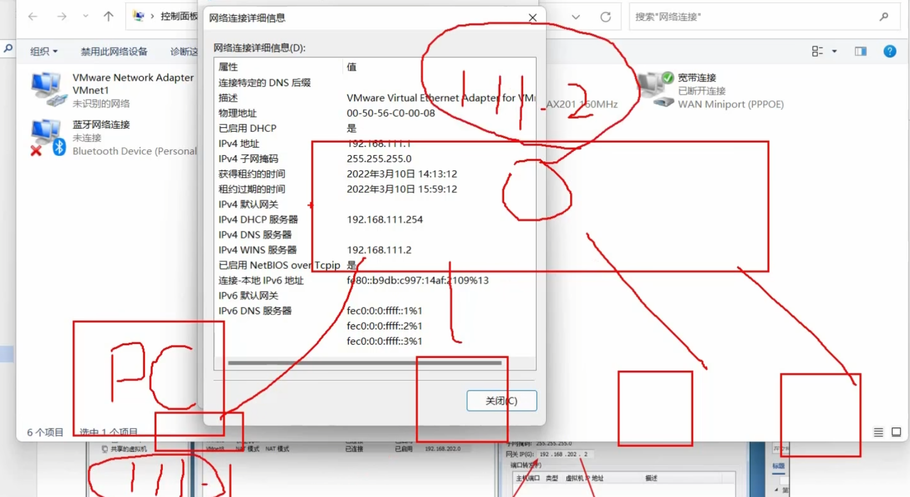


**而仅主机模式，仍然单独虚拟一块网卡，也就是我们之前看到的VmWare1，但虚拟路由的功能消失，仅起到一个交换机的效果，让主机和虚拟机唯一通信。**

**1**）查看虚拟网络编辑器，如图

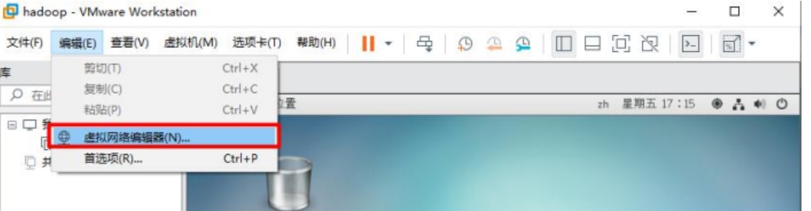

**2**）修改虚拟网卡 **Ip**


**3**)查看网关，如图

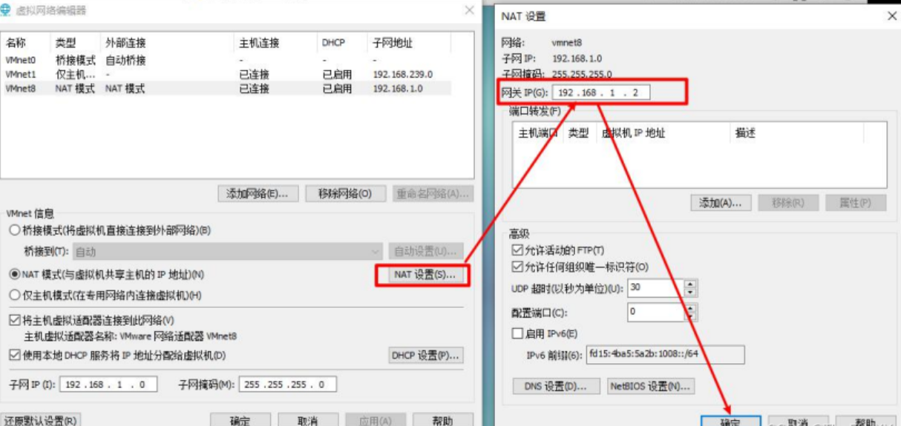


**4**)查看windows 环境的中 VMnet8 网络配置

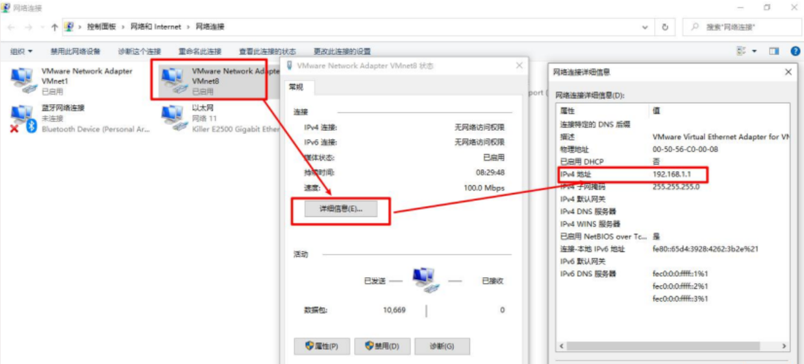


## 3.2 配置网络 ip 地址 

### 3.2.1 ifconfig 配置网络接口 

**ifconfig :network interfaces configuring 网络接口配置**

**1）基本语法** 

**ifconfig （功能描述：显示所有网络接口的配置信息）**


### 3.2.2 ping 测试主机之间网络连通性

**1）基本语法** 

**ping 目的主机 （功能描述：测试当前服务器是否可以连接目的主机）**


### 3.2.3 修改 IP 地址

ens33 是虚拟机虚拟的网卡

```sh
vim /etc/sysconfig/newwork-scripts/ifcfg-ens33
```


下面红色部分必须改【设置静态 ip】


**这里改要和 Vmware 实际的分配的网关，和 dns 解析地址相同，主要就是设置静态 ip ，然后设置一个指定的ip**


**2**）重启网络

```sh
service network restart
```


### 3.2.4 修改 IP 地址后可能会遇到的问题 

**（1）物理机能 ping 通虚拟机，但是虚拟机 ping 不通物理机,一般都是因为物理机的防火墙问题,把防火墙关闭就行** 

**（2）虚拟机能 Ping 通物理机,但是虚拟机 Ping 不通外网,一般都是因为 DNS 的设置有问题** 

**（3）虚拟机 Ping www.baidu.com 显示域名未知等信息,一般查看 GATEWAY 和 DNS 设置是否正确** 

**（4）如果以上全部设置完还是不行，需要关闭 NetworkManager 服务** 

​    **systemctl stop NetworkManager 关闭** 

​    **systemctl disable NetworkManager 禁用** 

**（5）如果检查发现 systemctl status network 有问题 需要检查 ifcfg-ens33**

## 3.3 配置主机名

### 3.3.1 修改主机名称 

**1**） 基本语法

hostname （功能描述：查看当前服务器的主机名称）

**（2）如果感觉此主机名不合适，我们可以进行修改。通过编辑 `/etc/hostname` 文件**

**修改完成后重启生效。** 

**如果不想重启服务器，可以通过以下命令修改**

```sh
hostnamectl set hostname [这里写想改的名字，不用写括号]
```


### 3.3.2 修改 hosts 映射文件 

1）修改 linux 的主机映射文件（hosts 文件） 

后续 学习集群管理的时候，虚拟机会比较多，配置时通常会采用主机名的方式配置，比较简单方便。 不用刻意记 ip 地址。 

**（1）打开/etc/hosts**

```sh
vim /etc/hosts
```

改这个其实相当于改本机自己的 dns 域名解析。

加上如下

```
192.168.2.100	vm100
192.168.2.101	vm101
192.168.2.102	vm102
192.168.2.103	vm103
192.168.2.104	vm104
```

**（2）重启设备，重启后，查看主机名，已经修改成功** 


**2）修改 windows 的主机映射文件（hosts 文件）** 

**（1）进入 C:\Windows\System32\drivers\etc 路径** 

**（2）打开 hosts 文件并添加如下内容**

```
192.168.2.100	vm100
192.168.2.101	vm101
192.168.2.102	vm102
192.168.2.103	vm103
192.168.2.104	vm104
```


如果没有权限改，可以复制到桌面改，然后再覆盖回去。


## 3.4 远程登录 

**通常在工作过程中，公司中使用的真实服务器或者是云服务器，都不允许除运维人员之外的员工直接接触，因此就需要通过远程登录的方式来操作。所以，远程登录工具就是必不可缺的，目前，比较主流的有 Xshell, SSH Secure Shell, SecureCRT,FinalShell 等**


这种工具可以配置密码，每次 ssh 自动登录，但其实并不算配置 ssh 免密登录，相当于自动后台帮你输入账号密码了。

**配置 ssh 免密登录的步骤。**

```sh
ssh-keygen
```

```sh
ssh-copyid [想要把公钥发给对方的域名或者ip]
```


# 第 4 章 系统管理 

## 4.1 Linux 中的进程和服务 

**计算机中，一个正在执行的程序或命令，被叫做“进程”（process）。** 

**启动之后一只存在、常驻内存的进程，一般被称作“服务”（service）。** 

## 4.2 service 服务管理（CentOS 6 版本-了解）

**<font color='red'>系统的服务是需要由一个后台进程，也就是守护进程（deamon）进行管理。守护进程 (daemon)是一类在后台运行的特殊进程，用于执行特定的系统任务。很多守护进程在系统引导的时候启动，并且一直运行直到系统关闭。另一些只在需要的时候才启动，完成任务后就自动结束。我们能看到很多带有.d结尾的就是守护进程。也就代表它是一个系统服务了。</font>**

**1） 基本语法** 

**service 服务名 start | stop | restart | status** 

**2） 经验技巧** 

**查看服务的方法：/etc/init.d/服务名 ,发现只有两个服务保留在 service**

```sh
cd /etc/init.d
ls -al
```


一个是 `netconsole` 一个是 `network`

3） 案例实操

**（1）查看网络服务的状态**

```sh
service network status
```


**（2）停止网络服务**

```sh
service network stop
```


**（3）启动网络服务**

```sh
service network start
```


**（4）重启网络服务**

```sh
service network restart
```


## 4.3 chkconfig 设置后台服务的自启配置（CentOS 6 版本）

**1） 基本语法**

**chkconfig （功能描述：查看所有服务器自启配置）** 

**chkconfig 服务名 off （功能描述：关掉指定服务的自动启动）** 

**chkconfig 服务名 on （功能描述：开启指定服务的自动启动）** 

**chkconfig 服务名 --list （功能描述：查看服务开机启动状态）**


看看就行，现在没人不用 CentOS7+ 吧？


## 4.4 systemctl （CentOS 7 版本重点掌握）

**1**） 基本语法

systemctl start | stop | restart | status  服务名

**2**） 经验技巧

查看服务的方法：/usr/lib/systemd/system


## 4.5 systemctl 设置后台服务的自启配置 

**1）基本语法**

systemctl list-unit-files （功能描述：查看服务开机启动状态） 

systemctl disable service_name （功能描述：关掉指定服务的自动启动） 

systemctl enable service_name （功能描述：开启指定服务的自动启动）


## 4.6 系统运行级别

**1**）Linux 运行级别[CentOS 6]

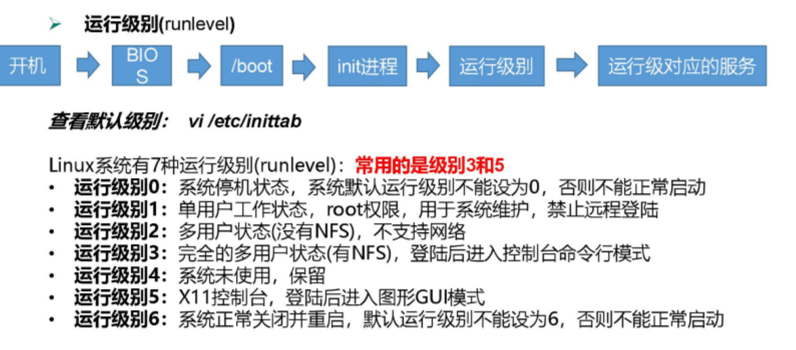

**运行级别1：类似于windows的安全模式，可以不需要密码以root进入，重设密码，但是需要本地登录即物理机**

**运行级别2：没有NetWork FileSystem，即无网络文件系统，就无法使用网络**


**2）CentOS7的运行级别简化为:**

multi-user.target 等价于原运行级别 3（多用户有网，无图形界面） 

graphical.target 等价于原运行级别 5（多用户有网，有图形界面） 

图形化界面5下，可以通过命令 setup 直接进入图形化管理系统服务，也可以终端通过init 3或者 init 5命令进行切换


**3） 查看当前运行级别:** 

systemctl get-default 


**4）修改当前运行级别** 

可以使用快捷键 ctrl + Alt + F2 切到 原运行级别 3（多用户有网，无图形界面）

可以使用快捷键 ctrl + Alt + F1 切到 原运行级别 5（多用户有网，有图形界面）

或者通过代码形式

systemctl set-default TARGET.target （这里 TARGET 取 multi-user 或者 graphical） 


## 4.7 关机重启命令 

在 linux 领域内大多用在服务器上，很少遇到关机的操作。毕竟服务器上跑一个服务是永无止境的，除非特殊情况下，不得已才会关机。

1）基本语法 


也可以写指定的几点几分关机。如果是  -h （小写h） 就是关机，这里要区分一下大写。同时写-p就是断电关机，但是容易记混就没必要记，可以直接poweroff


**2**） 经验技巧

**Linux 系统中为了提高磁盘的读写效率，对磁盘采取了 “预读迟写”操作方式。当用户** 保存文件时，Linux 核心并不一定立即将保存数据写入物理磁盘中，而是将数据保存在缓冲区中，等缓冲区满时再写入磁盘，这种方式可以极大的提高磁盘写入数据的效率。但是，也带来了安全隐患，如数据还未写入磁盘时，系统掉电或者其他严重问题出现，则将导致数据丢失。使用 sync 指令可以立即将缓冲区的数据写入磁盘。


# 第 5 章 常用基本命令（重要）

**Shell 可以看作是一个命令解释器，为我们提供了交互式的文本控制台界面。我们可以通过终端控制台来输入命令，由 shell 进行解释并最终交给内核执行。 本章就将分类介绍常用的基本 shell 命令。**


## 5.1 帮助命令 

### 5.1.1 man(manual手册) 获得帮助信息

**1**）基本语法

**man [命令或配置文件] （功能描述：获得帮助信息）** 


2）显示说明

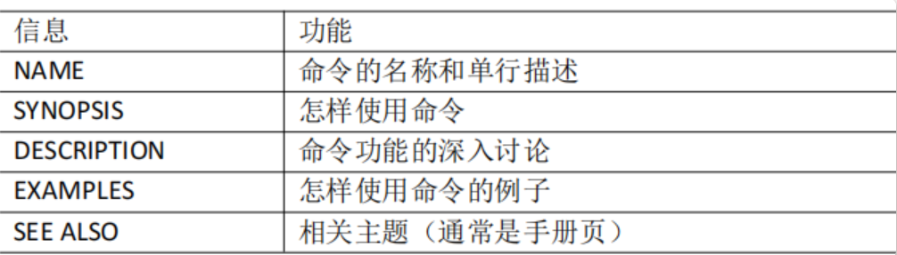


### 5.1.2 help 获得 shell 内置命令的帮助信息 

一部分基础功能的系统命令是直接内嵌在 shell 中的，系统加载启动之后会随着 shell一起加载，常驻系统内存中。这部分命令被称为“内置（built-in）命令”，如cd，exit；相应的其它命令被称为“外部命令”。 


**1**）基本语法

help 命令（功能描述：获得 shell 内置命令的帮助信息） 

想要获得外部命令的参数说明版，man内嵌了一个方法，即通过： xxx（命令名称+空格）--help 查询


### 5.1.3 常用快捷键

| 快捷键   | 作用                                                         |
| -------- | ------------------------------------------------------------ |
| Ctrl + s | 作用是暂停终端的输出，如果您想恢复已暂停的输出，则需要按下`Ctrl + Q` |
| Ctrl + c | 停止进程                                                     |
| ctrl + l | 清屏  彻底清屏 ： `reset`                                    |
| tab      | 补全/提示                                                    |
| 上下     | 查看执行过的命令                                             |

可以使用 type + 想要查看类型的命令，查看当前查看命令是内置命令还是外置命令。

reset命令将完全刷新终端屏幕，之前的终端输入操作信息将都会被清空。

这样虽然比较清爽，但整个命令过程速度有点慢，使用较少。

reset命令在终端控制错乱时非常有用。如果屏幕字符显示卡住了，此时就需要用reset命令了。


## 5.2 文件目录类

### 5.2.1 pwd 显示当前工作目录的绝对路径

pwd: print working directory 打印工作目录 


**1）基本语法** 

**pwd （功能描述：显示当前工作目录的绝对路径）** 

**pwd -P 显示软连接实际路径**


### 5.2.2 ls 列出目录的内容 

**ls:list 列出目录内容** 

**1）基本语法** 

ls [选项] [目录或是文件] 


**2）选项说明**

| 选项 | 功能                                               |
| ---- | -------------------------------------------------- |
| -a   | 全部的文件，连同 . 开头的隐藏文件也显示            |
| -l   | 长数据串联列出，可以把权限和文件类型等信息一并输出 |
| -h   | 人性化输出 如文件以 kb 大小显示 默认字节           |


**每行列出的信息依次是： 文件类型与权限 链接数 文件属主 文件属组 文件大小用byte** 来表示 建立或最近修改的时间 名字


### 5.2.3 cd 切换目录

**cd:Change Directory 切换路径** 

**1）基本语法** 

**cd [参数]** 

**2**）参数说明


| 参数        | 功能                          |
| ----------- | ----------------------------- |
| cd 绝对路径 | 切换路径                      |
| cd 相对路径 | 切换路径                      |
| cd ~ 或 dd  | 回到自己的家目录              |
| cd -        | 回到上一次目录                |
| cd ..       | 返回上一层级                  |
| cd -P       | 跳转实际物理路径 并非快捷路径 |


### 5.2.4 mkdir 创建一个新的目录 

**mkdir:Make directory 建立目录** 

**1）基本语法** 

mkdir [选项] 要创建的目录


**2**）选项说明

| 选项 | 作用                           |
| ---- | ------------------------------ |
| -P   | 递归创建多层父级【如果不存在】 |


### 5.2.5 rmdir 删除一个空的目录 

**rmdir:Remove directory 移除目录** 

**1）基本语法** 

rmdir 要删除的空目录 


### 5.2.6 touch 创建空文件 

**1）基本语法** 

**touch 文件名称 这里的文件如果不人为指定后缀，默认是文本文件，和vim文件不同的是，touch可以创建空文件。vim如果创建文件不书写内容，不会创建空文件，如果保存并退出就行。**


### 5.2.7 cp 复制文件或目录 

**1）基本语法** 

**cp [选项] source dest** 

（功能描述：复制 `source` 文件到 `dest`）


**2）选项说明** 

| 选项 | 作用           |
| ---- | -------------- |
| -r   | 递归复制子目录 |


### 5.2.8 rm 删除文件或目录 

**1）基本语法** 

**rm [选项] deleteFile** 

**（功能描述：递归删除目录中所有内容）** 


**2）选项说明**

| 选项 | 作用               |
| ---- | ------------------ |
| -r   | 递归删除子目录     |
| -f   | 强制执行，无需同意 |
| -v   | 显示详细过程       |


### 5.2.9 mv 移动文件与目录或重命名 

**1）基本语法** 

**（1）mv oldNameFile newNameFile** 

**（功能描述：重命名）** 


**（2）mv /temp/movefile /targetFolder** 

**（功能描述：移动文件）**


### 5.2.10 cat 查看文件内容 （concatenate and print files）

**查看文件内容，从第一行开始显示。** 

**1）基本语法** 

**cat [选项] 要查看的文件** 


**2）选项说明**

| 选项 | 作用                       |
| ---- | -------------------------- |
| -n   | 显示所有行的行号，包括空行 |


### 5.2.11 more 文件内容分屏查看器 

**more 指令是一个基于 VI 编辑器的文本过滤器，它以全屏幕的方式按页显示文本文件**的内容。more 指令中内置了若干快捷键，详见操作说明。

**1）基本语法** 

**more 要查看的文件** 


**2）操作说明**

| 操作           | 作用                   |
| -------------- | ---------------------- |
| space 【空格】 | 向下翻一页             |
| Enter          | 向下翻一行             |
| q              | 退出                   |
| ctrl + f       | 向下翻一屏             |
| ctrl + b       | 向上翻一屏             |
| =              | 输出当前行行号         |
| :f             | 输出文件名和当前行行号 |


### 5.2.12 less 分屏显示文件内容 

**less 指令用来分屏查看文件内容，它的功能与 more 指令类似，但是比 more 指令更加强大，支持各种显示终端。less 指令在显示文件内容时，并不是一次将整个文件加载之后才显示，而是根据显示需要加载内容，对于显示大型文件具有较高的效率。** 

**1）基本语法** 

**less 要查看的文件** 


**2**）操作说明

| 操作           | 作用                           |
| -------------- | ------------------------------ |
| space 【空格】 | 向下翻一页                     |
| [pagedown]     | 向下翻一页                     |
| [pageup]       | 向上翻一页                     |
| /字符串        | 向下搜索. n: 下一个，N: 上一个 |
| ?字符串        | 向上搜索. n: 下一个，N: 上一个 |
| q              | 退出                           |


### 5.2.13 echo 

**echo 输出内容到控制台** 

**1）基本语法** 

**echo [选项] [输出内容]** 


**选项：** 

**-e： (escape character)支持反斜线控制的字符转换**


| 控制字符 | 作用        |
| -------- | ----------- |
| `\\`     | 输出`\`本身 |
| `\n`     | 换行符      |
| `\t`     | 制表符      |


### 5.2.14 head 显示文件头部内容

**默认前十行**

想指定行数字如5行：

```
head -n 5
```


### 5.2.15 tail 输出文件尾部内容

**默认后十行**

想指定行数字如5行：

```
tail -n 5
```


想要监视文件变化【末尾】

**参数 `-f`** ： 举例

```sh
tail -f test.txt
```


**若复写，可以复写，检测的控制台会报错。此时如果使用vim进行修改，追踪不会更新，因为文件在硬盘文件其实在底层是以一个带有index的结点进行记录的，就是inode，我们可以使用 ls -i 查看当前文件的索引号。而追踪的命令其实是根据index进行追踪，使用vim进行更改，会发现index变了。自然追踪也出现了问题。vim本质是先写到.swp文件里面，然后进行替换索引的，所以索引号发生了变化。**

**按 ctrl + s：可以暂停显示追踪（但其实还是后台记录了更新）**

**按 ctrl + q：可以继续显示追踪**

**按 ctrl + c：可以退出进程**


### 5.2.16 > 输出重定向和 >> 追加 

**1**）基本语法

**（1）ls -l > 文件** 

功能描述：列表的内容写入文件 a.txt 中（覆盖写）


**（2）ls -al >> 文件** 

功能描述：列表的内容写入文件 a.txt 中（追加）


**（3）cat 文件1 > 文件2** 

功能描述：列表的内容写入 `文件2` 中（覆盖写）


**（4）echo "xxxxxx" >> 文件** 

功能描述：列表的内容写入文件中（追加写）


### 5.2.17 ln 软链接

**使用链接，文件类型是l，正常文件是 -，而文件夹是d**


**不加 -s 相当于硬链接，删除链接文件对目标文件在磁盘的存储无影响。软连接就是一个文件指向，软链接类似于链表的一个节点，硬链接类似于一个指针。**

**加上 -s 相当于软链接，新建一个新的inode，指向目标结点，记录标记文件的地址。**

**一个文件当所有的硬链接数为0，此时没有能指向物理磁盘的文件，才会真正删除，在此之前哪怕删除源文件，还可以通过未删除的硬链接访问到这个文件。**

**新建一个目录后，目录本身是指向自身inode的一个硬链接，新建的目录内也有一个叫“.”的硬链接指向新建的目录，所以新建目录的硬链接数目是2**


### 5.2.18 history 查看已经执行过历史命令

**history [数字] ：**显示指定数目的行数

**![数字]** ：重复执行指定行数的命令

**history -c：清除所有历史**


## 5.3 时间日期类


### 5.3.1 date 显示当前时间 

**加号是需要打出来的，不是连接符号**


**date +%s : 把当前日期以时间戳形式显示**


### 5.3.2 date 显示非当前时间 

显示前一天

```sh
date -d '1 day ago'
```

显示明天

```sh
date -d '-1 day ago'
```


### 5.3.3 date 设置系统时间 

```sh
date -s 字符串时间
```


### 5.3.4 cal 查看日历 

cal [选项] 不加选项显示本年，加了填对应年份


## 5.4 用户管理命令 

### 5.4.1 useradd 添加新用户

添加一个新用户

```sh
useradd 用户名
```


添加新用户到一个已知组

```sh
useradd -g 组名 用户名
```


`-M` 不为用户设置家目录，一般用于创建系统用户 

`-d [/home/xxx （用户名）]` 新建用户但是给它的家目录改名，用户名不变。而如果使用有root权限的用户修改家目录的名称，本质上登录会显示找不到自己的家目录，然后跳转到home目录，并没有达到改变该用户的家目录的效果


### 5.4.2 passwd 设置用户密码 

**1**）基本语法

**passwd 用户名** 

**（功能描述：设置用户密码)**


### 5.4.3 id 查看用户是否存在

**1**）基本语法

**id 用户名** 


### 5.4.4 cat /etc/passwd 查看创建了哪些用户 


### 5.4.5 su 切换用户

**其实这里su切换用户是嵌套会话，我们可以通过exit退出，返回之前的用户，不需要再su切换回去。**


su = switch user

切换用户只能获取执行权限，获取不了环境变量

```sh
su 用户名
```


切换用户只能获取执行权限，获取环境变量

```sh
su - 用户名
```


### 5.4.6 userdel 删除用户

**删除用户但是保留家目录**

```sh
userdel 用户名
```


**删除用户不保留家目录，同时会把这个用户相关的文件都删除**

```sh
userdel -r 用户名
```


### 5.4.7 who 查看登录用户信息 

显示自身用户名称

```sh
whoami
```


同时显示登录时间

```sh
who am i
```


### 5.4.8 sudo 设置普通用户具有 root 权限

**sudo的英文全称是super user do,即以超级用户(root 用户)的方式执行命令。**


想要增加 sudo 用户，可以 修改 `/etc/sudoers` 文件，在已有用户下面添加相同格式的配置

```sh
root ALL=(ALL) ALL
fanxy ALL=(ALL) ALL
```


如果配置使用 sudo 不需要输密码

```sh
root ALL=(ALL) ALL
fanxy ALL=(ALL) NOPASSWD:ALL
```


### 5.4.9 usermod 修改用户

**1**）基本语法

**usermod -g 用户组 用户名**

必须给定存在的组，默认组 id 1


## 5.5 用户组管理命令 

**每个用户都有一个用户组，系统可以对一个用户组中的所有用户进行集中管理。不同** Linux 系统对用户组的规定有所不同， 如Linux下的用户属于与它同名的用户组，这个用户组在创建用户时同时创建。

**用户组的管理涉及用户组的添加、删除和修改。组的增加、删除和修改实际上就是对** `/etc/group` 文件的更新。


### 5.5.1 groupadd 新增组 

groupadd 组名


### 5.5.2 groupdel 删除组 

groupdel 组名


### 5.5.3 groupmod 修改组 

groupmod -n 新组名 老组名


### 5.5.4 cat /etc/group 查看创建了哪些组


## 5.6 文件权限类

### 5.6.1 文件属性 

**Linux系统是一种典型的多用户系统，不同的用户处于不同的地位，拥有不同的权限。** 

**为了保护系统的安全性，Linux系统对不同的用户访问同一文件（包括目录文件）的权限做了不同的规定。在Linux中我们可以使用ll或者ls -l命令来显示一个文件的属性以及文件所属的用户和组。**

**c字符文件，b块文件，l链接文件。**


rwx 对于文件和文件夹的不同含义

1. 文件： 

   r：文件可读。 

   w：文件可写，可修改，**但不代表科删除，删除一个文件需要对文件所在目录的写权限**。

   x：文件可执行

2. 文件夹：

   r：文件夹可以读取 ： ls

   w：文件夹可以修改，**即目录内可以 新建，删除，重命名内部的文件或文件夹**

   x：**文件夹可被进入**

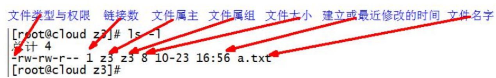

新建一个目录后，目录本身是指向自身inode的一个硬链接，新建的目录内也有一个叫“.”的硬链接指向新建的目录，所以新建目录的硬链接数目是2


### 5.6.2 chmod 改变权限


### 5.6.3 chown 改变所有者

改变文件或用户的所有者 【括号只代表占位符属性，不需要打】

```sh
chown [选项] [最终用户] [文件或目录]
```

| 选项 | 作用               |
| ---- | ------------------ |
| -R   | 递归进行【子目录】 |


### 5.6.4 chgrp 改变所属组

改变文件或目录的所属组 【括号只代表占位符属性，不需要打】

```sh
chown [最终用户组] [文件或目录]
```


## 5.7 搜索查找类 

### 5.7.1 find 查找文件或者目录

递归的从指定目录进行搜索，把满足条件的文件显示在终端【括号只代表占位符属性，不需要打】

```sh
find [搜索范围] [选项]
```

| 选项  | 作用                                                         |
| ----- | ------------------------------------------------------------ |
| -name | 按文件名查询                                                 |
| -user | 按所属用户查询                                               |
| -size | 按文件大小查询：单位为：【b 块 512子节】【c 子节】【w 词 2子节】【k 千子节】【M 兆字节】【G 吉子节】 |


### 5.7.2 locate 快速定位文件路径

**最好每次查询之前要更新一下！**

locate指令利用事先建立的系统中所有文件名称及路径的locate数据库实现快速定位给定的文件。Locate指令无需遍历整个文件系统，查询速度较快。为了保证查询结果的准确度，管理员必须定期更新locate时刻。


**更新方法**

```sh
updatedb
```

**类似的也可以通过**

**which命令 + 命令查别名和位置**

**where is 命令 可以查位置** 


### 5.7.3 grep 过滤查找及 “|” 管道符

“|” 管道符，代表上一个命令的输出结果传递给下一个命令

| 选项 | 效果               |
| ---- | ------------------ |
| -i   | 忽略大小写         |
| -m   | 最大匹配个数       |
| -n   | 显示匹配行以及行号 |


## 5.8 压缩和解压类 

### 5.8.1 gzip/gunzip 压缩

1)功能描述:压缩文件，只能将文件压缩为*.gz文件

```
gzip 文件 
```


2）经验技巧

1. 只能压缩文件不能压缩目录
2. 不保留原来的文件
3. 同时多个文件会产生多个压缩包


### 5.8.2 zip/unzip 压缩 

**1**）基本语法

压缩（功能描述：压缩文件和目录的命令）

```sh
zip [选项] XXX.zip 
```

| 选项 | 效果       |
| ---- | ---------- |
| -r   | 忽略大小写 |


解压缩

```sh
unzip [选项] XXX.zip
```

| 选项 | 效果                 |
| ---- | -------------------- |
| -d   | 指定解压后的存放目录 |


### 5.8.3 tar 打包【重要】

一般就是

压缩：

```sh
tar -zcvf xxxx xxxx xxxx xxxx
```

解压【指定目录，可以不指定，去除 -C 后面的】:

```sh
tar -zxvf -C /xxx/xxx/
```


打包目录，压缩后的格式 .tar.gz

```sh
tar [选项] XXX.tar.gz 将要打包进去的内容
```

| 选项 | 效果                     |
| ---- | ------------------------ |
| -z   | 调用gzip，-z打包同时压缩 |
| -x   | 解包 .tar 文件           |
| -c   | 产生 .tar 打包文件       |
| -v   | 显示详细信息             |
| -f   | 指定压缩后的文件名       |
| -C   | 指定解压目录             |


## 5.9 磁盘查看和分区类 

### 5.9.1 du 查看文件和目录占用的磁盘空间

**disk(磁盘) 一般都不会打具体文件，我们使用ls的衍生命令，或者ll就可以了。**

**而直接使用，或者使用 -a(显示的更多)，显示的太冗余，我们只关心具体占用，就用-s（只显示总和）。但是这么操作显示又太少，就用最后的 ： du --max-depth=n（这里填1效果很好），可以选择显示层级**


### 5.9.2 df 查看磁盘空间使用情况

df : disk free 磁盘空余

| 选项 | 作用                              |
| ---- | --------------------------------- |
| -h   | 以人类易读的 GBytes KBytes 等显示 |

free -h ：通过命令 free，可以查看当前内存占用情况


### 5.9.3 lsblk 查看设备挂载情况

lsblk 查看设备挂载情况

| 选项 | 作用                               |
| ---- | ---------------------------------- |
| -f   | 查看详细挂载信息，显示文件系统信息 |

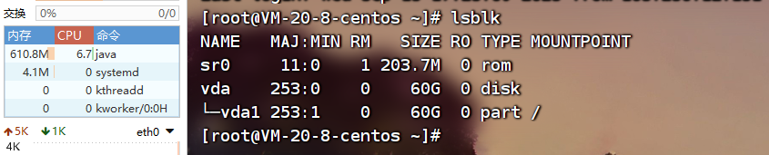

**MAJ:MIN : 显示设备的主要和次要设备号，MAJ(major number)表示不同的设备类型，MIN(minor number)表示同一个设备的的不同分区。**

**RM : 显示设备是否可移动。请注意，在此示例中，设备sr0的RM值等于1，表示它是可移动的。**

**SIZE : 提供有关设容量的信息。**

**RO : 显示设备是否为只读。在这种情况下，所有设备的RO均为RO = 0，表示它们不是只读的。**

**TYPE : 显示块设备是磁盘还是磁盘中的分区（部分）的信息。在此示例中，sda和sdb是磁盘，而sr0是只读存储器（rom）。**

**MOUNTPOINT : 显示设备的挂载点。**

**sr0其实指的是光驱。硬盘以前有IDE硬盘，但是现在已经不常用了，而常用的是SATA硬盘，还有SCSI小型计算机接口硬盘，服务器一般用的这个。像vda，就是虚拟硬盘。**


### 5.9.4 mount/umount 挂载/卸载

对于Linux用户来讲，不论有几个分区，分别分给哪一个目录使用，它总归就是一个根目录、一个独立且唯一的文件结构。

Linux中每个分区都是用来组成整个文件系统的一部分，它在用一种叫做“挂载”的处理方法，它整个文件系统中包含了一整套的文件和目录，并将一个分区和一个目录联系起来，要载入的那个分区将使它的存储空间在这个目录下获得。

**这部分 CSDN 部分我有详细笔记，日后如果有需要单独记录**


### 5.9.5 fdisk 分区

**1**）基本语法

**fdisk -l （功能描述：查看磁盘分区详情）** 

**fdisk 硬盘设备名 （功能描述：对新增硬盘进行分区操作）**

**这部分 CSDN 部分我有详细笔记，日后如果有需要单独记录**


## 5.10 进程管理类 

**进程是正在执行的一个程序或命令，每一个进程都是一个运行的实体，都有自己的地址空间，并占用一定的系统资源**。


### 5.10.1 ps 查看当前系统进程状态

**这种加 - 的选项，就是 `类unix格式`，而不加的是 `类bsd格式`。**

**a的意思重在所有用户，x重在所有进程，二者结合用就是所有用户的所有进程**

**加了 a 或者是下面的 -e 会把和用户无关的也展示，如果仅仅是当前用户的，可以省略。什么都不加只会显示和当前终端相关的进程。**


ps = process status 进程状态

#### 1. 基本用法

查看系统所有进程

```sh
ps aux | grep xxx
```


查看系统所有进程，**可以查看父子进程的关系**

```sh
ps -ef | grep xxx
```


| 选项 | 作用                                     |
| ---- | ---------------------------------------- |
| a    | 列出待用终端所有用户进程                 |
| x    | 列出当前用户所有进程，包括没用终端的进程 |
| u    | 面向用户友好显示风格                     |
|      |                                          |
| -e   | 列出所有进程                             |
| -u   | 列出某个用户关联的所有进程               |
| -f   | 显示完整格式的进程列表                   |


#### 2. 详细信息说明

**ps aux 说明**

| 信息     | 解释                                                         |
| -------- | ------------------------------------------------------------ |
| USER     | 所属用户                                                     |
| **PID**  | 进程的 ID 号                                                 |
| **%CPU** | CPU占比 越高越耗费资源                                       |
| **%MEM** | 内存占比 越高越耗费资源                                      |
| VSZ      | 该进程占用虚拟内存的大小 单位 KB                             |
| RSS      | 该进程占用实际内存的大小 单位 KB                             |
| TTY      | 该进程在哪个终端运行 CentOS 来说： tty1 是图形化端。tty2~tty6 是本地字符界面终端。 pts/0-255 是虚拟终端 |
| STAT     | 进程状态。【R：运行状态】【S：睡眠状态】【T：暂停状态】【Z：僵尸状态】【s：包含子进程】【l：多线程】【+：前台显示】 |
| START    | 进程启动时间                                                 |
| TIME     | 进程占用 CPU 时间，不是系统时间                              |
| COMMAND  | 产生这个进程的命令和参数                                     |


**ps -ef 说明**

| 信息     | 解释                                                         |
| -------- | ------------------------------------------------------------ |
| UID      | 用户的 ID 号                                                 |
| **PID**  | 进程的 ID 号                                                 |
| **PPID** | 父进程的 ID 号                                               |
| C        | CPU 用于计算执行优先级的因子，数值越大，表明进程是 **CPU密集型计算** ，执行优先度会降低；越小证明是 **IO密集型计算** ，执行优先度会高 |
| TTY      | 该进程在哪个终端运行 CentOS 来说： tty1 是图形化端。tty2~tty6 是本地字符界面终端。 pts/0-255 是虚拟终端 |
| STAT     | 进程状态。【R：运行状态】【S：睡眠状态】【T：暂停状态】【Z：僵尸状态】【s：包含子进程】【l：多线程】【+：前台显示】 |
| TIME     | 进程占用 CPU 时间，不是系统时间                              |
| CMD      | 产生这个进程的命令和参数                                     |


如果想查看进程的 **CPU占用率和内存占用率**，可以使用 `aux`

如果想查看 **进程的父进程ID** 可以使用 `ef`


### 5.10.2 kill 终止进程

**可以通过 kill -l 查看各种kill信号代表的含义**

kill [选项]进程号(功能描述:通过进程号杀死进程)

killall 进程名称 (功能描述:通过进程名称杀死进程，也支持通配符，这在系统因负载过大而变得很慢时很有用)

| 选项 | 解释              |
| ---- | ----------------- |
| -9   | 强迫停止 杀死进程 |


### 5.10.3 pstree 查看进程树

pstree [选项]

| 选项 | 解释          |
| ---- | ------------- |
| -p   | 显示进程的PID |
| -u   | 显示所属用户  |


### 5.10.4 top 实时监控系统进程状态 

top [选项]

| 选项    | 解释                                                         |
| ------- | ------------------------------------------------------------ |
| -d 秒数 | 指定每多少秒刷新一次，默认 **3秒**                           |
| -i      | **不显示闲置和僵尸进程。只要刷新时段内用过CPU的进程，都会显示，但这些进程可能在刷新时点又睡了** |
| -p      | **通过指定监控进程 ID 来只监控一个指定 ID 的进程状态**       |


**操作按钮**

| 操作 | 作用                   |
| ---- | ---------------------- |
| P    | 以 CPU使用率 进行排序  |
| M    | 以 内存使用率 进行排序 |
| N    | 以 PID 进行排序        |
| q    | 退出                   |


**查询字段解释**

**第一行：任务队列信息**

| 内容                         | 说明                                                         |
| ---------------------------- | ------------------------------------------------------------ |
| 00:16:30                     | 系统时间                                                     |
| up 5 day, 10:10              | 系统运行时间                                                 |
| 2 users                      | 目前系统登录两个用户                                         |
| load average: 0.32,0.35,0.24 | 系统在之前 1 分钟，5 分钟，15 分钟的平均负载。一般认为小于 `1` 时，负载较小。如果大于 `1` ，系统已经超出负载 |

**第二行：进程信息**

| 内容              | 说明               |
| ----------------- | ------------------ |
| Tasks:  114 total | 系统进程数目       |
| 1 running         | 正在运行的进程数   |
| 116 sleeping      | 睡眠的进程数       |
| 0 stopped         | 正在停止的进程数目 |
| 0 zombie          | 僵尸进程数目       |

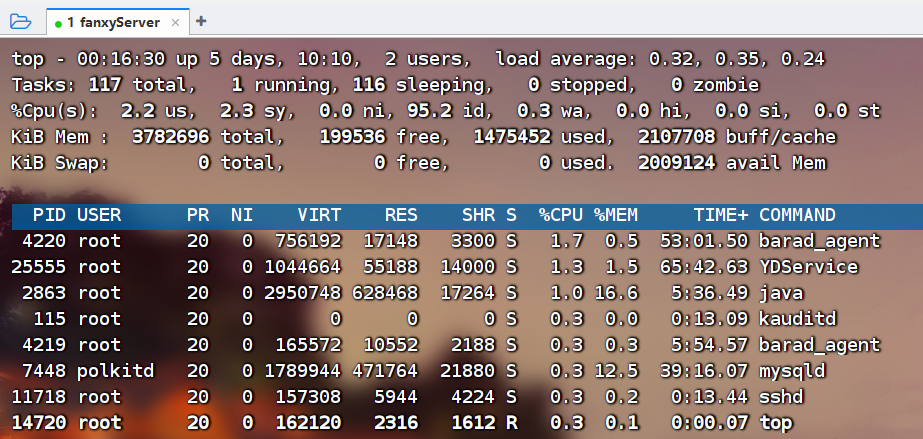

**第三行： CPU 信息**

| 内容           | 说明                                                         |
| -------------- | ------------------------------------------------------------ |
| %Cpu(s) 2.2 us | 用户模式占用的 CPU 百分比                                    |
| 2.3 sy         | 系统模式占用的 CPU 百分比                                    |
| 0.0 ni         | 改变过优先级的用户进程占用 CPU 百分比                        |
| 95.2 id        | 空闲 CPU 的 CPU 百分比                                       |
| 0.3 wa         | 等待输入/输出的进程的占用 CPU 百分比                         |
| 0.0 hi         | 硬中断请求服务占用 CPU 百分比                                |
| 0.0 si         | 软中断请求服务占用 CPU 百分比                                |
| 0.0 st         | st【Steal time】虚拟时间百分比，就是当拥有虚拟机的时候，虚拟 CPU 等待实际 CPU 的时间百分比 |

**第四行：行为物理内存信息**

| 内容                    | 说明                   |
| ----------------------- | ---------------------- |
| KiB Mem : 3782696 total | 物理内存的总量 单位 KB |

剩下的字面意思能看懂。分别为 空闲，使用中，缓存。

**第五行：交换分区(swap)信息**

同第四行的格式。


### 5.10.5 netstat 显示网络状态和端口占用信息

基本用法

**查看指定进程网络信息**

```sh
netstat -anp | grep 端口号
```


**查看网络端口号占用情况**

```sh
netstat -nlp | grep 端口号
```

| 选项 | 解释                                                 |
| ---- | ---------------------------------------------------- |
| -a   | 显示所有正在监听【listen】和未监听的套接字【socket】 |
| -n   | 拒绝显示别名 能显示数字尽量显示数字                  |
| -l   | 仅列出正在监听的服务状态                             |
| -p   | 表示显示哪个进程在调用                               |


## 5.11 crontab 系统定时任务

### 5.11.1 crontab 服务管理

**`Ubuntu` 是 `cron` ，没有d**

重启 crond 服务

```sh
systemctl restart crond
```


### 5.11.2 crontab 定时任务设置

基本语法

```sh
crontab [选项]
```

| 选项 | 解释                            |
| ---- | ------------------------------- |
| -e   | 编辑 crontab 定时任务           |
| -l   | 查询 crontab 定时任务           |
| -r   | 删除当前用户所有的 crontab 任务 |


进入 crontab 编辑界面，会打开 vim 编辑页面

```sh
* * * * * 执行的任务
```


含义如下

| 项目      | 含义             | 范围               |
| --------- | ---------------- | ------------------ |
| 第 1 个 * | 一小时的第几分钟 | 0-59               |
| 第 2 个 * | 一天的第几个小时 | 0-23               |
| 第 3 个 * | 一个月中的第几天 | 1-31               |
| 第 4 个 * | 一年当中的第几月 | 1-12               |
| 第 5 个 * | 一周当中的星期几 | 0-7 0和7都代表周日 |


**特殊符号**

| 符号 | 含义                                                         |
| ---- | ------------------------------------------------------------ |
| *    | **任何时间。** 比如第一项设置 * 代表：一小时中每分钟都执行一次命令 |
| ,    | **代表不连续的时间。** 如"0 8,12,16 * * * 命令" 表示每天的 8点0分，12点0分，16点0分都执行一次命令 |
| -    | **代表连续的时间范围。** 比如 "0 5 * * 1-6 命令" 表示，每周一到周六的凌晨 5点0分执行命令 |
| */n  | **代表每隔多久执行一次命令。** 比如 "*/10 * * * *" 表示，每隔 10 分钟执行一次命令 |


**一些案例**

| 符号         | 含义                                                         |
| ------------ | ------------------------------------------------------------ |
| 45 22 * * *  | 每天 22 点 45 分执行                                         |
| 0 5 1,15 * * | 每个月 1号和15号 的凌晨 5点0分执行                           |
| 40 4 * * 1-5 | 每周一到周五 的凌晨 4点40分执行                              |
| 0 0 1,15 * 1 | 每个月 1号和15号 每周一的 0点0分都会执行。注意：星期几和几号不要同时出现，都代表天，可读性差 |


# 第 6 章 软件包管理 

## 6.1 RPM 

现在几乎都是用 yum ，甚至可以说，都是用 docker ，有一说一，可以直接看 yum ，这里作为一个必要时间的笔记检索。


### 6.1.1 RPM 概述

RPM (RedHat Package Manager)，RedHat软件包管理工具，类似windows里面的setup.exe是Linux这系列操作系统里面的打包安装工具，它虽然是RedHat的标志，但理念是通用的。

RPM包的名称格式

Apache-1.3.23-11.i386.rpm

- Apache 软件名称

- “1.3.23-11” 软件的版本号 : 主版本和次版本
- “i386” 是软件所运行的硬件平台，Intel 32位处理器的统称
- "rpm”文件扩展名，代表RPM包
  

### 6.1.2 RPM 查询命令（rpm -qa）

**rpm -qi (查询详细信息)**

1)基本语法

rpm -qa	(功能描述:查询所安装的所有rpm软件包)

2）经验技巧

由于软件包比较多，一般都会采取过滤。`rpm -qa | grep rpm` 软件包


### 6.1.3 RPM 卸载命令（rpm -e）

**基本语法**

rpm -e RPM软件包

rpm -e --nodeps 软件包


**选项说明**

| 选项     | 功能                                                         |
| -------- | ------------------------------------------------------------ |
| -e       | 卸载软件包                                                   |
| --nodeps | 卸载软件时，不检查依赖。这样的话，那些使用该软件包的软件在此之后可能就不能正常工作了。 |


### 6.1.4 RPM 安装命令（rpm -ivh）

**基本语法**

rpm -ivh RPM软件包


**选项说明**

| 选项     | 功能                   |
| -------- | ---------------------- |
| -i       | install 安装           |
| -v       | --verbose 显示详细信息 |
| -h       | --hash 显示进度条      |
| --nodeps | 安装前不检查依赖       |


## 6.2 YUM 仓库配置 

### 6.2.1 YUM 概述

YUM（全称为Yellow dog Updater,Modified）是一个在 Fedora 和 RedHat 以及 CentOS中的Shell前端软件包管理器。基于RPM包管理，能够从指定的服务器自动下载RPM包并且安装，可以自动处理依赖性关系，并且一次安装所有依赖的软件包，无须繁琐地一次次下载、安装

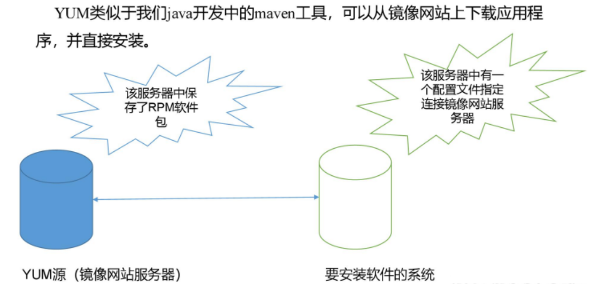


### 6.2.2 YUM 的常用命令 

**基本语法**

```sh
yum [选项][参数]
```


**选项说明**

| 选项         | 功能                        |
| ------------ | --------------------------- |
| -y           | 对所有提问回答 yes          |
| install      | 安装 rpm 软件包             |
| update       | 更新 rpm 软件包             |
| check-update | 检查是否有可用的更新 rpm 包 |
| remove       | 删除指定的 rpm 软件包       |
| list         | 显示软件包信息              |
| clean        | 清理 yum 过期的缓存         |
| deplist      | 显示 yum 软件包的依赖关系   |


### 6.2.3 修改网络 YUM 源

默认源需要连接 `apache` 网站，网速慢。建议换成国内源。比如阿里云，华为云等。

首先安装 `wget` ，它可以指定 `url` 下载文件

```sh
yum install wget
```


在 `/etc/yum/.repos.d` 目录下，备份默认的 `repos` 文件

```sh
cd /etc/yum/.repos.d
cp CentOS-Base.repo CentOS-Base.repos.backup
```


然后下载任意网上推荐的 `repos` 文件

此处以阿里云为例子。最好别用我的，去网上搜最新的。

```sh
wget http://mirrors.aliyun.com/repo/Centos-7.repo 
```


然后使用这个替代默认的 `repos` 文件。

```sh
mv Centos-7.repo CentOS-Base.repo
```


清除旧缓存数据，缓存新数据

`yum makecache` 就是把服务器的包信息下载到本地缓存起来。

```sh
yum clean all
yum makecache
```


大功告成。


