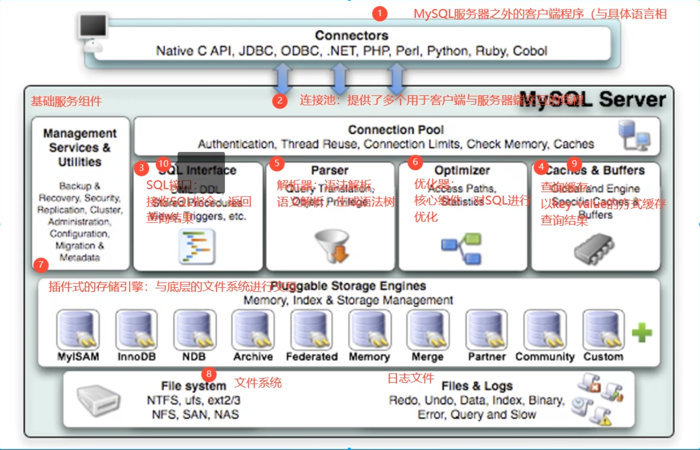
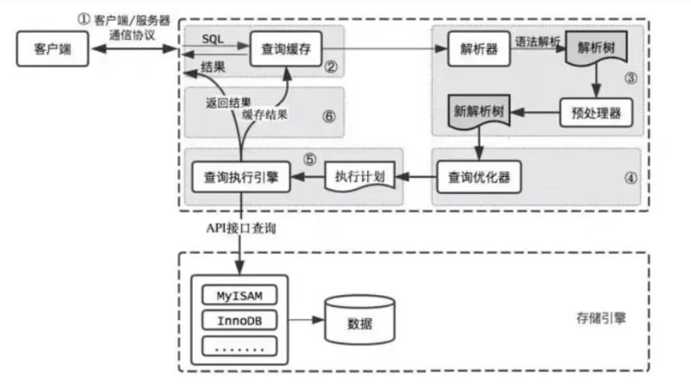
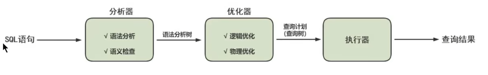
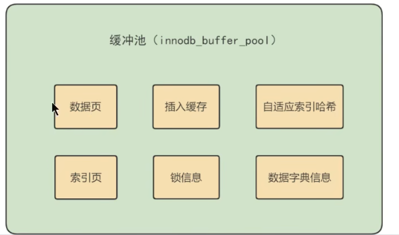

# 第04章 逻辑架构

# 1. 逻辑架构剖析




## 1.1 第1层：连接层

系统（客户端）访问 `MySQL` 服务器前，做的第一件事就是建立 `TCP` 连接。

经过三次握手建立连接成功后，`MySQL` 服务器对 `TCP` 传输过来的账号密码做身份认证、权限获取。

- **用户名或密码不对，会收到一个Access denied for user错误，客户端程序结束执行**
- **用户名密码认证通过，会从权限表查出账号拥有的权限与连接关联，之后的权限判断逻辑，都将依赖于此时读到的权限**

`TCP` 连接收到请求 **后**，必须要分配给一个线程专门与这个客户端的交互。所以还会有个线程池，去走后面的流程。每一个连接从线程池中获取线程，省去了创建和销毁线程的开销。


## 1.2 第2层：服务层

- **SQL Interface: SQL接口**

  - 接收用户的SQL命令，并且返回用户需要查询的结果。比如SELECT ... FROM就是调用SQL Interface 
  - MySQL支持DML（数据操作语言）、DDL（数据定义语言）、存储过程、视图、触发器、自定义函数等多种SQL语言接口

- **Parser:** **解析器**

  - 在解析器中对 SQL 语句进行语法分析、语义分析。将SQL语句分解成数据结构，并将这个结构传递到后续步骤，以后SQL语句的传递和处理就是基于这个结构的。如果在分解构成中遇到错误，那么就说明这个SQL语句是不合理的。
  - 在SQL命令传递到解析器的时候会被解析器验证和解析，并为其创建`语法树`，并根据数据字典丰富查询语法树，会`验证该客户端是否具有执行该查询的权限`。创建好语法树后，MySQL还会对SQL查询进行语法上的优化，进行查询重写。

- **Optimizer:** **查询优化器**

  - SQL语句在语法解析之后、查询之前会使用查询优化器确定 SQL 语句的执行路径，生成一个`执行计划`。
  - 这个执行计划表明应该 `使用哪些索引` 进行查询（全表检索还是使用索引检索），表之间的连接顺序如何，最后会按照执行计划中的步骤调用存储引擎提供的方法来真正的执行查询，并将查询结果返回给用户。
  - 它使用“ `选取-投影-连接` ”策略进行查询。例如：

  ```mysql
  SELECT id,name FROM student WHERE gender = '女';
  ```

  这个SELECT查询先根据WHERE语句进行`选取`，而不是将表全部查询出来以后再进行gender过滤。 这个SELECT查询先根据`id`和`name`进行属性`投影`，而不是将属性全部取出以后再进行过滤，将这两个查询条件`连接`起来生成最终查询结果。

- **Caches & Buffers： 查询缓存组件**

  - `MySQL`内部维持着一些`Cache`和`Buffer`，比如`Query Cache`用来缓存一条`SELECT`语句的执行结果，如果能够在其中找到对应的查询结果，那么就不必再进行查询解析、优化和执行的整个过程了，直接将结果反馈给客户端。
  - 这个缓存机制是由一系列小缓存组成的。比如表缓存，记录缓存，key缓存，权限缓存等 。
  - 这个查询缓存可以在`不同客户端之间共享`。 
  - 从MySQL 5.7.20开始，不推荐使用查询缓存，并在`MySQL 8.0中删除`。


## 1.3 第3层：引擎层

插件式存储引擎层（ Storage Engines），**真正的负责了MySQL中数据的存储和提取，对物理服务器级别维护的底层数据执行操作**，服务层通过API与存储引擎进行通信。

```sql
show engines;
```

可以查看所有的存储引擎，和它的特性，具体在下一章讲解存储引擎的细节。


## 1.4 小结


简化为三层结构：

1. 连接层：客户端和服务器端建立连接，客户端发送 SQL 至服务器端；

2. SQL 层（服务层）：对 SQL 语句进行查询处理；与数据库文件的存储方式无关；

3. 存储引擎层：与数据库文件打交道，负责数据的存储和读取。


# 2. SQL执行流程

## 2.1 MySQL 中的 SQL执行流程



**MySQL的查询流程：**

**1.** **查询缓存**：Server 如果在查询缓存中发现了这条 SQL 语句，就会直接将结果返回给客户端；如果没有，就进入到解析器阶段。需要说明的是，因为查询缓存往往效率不高，所以在 `MySQL8.0` 之后就抛弃了这个功能。

查询缓存是提前把查询结果缓存起来，这样下次不需要执行就可以直接拿到结果。需要说明的是，在 MySQL 中的查询缓存，不是缓存查询计划，而是查询对应的结果。这就意味着查询匹配的`鲁棒性大大降低`，只有`相同的查询操作才会命中查询缓存`。两个查询请求在任何字符上的不同（例如：空格、注释、大小写），都会导致缓存不会命中。因此 MySQL 的查询缓存命中率不高 。

同时，如果查询请求中包含某些系统函数如查询日期的NOW()、用户自定义变量和函数、一些系统表，如 `mysql`、 `information_schema`、 `performance_schema` 数据库中的表，那这个请求就不会被缓存。

此外，既然是缓存，那就有它`缓存失效的时候`。MySQL的缓存系统会监测涉及到的每张表，只要该表的结构或者数据被修改，如对该表使用了`INSERT`、`UPDATE`、`DELETE`、`TRUNCATE TABLE`、`ALTER TABLE`、`DROP TABLE`或`DROP DATABASE`语句，那使用该表的所有高速缓存查询都将变为无效并从高速缓存中删除！对于 `更新压力大的数据库` 来说，查询缓存的命中率会非常低。

默认5.7里面缓存也是关闭的，建议只有静态表才打开【即几乎不更新的表】

```properties
# 有三个值   0 代表关闭 【OFF】  1 代表开启 【ON】 2 【DEMAND】按需使用
query_cache_type=2
```

如果使用按需查询，查询前加上关键字，`SQL_CACHE`，即可指定先过缓存

```sql
SELECT SQL_CACHE * FROM test WHERE id = 5;
```

这么查询，即便有缓存也不会经过缓存查询。

```sql
SELECT SQL_NO_CACHE * FROM test WHERE id = 5;
```


**2.** **解析器**：在解析器中对 SQL 语句进行语法分析、语义分析。


分析器先做“`词法分析`”。你输入的是由多个字符串和空格组成的一条 `SQL` 语句，`MySQL` 需要识别出里面的字符串分别是什么，代表什么。 `MySQL` 从你输入的"`select`"这个关键字识别出来，这是一个查询语句。它也要把字符串“T”识别成“`表名 T`”，把字符串“ID”识别成“`列 ID`”。

```sql
select * from test where id = 1;
```

接着，要做“`语法分析`”。根据词法分析的结果，语法分析器（比如：`Bison`）会根据语法规则，判断你输入的这个 SQL 语句是否`满足 MySQL 语法`。如果SQL语句正确，则会生成一个语法树。


**3.** **优化器**：在优化器中会确定 `SQL` 语句的执行路径，比如是根据`全表检索`，还是根据`索引检索`等。在查询优化器中，可以分为 `逻辑查询` 优化阶段和 `物理查询` 优化阶段。

- 物理查询优化是通过索引和表连接等技术来进行优化，这里需要重点掌握索引的使用。
- 逻辑查询优化就是通过 `SQL` 等价变换提升查询效率，直白一点就是换一种查询写法执行效率可能更高。


**4.** **执行器**：在执行之前会生成执行计划，需要判断该用户是否`具备权限`。如果没有，就会返回权限错误。如果具备权限，就执行 `SQL` 查询并返回结果。在 `MySQL8.0` 以下的版本，如果设置了查询缓存，这时会将查询结果进行缓存。


`SQL` 语句在 `MySQL` 中的流程是： `SQL` 语句→查询缓存→解析器→优化器→执行器 。




# 3. 数据库缓冲池(buffer pool)

`InnoDB`存储引擎是以页为单位来管理存储空间的，我们进行的增删改查操作其实本质上都是在访问页面（包括读页面、写页面、创建新页面等操作）。而磁盘 I/O 需要消耗的时间很多，而在内存中进行操作，效率则会高很多，为了能让数据表或者索引中的数据随时被我们所用，DBMS 会申请`占用内存来作为数据缓冲池`，在真正访问页面之前，需要把在磁盘上的页缓存到内存中的`Buffer Pool`之后才可以访问。

这样做的好处是可以让磁盘活动最小化，从而`减少与磁盘直接进行 I/O 的时间`。要知道，这种策略对提升 SQL 语句的查询性能来说至关重要。如果索引的数据在缓冲池里，那么访问的成本就会降低很多。


## 3.1 缓冲池 vs 查询缓存

**1.** **缓冲池（Buffer Pool）**



从图中，你能看到 `InnoDB` 缓冲池包括了数据页、索引页、插入缓冲、锁信息、自适应 Hash 和数据字典信息等。


**缓存原则：**

“`位置 * 频次`”这个原则，可以帮我们对 I/O 访问效率进行优化。

首先，位置决定效率，提供缓冲池就是为了在内存中可以直接访问数据。

其次，频次决定优先级顺序。因为缓冲池的大小是有限的，比如磁盘有 200G，但是内存只有 16G，缓冲池大小只有 1G，就无法将所有数据都加载到缓冲池里，这时就涉及到优先级顺序，会`优先对使用频次高的热数据进行加载`。


**缓存预读的特性：**

缓存池的作用是提升 `I/O` 效率，而我们进行读取数据的时候存在一个“局部性原理”，也就是说我们使用了一些数据 `大概率还会使用它周围的一些数据`，因此采用“预读”的机制提前加载，可以减少未来可能的 `I/O` 操作。

磁盘 `I/O` 比起内存读写慢的原因有多个方面。以下是其中一些主要的原因：

速度：内存是计算机中最快的存储介质之一，而磁盘则是最慢的存储介质之一。内存可以以纳秒级别进行读写操作，而磁盘则需要毫秒级别的时间来完成读写操作。

物理位置：内存通常直接连接到CPU中，而磁盘则通常连接到硬盘控制器中。这意味着，当CPU需要从磁盘中读取数据时，数据必须通过硬盘控制器传输到CPU，这会导致额外的延迟。

数据传输：内存可以在CPU和内存之间直接传输数据，而磁盘则需要通过I/O总线传输数据。I/O总线通常比内存总线慢得多，这也会导致额外的延迟。

数据大小：磁盘通常可以存储比内存更大的数据，这意味着在进行读取和写入操作时需要处理更多的数据。这也会导致额外的延迟。

综上所述，磁盘I/O比起内存读写慢的原因是多方面的，包括速度、物理位置、数据传输和数据大小等因素。


**2.** **查询缓存**

查询缓存是提前把`查询结果缓存`起来，这样下次不需要执行就可以直接拿到结果。需要说明的是，在MySQL 中的查询缓存，不是缓存查询计划，而是查询对应的结果。因为命中条件苛刻，而且只要数据表发生变化，查询缓存就会失效，因此命中率低。


## 3.2 缓冲池如何读取数据

缓冲池管理器会尽量将经常使用的数据保存起来，在数据库进行页面读操作的时候，首先会判断该页面是否在缓冲池中，如果存在就直接读取，如果不存在，就会通过内存或磁盘将页面存放到缓冲池中再进行读取。


如果我们执行SQL语句更新了缓存池中的数据，那么这些数据会马上同步到磁盘中吗？

实际上我们进行数据增删改的时候，首先会对缓存池里面的记录进行修改，然后数据库会**<font color="bb500">以一定的频率刷新到磁盘上</font>**，并不是每次数据的变化都会更新到磁盘，缓存池会用一种名叫**<font color="bb500">checkpoint的机制</font>**把数据写入磁盘，这样做的好处就是提升了数据库的整体性能。

比如当**<font color="bb500">缓存池不够用</font>**的时候，需要释放一些不常用的页，此时可以强行采用 `checkpoint` 的方式，将不常用的脏页回写到磁盘，然后从缓存池把这些页释放掉，这里脏页( `dirty page` )指的是缓存池被修改的页，和磁盘的数据页数据不同。


## 3.3 查看/设置缓冲池的大小

查看缓冲池的大小 默认 128MB **且这是全部缓存池的大小，如果有两个实例就会均分**

```mysql
show variables like 'innodb_buffer_pool_size';
```

设置缓冲池的大小

```mysql
set global innodb_buffer_pool_size = 268435456;
```

或者

```ini
[server] 				
innodb_buffer_pool_size = 268435456
```


## 3.4 多个Buffer Pool实例【默认是  `1` 】

Buffer Pool本质是`InnoDB`向操作系统申请的一块连续的内存空间，在多线程环境下，访问Buffer Pool中的数据都需要加锁处理。在Buffer Pool特别大而且多线程并发访问特别高的情况下，单一的`Buffer Pool`可能会影响请求的处理速度。所以在Buffer Pool特别大的时候，我们可以把它们拆分成若干个小的`Buffer Pool`，每个`Buffer Pool`都称为一个实例，它们都是独立的，独立的去申请内存空间，独立的管理各种链表。所以在多线程并发访问时并不会相互影响，从而提高并发处理能力。
我们可以在服务器启动的时候通过设置`innodb_buffer_pool_instances`的值来修改Buffer Pool实例的个数，比方说这样:

```ini
[server] 
innodb_buffer_pool_instances = 2
```

何查看缓冲池的个数

```mysql
show variables like 'innodb_buffer_pool_instances';
```

每个`Buffer Pool`实例实际占内存空间

```
innodb_buffer_pool_size/innodb_buffer_pool_instances
```

也就是总共的大小除以实例的个数，结果就是每个Buffer Pool实例占用的大小。也就是总共的大小除以实例的个数，结果就是每个缓冲池实例占用的大小。
不过也不是说Buffer Pool实例创建的越多越好，分别管理各个Buffer Pool也是需要性能开销的，`InnoDB`规定:当`innodb_buffer_pool_size`的值小于1G的时候设置多个实例是无效的，`InnoDB`会默认把不过也不是说缓冲池实例创建的越多越好，分别管理各个缓冲池也是需要性能开销的，`InnoDB`规定:当`innodb_buffer_pool_size`:的值小于1G的时候设置多个实例是无效的

`InnoDB`会默认把`innodb_buffer_pool_instances` 的值修改为1。而我们鼓励在Buffer Pool大于或等于1G的时候设置多个Buffer Pool实例。
