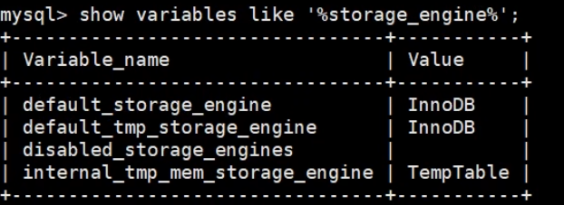
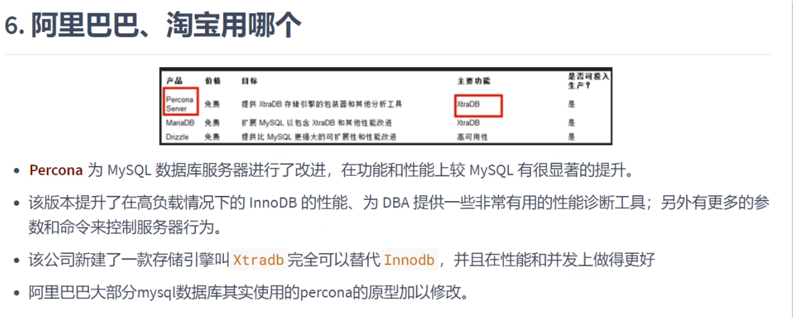

# 第05章 存储引擎

MysQL中提到了存储引擎的概念。简而言之，存储引擎就是指**`表的类型`**。其实存储引擎以前叫做**`表处理器`**，后来改名为存储引擎，它的功能就是接收上层传下来的指令，然后对表中的数据进行提取或写入操作。


# 1. 查看存储引擎

```mysql
show engines;
# 或
show engines\G
```


XA 指的是是否支持分布式事务，Savepoints指的是保存点，如果有保存点，说明可以支持部分事务的回滚。


# 2. 设置系统默认的存储引擎



- 查看默认的存储引擎：

```mysql
show variables like '%storage_engine%'; 
#或
SELECT @@default_storage_engine;
```

- 修改默认的存储引擎

如果在创建表的语句中没有显式指定表的存储引擎的话，那就会默认使用 `InnoDB` 作为表的存储引擎。

```mysql
SET DEFAULT_STORAGE_ENGINE=MyISAM;
```

或者修改`my.cnf`文件：

```ini
default-storage-engine=MyISAM 
```

```shell
# 重启服务 
systemctl restart mysqld.service
```


# 3. 设置表的存储引擎

存储引擎是负责对表中的数据进行提取和写入工作的，我们可以为`不同的表设置不同的存储引擎`，也就是说不同的表可以有不同的物理存储结构，不同的提取和写入方式。


## 3.1 创建表时指定存储引擎

```mysql
CREATE TABLE 表名(
    建表语句; 
) ENGINE = 存储引擎名称;
```


##### 3.2 修改表的存储引擎

```mysql
ALTER TABLE 表名 ENGINE = 存储引擎名称;
```


# 4. 引擎介绍

## 4.1 InnoDB 引擎：具备外键支持功能的事务存储引擎

- MySQL从3.23.34a开始就包含InnoDB存储引擎。`大于等于5.5之后，默认采用InnoDB引擎`。 
- InnoDB是MySQL的`默认事务型引擎`，它被设计用来处理大量的短期(short-lived)事务。可以确保事务的完整提交(Commit)和回滚(Rollback)。
- 除了增加和查询外，还需要更新、删除操作，那么，应优先选择InnoDB存储引擎。
- **除非有非常特别的原因需要使用其他的存储引擎，否则应该优先考虑InnoDB引擎。**
- 数据文件结构：
  - 表名.frm 存储表结构（MySQL8.0时，合并在表名.ibd中）
  - 表名.ibd 存储数据和索引
- `InnoDB` 是 `为处理巨大数据量的最大性能设计`。
  - 在以前的版本中，字典数据以元数据文件、非事务表等来存储。现在这些元数据文件被删除了。比如：`.frm`，`.par`，`.trn`，`.isl`，`.db.opt`等都在MySQL8.0中不存在了。
- 对比 `MyISAM` 的存储引擎，`InnoDB写的处理效率差一些`，并且会占用更多的磁盘空间以保存数据和索引。
- `MyISAM` 只缓存索引，不缓存真实数据；`InnoDB` 不仅缓存索引还要缓存真实数据，`对内存要求较高`，而且内存大小对性能有决定性的影响。


## 4.2 `MyISAM` 引擎：主要的非事务处理存储引擎

- `MyISAM` 提供了大量的特性，包括全文索引、压缩、空间函数(GIS)等，但MyISAM`不支持事务、行级锁、外键`，有一个毫无疑问的缺陷就是`崩溃后无法安全恢复`。 
- `5.5之前默认的存储引擎`
- 优势是访问的`速度快`，对事务完整性没有要求或者以SELECT、INSERT为主的应用
- 针对数据统计有额外的常数存储。故而 count(*) 的查询效率很高
- 数据文件结构：
  - 表名.frm 存储表结构
  - 表名.MYD 存储数据 (MYData)
  - 表名.MYI 存储索引 (MYIndex)
- 应用场景：只读应用或者以读为主的业务


## 4.3 Archive 引擎：用于数据存档

- archive是归档的意思，仅仅支持插入和查询两种功能(行被插入后不能再修改)。

- 在MySQL5.5以后支持索引功能。

- 拥有很好的压缩机制，使用zlib压缩库，在记录请求的时候实时的进行压缩，经常被用来作为仓库使用。创建ARCHIVE表时，存储引擎会创建名称以表名开头的文件。数据文件的扩展名为.ARZ

- 根据英文的测试结论来看，同样数据量下，Archive表比MyISAM表要小大约75%，比支持事务处理的InnoDB表小大约83%。

- ARCHIVE存储引擎采用了行级锁。该ARCHIVE引擎支持 AUTO_INCREMENT列属性。AUTO_INCREMENT列可以具有唯一索引或非唯一索引。尝试在任何其他列上创建索引会导致错误。

- Archive表适合日志和数据采集（档案）类应用;适合存储大量的独立的作为历史记录的数据。拥有很高的插入速度，但是对查询的支持较差。

## 4.4 Blackhole 引擎：丢弃写操作，读操作会返回空内容 

## 4.5 CSV 引擎：存储数据时，以逗号分隔各个数据项

## 4.6 Memory 引擎：置于内存的表

## 4.7 Federated 引擎：访问远程表 

## 4.8 Merge引擎：管理多个MyISAM表构成的表集合 

## 4.9 NDB引擎：MySQL集群专用存储引擎

# 5. MyISAM和InnoDB

| 对比项         | **MyISAM**                                               | **InnoDB**                                                   |
| -------------- | -------------------------------------------------------- | ------------------------------------------------------------ |
| 外键           | 不支持                                                   | 支持                                                         |
| 事务           | 不支持                                                   | 支持                                                         |
| 行表锁         | 表锁，即使操作一条记录也会锁住整个表，不适合高并发的操作 | 行锁，操作时只锁某一行，不对其它行有影响，适合高并发的操作   |
| 缓存           | 只缓存索引，不缓存真实数据                               | 不仅缓存索引还要缓存真实数据，对内存要求较高，而且内存大小对性能有决定性的影响 |
| 自带系统表使用 | Y                                                        | N                                                            |
| 关注点         | 性能：节省资源、消耗少、简单业务                         | 事务：并发写、事务、更大资源                                 |
| 默认安装       | Y                                                        | Y                                                            |
| 默认使用       | N                                                        | Y                                                            |

