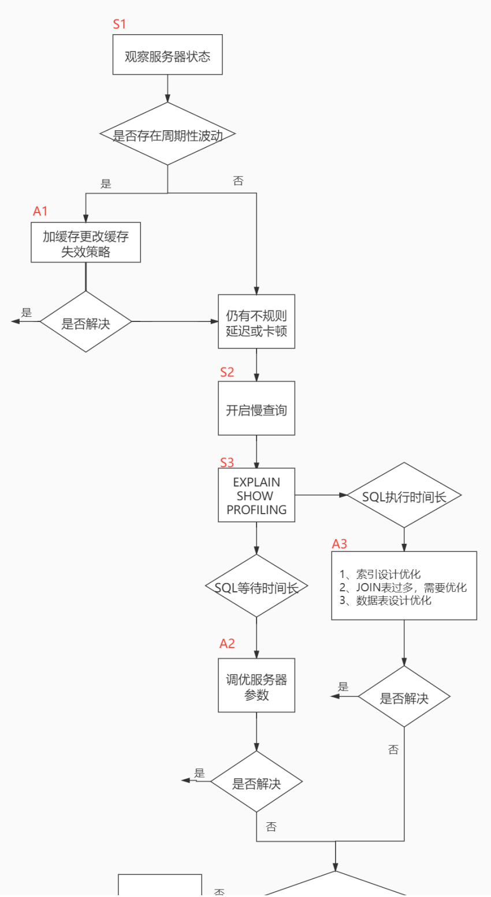
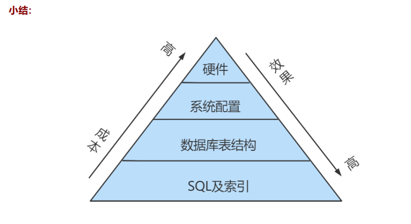
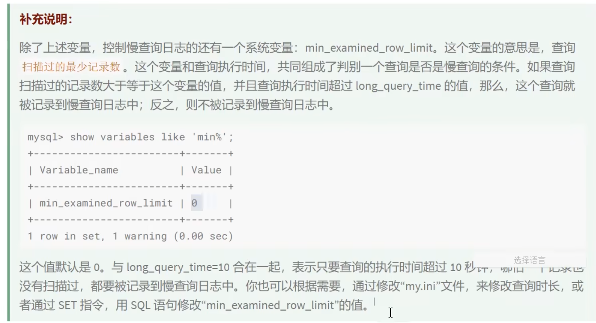
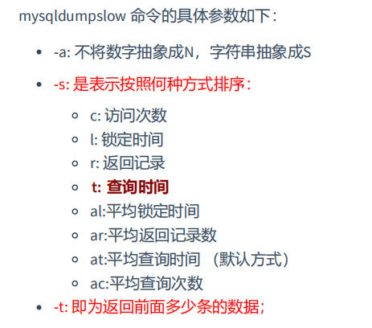
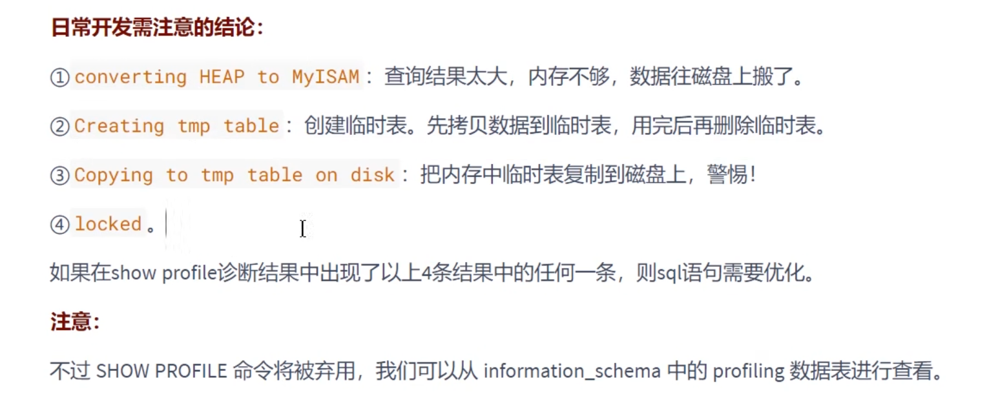
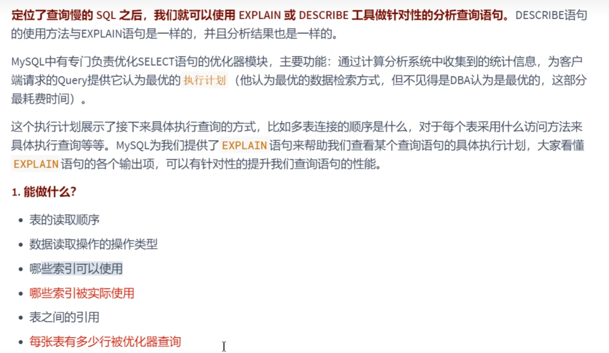

### 第09章 性能分析工具的使用

#### **0.** **数据库服务器的优化步骤**

当我们遇到数据库调优问题的时候，该如何思考呢？这里把思考的流程整理成下面这张图。

整个流程划分成了 观察（Show status） 和 行动（Action） 两个部分。字母 S 的部分代表观察（会使

用相应的分析工具），字母 A 代表的部分是行动（对应分析可以采取的行动）






**0.** **查看系统性能参数**

在MySQL中，可以使用 SHOW STATUS 语句查询一些MySQL数据库服务器的 性能参数 、 执行频率 。

SHOW STATUS语句语法如下：

```sql
SHOW [GLOBAL|SESSION] STATUS LIKE '参数';
```

一些常用的性能参数如下：

- Connections：连接MySQL服务器的次数。 
- Uptime：MySQL服务器的上线时间。 
- Slow_queries：慢查询的次数。
- Innodb_rows_read：Select查询返回的行数 
- Innodb_rows_inserted：执行INSERT操作插入的行数 
- Innodb_rows_updated：执行UPDATE操作更新的行数 
- Innodb_rows_deleted：执行DELETE操作删除的行数 
- Com_select：查询操作的次数。
- Com_insert：插入操作的次数。对于批量插入的 INSERT 操作，只累加一次。 
- Com_update：更新操作的次数。 
- Com_delete：删除操作的次数。

#### **1.** **统计SQL的查询成本：last_query_cost**

一条SQL查询语句在执行前需要确定查询执行计划，如果存在多种执行计划的话，MySQL会计算每个执行计划所需要的成本，从中选择成本最小的一个作为最终执行的执行计划。
如果我们想要查看某条SQL语句的查询成本，可以在执行完这条sQL语句之后，通过查看当前会话中的
last_query_cost变量值来得到当前查询的成本。它通常也是我们评价一个查询的执行效率的一个常用指标。**这个查询成本对应的是SQL语句所需要读取的页的数量。**

```mysql
SHOW STATUS LIKE 'last_query_cost';
```

使用场景：它对于比较开销是非常有用的，特别是我们有好几种查询方式可选的时候。

> SQL 查询是一个动态的过程，从页加载的角度来看，我们可以得到以下两点结论：
>
> 1. `位置决定效率`。如果页就在数据库`缓冲池`中，那么效率是最高的，否则还需要从`内存`或者`磁盘`中进行读取，当然针对单个页的读取来说，如果页存在于内存中，会比在磁盘中读取效率高很多。
> 2. `批量决定效率`。如果我们从磁盘中对单一页进行随机读，那么效率是很低的（差不多10ms），而采用顺序读取的方式，批量对页进行读取，平均一页的读取效率就会提升很多，甚至要快于单个页面在内存中的随机读取。
>
> 所以说，遇到I/O并不用担心，方法找对了，效率还是很高的。我们首先要考虑数据存放的位置，如果是经常使用的数据就要尽量放到`缓冲池`中，其次我们可以充分利用磁盘的吞吐能力，一次性批量读取数据，这样单个页的读取效率也就得到了提升。

#### **2.** **定位执行慢的SQL：慢查询日志**

MySQL的慢查询日志，用来记录在MySQL中`响应时间超过阈值`的语句，具体指运行时间超过`long_query_time`的值的SQL，则会被记录到慢查询日志中。long_query_time的默认值为`10`，意思是运行10秒以上（不含10秒）的语句，认为是超出了我们的最大忍耐时间值。

默认情况下，MySQL数据库`没有开启慢查询日志`，需要我们手动来设置这个参数。`如果不是调优需要的话，一般不建议启动该参数`，因为开启慢查询日志会或多或少带来一定的性能影响。

##### **2.1** **开启慢查询日志参数**

**1.** **开启slow_query_log**

```mysql
set global slow_query_log='ON';
```

查看下慢查询日志是否开启，以及慢查询日志文件的位置：

```mysql
show variables like '%slow_query_log%';
```

**2.** **修改long_query_time阈值**

```mysql
show variables like '%long_query_time%';
```

```mysql
# 测试发现：设置global的方式对当前session的long_query_time失效。
# 对新连接的客户端有效。所以可以一并 执行下述语句 
mysql> set global long_query_time = 1; 
mysql> show global variables like '%long_query_time%'; 

mysql> set long_query_time=1; 
mysql> show variables like '%long_query_time%';
```

##### **2.2** **查看慢查询数目**

```mysql
SHOW GLOBAL STATUS LIKE '%Slow_queries%';
```



##### **2.3** **慢查询日志分析工具：`mysqldumpslow`**

这个是在Linux命令行使用，而不是登录进mysql使用



- -g: 后边搭配一个正则匹配模式，大小写不敏感的；

以下为工作常用

```shell
#得到返回记录集最多的10个SQL 
mysqldumpslow -s r -t 10 /var/lib/mysql/【用户名】-slow.log 
#得到访问次数最多的10个SQL 
mysqldumpslow -s c -t 10 /var/lib/mysql//【用户名】-slow.log
#得到按照时间排序的前10条里面含有左连接的查询语句 
mysqldumpslow -s t -t 10 -g "left join" /var/lib/mysql//【用户名】-slow.log 
#另外建议在使用这些命令时结合 | 和more 使用 ，否则有可能出现爆屏情况 
mysqldumpslow -s r -t 10 /var/lib/mysql/【用户名】-slow.log | more
```

##### **2.4** **关闭慢查询日志**

**方式1：永久性方式**

```ini
[mysqld] 
slow_query_log=OFF
#或
[mysqld] 
#slow_query_log =OFF
```

**方式2：临时性方式**

```mysql
SET GLOBAL slow_query_log=off;
```

#### **3.** **查看** **SQL** **执行成本：SHOW PROFILE**

```mysql
show variables like 'profiling';
#开启
set profiling = 'ON';
#查看
show profiles;
show profile cpu,block io for query 2;
```



#### **4.** **分析查询语句：EXPLAIN**



##### **4.1** **基本语法**

```mysql
EXPLAIN SELECT select_options;
#或者
DESCRIBE SELECT select_options;
```

EXPLAIN 语句输出的各个列的作用如下：

| 列名                               | 描述                                                         |
| ---------------------------------- | ------------------------------------------------------------ |
| id                                 | 在一个大的查询语句中每个SELECT关键字都对应一个`唯一的id`     |
| select_type                        | SELECT关键字对应的那个查询的类型                             |
| table                              | 表名                                                         |
| partitions                         | 匹配的分区信息                                               |
| <font color="bb500">type</font>    | 针对单表的访问方法                                           |
| possible_keys                      | 可能用到的索引                                               |
| key                                | 实际上使用的索引                                             |
| <font color="bb500">key_len</font> | 实际使用到的索引长度 主要是我们使用联合索引的时确定用了哪个字段 |
| ref                                | 当使用索引列等值查询时，与索引列进行等值匹配的对象信息       |
| rows                               | 预估的需要读取的记录条数                                     |
| filtered                           | 某个表经过搜索条件过滤后剩余记录条数的百分比                 |
| <font color="bb500">Extra</font>   | 一些额外的信息                                               |

**数据准备**

创建表

```sql
USE atguigudb1;
CREATE TABLE s1
(
    id           INT AUTO_INCREMENT,
    key1         VARCHAR(100),
    key2         INT,
    key3         VARCHAR(100),
    key_part1    VARCHAR(100),
    key_part2    VARCHAR(100),
    key_part3    VARCHAR(100),
    common_field VARCHAR(100),
    PRIMARY KEY (id),
    INDEX idx_key1 (key1),
    UNIQUE INDEX idx_key2 (key2),
    INDEX idx_key3 (key3),
    INDEX idx_key_part (key_part1, key_part2, key_part3)
) ENGINE = INNODB
  CHARSET = utf8;

CREATE TABLE s2
(
    id           INT AUTO_INCREMENT,
    key1         VARCHAR(100),
    key2         INT,
    key3         VARCHAR(100),
    key_part1    VARCHAR(100),
    key_part2    VARCHAR(100),
    key_part3    VARCHAR(100),
    common_field VARCHAR(100),
    PRIMARY KEY (id),
    INDEX idx_key1 (key1),
    UNIQUE INDEX idx_key2 (key2),
    INDEX idx_key3 (key3),
    INDEX idx_key_part (key_part1, key_part2, key_part3)
) ENGINE = INNODB
  CHARSET = utf8;
```

**2.** **设置参数** **log_bin_trust_function_creators**

创建函数，假如报错，需开启如下命令：允许创建函数设置：

```sql
set global log_bin_trust_function_creators=1; # 不加global只是当前窗口有效。
```

**3.** **创建函数**

```sql
DELIMITER //
CREATE FUNCTION rand_string1(n INT)
    RETURNS VARCHAR(255) #该函数会返回一个字符串
BEGIN
    DECLARE chars_str VARCHAR(100) DEFAULT
        'abcdefghijklmnopqrstuvwxyzABCDEFJHIJKLMNOPQRSTUVWXYZ';
    DECLARE return_str VARCHAR(255) DEFAULT '';
    DECLARE i INT DEFAULT 0;
    WHILE i < n
        DO
            SET return_str = CONCAT(return_str, SUBSTRING(chars_str, FLOOR(1 + RAND() * 52), 1));
            SET i = i + 1;
        END WHILE;
    RETURN return_str;
END //
DELIMITER ;
```

**4.** **创建存储过程**

创建往s1表中插入数据的存储过程：

```sql
DELIMITER //
CREATE PROCEDURE insert_s1(IN min_num INT(10), IN max_num INT(10))
BEGIN
    DECLARE i INT DEFAULT 0;
    SET autocommit = 0;
    REPEAT
        SET i = i + 1;
        INSERT INTO s1
        VALUES ((min_num + i),
                rand_string1(6),
                (min_num + 30 * i + 5),
                rand_string1(6),
                rand_string1(10),
                rand_string1(5),
                rand_string1(10),
                rand_string1(10));
    UNTIL i = max_num
        END REPEAT;
    COMMIT;
END //
DELIMITER ;
```

创建往s2表中插入数据的存储过程

```sql
DELIMITER //
CREATE PROCEDURE insert_s2(IN min_num INT(10), IN max_num INT(10))
BEGIN


    DECLARE i INT DEFAULT 0;
    SET autocommit = 0;
    REPEAT
        SET i = i + 1;
        INSERT INTO s2
        VALUES ((min_num + i),
                rand_string1(6),
                (min_num + 30 * i + 5),
                rand_string1(6),
                rand_string1(10),
                rand_string1(5),
                rand_string1(10),
                rand_string1(10));
    UNTIL i = max_num
        END REPEAT;
    COMMIT;
END //
DELIMITER ;
```

**5.** **调用存储过程**

s1表数据的添加：加入1万条记录：

```sql
CALL insert_s1(10001,10000);
```

s2表数据的添加：加入1万条记录：

```sql
CALL insert_s2(10001,10000);
```

#####  **4.2 `EXPLAIN`各列作用**

**1. `table`**

不论我们的查询语句有多复杂，包含了多少个表 ，到最后也是需要对每个表进行`单表访问`的，所以MySQL规定**EXPLAIN语句输出的每条记录都对应着某个单表的访问方法**，该条记录的table列代表着该表的表名（有时不是真实的表名字，可能是简称）。

**2. `id`**

- **id如果相同，可以认为是一组，从上往下顺序执行**
- **在所有组中，id值越大，优先级越高，越先执行**
- **关注点：id号每个号码，表示一趟独立的查询,一个sql的查询趟数越少越好**

```sql
#1. table：表名
#查询的每一行记录都对应着一个单表
EXPLAIN SELECT * FROM s1;

#s1:驱动表  s2:被驱动表  有时候其实优化器会根据成本和实际的逻辑不同，调换驱动表和被驱动表
EXPLAIN SELECT * FROM s1 INNER JOIN s2;

#2. id：在一个大的查询语句中每个SELECT关键字都对应一个唯一的id
 SELECT * FROM s1 WHERE key1 = 'a';
```

稍微复杂一点的连接查询中也只有一个 SELECT 关键字，比如：

```sql
SELECT * FROM s1 INNER JOIN s2
ON s1.key1 = s2.key1
WHERE s1.common_field = 'a';
```

下面的例子证明，有时候明明有子查询，也会对子查询进行改写

多表查询也是n方，不是in不能用索引，准确来说是根据in中的范围数量来确定，如果数量过多，优化器就会直接全表查询而不是使用索引再回表查了

```sql
 EXPLAIN SELECT * FROM s1 WHERE key1 IN (SELECT key1 FROM s2) OR key3 = 'a';
 
 ######查询优化器可能对涉及子查询的查询语句进行重写,转变为多表查询的操作########
 EXPLAIN SELECT * FROM s1 WHERE key1 IN (SELECT key2 FROM s2 WHERE common_field = 'a');
```

使用去重的操作，其实不仅有对两个表的查询，还有一个 `temporary` 的临时表的操作，id为null，因为并没有使用一个新的`SELECT`

而 `UNION ALL` 并不会创建一个新的表

```sql
 #Union去重
 EXPLAIN SELECT * FROM s1 UNION SELECT * FROM s2;
 
 EXPLAIN SELECT * FROM s1  UNION ALL SELECT * FROM s2;
```

**3. select_type**


SIMPLE和联合查询

```sql
 #3. select_type：SELECT关键字对应的那个查询的类型,确定小查询在整个大查询中扮演了一个什么角色
 
 # 查询语句中不包含`UNION`或者子查询的查询都算作是`SIMPLE`类型
 EXPLAIN SELECT * FROM s1;
 
 #连接查询也算是`SIMPLE`类型
 EXPLAIN SELECT * FROM s1 INNER JOIN s2;
 
 #对于包含`UNION`或者`UNION ALL`或者子查询的大查询来说，它是由几个小查询组成的，其中最左边的那个
 #查询的`select_type`值就是`PRIMARY`
 
 #对于包含`UNION`或者`UNION ALL`的大查询来说，它是由几个小查询组成的，其中除了最左边的那个小查询
 #以外，其余的小查询的`select_type`值就是`UNION`
 #`MySQL`选择使用临时表来完成`UNION`查询的去重工作，针对该临时表的查询的`select_type`就是
 #`UNION RESULT`
 EXPLAIN SELECT * FROM s1 UNION SELECT * FROM s2;
 
 EXPLAIN SELECT * FROM s1 UNION ALL SELECT * FROM s2;
```

子查询

```sql
#子查询：
 #如果包含子查询的查询语句不能够转为对应的`semi-join`的形式，并且该子查询是不相关子查询。
 #该子查询的第一个`SELECT`关键字代表的那个查询的`select_type`就是`SUBQUERY`
 EXPLAIN SELECT * FROM s1 WHERE key1 IN (SELECT key1 FROM s2) OR key3 = 'a';
 
 
 #如果包含子查询的查询语句不能够转为对应的`semi-join`的形式，并且该子查询是相关子查询，
 #则该子查询的第一个`SELECT`关键字代表的那个查询的`select_type`就是`DEPENDENT SUBQUERY`
 EXPLAIN SELECT * FROM s1 
 WHERE key1 IN (SELECT key1 FROM s2 WHERE s1.key2 = s2.key2) OR key3 = 'a';
 #注意的是，select_type为`DEPENDENT SUBQUERY`的查询可能会被执行多次。
 
 
 #在包含`UNION`或者`UNION ALL`的大查询中，如果各个小查询都依赖于外层查询的话，那除了
 #最左边的那个小查询之外，其余的小查询的`select_type`的值就是`DEPENDENT UNION`。
 # IN 优化器通常可能会选择把它优化成 EXISTS 这样本身 看似不是相关子查询 但是底层优化成了相关子查询
 #关联子查询通常也会和 EXISTS操作符一起来使用，用来检查在子查询中是否存在满足条件的行。
 #NOT EXISTS关键字表示如果不存在某种条件，则返回TRUE，否则返回FALSE。
 EXPLAIN SELECT * FROM s1 
 WHERE key1 IN (SELECT key1 FROM s2 WHERE key1 = 'a' UNION SELECT key1 FROM s1 WHERE key1 = 'b');
 
 
 #对于包含`派生表`的查询，该派生表对应的子查询的`select_type`就是`DERIVED`
 EXPLAIN SELECT * 
 FROM (SELECT key1, COUNT(*) AS c FROM s1 GROUP BY key1) AS derived_s1 WHERE c > 1;
 
 
 #当查询优化器在执行包含子查询的语句时，选择将子查询物化之后与外层查询进行连接查询时，
 #该子查询对应的`select_type`属性就是`MATERIALIZED`
 EXPLAIN SELECT * FROM s1 WHERE key1 IN (SELECT key1 FROM s2); #子查询被转为了物化表
```

**4. partitions**【略】

**5. type（重点）**

**结果值从最好到最坏依次是：** **<font color="bb500">system > const > eq_ref > ref</font>** **> `fulltext` > ref_or_null > index_merge > unique_subquery > index_subquery >** **<font color="bb500">range > index > ALL</font>** 

```sql
 #当表中`只有一条记录`并且该表使用的存储引擎的统计数据是精确的，比如MyISAM、Memory，
 #那么对该表的访问方法就是`system`。
 CREATE TABLE t(i INT) ENGINE=MYISAM;
 INSERT INTO t VALUES(1);
 
 EXPLAIN SELECT * FROM t;
 
 #换成InnoDB
 CREATE TABLE tt(i INT) ENGINE=INNODB;
 INSERT INTO tt VALUES(1);
 EXPLAIN SELECT * FROM tt;
```

```sql
 #当我们根据主键或者唯一二级索引列与常数进行等值匹配时，对单表的访问方法就是`const`
 EXPLAIN SELECT * FROM s1 WHERE id = 10005;
 
 #即便是使用有索引的列，但是类型没有匹配上，因为key2是VARCHAR，那么此时它的查询涉及到
 #底层的类型转化就会使用函数，使用函数二朵情况下，默认就不使用索引进行查询了
 EXPLAIN SELECT * FROM s1 WHERE key2 = 10066;
 
 #在连接查询时，如果被驱动表是通过主键或者唯一二级索引列等值匹配的方式进行访问的
 #（如果该主键或者唯一二级索引是联合索引的话，所有的索引列都必须进行等值比较），则
 #对该被驱动表的访问方法就是`eq_ref`
 EXPLAIN SELECT * FROM s1 INNER JOIN s2 ON s1.id = s2.id;
 #当通过普通的二级索引列与常量进行等值匹配时来查询某个表，那么对该表的访问方法就可能是`ref`
 EXPLAIN SELECT * FROM s1 WHERE key1 = 'a';
 
 #当对普通二级索引进行等值匹配查询，该索引列的值也可以是`NULL`值时，那么对该表的访问方法
 #就可能是`ref_or_null`
 EXPLAIN SELECT * FROM s1 WHERE key1 = 'a' OR key1 IS NULL;
 
 #单表访问方法时在某些场景下可以使用`Intersection`、`Union`、
 #`Sort-Union`这三种索引合并的方式来执行查询
 EXPLAIN SELECT * FROM s1 WHERE key1 = 'a' OR key3 = 'a';
 
 #`unique_subquery`是针对在一些包含`IN`子查询的查询语句中，如果查询优化器决定将`IN`子查询
 #转换为`EXISTS`子查询，而且子查询可以使用到主键进行等值匹配的话，那么该子查询执行计划的`type`
 #列的值就是`unique_subquery`
 EXPLAIN SELECT * FROM s1 
 WHERE key2 IN (SELECT id FROM s2 WHERE s1.key1 = s2.key1) OR key3 = 'a';
 
 #如果使用索引获取某些`范围区间`的记录，那么就可能使用到`range`访问方法
 EXPLAIN SELECT * FROM s1 WHERE key1 IN ('a', 'b', 'c');
 
 #同上
 EXPLAIN SELECT * FROM s1 WHERE key1 > 'a' AND key1 < 'b';
 
 #当我们可以使用索引覆盖，但需要扫描全部的索引记录时，该表的访问方法就是`index`
 EXPLAIN SELECT key_part2 FROM s1 WHERE key_part3 = 'a';
 
 #最熟悉的全表扫描
 EXPLAIN SELECT * FROM s1;
```

**SQL性能优化的目标：至少要达到 `range`级别，要求是`ref`级别，最好是`consts`级别。（阿里巴巴开发手册要求）**

**6. possible_keys和key**

```sql
 #6. possible_keys和key：可能用到的索引 和  实际上使用的索引
 
 EXPLAIN SELECT * FROM s1 WHERE key1 > 'z' AND key3 = 'a';
```

**7. `key_len`（重点）**

```sql
#7.  key_len：实际使用到的索引长度(即：字节数)
# 帮你检查`是否充分的利用上了索引`，`值越大越好`,主要针对于联合索引，有一定的参考意义。
 EXPLAIN SELECT * FROM s1 WHERE id = 10005;

 EXPLAIN SELECT * FROM s1 WHERE key2 = 10126;

 EXPLAIN SELECT * FROM s1 WHERE key1 = 'a';

 EXPLAIN SELECT * FROM s1 WHERE key_part1 = 'a';
 
 EXPLAIN SELECT * FROM s1 WHERE key_part1 = 'a' AND key_part2 = 'b';

 EXPLAIN SELECT * FROM s1 WHERE key_part1 = 'a' AND key_part2 = 'b' AND key_part3 = 'c';
 
 EXPLAIN SELECT * FROM s1 WHERE key_part3 = 'a';
```

**`key_len`的长度计算公式：**

```
varchar(10)变长字段且允许NULL = 10 * ( character set： utf8=3,gbk=2,latin1=1)+1(NULL)+2(变长字段) 

varchar(10)变长字段且不允许NULL = 10 * ( character set：utf8=3,gbk=2,latin1=1)+2(变长字段)

char(10)固定字段且允许NULL = 10 * ( character set：utf8=3,gbk=2,latin1=1)+1(NULL) 

char(10)固定字段且不允许NULL = 10 * ( character set：utf8=3,gbk=2,latin1=1)
```

**8. ref** 当使用索引列等值查询时，与索引列进行等值匹配的对象信息。

```sql
 #比如只是一个常数或者是某个列。
 
 EXPLAIN SELECT * FROM s1 WHERE key1 = 'a';
 
 EXPLAIN SELECT * FROM s1 INNER JOIN s2 ON s1.id = s2.id;
 
 EXPLAIN SELECT * FROM s1 INNER JOIN s2 ON s2.key1 = UPPER(s1.key1);
```

**9. rows（重点）**

预估的需要读取的记录条数

查询计划是根据表的统计数据来预估rows和filter的，一般取样页默认是10个页，这里是因为数据量比较小全部被统计了，所以结果是精准的

```sql
 EXPLAIN SELECT * FROM s1 WHERE key1 > 'z';
```

**10. filtered** 

某个表经过搜索条件过滤后剩余记录条数的百分比

```sql
 #如果使用的是索引执行的单表扫描，那么计算时需要估计出满足除使用
 #到对应索引的搜索条件外的其他搜索条件的记录有多少条。
 EXPLAIN SELECT * FROM s1 WHERE key1 > 'z' AND common_field = 'a';
 
 
 #对于单表查询来说，这个filtered列的值没什么意义，我们`更关注在连接查询
 #中驱动表对应的执行计划记录的filtered值`，它决定了被驱动表要执行的次数(即：rows * filtered)
 EXPLAIN SELECT * FROM s1 INNER JOIN s2 ON s1.key1 = s2.key1 WHERE s1.common_field = 'a';
```

**11. Extra**

一些额外的信息
更准确的理解MySQL到底将如何执行给定的查询语句

```sql
#当查询语句的没有`FROM`子句时将会提示该额外信息
 EXPLAIN SELECT 1;
 
 #查询语句的`WHERE`子句永远为`FALSE`时将会提示该额外信息
 EXPLAIN SELECT * FROM s1 WHERE 1 != 1;
 
 #当我们使用全表扫描来执行对某个表的查询，并且该语句的`WHERE`
 #子句中有针对该表的搜索条件时，在`Extra`列中会提示上述额外信息。
 EXPLAIN SELECT * FROM s1 WHERE common_field = 'a';
 
 #当使用索引访问来执行对某个表的查询，并且该语句的`WHERE`子句中
 #有除了该索引包含的列之外的其他搜索条件时，在`Extra`列中也会提示上述额外信息。
 EXPLAIN SELECT * FROM s1 WHERE key1 = 'a' AND common_field = 'a';
 
 #当查询列表处有`MIN`或者`MAX`聚合函数，但是并没有符合`WHERE`子句中
 #的搜索条件的记录时，将会提示该额外信息
 EXPLAIN SELECT MIN(key1) FROM s1 WHERE key1 = 'abcdefg';
 
 EXPLAIN SELECT MIN(key1) FROM s1 WHERE key1 = 'NlPros'; #NlPros 是 s1表中key1字段真实存在的数据
 
 #select * from s1 limit 10;
 
 #当我们的查询列表以及搜索条件中只包含属于某个索引的列，也就是在可以
 #使用覆盖索引的情况下，在`Extra`列将会提示该额外信息。比方说下边这个查询中只
 #需要用到`idx_key1`而不需要回表操作：
 EXPLAIN SELECT key1,id FROM s1 WHERE key1 = 'a';
 
 #有些搜索条件中虽然出现了索引列，但却不能使用到索引
 #看课件理解索引条件下推
 EXPLAIN SELECT * FROM s1 WHERE key1 > 'z' AND key1 LIKE '%a';
 
 #在连接查询执行过程中，当被驱动表不能有效的利用索引加快访问速度，MySQL一般会为
 #其分配一块名叫`join buffer`的内存块来加快查询速度，也就是我们所讲的`基于块的嵌套循环算法`
 #见课件说明
 EXPLAIN SELECT * FROM s1 INNER JOIN s2 ON s1.common_field = s2.common_field;
 
 #当我们使用左（外）连接时，如果`WHERE`子句中包含要求被驱动表的某个列等于`NULL`值的搜索条件，
 #而且那个列又是不允许存储`NULL`值的，那么在该表的执行计划的Extra列就会提示`Not exists`额外信息
 EXPLAIN SELECT * FROM s1 LEFT JOIN s2 ON s1.key1 = s2.key1 WHERE s2.id IS NULL;
 
 #如果执行计划的`Extra`列出现了`Using intersect(...)`提示，说明准备使用`Intersect`索引
 #合并的方式执行查询，括号中的`...`表示需要进行索引合并的索引名称；
 #如果出现了`Using union(...)`提示，说明准备使用`Union`索引合并的方式执行查询；
 #出现了`Using sort_union(...)`提示，说明准备使用`Sort-Union`索引合并的方式执行查询。
 EXPLAIN SELECT * FROM s1 WHERE key1 = 'a' OR key3 = 'a';
 
 #当我们的`LIMIT`子句的参数为`0`时，表示压根儿不打算从表中读出任何记录，将会提示该额外信息
 EXPLAIN SELECT * FROM s1 LIMIT 0;
 
 #有一些情况下对结果集中的记录进行排序是可以使用到索引的。
 #比如：
 EXPLAIN SELECT * FROM s1 ORDER BY key1 LIMIT 10;
 
 #很多情况下排序操作无法使用到索引，只能在内存中（记录较少的时候）或者磁盘中（记录较多的时候）
 #进行排序，MySQL把这种在内存中或者磁盘上进行排序的方式统称为文件排序（英文名：`filesort`）。
 
 #如果某个查询需要使用文件排序的方式执行查询，就会在执行计划的`Extra`列中显示`Using filesort`提示
 EXPLAIN SELECT * FROM s1 ORDER BY common_field LIMIT 10;
 
 #在许多查询的执行过程中，MySQL可能会借助临时表来完成一些功能，比如去重、排序之类的，比如我们
 #在执行许多包含`DISTINCT`、`GROUP BY`、`UNION`等子句的查询过程中，如果不能有效利用索引来完成
 #查询，MySQL很有可能寻求通过建立内部的临时表来执行查询。如果查询中使用到了内部的临时表，在执行
 #计划的`Extra`列将会显示`Using temporary`提示
 EXPLAIN SELECT DISTINCT common_field FROM s1;
 
 #EXPLAIN SELECT DISTINCT key1 FROM s1;
 
 #同上。
 EXPLAIN SELECT common_field, COUNT(*) AS amount FROM s1 GROUP BY common_field;
 
 #执行计划中出现`Using temporary`并不是一个好的征兆，因为建立与维护临时表要付出很大成本的，所以
 #我们`最好能使用索引来替代掉使用临时表`。比如：扫描指定的索引idx_key1即可
 EXPLAIN SELECT key1, COUNT(*) AS amount FROM s1 GROUP BY key1;
 
#json格式的explain
EXPLAIN FORMAT=JSON SELECT * FROM s1 INNER JOIN s2 ON s1.key1 = s2.key2 
WHERE s1.common_field = 'a';
```

#### **5. EXPLAIN的进一步使用**

##### **5.1 EXPLAIN四种输出格式**

把FORMAT的值用下面的进行代替即可

```sql
EXPLAIN FORMAT=tree SELECT * FROM s1 INNER JOIN s2 ON s1.key1 = s2.key2 WHERE
s1.common_field = 'a'\G
```

这里谈谈EXPLAIN的输出格式。EXPLAIN可以输出四种格式：`传统格式`，`JSON格式`，`TREE格式`以及`可视化输出`。用户可以根据需要选择适用于自己的格式。

**1.** **传统格式**

**2. JSON格式** 

JSON格式：在EXPLAIN单词和真正的查询语句中间加上`FORMAT=JSON`。用于查看执行成本`cost_info`

**3. TREE格式**

TREE格式是8.0.16版本之后引入的新格式，主要根据查询的`各个部分之间的关系`和`各部分的执行顺序`来描述如何查询。

**4.** **可视化输出**

可视化输出，可以通过MySQL Workbench可视化查看MySQL的执行计划。

##### **5.2 SHOW WARNINGS的使用** 

下面就是一个经典的，调换顺序，让小表驱动大表的例子

```mysql
mysql> EXPLAIN SELECT s1.key1, s2.key1 FROM s1 LEFT JOIN s2 ON s1.key1 = s2.key1 WHERE s2.common_field IS NOT NULL;
# 查看优化后的执行语句
mysql> SHOW WARNINGS\G
```

#### **6.** **分析优化器执行计划：trace**【默认关闭的】

```mysql
# 开启
SET optimizer_trace="enabled=on",end_markers_in_json=on; 
# 设置大小
set optimizer_trace_max_mem_size=1000000;
# 使用
select * from student where id < 10;
select * from information_schema.optimizer_trace\G
```

#### **7. MySQL监控分析视图-sys schema** 

**7.1 Sys schema视图使用场景**

**索引情况**

```mysql
#1. 查询冗余索引 
select * from sys.schema_redundant_indexes; 
#2. 查询未使用过的索引 
select * from sys.schema_unused_indexes; 
#3. 查询索引的使用情况 
select index_name,rows_selected,rows_inserted,rows_updated,rows_deleted from sys.schema_index_statistics where table_schema='dbname' ;
```

**表相关**

```mysql
# 1. 查询表的访问量 
select table_schema,table_name,sum(io_read_requests+io_write_requests) as io from sys.schema_table_statistics group by table_schema,table_name order by io desc; 
# 2. 查询占用bufferpool较多的表 
select object_schema,object_name,allocated,data
from sys.innodb_buffer_stats_by_table order by allocated limit 10; 
# 3. 查看表的全表扫描情况 
select * from sys.statements_with_full_table_scans where db='dbname';
```

**语句相关**

```mysql
#1. 监控SQL执行的频率 
select db,exec_count,query from sys.statement_analysis order by exec_count desc; 
#2. 监控使用了排序的SQL 
select db,exec_count,first_seen,last_seen,query
from sys.statements_with_sorting limit 1; 
#3. 监控使用了临时表或者磁盘临时表的SQL 
select db,exec_count,tmp_tables,tmp_disk_tables,query
from sys.statement_analysis where tmp_tables>0 or tmp_disk_tables >0 order by (tmp_tables+tmp_disk_tables) desc;
```

**IO相关**

```mysql
#1. 查看消耗磁盘IO的文件 
select file,avg_read,avg_write,avg_read+avg_write as avg_io
from sys.io_global_by_file_by_bytes order by avg_read limit 10;
```

**`Innodb`** **相关**

```mysql
#1. 行锁阻塞情况 
select * from sys.innodb_lock_waits;
```