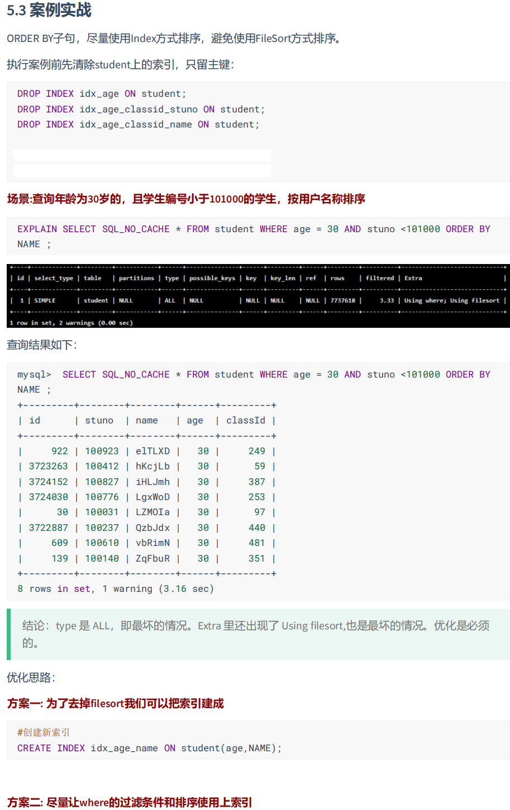

# 第10章 索引优化与查询优化

**数据准备**

```sql
CREATE DATABASE fanxydb2;

USE fanxydb2;

#建表
CREATE TABLE `class` (
 `id` INT(11) NOT NULL AUTO_INCREMENT,
 `className` VARCHAR(30) DEFAULT NULL,
 `address` VARCHAR(40) DEFAULT NULL,
 `monitor` INT NULL ,
 PRIMARY KEY (`id`)
) ENGINE=INNODB AUTO_INCREMENT=1 DEFAULT CHARSET=utf8;
 
CREATE TABLE `student` (
 `id` INT(11) NOT NULL AUTO_INCREMENT,
 `stuno` INT NOT NULL ,
 `name` VARCHAR(20) DEFAULT NULL,
 `age` INT(3) DEFAULT NULL,
 `classId` INT(11) DEFAULT NULL,
 PRIMARY KEY (`id`)
 #CONSTRAINT `fk_class_id` FOREIGN KEY (`classId`) REFERENCES `t_class` (`id`)
) ENGINE=INNODB AUTO_INCREMENT=1 DEFAULT CHARSET=utf8;


SET GLOBAL log_bin_trust_function_creators=1; 

 #随机产生字符串
DELIMITER //
CREATE FUNCTION rand_string(n INT) RETURNS VARCHAR(255)
BEGIN    
DECLARE chars_str VARCHAR(100) DEFAULT 'abcdefghijklmnopqrstuvwxyzABCDEFJHIJKLMNOPQRSTUVWXYZ';
DECLARE return_str VARCHAR(255) DEFAULT '';
DECLARE i INT DEFAULT 0;
WHILE i < n DO  
SET return_str =CONCAT(return_str,SUBSTRING(chars_str,FLOOR(1+RAND()*52),1));  
SET i = i + 1;
END WHILE;
RETURN return_str;
END //
DELIMITER ;

#用于随机产生多少到多少的编号
DELIMITER //
CREATE FUNCTION  rand_num (from_num INT ,to_num INT) RETURNS INT(11)
BEGIN   
DECLARE i INT DEFAULT 0;  
SET i = FLOOR(from_num +RAND()*(to_num - from_num+1))   ;
RETURN i;  
END //
DELIMITER ;

#创建往stu表中插入数据的存储过程
DELIMITER //
CREATE PROCEDURE  insert_stu(  START INT ,  max_num INT )
BEGIN  
DECLARE i INT DEFAULT 0;   
 SET autocommit = 0;    #设置手动提交事务
 REPEAT  #循环
 SET i = i + 1;  #赋值
 INSERT INTO student (stuno, NAME ,age ,classId ) VALUES ((START+i),rand_string(6),rand_num(1,50),rand_num(1,1000));  
 UNTIL i = max_num  
 END REPEAT;  
 COMMIT;  #提交事务
END //
DELIMITER ;


#执行存储过程，往class表添加随机数据
DELIMITER //
CREATE PROCEDURE `insert_class`(  max_num INT )
BEGIN  
DECLARE i INT DEFAULT 0;   
 SET autocommit = 0;    
 REPEAT  
 SET i = i + 1;  
 INSERT INTO class ( classname,address,monitor ) VALUES (rand_string(8),rand_string(10),rand_num(1,100000));  
 UNTIL i = max_num  
 END REPEAT;  
 COMMIT; 
END //
DELIMITER ;


#执行存储过程，往class表添加1万条数据  
CALL insert_class(10000);

#执行存储过程，往stu表添加50万条数据  
CALL insert_stu(100000,500000);

#查询数量
SELECT COUNT(*) FROM class;
SELECT COUNT(*) FROM student;

# 索引删除
DELIMITER //
CREATE  PROCEDURE `proc_drop_index`(dbname VARCHAR(200),tablename VARCHAR(200))
BEGIN
       DECLARE done INT DEFAULT 0;
       DECLARE ct INT DEFAULT 0;
       DECLARE _index VARCHAR(200) DEFAULT '';
       DECLARE _cur CURSOR FOR  SELECT   index_name   FROM information_schema.STATISTICS   WHERE table_schema=dbname AND table_name=tablename AND seq_in_index=1 AND    index_name <>'PRIMARY'  ;
#每个游标必须使用不同的declare continue handler for not found set done=1来控制游标的结束
       DECLARE  CONTINUE HANDLER FOR NOT FOUND SET done=2 ;      
#若没有数据返回,程序继续,并将变量done设为2
        OPEN _cur;
        FETCH _cur INTO _index;
        WHILE  _index<>'' DO 
               SET @str = CONCAT("drop index " , _index , " on " , tablename ); 
               PREPARE sql_str FROM @str ;
               EXECUTE  sql_str;
               DEALLOCATE PREPARE sql_str;
               SET _index=''; 
               FETCH _cur INTO _index; 
        END WHILE;
   CLOSE _cur;
END //
DELIMITER ;
```


# 1. 索引失效案例

`MySQL`中`提高性能`的一个最有效的方式是对数据表`设计合理的索引`。索引提供了访问高效数据的方法，并且加快查询的速度，因此索引对查询的速度有着至关重要的影响。

- 使用索引可以`快速地定位`表中的某条记录，从而提高数据库查询的速度，提高数据库的性能。
- 如果查询时没有使用索引，查询语句就会`扫描表中的所有记录`。在数据量大的情况下，这样查询的速度会很慢。

大多数情况下都（默认）采用`B+树`来构建索引。只是空间列类型的索引使用`R-树`，并且MEMORY表还支持`hash索引`。

其实，用不用索引，最终都是优化器说了算。优化器是基于什么的优化器？基于`cost开销(CostBaseOptimizer)`，它不是基于`规则(Rule-BasedOptimizer)`，也不是基于`语义`。怎么样开销小就怎么来。另外，**SQL语句是否使用索引，跟数据库版本、数据量、数据选择度都有关系。**

这个`cost`上一节有计算公式，是根据覆盖率，查询条数，`cpu`调度次数综合衡量计算的.


## 1.1 全值匹配我最爱 

使用全值匹配进行等值查询，是效率最高的查询。

```sql
SHOW INDEX FROM student;

EXPLAIN SELECT SQL_NO_CACHE * FROM student WHERE age=30;
EXPLAIN SELECT SQL_NO_CACHE * FROM student WHERE age=30 AND classId=4;
EXPLAIN SELECT SQL_NO_CACHE * FROM student WHERE age=30 AND classId=4 AND NAME = 'abcd';

SELECT SQL_NO_CACHE * FROM student WHERE age=30 AND classId=4 AND NAME = 'abcd';

CREATE INDEX idx_age ON student(age);

CREATE INDEX idx_age_classid ON student(age,classId);

CREATE INDEX idx_age_classid_name ON student(age,classId,NAME);
```


## 1.2 最佳左前缀法则

在MySQL建立联合索引时会遵守最佳左前缀匹配原则，即最左优先，在检索数据时从联合索引的最左边开始匹配。

结论：MySQL可以为多个字段创建索引，一个索引可以包括16个字段。对于多列索引，**过滤条件要使用索引必须按照索引建立时的顺序，依次满足，一旦跳过某个字段，索引后面的字段都无法被使用。**如果查询条件中没有使用这些字段中第1个字段时，多列（或联合）索引不会被使用。

```sql
EXPLAIN SELECT SQL_NO_CACHE * FROM student WHERE student.age=30 AND student.name = 'abcd' ;

# 这个例子充分展示了最左前缀，必须遵循最左顺序匹配，上面的三个属性的联合索引并不会使用 因为它是先遵循age
# 再按照 classid和name，即便这里匹配了顺序，但是B+树是按照先按照age 然后按照剩下两个排序，故无法匹配
EXPLAIN SELECT SQL_NO_CACHE * FROM student WHERE student.classid=1 AND student.name = 'abcd';
 
# 而这个能使用三个的联合索引 但发现只利用了classid字段， 因为第二个字段age并不在其中 尽管name满足在第三个
# 但是索引已经先按第二个字段classid排序了
EXPLAIN SELECT SQL_NO_CACHE * FROM student 
WHERE classid=4 AND student.age=30 AND student.name = 'abcd'; 

DROP INDEX idx_age ON student;
DROP INDEX idx_age_classid ON student;

EXPLAIN SELECT SQL_NO_CACHE * FROM student 
WHERE student.age=30 AND student.name = 'abcd'; 
```


## 1.3 主键插入顺序


对于一个使用`InnoDB`存储引擎的表来说，在我们没有显示的创建索引时，表中的数据实际上都是存储在`聚簇索引`的叶子节点的。而记录又存储在数据页中的，数据页和记录又是按照记录`主键值从小到大`的顺序进行排序，所以如果我们`插入`的记录的`主键值是依次增大`的话，那我们每插满一个数据页就换到下一个数据页继续插，而如果我们插入的`主键值忽小忽大`的话，则可能会造成`页面分裂`和`记录移位`。


## 1.4 计算、函数、类型转换(自动或手动)导致索引失效

```sql
#此语句比下一条要好！（能够使用上索引）
EXPLAIN SELECT SQL_NO_CACHE * FROM student WHERE student.name LIKE 'abc%';

EXPLAIN SELECT SQL_NO_CACHE * FROM student WHERE LEFT(student.name,3) = 'abc'; 

CREATE INDEX idx_name ON student(NAME);
```


## 1.5 类型转换导致索引失效

```sql
EXPLAIN SELECT SQL_NO_CACHE * FROM student WHERE NAME = 123; 

EXPLAIN SELECT SQL_NO_CACHE * FROM student WHERE NAME = '123'; 
```


## 1.6 范围条件右边的列索引失效

> 应用开发中范围查询，例如：金额查询，日期查询往往都是范围查询。应将查询条件放置where语句最后。（创建的联合索引中，务必把范围涉及到的字段写在最后）
>
> **<font color="bb500">这里指的是索引写在后面，因为我们查询的顺序优化器可以进行调整顺序，所以把查询的WHERE条件写在后面没有意义，主要是在索引中的位置决定查询的效率</font>**

```sql
SHOW INDEX FROM student;

CALL proc_drop_index('fanxydb2','student');


CREATE INDEX idx_age_classId_name ON student(age,classId,NAME);

EXPLAIN SELECT SQL_NO_CACHE * FROM student 
WHERE student.age=30 AND student.classId>20 AND student.name = 'abc' ; 


EXPLAIN SELECT SQL_NO_CACHE * FROM student 
WHERE student.age=30 AND student.name = 'abc' AND student.classId>20; 


CREATE INDEX idx_age_name_cid ON student(age,NAME,classId);
```


## 1.7 不等于(!= 或者<>)索引失效 【由数据的分布决定】

```sql
CREATE INDEX idx_name ON student(NAME);

EXPLAIN SELECT SQL_NO_CACHE * FROM student WHERE student.name <> 'abc' ;

EXPLAIN SELECT SQL_NO_CACHE * FROM student WHERE student.name != 'abc' ;
```


## 1.8 值大多数为空时: `is null`和`is not null`的使用

当值大多数为空的情况下 is null可以走索引，is not null无法走索引

不是不能使用，是is not null 的数据太多了回表的次数太多，成本太高，查询优化器会强制执行全表扫描。

总而言之，你得保证你一个条件过滤完之后剩下的得有序，才能够继续使用索引

> 结论：最好在设计数据表的时候如果一个字段一般不为空，就将`字段设置为 NOT NULL 约束`，比如你可以将INT类型的字段，默认值设置为0。将字符类型的默认值设置为空字符串('')
>
> 拓展：同理，在查询中使用`not like`也无法使用索引，导致全表扫描


## 1.9 like以通配符%开头索引失效

> 拓展：Alibaba《Java开发手册》
>
> 【强制】页面搜索严禁左模糊或者全模糊，如果需要请走搜索引擎来解决。


## 1.10 OR 前后存在非索引的列，索引失效

or不是and，age=10 没法过滤数据，最后结果要取两者并集的

在WHERE子句中，如果在OR前的条件列进行了索引，而在OR后的条件列没有进行索引，那么索引会失效。也就是说，**OR前后的两个条件中的列都是索引时，查询中才使用索引。**

要避免这种情况，可以尝试以下策略：

1. 确保OR前后的条件都涉及已索引的列。这样优化器可以选择使用索引进行加速。
2. 如果一个条件涉及的列没有索引，考虑为其添加索引。这有助于优化器选择使用索引进行加速。
3. 尝试使用UNION或UNION ALL替代OR来连接两个查询。这样可以将查询分解为两个独立的查询，并分别使用索引进行加速。

**都是单个索引的时候，显示是 `merge_index`，并不应该是索引被合并了，而是这个SQL语句被查询优化器优化成了 `Union all 语句`，所以两个字段都走了索引**


## 1.11 数据库和表的字符集统一使用utf8mb4

统一使用utf8mb4( 5.5.3版本以上支持)兼容性更好，统一字符集可以避免由于字符集转换产生的乱码。不同的`字符集`进行比较前需要进行`转换`会造成索引失效。

一般性建议:

- 对于单列索引，尽量选择针对当前query过滤性更好的索引
- 在选择组合索引的时候，当前query中过滤性最好的字段在索引字段顺序中，位置越靠前越好。在选择组合索引的时候，尽量选择能够包含当前query中的where子句中更多字段的索引。
- 在选择组合索引的时候，如果某个字段可能出现范围查询时，尽量把这个字段放在索引次序的最后面。

总之编写索引尽量要保证索引失效的情况不要出现。


# 2. 关联查询优化

```sql
#分类
CREATE TABLE IF NOT EXISTS `type`
(
    `id`   INT(10) UNSIGNED NOT NULL AUTO_INCREMENT,
    `card` INT(10) UNSIGNED NOT NULL,
    PRIMARY KEY (`id`)
);
#图书
CREATE TABLE IF NOT EXISTS `book`
(
    `bookid` INT(10) UNSIGNED NOT NULL AUTO_INCREMENT,
    `card`   INT(10) UNSIGNED NOT NULL,
    PRIMARY KEY (`bookid`)
);

#向分类表中添加20条记录
INSERT INTO TYPE(card)
VALUES (FLOOR(1 + (RAND() * 20)));
INSERT INTO TYPE(card)
VALUES (FLOOR(1 + (RAND() * 20)));
INSERT INTO TYPE(card)
VALUES (FLOOR(1 + (RAND() * 20)));
INSERT INTO TYPE(card)
VALUES (FLOOR(1 + (RAND() * 20)));
INSERT INTO TYPE(card)
VALUES (FLOOR(1 + (RAND() * 20)));
INSERT INTO TYPE(card)
VALUES (FLOOR(1 + (RAND() * 20)));
INSERT INTO TYPE(card)
VALUES (FLOOR(1 + (RAND() * 20)));
INSERT INTO TYPE(card)
VALUES (FLOOR(1 + (RAND() * 20)));
INSERT INTO TYPE(card)
VALUES (FLOOR(1 + (RAND() * 20)));
INSERT INTO TYPE(card)
VALUES (FLOOR(1 + (RAND() * 20)));
INSERT INTO TYPE(card)
VALUES (FLOOR(1 + (RAND() * 20)));
INSERT INTO TYPE(card)
VALUES (FLOOR(1 + (RAND() * 20)));
INSERT INTO TYPE(card)
VALUES (FLOOR(1 + (RAND() * 20)));
INSERT INTO TYPE(card)
VALUES (FLOOR(1 + (RAND() * 20)));
INSERT INTO TYPE(card)
VALUES (FLOOR(1 + (RAND() * 20)));
INSERT INTO TYPE(card)
VALUES (FLOOR(1 + (RAND() * 20)));
INSERT INTO TYPE(card)
VALUES (FLOOR(1 + (RAND() * 20)));
INSERT INTO TYPE(card)
VALUES (FLOOR(1 + (RAND() * 20)));
INSERT INTO TYPE(card)
VALUES (FLOOR(1 + (RAND() * 20)));
INSERT INTO TYPE(card)
VALUES (FLOOR(1 + (RAND() * 20)));

#向图书表中添加20条记录
INSERT INTO book(card)
VALUES (FLOOR(1 + (RAND() * 20)));
INSERT INTO book(card)
VALUES (FLOOR(1 + (RAND() * 20)));
INSERT INTO book(card)
VALUES (FLOOR(1 + (RAND() * 20)));
INSERT INTO book(card)
VALUES (FLOOR(1 + (RAND() * 20)));
INSERT INTO book(card)
VALUES (FLOOR(1 + (RAND() * 20)));
INSERT INTO book(card)
VALUES (FLOOR(1 + (RAND() * 20)));
INSERT INTO book(card)
VALUES (FLOOR(1 + (RAND() * 20)));
INSERT INTO book(card)
VALUES (FLOOR(1 + (RAND() * 20)));
INSERT INTO book(card)
VALUES (FLOOR(1 + (RAND() * 20)));
INSERT INTO book(card)
VALUES (FLOOR(1 + (RAND() * 20)));
INSERT INTO book(card)
VALUES (FLOOR(1 + (RAND() * 20)));
INSERT INTO book(card)
VALUES (FLOOR(1 + (RAND() * 20)));
INSERT INTO book(card)
VALUES (FLOOR(1 + (RAND() * 20)));
INSERT INTO book(card)
VALUES (FLOOR(1 + (RAND() * 20)));
INSERT INTO book(card)
VALUES (FLOOR(1 + (RAND() * 20)));
INSERT INTO book(card)
VALUES (FLOOR(1 + (RAND() * 20)));
INSERT INTO book(card)
VALUES (FLOOR(1 + (RAND() * 20)));
INSERT INTO book(card)
VALUES (FLOOR(1 + (RAND() * 20)));
INSERT INTO book(card)
VALUES (FLOOR(1 + (RAND() * 20)));
INSERT INTO book(card)
VALUES (FLOOR(1 + (RAND() * 20)));

EXPLAIN
SELECT SQL_NO_CACHE *
FROM `type`
         LEFT JOIN book ON type.card = book.card;

#添加索引
CREATE INDEX Y ON book (card);

EXPLAIN
SELECT SQL_NO_CACHE *
FROM `type`
         LEFT JOIN book ON type.card = book.card;

CREATE INDEX X ON `type` (card);

EXPLAIN
SELECT SQL_NO_CACHE *
FROM `type`
         LEFT JOIN book ON type.card = book.card;

DROP INDEX Y ON book;

EXPLAIN
SELECT SQL_NO_CACHE *
FROM `type`
         LEFT JOIN book ON type.card = book.card;
```

> 结论1：对于内连接来说，查询优化器可以决定谁来作为驱动表，谁作为被驱动表出现
>
> 结论2：对于内连接来讲，如果表的连接条件中只能有一个字段有索引，则有索引的字段所在的表会被作为被驱动表
>
> 结论3：对于内连接来说，在两个表的连接条件都存在索引的情况下，会选择小表作为驱动表。`小表驱动大表`

在MySQL中，小表驱动大表是指在关联查询中，将小表作为驱动表，大表作为被驱动表。这种方式通常能够提高查询性能和效率。

原因如下：

**小表可以被完全加载到内存中**

**小表的数据量相对较少，可以被完整加载到内存中，减少了磁盘IO的开销。**而大表的数据量较大，可能无法完全加载到内存，需要进行磁盘IO操作，会导致性能下降。

**减少了数据传输量**

将小表作为驱动表可以先获取小表的结果集，再根据小表的结果集进行大表的关联查询。这样**可以减少传输到驱动表的数据量，减少网络传输的开销。**

**减少了关联比较次数**

**将小表作为驱动表可以减少关联比较的次数。**因为小表的记录较少，关联比较的次数较少，可以更快地定位到匹配的记录。


利用索引优化：

MySQL的查询优化器通常会选择使用索引来优化关联查询。将小表作为驱动表可以更好地利用索引，因为小表的索引更容易被缓存并快速定位。

小表驱动大表的效果并非绝对，取决于具体的查询条件、索引设计、数据分布等因素。在实际应用中，可以通过分析查询执行计划、优化索引和调整查询语句的顺序等方法，选择合适的关联查询方式，以获得更好的性能和查询效率。

通过刚刚的学习，我们可能会认为只有内连接优化器才会帮我们优化到底哪个表作为驱动表，事实上无论是外连接还是内连接优化器都会帮我们进行优化，选择合适的表作为驱动表，合适的表作为被驱动表。

**<font color="bb500">where是在join之后，但优化器优化SQL是在SQl执行之前，优化器帮你选择驱动表</font>**


## 2.1 Index Nested-Loop Join（索引嵌套循环连接）

Index Nested-Loop Join其优化的思路主要是为了`减少内层表数据的匹配次数`，所以要求被驱动表上必须`有索引`才行。


**下图是如果被驱动表使用了索引的情况下。至于为什么Join比较次数乘了高度，是因为外表每来一条数据，如果是聚簇索引，需要进行从表整个B+树层数的比较。而如果是非聚簇索引如二级索引，可能很快找到，但是还会回表。**


## 2.2 Block Nested-Loop Join（块嵌套循环连接）

如果存在索引，那么会使用index的方式进行join，如果join的列没有索引，被驱动表要扫描的次数太多了。每次访问被驱动表，其表中的记录都会被加载到内存中，然后再从驱动表中取一条与其匹配，匹配结束后清除内存，然后再从驱动表中加载一条记录，然后把被驱动表的记录再加载到内存匹配，这样周而复始，大大增加了IO的次数。为了减少被驱动表的IO次数，就出现了Block Nested-Loop Join的方式。

不再是逐条获取驱动表的数据，而是一块一块的获取，引入了`join buffer缓冲区`，将驱动表join相关的部分数据列（大小受join buffer的限制）缓存到join buffer中，然后全表扫描被驱动表，被驱动表的每一条记录一次性和join buffer中的所有驱动表记录进行匹配（内存中操作），将简单嵌套循环中的多次比较合并成一次，降低了被驱动表的访问频率。

**下图是使用了`joinbuffer`的情况。这也解释了为什么我们尽量不要SELECT *，过多的字段会导致数据量太大，使得Join Buffer的批量变多**


使用 `straight_join` 可以保证优化器不给我们改变驱动表和被驱动表的顺序，这里能看到 `t1` 表只用到了一个字段的数据，显然在JOIN Buffer里面能占据更多条数据，故第一个效率大于第二个。


## 2.3 Hash Join

**从MySQL的8.0.20版本开始将废弃BNLJ，因为从MySQL8.0.18版本开始就加入了hash join默认都会使用hash join**

- Nested Loop：对于被连接的数据子集较小的情况下，Nested Loop是个较好的选择。
- Hash Join是做`大数据集连接` 时的常用方式，优化器使用两个表中较小（相对较小）的表利用Join Key在内存中建立`散列值`，然后扫描较大的表并探测散列值，找出与Hash表匹配的行。
  - 这种方式适用于较小的表完全可以放入内存中的情况，这样总成本就是访问两个表的成本之和。
  - 在表很大的情况下并不能完全放入内存，这时优化器会将它分割成`若干不同的分区`，不能放入内存的部分就把该分区写入磁盘的临时段，此时要求有较大的临时段从而尽量提高I/O的性能。
  - 它能够很好的工作于没有索引的大表和并行查询的环境中，并提供最好的性能。`Hash Join`只能应用于等值连接，这是由Hash的特点决定的。


# 3. 子查询优化

**子查询是** **MySQL** **的一项重要的功能，可以帮助我们通过一个** **SQL** **语句实现比较复杂的查询。但是，子查询的执行效率不高。**原因：

① 执行子查询时，MySQL需要为内层查询语句的查询结果`建立一个临时表`，然后外层查询语句从临时表中查询记录。查询完毕后，再`撤销这些临时表`。这样会消耗过多的CPU和IO资源，产生大量的慢查询。

② 子查询的结果集存储的临时表，不论是内存临时表还是磁盘临时表都`不会存在索引`，所以查询性能会受到一定的影响。

③ 对于返回结果集比较大的子查询，其对查询性能的影响也就越大。

**在`MySQL`中，可以使用连接（`JOIN`）查询来替代子查询。**连接查询`不需要建立临时表`，其`速度比子查询要快`，如果查询中使用索引的话，性能就会更好。

> 结论：尽量不要使用NOT IN 或者 NOT EXISTS，用LEFT JOIN xxx ON xx WHERE xx IS NULL替代


# 4. 排序优化

- 在MySQL中，支持两种排序方式，分别是 `FileSort`和`Index`排序。

- `Index`排序中，索引可以保证数据的有序性，不需要再进行排序，效率更高。
  `FileSort`排序则一般在内存中进行排序，占用`CPU`较多。如果待排结果较大，会产生临时文件`I/o`到磁盘进行排序的情况，效率较低。

1. `SQL` 中，可以在 `WHERE` 子句和 `ORDER BY` 子句中使用索引，目的是在 `WHERE` 子句中 `避免全表扫描`，在 `ORDER BY 子句`避免使用 `FileSort` 排序。当然，某些情况下全表扫描，或者 `FileSort` 排序不一定比索引慢。但总的来说，我们还是要避免，以提高查询效率。

2. 尽量使用 `Index` 完成 `ORDER BY` 排序。如果 `WHERE` 和 `ORDER BY` 后面是相同的列就使用单索引列；如果不同就使用联合索引。同时如果我们直须取部分的数据，能用`LIMIT`尽量使用，因为可能尽管`WHERE`在前，但是优化器可能判断条数小的情况下，完全可以颠倒顺序。

3. 无法使用 `Index` 时，需要对 `FileSort` 方式进行调优。

```sql
INDEX a_b_c(a,b,c)
order by 能使用索引最左前缀
- ORDER BY a
- ORDER BY a, b
- ORDER BY a, b, c
- ORDER BY a DESC, b DESC, c DESC
如果WHERE使用索引的最左前缀定义为常量，则order by 能使用索引
- WHERE a = const ORDER BY b, c
- WHERE a = const AND b = const ORDER BY c
- WHERE a = const ORDER BY b, c
- WHERE a = const AND b > const ORDER BY b,c
不能使用索引进行排序
- ORDER BY a ASC,b DESC,c DESC /* 排序不一致 */
- WHERE g = const ORDER BY b, c /*丢失a索引*/
- WHERE a = const ORDER BY c /*丢失b索引*/
- WHERE a = const ORDER BY a, d /*d不是索引的一部分*/
- WHERE a in (...) ORDER BY b, c /*对于排序来说，多个相等条件也是范围查询*/
in这个也可能行，关键看满足条件占比多不多，多的话就不用索引了
```



**范围之后不可以用索引，是因为范围后的索引是对于隶属于前一个字段相同的情况下才有用，但是对于经过范围筛选后的数据从name的角度来看，就是无序了**


**现在变成4096了**


# 5. GROUP BY优化

- `group by` 使用索引的原则几乎跟`order by`一致 ，`group by` 即使没有过滤条件用到索引，也可以直接使用索引。
- `group by` 先排序再分组，遵照索引建的最佳左前缀法则
- 当无法使用索引列，可以增大`max_length_for_sort_data`和`sort_buffer_size`参数的设置
- `where`效率高于`having`，能写在`where`限定的条件就不要写在`having`中了
- 减少使用`order by`，和业务沟通能不排序就不排序，或将排序放到程序端去做。Order by、group by、distinct这些语句较为耗费`CPU`，数据库的`CPU`资源是极其宝贵的。
- 包含了`order by`、`group by`、`distinct`这些查询的语句，where条件过滤出来的结果集请保持在1000行以内，否则`SQL`会很慢。


# 6. 优化分页查询


**优化思路一**

在索引上完成排序分页操作，最后根据主键关联回原表查询所需要的其他列内容。

```mysql
EXPLAIN SELECT * FROM student t,(SELECT id FROM student ORDER BY id LIMIT 2000000,10) a
WHERE t.id = a.id;
```

**优化思路二**

该方案适用于主键自增的表，可以把Limit 查询转换成某个位置的查询。

```mysql
EXPLAIN SELECT * FROM student WHERE id > 2000000 LIMIT 10;
```


# 7. 优先考虑覆盖索引

## 7.1 什么是覆盖索引？

**理解方式一**：索引是高效找到行的一个方法，但是一般数据库也能使用索引找到一个列的数据，因此它不必读取整个行。毕竟索引叶子节点存储了它们索引的数据；当能通过读取索引就可以得到想要的数据，那就不需要读取行了。**一个索引包含了满足查询结果的数据就叫做覆盖索引。**

**理解方式二**：非聚簇复合索引的一种形式，它包括在查询里的SELECT、JOIN和WHERE子句用到的所有列（即建索引的字段正好是覆盖查询条件中所涉及的字段）。

简单说就是，`索引列+主键`包含`SELECT 到 FROM之间查询的列`。


## 7.2 覆盖索引的利弊

**好处：**

**1.** **避免`Innodb`表进行索引的二次查询（回表）**

**2.** **可以把随机IO变成顺序IO加快查询效率**

**弊端：**

`索引字段的维护`总是有代价的。因此，在建立冗余索引来支持覆盖索引时就需要权衡考虑了。这是业务DBA，或者称为业务数据架构师的工作。


# 8. 索引条件下推

Index Condition Pushdown(ICP)是MySQL 5.6中新特性，是一种在存储引擎层使用索引过滤数据的一种优化方式。ICP可以减少存储引擎访问基表的次数以及MySQL服务器访问存储引擎的次数。

## 8.1 使用前后的扫描过程

**在不使用ICP索引扫描的过程：**


storage 层：只将满足index key条件的索引记录对应的整行记录取出，返回给server层。

server 层：对返回的数据，使用后面的where条件过滤，直至返回最后一行。


**使用ICP扫描的过程：**

能先过滤就先过滤,先过滤再回表,减少回表次数,减少随机IO,这就是索引条件下推。

storage层：首先将index key条件满足的索引记录区间确定，然后在索引上使用index filter进行过滤。将满足的index filter条件的索引记录才去回表取出整行记录返回server层。不满足index filter条件的索引记录丢弃，不回表、也不会返回server层。

server 层：对返回的数据，使用table filter条件做最后的过滤。


```sql
EXPLAIN
SELECT *
FROM people
WHERE zipcode = '000001'
  AND lastname LIKE '%张%'
  AND address LIKE '%北京市%';

EXPLAIN
SELECT *
FROM people
WHERE zipcode = '000001'
  AND lastname LIKE '张%'
  AND firstname LIKE '三%';
```


## 8.2. 普通索引 VS 唯一索引


**Change Buffer被包含在了Buffer Pool中的,change buffer用的是buffer pool里的内存,由于Buffer Pool的内存大小是有限制的,所以change buffer大小也是有限制的**

# 9. 其它查询优化策略

## 9.1 EXISTS 和 IN 的区分

索引是个前提，其实选择与否还会要看表的大小。你可以将选择的标准理解为`小表驱动大表`。


## 9.2 COUNT(*)与COUNT(具体字段)效率

**环节1：**`COUNT(*)`和`COUNT(1)`都是对所有结果进行`COUNT`，`COUNT(*)`和`COUNT(1)`本质上并没有区别（二者执行时间可能略有差别，不过你还是可以把它俩的执行效率看成是相等的）。如果有`WHERE`子句，则是对所有符合筛选条件的数据行进行统计；如果没有`WHERE`子句，则是对数据表的数据行数进行统计。

**环节2：**如果是`MyISAM`存储引擎，统计数据表的行数只需要`O(1)`的复杂度，这是因为每张`MyISAM`的数据表都有一个meta信息存储了`row_count`值，而一致性则是由表级锁来保证的 。

如果是`InnoDB`存储引擎，因为`InnoDB`支持事务，采用行级锁和`MVCC`机制，所以无法像`MyISAM`一样，维护一个`row_count`变量，因此需要采用`扫描全表`，是`O(n)`的复杂度，进行循环+计数的方式来完成统计。

**环节3：**在`InnoDB`引擎中，如果采用`COUNT(具体字段)`来统计数据行数，要尽量采用二级索引。因为主键采用的索引是聚簇索引，聚簇索引包含的信息多，明显会大于二级索引（非聚簇索引）。对于`COUNT(*)`和`COUNT(1)`来说，它们不需要查找具体的行，只是统计行数，系统会`自动`采用占用空间更小的二级索引来进行统计。

如果有多个二级索引，会使用`key_len`小的二级索引进行扫描。当没有二级索引的时候，才会采用主键索引来进行统计。


## 9.3 关于SELECT(\*)

在表查询中，建议明确字段，不要使用 * 作为查询的字段列表，推荐使用SELECT <字段列表> 查询。原因：

① MySQL 在解析的过程中，会通过`查询数据字典`将 "*" 按序转换成所有列名，这会大大的耗费资源和时间。

② 无法使用`覆盖索引`


## 9.4 LIMIT 1 对优化的影响

针对的是会扫描全表的 SQL 语句，如果你可以确定结果集只有一条，那么加上`LIMIT 1`的时候，当找到一条结果的时候就不会继续扫描了，这样会加快查询速度。

如果数据表已经对字段建立了唯一索引，那么可以通过索引进行查询，不会全表扫描的话，就不需要加上`LIMIT 1`了。


## 9.5 多使用COMMIT  

只要有可能，在程序中尽量多使用 COMMIT，这样程序的性能得到提高，需求也会因为 COMMIT 所释放的资源而减少。  

COMMIT 所释放的资源：  

- 回滚段上用于恢复数据的信息  

- 被程序语句获得的锁  

- redo / undo log buffer 中的空间  

- 管理上述 3 种资源中的内部花费  


# 10. 淘宝数据库的主键设置


