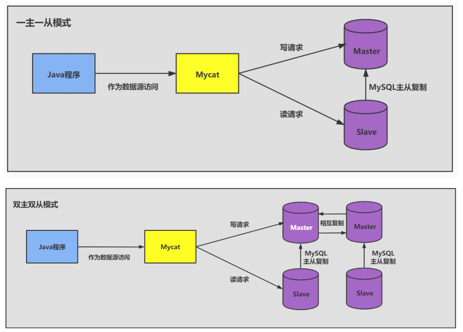

### 第12章 数据库其它调优策略

#### **1.** **数据库调优的措施**

##### **1.1** **调优的目标**

- 尽可能`节省系统资源`，以便系统可以提供更大负荷的服务。（吞吐量更大）
- 合理的结构设计和参数调整，以提高用户操` 响应的速度`。（响应速度更快）
- 减少系统的瓶颈，提高MySQL数据库整体的性能。

##### **1.2** **如何定位调优问题**

- **用户的反馈（主要）**
- **日志分析（主要）**
- **服务器资源使用监控**
- **数据库内部状况监控**
- **其它**

##### **1.3** **调优的维度和步骤**

**第1步：选择适合的** **DBMS** 


**第2步：优化表设计** 


**第3步：优化逻辑查询**


**第4步：优化物理查询**


**第5步：使用** **`Redis`** **或** **`Memcached`** **作为缓存**


**第6步：库级优化** 

库级优化是站在数据库的维度上进行的优化策略，比如控制一个库中的数据表数量。另外，单一的数据库总会遇到各种限制，不如取长补短，利用"外援""的方式。通过主从架构优化我们的读写策略，通过对数据库进行垂直或者水平切分，突破单—数据库或数据表的访问限制，提升查询的性能。

**1、读写分离**

如果读和写的业务量都很大，并且它们都在同一个数据库服务器中进行操作，那么数据库的性能就会出现瓶颈,这时为了提升系统的性能，优化用户体验，我们可以采用读写分离的方式降低主数据库的负载，比如用主数据库( master)完成写操作，用从数据库(slave）完成读操作。



**2、数据分片**

对数据库分库分表。当数据量级达到千万级以上时，有时候我们需要把一个数据库切成多份，放到不同的数据库服务器上，减少对单一数据库服务器的访问压力。如果你使用的是`MysQL`，就可以使用`MysQL`自带的分区表功能，当然你也可以考虑自己做垂直拆分（分库）、水平拆分（分表)、垂直+水平拆分(分库分表)。


#### **2.** **优化MySQL服务器**

##### **2.1** **优化服务器硬件**


##### **2.2** **优化MySQL的参数**

- `innodb_buffer_pool_size`：这个参数是`Mysql`数据库最重要的参数之一，表示`InnoDB`类型的`表和索引的最大缓存`。它不仅仅缓存`索引数据`，还会缓存`表的数据`。这个值越大，查询的速度就会越快。但是这个值太大会影响操作系统的性能。
- `key_buffer_size`：表示`索引缓冲区的大小`。索引缓冲区是所有的`线程共享`。增加索引缓冲区可以得到更好处理的索引（对所有读和多重写）。当然，这个值不是越大越好，它的大小取决于内存的大小。如果这个值太大，就会导致操作系统频繁换页，也会降低系统性能。对于内存在`4GB`左右的服务器该参数可设置为`256M`或`384M`。
- `table_cache`：表示`同时打开的表的个数`。这个值越大，能够同时打开的表的个数越多。物理内存越大，设置就越大。默认为2402，调到512-1024最佳。这个值不是越大越好，因为同时打开的表太多会影响操作系统的性能。
- `query_cache_size`：表示`查询缓冲区的大小`。可以通过在MySQL控制台观察，如果`Qcache_lowmem_prunes`的值非常大，则表明经常出现缓冲不够的情况，就要增加Query_cache_size的值；如果`Qcache_hits`的值非常大，则表明查询缓冲使用非常频繁，如果该值较小反而会影响效率，那么可以考虑不用查询缓存；`Qcache_free_blocks`，如果该值非常大，则表明缓冲区中碎片很多。MySQL8.0之后失效。该参数需要和query_cache_type配合使用。
- `query_cache_type`的值是0时，所有的查询都不使用查询缓存区。但是query_cache_type=0并不会导致MySQL释放query_cache_size所配置的缓存区内存。
  - 当`query_cache_type=1`时，所有的查询都将使用查询缓存区，除非在查询语句中指定`SQL_NO_CACHE`，如`SELECT SQL_NO_CACHE * FROM` `tbl_name`。 
  - 当`query_cache_type=2`时，只有在查询语句中使用`SQL_CACHE`关键字，查询才会使用查询缓存区。使用查询缓存区可以提高查询的速度，这种方式只适用于修改操作少且经常执行相同的查询操作的情况。
- `sort_buffer_size`：表示每个`需要进行排序的线程分配的缓冲区的大小`。增加这个参数的值可以提高`ORDER BY`或`GROUP BY`操作的速度。默认数值是2 097 144字节（约2MB）。对于内存在4GB左右的服务器推荐设置为6-8M，如果有100个连接，那么实际分配的总共排序缓冲区大小为100 × 6 ＝ 600MB。 
- `join_buffer_size = 8M`：表示`联合查询操作所能使用的缓冲区大小`，和sort_buffer_size一样，该参数对应的分配内存也是每个连接独享。
- `read_buffer_size`：表示`每个线程连续扫描时为扫描的每个表分配的缓冲区的大小（字节）`。当线程从表中连续读取记录时需要用到这个缓冲区。SET SESSION read_buffer_size=n可以临时设置该参数的值。默认为64K，可以设置为4M。 
- `innodb_flush_log_at_trx_commit`：表示`何时将缓冲区的数据写入日志文件`，并且将日志文件写入磁盘中。该参数对于`innoDB`引擎非常重要。该参数有3个值，分别为0、1和2。该参数的默认值为1。
  - 值为`0`时，表示`每秒1次`的频率将数据写入日志文件并将日志文件写入磁盘。每个事务的commit并不会触发前面的任何操作。该模式速度最快，但不太安全，`mysqld`进程的崩溃会导致上一秒钟所有事务数据的丢失。
  - 值为`1`时，表示`每次提交事务时`将数据写入日志文件并将日志文件写入磁盘进行同步。该模式是最安全的，但也是最慢的一种方式。因为每次事务提交或事务外的指令都需要把日志写入（`flush`）硬盘。
  - 值为`2`时，表示`每次提交事务时`将数据写入日志文件，`每隔1秒`将日志文件写入磁盘。该模式速度较快，也比0安全，只有在操作系统崩溃或者系统断电的情况下，上一秒钟所有事务数据才可能丢失。
- `innodb_log_buffer_size`：这是 `InnoDB` 存储引擎的`事务日志所使用的缓冲区`。为了提高性能，也是先将信息写入 `Innodb Log Buffer` 中，当满足 `innodb_flush_log_trx_commit` 参数所设置的相应条件（或者日志缓冲区写满）之后，才会将日志写到文件（或者同步到磁盘）中。
- `max_connections`：表示 允许连接到MySQL数据库的最大数量 ，默认值是 151 。如果状态变量`connection_errors_max_connections` 不为零，并且一直增长，则说明不断有连接请求因数据库连接数已达到允许最大值而失败，这是可以考虑增大`max_connections` 的值。在 `Linux` 平台下，性能好的服务器，支持 500-1000 个连接不是难事，需要根据服务器性能进行评估设定。这个连接数 不是越大 越好 ，因为这些连接会浪费内存的资源。过多的连接可能会导致MySQL服务器僵死。
- `back_log`：用于`控制MySQL监听TCP端口时设置的积压请求栈大小`。如果`MySql`的连接数达到`max_connections`时，新来的请求将会被存在堆栈中，以等待某一连接释放资源，该堆栈的数量即`back_log`，如果等待连接的数量超过`back_log`，将不被授予连接资源，将会报错。5.6.6 版本之前默认值为 50 ， 之后的版本默认为 50 + （`max_connections` / 5）， 对于Linux系统推荐设置为小于512的整数，但最大不超过900。如果需要数据库在较短的时间内处理大量连接请求， 可以考虑适当增大back_log 的值。
- `thread_cache_size`：`线程池缓存线程数量的大小`，当客户端断开连接后将当前线程缓存起来，当在接到新的连接请求时快速响应无需创建新的线程 。这尤其对那些使用短连接的应用程序来说可以极大的提高创建连接的效率。那么为了提高性能可以增大该参数的值。默认为60，可以设置为120。
- `wait_timeout`：指定`一个请求的最大连接时间`，对于4GB左右内存的服务器可以设置为5-10。 
- `interactive_timeout`：表示服务器在关闭连接前等待行动的秒数。

#### **3.** **优化数据库结构**

一个好的数据库设计方案对于数据库的性能常常会起到事半功倍的效果。合理的数据库结构不仅可以使数据库占用更小的磁盘空间，而且能够使查询速度更快。数据库结构的设计需要考虑数挂冗余、查询和更新的速度、字段的数据类型是否合理等多方面的内容。

##### **3.1** **拆分表：冷热数据分离**


##### **3.2** **增加中间表** 

##### **3.3** **增加冗余字段**


##### **3.4** **优化数据类型**

**情况1：对整数类型数据进行优化。**

遇到整数类型的字段可以用`INT 型`。这样做的理由是，`INT` 型数据有足够大的取值范围，不用担心数据超出取值范围的问题。刚开始做项目的时候，首先要保证系统的稳定性，这样设计字段类型是可以的。但在数据量很大的时候，数据类型的定义，在很大程度上会影响到系统整体的执行效率。

对于`非负型`的数据（如自增ID、整型IP）来说，要优先使用无符号整型`UNSIGNED`来存储。因为无符号相对于有符号，同样的字节数，存储的数值范围更大。如`tinyint`有符号为-128-127，无符号为0-255，多出一倍的存储空间。

**情况2：既可以使用文本类型也可以使用整数类型的字段，要选择使用整数类型**。

跟文本类型数据相比，大整数往往占用`更少的存储空间`，因此，在存取和比对的时候，可以占用更少的内存空间。所以，在二者皆可用的情况下，尽量使用整数类型，这样可以提高查询的效率。如：将IP地址转换成整型数据。

**情况3：避免使用`TEXT`、`BLOB`数据类型**

**情况4：避免使用`ENUM`类型**

修改ENUM值需要使用ALTER语句。
ENUM类型的ORDER BY操作效率低，需要额外操作。使用TINYINT来代替ENUM类型。

**情况5：使用`TIMESTAMP`存储时间**

TIMESTAMP存储的时间范围1970-01-0100:00:01~ 2038-01-19-03:14:07。TIMESTAMP使用4字节，DATETIME使用8个字节，同时TIMESTAMP具有自动赋值以及自动更新的特性。

**情况6：用`DECIMAL`代替`FLOAT`和`DOUBLE`存储精确浮点数**

1)非精准浮点:float,double

2)精准浮点: decimal
Decimal类型为精准浮点数，在计算时不会丢失精度，尤其是财务相关的金融类数据.
占用空间由定义的宽度决定，每4个字节可以存储9位数字，并且小数点要占用一个字节。可用于存储比bigint更大的整型数据。

**总之，遇到数据量大的项目时，一定要在充分了解业务需求的前提下，合理优化数据类型，这样才能充分发挥资源的效率，使系统达到最优**。

##### **3.5** **优化插入记录的速度**

**1. `MyISAM` 引擎的表：**

**① 禁用索引**


**② 禁用唯一性检查**


**③ 使用批量插入**


**④ 使用LOAD DATA INFILE 批量导入**

当需要批量导入数据时，如果能用LOAD DATAINFILE语句，就尽量使用。因为LOAD DATAINFILE语句导入数据的速度比INSERT语句快。

**2. `InnoDB`引擎的表：**

 **① 禁用唯一性检查**

**② 禁用外键检查**


**③ 禁止自动提交**


##### **3.6** **使用非空约束**

**在设计字段的时候，如果业务允许，建议尽量使用非空约束**


##### **3.7** **分析表、检查表与优化表**

**1.** **分析表**

```mysql
ANALYZE [LOCAL | NO_WRITE_TO_BINLOG] TABLE tbl_name[,tbl_name]…
```

默认的，`MySQL`服务会将 `ANALYZE TABLE` 语句写到`binlog`中，以便在主从架构中，从服务能够同步数据。可以添加参数`LOCAL` 或者 `NO_WRITE_TO_BINLOG`取消将语句写到`binlog`中。

使用`ANALYZE TABLE`分析表的过程中，数据库系统会自动对表加一个`只读锁`。在分析期间，只能读取表中的记录，不能更新和插入记录。`ANALYZE TABLE`语句能够分析`InnoDB`和`MyISAM`类型的表，但是不能作用于视图。

`ANALYZE TABLE`分析后的统计结果会反应到`cardinality`的值，该值统计了表中某一键所在的列不重复的值的个数。**该值越接近表中的总行数，则在表连接查询或者索引查询时，就越优先被优化器选择使用。**

**2.** **检查表** 


```mysql
CHECK TABLE tbl_name [, tbl_name] ... [option] ... option = {QUICK | FAST | MEDIUM | EXTENDED | CHANGED} 
```

**3.** **优化表**

```mysql
OPTIMIZE [LOCAL | NO_WRITE_TO_BINLOG] TABLE tbl_name [, tbl_name] ...
```

MySQL中使用`OPTIMIZE TABLE`语句来优化表。但是，OPTILMIZE TABLE语句只能优化表中的`VARCHAR`、`BLOB`或`TEXT`类型的字段。一个表使用了这些字段的数据类型，若已经`删除`了表的一大部分数据，或者已经对含有可变长度行的表（含有`VARCHAR`、`BLOB`或`TEXT`列的表）进行了很多`更新`，则应使用OPTIMIZE TABLE来重新利用未使用的空间，并整理数据文件的`碎片`。 

`OPTIMIZE TABLE` 语句对`InnoDB`和`MyISAM`类型的表都有效。该语句在执行过程中也会给表加上`只读锁`。


其他调优策略


 

