### 第13章 事务基础知识

#### **1.** **数据库事务概述**

事务是数据库区别于文件系统的重要特性之一，当我们有了事务就会让数据库始终保持一致性，同时我们还能通
过事务的机制恢复到某个时间点，这样可以保证已提交到数据库的修改不会因为系统崩溃而丢失。


##### **1.1** **基本概念**

**事务：**一组逻辑操作单元，使数据从一种状态变换到另一种状态。

**事务处理的原则：**保证所有事务都作为`一个工作单元`来执行，即使出现了故障，都不能改变这种执行方式。当在一个事务中执行多个操作时，要么所有的事务都被提交(`commit`)，那么这些修改就`永久`地保存下来；要么数据库管理系统将`放弃`所作的所有`修改`，整个事务回滚(`rollback`)到最初状态。

##### **1.2** **事务的ACID特性**

- **原子性（atomicity）：**

原子性是指事务是一个不可分割的工作单位，要么全部提交，要么全部失败回滚。

- **一致性（consistency）：**


- **隔离型（isolation）：**

事务的隔离性是指一个事务的执行`不能被其他事务干扰`，即一个事务内部的操作及使用的数据对`并发`的其他事务是隔离的，并发执行的各个事务之间不能互相干扰。

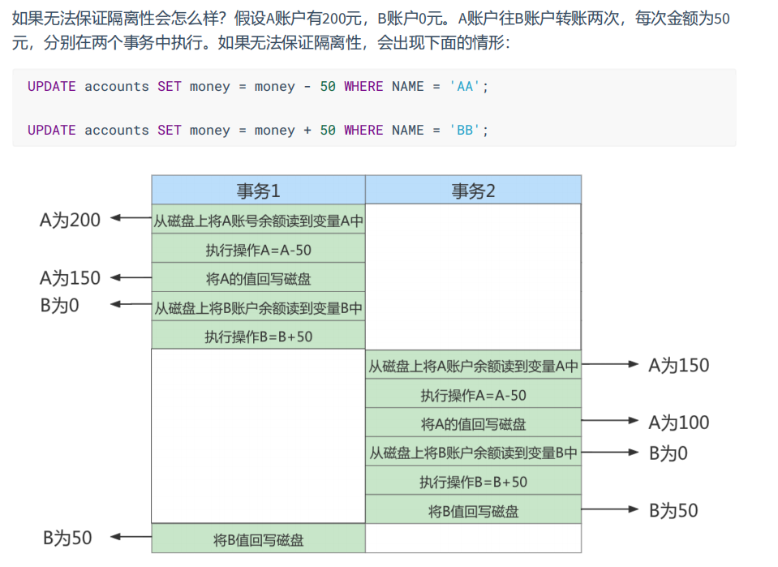

- **持久性（durability）：**

持久性是指一个事务一旦被提交，它对数据库中数据的改变就是`永久性的`，接下来的其他操作和数据库故障不应该对其有任何影响。

持久性是通过`事务日志`来保证的。日志包括了`重做日志`和`回滚日志`。当我们通过事务对数据进行修改的时候，首先会将数据库的变化信息记录到重做日志中，然后再对数据库中对应的行进行修改。这样做的好处是，即使数据库系统崩溃，数据库重启后也能找到没有更新到数据库系统中的重做日志，重新执行，从而使事务具有持久性。

这里不对，一致性是事务的最终目的，原子性、隔离性、持久性是手段《凤凰架构》


##### **1.3** **事务的状态**

- **活动的（active）**

事务对应的数据库操作正在执行过程中时，我们就说该事务处在`活动的`状态。

- **部分提交的（partially committed）**

当事务中的最后一个操作执行完成，但由于操作都在内存中执行，所造成的影响并`没有刷新到磁盘`时，我们就说该事务处在`部分提交的`状态。

- **失败的（failed）**

当事务处在`活动的`或者`部分提交的`状态时，可能遇到了某些错误（数据库自身的错误、操作系统错误或者直接断电等）而无法继续执行，或者人为的停止当前事务的执行，我们就说该事务处在`失败的`状态。

- **中止的（aborted）**

如果事务执行了一部分而变为`失败的`状态，那么就需要把已经修改的事务中的操作还原到事务执行前的状态。换句话说，就是要撤销失败事务对当前数据库造成的影响。我们把这个撤销的过程称之为`回滚`。当`回滚`操作执行完毕时，也就是数据库恢复到了执行事务之前的状态，我们就说该事务处在了`中止的`状态。

- **提交的（committed）**

当一个处在`部分提交的`状态的事务将修改过的数据都`同步到磁盘`上之后，我们就可以说该事务处在了`提交的`状态。

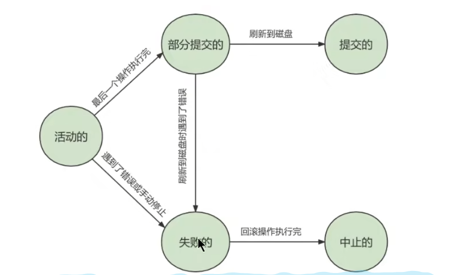

图中可见，只有当事务处于提交的或者中止的状态时，一个事务的生命周期才算是结束了。对于已经提交的事务来说，该事务对数据库所做的修改将永久生效，对于处于中止状态的事务，该事务对数据库所做的所有修改都会被回滚到没执行该事务之前的状态。

#### **2.** **如何使用事务**

##### **2.1** **显式事务**

【即便开启了自动提交事务，当我们显式使用事务开启，仍然可以在当前事务操作中，停止事务的自动提交】

**步骤1：** `START TRANSACTION`或者`BEGIN`，作用是显式开启一个事务。

```mysql
mysql> BEGIN; 
#或者 
mysql> START TRANSACTION;
```

`START TRANSACTION`语句相较于`BEGIN`特别之处在于，后边能跟随几个`修饰符`： 

①`READ ONLY`：标识当前事务是一个`只读事务`，也就是属于该事务的数据库操作只能读取数据，而不能修改数据。

②`READ WRITE`：标识当前事务是一个`读写事务`，也就是属于该事务的数据库操作既可以读取数据，也可以修改数据。

③`WITH CONSISTENT SNAPSHOT`：启动一致性读。

**步骤2：**一系列事务中的操作（主要是DML，不含DDL）

**步骤3：**提交事务 或 中止事务（即回滚事务）

```mysql
# 提交事务。当提交事务后，对数据库的修改是永久性的。
mysql> COMMIT;
```

```mysql
# 回滚事务。即撤销正在进行的所有没有提交的修改 
mysql> ROLLBACK; 

# 将事务回滚到某个保存点。 
mysql> ROLLBACK TO [SAVEPOINT]
```

其中关于SAVEPOINT相关操作有：

```mysql
# 在事务中创建保存点，方便后续针对保存点进行回滚。一个事物中可以存在多个保存点。
SAVEPOINT 保存点名称;
```

```mysql
# 删除某个保存点
RELEASE SAVEPOINT 保存点名称;
```

##### **2.2** **隐式事务**【只针对DML操作有效】

- 显式的的使用`START TRANSACTION`或者`BEGIN`语句开启一个事务。这样在本次事务提交或者回滚前会暂时关闭掉自动提交的功能。
- 把系统变量`autocommit`的值设置为`OFF`

```sql
set autocommit = FALSE;
```

##### **2.3** **隐式提交数据的情况**

- **数据定义语言（Data definition language，缩写为：DDL）**


- **隐式使用或修改`mysql`数据库中的表**


- **事务控制或关于锁定的语句**

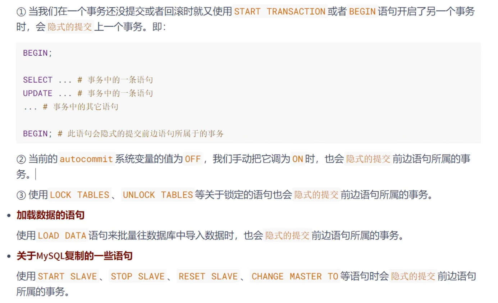


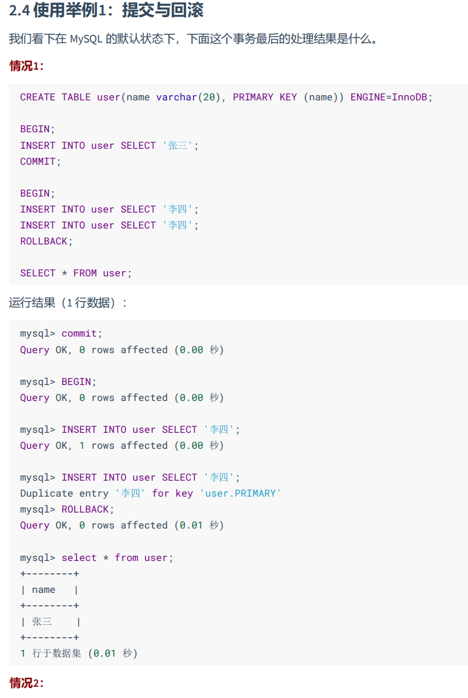

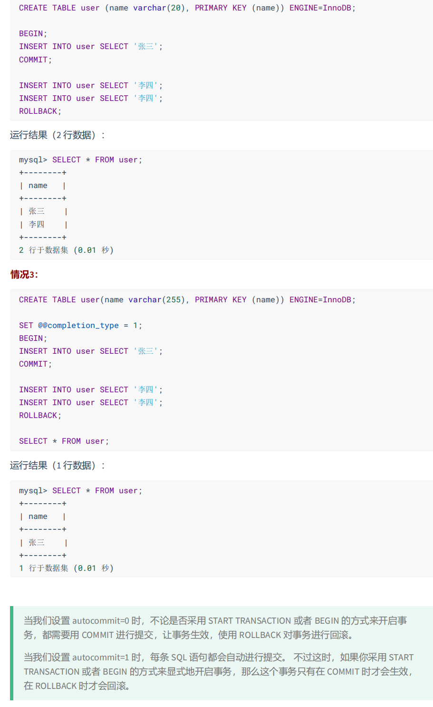

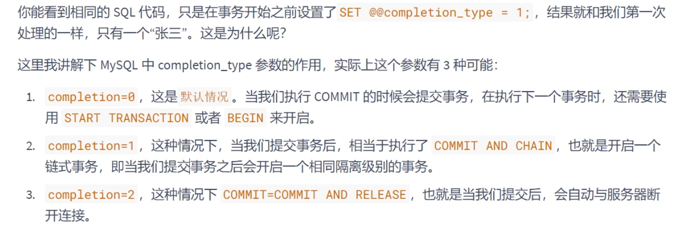

#### **3.** **事务隔离级别**

##### **3.1** **数据并发问题**

**1.** **脏写（**`Dirty Write`**）**

对于两个事务 Session A、Session B，如果事务Session A`修改了`另一个`未提交`事务Session B`修改过`的数据，那就意味着发生了`脏写`

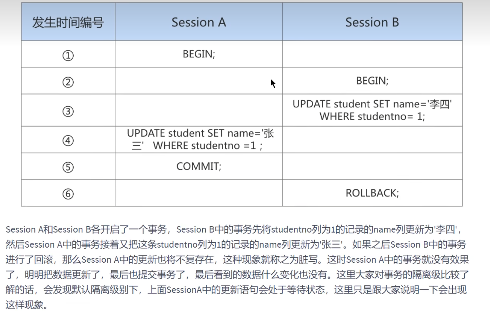

**2.** **脏读（**`Dirty Read`**）**

对于两个事务 Session A、Session B，Session A`读取`了已经被 Session B`更新`但还`没有被提交`的字段。之后若 Session B`回滚`，Session A`读取`的内容就是`临时且无效`的。

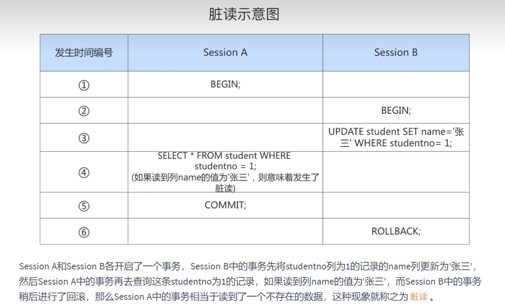

**3.** **不可重复读（**`Non-Repeatable Read`**）**

对于两个事务Session A、Session B，Session A`读取`了一个字段，然后 Session B`更新`了该字段。 之后Session A`再次读取`同一个字段，`值就不同`了。那就意味着发生了不可重复读。

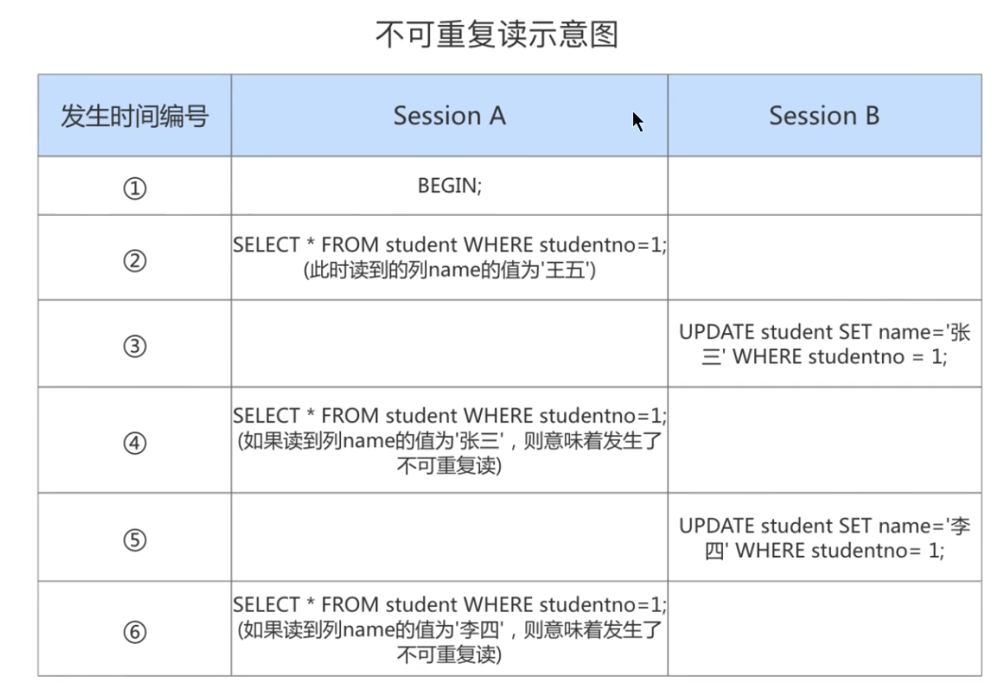

**4.** **幻读（**`Phantom`**）**

对于两个事务Session A、Session B, Session A 从一个表中`读取`了一个字段, 然后 Session B 在该表中`插入`了一些新的行。 之后, 如果 Session A`再次读取`同一个表, 就会多出几行。那就意味着发生了幻读。

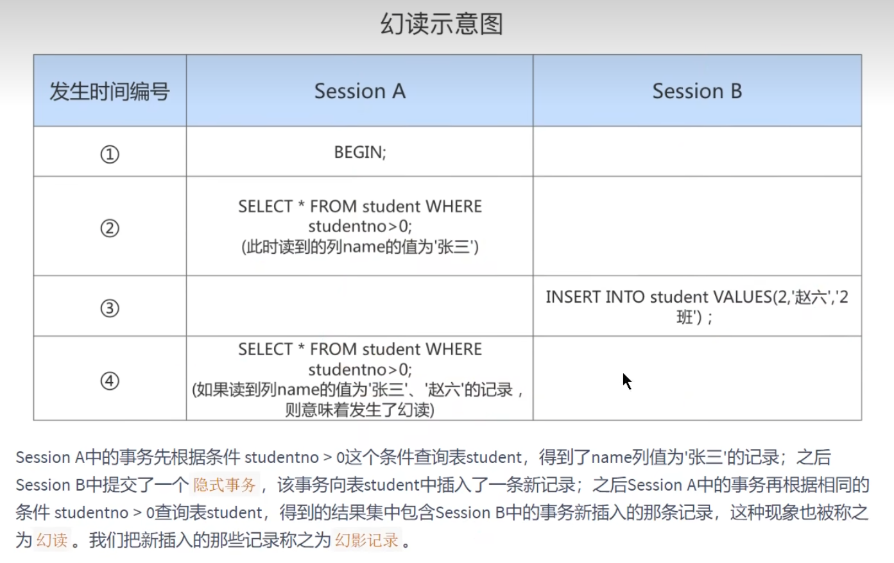

**注意1：**

有的同学会有疑问，那如果Session B中`剔除了`一些符合`studentno > 0`的记录而不是插入新记录，那么Session A之后再根据`studentno > 0`的条件读取的`记录变少了`，这种现象算不算`幻读`呢？这种现象`不属于幻读`，幻读强调的是一个事物按照某个`相同条件多次读取`记录时，后读取时读到了之前`没有读到的记录`。

**注意2：**

那对于先前已经读到的记录，之后又读取不到这种情况，算啥呢？这相当于对每一条记录都发生了`不可重复读`的现象。幻读只是重点强调了读取到之前读取没有获取到的记录。

##### **3.2 SQL中的四种隔离级别**

问题的严重性排序如下：

```apl
脏写 > 脏读 > 不可重复读 > 幻读
```

`SQL标准`中设立了4个`隔离级别`：

- `READ UNCOMMITTED`：读未提交，在该隔离级别，所有事务都可以看到其他未提交事务的执行结果。不能避免脏读、不可重复读、幻读。
- `READ COMMITTED`：读已提交，它满足了隔离的简单定义：一个事务只能看见已经提交事务所做的改变。这是大多数数据库系统的默认隔离级别（但不是MySQL默认的）。可以避免脏读，但不可重复读、幻读问题仍然存在。
- `REPEATABLE READ`：可重复读，事务A在读到一条数据之后，此时事务B对该数据进行了修改并提交，那么事务A再读该数据，读到的还是原来的内容。可以避免脏读、不可重复读，但幻读问题仍然存在。`这是MySQL的默认隔离级别`。
- `SERIALIZABLE`：可串行化，确保事务可以从一个表中读取相同的行。在这个事务持续期间，禁止其他事务对该表执行插入、更新和删除操作。所有的并发问题都可以避免，但性能十分低下。能避免脏读、不可重复读和幻读。

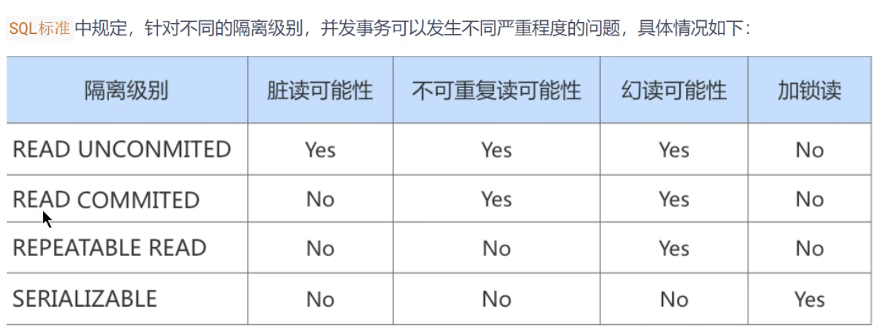

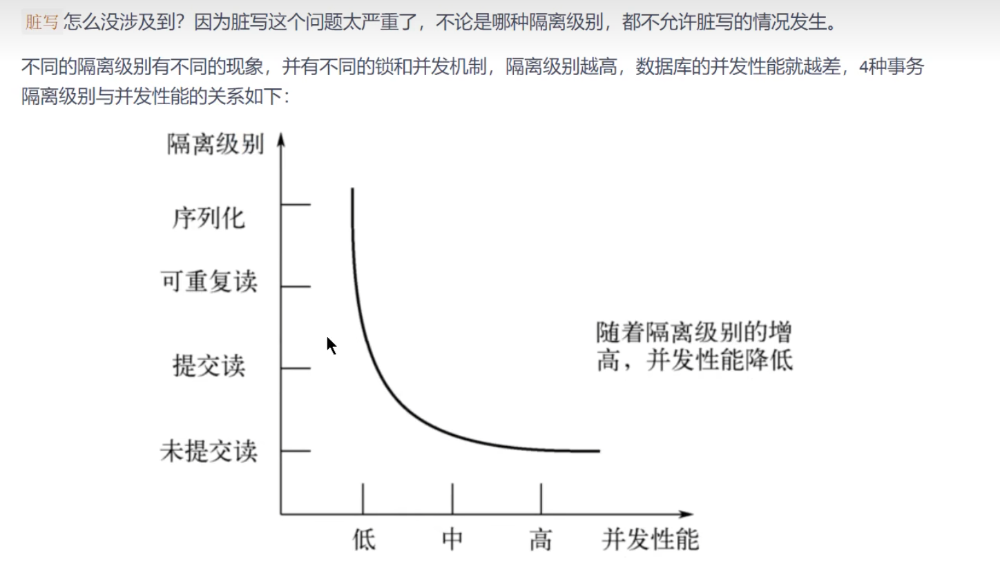

##### **3.3** **如何设置事务的隔离级别**

```mysql
SET [GLOBAL|SESSION] TRANSACTION ISOLATION LEVEL 隔离级别; 
#其中，隔离级别格式： 
> READ UNCOMMITTED 
> READ COMMITTED 
> REPEATABLE READ 
> SERIALIZABLE
```

或者：

```mysql
SET [GLOBAL|SESSION] TRANSACTION_ISOLATION = '隔离级别' 
#其中，隔离级别格式： 
> READ-UNCOMMITTED 
> READ-COMMITTED 
> REPEATABLE-READ 
> SERIALIZABLE
```

