# 第14章 MySQL事务日志

事务有4种特性：原子性、一致性、隔离性和持久性。那么事务的四种特性到底是基于什么机制实现呢？

- 事务的隔离性由 `锁机制` 实现。
- 而事务的原子性、一致性和持久性由事务的 `redo` 日志和 `undo` 日志来保证。
  - `REDO LOG` 称为 `重做日志` ，提供再写入操作，恢复提交事务修改的页操作，用来保证事务的持久性。
  - `UNDO LOG` 称为 `回滚日志` ，回滚行记录到某个特定版本，用来保证事务的原子性、一致性。


# 1. `redo`日志

## 1.1 为什么需要`REDO`日志

一方面，缓冲池可以帮助我们消除`CPU`和磁盘之间的鸿沟，`checkpoint`机制可以保证数据的最终落盘，然而由于`checkpoint` `并不是每次变更的时候就触发`的，而是 `master` 线程隔一段时间去处理的。所以最坏的情况就是事务提交后，刚写完缓冲池，数据库宕机了，那么这段数据就是丢失的，无法恢复。

另一方面，事务包含 `持久性` 的特性，就是说对于一个已经提交的事务，在事务提交后即使系统发生了崩溃，这个事务对数据库中所做的更改也不能丢失。

那么如何保证这个持久性呢？`一个简单的做法`：在事务提交完成之前把该事务所修改的所有页面都刷新到磁盘，但是这个简单粗暴的做法有些问题

`另一个解决的思路`：我们只是想让已经提交了的事务对数据库中数据所做的修改永久生效，即使后来系统崩溃，在重启后也能把这种修改恢复出来。所以我们其实没有必要在每次事务提交时就把该事务在内存中修改过的全部页面刷新到磁盘，只需要把`修改`了哪些东西`记录一下`就好。比如，某个事务将系统表空间中`第10号`页面中偏移量为`100`处的那个字节的值`1`改成`2`。我们只需要记录一下：将第0号表空间的10号页面的偏移量为100处的值更新为 2 。

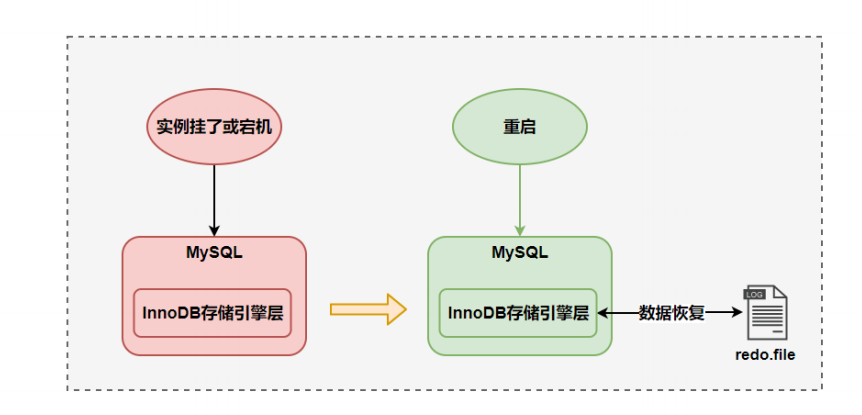

## 1.2 `REDO`日志的好处、特点

**1.** **好处**

- **`redo`日志降低了刷盘频率**
- **`redo`日志占用的空间非常小**

存储表空间ID、页号、偏移量以及需要更新的值，所需的存储空间是很小的，刷盘快。

**2.** **特点**

- **redo日志是顺序写入磁盘的**

在执行事务的过程中，每执行一条语句，就可能产生若干条redo日志，这些日志是按照产生的顺序写入磁盘的，也就是使用顺序`io`，效率比随机`Io`快。

- **事务执行过程中，redo log不断记录**

redo log跟bin log的区别，redo log是存储引擎层产生的，而bin log是数据库层产生的。假设一个事务，对表做10万行的记录插入，在这个过程中，一直不断的往redo log顺序记录，而bin log不会记录，直到这个事务提交，才会一次写入到bin log文件中。


## 1.3 redo的组成

Redo log可以简单分为以下两个部分：

- `重做日志的缓冲 (redo log buffer) `，保存在内存中，是易失的。


**参数设置：`innodb_log_buffer_size`：**

`redo log buffer` 大小，默认`16M`，最大值是`4096M`，最小值为`1M`。 

- `重做日志文件 (redo log file)`，保存在硬盘中，是持久的。

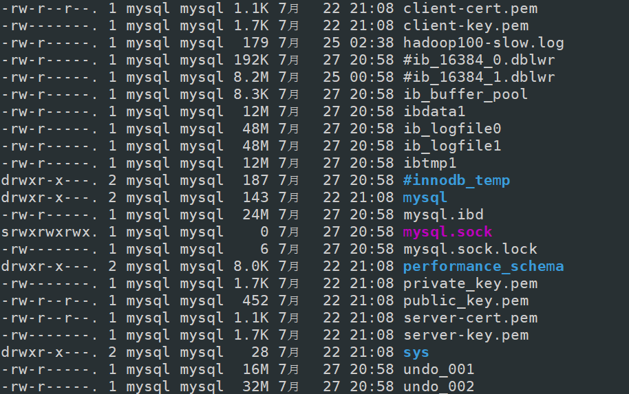

## 1.4 redo的整体流程

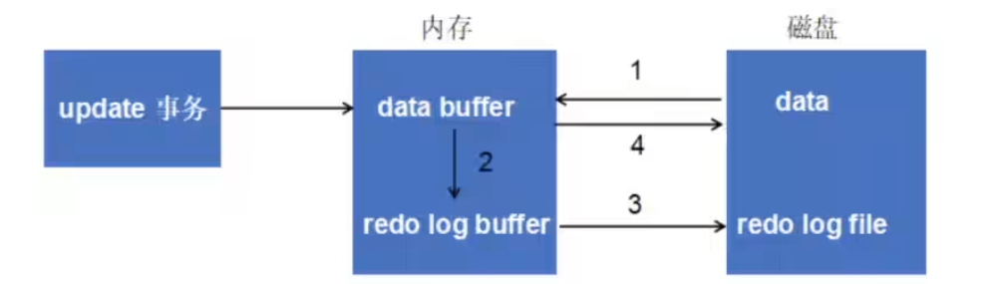

第1步：先将原始数据从磁盘中读入内存中来，修改数据的内存拷贝 

第2步：生成一条重做日志并写入`redo log buffer`，记录的是数据被修改后的值 

第3步：当事务`commit`时，将`redo log buffer`中的内容刷新到 `redo log file`，对 `redo log file`采用追加写的方式

第4步：定期将内存中修改的数据刷新到磁盘中

> `Write-Ahead Log` (预先日志持久化)：在持久化一个数据页之前，先将内存中相应的日志页持久化。


## 1.5 `redo log` 的刷盘策略

`redo log buffer`刷盘到`redo log file`的过程并不是真正的刷到磁盘中去，只是刷入到`文件系统缓存`（`page cache`）中去（这是现代操作系统为了提高文件写入效率做的一个优化），真正的写入会交给系统自己来决定（比如`page cache`足够大了）。那么对于`InnoDB`来说就存在一个问题，如果交给系统来同步，同样如果系统宕机，那么数据也丢失了（虽然整个系统宕机的概率还是比较小的）。

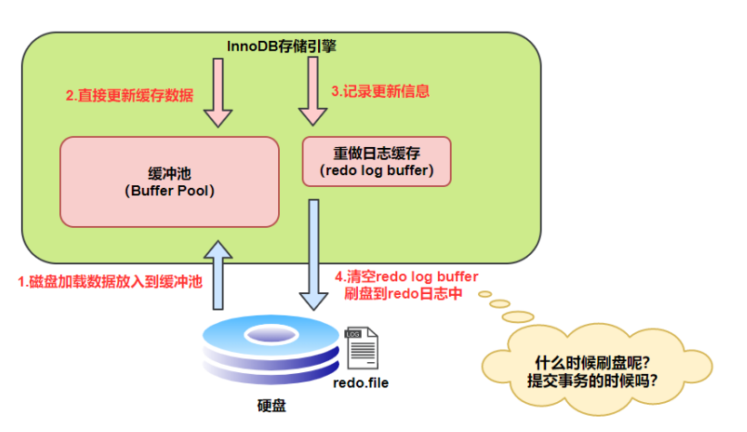

针对这种情况，`InnoDB`给出`innodb_flush_log_at_trx_commit`参数，该参数控制 `commit` 提交事务时，如何将 `redo log buffer` 中的日志刷新到 redo log file 中。它支持三种策略：

- `设置为0`：表示每次事务提交时不进行刷盘操作。（系统默认`master thread` 每隔1s进行一次重做日志的同步）
- `设置为1`：表示每次事务提交时都将进行同步，刷盘操作（`默认值`） 
- `设置为2`：表示每次事务提交时都只把 `redo log buffer` 内容写入 `page cache`，不进行同步。由`os`自己决定什么时候同步到磁盘文件。0可能丢失1s的数据，2的话只要操作系统不挂就没问题。

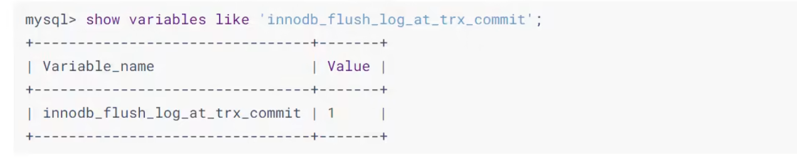

## 1.6 不同刷盘策略演示

**1.** **流程图**

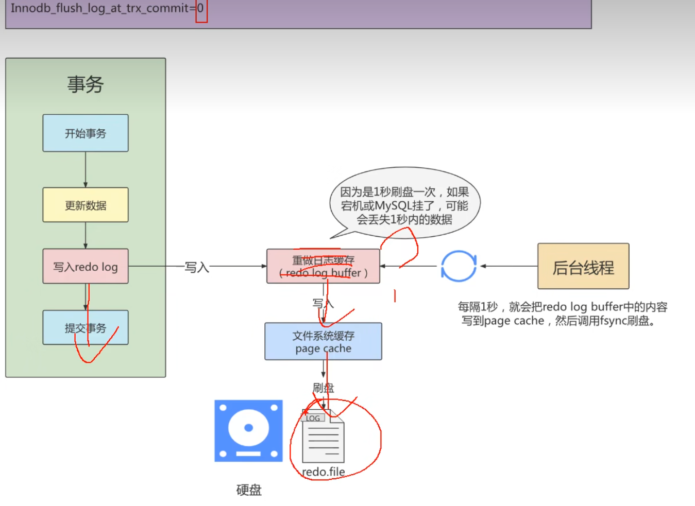

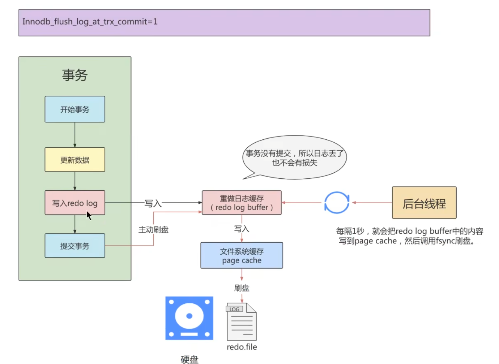

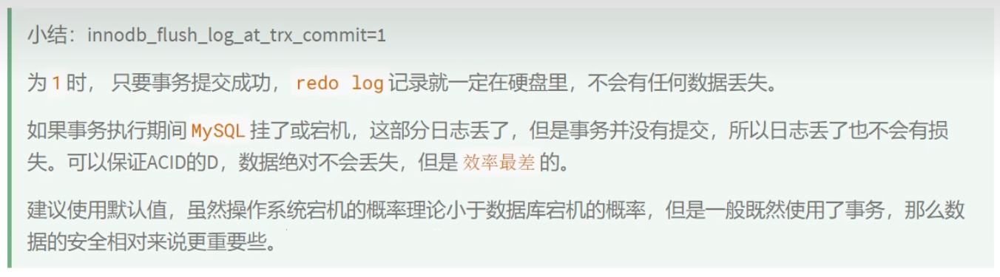


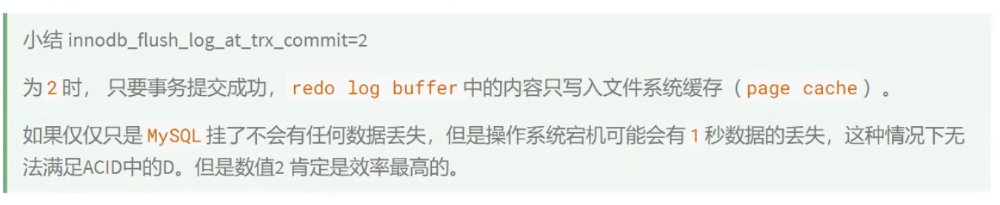

0可能丢失1s的数据，2的话只要操作系统不挂就没问题，速度其实是0最快，然后是1，然后是2。

## 1.7 写入`redo log buffer`过程

**1.** **补充概念：`Mini-Transaction`**

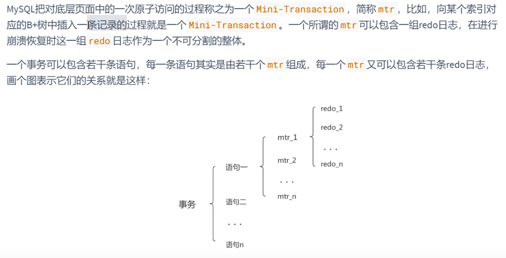

**2. redo** **日志写入log buffer**

不同的事务可能是`并发`执行的，所以`事务T1`、`事务T2`之间的`mtr`可能是`交替执行`的。

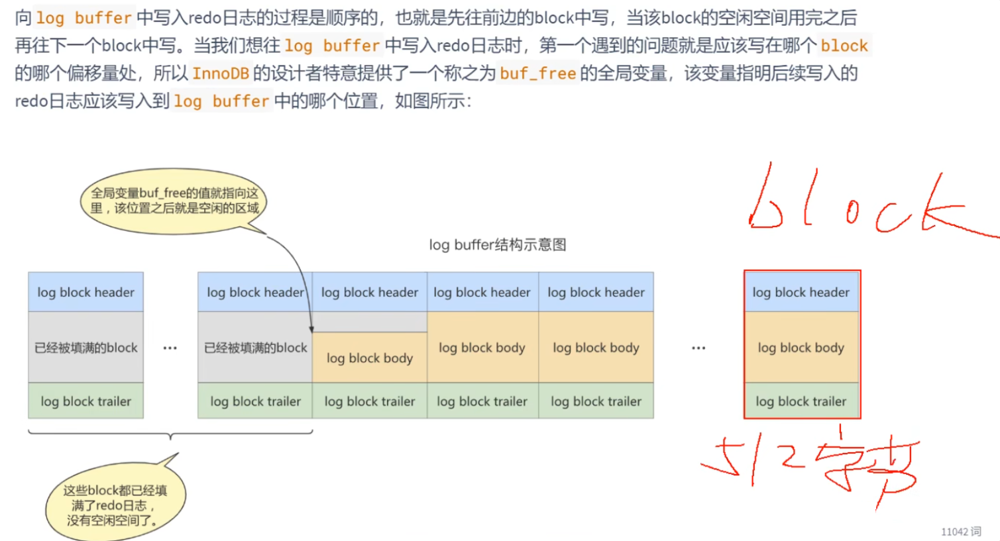

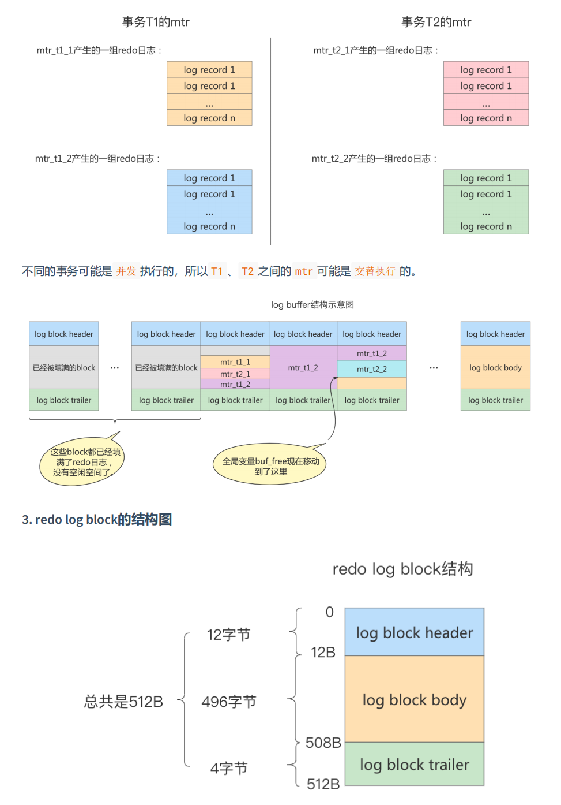

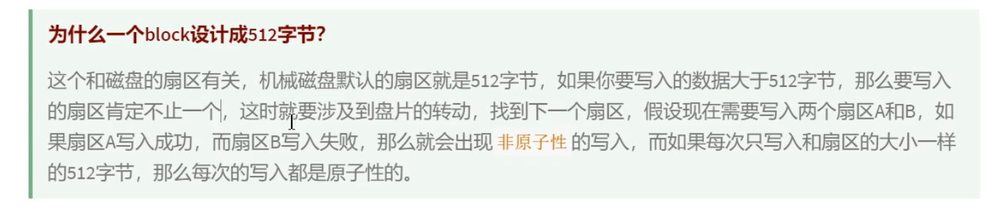

## 1.8 redo log file

**1.** **相关参数设置** 

- `innodb_log_group_home_dir`：指定 `redo log` 文件组所在的路径，默认值为`./`，表示在数据库的数据目录下。`MySQL`的默认数据目录（`var/lib/mysql`）下默认有两个名为`ib_logfile0`和`ib_logfile1`的文件，`log buffer` 中的日志默认情况下就是刷新到这两个磁盘文件中。此redo日志文件位置还可以修改。
- `innodb_log_files_in_group`：指明`redo log file`的个数，命名方式如：`ib_logfile0`，`ib_logfile1`... `ib_logfilen`。默认2个，最大100个。

- `innodb_flush_log_at_trx_commit`：控制 redo log 刷新到磁盘的策略，默认为`1`。 
- `innodb_log_file_size`：单个 `redo log` 文件设置大小，默认值为 48M 。最大值为512G，注意最大值指的是整个 `redo log` 系列文件之和，即（`innodb_log_files_in_group` * `innodb_log_file_size` ）不能大于最大值512G。

**2.** **日志文件组**

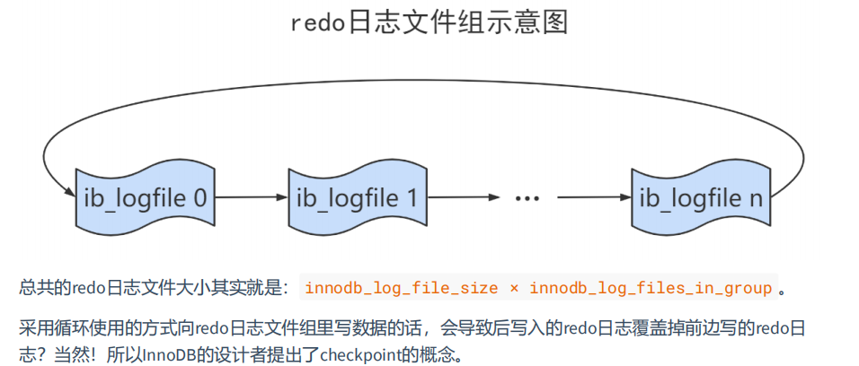

**3. checkpoint**


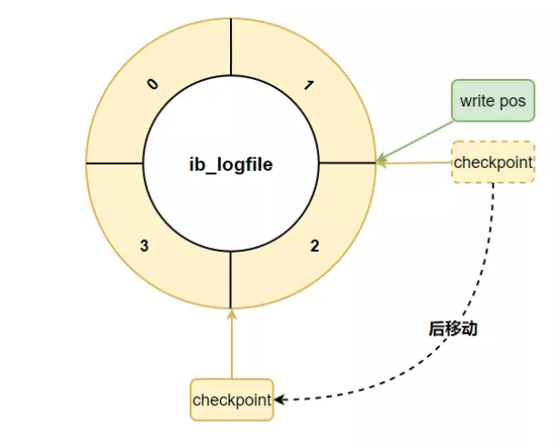

如果 write pos 追上 checkpoint ，表示**日志文件组**满了，这时候不能再写入新的 redo log记录，MySQL 得停下来，清空一些记录，把 checkpoint 推进一下。

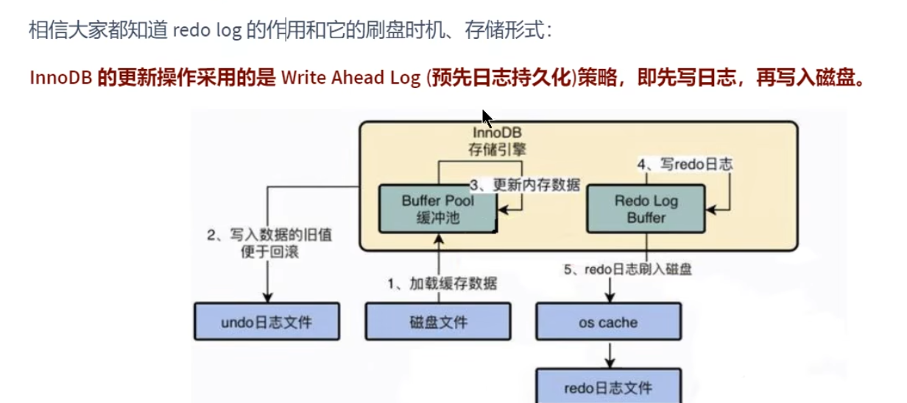


# 2. Undo日志

redo log是事务持久性的保证，undo log是事务原子性的保证。在事务中`更新数据`的`前置操作`其实是要先写入一个 undo log 。

## 2.1 如何理解Undo日志

事务需要保证`原子性`，也就是事务中的操作要么全部完成，要么什么也不做。但有时候事务执行到一半会出现一些情况，比如：

- 情况一：事务执行过程中可能遇到各种错误，比如`服务器本身的错误`，`操作系统错误`，甚至是突然`断电`导致的错误。
- 情况二：程序员可以在事务执行过程中手动输入`ROLLBACK`语句结束当前事务的执行。

以上情况出现，我们需要把数据改回原先的样子，这个过程称之为`回滚`，这样就可以造成一个假象：这个事务看起来什么都没做，所以符合`原子性`要求。

每当我们要对一条记录做改动时(这里的 **改动** 可以指 `INSERT、DELETE、UPDATE` )，都需要"留一手"—-把回滚时所需的东西记下来。比如:

- 你`插入一条记录`时，至少要把这条记录的主键值记下来，之后回滚的时候只需要把这个主键值对应的记录删掉就好了。(对于每个INSERT,InnoDB存储引擎会完成一个DELETE)
- 你`删除了一条记录`，至少要把这条记录中的内容都记下来，这样之后回滚时再把由这些内容组成的记录`插入`入到表中就好了。(对于每个DELETE，InnoDB存储引擎会执行一个INSERT)
- 你`修改了一条记录`，至少要把修改这条记录前的旧值都记录下来，这样之后回滚时再把这条记录`更新为旧值`就好了。(对于每个UPDATE，InnoDB存储引擎会执行一个相反的UPDATE，将修改前的行放回去)

MySQL把这些为了回滚而记录的这些内容称之为撤销日志或者回滚日志(即undo log)。注意，由于查询操作( SELECT ）并不会修改任何用户记录，所以在查询操作执行时，并不需要记录相应的undo日志。

此外，`undo log` 会产生`redo log`，也就是`undo log` 的产生会伴随看 `redo log` 的产生，也需要 `redolog` 持久化的保护。

## 2.2 Undo日志的作用

- **作用1：回滚数据**

用户对undo日志可能`有误解`:undo用于将数据库物理地恢复到执行语句或事务之前的样子。但事实并非如此。

`undo是逻辑日志`，因此只是将数据库逻辑地恢复到原来的样子。所有修改都被迈辑地取消，但定效掂纪佗1火本身在回滚之后可能大不相同。

这是因为在多用户并发系统中，可能会有数十、数百甚至数千个并发事务。数据库的主要任务就是协调对数据记录的并发访问。比如，一个事务在修改当前一个页中某几条记录，同时还有别的事务在对同一个页中另几条记录进行修改。因此，不能将一个页回滚到事务开始的样子，因为这样会影响其他事务正在进行的工作。

- **作用2：MVCC（详情看第16章）**

undo的另一个作用是MVCC，即在`innoDB`存储引擎中`MVCC`的实现是通过undo来完成。当用户读取一行记录时，若该记录已经被其他事务占用，当前事务可以通过undo读取之前的行版本信息，以此实现非锁定读取。

## 2.3 undo的存储结构  

**1.** **回滚段与undo页**


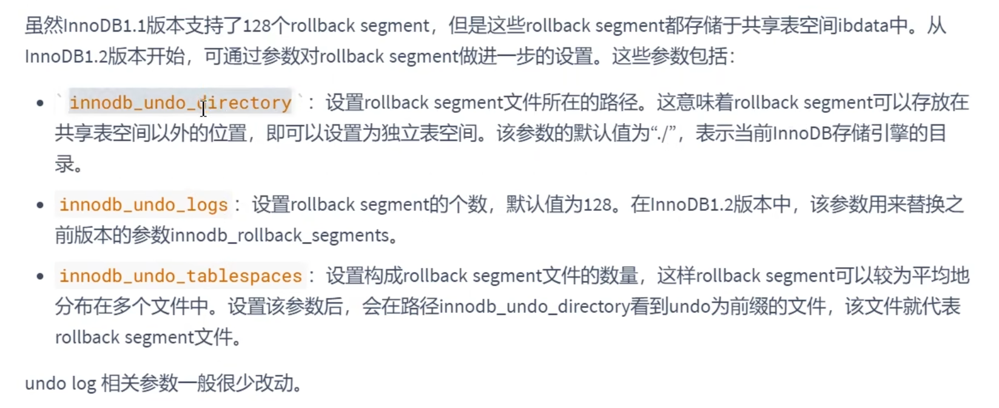

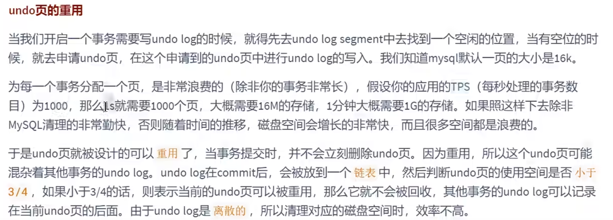

**2.** **回滚段与事务** 

1. 每个事务只会使用一个回滚段，一个回滚段在同一时刻可能会服务于多个事务。

2. 当一个事务开始的时候，会制定一个回滚段，在事务进行的过程中，当数据被修改时，原始的数据会被复制到回滚段。

3. 在回滚段中，事务会不断填充盘区，直到事务结束或所有的空间被用完。如果当前的盘区不够用，事务会在段中请求扩展下一个盘区，如果所有已分配的盘区都被用完，事务会覆盖最初的盘区或者在回滚段允许的情况下扩展新的盘区来使用。

4. 回滚段存在于undo表空间中，在数据库中可以存在多个undo表空间，但同一时刻只能使用一个undo表空间。

5. 当事务提交时，`InnoDB`存储引擎会做以下两件事情：
   - 将`undo log`放入列表中，以供之后的purge操作
   - 判断`undo log`所在的页是否可以重用，若可以分配给下个事务使用

**3.** **回滚段中的数据分类**

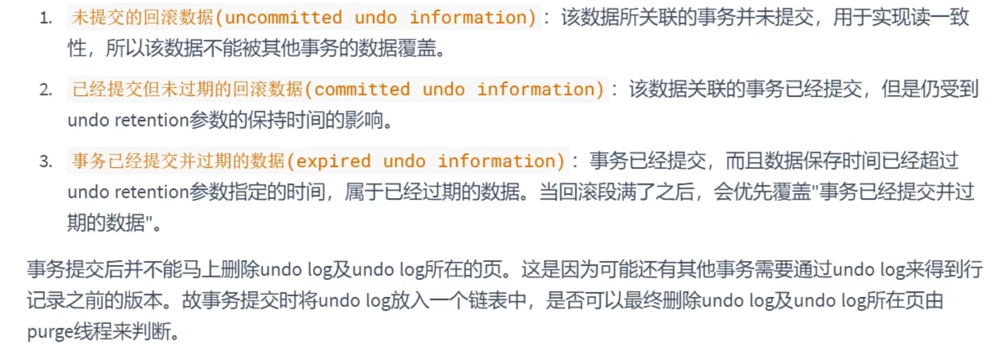

## 2.4 undo的类型 

在`InnoDB`存储引擎中，undo log分为：

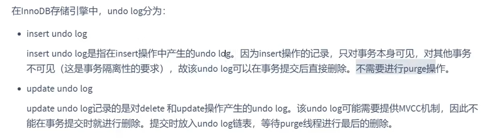

## 2.5 undo log的生命周期

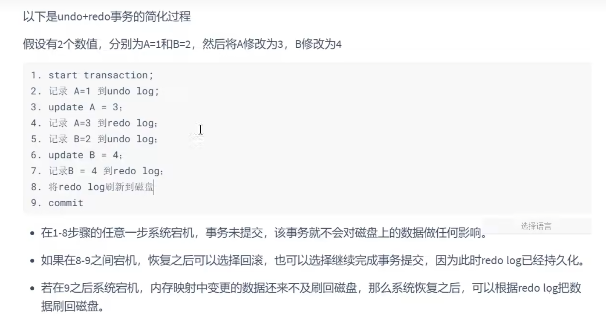

**1.** **简要生成过程**

**只有Buffer Pool的流程：**

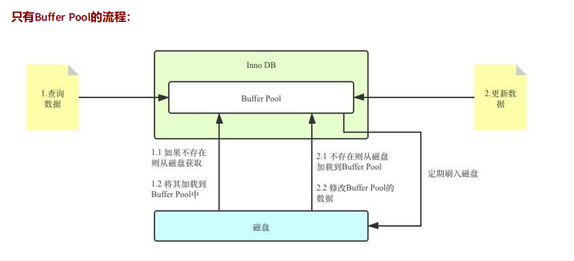

**有了Redo Log和Undo Log之后：**

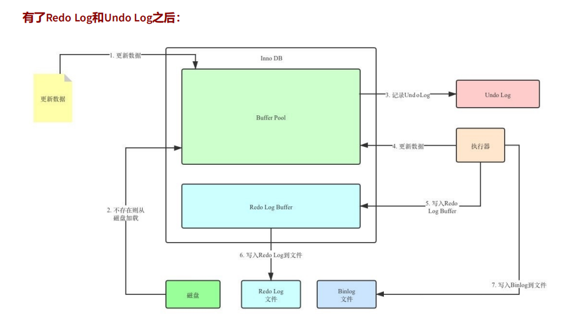

**2.** **详细生成过程**

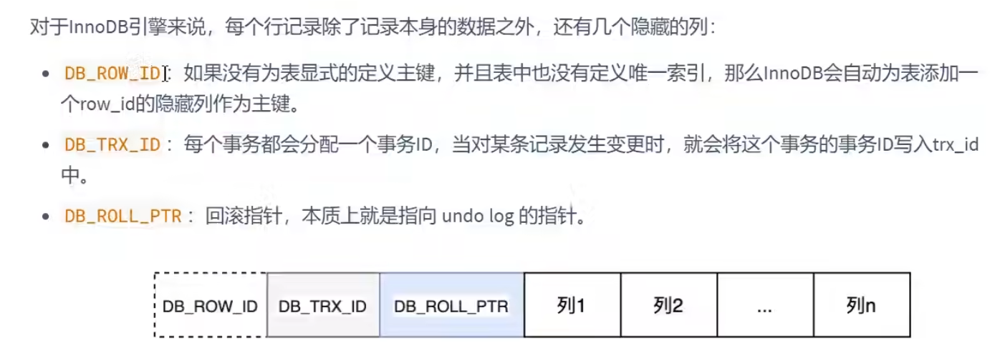

**当我们执行INSERT时：**

```mysql
begin; 
INSERT INTO user (name) VALUES ("tom");
```

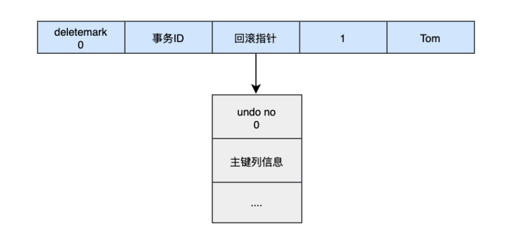

**当我们执行UPDATE时：**

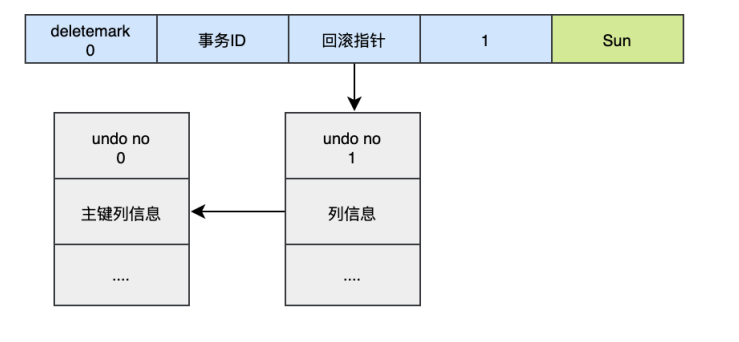

```mysql
UPDATE user SET id=2 WHERE id=1;
```

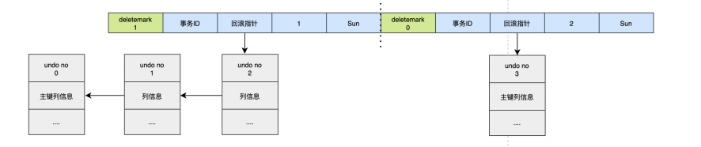

**3. undo log是如何回滚的**

以上面的例子来说，假设执行rollback，那么对应的流程应该是这样：

1. 通过undo no=3的日志把id=2的数据删除

2. 通过undo no=2的日志把id=1的数据的`deletemark`还原成0 

3. 通过undo no=1的日志把id=1的数据的name还原成Tom 

4. 通过undo no=0的日志把id=1的数据删除

**4. undo log的删除**

- 针对于insert undo log

因为insert操作的记录，只对事务本身可见，对其他事务不可见。故该undo log可以在事务提交后直接删除，不需要进行purge操作。

- 针对于update undo log 

该undo log可能需要提供MVCC机制，因此不能在事务提交时就进行删除。提交时放入undo log链表，等待purge线程进行最后的删除。

## 2.6 小结 


undo log是逻辑日志，对事务回滚时，只是将数据库逻辑地恢复到原来的样子。

redo log是物理日志，记录的是数据页的物理变化，undo log不是redo log的逆过程。