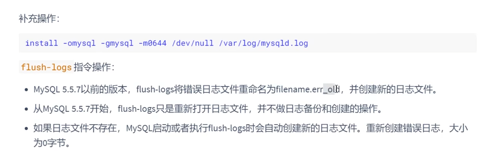

# 第17章 其它数据库日志

我们在讲解数据库事务时，讲过两种日志:重做日志、回滚日志。

对于线上数据库应用系统，突然遭遇 **数据库宕机** 怎么办?在这种情况下，**定位宕机的原因** 就非常关键。我们可以查看数据库的 **错误日志** 。因为日志中记录了数据库运行中的诊断信息，包括了错误、警告和注释等信息。比如:从日志中发现某个连接中的`sql操作`发生了死循环，导致内存不足，被系统强行终止了。明确了原因，处理起来也就轻松了，系统很快就恢复了运行。

除了发现错误，日志在数据复制、数据恢复、操作审计，以及确保数据的永久性和一致性等方面，都有着不可替代的作用。

**千万不要小看日志。** 很多看似奇怪的问题，答案往往就藏在日志里。很多情况下，只有通过查看日志才能发现问题的原因，真正解决问题。所以，一定要学会查

看日志，养成检查日志的习惯，对提高你的数据库应用开发能力至关重要。

MySQL8.0官网日志地址: https://dev.mysql.com/doc/refman/8.0/en/server-logs.h

# 1. MySQL支持的日志

## 1.1 日志类型 

MySQL有不同类型的日志文件，用来存储不同类型的日志，分为`二进制日志`、`错误日志`、`通用查询日志`和`慢查询日志`，这也是常用的4种。MySQL 8又新增两种支持的日志：`中继日志`和`数据定义语句日志`。使用这些日志文件，可以查看MySQL内部发生的事情。

- **慢查询日志：**记录所有执行时间超过long_query_time的所有查询，方便我们对查询进行优化。

- **通用查询日志：**记录所有连接的起始时间和终止时间，以及连接发送给数据库服务器的所有指令，对我们复原操作的实际场景、发现问题，甚至是对数据库操作的审计都有很大的帮助。

- **错误日志：**记录MySQL服务的启动、运行或停止MySQL服务时出现的问题，方便我们了解服务器的状态，从而对服务器进行维护。

- **二进制日志：**记录所有更改数据的语句，可以用于主从服务器之间的数据同步，以及服务器遇到故障时数据的无损失恢复。

- **中继日志：**用于主从服务器架构中，从服务器用来存放主服务器二进制日志内容的一个中间文件。从服务器通过读取中继日志的内容，来同步主服务器上的操作。

- **数据定义语句日志：**记录数据定义语句执行的元数据操作。

除二进制日志外，其他日志都是`文本文件`。默认情况下，所有日志创建于`MySQL数据目录`中。

##### **1.2** **日志的弊端**

- 日志功能会`降低MySQL数据库的性能`。在查询非常频繁的`MysQL`数据库系统中，如果开启了通用查询日志和慢查询日志，`MySQL`数据库会花费很多时间记录日志。

- 日志会`占用大量的磁盘空间`。对于用户量非常大、操作非常频繁的数据库，日志文件需要的存储空间设置比数据库文件需要的存储空间还要大。


# 2. 通用查询日志(general query log)


通用查询日志用来`记录用户的所有操作`，包括启动和关闭MySQL服务、所有用户的连接开始时间和截止时间、发给 MySQL 数据库服务器的所有 SQL 指令等。当我们的数据发生异常时，**查看通用查询日志，还原操作时的具体场景**，可以帮助我们准确定位问题。

## 2.1 查看当前状态 

```mysql
mysql> SHOW VARIABLES LIKE '%general%';
```


## 2.2 启动日志

**方式1：永久性方式**

```ini
[mysqld] 
general_log=ON 
general_log_file=[path[filename]] #日志文件所在目录路径，filename为日志文件名
```

**方式2：临时性方式**

```mysql
SET GLOBAL general_log=on; # 开启通用查询日志
SET GLOBAL general_log_file=’path/filename’; # 设置日志文件保存位置
SET GLOBAL general_log=off; # 关闭通用查询日志
SHOW VARIABLES LIKE 'general_log%'; # 查看设置后情况
```

## 2.3 停止日志

**方式1：永久性方式**

```ini
[mysqld] 
general_log=OFF
```

**方式2：临时性方式**

```mysql
SET GLOBAL general_log=off;
SHOW VARIABLES LIKE 'general_log%';
```


# 3.错误日志(error log) 


## 3.1 启动日志

在MySQL数据库中，错误日志功能是`默认开启`的。而且，错误日志`无法被禁止`。

```ini
[mysqld] 
log-error=[path/[filename]] #path为日志文件所在的目录路径，filename为日志文件名
```


## 3.2 查看日志

```mysql
mysql> SHOW VARIABLES LIKE 'log_err%';
```


## 3.3 删除\刷新日志

**<font color='bb000'>如果把这个日志改名备份了，必须做下面第一行的操作，才能让日志刷新，然后创建新的日志文件，继续写入。</font>**

```shell
install -omysql -gmysql -m0644 /dev/null /var/log/mysqld.log
mysqladmin -uroot -p flush-logs
```




# 4. 二进制日志(bin log) 

**<font color="bb000">bin log是MySQL服务端层面的日志，undo log是存储引擎层面InnoDB的日志</font>**


## 4.1 查看默认情况


## 4.2 日志参数设置

**方式1：永久性方式**

```ini
[mysqld] 
#启用二进制日志 
log-bin=fanxy-bin【这里名字可以自己定，其实是会生成多个末尾带序号的日志文件。默认会生成一个同名的.index文件，记录所有的binlog文件】 
binlog_expire_logs_seconds=600 
max_binlog_size=100M
```


**设置带文件夹的bin-log日志存放目录**

```ini
[mysqld] 
log-bin="/var/lib/mysql/binlog/fanxy-bin" 【最后一级的名字是可以自定义的】
```

注意：新建的文件夹需要使用`mysql`用户，使用下面的命令即可。

```shell
chown -R -v mysql:mysql binlog
```

**方式2：临时性方式**

```mysql
# global 级别 
mysql> set global sql_log_bin=0; 
ERROR 1228 (HY000): Variable 'sql_log_bin' is a SESSION variable and can`t be used with SET GLOBAL 

# session级别 
mysql> SET sql_log_bin=0; 
Query OK, 0 rows affected (0.01 秒)
```


## 4.3 查看日志

```mysql
mysqlbinlog -v "/var/lib/mysql/binlog/fanxy-bin.000002"
# 不显示binlog格式的语句
mysqlbinlog -v --base64-output=DECODE-ROWS "/var/lib/mysql/binlog/fanxy-bin.000002"
```

```mysql
# 可查看参数帮助 
mysqlbinlog --no-defaults --help 

# 查看最后100行 
mysqlbinlog --no-defaults --base64-output=decode-rows -vv fanxy-bin.000002 |tail -100 

# 根据position查找 
mysqlbinlog --no-defaults --base64-output=decode-rows -vv fanxy-bin.000002 |grep -A20 '4939002'
```

上面这种办法读取出`binlog`日志的全文内容比较多，不容易分辨查看到pos点信息，下面介绍一种更为方便的查询命令：

```mysql
mysql> show binlog events [IN 'log_name'] [FROM pos] [LIMIT [offset,] row_count];
```

- `IN 'log_name'`：指定要查询的`binlog`文件名（不指定就是第一个`binlog`文件）　
- `FROM pos`：指定从哪个`pos`起始点开始查起（不指定就是从整个文件首个`pos` 点开始算）
- `LIMIT [offset]`：偏移量(不指定就是0) 
- `row_count`:查询总条数（不指定就是所有行）

```mysql
mysql> show binlog events in 'fanxy-bin.000002';
```


## 4.4 使用日志恢复数据

建议先通过`flush logs`新建一个新的binlog文件，这样防止同时写和读同时发生在旧的文件里。

```sh
flush logs;
```

`mysqlbinlog`恢复数据的语法如下：

```shell
mysqlbinlog [option] filename|mysql –uuser -ppass;
```

- `filename`：是日志文件名。
- `option`：可选项，比较重要的两对option参数是--start-date、--stop-date 和 --start-position、-- stop-position。 
  - `--start-date 和 --stop-date`：可以指定恢复数据库的起始时间点和结束时间点。
  - `--start-position和--stop-position`：可以指定恢复数据的开始位置和结束位置。

> 注意：使用`mysqlbinlog`命令进行恢复操作时，必须是编号小的先恢复，例如fanxy-bin.000001必须在fanxy-bin.000002之前恢复。

## 4.5 删除二进制日志

**1. PURGE MASTER LOGS：删除指定日志文件**

```mysql
PURGE {MASTER | BINARY} LOGS TO ‘指定日志文件名’ 
PURGE {MASTER | BINARY} LOGS BEFORE ‘指定日期’
```


# 5. 再谈二进制日志(`binlog`) 

## 5.1 写入机制 

`binlog`的写入时机也非常简单，事务执行过程中，先把日志写到`binlog cache`，事务提交的时候，再把`binlog cache`写到`binlog`文件中。因为一个事务的`binlog`不能被拆开，无论这个事务多大，也要确保一次性写入，所以系统会给每个线程分配一个块内存作为`binlog cache`。

我们可以通过binlog_cache_size参数控制单个线程 binlog cache 大小，如果存储内容超过了这个参数，就要暂存到磁盘(Swap) 。binlog日志刷 盘流程如下:


write和fsync的时机，可以由参数`sync_binlog`控制，默认是 `0`。为0的时候，表示每次提交事务都只write，由系统自行判断什么时候执行fsync。虽然性能得到提升，但是机器宕机，page cache里面的binglog 会丢失。如下图：


为了安全起见，可以设置为`1`，表示每次提交事务都会执行fsync，就如同**redo log** **刷盘流程**一样。最后还有一种折中方式，可以设置为N(N>1)，表示每次提交事务都write，但累积N个事务后才fsync。


在出现IO瓶颈的场景里，将`sync_binlog`设置成一个比较大的值，可以提升性能。同样的，如果机器宕机，会丢失最近N个事务的`binlog`日志。

## 5.2 `binlog`与`redolog`对比

- `redo log` 它是`物理日志`，记录内容是“在某个数据页上【具体到哪个段哪个区哪个页的哪个数据对应的物理磁盘位置变化】做了什么修改”，属于 `InnoDB` 存储引擎层产生的。
- 而 `binlog` 是`逻辑日志`，记录内容是语句的原始逻辑，类似于“给 ID=2 这一行的 c 字段加 1”，属于MySQL Server 层。
- 虽然它们都属于持久化的保证，但是侧重点不同。
  - `redo log` 让`InnoDB`存储引擎拥有了崩溃恢复能力。
  - `binlog`保证了`MySQL`集群架构的数据一致性

## 5.3 两阶段提交


在执行更新语句过程，会记录redo log与binlog两块日志，以基本的事务为单位，redo log在事务执行过程中可以不断写入，而binlog只有在提交事务时才写入，所以redo log与binlog的`写入时机`不一样。

为了解决两份日志之间的逻辑一致问题，InnoDB存储引擎使用**两阶段提交**方案。


# 6. 中继日志(relay log) 

## 6.1 介绍


## 6.2 恢复的典型错误

如果从服务器宕机，有的时候为了系统恢复，要重装操作系统，这样就可能会导致你的`服务器名称`与之前`不同`。而中继日志里是`包含从服务器名`的。在这种情况下，就可能导致你恢复从服务器的时候，无法从宕机前的中继日志里读取数据，以为是日志文件损坏了，其实是名称不对了。

解决的方法也很简单，把从服务器的名称改回之前的名称。