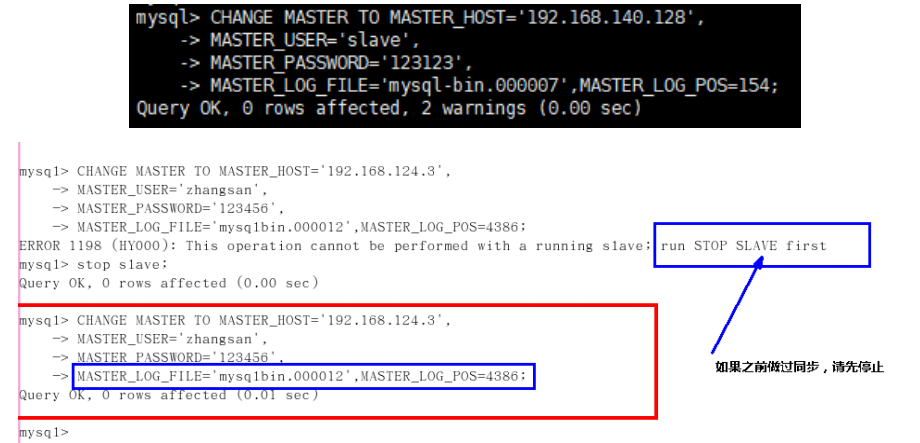

# 第18章 主从复制

# 1. 主从复制概述

## 1.1 如何提升数据库并发能力


一般应用对数据库而言都是“`读多写少`”，也就说对数据库读取数据的压力比较大，有一个思路就是采用数据库集群的方案，做`主从架构`、进行`读写分离`，这样同样可以提升数据库的并发处理能力。但并不是所有的应用都需要对数据库进行主从架构的设置，毕竟设置架构本身是有成本的。

如果我们的目的在于提升数据库高并发访问的效率，那么首先考虑的是如何`优化SQL和索引`，这种方式简单有效；其次才是采用`缓存的策略`，比如使用 `Redis` 将热点数据保存在内存数据库中，提升读取的效率；最后才是对数据库采用`主从架构`，进行读写分离。

## 1.2 主从复制的作用


  

# 2. 主从复制的原理

## 2.1 原理剖析

**三个线程**

实际上主从同步的原理就是基于 `binlog` 进行数据同步的。在主从复制过程中，会基于`3 个线程`来操作，一个主库线程，两个从库线程。


`二进制日志转储线程`（`Binlog dump thread`）是一个主库线程。当从库线程连接的时候， 主库可以将二进制日志发送给从库，当主库读取事件（Event）的时候，会在 `Binlog` 上`加锁`，读取完成之后，再将锁释放掉。

`从库 I/O 线程`会连接到主库，向主库发送请求更新`Binlog`。这时从库的 I/O 线程就可以读取到主库的二进制日志转储线程发送的 `Binlog` 更新部分，并且拷贝到本地的中继日志 （Relay log）。

`从库 SQL 线程`会读取从库中的中继日志，并且执行日志中的事件，将从库中的数据与主库保持同步。


**复制三步骤**

步骤1：`Master`将写操作记录到二进制日志（`binlog`）。

步骤2：`Slave`将`Master`的binary log events拷贝到它的中继日志（`relay log`）；

步骤3：`Slave`重做中继日志中的事件，将改变应用到自己的数据库中。 MySQL复制是异步的且串行化的，而且重启后从`接入点` 开始复制。

**复制的问题**

复制的最大问题：`延时`

## 2.2 复制的基本原则

- 每个`Slave`只有一个`Master`

- 每个`Slave`只能有一个唯一的服务器ID

- 每个`Master`可以有多个`Slave`


# 3. 同步数据一致性问题

**主从同步的要求：**

- 读库和写库的数据一致(最终一致)；

- 写数据必须写到写库；

- 读数据必须到读库(不一定)；


## 3.1 理解主从延迟问题

进行主从同步的内容是二进制日志，它是一个文件，在进行`网络传输`的过程中就一定会`存在主从延迟`（比如 500ms），这样就可能造成用户在从库上读取的数据不是最新的数据，也就是主从同步中的`数据不一致性`问题。


## 3.2 主从延迟问题原因

在网络正常的时候，日志从主库传给从库所需的时间是很短的，即T2-T1的值是非常小的。即，网络正常情况下，主备延迟的主要来源是备库接收完`binlog`和执行完这个事务之间的时间差。

**主备延迟最直接的表现是，从库消费中继日志（relay log）的速度，比主库生产`binlog`的速度要慢。**造成原因：

1、从库的机器性能比主库要差

2、从库的压力大

3、大事务的执行


## 3.3 如何减少主从延迟

若想要减少主从延迟的时间，可以采取下面的办法：

1. 降低多线程大事务并发的概率，优化业务逻辑

2. 优化SQL，避免慢SQL，`减少批量操作`，建议写脚本以update-sleep这样的形式完成。

3. `提高从库机器的配置`，减少主库写`binlog`和从库读`binlog`的效率差。

4. 尽量采用`短的链路`，也就是主库和从库服务器的距离尽量要短，提升端口带宽，减少`binlog`传输的网络延时。

5. 实时性要求的业务读强制走主库，从库只做灾备，备份。


## 3.4 如何解决一致性问题


**方法** **1：异步复制**

这个commit是redo log的commit标志，详细参考之前日志的`binlog`和`redolog`日志的部分


**方法** **2：半同步复制**


**方法** **3：组复制**


# 4. 一主一从架构配置


具体参数配置如下：

- 必选

```sh
#[必须]主服务器唯一ID
server-id=1
#[必须]启用二进制日志,指名路径【名字自定义】。比如：自己本地的路径/log/mysqlbin
log-bin=server-log-bin
```

- 可选

```sh
#[可选] 0（默认）表示读写（主机），1表示只读（从机）
read-only=0
#设置日志文件保留的时长，单位是秒
binlog_expire_logs_seconds=6000
#控制单个二进制日志大小。此参数的最大和默认值是1GB
max_binlog_size=200M
#[可选]设置不要复制的数据库
binlog-ignore-db=test
#[可选]设置需要复制的数据库,默认全部记录。比如：binlog-do-db=fanxy_master_slave
binlog-do-db=需要复制的主数据库名字
#[可选]设置binlog格式
binlog_format=mixed
```

> **注意:**
> **先搭建完主从复制，再创建数据库。**
> **MySQL主从复制起始时，从机不继承主机数据。**


- 必选

```sh
#[必须]从服务器唯一ID
server-id=2
```

- 可选

```sql
#[可选]启用中继日志
relay-log=mysql-relay
```

重启后台`mysql`服务，使配置生效。

> 注意：主从机都关闭防火墙
>
> `service iptables stop` #CentOS 6
>
> `systemctl stop firewalld.service` #CentOS 7

## 4.4 主机：建立账户并授权

```sql
#在主机MySQL里执行授权主从复制的命令
GRANT REPLICATION SLAVE ON *.* TO 'slave1'@'从机器数据库IP' IDENTIFIED BY 'abc123';
```

**注意：如果使用的是MySQL8，需要如下的方式建立账户，并授权slave：**

```sql
CREATE USER 'slave1'@'%' IDENTIFIED BY '123456';
GRANT REPLICATION SLAVE ON *.* TO 'slave1'@'%';
#此语句必须执行。否则见下面。
ALTER USER 'slave1'@'%' IDENTIFIED WITH mysql_native_password BY '123456';
flush privileges;
```


```sql
show master status;
```


## 4.5 从机：配置需要复制的主机

**步骤1：从机上复制主机的命令**

```sql
CHANGE MASTER TO
MASTER_HOST='主机的IP地址',
MASTER_USER='主机用户名',
MASTER_PASSWORD='主机用户名的密码',
MASTER_LOG_FILE='mysql-bin.具体数字',
MASTER_LOG_POS=具体值;
```

举例：

```sql
CHANGE MASTER TO MASTER_HOST='192.168.110.100',MASTER_USER='slave1',MASTER_PASSWORD='123456',MASTER_LOG_FILE='server-log-bin.000001',MASTER_LOG_POS=1136;
```




## 4.6 测试

主机新建库、新建表、insert记录，从机复制：

```sql
CREATE DATABASE fanxy_master_slave;
USE fanxy_master_slave;
CREATE TABLE mytbl(id INT,NAME VARCHAR(16));
INSERT INTO mytbl VALUES(1, 'zhang3');
INSERT INTO mytbl VALUES(2,@@hostname)
```

## 4.7 停止主从同步


##### 4.8 后续

**搭建主从复制：双主双从**


