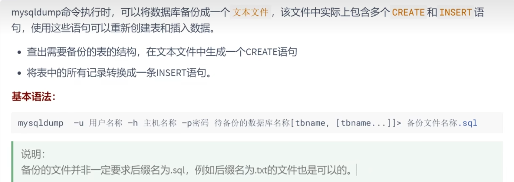
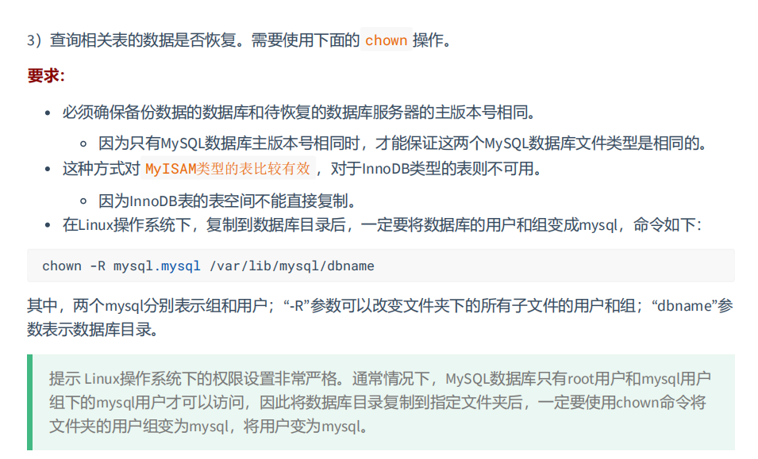
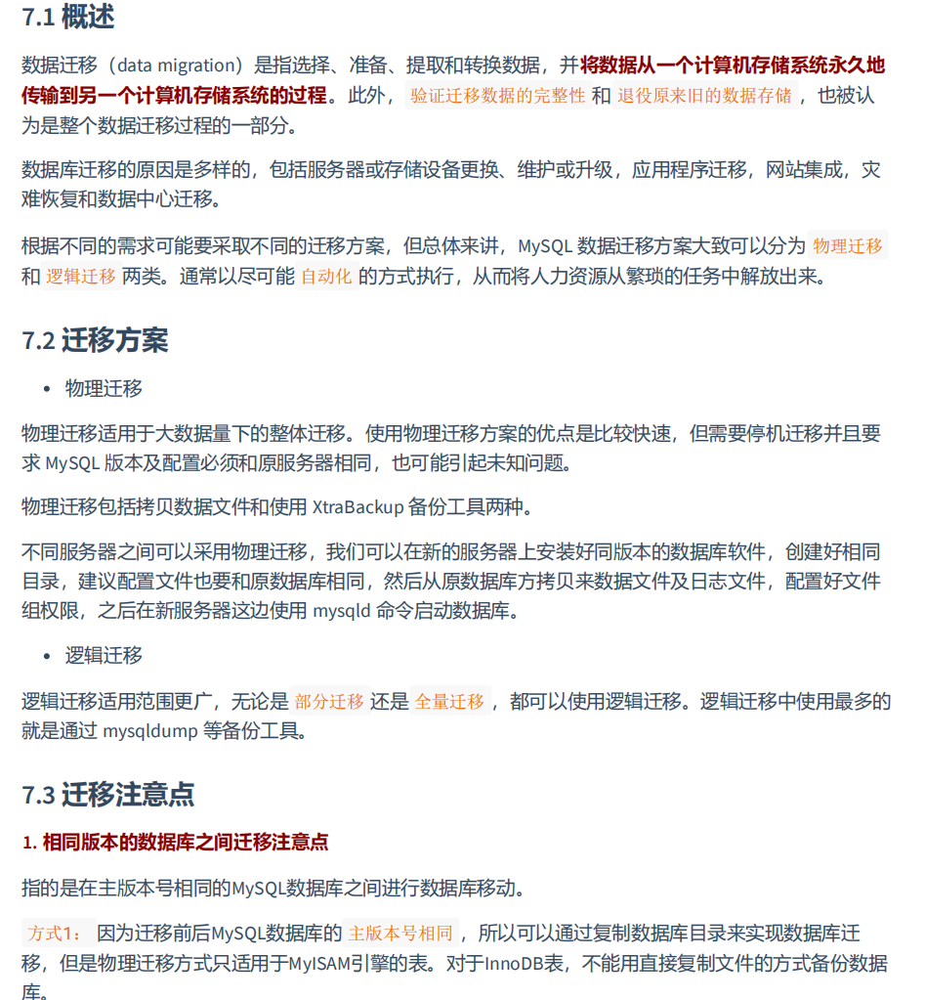
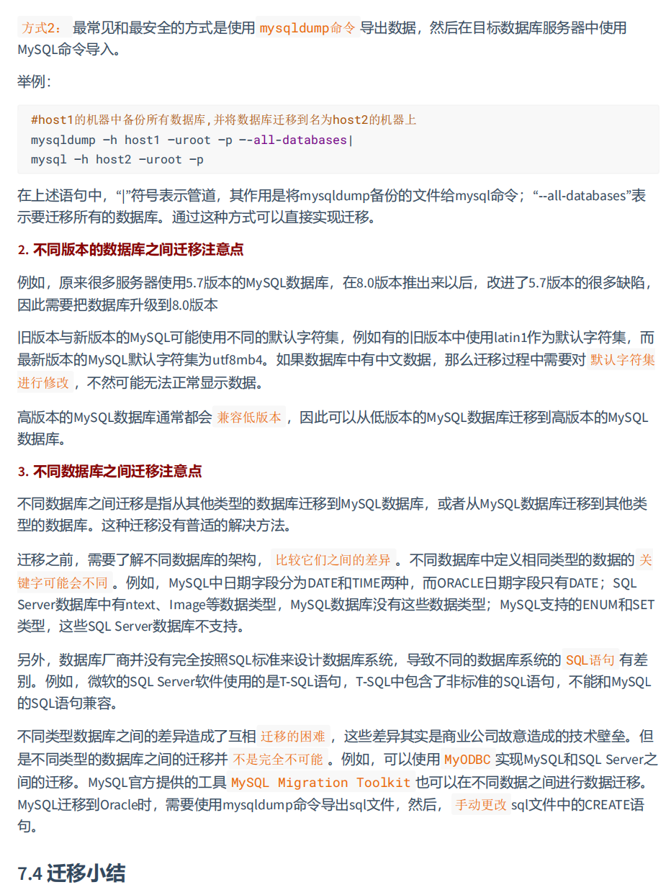
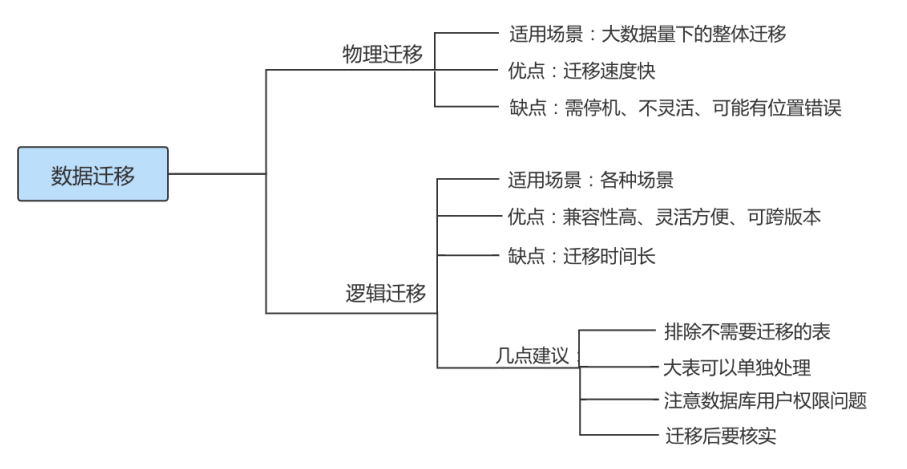
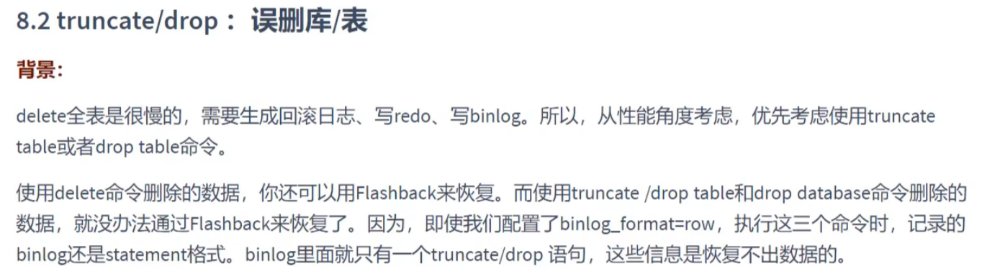
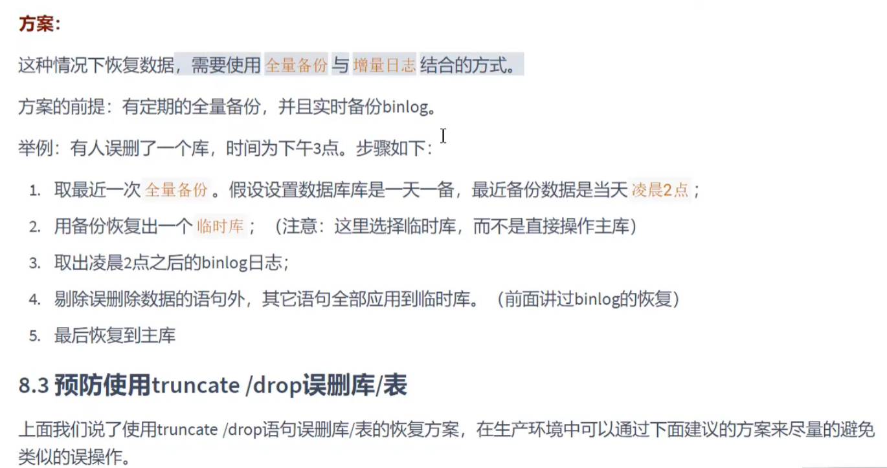
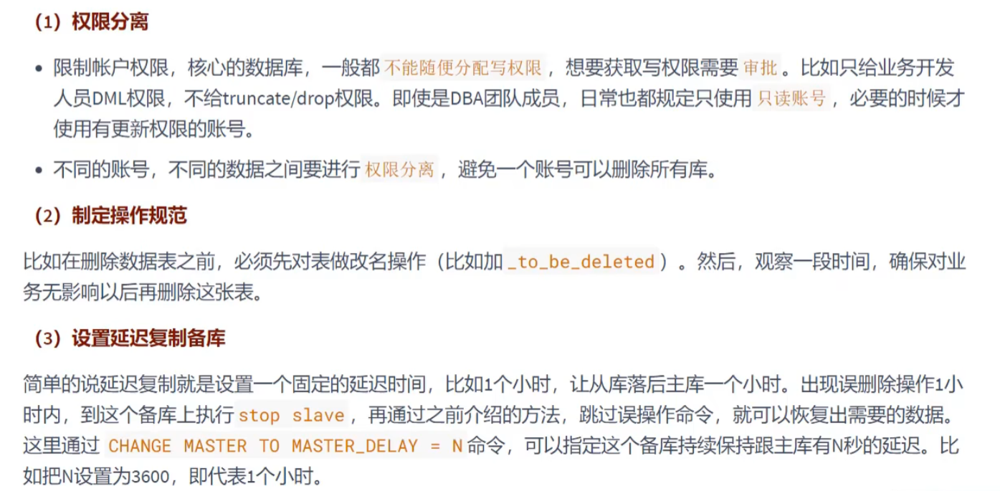
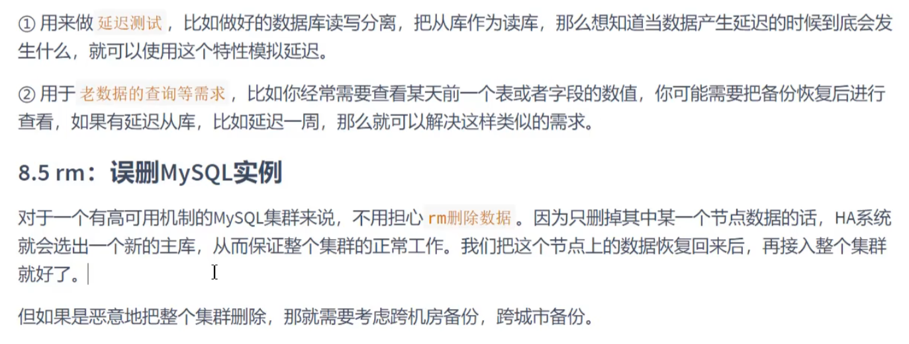

# 第19章 数据库备份与恢复


# 1. 物理备份与逻辑备份

**物理备份**：备份数据文件，转储数据库物理文件到某一目录。物理备份恢复速度比较快，但占用空间比较大，MySQL中可以用`xtrabackup`工具来进行物理备份。

**逻辑备份**：对数据库对象利用工具进行导出工作，汇总入备份文件内。逻辑备份恢复速度慢，但占用空间小，更灵活。MySQL 中常用的逻辑备份工具为`mysqldump`。逻辑备份就是`备份sql语句`，在恢复的时候执行备份的`sql`语句实现数据库数据的重现。


# 2. `mysqldump`实现逻辑备份



## 2.1 备份一个数据库

```shell
mysqldump –u 用户名称 –h 主机名称 –p密码 待备份的数据库名称[tbname, [tbname...]]> 备份文件名 称.sql
```

```shell
mysqldump -uroot -p fanxy>fanxy.sql #备份文件存储在当前目录下
mysqldump -uroot -p fanxydb1 > /var/lib/mysql/fanxy.sql
```


## 2.2 备份全部数据库

```shell
mysqldump -uroot -pxxxxxx --all-databases > all_database.sql 
mysqldump -uroot -pxxxxxx -A > all_database.sql
```


## 2.3 备份部分数据库

```shell
mysqldump –u user –h host –p --databases [数据库的名称1 [数据库的名称2...]] > 备份文件名 称.sql
```

```shell
mysqldump -uroot -p --databases fanxy fanxy12 >two_database.sql
mysqldump -uroot -p -B fanxy fanxy12 > two_database.sql
```


## 2.4 备份部分表

```shell
mysqldump –u user –h host –p 数据库的名称 [表名1 [表名2...]] > 备份文件名称.sql
```

```shell
mysqldump -uroot -p fanxy book> book.sql
#备份多张表 
mysqldump -uroot -p fanxy book account > 2_tables_bak.sql
```


## 2.5 备份单表的部分数据

```shell
mysqldump -uroot -p fanxy student --where="id < 10 " > student_part_id10_low_bak.sql
```


## 2.6 排除某些表的备份

```shell
mysqldump -uroot -p fanxy --ignore-table=fanxy.student > no_stu_bak.sql
```


## 2.7 只备份结构或只备份数据

- 只备份结构

```shell
mysqldump -uroot -p fanxy --no-data > fanxy_no_data_bak.sql
```

- 只备份数据

```shell
mysqldump -uroot -p fanxy --no-create-info > fanxy_no_create_info_bak.sql
```


## 2.8 备份中包含存储过程、函数、事件 

```shell
mysqldump -uroot -p -R -E --databases fanxy > fun_fanxy_bak.sql
```


# 3. mysql命令恢复数据

```shell
mysql –u root –p [dbname] < backup.sql
```

## 3.1 单库备份中恢复单库

```shell
#备份文件中包含了创建数据库的语句
mysql -uroot -p < fanxy.sql
#备份文件中不包含了创建数据库的语句
mysql -uroot -p fanxy4< fanxy.sql
```


## 3.2 全量备份恢复

```shell
mysql –u root –p < all.sql
```


## 3.3 从全量备份中恢复单库

```shell
sed -n '/^-- Current Database: `fanxy`/,/^-- Current Database: `/p' all_database.sql > fanxy.sql 
#分离完成后我们再导入fanxy.sql即可恢复单个库
```


## 3.4 从单库备份中恢复单表

```shell
cat fanxy.sql | sed -e '/./{H;$!d;}' -e 'x;/CREATE TABLE `class`/!d;q' > class_structure.sql 
cat fanxy.sql | grep --ignore-case 'insert into `class`' > class_data.sql 
#用shell语法分离出创建表的语句及插入数据的语句后 再依次导出即可完成恢复 

use fanxy; 
mysql> source class_structure.sql; 
Query OK, 0 rows affected, 1 warning (0.00 sec) 

mysql> source class_data.sql; 
Query OK, 1 row affected (0.01 sec)
```

# 4. 表的导出与导入

## 4.1 表的导出

**1.** **使用SELECT…INTO OUTFILE导出文本文件** 

```mysql
SHOW GLOBAL VARIABLES LIKE '%secure%';
SELECT * FROM account INTO OUTFILE "/var/lib/mysql-files/account.txt";
```

**2.** **使用mysqldump命令导出文本文件**

```shell
mysqldump -uroot -p -T "/var/lib/mysql-files/" fanxy account
# 或
mysqldump -uroot -p -T "/var/lib/mysql-files/" fanxy account --fields-terminated- by=',' --fields-optionally-enclosed-by='\"'
```

**3.** **使用mysql命令导出文本文件**

```shell
mysql -uroot -p --execute="SELECT * FROM account;" fanxy> "/var/lib/mysql-files/account.txt"
```


## 4.2 表的导入

**1.** **使用LOAD DATA INFILE方式导入文本文件**

```mysql
LOAD DATA INFILE '/var/lib/mysql-files/account_0.txt' INTO TABLE fanxy.account;
# 或
LOAD DATA INFILE '/var/lib/mysql-files/account_1.txt' INTO TABLE fanxy.account FIELDS TERMINATED BY ',' ENCLOSED BY '\"';
```

**2.** **使用mysqlimport方式导入文本文件**

```shell
mysqlimport -uroot -p fanxy '/var/lib/mysql-files/account.txt' --fields-terminated- by=',' --fields-optionally-enclosed-by='\"'
```


#  5. 物理恢复：直接复制到数据库目录




#  6. 数据库迁移







# 8. 删库了不敢跑，能干点啥？











