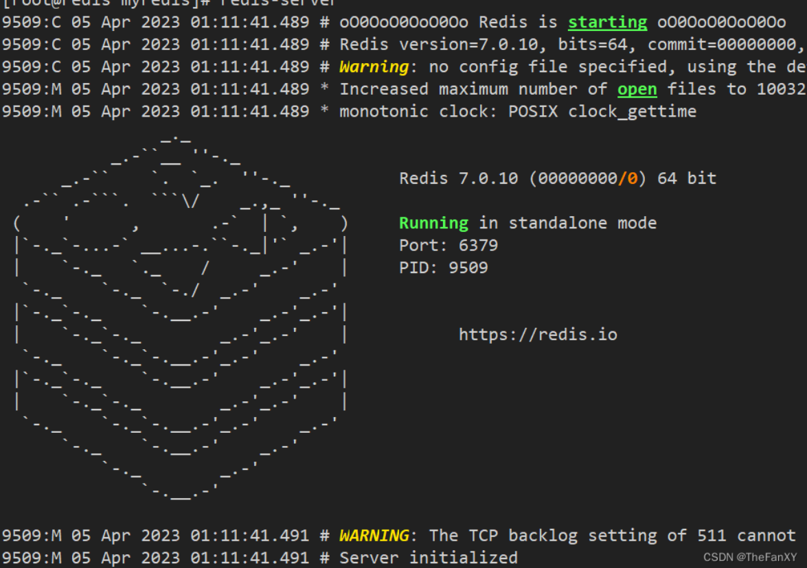
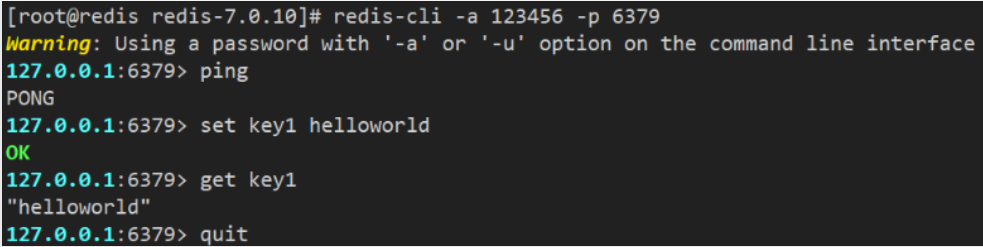

# 1. Redis入门概述

## 1. Redis是什么

Redis全称 远程字典服务器（**Remote Dictionary Server**），它是完全开源的，使用ANSIC语言编写遵守BSD协议，是一个高性能的基于内存的Key-Value数据库，提供了丰富的数据结构，例如String、Hash、List、Set、SortedSet等等。数据时存在内存中的，同时Redis支持事务、持久化、LUA脚本、发布/订阅、缓存淘汰、流技术等多种功能特性，提供了主从模式、Redis Sentinel和Redis Cluster集群架构方案。

## 2. Redis与MySQL的关系

Redis是key-value数据库(NoSQL一种)，mysql是关系数据库。
Redis数据操作主要在内存，而mysql主要存储在磁盘。
Redis在某一些场景使用中要明显优于mysql，比如计数器、排行榜等方面。
Redis通常用于一些特定场景，需要与Mysql一起配合使用。
两者并不是相互替换和竞争关系，而是共用和配合使用。

按照二八原则，主流的应用对系统的请求80%都是查询，20%是增删改。客户端查询数据先查询Redis数据库，如果命中了则将查询结果返回，如果没有命中再去MySQL数据库查询，然后将数据返回并且将数据写入Redis数据库，下次再查询该数据时就可以从Redis数据库中获取。如图2-1所示。


## 3. Redis能干什么

- 缓存

  > Redis常用于作为高速缓存，将常用的数据存储在内存中，提高访问速度和响应时间，减轻后端数据库的压力。Redis支持多种数据结构，可以根据数据的类型和特点选择合适的数据结构进行缓存。

- RDB和AOF持久化

  > redis支持异步将内存中的数据写到硬盘上，同时不影响继续服务。
  >
  > 即使设备断电了，数据也不会丢失，重启后重新从硬盘恢复数据。

- 高可用架构搭配：单机、主从、哨兵、集群

  > 支持大规模数据存储和高并发访问。

- 解决缓存穿透、击穿、雪崩

  > 1. 对查询不存在的数据的请求进行过滤，比如采用 Bloom Filter 进行缓存预热或者对查询请求进行缓存穿透保护。
  > 2. 对于热点数据的访问，可以采用分布式锁等方法对缓存进行保护，避免缓存击穿。
  > 3. 对于缓存雪崩，可以采用缓存预热、缓存过期时间随机化、缓存数据的多级缓存等方法进行缓解。

- 分布式锁

  > Redis支持原子操作和过期时间等特性，可以用于实现分布式锁。
  >
  > 可以保证在分布式系统中同一时刻只有一个客户端可以持有锁，从而保证共享资源的互斥访问。
  >
  > 例如，可以使用Redis的SETNX命令实现基于key的锁，使用Lua脚本实现基于value的锁。

- 消息队列

  > redis提供了多种队列模式：List队列、Pub/Sub队列、Stream队列

- 计数器和排行榜

  > Redis支持原子操作，可以用于实现计数器和排行榜功能。
  >
  > 例如，可以使用Redis的INCR命令实现计数器功能，使用ZADD命令实现有序集合排行榜功能。


除了以上几个方面，Redis还可以用于实现限流、地理位置服务、实时统计等应用场景。总之，Redis是一个功能丰富、性能优秀的内存数据库，适合于需要高性能、高可用、高并发的应用场景。


## 4. Redis优势

- 性能极高 -Redis能读的速度是110000次/秒，写的速度是81000次/秒
- Redis数据类型丰富，不仅仅支持简单的key-value类型的数据，同时还提供list，zset，set，hash等数据结构的存储
- Redis支持数据的持久化，可以将内存中的数据保存在磁盘中，重启的时候可以再次加载进行使用
- Redis支持数据的备份，即master-slave模式的数据备份


# 2. Redis的安装和配置

Redis官网下载地址：https://redis.io/download/
Redis官方中文文档：https://www.redis.com.cn/documentation.html
Redis命令使用手册官方版：https://redis.io/commands/
Redis命令使用手册中文版：http://www.redis.cn/commands.html
Redis命令参考手册：http://doc.redisfans.com/

Redis版本第二位数字如果是偶数，就是稳定版，如果是奇数，就是激进版

github官网 ： https://github.com/redis/redis/releases

### **(1) 检测Linux安装环境**

	Linux环境安装Redis必须先具备gcc编译环境，gcc是linux下的一个编译程序，是C程序的编译工具。

```shell
gcc -v	# 查看是否安装了gcc
yum -y install gcc-c++	# 若是没有安装可以使用此命令安装
```

### **(2) 下载redis**

	下载redis-7.0.10.tar.gz，下载后使用工具将它传到Linux系统的/opt目录下，然后解压。对于第三方软件，一般都安装在/opt目录下。

```shell
tar -zxvf redis-7.0.10.tar.gz	# 解压到当前目录
```

### **(3) 安装redis**

	这里是redis的安装目录，进入解压目录执行make命令先编译后安装

```sh
cd redis-7.0.10	# 切换到解压目录
make	# 编译
make install	# 安装
```

### **(4) 查看redis服务安装目录**

	这里是redis服务的安装目录，redis服务默认安装目录在/usr/local/bin
	
	装在这个目录下的文件，相当于配置了PATH变量，在任何目录都可以启动redis服务。
	
	Linux下的/usr/local类似windows系统的C:\Program Files。


	redis-benchmark：性能测试工具
	redis-check-aof：修复有问题的aof文件
	redis-check-dump：修复有问题的rdb文件
	redis-cli：redis提供的命令行客户端
	redis-sentinel：redis的哨兵启动脚本
	redis-server：redis的服务端启动脚本

### **(5) 修改配置文件**

	回到解压目录，对redis.conf文件进行修改


	修改配置文件前，先对文件进行备份

```sh
mkdir /myredis	#创建目录
cp redis.conf /myredis/redis7.conf	# 将配置文件复制到myredis目录并命名为redis7.conf
```

	修改redis.conf配置文件，改完后确保生效，记得重启，记得重启

1.  默认daemonize no 改为 **`daemonize yes`**，表示开启后台启动
2.  默认protected-mode yes 改为 **`protected-mode no`**，需要别人来连接redis服务器的话需要改成no
3.  默认bind 127.0.0.1 **直接注释掉**(默认bind 127.0.0.1只能本机访问)或改成主机IP地址，否则影响远程IP连接
4.  添加redis密码，配置 **`requirepass 123456`** 即可（123456为设置的密码）

### **(6) 启动redis服务**

	启动配置文件，`redis-server`直接启动是前台启动，后面加上配置文件启动是后台启动。
	
	任意目录输入redis-server都可以直接启动redis服务。




不过这样启动redis需要一直处在这个界面，也就是前台启动，不能进行其他操作，我们希望它在后台运行，后台启动需要指定配置文件

```shell
redis-server /opt/redis-7.0.10/redis.conf	# 指定配置启动：后台启动redis服务
ps -ef | grep redis		# 通过则个指令可以查看正在运行的redis服务
```
### **(7) 连接redis服务**

	通过redis的`redis-cli`可执行程序来连接redis服务

```sh
redis-cli -a 123456 -p 6379	# -a表示输入密码，-p表示端口号，本机访问可以省略不写，默认是6379
ping	# 输入ping后回车输出pong说明连接成功
set key1 helloworld		# 设置键key1的值为helloworld
get key1		# 获取key1的值
quit	# 输入quit回车退出前台客户端，服务并没有退出
```
也可以不输入 -a 然后输入密码，可以直接进去 输入 auth 【密码】进行登录验证



	也可以直接执行`redis-cli`，然后在redis客户端命令行输入`auth 密码`


### **(8) 停止redis服务**

	利用`redis-cli`来执行 shutdown 命令停止 Redis 服务，因为之前配置了密码，因此需要通过 -u 来指定密码

```sh
# 单实例关闭
redis-cli -a 123456 shutdown 	
#多实例关闭，指定端口关闭
redis-cli -a 123456 -p 6379 shutdown
# 也可以使用   kill -9 进程号  终止对应的进程
```

	如果是在redis的客户端窗口，可以直接使用shutdown命令关闭redis服务


	可以看到，执行shutdown命令后就显示notconnected，然后使用quit命令退出redis客户端即可。

### **(9) redis卸载**

```bash
ls -l /usr/local/bin/redis-*
rm -rf /usr/local/bin/redis-*
```