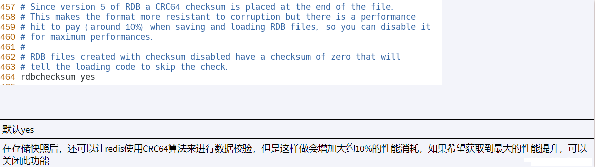
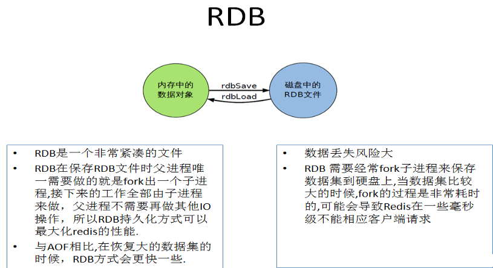
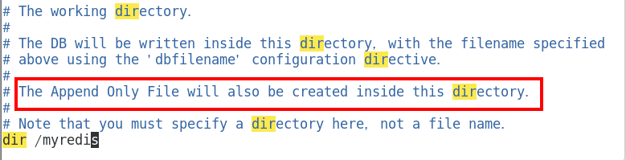
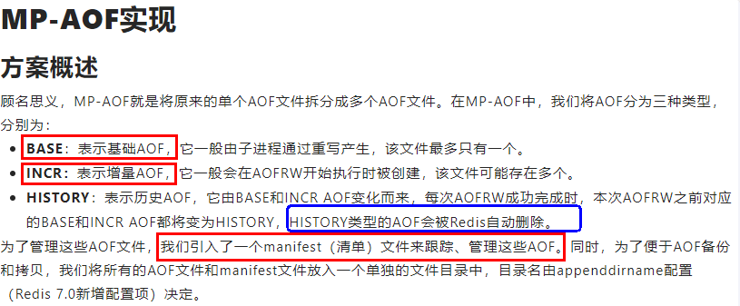

# Redis7【③ 持久化 Persistent】

Redis持久化(Redis persistence)是指将数据写入持久存储，如固态硬盘(SSD)。

Redis提供了一系列持久性选项。这些包括:

- **RDB**（redis 数据库）：RDB持久化方式能够在指定的时间间隔对数据进行快照存储。
- **AOF**（追加文件）：AOF持久化方式记录每次对服务器写的操作，当服务器重启的时候会重新执行这些命令来恢复原始的数据，AOF命令以redis协议追加保存每次写的操作到文件末尾。Redis还能对AOF文件进行后台重写，使得AOF文件的体积不至于过大。
- **No persistence**（没有持久化）：可以完全禁用持久性，这有时在缓存时使用。
- **RDB+AOF**：可以同时开启两种持久化方式，在这种情况下，当redis重启的时候会优先载入AOF文件来恢复原始的数据，因为在通常情况下AOF文件保存的数据集要比RDB文件保存的数据集要完整。

------


# 1. RDB

> Redis Database缩写。在指定的时间间隔，对数据进行快照存储。RDB保存到磁盘的文件叫dump.rdb。


## 1.1 快照

在默认情况下， Redis 将数据库快照保存在名字为 dump.rdb的二进制文件中。可以对 Redis 进行设置， 让它在“ N 秒内数据集至少有 M 个改动”这一条件被满足时， 自动保存一次数据集。也可以通过调用 SAVE或者 BGSAVE ， 手动让 Redis 进行数据集保存操作。

比如说， 以下设置会让 Redis 在满足“ 60 秒内有至少有 1000 个键被改动”这一条件时， 自动保存一次数据集: save 60 1000

redis6 低版本采取的快照时间，默认采取 更低的频率。


redis 6.2 -》 7


## 1.2 RDB优缺点

- **RDB的优点**

  - RDB是一个非常紧凑的文件，它保存了某个时间点得数据集，非常适用于数据集的备份，比如可以在每个小时保存一下过去24小时内的数据，同时每天保存过去30天的数据,这样即使出了问题也可以根据需求恢复到不同版本的数据集。

  - RDB是一个紧凑的单一文件，很方便传送到另一个远端数据中心，非常适用于灾难恢复。

  - RDB在保存RDB文件时父进程唯一需要做的就是fork出一个子进程，接下来的工作全部由子进程来做，父进程不需要再做其他IO操作，所以RDB持久化方式可以最大化redis的性能。

  - 与AOF相比，在恢复大的数据集的时候，RDB方式会更快一些。
- **RDB缺点**

  - 如果希望在redis意外停止工作（例如电源中断）的情况下丢失的数据最少的话，那么RDB不适合，虽然可以配置不同的save时间点(例如每隔5分钟并且对数据集有100个写的操作)，但是Redis要完整的保存整个数据集是一个比较繁重的工作，通常会每隔5分钟或者更久做一次完整的保存，万一在Redis意外宕机，可能会丢失几分钟的数据。
  - RDB 需要经常fork子进程来保存数据集到硬盘上，当数据集比较大的时候，fork的过程是非常耗时的，可能会导致Redis在一些毫秒级内不能响应客户端的请求。如果数据集巨大并且CPU性能不是很好的情况下，这种情况可能会持续1秒，AOF也需要fork，但是可以调节重写日志文件的频率来提高数据集的耐久度。


## 1.3 RDB配置

- 配置dump.rdb文件保存路径

  > 下面是设置到了redis安装目录，当然也可以设置到其他目录下。默认是`./`

  

**这里我们遵循最新视频，在我们之前放redis7配置文件的地方新建一个文件夹，dumpfiles**
**保存于   `/myredis/dumpfiles`**  


- 修改快照文件名

  > 快照文件名默认为dump.rdb，可以对其进行修改
  > **这里我们遵循最新视频，后期可能会部署集群，建议还是在名称中添加当前的端口号**
  > **设置名称为   `dump6379.rdb`**  
  > 

**这里补充一下，redis支持在连接中通过config get 或 set 进行配置文件的更改**


## 1.4 触发RDB快照和恢复

### 1.4.1 自动触发

- **设置redis.config文件中的自动触发时间：`save <seocnds> <changes>`**

  - **这里我测试发现，同一个key，进行不同值的更改，也会触发快照**
  - **修改为7秒内3次修改：save 7 3，每7秒检查key操作数够不够3次。这个和我们下意识理解的7秒内3次才拍不同，是指的是三次操作就会保存，但7秒内只会记录一次。**

    


  - 添加数据触发快照

    


- FLUSHDB和FLUSHALL命令

  > **执行flushdb或者flushall命令也会触发RDB快照**，**不过里面是空的，以便下次启动redis服务是读取到的就是空文件。**

- SHUTDOWN命令

  > **执行shutdown命令之前会将当前的数据进行一次快照保存。**

  ！结论 ： 不可以把备份文件dump.rdb 和生产redis服务器放在同一台机器，必须分开各自存储，以防止生产机物理损坏后备份文件也挂了。

### 1.4.2 手动触发
Redis提供了两个命令来生成RDB文件，分别是save和bgsave

- SAVE命令

  > SAVE命令在主程序中执行会阻塞当前进程，直到持久化工作完成，redis才能处理其他命令。工作中禁止使用该命令。

  ```bash
  127.0.0.1:6379> set name Alice
  OK
  127.0.0.1:6379> set age 18
  OK
  127.0.0.1:6379> save		# 立马将数据保存到快照中，如果数据量大会造成阻塞
  OK
  ```

  


- BGSAVE命令

  > BGSAVE命令会fork一个子进程在后台异步进行持久化工作，持久化期间redis可以执行其他命令。

在Linux程序中，fork()会产生一个和父进程完全相同的子进程，但子进程在此后多会exec系统调用，出于效率考虑，尽量避免膨胀。

  ```bash
  127.0.0.1:6379> set name Cindy
  OK
  127.0.0.1:6379> set age 20
  OK
  127.0.0.1:6379> BGSAVE
  Background saving started		# 在后台执行持久化
  ```

  


**LASTSAVE**命令可以获取最后一次成功执行快照的时间。得到的是一个时间戳，可以通过`date -d @时间戳`命令获取对应的时间。

```bash
127.0.0.1:6379> LASTSAVE
(integer) 1681223083
127.0.0.1:6379> quit
[root@redis ~]# date -d @1681223083
2023年 04月 11日 星期二 22:24:43 CST
```


### 1.4.3 修复快照数据

> 有些情况下快照保存的数据不完整导致无法读取快照数据，可以使用`redis-check-rdb`命令对rdb文件进行修复。

```bash
[root@redis redis-7.0.10]# redis-check-rdb dump.rdb 
[offset 0] Checking RDB file dump.rdb
[offset 27] AUX FIELD redis-ver = '7.0.10'
[offset 41] AUX FIELD redis-bits = '64'
[offset 53] AUX FIELD ctime = '1681233313'
[offset 68] AUX FIELD used-mem = '1104992'
[offset 80] AUX FIELD aof-base = '0'
[offset 82] Selecting DB ID 0
[offset 155] Checksum OK
[offset 155] \o/ RDB looks OK! \o/
[info] 8 keys read
[info] 0 expires
[info] 0 already expired
```


### 1.4.4 恢复快照数据

> redis在启动服务时会读取配置的快照保存路径中的dump.rdb文件，所以只需要将备份的rdb文件放到配置的保存路径中，然后启动redis服务即可还原快照中的数据。


## 1.5 禁用RDB快照

`redis-cli config set save ""`：将save的值设置为空，即禁用了快照功能。

> 在redis客户端则直接执行config set save ""即可。

最好采用如下的配置禁用


## 1.6 什么情况会触发RDB快照


## 1.7 RDB优化配置项参数
前三个已经知道了，后面的也是仅做了解，一般都是默认。


### 1.7.1 stop-writes-on-bgsave-error
停止写bgSave-错误


### 1.7.2 rdbcompression
Rdb压缩


### 1.7.3 rdbchecksum

### 1.7.4 rdb-del-sync-files


## 1.8 小总结



------


# 2. AOF

> Append Only File缩写。记录每次对服务器的写操作，当服务器重启的时候会重新执行这些命令来恢复原始的数据。


## 2.1 AOF优缺点

- **AOF优点：**

  - 使用AOF 会让Redis更加耐久：可以使用不同的写回(fsync)策略：no、everysec、always。使用默认的everysec策略，Redis的性能依然很好(fsync是由后台线程进行处理的，主线程会尽力处理客户端请求)，一旦出现故障，最多丢失1秒的数据。
  - AOF文件是一个只进行追加的日志文件，即使由于某些原因(磁盘空间已满，写的过程中宕机等等)未执行完整的写入命令，也也可使用redis-check-aof工具修复这些问题。
  - Redis 可以在 AOF 文件体积变得过大时，自动地在后台对 AOF 进行重写： 重写后的新 AOF 文件包含了恢复当前数据集所需的最小命令集合。 整个重写操作是绝对安全的，因为 Redis 在创建新 AOF 文件的过程中，会继续将命令追加到现有的 AOF 文件里面，即使重写过程中发生停机，现有的 AOF 文件也不会丢失。 而一旦新 AOF 文件创建完毕，Redis 就会从旧 AOF 文件切换到新 AOF 文件，并开始对新 AOF 文件进行追加操作。
  - AOF 文件有序地保存了对数据库执行的所有写入操作， 这些写入操作以 Redis 协议的格式保存， 因此 AOF 文件的内容非常容易被人读懂， 如果不小心执行了 FLUSHALL 命令， 但只要 AOF 文件未被重写， 那么只要停止服务器， 移除 AOF 文件末尾的 FLUSHALL 命令， 并重启 Redis ， 就可以将数据集恢复到 FLUSHALL 执行之前的状态。

- **AOF缺点：**

  - 对于相同的数据集来说，AOF 文件的体积通常要大于 RDB 文件的体积。
  - 根据所使用的 fsync 策略，AOF 的速度可能会慢于 RDB 。 在一般情况下， 每秒 fsync 的性能依然非常高， 而关闭 fsync 可以让 AOF 的速度和 RDB 一样快， 即使在高负荷之下也是如此。 不过在处理巨大的写入时，RDB 可以提供更有保证的最大延迟时间。

  


## 2.2 AOF配置

### 2.2.1 配置开启 保存机制更改

- 开启AOF

  > AOF默认是关闭的，需要将配置文件中 appendonly 设置为yes。而保存机制我们就不改了，使用everysec 


### 2.2.2 配置aof文件保存路径 (`redis6 和 redis7 不同`)

1. redis6

  AOF保存文件的位置和RDB保存文件的位置一样,都是通过redis.conf配置文件的dir配置
  

**2. redis7**


### 2.2.3 修改aof文件名和目录名(`redis6 和 redis7 不同`)
1. redis6 : 有且只有一个
    
2. redis7 变成三个

**Multi Part AOF 的设计**




> aof文件的保存路径和rdb的保存路径是同一个，只不过AOF会在该路径下创建一个appendonlydir文件夹，然后将aof文件保存在该文件夹下。Redis7的aof文件分为三个文件：
> `appendonly.aof.1.base.rdb` 基本文件：存储aof重写后的数据
> `appendonly.aof.1.incre.aof` 追加文件：存储aof追加的数据，达到一定大小后触发AOF重写。
> `appendonly.aof.manifest` 清单文件：追踪管理aof。

  


  > 生成的aof目录名默认为appendonlydir，文件名默认为appendonly.aof，可以在配置文件中修改。

  


## 2.3 三种写回策略

**AOF有三种写回策略：**

- **Always**：同步写回，每个写命令执行完立刻同步地将日志写入磁盘。
- **Everysec**：每秒写回，每个写命令执行完，先把日志写到AOF文件的内存缓冲区，每隔一秒把缓冲区的内容写入磁盘。
- **No**：操作系统控制的写回，每个写命令执行完，先把日志写到AOF的内存缓冲区，由操作系统决定何时将缓冲区内容写入磁盘。

|  配置项  |      写回时机      |           优点           |                 缺点                 |
| :------: | :----------------: | :----------------------: | :----------------------------------: |
|  Always  |      同步写回      | 可靠性高，数据基本不丢失 | 每个写命令都要同步记录，性能影响较大 |
| Everysec |      每秒写回      |         性能适中         |        宕机时丢失一秒内的数据        |
|    No    | 操作系统控制的写回 |          性能好          |          宕机时丢失数据较多          |


## 2.4 AOF的恢复和修复

- AOF文件数据恢复

  > 在同时开启RDB和AOF持久化时，重启redis服务只会加载aof文件，不会加载rdb文件，即使启动时没有appendonlydir目录，也会创建一个新的appendonlydir目录。

  


- AOF文件数据修复

  > 在开启了AOF后，当AOF文件出现异常时，redis服务无法正常启动。可以使用`redis-check-aof --fix 文件名`命令修复文件。

  


- AOF紧急恢复

  > 如果误执行了FLUSHALL操作，先停止服务器， 移除 AOF 文件末尾的 FLUSHALL 命令， 并重启 Redis ， 就可以将数据集恢复到 FLUSHALL 执行之前的状态。因为FLUSHALL或者FLUSHDB也是写命令，会被追加到aof文件中。
  
  


## 2.5 触发AOF日志重写

因为 AOF 的运作方式是不断地将命令追加到文件的末尾， 所以随着写入命令的不断增加， AOF 文件的体积也会变得越来越大。

举个例子， 如果对一个计数器调用了 100 次 INCR ， 那么仅仅是为了保存这个计数器的当前值， AOF 文件就需要记录100 条记录。然而在实际上， 只使用一条 SET 命令已经足以保存计数器的当前值了， 其余 99 条记录实际上都是多余的。

为了处理这种情况， Redis 可以在不打断服务客户端的情况下， 对 AOF 文件进行重建，即自动执行 BGREWRITEAOF 命令， Redis 将生成一个新的 AOF 文件， 这个文件包含重建当前数据集所需的最少命令。Redis 2.2 需要自己手动执行 `BGREWRITEAOF` 命令； Redis 2.4后则可以自动触发 AOF 重写。

### 2.5.1 自动触发

> 自动触发需要满足配置文件中的设置，官方默认设置是：
> `auto-aof-rewrite-percentage 100`：根据上次重写后的aof大小，判断当前aof大小是不是增长了1倍。100%表示一倍。
> `auto-aof-rewrite-min-size 64mb`：重写时满足的文件大小，即incr.aof文件超过了64兆才会重写。
>
> 注意同时满足这两个条件才会触发。

下面将auto-aof-rewrite-min-size改为1kb，测试AOF日志重写


rdb文件的内容是无法查看的，所以还是无法确定重写后的数据是否保存到了base.rdb文件中，可以先将`aof-use-rdb-preamble`设置为no，表示禁用aof+rdb混合模式，删除appendonlydir目录然后重启redis服务，这样就不会生成base.rdb文件，而是生成base.aof文件，重复上面的写操作，最后查看aof文件内容。


可以看到，重写的数据确实写入了base文件，并且base.rdb文件大小比base.aof文件大小小得多，所以通常建议开启aof+rdb混合模式。

### 2.5.2 手动触发

> 执行命令`BGREWRITEAOF`即可执行AOF重写。


## 2.6 AOF工作流程


①Client作为命令的来源，会有多个源头以及源源不断的请求命令。

②在这些命令到达 Redis Server 以后并不是直接写入AOF文件，会将其这些命令先放入AOF缓存中进行保存。这里的AOF缓冲区实际上是内存中的一片区域，存在的目的是当这些命令达到一定量以后再写入磁盘，避免频繁的磁盘IO操作。

③AOF缓冲会根据AOF缓冲区同步文件的三种写回策略将命令写入磁盘上的AOF文件。

④随着写入AOF内容的增加为避免文件膨胀，会根据规则进行命令的合并(又称AOF重写)，从而起到AOF文件压缩的目的。

⑤当 Redis Server 服务器重启的时候会从AOF文件载入数据。


## 2.7 AOF重写原理

1. 在重写开始前，redis会fork一个“重写子进程”，这个子进程会读取现有的AOF文件，并将其包含的指令进行分析压缩并写入到一个临时文件中。
2. 与此同时，主进程会将新接收到的写指令一边累积到内存缓冲区中，一边继续写入到原有的AOF文件中，这样做是保证原有的AOF文件的可用性，避免在重写过程中出现意外。
3. 当“重写子进程”完成重写工作后，它会给父进程发一个信号，父进程收到信号后就会将内存中缓存的写指令追加到新AOF文件中。
4. 当追加结束后，redis就会用新AOF文件来代替旧AOF文件，之后再有新的写指令，就都会追加到新的AOF文件中。
5. 重写aof文件的操作，并没有读取旧的aof文件，而是将整个内存中的数据库内容用命令的方式重写了一个新的aof文件，这点和快照有点类似。


# 3. AOF+RDB混合模式


在这种情况下, **当redis重启的时候会优先载入AOF文件来恢复原始的数据**

因为在通常情况下AOF文件保存的数据集要比RDB文件保存的数据集要完整

RDB的数据不实时，同时使用两者时服务器重启也只会找AOF文件。那要不要只使用AOF呢?

**作者建议不要** ，因为RDB更适合用于备份数据库(AOF在不断变化不好备份)，留着rdb作为一个万一的手段。


首先开启AOF：`appendonly yes`，默认是关闭的。

开启AOF+RDB混合模式：`aof-use-rdb-preamble yes`，默认是开启的。

同时开启AOF和RDB持久化，**当Redis重启时会优先加载AOF文件来恢复原始的数据，因为在通常情况下，AOF保存的数据集要比RDB文件保存的数据集要完整。**

在持久化时，先使用RDB进行快照存储，然后使用AOF持久化记录所有写的操作，当重写策略满足或者手动触发重写的时候，将最新的数据存储为新的RDB记录。这样的话，重启服务的时候会从RDB和AOF两部分恢复数据，既保证了数据的完整性，又提高了恢复数据的性能


# 4. 纯缓存模式

纯缓存模式即同时关闭AOF和RDB，这样可以最大化redis的读写性能，但无法保证数据的安全性。

关闭RDB：修改配置文件`save ""`

> 禁用RDB持久化模式，仍然可以使用命令save、bgsave生成rdb文件。

关闭AOF：修改配置文件`appendonly no`

> 禁用AOF持久化模式，仍然可以使用命令bgrewriteaof生成aof文件。