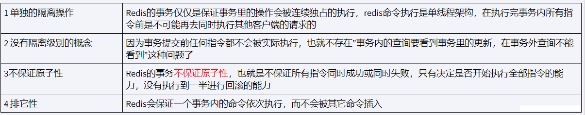
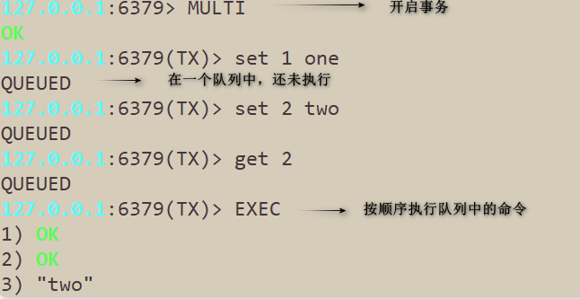
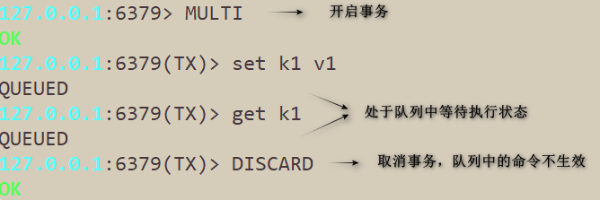
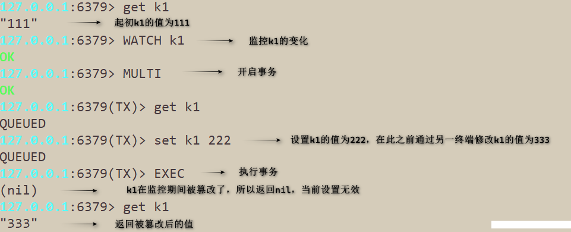
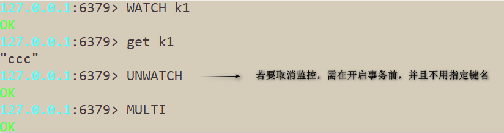
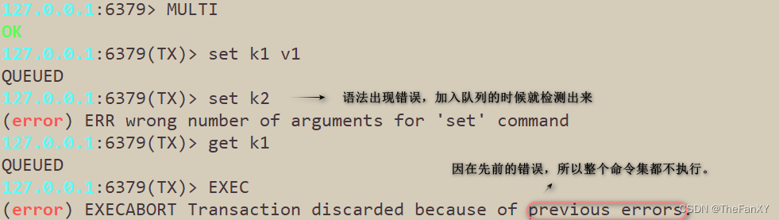
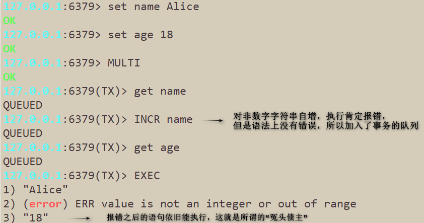
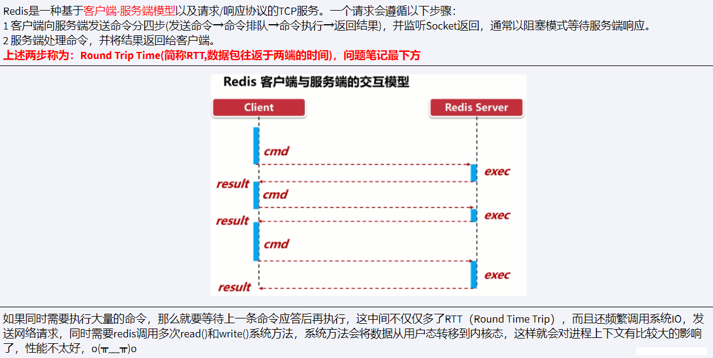
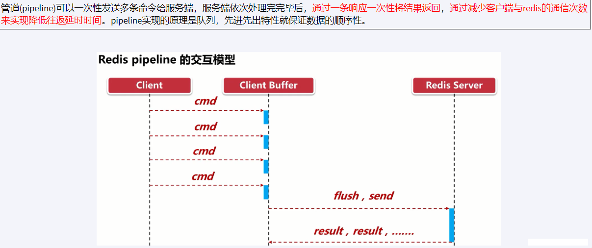
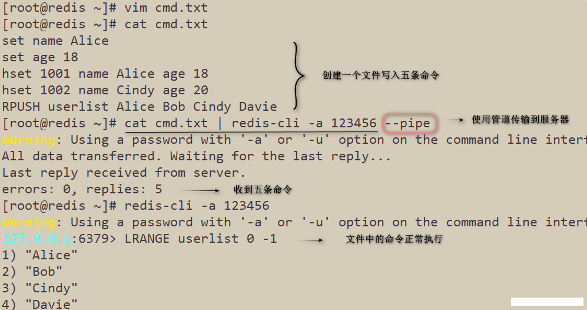

# 1. Redis7【④ 事务 管道】

Redis 事务（Transaction）是一组 Redis 命令的集合，这些命令被当作一个整体，按顺序地串行化执行，而不会被其他命令插入。

Redis 事务使用 MULTI、EXEC、WATCH、DISCARD 和 UNWATCH 这些命令来实现。

------

## 1.1. Redis事务特性
Redis事务  VS  数据库事务

- 单独的隔离操作：事务中的所有命令都会序列化、按顺序地执行。事务在执行的过程中，不会被其他客户端发送来的命令请求所打断。
- 不保证原子性：Redis的事务不保证原子性，也就是不保证所有指令同时成功或同时失败，只有决定是否开始执行全部指令的能力，没有执行到一半进行回滚的能力。
- 排他性：Redis会保证一个事务内的命令依次执行，不会被其他命令插入。

## 1.2. Redis事务命令

> `MULTI`：开启事务
>
> `EXEC`：执行事务
>
> `DISCARD`：取消事务
>
> `WATCH key [key ...]`：监控指定的key
>
> `UNWATCH `：取消监控。

### 1. MULTI

> 标记一个事务块的开始。执行的命令都会放到一个队列中，通过EXEC命令统一执行。

### 2. EXEC

> 执行事务队列中的命令。

### 3. DISCARD

> 放弃事务。在开启了事务后，若不想执行命令了，可以通过DISCARD命令来取消事务。

### 4. WATCH

> 监控指定的key的变化，要先开启监控，再开启事务。若监控的数据被篡改了，则事务中无法再对其修改，会返回nil。
>
> 执行完EXEC命令后，之前加的监控都会失效。
>
> redis使用watch来提供乐观锁，类似于CAS(Check and Set)。
>
> 乐观锁(Optimistic Lock)， 顾名思义就是很乐观，每次去拿数据的时候都认为别人不会修改，所以不会上锁，但是在更新的时候会判断一下在此期间别人有没有去更新这个数据。如果有则取消当前操作让他人操作生效。乐观锁策略：提交版本要比当前记录版本高。
>
> 悲观锁(Pessimistic Lock), 顾名思义，就是很悲观，每次去拿数据的时候都认为别人会修改，所以每次在拿数据的时候都会上锁，这样别人想拿这个数据就会block直到它拿到锁。
> 一旦执行了exec之前加的监控锁都会被取消掉了，当客户端连接丢失的时候（比如退出连接），所有东西都会被取消监视

### 5. UNWATCH

> 取消监控。在对某个key监控后，已经发现了它被篡改过了，可以使用unwatch命令取消对该key的监控。

## 1.3. 不保证原子性

### 1. ”全体连坐“

> 要么都执行，要么都不执行。

### 2. “冤头债主”

> 错误的命令报错归报错，正确的命令依旧执行，即使在错误命令之后也会执行。

## 1.4. 事务执行流程

> （1）开启：以MULTI命令开启一个事务
>
> （2）入队：将多个命令假如到事务队列中，接到这些命令并不会立即执行。
>
> （3）执行：由EXEC命令执行事务队列中的命令。

# 2. Redis管道

Redis 管道（Pipeline）是一种在客户端和 Redis 服务器之间建立的双向通道，它可以让客户端在一次请求中发送多个命令并一次性接收多个命令的响应结果。通过使用 Redis 管道，客户端可以减少网络通信的次数，从而提高 Redis 的吞吐量和性能。

在传统的 Redis 操作中，每个命令都需要通过网络发送到 Redis 服务器，然后等待 Redis 服务器返回响应结果后再进行下一个命令的操作，这样就会产生大量的网络通信开销。而使用 Redis 管道，客户端可以将多个命令一次性发送到 Redis 服务器，然后一次性接收所有命令的响应结果，从而减少网络通信的次数和开销。

------

## 2.1. pipeline的使用

> 首先创建一个文件，写入需要执行的命令集。
> 在Linux终端使用`cat cmd.txt | redis-cli -a 123456 --pipe`命令将命令集传输到服务器。
> (管道符”|“表示将前面命令的结果集作为参数传输给后面的命令)

## 2.2. Pipeline小总结

- Pipeline与原生批量命令对比：
  - 原生批量命令（例如mset、mget）具有原子性，pipeline是非原子性。
  - 原生批量命令一次只能执行一种命令，pipeline支持批量执行不同命令。
  - 原生批命令是redis服务端实现，而pipeline需要redis服务端和客户端共同完成。
- Pipeline与事务对比：
  - 事务具有原子性，管道不具有原子性。
  - 管道一次性将命令发送给服务器，事务是一条一条的发，事务只有在接收到EXEC命令后才会执行。
  - 执行事务时会阻塞其他命令的执行，而执行管道中的命令不会。
- 使用Pipeline注意事项：
  - pipeline缓冲的指令只是会依次执行，不保证原子性，如果执行中指令发生异常，还会继续执行后续的指令。
  - 使用pipeline传输的命令也不能太多，如果数据量大客户端的阻塞时间可能会过久，同时服务端此时也被迫回复一个队列答复，占用很多内存。