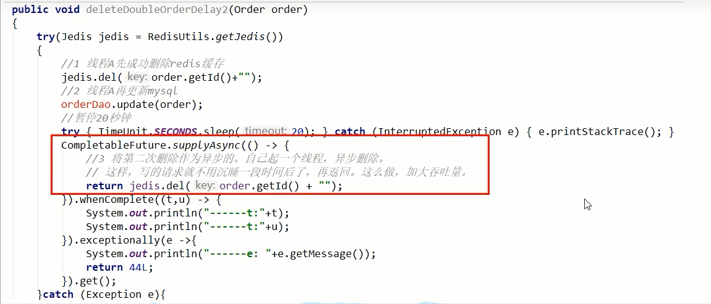
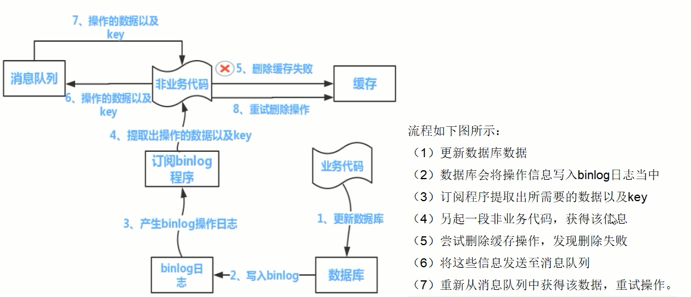

# 数据库和缓存一致性的几种更新策略

### 目的：总之，我们要达到最终一致性

<font color = blue>给缓存设置过期时间，定期清理缓存并回写，是保证最终一致性的解决方案。</font>

我们可以对存入缓存的数据设置过期时间，所有的 <font color = gree>写操作以数据库为准</font>，对缓存操作只是尽最大努力即可。也就是说如果数据库写成功，缓存更新失败，那么只要到达过期时间，则后面的读请求自然会从数据库中读取新值然后回填缓存，达到一致性，<font color = gree>切记，要以mysql的数据库写入库为准</font>。

上述方案和后续落地案例是调研后的主流＋成熟的做法，但是考虑到各个公司业务系统的差距，<font color = red>不是100%绝对正确，不保证绝对适配全部情况</font>，需要自己酌情选择打法，合适自己的最好。

### <font color = green>可以停机的情况</font>

挂牌报错，凌晨升级，温馨提示，服务降级

单线程，这样重量级的数据操作最好不要多线程

### <font color = green>我们讨论4种更新策略</font>

1. <font color = red size = 6>× </font>先更新数据库，在更新缓存

   异常问题1

   ```text
   1 先更新mysql的某商品的库存，当前商品的库存是100，更新为99个。
   2 先更新mysql修改为99成功，然后更新redis。
   3 此时假设异常出现，更新redis失败了，这导致mysql里面的库存是99而redis里面的还是100。
   4 上述发生，会让数据库里面和缓存redis里面数据不一致，读到redis脏数据
   ```

   异常问题2

   ```text
   【先更新数据库，再更新缓存】 A、B两个线程发起调用
   【正常逻辑】
   1 A update mysql 100
   2 A update redis 100
   3 B update mysql 80
   4 B update redis 80
   =============================
   【异常逻辑】
   多线程环境下，A、B两个线程有快有慢，有前有后有并行
   1 A update mysql 100
   3 B update mysql 80
   4 B update redis 80
   2 A update redis 100
   =============================
   最终结果，mysql和lredis数据不一致，o(T_T)o，
   mysql80,redis100
   ```

2. <font color = red size = 6>× </font>先更新缓存，再更新数据库

   <font color = red size = 6>× </font>不推荐，业务上一般把 `MySQL` 作为 <font color = red>底单数据库 </font>，保证最后解释

   ```text
   [先更新缓存，再更新数据库]，A、B两个线程发起调用
   [正常逻辑]
   1 A update redis 100
   2 A update mysql 100
   3 B update redis 80
   4 B update mysql 80
   ====================================
   [异常逻辑]多线程环境下，A. B两个线程有快有慢有并行
   A update redis 100
   B update redis 80
   B update mysq| 80
   A update mysql 100
   mysql100,redis80
   ```

3. <font color = red size = 6>× </font>先删除缓存，在更新数据库

   异常问题：

   步骤分析，先删除缓存，再更新数据库

   ```text
     1 A线程先成功删除了redis里面的数据，然后去更新mysql,此时mysql正在更新中，还没有结束。(比如网络延时)
     B突然出现要来读取缓存数据。
   
   2 此时redis里面的数据是空的，B线程来读取，先去读redis里数据(已经被A线程delete掉了)，此处出来2个问题:
   
   2.1 B从mysq|获得了旧值
   B线程发现redis里没有(缓存缺失)马上去mysql里面读取，从数据库里面读取来的是旧值。
   
   2.2 B会把获得的旧值写回redis
   获得旧值数据后返回前台并回写进redis(刚被A线程删除的旧数据有极大可能早被写回了)。
   
   3 A线程更新完mysql,发现redis里面的缓存是脏数据，A线程直接懵逼了，o(T_ .τ)o
   两个并发操作，一个是更新操作，另一个是查询操作，A删除缓存后，B查询操作没有命中缓存，B先把老数据读出来后放到缓存中，然后A更新操作更新了数据库。
   于是，在缓存中的数据还是老的数据，导致缓存中的数据是脏的，而且还一直这样脏下去了。
   
   4 总结流程:
   (1)请求A进行写操作，删除redis缓存后，工作正在进行中，更新mysql.....
   A还么有彻底更新完mysql,还没commit
   (2)请求B开工查询，查询redis发现缓存不存在(被A从redis中删除了)
   (3)请求B继续，去数据库查询得到了mysq中的旧值(A还没有更新完)
   (4)请求B将旧值写回redis缓存
   (5)请求A将新值写入mysql数据库
   上述情况就会导致不一致的情形出现。
   ```

   先删除缓存，再更新数据库：如果数据库更新失败或超时或返回不及时，导致B线程请求访问缓存时发现redis里面没数据，缓存缺失，B再去读取mysql时，从数据库中读取到旧值，还写回`redis`， 导致A白干了，o(π_ _π)o

   解决方案：

   <font color = red>采用延时双删策略 </font>

   

   加上sleep的这段时间，就是为了让线程B能够先从数据库读取数据，再把缺失的数据写入缓存，然后，线程A再进行删除。所以，线程A sleep的时间，就需要大于线程B读取数据再写入缓存的时间。这样一来，其它线程读取数据时，会发现缓存缺失，所以会从数据库中读取最新值。因为这个方案会在第一次删除缓存值后，延迟一段时间再次进行删除，所以我们也把它叫做“延迟双删”。

   **延迟双删面试题**

   **这个删除该休眠多久呢**？线程A sleep的时间，就需要大于线程B读取数据再写入缓存的时间。

   <font color = red>这个时间怎么确定呢?</font>
   <font color = blue>第一种方法：</font>
   在业务程序运行的时候，统计下线程读数据和写缓存的操作时间，自行评估自己的项目的读数据业务逻辑的耗时，以此为基础来进行估算。然后写数据的休眠时间则在读数据业务逻辑的耗时基础上加百毫秒即可。
   这么做的目的，就是确保读请求结束，写请求可以删除读请求造成的缓存脏数据。
   <font color = blue>第二种方法：</font>
   <font color = blue>新启动一个后台监控程序，比如后面要讲解的WatchDog监控程序，会加时</font>

   这种同步淘汰策略，吞吐量降低怎么办？

   

4. <font color = red size = 2>目前用的比较多 </font>先更新数据库，再删除缓存

   - 异常问题：

   | 时间 | 线程A                  | 线程B                               | 出现的问题                                     |
   | ---- | ---------------------- | ----------------------------------- | ---------------------------------------------- |
   | t1   | 更新数据库中的值...... |                                     |                                                |
   | t2   |                        | 缓存立刻命中，此时B读取的是缓存旧值 | A还没来得及删除缓存的值，导致B缓存命中读到旧值 |
   | t3   | 更新缓存的数据，over   |                                     |                                                |

   先更新数据库，在删除缓存，假如缓存删除失败或者来不及删除，导致请求再次访问`redis`时缓存命中，<font color = red>读取到的是缓存的旧值。</font>

   - 业务指导思想

     微软云：https://learn.microsoft.com/en-us/azure/architecture/patterns/cache-aside

     后面的阿里巴巴`canal`也是类似的思想

     订阅`binlog`程序在`MySQL`中有现成的中间件叫`canal`，可以完成订阅`binlog`日志的功能。

   - 解决方案

     

     1 可以把要删除的缓存值或者是要更新的数据库值暂存到消息队列中（例如使用`Kafka`/`RabbitMQ`等)。
   
     2 当程序没有能够成功地删除缓存值或者是更新数据库值时，可以从消息队列中重新读取这些值，然后再次进行删除或更新。
   
     3 如果能够成功地删除或更新，我们就要把这些值从消息队列中去除，以免重复操作，此时，我们也可以保证数据库和缓存的数据一致了，否则还需要再次进行重试
     4 如果重试超过的一定次数后还是没有成功，我们就需要向业务层发送报错信息了，通知运维人员。
   
   - 类似经典的分布式事务问题，只有一个权威答案，只能达到最终一致性
   
     流量充值，先下发短信实际充值可能滞后5分钟，可以接受
   
     电商发货，短信下发但是物流明天见

### 小总结

方案如何选择？利弊如何

在大多数业务场景下，
个人建议是，优先使用先更新数据库，<font color = green>再删除缓存的方案(先更库→后删存)</font>。理由如下:

1先删除缓存值再更新数据库，有可能导致请求因缓存缺失而访问数据库，给数据库带来压力导致打满`mysql`。

2如果业务应用中读取数据库和写缓存的时间不好估算，那么，延迟双删中的等待时间就不好设置。

多补充一句:如果<font color = green>使用先更新数据库，再删除缓存的方案)</font>

如果业务层要求必须读取一致性的数据，那么我们就需要在更新数据库时，先在`Redis`缓存客户端暂停并发读请求，等数据库更新完、缓存值删除后，再读取数据，从而保证数据一致性，这是理论可以达到的效果，但实际，不推荐，因为真实生产环境中，分布式下很难做到实时一致性，一般都是最终一致性。

| 策略                             | 高并发多线程条件下 | 问题                                               | 现象                                                         | 解决方案                                            |
| -------------------------------- | ------------------ | -------------------------------------------------- | ------------------------------------------------------------ | --------------------------------------------------- |
| 先删除`redis`缓存，再更新`mysql` | 无                 | 缓存删除成功但数据库更新失败                       | Java程序从数据库中读到旧值                                   | 再次更新数据库，重试                                |
|                                  | 有                 | 缓存删除成功但数据库更新中...<br />有并发请求      | 并发请求从数据库读到旧值并回写到`redis`，导致后续都是从`redis`读取到旧值 | 再次删除缓存，重试                                  |
| 先更新`mysql`，再删除`redis`缓存 | 无                 | 数据库更新成功，但缓存删除失败                     | Java程序从`redis`中读到旧值                                  | 再次删除缓存，重试                                  |
|                                  | 有                 | 数据库更新成功但缓存删除中......<br />有并发读请求 | 并发请求从缓存读到旧值                                       | 等待`redis`删除完成，这段时间数据不一致，短暂存在。 |


