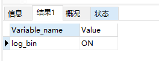
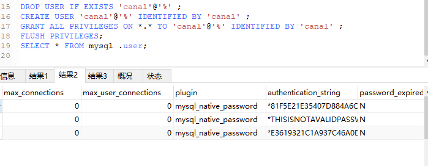

# 双写一致性-MySQL

### Java案例，来源出处

https://github.com/alibaba/canal/wiki/ClientExample

- 查看MySQL版本

  select version(); // 5.7.17

- 当前的主机二进制日志

  show master status;

- 查看 show variables like 'log_bin';

  默认未开启

- 开启MySQL的binlog写入功能

  修改配置文件，win环境下修改my.ini文件

  ```ini
  log-bin=mysql-bin
  binlog-format=Row
  server_id=1
  ```

  

- 重启MySQL

- 再次查看 show variables like 'log_bin';

  

- 授权canal链接MySQL账号

  - MySQL默认的用户在MySQL库的user表里面

    

  - 默认没有canal账户，此处新建+授权

    ```sql
    DROP USER IF EXISTS 'canal'@'%' ;
    
    # mysql 5.7 直接创建默认用户即可
    CREATE USER 'canal'@'%' IDENTIFIED BY 'canal' ;
    
    # mysql 8 这里需要设置使用之前的密码认证方式
    CREATE USER 'canal'@'%' IDENTIFIED WITH mysql_native_password BY 'canal';
    
    # mysql 8 不需要写第二遍密码 删除 " IDENTIFIED BY 'canal' ; " 部分
    GRANT ALL PRIVILEGES ON *.* TO 'canal'@'%' IDENTIFIED BY 'canal' ;
    
    ############################### 这部分都一样
    FLUSH PRIVILEGES;
    SELECT * FROM mysql .user;
    ```
    
    


