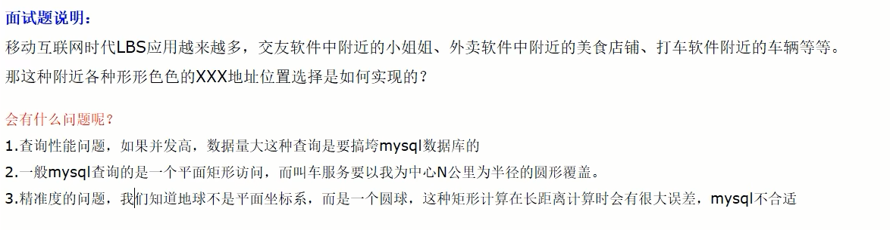
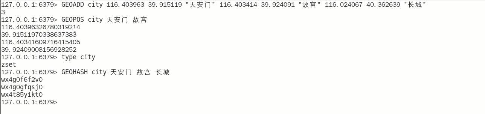

# GEO

### Redis之GEO

面试题简介

### 命令复习

- `GEOADD` 添加经纬度坐标

  

  

- `GEOPOS` 返回经纬度

  

  

- `GEOHASH` 返回坐标的 `geohash` 表示

  `geohash` 算法生成的 `base32` 编码值，3维变2维变1维

  

  

- `GEODIST` 两个位置之间的距离

  

  

- `GEORADIUS`

  以半径为中心，查找附近的   `XXX`

  

- `GEORADIUSBYMEMBE`

  

