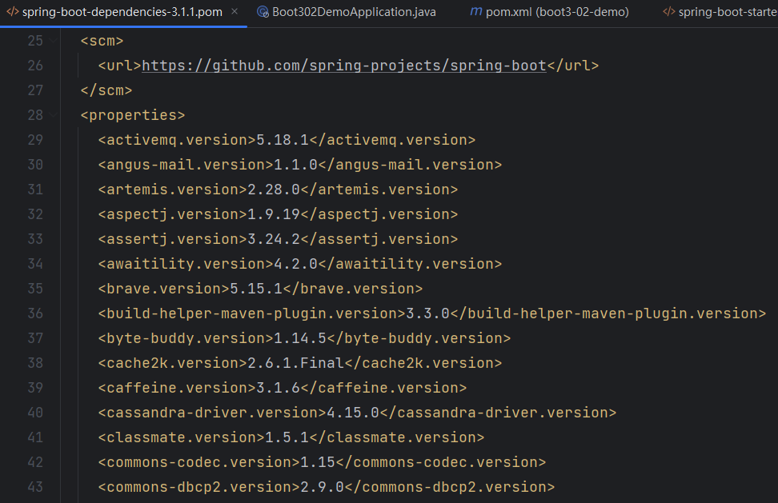
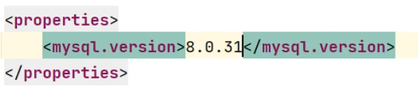
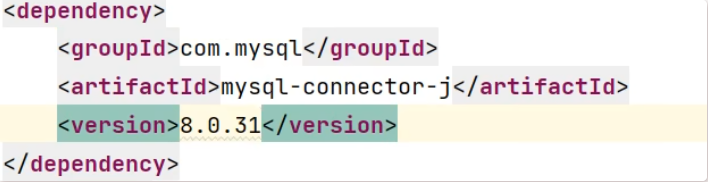
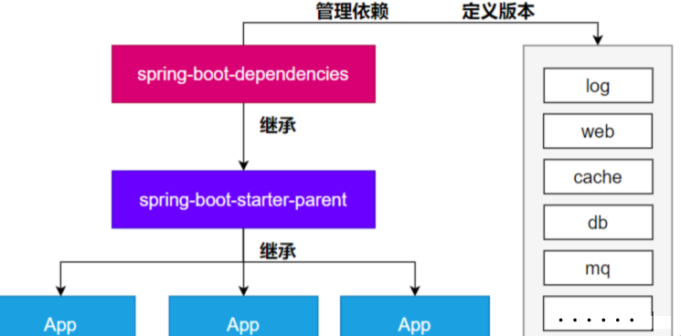
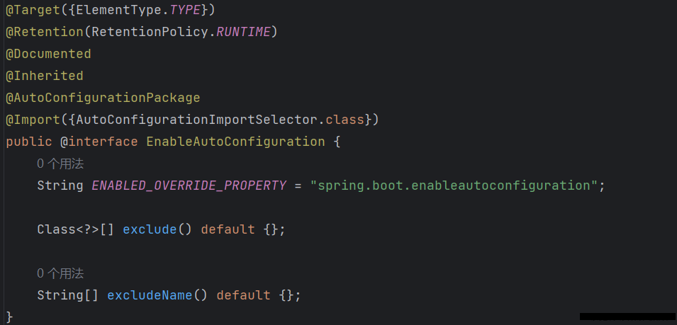
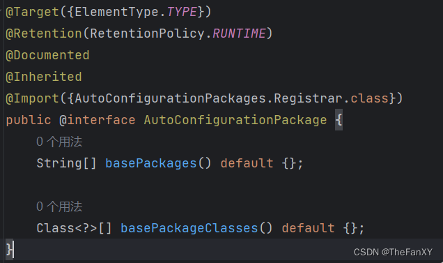
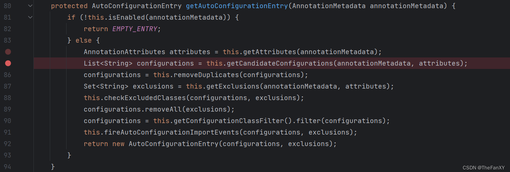
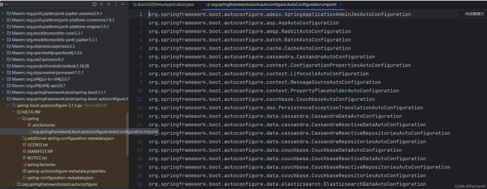

# 1 SpringBoot3【① 自动注入/依赖管理原理】

## 1.0. 特性小结

### 1.0.1. 简化整合

导入相关的场景，拥有相关的功能。场景启动器
默认支持的所有场景 **`（官方）`** ：[官方给的场景列表](https://docs.spring.io/spring-boot/docs/current/reference/html/using.html#using.build-systems.starters)

● 官方提供的场景：命名为：`spring-boot-starter-*`

● 第三方提供场景：命名为：`*-spring-boot-starter`

**场景一导入，万物皆就绪**

### 1.0.2. 简化开发

无需编写任何配置，直接开发业务

### 1.0.3. 简化配置

`application.properties`：
● 集中式管理配置。只需要修改这个文件就行 。
● 配置基本都有默认值
● 能写的所有配置都在： [官方提供的各种配置的默认值和可配置的参数列表](https://docs.spring.io/spring-boot/docs/current/reference/html/application-properties.html#appendix.application-properties)

### 1.4. 简化部署

打包为可执行的jar包。

linux服务器上有java环境。

### 1.5. 简化运维

修改配置（外部放一个`application.yaml`文件）、监控、健康检查。
.....

## 1.1. 依赖管理机制

思考：
1、为什么导入`starter-web`所有相关依赖都导入进来？

- 开发什么场景，导入什么**场景启动器。**
- **maven依赖传递原则。A-B-C： A就拥有B和C**
- 导入 场景启动器。 场景启动器 自动把这个场景的所有核心依赖全部导入进来

2、为什么版本号都不用写？

- 每个boot项目都有一个父项目`spring-boot-starter-parent`
- parent的父项目是`spring-boot-dependencies`
- 父项目 **版本仲裁中心**，把所有常见的jar的依赖版本都声明好了。
- 
- 比如：`mysql-connector-j`

3、自定义版本号(`如果不想使用官方的`)

- 可以利用maven的就近原则
  - ①直接在当前项目`properties`标签中声明父项目用的版本属性的key
  - 
    - ②直接在**导入依赖的时候声明版本**
    - 


4、第三方的jar包

- boot父项目没有管理的需要自行声明好

```xml
<!-- https://mvnrepository.com/artifact/com.alibaba/druid -->
<dependency>
    <groupId>com.alibaba</groupId>
    <artifactId>druid</artifactId>
    <version>1.2.16</version>
</dependency>
```


## 1.2. 自动配置机制



### 1.2.1. 初步理解

- **自动配置 ** 的 Tomcat、SpringMVC 等
  - **导入场景** ，容器中就会自动配置好这个场景的核心组件。
  - 以前：`DispatcherServlet`、`ViewResolver`、`CharacterEncodingFilter`....
  - 现在：自动配置好的这些组件
  - 验证：**容器中有了什么组件，就具有什么功能**

```java
    public static void main(String[] args) {

        //java10： 局部变量类型的自动推断
        var ioc = SpringApplication.run(MainApplication.class, args);

        //1、获取容器中所有组件的名字
        String[] names = ioc.getBeanDefinitionNames();
        //2、挨个遍历：
        // dispatcherServlet、beanNameViewResolver、characterEncodingFilter、multipartResolver
        // SpringBoot把以前配置的核心组件现在都给我们自动配置好了。
        for (String name : names) {
            System.out.println(name);
        }
    }
```

- **默认的包扫描规则**
  - `@SpringBootApplication` 标注的类就是主程序类
  - **SpringBoot只会扫描主程序所在的包及其下面的子包，自动的`component-scan` 功能，在此包之外，哪怕写了`MVC的组件`注解也无法扫描存入IOC容器之中**
  - **自定义扫描路径(`如果非要放在默认之外，需要给注解加内容配置`)**
    - **①**`@SpringBootApplication(scanBasePackages = "com.fanxy")`
    - **②** `@ComponentScan("com.fanxy") `直接指定扫描的路径，这是因为上面的 **@SpringBootApplication** 注解包含内嵌了三个注解：**`@SpringBootConfiguration`，`@EnableAutoConfiguration`，`@ComponentScan`**
- **配置默认值**
  - **配置文件** 的所有配置项是和某个 **类的对象** 值进行一一绑定的。(可以在配置文件中利用server.port=xxxx配置，然后使用ctrl + 左键 进入对应的一个类`ServerProperties`)
  - 绑定了配置文件中每一项值的类： **属性类**。
  - 比如：
    - `ServerProperties`绑定了所有Tomcat服务器有关的配置
    - `MultipartProperties`绑定了所有文件上传相关的配置
    - ....[参照官方文档](https://docs.spring.io/spring-boot/docs/current/reference/html/application-properties.html#appendix.application-properties.server)：或者参照 绑定的 **属性类**。
- 按需加载自动配置
  - 导入场景`spring-boot-starter-web`
  - 场景启动器除了会导入相关功能依赖，导入一个`spring-boot-starter`，是所有`starter`的`starter`，基础核心starter
  - `spring-boot-starter`导入了一个包 `spring-boot-autoconfigure`。包里面都是各种场景的`AutoConfiguration` **自动配置类**
  - 虽然全场景的自动配置都在 `spring-boot-autoconfigure`这个包，但是不是全都开启的。
    - 导入哪个场景就开启哪个自动配置

总结： 导入场景启动器、触发 `spring-boot-autoconfigure`这个包的自动配置生效、容器中就会具有相关场景的功能

### 1.2.2. 完整流程

思考：
1、SpringBoot怎么实现导一个`starter`、写一些简单配置，应用就能跑起来，我们无需关心整合

2、为什么Tomcat的端口号可以配置在`application.properties`中，并且Tomcat能启动成功？

3、导入场景后哪些**自动配置能生效**？

**自动配置流程细节梳理**：
**`1、`** 导入`starter-web`：导入了web开发场景

- 1、场景启动器导入了相关场景的所有依赖：`starter-json`、`starter-tomcat`、`springmvc`
- 2、每个 **场景启动器** 都引入了一个`spring-boot-starter`，**核心场景启动器**。
- 3、**核心场景启动器 **引入了`spring-boot-autoconfigure`包。
- 4、`spring-boot-autoconfigure`里面囊括了 **所有场景的所有配置。**
- 5、只要这个包下的所有类都能生效，那么相当于 `SpringBoot` 官方写好的整合功能就生效了。
- 6、SpringBoot默认却扫描不到 `spring-boot-autoconfigure`下写好的所有 **配置类** 。（这些 **配置类** 给我们做了整合操作）， **默认只扫描主程序所在的包。但利用下面主程序的注解就做到了导入。**

**`2、`** 主程序：`@SpringBootApplication`

```java
@Target({ElementType.TYPE})
@Retention(RetentionPolicy.RUNTIME)
@Documented
@Inherited
@SpringBootConfiguration
@EnableAutoConfiguration
@ComponentScan(
    excludeFilters = {@Filter(
    type = FilterType.CUSTOM,
    classes = {TypeExcludeFilter.class}
), @Filter(
    type = FilterType.CUSTOM,
    classes = {AutoConfigurationExcludeFilter.class}
)}
)
public @interface SpringBootApplication {---------}
```

- 1、`@SpringBootApplication`由三个注解组成`@SpringBootConfiguration`、`@EnableAutoConfiguration`、`@ComponentScan`
- 2、`SpringBoot` 默认只能扫描自己主程序所在的包及其下面的子包，扫描不到 `spring-boot-autoconfigure` 包中官方写好的 **配置类**
- 3、**`@EnableAutoConfiguration`**：SpringBoot 开启自动配置的核心。
- 
  **这个注解可以`@Import`导入下面的类，这个类的作用其实是批量导入组件，`@import` 将指定的类或配置文件导入到当前类中，可以用于导入其他类的定义、配置文件等。这个类内部的方法还获取了一些注册信息，其实调试发现就是主程序所在的包的路径，故帮助我们扫描主程序所在的包和子包路径下所有组件**
  



  - 1. 是由上图1的注解`@Import(AutoConfigurationImportSelector.class)`提供功能：批量给容器中导入组件。利用`getAutoConfigurationEntry(annotationMetadata)`;给容器中批量导入一些组件
       调用`List<String> configurations = getCandidateConfigurations(annotationMetadata, attributes)`获取到所有需要导入到容器中的配置类
       利用工厂加载` Map<String, List<String>> loadSpringFactories(@Nullable ClassLoader classLoader)`;得到所有的组件
       从`META-INF/spring.factories`位置来加载一个文件。
       默认扫描我们当前系统里面所有`META-INF/spring.factories`位置的文件
       `spring-boot-autoconfigure-x.x.x.RELEASE.jar`包里面也有`META-INF/spring.factories` 最新版本springboot其实换了文件路径——>**来自于`spring-boot-autoconfigure`下 `META-INF/spring/`**`org.springframework.boot.autoconfigure.AutoConfiguration.imports`


  - 2. `SpringBoot`启动会默认加载 142个配置类【版本不同数量不同这个不重要】。`上面的主程序自带的注解会排除一些`
  - 3. 这**142个配置类**来自于`spring-boot-autoconfigure`下 `META-INF/spring/`**`org.springframework.boot.autoconfigure.AutoConfiguration.imports`** 文件指定的
  - 

  - 项目启动的时候利用 `@Import` 批量导入组件机制把 `autoconfigure` 包下的142 `xxxxAutoConfiguration`类导入进来（**自动配置类**）
  - 虽然导入了`142`个自动配置类
- 4、**按需生效**：
  - 并不是这`142`个自动配置类都能生效
  - 每一个**自动配置类**，都有条件注解`@ConditionalOnxxx`，**只有条件成立，才能生效**

**`3、`** **`xxxxAutoConfiguration`** **自动配置类**

● **1、给容器中使用@Bean 放一堆组件。**

● 2、每个 **自动配置类** 都可能有这个注解`@EnableConfigurationProperties(ServerProperties.class)`，用来把配置文件中配的 **指定前缀的属性值** 封装到 `xxxProperties`**属性类** 中， **而一些组件如`Tomcat`，内置了带默认值的构造函数，所以带有默认值。而这个自动配置类中有一些`定制化器类`，如果带有`@Bean`注解，他们的构造函数可能会带有参数 `ServerProperties serverProperties`，带有`@Bean`注解的类的形参如果容器已经有了相同类型的对象，会自动放入赋值**

● 3、以 **`Tomcat`** 为例：把服务器的所有配置都是以`server`开头的。配置都封装到了属性类中。

● 4、给 **容器** 中放的所有 **组件** 的一些 **核心参数** ，都来自于 **xxxProperties** 。**xxxProperties** 都是和 **配置文件** 绑定（ **这些类都通过`@EnableConfigurationProperties(xxxx)`注解把前缀修饰**）

● **只需要改配置文件的值，核心组件的底层参数都能修改**

**`4、`** 写业务，全程无需关心各种整合（底层这些整合写好了，而且也生效了）

**`核心流程总结：`**
1、导入`starter`，就会导入`autoconfigure`包。

2、`autoconfigure` 包里面 有一个文件 `META-INF/spring/`**`org.springframework.boot.autoconfigure.AutoConfiguration.imports`**,里面指定的所有启动要加载的自动配置类

3、`@EnableAutoConfiguration` 会**自动的把上面文件里面写的所有自动配置类都导入进来。xxxAutoConfiguration 是有条件注解进行按需加载**

4、**符合需求条件的情况下`xxxAutoConfiguration`给容器中导入一堆组件**，组件都是从 `xxxProperties`中提取属性值

5、`xxxProperties`又是和**配置文件**进行了绑定

**效果**：导入`starter`、修改配置文件，就能修改底层行为。


### 1.2.3. 如何学好SpringBoot

框架的框架、底层基于Spring。能调整每一个场景的底层行为。100%项目一定会用到 **底层自定义**
摄影：

- 傻瓜：自动配置好。
- **单反**：焦距、光圈、快门、感光度....
- 傻瓜 + **单反** ：

1. 理解 **自动配置原理**
   **a. `导入starter` --> 生效xxxxAutoConfiguration --> `组件` --> xxxProperties --> `配置文件`**
2. 理解 **其他框架底层**
   a. 如`Mybatis`的拦截器，和`Springboot`框架无关，不懂别的框架底层就不可能写好
3. 可以随时 **定制化任何组件**
   **a. 配置文件**
     **b. 自定义组件**

普通开发：导入`starter`，`Controller`、`Service`、`Mapper`、偶尔修改配置文件

*高级开发*：自定义组件、自定义配置、自定义starter

核心：
● 这个场景自动配置导入了哪些组件，我们能不能 `Autowired` 进来使用

● 能不能通过修改配置改变组件的一些默认参数

● 需不需要自己完全定义这个组件

● `场景定制化`

<font color="#dd0000">**最佳实战**：</font>

- <font color="#dd0000">**选场景**，导入到项目</font>
  - <font color="#dd0000">官方：starter</font>
  - <font color="#dd0000">第三方：去仓库搜</font>
- <font color="#dd0000">**写配置，改配置文件关键项**</font>
  - <font color="#dd0000">数据库参数（连接地址、账号密码...）</font>
- <font color="#dd0000">分析这个场景给我们导入了**哪些能用的组件，可以配置文件开启debug=true，生成自动配置报告，然后去分析开启的和没有开启的组件**</font>
  - <font color="#dd0000">**自动装配**这些组件进行后续使用</font>
  - <font color="#dd0000">不满意boot提供的自动配好的默认组件</font>
    - <font color="#dd0000">**定制化**</font>
      - <font color="#dd0000">改配置</font>
      - <font color="#dd0000">自定义组件</font>
        整合redis：
- 选场景：`spring-boot-starter-data-redis `
  - 场景`AutoConfiguration` 就是这个场景的自动配置类
- 写配置：
  - 分析到这个场景的自动配置类开启了哪些属性绑定关系
  - `@EnableConfigurationProperties(RedisProperties.class)`
  - 修改redis相关的配置
- 分析组件：
  - 分析到 `RedisAutoConfiguration`  给容器中放了 `StringRedisTemplate`
  - 给业务代码中自动装配 `StringRedisTemplate`
- 定制化
  - 修改配置文件
  - 自定义组件，自己给容器中放一个 `StringRedisTemplate`