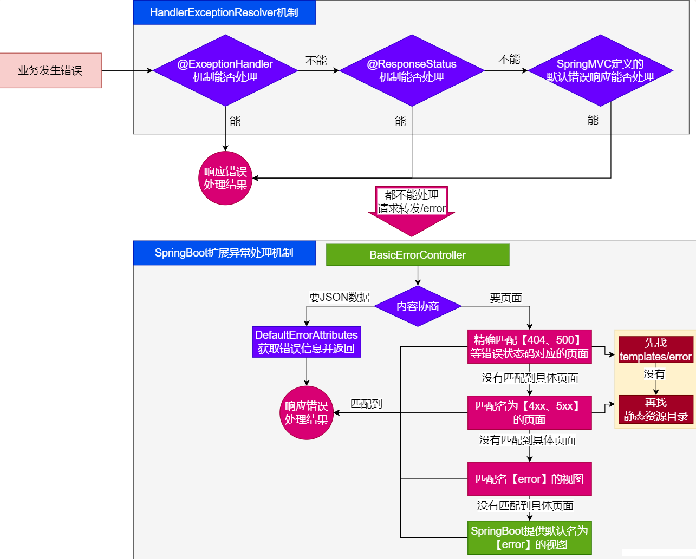
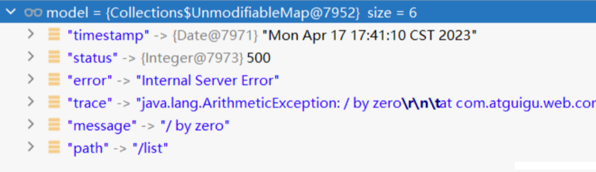

# 10 SpringBoot3【⑩ 错误处理】

## 10.1. 默认机制

> **错误处理的自动配置**都在`ErrorMvcAutoConfiguration`中，两大核心机制：
>
> 1. `SpringBoot` 会 **<font color="#000bb">自适应</font>** **处理错误**，**<font color="#000bb">响应页面</font>** 或 **<font color="#000bb">JSON数据</font>**
> 2. **<font color="#000bb">SpringMVC的错误处理机制</font>** 依然保留，**<font color="#000bb">MVC处理不了</font>**，才会 **<font color="#000bb">交给boot进行处理</font>**
>
> -  [**我的SpringMVC错误处理部分笔记**](https://www.fanxy.cloud/archives/SpringMVC-6)

`@ExceptionHandler`注解作用在一个`Controller`方法，代表能处理当前`Controller`类内部的错误，而为了能处理全局的错误，SpringMVC中我们使用单独定义一个类在`handler包下`，并标记`@ControllerAdvice`注解，此时这个`Handler`类内部的方法再去使用 `@ExceptionHandler`注解处理的就是全局的错误

**<font color="#bb000">[错误处理机制的底层讲解部分视频](https://www.bilibili.com/video/BV1Es4y1q7Bf/?p=46&spm_id_from=pageDriver&vd_source=da8c316450987e3173a62ba5ea9acd61)</font>**


- 发生错误以后，转发给`/error`路径，`SpringBoot`在底层写好一个 `BasicErrorController`的组件，专门处理这个请求

```java
	@RequestMapping(produces = MediaType.TEXT_HTML_VALUE) //返回HTML
	public ModelAndView errorHtml(HttpServletRequest request, HttpServletResponse response) {
		HttpStatus status = getStatus(request);
		Map<String, Object> model = Collections
			.unmodifiableMap(getErrorAttributes(request, getErrorAttributeOptions(request, MediaType.TEXT_HTML)));
		response.setStatus(status.value());
		ModelAndView modelAndView = resolveErrorView(request, response, status, model);
		return (modelAndView != null) ? modelAndView : new ModelAndView("error", model);
	}

	@RequestMapping  //返回 ResponseEntity, JSON
	public ResponseEntity<Map<String, Object>> error(HttpServletRequest request) {
		HttpStatus status = getStatus(request);
		if (status == HttpStatus.NO_CONTENT) {
			return new ResponseEntity<>(status);
		}
		Map<String, Object> body = getErrorAttributes(request, getErrorAttributeOptions(request, MediaType.ALL));
		return new ResponseEntity<>(body, status);
	}
```

错误页面是这么解析到的

```java
//1、解析错误的自定义视图地址
ModelAndView modelAndView = resolveErrorView(request, response, status, model);
//2、如果解析不到错误页面的地址，默认的错误页就是 error
return (modelAndView != null) ? modelAndView : new ModelAndView("error", model);
```

容器中专门有一个错误视图解析器

```java
@Bean
@ConditionalOnBean(DispatcherServlet.class)
@ConditionalOnMissingBean(ErrorViewResolver.class)
DefaultErrorViewResolver conventionErrorViewResolver() {
    return new DefaultErrorViewResolver(this.applicationContext, this.resources);
}
```

`SpringBoot`解析自定义错误页的默认规则

```java
	@Override
	public ModelAndView resolveErrorView(HttpServletRequest request, HttpStatus status, Map<String, Object> model) {
		ModelAndView modelAndView = resolve(String.valueOf(status.value()), model);
		if (modelAndView == null && SERIES_VIEWS.containsKey(status.series())) {
			modelAndView = resolve(SERIES_VIEWS.get(status.series()), model);
		}
		return modelAndView;
	}

	private ModelAndView resolve(String viewName, Map<String, Object> model) {
		String errorViewName = "error/" + viewName;
		TemplateAvailabilityProvider provider = this.templateAvailabilityProviders.getProvider(errorViewName,
				this.applicationContext);
		if (provider != null) {
			return new ModelAndView(errorViewName, model);
		}
		return resolveResource(errorViewName, model);
	}

	private ModelAndView resolveResource(String viewName, Map<String, Object> model) {
		for (String location : this.resources.getStaticLocations()) {
			try {
				Resource resource = this.applicationContext.getResource(location);
				resource = resource.createRelative(viewName + ".html");
				if (resource.exists()) {
					return new ModelAndView(new HtmlResourceView(resource), model);
				}
			}
			catch (Exception ex) {
			}
		}
		return null;
	}
```

容器中有一个默认的名为 error 的 view； 提供了默认白页功能

```java
@Bean(name = "error")
@ConditionalOnMissingBean(name = "error")
public View defaultErrorView() {
    return this.defaultErrorView;
}
```

封装了JSON格式的错误信息

```java
	@Bean
	@ConditionalOnMissingBean(value = ErrorAttributes.class, search = SearchStrategy.CURRENT)
	public DefaultErrorAttributes errorAttributes() {
		return new DefaultErrorAttributes();
	}
```

规则：

1. 解析一个错误页
   - 如果发生了500、404、503、403 这些错误
     - ① 如果 **有模板引擎**，默认在 `classpath:/templates/error/`**`精确码.html`**
      - ② 如果 **没有模板引擎**，在 **静态资源文件夹** 下找  **`精确码.html`**

  	- 如果匹配不到 **`精确码.html`** 这些精确的错误页，就去找 **`5xx.html`** ，`4xx.html`**模糊匹配**
  		- ① 如果**有模板引擎**，默认在 `classpath:/templates/error/5xx.html`（或者`4xx.html`）
  		- ② 如果**没有模板引擎**，在**静态资源文件夹**下找 ` 5xx.html` （或者`4xx.html`）

2. 如果**模板引擎路径**`templates`下有 `error.html`页面，就直接渲染
3. **即便是以上全没有，容器中有一个默认的名为 error 的 view，并且底层配置了渲染的内容，提供了默认白页功能**

## 10.2. 自定义错误响应

### 10.2.1. 自定义`json`响应

> 使用`@ControllerAdvice` + `@ExceptionHandler` 进行统一异常处理

### 10.2.2. 自定义页面响应

> 根据boot的错误页面规则，自定义页面模板

## 10.3. 最佳实战

- **前后分离**
  - 后台发生的所有错误，`@ControllerAdvice + @ExceptionHandler `进行统一异常处理。
- **服务端页面渲染**
  - **不可预知的一些，HTTP码表示的服务器或客户端错误**
    - 给`classpath:/templates/error/` 下面，放常用精确的错误码页面。`500.html`，`404.html`
    - 给`classpath:/templates/error/` 下面，放通用模糊匹配的错误码页面。 `5xx.html`，`4xx.html`
  - **发生业务错误**
    - **核心业务**，每一种错误，都应该代码控制，**跳转到自己定制的错误页（thy catch代码块，出现异常跳转定制页面）。**
    - **通用业务**，`classpath:/templates/error.html`页面，**显示错误信息。**

**页面，JSON，可用的Model数据如下，如果使用Thymeleaf，可以直接从作用域取这些对象展示。**


