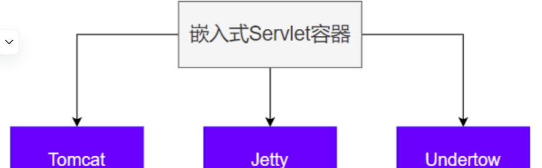

# 11 SpringBoot3【嵌入式Servlet容器】

> **Servlet容器**：管理、运行 **Servlet组件**（Servlet、Filter、Listener）的环境，一般指 **服务器**

## 1. 自动配置原理

- SpringBoot 默认嵌入 `Tomcat` 作为 `Servlet` 容器。
- **自动配置类** 是`ServletWebServerFactoryAutoConfiguration`，`EmbeddedWebServerFactoryCustomizerAutoConfiguration`
- 自动配置类开始分析功能。`xxxxAutoConfiguration`
  **[雷神底层源码分析](https://www.bilibili.com/video/BV1Es4y1q7Bf/?p=48&spm_id_from=pageDriver&vd_source=da8c316450987e3173a62ba5ea9acd61)**

```java
@AutoConfiguration
@AutoConfigureOrder(Ordered.HIGHEST_PRECEDENCE)
@ConditionalOnClass(ServletRequest.class)
@ConditionalOnWebApplication(type = Type.SERVLET)
@EnableConfigurationProperties(ServerProperties.class)
// 这里可以看到自动把嵌入式的三大服务器导入了
@Import({ ServletWebServerFactoryAutoConfiguration.BeanPostProcessorsRegistrar.class,
		ServletWebServerFactoryConfiguration.EmbeddedTomcat.class,
		ServletWebServerFactoryConfiguration.EmbeddedJetty.class,
		ServletWebServerFactoryConfiguration.EmbeddedUndertow.class })
public class ServletWebServerFactoryAutoConfiguration {

}
```

1. `ServletWebServerFactoryAutoConfiguration` 自动配置了嵌入式容器场景
2. 绑定了`ServerProperties`配置类，所有和服务器有关的配置 `server`，而对配置好的服务器嵌入式容器调优，( **以Tomcat为例** )直接在配置文件以 `server.tomcat.xxxxx` 进行配置即可
3. `ServletWebServerFactoryAutoConfiguration` 导入了 嵌入式的三大服务器 `Tomcat`、`Jetty`、`Undertow`

- 3.1 导入 `Tomcat`、`Jetty`、`Undertow` 都有条件注解。**系统中有这个类才行（也就是导了包）**
- 3.2 默认 ` Tomcat `配置生效。给容器中放 `TomcatServletWebServerFactory`
- 3.3 都给容器中 `ServletWebServerFactory`放了一个 **web服务器工厂（造web服务器的）**
- 3.4 **web服务器工厂 都有一个功能**，`getWebServer` 获取web服务器
- 3.5 `TomcatServletWebServerFactory` 创建了 `tomcat`。

4. `ServletWebServerFactory` 什么时候会创建 `webServer`出来。
5. 实现类`ServletWebServerApplicationContext` **ioc容器**，启动的时候会调用创建web服务器
6. Spring **容器刷新(启动)** 的时候，会预留一个时机，刷新子容器。`onRefresh()`
7. refresh() 容器刷新 十二大步的刷新子容器会调用 `onRefresh()`

```java
	@Override
	protected void onRefresh() {
		super.onRefresh();
		try {
			createWebServer();
		}
		catch (Throwable ex) {
			throw new ApplicationContextException("Unable to start web server", ex);
		}
	}
```

> Web场景的Spring容器启动，在onRefresh的时候，会调用创建web服务器的方法。
> Web服务器的创建是通过`WebServerFactory`搞定的。容器中又会根据导了什么包条件注解，启动相关的 服务器配置，默认`EmbeddedTomcat`会给容器中放一个 `TomcatServletWebServerFactory`，导致项目启动，`自动创建出Tomcat`。

## 2. 自定义



> 切换服务器

```xml
<properties>
    <servlet-api.version>3.1.0</servlet-api.version>
</properties>
<dependency>
    <groupId>org.springframework.boot</groupId>
    <artifactId>spring-boot-starter-web</artifactId>
    <exclusions>
        <!-- Exclude the Tomcat dependency -->
        <exclusion>
            <groupId>org.springframework.boot</groupId>
            <artifactId>spring-boot-starter-tomcat</artifactId>
        </exclusion>
    </exclusions>
</dependency>
<!-- Use Jetty instead -->
<dependency>
    <groupId>org.springframework.boot</groupId>
    <artifactId>spring-boot-starter-jetty</artifactId>
</dependency>
```

## 3. 最佳实践

**用法：**

- 修改`server` 下的相关配置就可以修改 **服务器参数**
- 通过给容器中放一个 **`ServletWebServerFactory`**，来禁用掉SpringBoot默认放的服务器工厂，实现自定义嵌入 **任意服务器**。