# 14 SpringBoot3【核心原理】

# 1. 事件和监听器

## 1. 生命周期监听
场景：监听应用的生命周期
### 1. 监听器-SpringApplicationRunListener
1. 自定义`SpringApplicationRunListener`来 **监听事件**；
    1.1. 编写`SpringApplicationRunListener` **这个接口的实现类**
    1.2. 在 `META-INF/spring.factories` 中配置 `org.springframework.boot.SpringApplicationRunListener=自己的Listener`，还可以指定一个**有参构造器**，接受两个参数`(SpringApplication application, String[] args)`
    1.3. `springboot` 在`spring-boot.jar`中配置了默认的 Listener，如下


**补充一下：Springboot老版本其实自动配置类的对应导入的kv键值对其实不在现在的 `META-INF/spring/xxxxxx.Imports` 下，而是 `META-INF/spring.factories`里面**
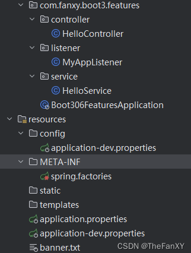
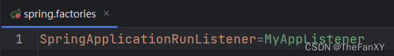
[雷神源码讲解spring主程序启动](https://www.bilibili.com/video/BV1Es4y1q7Bf/?p=59&spm_id_from=pageDriver&vd_source=da8c316450987e3173a62ba5ea9acd61)

```java
public class MyAppListener implements SpringApplicationRunListener {
    @Override
    public void starting(ConfigurableBootstrapContext bootstrapContext) {
        System.out.println("===========starting=============正在启动=======================");
    }

    @Override
    public void environmentPrepared(ConfigurableBootstrapContext bootstrapContext, ConfigurableEnvironment environment) {
        System.out.println("===========environmentPrepared=============环境准备完成=======================");
    }

    @Override
    public void contextPrepared(ConfigurableApplicationContext context) {
        System.out.println("===========contextPrepared=============ioc容器准备完成=======================");
    }

    @Override
    public void contextLoaded(ConfigurableApplicationContext context) {
        System.out.println("===========contextLoaded=============ioc容器加载完成=======================");
    }

    @Override
    public void started(ConfigurableApplicationContext context, Duration timeTaken) {
        System.out.println("===========started=============应用启动完成=======================");
    }

    @Override
    public void ready(ConfigurableApplicationContext context, Duration timeTaken) {
        System.out.println("===========ready=============应用准备就绪=======================");
    }

    @Override
    public void failed(ConfigurableApplicationContext context, Throwable exception) {
        System.out.println("===========failed=============应用启动失败=======================");
    }
}
```
**源码的`run`方法，先进行引导步骤**
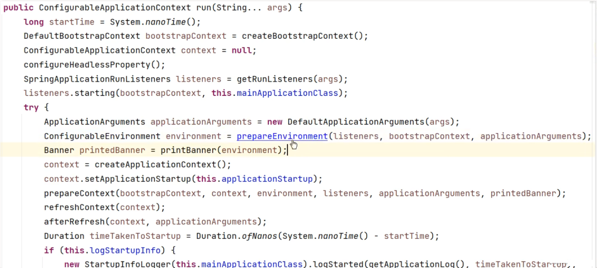
**源码可见当`contextPrepared`进行的时候，正是引导结束的时候，标志着`ioc容器创建成功`但是sources（主配置类）没加载。并关闭引导上下文；组件都没创建**
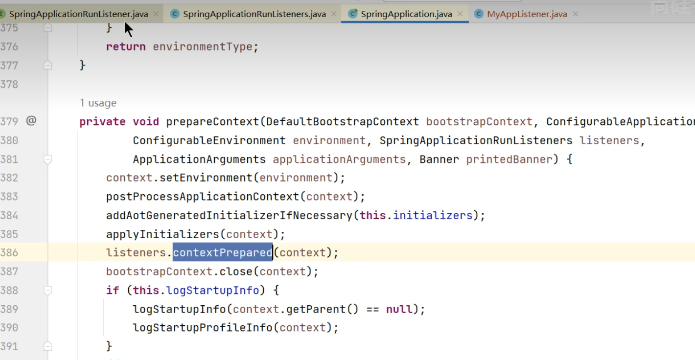
**<font color="bb000">contextLoaded->主配置类加载但是没有刷新【说明Bean没创建，但是会加载Bean的定义信息，需要刷新才能把组件创建出来】</font>(前几节讲过，可以从主程序的run（）方法一路点，找到刷新容器的方法，必须经历spring容器刷新的12大步，才能把各种组件装到spring容器里面）**


**<font color="000bb">------------------------------------------截至以前，ioc容器里面还没造bean-----------------------------------------------------</font>**

**<font color="bb000">started</font>：               `ioc`容器刷新了（所有bean造好了），但是 runner 没调用。**
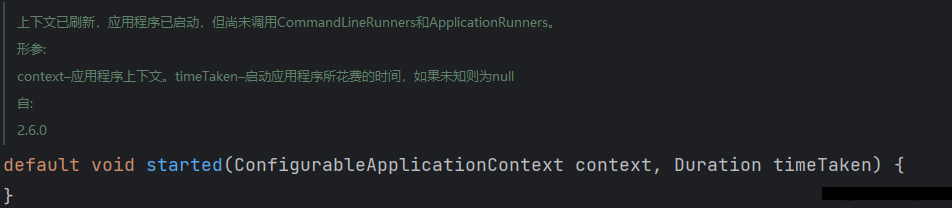
**可以在主程序的`run方法`里面看到`started`方法调用完了之后，就会调用`callRunners`方法，如果没有出现异常，就会依次调用`listener`的`ready`方法**

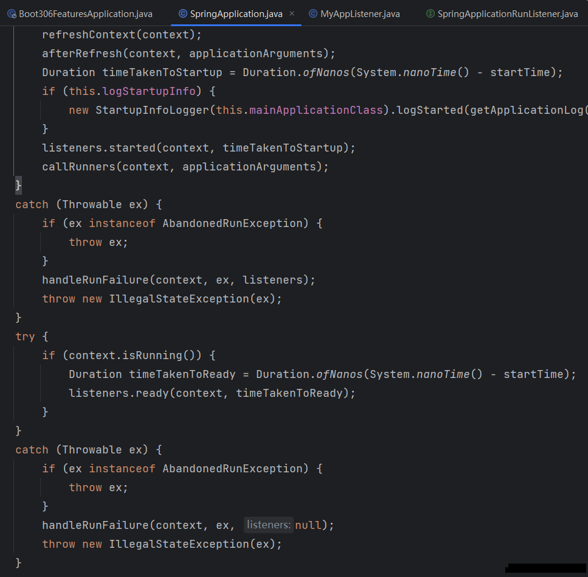
**而在主程序`run方法`中其实可以发现，在`starting`之后，`runner`调用之前，出现的异常都被它捕获到，在此期间出现异常会调用`handleRunFailue`方法处理运行失败**

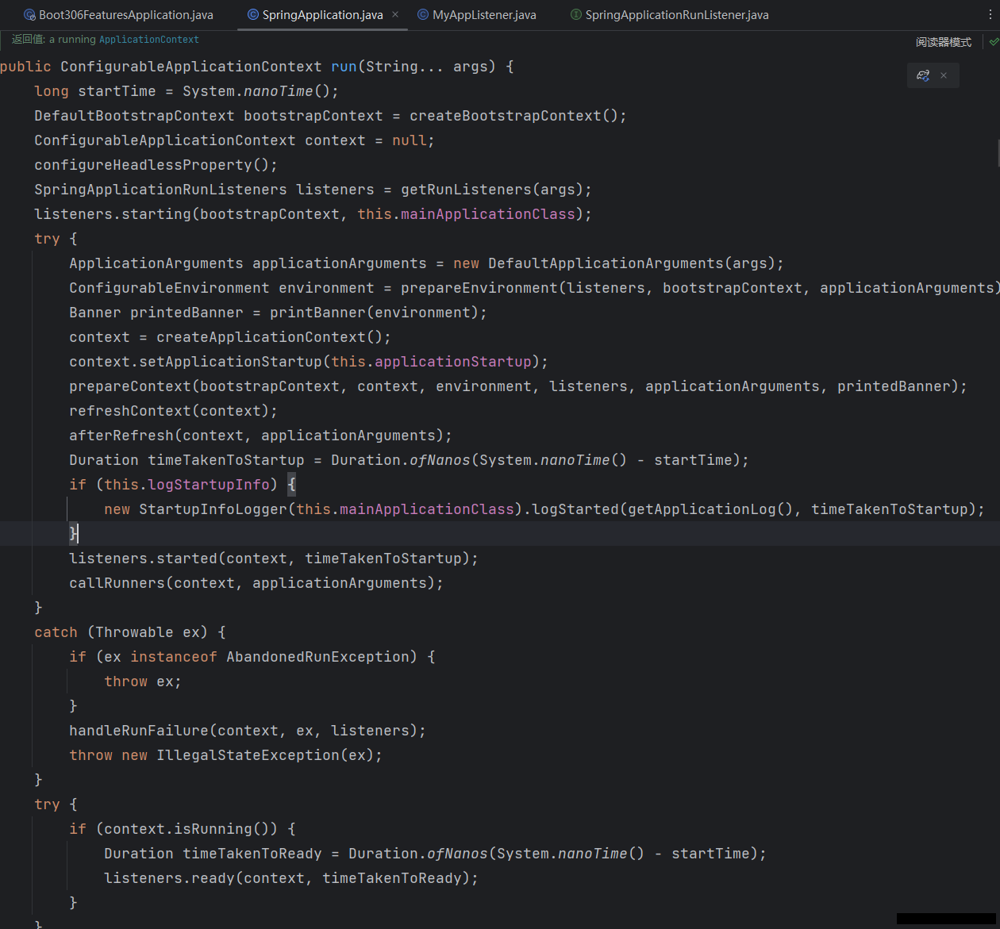
**而调用`handleRunFailue`方法的情况下，第一步就是如果存在`listenners`，就调用它的`failed方法`，至此，全部的方法执行位置和大致流程就看完了**


**原理——>**
```text
Listener先要从 META-INF/spring.factories 读到

 1、引导： 利用 BootstrapContext 引导整个项目启动
      starting：              应用开始，SpringApplication的run方法一调用，只要有了 BootstrapContext 就执行
      environmentPrepared：   环境准备好（把启动参数等绑定到环境变量中），但是ioc还没有创建；
      这里的【once】应该被翻译为【一旦】环境准备好，ioc容器还没创建之前 而不是【只会调一次】
 2、启动：
      contextPrepared：       ioc容器创建并准备好，但是sources（主配置类）没加载。并关闭引导上下文；组件都没创建  【调一次】
      contextLoaded：         ioc容器加载。主配置类加载进去了。但是ioc容器还没刷新（我们的bean没创建）。
      =======截止以前，ioc容器里面还没造bean呢=======
      started：               ioc容器刷新了（所有bean造好了），但是 runner 没调用。
      ready:                  ioc容器刷新了（所有bean造好了），所有 runner 调用完了。
 3、运行
     以前步骤都正确执行，代表容器running。
```

### 2. 生命周期全流程
[雷神源码讲解spring的九大事件和探针](https://www.bilibili.com/video/BV1Es4y1q7Bf/?p=60&spm_id_from=pageDriver&vd_source=da8c316450987e3173a62ba5ea9acd61)


## 2. 事件触发时机
### 1. 各种回调监听器
一旦看到某个源码的方法，看到 `xxxxgetSpringFactoriesxxxxxx()`，就知道是读`spring.factories` 文件的。
- `BootstrapRegistryInitializer`：    **<font color="#000bb">感知特定阶段</font>**：感知 **引导初始化**
  - `META-INF/spring.factories`
  - **`run方法启动第一步`（严格第一步其实是记录时间戳）就创建引导上下文，`创建引导上下文bootstrapContext的时候触发。`**
  - application.`addBootstrapRegistryInitializer()`;
  - `应用场景：项目启动之初可以利用它，进行密钥校对授权`。
- `ApplicationContextInitializer`：   **<font color="#000bb">感知特定阶段</font>**： 感知ioc容器初始化
  - `META-INF/spring.factories`
  - application.`addInitializers()`;
- **<font color="#000bb">ApplicationListener：    感知全阶段：基于事件机制，感知事件(onEvent()方法)。 一旦到了哪个阶段可以做别的事</font>**
  - `@Bean`或`@EventListener`： `事件驱动`
  - `SpringApplication.addListeners(…)` 或 `SpringApplicationBuilder.listeners(…)`
  - 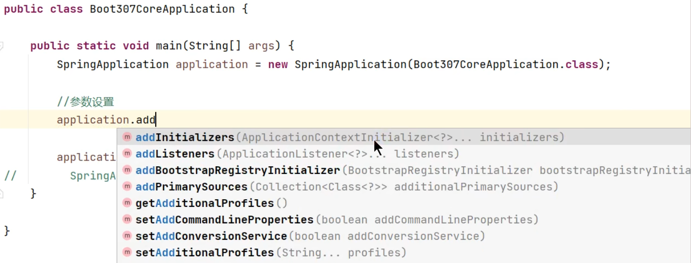

  - `META-INF/spring.factories`
- **<font color="#000bb">SpringApplicationRunListener：       感知全阶段生命周期 + 各种阶段都能自定义操作； 功能更完善。</font>**
  - `META-INF/spring.factories`
- **<font color="#000bb">ApplicationRunner:          感知特定阶段：感知应用就绪Ready。卡死应用，就不会就绪</font>**
  - `@Bean`
- **<font color="#000bb">CommandLineRunner：   感知特定阶段：感知应用就绪Ready。卡死应用，就不会就绪</font>**
  - `@Bean`

**Runner怎么使用（根据源码：需要放入ioc容器）**
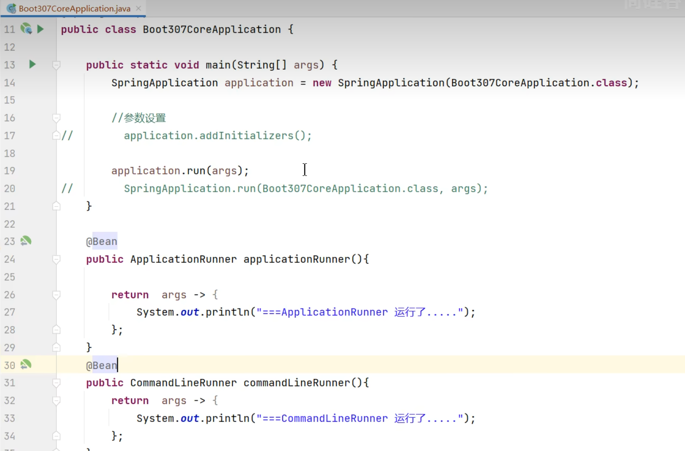
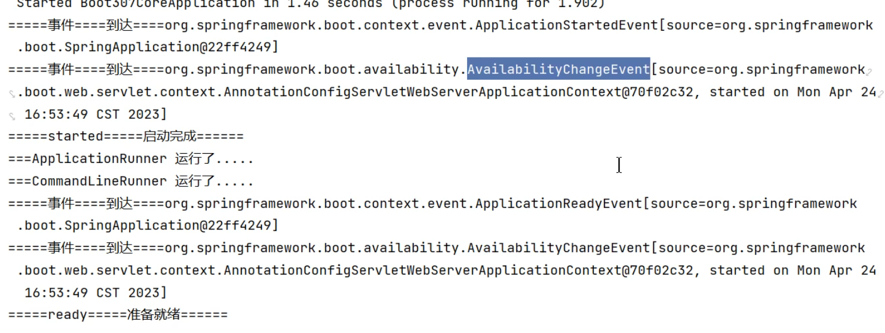


最佳实战：
- 如果项目启动前做事： `BootstrapRegistryInitializer` 和 `ApplicationContextInitializer`
- 如果想要在项目启动完成后做事：**<font color="#000bb">`ApplicationRunner` 和 `CommandLineRunner`</font>**
- **<font color="#000bb">如果要干涉生命周期做事</font>**：`SpringApplicationRunListener`
- **<font color="#000bb">如果想要用事件机制</font>**：`ApplicationListener`


### 2. 完整触发流程
`9大事件`触发顺序&时机

1. `ApplicationStartingEvent`：应用启动但未做任何事情, 除过注册listeners and initializers.
2. `ApplicationEnvironmentPreparedEvent`：  Environment 准备好，但context 未创建.
3. `ApplicationContextInitializedEvent`: ApplicationContext 准备好，ApplicationContextInitializers 调用，但是任何bean未加载
4. `ApplicationPreparedEvent`： 容器刷新之前，bean定义信息加载
5. `ApplicationStartedEvent`： 容器刷新完成， runner未调用
=========以下就开始插入了**探针机制**============
6. `AvailabilityChangeEvent`： `LivenessState.CORRECT`应用存活； **存活探针**
7. `ApplicationReadyEvent`: 任何runner被调用
8. `AvailabilityChangeEvent`：`ReadinessState.ACCEPTING_TRAFFIC` **就绪探针**，可以接请求
9.  `ApplicationFailedEvent` ：启动出错
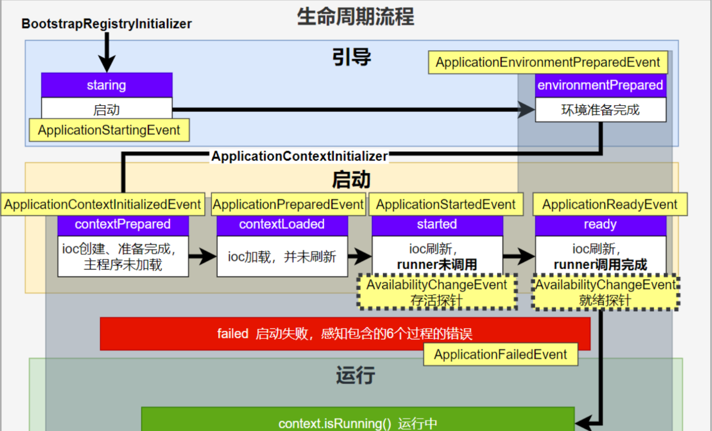
 应用事件发送顺序如下：
 

感知应用是否 **存活了** ：可能植物状态，虽然活着但是不能处理请求。
应用是否 **就绪** 了：能响应请求，说明确实活的比较好。


### 3. SpringBoot 事件驱动开发
[springboot事件驱动开发讲解](https://www.bilibili.com/video/BV1Es4y1q7Bf/?p=61&spm_id_from=pageDriver&vd_source=da8c316450987e3173a62ba5ea9acd61)
> **应用启动过程生命周期事件感知（9大事件）、应用运行中事件感知（无数种）。**

- **事件发布** ：`ApplicationEventPublisherAware`或`注入：ApplicationEventMulticaster`
- **事件监听 **：`组件 + @EventListener`


**之前只能通过Controller类中注入数个Service然后利用他们的方法进行功能实现** 


> 事件发布者
```java
@Service
public class EventPublisher implements ApplicationEventPublisherAware {

    /**
     * 底层发送事件用的组件，SpringBoot会通过ApplicationEventPublisherAware接口自动注入给我们
     * 事件是广播出去的。所有监听这个事件的监听器都可以收到
     */
    ApplicationEventPublisher applicationEventPublisher;

    /**
     * 所有事件都可以发
     * @param event
     */
    public void sendEvent(ApplicationEvent event) {
        //调用底层API发送事件
        applicationEventPublisher.publishEvent(event);
    }

    /**
     * 会被自动调用，把真正发事件的底层组组件给我们注入进来
     * @param applicationEventPublisher event publisher to be used by this object
     */
    @Override
    public void setApplicationEventPublisher(ApplicationEventPublisher applicationEventPublisher) {
        this.applicationEventPublisher = applicationEventPublisher;
    }
}
```

> 事件订阅者

**实现接口的写法——> 更推荐下面的使用自定义方法和注解的方法**
```java
@Service
public class StealService implements ApplicationListener<LoginSuccessEvent> {

    public void steal(UserEntity userEntity){
        System.out.println("-------盗号成功---------");
        System.out.println(userEntity.getUserName() + ":" + userEntity.getPassword());
    }

    @Override
    public void onApplicationEvent(LoginSuccessEvent event) {
        System.out.println("StealService=====  收到事件  =======");
        UserEntity userEntity = (UserEntity) event.getSource();
        steal(userEntity);
    }
}
```
**使用自定义方法和注解的方法**
```java
@Service
public class CouponService {

    @Order(1)
    @EventListener
    public void onEvent(LoginSuccessEvent loginSuccessEvent){
        System.out.println("===== CouponService ====感知到事件"+loginSuccessEvent);
        UserEntity source = (UserEntity) loginSuccessEvent.getSource();
        sendCoupon(source.getUsername());
    }

    public void sendCoupon(String username){
        System.out.println(username + " 随机得到了一张优惠券");
    }
}
```

# 2. 自动配置原理
## 2.1. 入门理解
应用关注的三大核心：场景、配置、组件
### 2.1.1. 自动配置流程
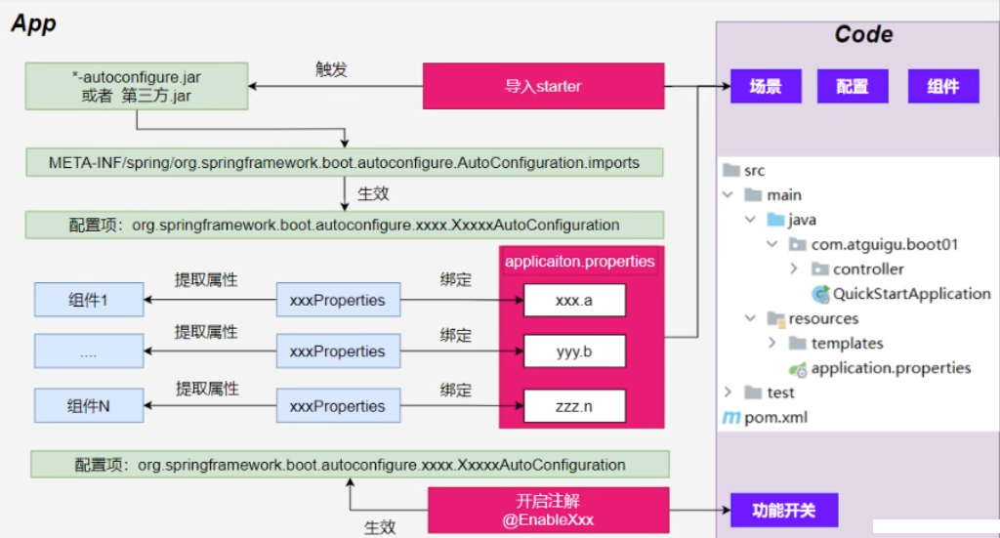

1. 导入`starter`
2. 依赖导入`autoconfigure`
3. 寻找类路径下 `META-INF/spring/org.springframework.boot.autoconfigure.AutoConfiguration.imports`文件
4. 启动，加载所有 `自动配置类` `xxxAutoConfiguration`
    a. 给容器中配置 **功能**`组件`
    b. `组件参数`绑定到 `属性类`中。`xxxProperties`
    c. `属性类`和`配置文件`前缀项绑定
    d. `@Contional派生的条件注解`进行判断 **是否组件生效**
5. 效果：
    a. 修改配置文件，修改底层参数
    b. 所有场景自动配置好直接使用
    c. 可以注入SpringBoot配置好的组件随时使用

### 2.1.2. SPI机制
>- **<font color="#bb000">Java中的SPI（Service Provider Interface）是一种软件设计模式，用于</font><font color="#000bb">在应用程序中动态地发现和加载组件。</font>** **SPI的思想** 是，定义一个接口或抽象类，然后通过在`classpath`中定义实现该接口的类来实现对组件的动态发现和加载。
>- SPI的主要目的是解决在应用程序中使用可插拔组件的问题。例如，一个应用程序可能需要使用不同的日志框架或数据库连接池，但是这些组件的选择可能取决于运行时的条件。通过使用SPI，应用程序可以在运行时发现并加载适当的组件，而无需在代码中硬编码这些组件的实现类。
>- 在Java中，**SPI** 的实现方式是通过在`META-INF/services`目录下创建一个以服务接口全限定名为名字的文件，文件中包含实现该服务接口的类的全限定名。当应用程序启动时，Java的SPI机制会自动扫描`classpath`中的这些文件，并根据文件中指定的类名来加载实现类。
>- 通过使用SPI，应用程序可以实现更灵活、可扩展的架构，同时也可以避免硬编码依赖关系和增加代码的可维护性。
>以上回答来自`ChatGPT-3.5`

在`SpringBoot`中，`META-INF/spring/org.springframework.boot.autoconfigure.AutoConfiguration.imports`


### 2.1.3. 功能开关
- 自动配置：全部都配置好，什么都不用管。   自动批量导入
  - 项目一启动，`spi`文件中指定的所有都加载。
- `@EnableXxxx`：手动控制哪些功能的开启； 手动导入。
  - 开启xxx功能
  - 都是利用 **@Import 把此功能要用的组件导入进去**


## 2.2. 进阶理解
### 2.2.1. `@SpringBootApplication`
**1. `@SpringBootConfiguration`**

就是： @Configuration ，容器中的组件，配置类。spring ioc启动就会加载创建这个类对象


**2. `@EnableAutoConfiguration`：开启自动配置**

**开启自动配置 [具体细节分析——>第二节](https://blog.csdn.net/weixin_44981126/article/details/131485715?spm=1001.2014.3001.5502)**


**3. `@AutoConfigurationPackage`：扫描主程序包：加载自己的组件**

- 利用 `@Import(AutoConfigurationPackages.Registrar.class)` 想要给容器中导入组件（获取主程序的信息，然后通过注册方法批量注册）。
- 把主程序所在的 **包** 的所有组件导入进来。
- **为什么`SpringBoot`默认只扫描主程序所在的包及其子包**

**4. `@Import(AutoConfigurationImportSelector.class)`：加载所有自动配置类：加载starter导入的组件**

```java
		List<String> configurations = ImportCandidates.load(AutoConfiguration.class, getBeanClassLoader())
			.getCandidates();
```
> 扫描SPI文件：`META-INF/spring/org.springframework.boot.autoconfigure.AutoConfiguration.imports`

**5. `@ComponentScan`**

> 组件扫描：排除一些组件（哪些不要）
> 排除前面已经扫描进来的`配置类`、和`自动配置类`。

```java
@ComponentScan(excludeFilters = { @Filter(type = FilterType.CUSTOM, classes = TypeExcludeFilter.class),
      @Filter(type = FilterType.CUSTOM, classes = AutoConfigurationExcludeFilter.class) })
```


### 2. 完整启动加载流程

> 生命周期启动加载流程
> 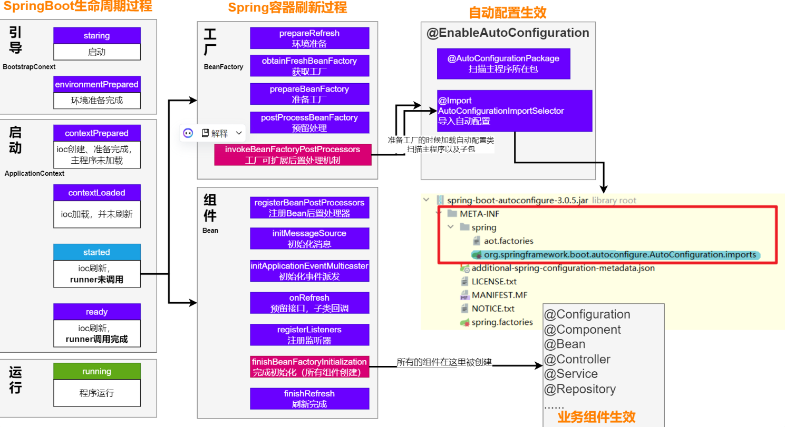
# 3. 自定义starter
>场景：**抽取聊天机器人场景，它可以打招呼。**
>效果：任何项目导入此`starter`都具有打招呼功能，并且 **问候语** 中的人名需要可以在 **配置文件** 中修改

- 1. 创建`自定义starter`项目，引入`spring-boot-starter`基础依赖
- 2. 编写模块功能，引入模块所有需要的依赖。
- 3. 编写`xxxAutoConfiguration`自动配置类，帮其他项目导入这个模块需要的所有组件
- 4. 编写配置文件`META-INF/spring/org.springframework.boot.autoconfigure.AutoConfiguration.imports`指定启动需要加载的自动配置
- 5. 其他项目引入即可使用


## 1. 业务代码
**自定义配置有提示。导入以下依赖重启项目，再写配置文件就有提示**

```java
@ConfigurationProperties(prefix = "robot")  //此属性类和配置文件指定前缀绑定
@Component
@Data
public class RobotProperties {

    private String name;
    private String age;
    private String email;
}
```

```xml
<!--        导入配置处理器，配置文件自定义的properties配置都会有提示-->
        <dependency>
            <groupId>org.springframework.boot</groupId>
            <artifactId>spring-boot-configuration-processor</artifactId>
            <optional>true</optional>
        </dependency>
```

## 2. 基本抽取
- 创建starter项目，把公共代码需要的所有依赖导入
- 把公共代码复制进来
- 自己写一个 `RobotAutoConfiguration`，给容器中导入这个场景需要的所有组件
  - 为什么这些组件默认不会扫描进去？
  - **starter所在的包和 引入它的项目的主程序所在的包不是父子层级**
- 别人引用这个`starter`，直接导入这个 `RobotAutoConfiguration`,就能把这个场景的组件导入进来
- 功能生效。
- 测试编写配置文件

## 3. 使用@EnableXxx机制

```java
@Retention(RetentionPolicy.RUNTIME)
@Target({ElementType.TYPE})
@Documented
@Import(RobotAutoConfiguration.class)
public @interface EnableRobot {


}
```
别人引入`starter`需要使用 `@EnableRobot` 开启功能  

## 4. 完全自动配置
- 依赖SpringBoot的SPI机制
- **<font color="#bb000">META-INF/spring/org.springframework.boot.autoconfigure.AutoConfiguration.imports 文件中编写好我们自动配置类的全类名即可</font>**
- **<font color="#bb000">项目启动，自动加载我们的自动配置类</font>**