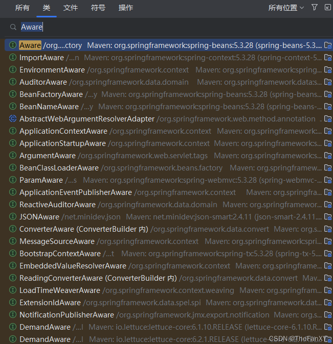

# 2 SpringBoot3【② 常用注解】

> SpringBoot摒弃XML配置方式，改为全注解驱动

## 1. 组件注册

**@Configuration、@SpringBootConfiguration
@Bean、@Scope
@Controller、 @Service、@Repository、@Component
@Import**
**@ComponentScan**

以前的步骤：通过spring配置文件，如果纯xml配置，需要写Bean对象，唯一标识id，全类名，然后通过set注入或者其他注入方式注入默认属性值

现在的步骤：
**1、`@Configuration` 编写一个配置类(`配置类其实也会被存入IOC容器`，可以通过ctrl + 左键点击这个注解发现内嵌了`@Component`注解)。其实也可以使用上面的`@SpringBootConfiguration`注解，本质其实一样，所以Spring相关的核心配置使用SpringBoot的，而通用配置使用默认的**

**2、在配置类中，自定义方法给容器中注册组件。配合`@Bean`。如果是第三方的我们直接根据类型，写入为配置类的方法，返回它的类型，然后直接`return new出来的对象`**

**2.1、`@Configuration`注解`spring 5.2`以后多了属性 `proxyBeanMethods`，可以设置为`true`或者`false`，默认为`true`（效果代表：是不是代理`Bean`的方法），如果为`true`说明为代理对象调用方法，我们在获取这个对象的时候，会从容器检查有没有这个类的对象，有就拿，没有就创建 (`保持组件单实例`)。主要用于解决组件依赖问题。**

​	**当不更改这个值，组件在配置类配置依赖可以直接通过`set`方法然后传入配置类的其他组件的注入方法(即带有`@Bean`的方法)。我们不想有这种依赖关系，设置成`false`就是轻量级模式。测试设置为`false`对于单个`Bean`从容器获取多次还是单实例的，但依赖的情况下，`Bean`内部其他的`Bean`就不是`ioc容器`的那个了，而是一个新`new`的。**

**3、或使用`@Import` 导入第三方的组件（`可以写在组件类(@Conponent，@Controller等)或者配置类上面，与配置类的注解放在一起`），在括号中写对应类的 `.class`字节码文件（默认value值，不用写属性，且是一个数组(`可以一次导入多个组件到容器`)）。或者我们可以使用全类名（`推荐`：<font color="dd000">其实不管怎么样默认ioc容器注入的组件的id名称仍是全类名。</font><font color="0000dd">因为我们开发过程中可能会修改依赖，而如果导入IOC的时候如果删掉之前一些现在用不到的依赖，这种情况下，本身靠字符串的全类名不会引起报错，但是使用字节码文件的时候不存在这个类会大面积报错</font>），对应name属性**

## 2. 条件注解

> 如果注解指定的条件成立，则触发指定行为 **<font color="bb000">能写在配置类，写了组件注解的类或者是配置类内部的@Bean方法上</font>**

**`@ConditionalOnXxx`
@ConditionalOnClass：如果类路径中存在这个类，则触发指定行为
@ConditionalOnMissingClass：如果类路径中不存在这个类，则触发指定行为
@ConditionalOnBean：如果容器中存在这个Bean（组件），则触发指定行为
@ConditionalOnMissingBean：如果容器中不存在这个Bean（组件），则触发指定行为**

>场景：
>● 如果存在`FastsqlException`这个类，给容器中放一个`Cat`组件，名cat01，
>● 否则，就给容器中放一个`Dog`组件，名dog01
>● 如果系统中有`dog01`这个组件，就给容器中放一个 User组件，名zhangsan 
>● 否则，就放一个User，名叫lisi

**自定义去实现`Condition`接口，然后自己写规则**

**@ConditionalOnBean（value=组件类型，name=组件名字）：判断容器中是否有这个类型的组件，并且名字是指定的值**

@ConditionalOnRepositoryType (org.springframework.boot.autoconfigure.data)
@ConditionalOnDefaultWebSecurity (org.springframework.boot.autoconfigure.security)
@ConditionalOnSingleCandidate (org.springframework.boot.autoconfigure.condition)
@ConditionalOnWebApplication (org.springframework.boot.autoconfigure.condition)
@ConditionalOnWarDeployment (org.springframework.boot.autoconfigure.condition)
@ConditionalOnJndi (org.springframework.boot.autoconfigure.condition)
@ConditionalOnResource (org.springframework.boot.autoconfigure.condition)
@ConditionalOnExpression (org.springframework.boot.autoconfigure.condition)
<font color="#0000dd">**@ConditionalOnClass (org.springframework.boot.autoconfigure.condition)**</font>
@ConditionalOnEnabledResourceChain (org.springframework.boot.autoconfigure.web)
<font color="#0000dd">**@ConditionalOnMissingClass(org.springframework.boot.autoconfigure.condition)** </font>
@ConditionalOnNotWebApplication (org.springframework.boot.autoconfigure.condition)
@ConditionalOnProperty (org.springframework.boot.autoconfigure.condition)
@ConditionalOnCloudPlatform (org.springframework.boot.autoconfigure.condition)
<font color="#0000dd">**@ConditionalOnBean(org.springframework.boot.autoconfigure.condition)** </font> 
<font color="#0000dd">**@ConditionalOnMissingBean(org.springframework.boot.autoconfigure.condition)** </font>  
@ConditionalOnMissingFilterBean (org.springframework.boot.autoconfigure.web.servlet)
@Profile (org.springframework.context.annotation)
@ConditionalOnInitializedRestarter (org.springframework.boot.devtools.restart)
@ConditionalOnGraphQlSchema (org.springframework.boot.autoconfigure.graphql)
@ConditionalOnJava (org.springframework.boot.autoconfigure.condition)

## 3. 属性绑定

1. **方法① ：**<font color="#0000dd">**@ConfigurationProperties： 声明组件的属性和配置文件哪些前缀开始项进行绑定，可以写在组件Bean上，也可以写到配置类中的配置Bean的方法上** </font>  
   - 将容器中 **任意组件（Bean）的属性值** 和 **配置文件** 的配置项的值 **进行绑定**
     - **1、给容器中注册组件**
       - **①在配置类外使用`@ConfigurationProperties`结合`@Component`，<font color="#dd0000">配置类内无需写任何方法</font>**
       - **②配置类内使用`@Bean`结合`@ConfigurationProperties`，<font color="#dd0000">配置类外不用写任何注解</font>**
     - **2、使用 <font color="#0000dd">@ConfigurationProperties 声明组件和配置文件的哪些配置项进行绑定</font>**


2. **方法② ：** <font color="#0000dd">**@EnableConfigurationProperties：快速注册注解<font color="dd000">(这是写于配置类上的注解，使用@Import注解导入的Bean不会进行属性绑定)</font>** </font>  
   - 场景：SpringBoot **默认只扫描自己主程序所在的包** 。如果导入 **第三方包**，**即使组件上标注了 @Component、@ConfigurationProperties 注解，也没用** 。因为组件都扫描不进来，此时使用这个注解就可以 **快速进行属性绑定并把组件注册进容器**

## 4. @Scope

```java
@Target({ElementType.TYPE, ElementType.METHOD})
@Retention(RetentionPolicy.RUNTIME)
@Documented
public @interface Scope {
    
   @AliasFor("scopeName")
   String value() default "";
 
   @AliasFor("value")
   String scopeName() default "";
   
   ScopedProxyMode proxyMode() default ScopedProxyMode.DEFAULT;
}
```

**scopeName**
scopeName是为了声明Bean的作用域，在Spring4.2版本以前，有`singleton`, `prototype`两种模式，4.2之后新加了web作用域（`request`, `session`, `globalsession`）。

`singleton`： **单例模式**，顾名思义即Spring IOC容器对于一个Bean，只会有一个共享的Bean实例。这一个单一的实例会被存储到单例缓存（singleton cache）中，当有请求或者是引用时，IOC容器都会返回存储在singleton cache的同一个实例。

`prototype`： **多实例模式**，即当每次客户端向容器获取Bean的时候，IOC容器都会新建一个实例并返回。与单例不同的是，在IOC容器启动的时候并不会创建Bean的实例，并且在有请求创建Bean实例之后也不会管理该实例的生命周期，而是由客户端自行处理。

`request`：web应用针对每一次HTTP请求都会创建一个新的Bean实例，且该实例仅在该次HTTP请求有效。

`session`：针对每一个session会创建一个Bean实例，且生命周期为该session有效期间。

`globalsession`:仅基于portlet的web应用才有意义，否则可以当作session使用。

这五种scopeName的使用方法 (**也可以直接写对应的字符串，无视大小写**)

```java
@Scope(scopeName = ConfigurableBeanFactory.SCOPE_SINGLETON)
@Scope(scopeName = ConfigurableBeanFactory.SCOPE_PROTOTYPE)
@Scope(scopeName = WebApplicationContext.SCOPE_REQUEST)
@Scope(scopeName = WebApplicationContext.SCOPE_SESSION)
@Scope(scopeName = "globalSession")
```

**ScopeProxyMode**
`proxyMode`表明了`@Scope`注解的Bean是否需要代理。

- `DEFAULT`：proxyMode的默认值，一般情况下等同于NO，即不需要动态代理。
- `NO`：不需要动态代理，即返回的是Bean的实例对象。
- `INTERFACES`：代理的对象是一个接口，即@Scope的作用对象是接口，这种情况是基于jdk实现的动态代理。
- `TARGET_CLASS`：代理的对象是一个类，即@Scope的作用对象是一个类，是以生成目标类扩展的方式创建代理，基于CGLib实现动态代理。 [我的Spring6笔记，可以复习动态代理的知识](https://blog.csdn.net/weixin_44981126/article/details/130967125?spm=1001.2014.3001.5502)

```java
@Scope(proxyMode = ScopedProxyMode.DEFAULT)
@Scope(proxyMode = ScopedProxyMode.NO)
@Scope(proxyMode = ScopedProxyMode.INTERFACES)
@Scope(proxyMode = ScopedProxyMode.TARGET_CLASS)
```

## 5. @ImportResource和@Import

如果想把别的`xml`文件的配置也导入，不想重新手写配置类和注解，可以直接在配置类或者组件类上写`@ImportResource("classpath:/xxxxxx.xml")`可以把`xml`的配置文件的组件导入`IOC`容器

`@Import`注解提供了三种用法

1. `@Import`一个普通类 spring会将该类`加载到spring容器`中，需要有`无参构造器`
2. `@Import`一个类，该类实现了`ImportBeanDefinitionRegistrar`接口，在重写的`registerBeanDefinitions`方法里面，能拿到`BeanDefinitionRegistry bd`的注册器，能手工往`beanDefinitionMap`中注册 `beanDefinition`，这种方式注册既能进行复杂的判断，也能对Bean进行生命周期和名字更改等功能 
3. `@Import`一个类 该类实现了`ImportSelector` 重写`selectImports`方法该方法返回了`String[]`数组的对象，数组里面的类都会注入到`spring容器`当中


## 6. @ComponentScan

```java
@Retention(RetentionPolicy.RUNTIME)
@Target({ElementType.TYPE})
@Documented
@Repeatable(ComponentScans.class)
public @interface ComponentScan {
    @AliasFor("basePackages")
    String[] value() default {};

    @AliasFor("value")
    String[] basePackages() default {};

    Class<?>[] basePackageClasses() default {};

    Class<? extends BeanNameGenerator> nameGenerator() default BeanNameGenerator.class;

    Class<? extends ScopeMetadataResolver> scopeResolver() default AnnotationScopeMetadataResolver.class;

    ScopedProxyMode scopedProxy() default ScopedProxyMode.DEFAULT;

    String resourcePattern() default "**/*.class";

    boolean useDefaultFilters() default true;

    Filter[] includeFilters() default {};

    Filter[] excludeFilters() default {};

    boolean lazyInit() default false;

    @Retention(RetentionPolicy.RUNTIME)
    @Target({})
    public @interface Filter {
        FilterType type() default FilterType.ANNOTATION;

        @AliasFor("classes")
        Class<?>[] value() default {};

        @AliasFor("value")
        Class<?>[] classes() default {};

        String[] pattern() default {};
    }
}
```

### 1. value

首先它的value值对应要扫描的包名，可以是一个数组，放入要扫描的包名。

### 2. excludeFilters = {@Filter(type=FilterType.xxxx, classes={xxx,xxx,xxx}) ...}

可以填入一个数组，类型为@Filter注解数组，可以排除要扫描的包。**可以按注解，或者是类的类型，或者是正则排除【几乎不用】，或者是AspectJ语法【几乎不用】**

`type=FilterType.ASSUGNABLE_TYPE` 按类型排除

如我们不扫描 `@Controller` 注解的类和 `@Service` 注解的类

这里我测试发现排除这个注解，并不会把衍生的`@RestController`注解的组件排除注册

```java
@ComponentScan(excludeFilters = {
        @ComponentScan.Filter(type = FilterType.ANNOTATION, classes = {ComponentScan.class,Service.class})
})
```

### 3. includeFilters

需要进行设置属性关闭默认扫描规则`useDefaultFilters = false`

用法和上面没有什么区别

### 4. 自定义类型扫描

定义一个类，实现`TypeFilter`接口，实现它的方法

第一个参数`metadataReader`：可以通过它获取正在扫描的类的信息：如注解，类的信息，类的资源信息。

进一步比如类名，可以用如`className.contains("xxx")`的方法去判断是否名字包含字符【其实本质不如用上面的正则】

第二个参数`metadataReaderFactory`可以获得其他的容器组件的信息

使用的时候，只需要`@Filter（type=FilterType.CUSTOM，classes={MyFilter})`指定使用我们的过滤规则

```java
public class MyFilter implements TypeFilter {
    @Override
    public boolean match(MetadataReader metadataReader, MetadataReaderFactory metadataReaderFactory) throws IOException {
        return false;
    }
}
```

## 7. @Lazy

可以给配置类中加载的Bean上加，即便是单实例Bean，也可以实现懒加载，ioc创建不加载，第一次获取才加载

## 8. FactoryBean

这里可以参考[我的Spring6学习部分的笔记](https://blog.csdn.net/weixin_44981126/article/details/130967125?spm=1001.2014.3001.5502)，大同小异，就是实现`FactoryBean`接口，然后重写方法，主要是补充：

首先，通过配置类注册`@Bean`返回工厂`Bean` 类，得到的仍是我们实现类，不是工厂。（这里已经知道了）

补充：要是想从ioc获得工厂而不是这个实现类，getBean方法输入`Bean名称字符串`，在字符串前面加 `&`符号。


## 9. Bean的生命周期

### 1. 初始化和销毁方法【栈式初始化和销毁(先初始化的后销毁)】

#### 1. xml

Bean以前在[基于xml方式的配置的方法](https://blog.csdn.net/weixin_44981126/article/details/130967125?spm=1001.2014.3001.5502)中，我们可以在xml配置参数。

**现在真的还有用 `xml` 的人吗？**


#### 2. @Bean

**而springBoot或者说注解的spring中，我们可以在`@Bean`通过同名的参数指定方法名。这些方法很重要，我们可以在一些数据源初始化的时候把很多信息注入进去。**

**别忘了`多实例Bean`是懒加载，而且每次返回`不同的Bean`，同时容器也`不帮你管理这个Bean`，`容器哪怕销毁`，也`不会`调用这个`Bean`的`destroy`，`只是可以帮你创建`，单实例被单例池引用，spring容器销毁即销毁，多实例在虚拟机GC时销毁**


#### 3. 实现`InitializingBean`和`DisposableBean`接口

**同时也可以不用这个注解，通过实现`InitializingBean`接口重写初始化方法，通过实现`DisposableBean`接口重写销毁方法。**


#### 4. 注解方式定义初始化方法和销毁方法【来自JSR250规范`来自JDK非Spring`】

**`@PostConstruct`:在`Bean`创建完成并属性赋值之后，执行初始化方法**

**`@PreDestroy`:在容器销毁之前执行销毁方法**


### 2. Bean的后置处理器: `BeanPostProcessor`【它也是个组件需要注册】

**具体的生命周期过程**

- 1 bean对象创建（调用无参构造器）
- 2 给bean对象设置属性
- 3 bean的后置处理器（初始化之前）
- 4 bean对象初始化（需在配置bean时指定初始化方法）
- 5 bean的后置处理器（初始化之后）
- 6 bean对象就绪可以使用
- 7 bean对象销毁（需在配置bean时指定销毁方法）
- 8 IOC容器关闭


#### 1. 基本使用

**实现`BeanPostProcessor`接口并重写前置方法和后置方法**

**在`Bean`的初始化前后进行一些操作。**

**bean后置处理器不是单独针对某一个bean生效，而是针对IOC容器中所有bean都会执行。**

**方法会获得`Object`类型的`Bean`实例，它的返回值是可以对参数获得的`Bean`，你可以进行包装或者是直接返回**


#### 2. 底层原理

**[至于源码部分可以看雷神的讲解](https://www.bilibili.com/video/BV1gW411W7wy?p=17&spm_id_from=pageDriver&vd_source=da8c316450987e3173a62ba5ea9acd61)，总而言之就是底层构建ioc容器的时候，在刷新12大步的时候，会给容器注入Bean，而经历`Set`属性赋值之后，会for循环遍历所有`后置处理器`，依次执行后置处理器的前置方法。**

**Spring底层用它完成了很多事情，可以利用Idea去看看它的实现类，比如之前Spring学过的一个接口，如果想给`Bean`对象获取`ioc`容器也很简单，实现`ApplicationContextAware`接口会默认让重写一个set方法，我们设置一个`ApplicationContext`类的属性，即可在后置处理器方法实现的过程中，调用`postProcessBeforeInitialization`方法给`Bean`对象注入进去。**

**如还有一个`AutowireAnnotationBeanPostProcessor`类，它就是容器帮我们进行自动装配的。<font color="bb000">可以说很多的Spring行为在底层都是基于这个后置处理器完成的</font>**

## 10. @Value

使用这个注解标注在我们的`Bean`类的字段属性上，可以进行赋值。

1. 基本数值
2. 可以写spEL:#{}【很少用】
3. 可以写${}:取出配置文件中的值【在运行环境变量中的值】

 ## 11. @PropertySource

 **使用这个注解在配置类上可以读取外部配置文件读取到环境变量中。**

**`@PropertySource`用于指定外部属性文件的位置，可以将属性文件中的属性值注入到`Spring Bean`中。它通常与`@Value`注解一起使用，将属性文件中的值注入到`单个属性`中。**

**`@ConfigurationProperties`用于将属性文件中的值绑定到`一个Java对象`上。它可以将属性文件中的`多个属性值`注入到`一个Java对象`中。与`@Value`注解不同，`@ConfigurationProperties`可以将属性文件中的值注入到多个属性中。**

## 12. @AutoWired

[详情见之前的Spring笔记有最基础的用法，其实无非就是能放到哪些地方，以及和@Qualifier的配合，默认的一些参数，比如required什么的](https://blog.csdn.net/weixin_44981126/article/details/130967125?spm=1001.2014.3001.5502)

**这里补充一下一些原理：`AutowiredAnnotationBeanPostProcessor`在`Bean`的生命周期中的后置处理器的前置方法，进行注入。同时如果组件只有一个有参构造器，不需要任何注解标注，就能从容器获取嵌套的内部组件**

### 1. @Primary

**注册多个相同类型的`Bean`，用`@Autowired`，想要指定只能通过`@Qualifier`，通过名字指定注入哪个，因为`@Autowired`是根据类型注入的，但是这么太麻烦了，我们可以在注入的组件的注入注解上再写一个`@Primary`，即可完成注入的情况，如果发现多个同类型的组件，优先把这个注入。同时这两个是可以一起使用的。**

**<font color="#bb000">@Qualifier注解的优先级高于@Primary注解。也就是说，当一个接口有多个实现类时，如果使用了@Qualifier注解指定了要注入哪个实现类，那么即使有一个实现类被标记了@Primary注解，也不会被优先选择。</font>**

### 2. @Resource和@Inject【分别是JSR250规范和JSR330规范的Java注解非Spring】

**`@Resource`默认byName注入，没有指定name时把属性名当做name，根据name找不到时，才会byType注入。byType注入时，某种类型的Bean只能有一个。但是不支持`Spring`的`@Primary`功能和`@Autowired`的`默认值`功能和`required=false`功能**

**想用`@Inject`需要专门maven依赖，和`@Autowired`功能一样，支持`@Primary`了，但是还是不支持@Autowired的`默认值`功能和`required=false`功能**

### 3. @Bean标注的方法创建对象的时候，方法参数的值从容器获取【如果有的话】

**所以我们不必这种时候写`@Autowired`注解，如果容器不存在参数写的类型的组件，IDea能识别到，并标识红色波浪号。**

## 13. 想要给Bean组件拿到Spring底层的组件: xxxxxxAware接口

**类似给Bean注入ioc容器，实现`ApplicationContextAware`接口重写set方法即可，其他组件类似。本质其实底层是靠对应的`xxxxxxxProcessor`后置处理器的`postProcessorBeforeInitialization方法`实现的**



## 14. @Profile

[这里后面的Springboot篇章讲了](https://blog.csdn.net/weixin_44981126/article/details/131526535)

**这里讲讲通过代码的方式，直接通过`ioc`容器的`getEnvironment().setActiveProfiles("xxx", "xxxx"...)`可以一次设置单个或多个激活的环境。**