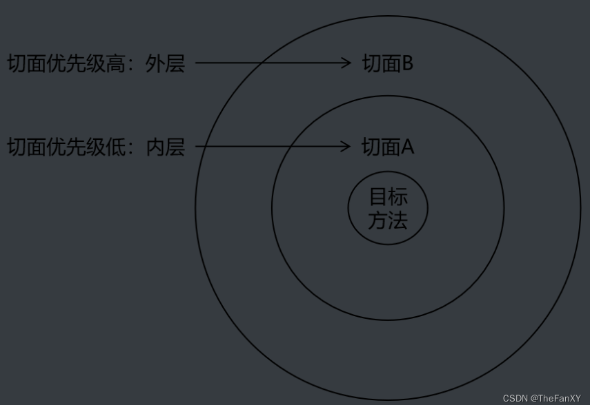

# 5 SpringBoot3【⑤ AOP源码剖析】

[我的spring6的当时学习链接可作为补充，这里感觉和SpringBoot3高度重合，而且还有很多不符合当下开发习惯的底层设置如使用xml，就没有移植本站，但有些有价值的可以去CSDN看我的spring6的笔记](https://blog.csdn.net/weixin_44981126/article/details/130967125?spm=1001.2014.3001.5502)

AOP（Aspect Oriented Programming)是一种设计思想，是软件设计领域中的面向切面编程，它是面向对象编程的一种补充和完善，**它以通过预编译方式和运行期动态代理方式实现，在不修改源代码的情况下，给程序动态统一添加额外功能的一种技术。** 利用AOP可以对业务逻辑的各个部分进行隔离，从而使得业务逻辑各部分之间的耦合度降低，提高程序的可重用性，同时提高了开发的效率。

- **前置通知**：使用`@Before`注解标识，在被代理的目标方法前执行
- **返回通知**：使用`@AfterReturning`注解标识，在被代理的目标方法成功结束后执行（寿终正寝）
- **异常通知**：使用`@AfterThrowing`注解标识，在被代理的目标方法异常结束后执行（死于非命）
- **后置通知**：使用`@After注解标识`，在被代理的目标方法最终结束后执行（盖棺定论）
- **环绕通知**：**使用`@Around注解标识`，使用`try…catch…finally`结构围绕整个被代理的目标方法，包括上面四种通知对应的所有位置。我们手动推动目标方法运行（`joinPoint.procced()`）**

**一旦给切面类写切入方法，形参如果有`JoinPoint joinPoint`必须放在第一位**

**`Springboot`想要使用的话需要引入依赖**

```xml
        <dependency>
            <groupId>org.springframework.boot</groupId>
            <artifactId>spring-boot-starter-aop</artifactId>
        </dependency>
```

**基于注解驱动的情况下，需要给注入切面类的配置文件写注解`@EnableAspectJAutoProxy`**
**在`Spring Boot`中，默认情况下，如果您的项目中存在`AOP`相关的依赖和切面类，Spring Boot会自动开启`AOP`功能，不需要显式地使用`@EnableAspectJAutoProxy`注解。**


**使用AOP实现代理之后，通过getBean方法获取的对象，它的类没有变成代理类的类，这是因为<font color="bb000">`Spring AOP`采用的是基于代理的AOP实现方式，而不是基于字节码的AOP实现方式。</font>**

**在基于代理的`AOP`实现方式中，Spring会为目标对象创建一个代理对象，代理对象和目标对象实现了相同的接口，并且<font color="bb000">代理对象中持有了目标对象的引用。</font>当我们使用`getBean`方法获取目标对象时，Spring会将代理对象返回给我们，而不是目标对象本身。这个代理对象会拦截我们调用目标对象的方法，并在执行目标对象的方法前后执行一些额外的逻辑，从而实现AOP的功能。
**

**因此，虽然我们通过`getBean`方法获取的对象看起来和原来的目标对象一样，但实际上它是一个代理对象，并且在调用它的方法时会执行AOP逻辑。如果想要获取代理对象的类，可以通过调用代理对象的getClass()方法来获取。**

**默认情况下，Spring AOP会将代理类放入IOC容器中，<font color="bb000">而不会将原始类的对象放入容器中。也就是说，如果你使用getBean()方法获取一个被AOP代理的对象，实际上获取的是代理类的实例对象，而不是原始类的实例对象。</font>**

**<font color="bb000">如果你需要将原始类的对象放入IOC容器中，可以使用AspectJ风格的AOP实现方式，并在配置中将proxyTargetClass属性设置为false。这样做会导致Spring不再使用基于代理的AOP实现方式，而是使用基于AspectJ的AOP实现方式，从而可以将原始类的对象放入IOC容器中。</font>**

**总之，Spring AOP可以将代理类和原始类的对象都放入IOC容器中，但具体如何配置取决于你的需求。**


## 0. 一些基础概念

## 0.1 切入点表达式语法

**①作用**


**②语法细节**

- 用*号代替“权限修饰符”和“返回值”部分表示“权限修饰符”和“返回值”不限
- 在包名的部分，一个“*”号只能代表包的层次结构中的一层，表示这一层是任意的。
  - 例如：*.Hello匹配`com.Hello`，不匹配`com.fanxy.Hello`
- 在包名的部分，使用“*..”表示包名任意、包的层次深度任意
- 在类名的部分，类名部分整体用*号代替，表示类名任意
- 在类名的部分，可以使用*号代替类名的一部分
  - 例如：*Service匹配所有名称以Service结尾的类或接口

- 在方法名部分，可以使用*号表示方法名任意
- 在方法名部分，可以使用*号代替方法名的一部分
  - 例如：*Operation匹配所有方法名以Operation结尾的方法

- 在方法参数列表部分，使用(..)表示参数列表任意
- 在方法参数列表部分，使用(int,..)表示参数列表以一个int类型的参数开头
- 在方法参数列表部分，基本数据类型和对应的包装类型是不一样的
  - 切入点表达式中使用 int 和实际方法中 Integer 是不匹配的
- 在方法返回值部分，如果想要明确指定一个返回值类型，那么必须同时写明权限修饰符
  - 例如：execution(public int *..*Service.*(.., int))	正确
    例如：execution(* int *..*Service.*(.., int))	错误
  - 


## 0.2 重用切入点表达式

**①声明**

```java
@Pointcut("execution(* com.fanxy.aop.annotation.*.*(..))")
public void pointCut(){}
```

**②在同一个切面中使用**

```java
@Before("pointCut()")
public void beforeMethod(JoinPoint joinPoint){
    String methodName = joinPoint.getSignature().getName();
    String args = Arrays.toString(joinPoint.getArgs());
    System.out.println("Logger-->前置通知，方法名："+methodName+"，参数："+args);
}
```

**③在不同切面中使用**

```java
@Before("com.fanxy.aop.CommonPointCut.pointCut()")
public void beforeMethod(JoinPoint joinPoint){
    String methodName = joinPoint.getSignature().getName();
    String args = Arrays.toString(joinPoint.getArgs());
    System.out.println("Logger-->前置通知，方法名："+methodName+"，参数："+args);
}
```


## 0.3 获取通知的相关信息

**①获取连接点信息**

获取连接点信息可以在通知方法的参数位置设置`JoinPoint`类型的形参

```java
@Before("execution(public int com.fanxy.aop.annotation.CalculatorImpl.*(..))")
public void beforeMethod(JoinPoint joinPoint){
    //获取连接点的签名信息
    String methodName = joinPoint.getSignature().getName();
    //获取目标方法到的实参信息
    String args = Arrays.toString(joinPoint.getArgs());
    System.out.println("Logger-->前置通知，方法名："+methodName+"，参数："+args);
}
```

**②获取目标方法的返回值**

`@AfterReturning`中的属性`returning`，用来将通知方法的某个形参，接收目标方法的返回值

```java
@AfterReturning(value = "execution(* com.fanxy.aop.annotation.CalculatorImpl.*(..))", returning = "result")
public void afterReturningMethod(JoinPoint joinPoint, Object result){
    String methodName = joinPoint.getSignature().getName();
    System.out.println("Logger-->返回通知，方法名："+methodName+"，结果："+result);
}
```

**③获取目标方法的异常**

`@AfterThrowing`中的属性`throwing`，用来将通知方法的某个形参，接收目标方法的异常

```java
@AfterThrowing(value = "execution(* com.fanxy.aop.annotation.CalculatorImpl.*(..))", throwing = "ex")
public void afterThrowingMethod(JoinPoint joinPoint, Throwable ex){
    String methodName = joinPoint.getSignature().getName();
    System.out.println("Logger-->异常通知，方法名："+methodName+"，异常："+ex);
}
```


## 0.4 环绕通知

```java
@Around("execution(* com.atguigu.aop.annotation.CalculatorImpl.*(..))")
public Object aroundMethod(ProceedingJoinPoint joinPoint){
    String methodName = joinPoint.getSignature().getName();
    String args = Arrays.toString(joinPoint.getArgs());
    Object result = null;
    try {
        System.out.println("环绕通知-->目标对象方法执行之前");
        //目标方法的执行，目标方法的返回值一定要返回给外界调用者
        result = joinPoint.proceed();
        System.out.println("环绕通知-->目标对象方法返回值之后");
    } catch (Throwable throwable) {
        throwable.printStackTrace();
        System.out.println("环绕通知-->目标对象方法出现异常时");
    } finally {
        System.out.println("环绕通知-->目标对象方法执行完毕");
    }
    return result;
}
```


## 0.5 切面的优先级

相同目标方法上同时存在多个切面时，切面的优先级控制切面的 **内外嵌套** 顺序。

- 优先级高的切面：外面
- 优先级低的切面：里面

使用@Order注解可以控制切面的优先级：

- @Order(较小的数)：优先级高
- @Order(较大的数)：优先级低




## 1. AOP原理

```java
@Target({ElementType.TYPE})
@Retention(RetentionPolicy.RUNTIME)
@Documented
@Import({AspectJAutoProxyRegistrar.class})
public @interface EnableAspectJAutoProxy {
    boolean proxyTargetClass() default false;

    boolean exposeProxy() default false;
}
```

**它给容器导入了组件`AspectJAutoProxyRegistrar.class`
这个组件实现了`ImportBeanDefinitionRegistrar`，可以跳回上面复习`@Import`的四种导入，实现这个接口可以自定义导入组件
利用它自定义给容器注入了一个`Bean`
`internalAutoProxyCreator=AnnotationAwareAspectJAutoProxyCreator`
基于注解驱动的`AspectJ`的切面代理创造器**

```java
class AspectJAutoProxyRegistrar implements ImportBeanDefinitionRegistrar {}
```

**它的继承关系很复杂，主要关注祖宗接口有一个后置处理器的接口(在`Bean`初始化前后做事情)，还有一个`BeanFactoryAware`接口，那就说明它能自动装配`BeanFactory`**

### 1.1 文字流程【这里结合下面的`ioc`容器原理更容易理解】

[不懂就去看视频吧，雷神的源码级别讲解，面面俱到](https://www.bilibili.com/video/BV1gW411W7wy/?p=31&spm_id_from=pageDriver&vd_source=da8c316450987e3173a62ba5ea9acd61)

1. **传入配置类，创建`ioc`容器**
2. **注册配置类，调用`refresh()`刷新容器**
3. **刷新十二大步中的`registerBeanPostProcessors(beanFactory)`注册`Bean`的后置处理器，方便拦截`Bean`的创建**
   1. **先获取`ioc`容器已经定义了的需要创建对象的所有`BeanPostProcessor`【为什么已经有了定义的后置处理器其实来源于第一步传入配置类的时候，`@EnableAspectJAutoProxy`注解已经通过上面说的`@Import`把后置处理器】**
   2. **还给容器加入了别的`BeanPostProcessor`，同时对他们分类放入了不同容器，如是否实现`Ordered`接口可以排序之类的**
   3. **优先注册实现了`PriorityOrdered`接口的`BeanPostProcessor`**
   4. **然后注册实现了`Ordered`接口的`BeanPostProcessor`**
   5. **最后注册剩下的**
   6. **注册`BeanPostProcessor`，实际上就是创建`BeanPostProcessor`对象保存在容器中，创建`internalAutoProxyCreator`的`BeanPostProcessor`【`AnnotationAwareAspectJAutoProxyCreator`】**
      1. **创建`Bean`的实例**
      2. **`populateBean`:给`Bean`的各种属性赋值**
      3. **`initializeBean`:初始化`Bean`【`Bean`后置处理器就是在这前后行动的】**
         1. **`invokeAwareMethods()`：处理`Aware`接口的方法回调**
         2. **`applyBeanPostProcessorsBeforeInitialiization`应用后置处理器的前置方法**
         3. **`invokeInitMethods()`执行自定义的初始化方法，在此期间将前面说的工厂初始化并注入容器了**
         4. **`applyBeanPostProcessorsAfterInitialiization`应用后置处理器的后置方法**
      4. **`BeanPostProcessor（AnnotationAwareAspectJAutoProxyCreator）`创建成功**
   7. **把`BeanPostProcessor`注册到`BeanFactory`中**
4. 【以上是创建和注册`AnnotationAwareAspectJAutoProxyCreator`的过程】
5. **完成`BeanFactory`的初始化工作后，接着来到了`IOC`容器的`refresh`的新的大步`finishBeanFactoryInitialization(beanFactory)`，注册单实例`Bean`**
   1. 遍历获取容器所有的`Bean`依次创建对象`getBean(beanName)` `-> getBean -> doGetBean -> getSingleton()`
   2. 创建`Bean`
      1. **先从缓存看有没有，没有就创建【`Spring实现单实例的原则：通过缓存机制`】**
      2. **`createBean()` `AnnotationAwareAspectJAutoProxyCreator`会在任何`Bean`创建之前先尝试返回`Bean`的实例**
         1. **`resolveBeforeInstantiation(beanName, mbdToUse)`解析后置处理器前置方法，希望后置处理器能在此返回一个代理对象，如果能返回就返回，如果不能就到下一步。【后置处理器是在Bean对象创建完成初始化前后调用的】【而`InstantiationAwareBeanPostProcessor`是在创建`Bean`实例之前就先尝试用后置处理器返回对象】** 
         2. **`doCreateBean(beanName, mbdToUse, args)`真正的创建一个`Bean`实例，和3.6流程一致**

**总而言之，就是通过注入一个特别的【后置处理器】，专门在【普通Bean】实例化之前，拦截它们的创建，先尝试用它试着去创建**

**`AnnotationAwareAspectJAutoProxyCreator`【`InstantiationAwareBeanPostProcessor`】的作用：**

1. **每个`Bean`创建之前，调用`postProcessBeforeInstantiation()`方法**
   1. **判断当前`Bean`是否在`adviseBeans`中（保存了所有需要增强的`Bean`）**
   2. **判断当前`Bean`是否是基础类型的`Advice,Pointcut,Advisor,AopInfrastructureBean`或者看看是否是切面类。判断方法无非就是通过类型或者是注解之类的反射原理**
   3. **判断是否需要跳过**
      1. **获取候选增强器【切面里面的通知方法】【`List<Advisor> candidateAdvisors`】每一个封装的通知方法的增强器是`InstantialtionModelAwarePointcutAdvisor`。判断每个增强器是否是`AAspectJPointcutAdvisor`类型；返回true**
      2. **永远返回`false`**
2. **创建对象`postProcessAfterInitialization` 有需要的情况下包装`return wrapIfNecessary(bean,beanName,cacheKey)`**
   1. **获取当前`Bean`所有的增强器【通知方法】**
      1. **找到候选的所有增强器【找哪些通知方法需要切入当前Bean方法】**
      2. **获取能在Bean使用的增强器**
      3. **给增强器排序**
   2. **保持当前`Bean`到`advisedBeans`中**
   3. **如果当前`Bean`需要增强，创建它的代理对象**
      1. **`获取所有增强器【通知方法】`**
      2. **保存到`proxyFactory`**
      3. **创建代理对象：Spring自己决定【看是否实现接口】**
         1. **JDK动态代理**
         2. **cglib动态代理**
   4. **给容器返回当前增强之后的代理组件**
   5. **以后容器中获取的对象就是这个组件的代理对象，执行目标方法的时候，代理对象就会执行通知方法的流程**

## 1.2 目标方法的执行

1. **容器保存了组建的代理对象（cglib增强之后的对象），这个对象里面保存了详细信息【比如增强器，目标对象，xxx】**

2. **`CglibAopProxy.intercept()`拦截目标方法的执行**

3. **根据ProxyFactory对象获取将要执行的目标方法拦截器链**
   1. **获取所有的拦截器和增强器**
   2. **遍历所有增强器，转为类型拦截器，然后统一放到一个集合**

4. **如果没有拦截器链，直接执行目标方法**

5. **如果有拦截器链，把需要执行的目标对象，目标方法，拦截器链等信息传入创建一个`CglibMethodInvocation`对象，并调用`mi.proceed()`方法，这个方法返回一个Object对象，会处理这个返回值**

6. **执行逻辑类似mvc的，也成功一次索引加一，每个拦截器等待下一个拦截器执行完成返回以后再来执行，`这个执行顺序Spring5.3之后变了，先异常或返回，最后是后置`**

   


## 2. AOP原理总结

1. **`@EnableAspectJAutoProxy` 在配置类开启AOP功能【springboot中隐式开启】**
2. **`@EnableAspectJAutoProxy`会给容器注入一个组件`AnnotationAwareAspectJAutoProxtyCreator`，这是一个后置处理器**
3. **容器的创建流程【`refresh()`】**
   1. **`registerBeanPostProcessors()`注册后置处理器，创建`AnnotationAwareAspectJAutoProxtyCreator`**
   2. **`finishBeanFactoryInitialization()`初始化剩下的单实例`Bean`**
      1. **创建业务逻辑组件和切面组件**
      2. **`AnnotationAwareAspectJAutoProxtyCreator`拦截组件的创建过程**
      3. **组件创建完之后，判断组件是否需要包装**
         1. 是：切面的通知方法包装成增强器（`Advisor`），给业务逻辑组件创建代理对象
4. 执行目标方法
   1. 代理对象执行目标方法
   2. `CglibAopProxy.intercept()`
      1. 得到目标丰富的拦截器链（增强器包装成拦截器`MethodInterceptor`）
      2. 利用拦截器的链式机制，依次进入每个拦截器进行执行【见上面的执行顺序】