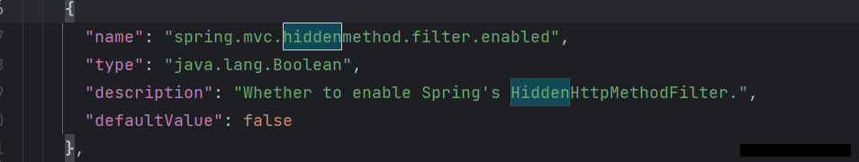
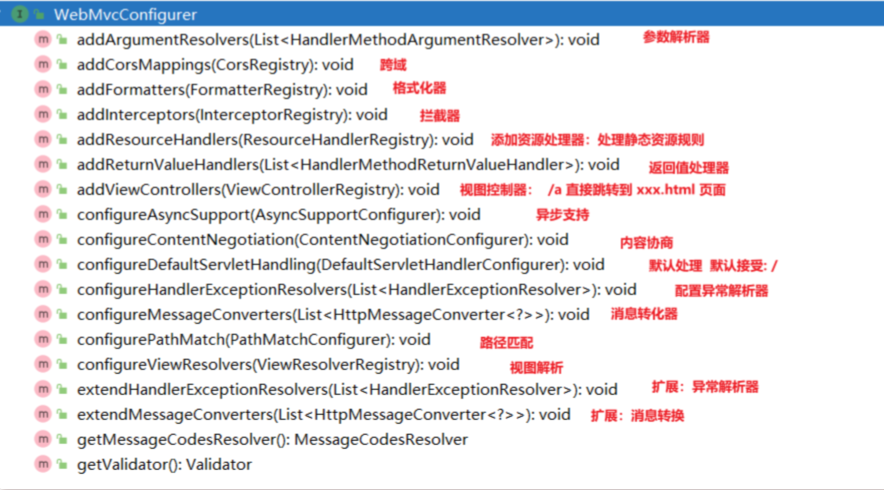

# 6 SpringBoot3【⑥ WebMvcAutoConfiguration原理】

## 6.1 原理剖析

> SpringBoot的Web开发能力，由SpringMVC提供。

### 1. 生效条件

```java
@AutoConfiguration(after = { DispatcherServletAutoConfiguration.class, TaskExecutionAutoConfiguration.class,
		ValidationAutoConfiguration.class }) //在这些自动配置之后
@ConditionalOnWebApplication(type = Type.SERVLET) //如果是web应用就生效，类型SERVLET、REACTIVE 响应式web
@ConditionalOnClass({ Servlet.class, DispatcherServlet.class, WebMvcConfigurer.class })
@ConditionalOnMissingBean(WebMvcConfigurationSupport.class) //容器中没有这个Bean，才生效。默认就是没有
@AutoConfigureOrder(Ordered.HIGHEST_PRECEDENCE + 10)//优先级
@ImportRuntimeHints(WebResourcesRuntimeHints.class)//一些指标统计不用管
public class WebMvcAutoConfiguration { 
}
```

### 2. 效果——>看@Bean注入的组件

1. 放了两个Filter：
   - a. **`HiddenHttpMethodFilter`；页面表单提交Rest请求（GET、POST、PUT、DELETE）`有些版本并没有默认开启` [我的springMVC笔记，复习RestFul部分](https://www.fanxy.cloud/archives/SpringMVC-3)也就是说在不支持真实PUT，DELETE请求的地方，可以通过这种包装类的方式伪造一个REST风格的请求**
   - 


   - b. **`FormContentFilter`： 表单内容Filter，GET（数据放URL后面）、POST（数据放请求体）请求可以携带数据，PUT、DELETE 的请求体数据会被忽略，为了让Tomcat服务器不忽略它们携带的数据，使用它可以不被忽略**

2. **给容器中放了`WebMvcConfigurer`组件；给SpringMVC添加各种定制功能**
   - a. **所有的功能最终会和配置文件进行绑定**
   - b. **WebMvcProperties： `spring.mvc`配置文件**
   - c. **WebProperties： `spring.web`配置文件**

```java
	@Configuration(proxyBeanMethods = false)
	@Import(EnableWebMvcConfiguration.class) //额外导入了其他配置
	@EnableConfigurationProperties({ WebMvcProperties.class, WebProperties.class })
	@Order(0)
	public static class WebMvcAutoConfigurationAdapter implements WebMvcConfigurer, ServletContextAware{
        
    }
```

**只有一个有参构造器，而容器中的组件的构造器和方法的值如果容器中有会自动从容器里取。**

```java
		public WebMvcAutoConfigurationAdapter(WebProperties webProperties, WebMvcProperties mvcProperties,
				ListableBeanFactory beanFactory, ObjectProvider<HttpMessageConverters> messageConvertersProvider,
				ObjectProvider<ResourceHandlerRegistrationCustomizer> resourceHandlerRegistrationCustomizerProvider,
				ObjectProvider<DispatcherServletPath> dispatcherServletPath,
				ObjectProvider<ServletRegistrationBean<?>> servletRegistrations) {
			this.resourceProperties = webProperties.getResources();
			this.mvcProperties = mvcProperties;
			this.beanFactory = beanFactory;
			this.messageConvertersProvider = messageConvertersProvider;
			this.resourceHandlerRegistrationCustomizer = resourceHandlerRegistrationCustomizerProvider.getIfAvailable();
			this.dispatcherServletPath = dispatcherServletPath;
			this.servletRegistrations = servletRegistrations;
			this.mvcProperties.checkConfiguration();
		}
```

### 3. WebMvcConfigurer接口

提供了配置SpringMVC底层的所有组件入口



1. 参数解析器：SpringMVC的组件里面的参数自动获取需要从ioc获取
2. 跨域：用于前后端分离
3. 格式化器：如从配置文件的日期字节流读成规定格式的如Date类型的数据
4. 拦截器：SpringMVC的拦截器，[我的SpringMVC拦截器笔记](https://www.fanxy.cloud/archives/SpringMVC-6)
5. 资源处理器：处理静态资源规则
6. 视图控制器：springmvc学过，不写Controller方法，直接在配置文件里写的一些网页，如index
7. 消息转化器：做消息转化用的，一般不用管

### 4. 静态资源规则源码

```java
@Override
public void addResourceHandlers(ResourceHandlerRegistry registry) {
    if (!this.resourceProperties.isAddMappings()) {
        logger.debug("Default resource handling disabled");
        return;
    }
    //1、
    addResourceHandler(registry, this.mvcProperties.getWebjarsPathPattern(),
            "classpath:/META-INF/resources/webjars/");
    addResourceHandler(registry, this.mvcProperties.getStaticPathPattern(), (registration) -> {
        registration.addResourceLocations(this.resourceProperties.getStaticLocations());
        if (this.servletContext != null) {
            ServletContextResource resource = new ServletContextResource(this.servletContext, SERVLET_LOCATION);
            registration.addResourceLocations(resource);
        }
    });
}
```

常见的类路径就是带颜色的java包路径，和带颜色的resource包路径（`带颜色需要Idea给它标记，默认一般都有`）

>		`/` 不会拦截页面，只会拦截路径。
>	
>	`/*`会路径和页面 `/*` 是拦截所有的文件夹，不包含子文件夹
>	`/**` 是拦截所有的文件夹及里面的子文件夹
>	相当于`/*`只有后面一级
>	`/**` 可以包含多级

0. 规则0：如果配置文件把默认配置属性 ：配置为`false`(默认为`true`) :`spring.web.resources.add-mappings=false`直接禁用静态资源配置
1. 规则一：访问： `/webjars/**` 路径就去 `classpath:/META-INF/resources/webjars/`下找资源.

  	- a. maven 导入依赖(不太常用，了解一下即可)
  	- b. 

2. 规则二：访问： `/**`路径就去 `静态资源默认的四个位置找资源`
   - a. `classpath:/META-INF/resources/`
   - b. `classpath:/resources/`
   - c. `classpath:/static/`
   - d. `classpath:/public/`
3. 规则三：**静态资源默认都有缓存规则的设置**
   - a. 所有缓存的设置，直接通过**配置文件**： `spring.web`
   - b. cachePeriod： 缓存周期； 多久不用找服务器要新的。 默认没有，以s为单位
   - c. cacheControl： **HTTP缓存** 控制；[参考网站](https://developer.mozilla.org/zh-CN/docs/Web/HTTP/Caching)
   - d. **useLastModified**：是否使用最后一次修改。配合HTTP Cache规则。最后一次修改时间作对比有就上一次浏览器缓存的，时间不同就从服务器获取。

> 如果浏览器访问了一个静态资源 `index.js`，如果服务这个资源没有发生变化，下次访问的时候就可以直接让浏览器用自己缓存中的东西，而不用给服务器发请求。

```java
registration.setCachePeriod(getSeconds(this.resourceProperties.getCache().getPeriod()));
registration.setCacheControl(this.resourceProperties.getCache().getCachecontrol().toHttpCacheControl());
registration.setUseLastModified(this.resourceProperties.getCache().isUseLastModified());
```

### 5. EnableWebMvcConfiguration 源码

在1. 生效条件可以看到 WebMvcAutoConfiguration 存在ConditionMissBean，指的就是WebMvcConfigurationSupport 组件

```java
//SpringBoot 给容器中放 WebMvcConfigurationSupport 组件。
//我们如果自己放了 WebMvcConfigurationSupport 组件，Boot的WebMvcAutoConfiguration都会失效。
@Configuration(proxyBeanMethods = false)
@EnableConfigurationProperties(WebProperties.class)
public static class EnableWebMvcConfiguration extends DelegatingWebMvcConfiguration implements ResourceLoaderAware 
{
    
}
```

1. `HandlerMapping`： 根据请求路径 ` /a `找那个handler能处理请求

- a. `WelcomePageHandlerMapping`： 
	- ①. 访问 `/**`路径下的所有请求，都在以前四个静态资源路径下找，欢迎页也一样
	- ②. 找`index.html`：只要静态资源的位置有一个` index.html `页面，项目启动默认访问


### 6. 为什么容器中放一个`WebMvcConfigurer`就能配置底层行为

专门写了一个授权类，然后让`WebMvcAutoConfiguration`类去继承，在这个`delegate类`中注入所有的`webMvcConfiguration`配置类，然后让所有的配置类生效 ——>[雷神视频p32讲解](https://www.bilibili.com/video/BV1Es4y1q7Bf/?p=32&spm_id_from=pageDriver&vd_source=da8c316450987e3173a62ba5ea9acd61)

1. **WebMvcAutoConfiguration** 是一个自动配置类，它里面有一个 `EnableWebMvcConfiguration`内部静态类
2. `EnableWebMvcConfiguration`继承于 `DelegatingWebMvcConfiguration`，这两个都生效
3. `DelegatingWebMvcConfiguration`利用 DI (`@AutoWire`)把容器中 所有 `WebMvcConfigurer` 注入进来
4. 别人调用 `DelegatingWebMvcConfiguration` 的方法配置底层规则，而它遍历调用所有 `WebMvcConfigurer`的配置底层方法。

### 7. WebMvcConfigurationSupport

提供了很多的默认设置。
判断系统中是否有相应的类：如果有，就加入相应的 `HttpMessageConverter`

```java
jackson2Present = ClassUtils.isPresent("com.fasterxml.jackson.databind.ObjectMapper", classLoader) &&
				ClassUtils.isPresent("com.fasterxml.jackson.core.JsonGenerator", classLoader);
jackson2XmlPresent = ClassUtils.isPresent("com.fasterxml.jackson.dataformat.xml.XmlMapper", classLoader);
jackson2SmilePresent = ClassUtils.isPresent("com.fasterxml.jackson.dataformat.smile.SmileFactory", classLoader);
```

## 6.2 Web场景

### 1. 自动配置

1、整合web场景

```xml
        <dependency>
            <groupId>org.springframework.boot</groupId>
            <artifactId>spring-boot-starter-web</artifactId>
        </dependency>
```

2、引入了 `autoconfigure` 功能
3、`@EnableAutoConfiguration`注解使用`@Import(AutoConfigurationImportSelector.class)`批量导入组件
4、加载 `META-INF/spring/org.springframework.boot.autoconfigure.AutoConfiguration.imports `文件中配置的所有组件
5、所有自动配置类如下

```shell
org.springframework.boot.autoconfigure.web.client.RestTemplateAutoConfiguration
org.springframework.boot.autoconfigure.web.embedded.EmbeddedWebServerFactoryCustomizerAutoConfiguration
====以下是响应式web场景和现在的没关系======
org.springframework.boot.autoconfigure.web.reactive.HttpHandlerAutoConfiguration
org.springframework.boot.autoconfigure.web.reactive.ReactiveMultipartAutoConfiguration
org.springframework.boot.autoconfigure.web.reactive.ReactiveWebServerFactoryAutoConfiguration
org.springframework.boot.autoconfigure.web.reactive.WebFluxAutoConfiguration
org.springframework.boot.autoconfigure.web.reactive.WebSessionIdResolverAutoConfiguration
org.springframework.boot.autoconfigure.web.reactive.error.ErrorWebFluxAutoConfiguration
org.springframework.boot.autoconfigure.web.reactive.function.client.ClientHttpConnectorAutoConfiguration
org.springframework.boot.autoconfigure.web.reactive.function.client.WebClientAutoConfiguration
================以上没关系=================
org.springframework.boot.autoconfigure.web.servlet.DispatcherServletAutoConfiguration
org.springframework.boot.autoconfigure.web.servlet.ServletWebServerFactoryAutoConfiguration
org.springframework.boot.autoconfigure.web.servlet.error.ErrorMvcAutoConfiguration
org.springframework.boot.autoconfigure.web.servlet.HttpEncodingAutoConfiguration
org.springframework.boot.autoconfigure.web.servlet.MultipartAutoConfiguration
org.springframework.boot.autoconfigure.web.servlet.WebMvcAutoConfiguration
```

6、绑定了配置文件的一堆配置项，可以通过进入这些类看他们的`@EnableConfigurationProperties()`注解逐个查看

-  1、SpringMVC的所有配置 `spring.mvc`
-  2、Web场景通用配置 `spring.web`
-  3、文件上传配置 `spring.servlet.multipart`
-  4、服务器的配置 `server`: 比如：编码方式


### 2. 默认效果

默认配置：

1. 包含了 `ContentNegotiatingViewResolver` 和 `BeanNameViewResolver `组件，**方便视图解析**，现在前后端分离，一般是返回`json数据`
2. **默认的静态资源处理机制**： 静态资源放在 `static` 文件夹下即可直接访问
3. **自动注册** 了 **`Converter`**,`GenericConverter`,**`Formatter`** 组件，适配常见 **数据类型转换** 和 **格式化需求**
4. **支持 `HttpMessageConverters`**，可以 **方便返回`json`等数据类型** 
5. **注册** `MessageCodesResolver`，方便 **国际化** 及错误消息处理，用的比较少，一般企业都会做两套网站
6. 支持 **静态 `index.html`**
7. **自动使用** `ConfigurableWebBindingInitializer`，实现`消息处理`、`数据绑定`、`类型转化`、`数据校验`等功能

> 重要：
> ● 如果想保持 **boot mvc 的默认配置**，并且自定义更多的 mvc 配置，如：**interceptors, formatters, view controllers** 等。可以使用`@Configuration`注解添加一个 `WebMvcConfigurer `类型的配置类，并不要标注 `@EnableWebMvc`
> ● 如果想保持 boot mvc 的默认配置，但要自定义核心组件实例，比如：`RequestMappingHandlerMapping`, `RequestMappingHandlerAdapter`, 或`ExceptionHandlerExceptionResolver`，给容器中放一个` WebMvcRegistrations` 组件即可
> ● 如果想全面接管 Spring MVC，`@Configuration` 标注一个配置类，并加上` @EnableWebMvc `注解，实现` WebMvcConfigurer `接口

