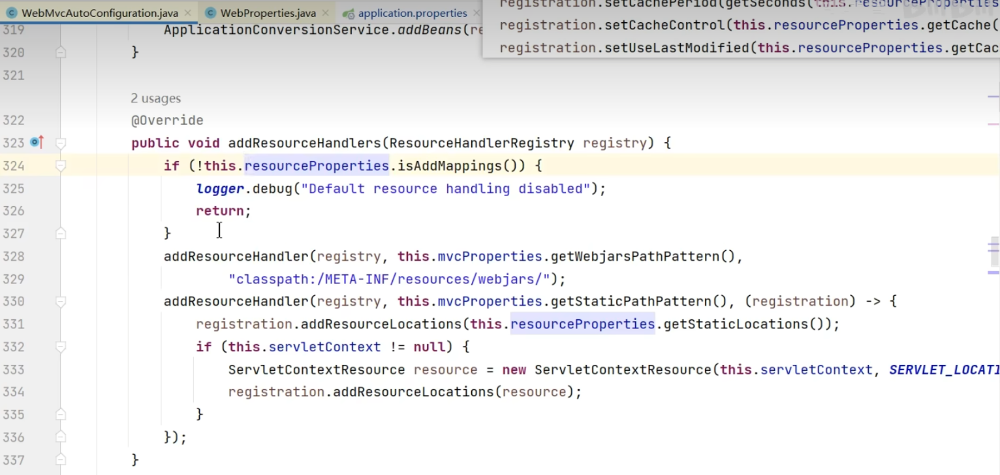

# 1. 静态资源

## 1.1. 默认规则

### 1.1.1. 静态资源映射

静态资源映射规则在 `WebMvcAutoConfiguration `中进行了定义：

1. `/webjars/**` 的所有路径 资源都在` classpath:/META-INF/resources/webjars/`
2. `/** `的所有路径 资源都在 `classpath:/META-INF/resources/`、`classpath:/resources/`、`classpath:/static/`、`classpath:/public/`
3. 所有静态资源都定义了`缓存规则`。【浏览器访问过一次，就会缓存一段时间】，但此功能参数无默认值
   a. `period`： 缓存间隔。 默认 0S；
     b. `cacheControl`：缓存控制。 默认无；
     c. `useLastModified`：是否使用`lastModified`头。 默认 false；

### 1.1.2. 静态资源缓存

如前面所述

1. 所有静态资源都定义了`缓存规则`。【浏览器访问过一次，就会缓存一段时间】，但此功能参数无默认值
   a. `period`： 缓存间隔。 默认 0S；
     b. `cacheControl`：缓存控制。 默认无；
     c. `useLastModified`：是否使用lastModified头。 默认 false；

### 1.1.3. 欢迎页

欢迎页规则在 `WebMvcAutoConfiguration` 中进行了定义：

1. 在**静态资源**目录下找 `index.html`
2. 没有就在 `templates`下找`index`模板页

### 1.1.4. Favicon

1. 在静态资源目录下找 `favicon.ico`
   	- 非重点：其实根据官网知道，springboot配合浏览器，浏览器一般可能会请求一个favicon.ico的资源，也就是网站图标，springboot中如果把图标放在上述静态资源的四个目录之一，也能让项目运行自带图标

### 1.1.5. 缓存实验

```shell
server.port=9000

#1、spring.web：
# 1.配置国际化的区域信息
# 2.静态资源策略(开启、处理链、缓存)

#开启静态资源映射规则 (默认是开启的) 
spring.web.resources.add-mappings=true

#设置缓存
#spring.web.resources.cache.period=3600
##缓存详细合并项控制，覆盖period配置：
## 浏览器第一次请求服务器，服务器告诉浏览器此资源缓存7200秒，7200秒以内的所有此资源访问不用发给服务器请求，7200秒以后发请求给服务器
spring.web.resources.cache.cachecontrol.max-age=7200
#使用资源 last-modified 时间，来对比服务器和浏览器的资源是否相同没有变化。相同返回 304
spring.web.resources.cache.use-last-modified=true
```

浏览器返回状态码304表示请求的资源未被修改，可以直接使用缓存的版本。

## 1.2. 自定义静态资源规则

> 自定义静态资源路径、自定义缓存规则

### 1.2.1. 配置方式

`spring.mvc`： 静态资源访问前缀路径
`spring.web`：
● **静态资源目录**
● **静态资源缓存策略**

**总配置**

```shell
#1、spring.web：
# 1.配置国际化的区域信息
# 2.静态资源策略(开启、处理链、缓存)

#开启静态资源映射规则
spring.web.resources.add-mappings=true

#设置缓存
spring.web.resources.cache.period=3600
##缓存详细合并项控制，覆盖period配置：
## 浏览器第一次请求服务器，服务器告诉浏览器此资源缓存7200秒，7200秒以内的所有此资源访问不用发给服务器请求，7200秒以后发请求给服务器
spring.web.resources.cache.cachecontrol.max-age=7200
## 共享缓存
spring.web.resources.cache.cachecontrol.cache-public=true
#使用资源 last-modified 时间，来对比服务器和浏览器的资源是否相同没有变化。相同返回 304
spring.web.resources.cache.use-last-modified=true

#自定义静态资源文件夹位置
spring.web.resources.static-locations=classpath:/a/,classpath:/b/,classpath:/static/

#2、 spring.mvc
## 2.1. 自定义webjars路径前缀
spring.mvc.webjars-path-pattern=/wj/**
## 2.2. 静态资源访问路径前缀 这样就不用非得使用拦截器去做处理
spring.mvc.static-path-pattern=/static/**
```

开启静态资源映射规则对应源码

```shell
# 开启静态资源映射规则
spring.web.resources.add-mappings=true
```




### 1.2.2. 代码方式

>● 容器中只要有一个 `WebMvcConfigurer` 组件。配置的底层行为都会生效
>● `@EnableWebMvc` //禁用boot的默认配置

遇到不太会写或者遗忘的情况，可以去看WebMvcAutoConfiguration类，它实现了WebMvcConfigurer接口，并重写了默认的方法，我们根据它的代码学习如何重写。
**这里哪怕我们没有调用父类方法，它依然在，因为默认会调用父类的方法，把默认路径加上。**

```java
@Configuration //这是一个配置类
public class MyConfig implements WebMvcConfigurer {


    @Override
    public void addResourceHandlers(ResourceHandlerRegistry registry) {
        // 保留以前的springmvc自定义的配置，不写也成立 boot的会自动调用
        // WebMvcConfigurer.super.addResourceHandlers(registry);
        //自己写新的规则。
        registry.addResourceHandler("/static/**")
                .addResourceLocations("classpath:/a/","classpath:/b/")
                .setCacheControl(CacheControl.maxAge(1180, TimeUnit.SECONDS));
    }
}
```

```java
@Configuration //这是一个配置类,给容器中放一个 WebMvcConfigurer 组件，就能自定义底层
public class MyConfig  /*implements WebMvcConfigurer*/ {


    @Bean
    public WebMvcConfigurer webMvcConfigurer(){
        return new WebMvcConfigurer() {
            @Override
            public void addResourceHandlers(ResourceHandlerRegistry registry) {
                registry.addResourceHandler("/static/**")
                        .addResourceLocations("classpath:/a/", "classpath:/b/")
                        .setCacheControl(CacheControl.maxAge(1180, TimeUnit.SECONDS));
            }
        };
    }

}
```

# 2. 路径匹配

> **Spring5.3** 之后加入了更多的`请求路径匹配`的实现策略；
> 以前只支持 `AntPathMatcher` 策略, 现在提供了` PathPatternParser `策略。并且可以让我们指定到底使用那种策略。

## 2.1. Ant风格路径用法

Ant 风格的路径模式语法具有以下规则：

- `*`：表示 **任意数量** 的字符。
- `?`：表示任意 **一个字符**。
- `**`：表示 **任意数量的目录**。
- `{}`：表示一个命名的模式 **占位符**。
- `[]`：表示 **字符集合**，例如`[a-z]`表示小写字母。
  例如：
- `*.html` 匹配任意名称，扩展名为`.html`的文件。
- `/folder1/*/*.java` 匹配在`folder1`目录下的任意两级目录下的`.java`文件。
- `/folder2/**/*.jsp` 匹配在`folder2`目录下任意目录深度的`.jsp`文件。
- `/{type}/{id}.html` 匹配任意文件名为`{id}.html`，在任意命名的`{type}`目录下的文件。
  注意：Ant 风格的路径模式语法中的特殊字符需要转义，如：
- 要匹配文件路径中的星号，则需要转义为 `\\*`
- 要匹配文件路径中的问号，则需要转义为 `\\? `


## 2.2. 模式切换

> `AntPathMatcher` 与 `PathPatternParser`
> ● `PathPatternParser` 在 jmh 基准测试下，有 6~8 倍吞吐量提升，降低 30%~40%空间分配率
> ● `PathPatternParser` 兼容 `AntPathMatcher`语法，并支持更多类型的路径模式
> ● `PathPatternParser`   `"**"` **多段匹配** 的支持 **仅允许在模式末尾使用**

```java
    @GetMapping("/a*/b?/{p1:[a-f]+}")
    public String hello(HttpServletRequest request, 
                        @PathVariable("p1") String path) {

        log.info("路径变量p1： {}", path);
        //获取请求路径
        String uri = request.getRequestURI();
        return uri;
    }
```

总结： 

- 使用默认的路径匹配规则，是由 `PathPatternParser ` 提供的
- 如果路径中间需要有 `**`，替换成ant风格路径

```shell
# 改变路径匹配策略：
# ant_path_matcher 老版策略；
# path_pattern_parser 新版策略；
spring.mvc.pathmatch.matching-strategy=ant_path_matcher
```

# 