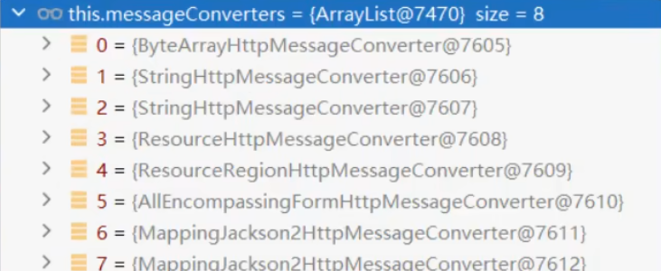

# 8 SpringBoot3【⑧ 内容协商】

[这个可以结合我 `SpringMVC` 部分，也有内容协商的底层源码剖析。](https://www.fanxy.cloud/archives/SpringMVC-4)

> 一套系统适配多端数据返回
> 

## 8.1.  多端内容适配

### 8.1.1. 默认规则

1. **`SpringBoot` 多端内容适配**。

   1.1. **<font color="#0000dd">基于<font color="#dd0000">请求头</font>内容协商：（默认开启）</font>**

   1.1.1. 客户端向服务端发送请求，携带HTTP标准的**Accept请求头**。
     1.1.1.1. **Accept**: `application/json`、`text/xml`、`text/yaml`
     1.1.1.2. 服务端根据客户端 **请求头期望的数据类型** 进行 **动态返回**

   1.2.  **<font color="#0000dd">基于<font color="#dd0000">请求参数</font>内容协商：（需要开启）</font>**

   1.2.1. 发送请求 `GET /projects/spring-boot?format=json `

   1.2.2. 匹配到 `@GetMapping("/projects/spring-boot") `

   1.2.3. 根据 **参数协商**，优先返回 json 类型数据**【需要开启参数匹配设置】**

   1.2.4. 发送请求 `GET /projects/spring-boot?format=xml`,优先返回 xml 类型数据

### 8.1.2. 效果演示

 >请求同一个接口，可以返回`json`和`xml`不同格式数据

  `springboot`的`web`场景启动器默认导入了`jackson`的包，默认支持把`java`对象返回为`json`类型数据。

1. **引入支持写出xml内容依赖**

```xml
<dependency>
    <groupId>com.fasterxml.jackson.dataformat</groupId>
    <artifactId>jackson-dataformat-xml</artifactId>
</dependency>
```

2. **标注注解**

```java
@JacksonXmlRootElement  // 可以写出为xml文档
@Data
public class Person {
    private Long id;
    private String userName;
    private String email;
    private Integer age;
}

```

3. **开启基于请求参数的内容协商**

```shell
# 开启基于请求参数的内容协商功能。 默认参数名：format 默认此功能不开启
spring.mvc.contentnegotiation.favor-parameter=true
# 指定内容协商时使用的参数名。默认是 format
spring.mvc.contentnegotiation.parameter-name=type
```

4. 效果
   
    

### 8.1.3. 配置协商规则与支持类型

1. 修改<font color="#dd0000">**内容协商方式**</font> 

```shell
#使用参数进行内容协商
spring.mvc.contentnegotiation.favor-parameter=true  
#自定义参数名，默认为format
spring.mvc.contentnegotiation.parameter-name=myparam 
```

**但是现在也就只能返回xml和json数据类型，如果想用别的需要进行配置**

2. 大多数 MediaType 都是开箱即用的。也可以<font color="#dd0000">**自定义内容类型，如：**</font>

```shell
spring.mvc.contentnegotiation.media-types.yaml=text/yaml
```

## 8.2. 自定义内容返回

### 8.2.1. 增加yaml返回支持

导入依赖

```xml
<dependency>
    <groupId>com.fasterxml.jackson.dataformat</groupId>
    <artifactId>jackson-dataformat-yaml</artifactId>
</dependency>
```

把对象写出成YAML

```java
    public static void main(String[] args) throws JsonProcessingException {
        Person person = new Person();
        person.setId(1L);
        person.setUserName("张三");
        person.setEmail("aaa@qq.com");
        person.setAge(18);
		// 这个设置可以把默认添加的分页符 --- 去除，还有别的一些配置方法
        YAMLFactory factory = new YAMLFactory().disable(YAMLGenerator.Feature.WRITE_DOC_START_MARKER);
        ObjectMapper mapper = new ObjectMapper(factory);

        String s = mapper.writeValueAsString(person);
        System.out.println(s);
    }
```

编写配置

```shell
#新增一种媒体类型
spring.mvc.contentnegotiation.media-types.yaml=text/yaml
```

在我们刚刚使用的`配置类`中，配置的`WebMvcConfigurer`组件中，增加`HttpMessageConverter`组件，专门负责把对象写出为yaml格式

```java
    @Bean
    public WebMvcConfigurer webMvcConfigurer(){
        return new WebMvcConfigurer() {
            @Override //配置一个能把对象转为yaml的messageConverter
            public void configureMessageConverters(List<HttpMessageConverter<?>> converters) {
                converters.add(new MyYamlHttpMessageConverter());
            }
        };
    }
```

### 8.2.2. 思考：如何增加其他

- 配置媒体类型支持: 
  - `spring.mvc.contentnegotiation.media-types.yaml=text/yaml`
- 编写对应的`HttpMessageConverter`，要告诉Boot这个支持的媒体类型
  - 按照3的示例
- 把`MessageConverter`组件加入到底层
  - 容器中放一个`WebMvcConfigurer` 组件，并配置底层的`MessageConverter`

### 8.2.3. `HttpMessageConverter`的示例写法

一般我们把这种类型的组件类都放在component包下

```java
public class MyYamlHttpMessageConverter extends AbstractHttpMessageConverter<Object> {

    private ObjectMapper objectMapper = null; //把对象转成yaml

    public MyYamlHttpMessageConverter(){
        //告诉SpringBoot这个MessageConverter支持哪种媒体类型  //媒体类型
        super(new MediaType("text", "yaml", Charset.forName("UTF-8")));
        YAMLFactory factory = new YAMLFactory()
                .disable(YAMLGenerator.Feature.WRITE_DOC_START_MARKER);
        this.objectMapper = new ObjectMapper(factory);
    }

    @Override
    protected boolean supports(Class<?> clazz) {
        //只要是对象类型，不是基本类型
        return true;
    }

    @Override  //@RequestBody
    protected Object readInternal(Class<?> clazz, HttpInputMessage inputMessage) throws IOException, HttpMessageNotReadableException {
        return null;
    }

    @Override //@ResponseBody 把对象怎么写出去
    protected void writeInternal(Object methodReturnValue, HttpOutputMessage outputMessage) throws IOException, HttpMessageNotWritableException {

        //try-with写法，自动关流
        try(OutputStream os = outputMessage.getBody()){
            this.objectMapper.writeValue(os,methodReturnValue);
        }

    }
}
```

## 8.3. 内容协商原理-`HttpMessageConverter`

> ● `HttpMessageConverter` 怎么工作？合适工作？
> ● 定制 `HttpMessageConverter`  来实现多端内容协商
> ● 编写`WebMvcConfigurer`提供的`configureMessageConverters`底层，修改底层的`MessageConverter`

### 8.3.1. `@ResponseBody`由`HttpMessageConverter`处理

[雷神源码级讲解 P35](https://www.bilibili.com/video/BV1Es4y1q7Bf/?p=35&spm_id_from=pageDriver&vd_source=da8c316450987e3173a62ba5ea9acd61)
标注了`@ResponseBody`的返回值 将会由支持它的 `HttpMessageConverter`写给浏览器

1. 如果controller方法的返回值标注了 `@ResponseBody `注解

   1.1. 请求进来先来到`DispatcherServlet`的`doDispatch()`进行处理

   1.2. 找到一个 `HandlerAdapter` 适配器。利用适配器执行目标方法

   1.3. `RequestMappingHandlerAdapter`来执行，调用 `invokeHandlerMethod（）`来执行目标方法

   1.4. 目标方法执行之前，准备好两个东西

   ​	1.4.1. `HandlerMethodArgumentResolver `：参数解析器，确定目标方法每个参数值

   ​	1.4.2. `HandlerMethodReturnValueHandler `：返回值处理器，确定目标方法的返回值改怎么处理

   1.5. `RequestMappingHandlerAdapter` 里面的`invokeAndHandle()`真正执行目标方法

   1.6. 目标方法执行完成，会返回**返回值对象**

   1.7. **找到一个合适的返回值处理器** `HandlerMethodReturnValueHandler`

   1.8. 最终找到` RequestResponseBodyMethodProcessor`能处理 标注了 `@ResponseBody`注解的方法

   1.9. `RequestResponseBodyMethodProcessor `调用`writeWithMessageConverters `,利用`MessageConverter`(**消息转换器**)把返回值写出去


>上面解释：`@ResponseBody`由`HttpMessageConverter`处理

2. `HttpMessageConverter` 会 **先进行内容协商**

   2.1. 遍历所有的`MessageConverter`看谁支持这种 **内容类型的数据**

   2.2. 默认`MessageConverter`有以下

   2.3. 

  2.4. 最终因为要`json`所以`MappingJackson2HttpMessageConverter`支持写出 `json`
  2.5. jackson用`ObjectMapper`把对象写出去

### 8.3.2. `WebMvcAutoConfiguration`提供几种默认`HttpMessageConverters`

● `EnableWebMvcConfiguration`通过 `addDefaultHttpMessageConverters`添加了默认的`MessageConverter`；如下：
  ○ `ByteArrayHttpMessageConverter`： 支持字节数据读写
  ○ `StringHttpMessageConverter`： 支持字符串读写
  ○ `ResourceHttpMessageConverter`：支持资源读写
  ○ `ResourceRegionHttpMessageConverter`: 支持分区资源写出
  ○ `AllEncompassingFormHttpMessageConverter`：支持表单xml/json读写
  ○ `MappingJackson2HttpMessageConverter`： 支持请求响应体Json读写
默认8个：

这里可能系统出现一些bug，同样的转换器配置了两遍

> 系统提供默认的`MessageConverter` 功能有限，仅用于`json`或者普通返回数据。额外增加新的内容协商功能，必须增加新的`HttpMessageConverter`