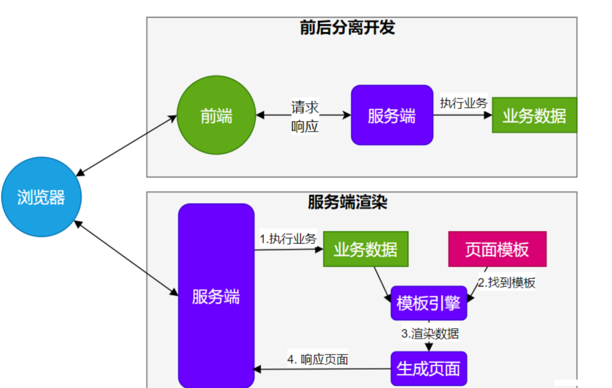

# 9 SpringBoot3【⑨ 模板引擎】

>  - 由于 **SpringBoot** 使用了 **嵌入式 Servlet 容器**。所以 **JSP** 默认是 **不能使用** 的。
>  - 如果需要 **服务端页面渲染**，优先考虑使用 **`模板引擎`**。


`模板引擎`页面默认放在 `src/main/resources/templates`
**SpringBoot** 包含以下模板引擎的自动配置
● FreeMarker
● Groovy
● **Thymeleaf**
● Mustache
[Thymeleaf官网](https://www.thymeleaf.org/)

```html
<!DOCTYPE html>
<html xmlns:th="http://www.thymeleaf.org">
<head>
	<title>Good Thymes Virtual Grocery</title>
	<meta http-equiv="Content-Type" content="text/html; charset=UTF-8" />
	<link rel="stylesheet" type="text/css" media="all" th:href="@{/css/gtvg.css}" />
</head>
<body>
	<p th:text="#{home.welcome}">Welcome to our grocery store!</p>
</body
</html>
```

## 1. Thymeleaf整合

```xml
<dependency>
    <groupId>org.springframework.boot</groupId>
    <artifactId>spring-boot-starter-thymeleaf</artifactId>
</dependency>
```

自动配置原理

1. 开启了`org.springframework.boot.autoconfigure.thymeleaf.ThymeleafAutoConfiguration` 自动配置
2. 属性绑定在` ThymeleafProperties `中，对应配置文件 `spring.thymeleaf `内容
3. 所有的模板页面默认在 `classpath:/templates`文件夹下
4. 默认效果
   - 所有的模板页面在 `classpath:/templates/`下面找
   - 找后缀名为`.html`的页面
5. thymeleaf的配置在 `spring.thymeleaf.xxxxxxxx`，**一般不需要改前缀和后缀，建议开发期间使用**`spring.thymeleaf.cache=false`，**开发期间关闭缓存，保证能随时改变随时看到效果**
6. 也可以修改 `spring.thymeleaf.check-template=false` **这样就不会检查是否存在对应的页面，可以增快软件加载速度。**

## 2. 基础语法

### 1. 核心用法

**<font color="#000bb">th:xxx：动态渲染指定的 html 标签属性值、或者th指令（遍历、判断等）</font>**

- `th:text`：标签体内文本值渲染
  - `th:utext`：不会转义，显示为html原本的样子，如果文本带有html标签，可以直接渲染。
- `th:属性`：标签指定属性渲染
- `th:attr`：标签任意属性渲染
- `th:if`  `th:each`  `...`：其他th指令
- 例如：

```html
<p th:text="${content}">原内容</p>
<a th:href="${url}">登录</a>

```

**<font color="#000bb">表达式：用来动态取值</font>**

- **`${}`：变量取值；使用model共享给页面的值都直接用${}**
- **`@{}`：url路径；防止根目录变化，可以在配置文件通过`server.servlet.context-path` 改变**
- `#{}`：国际化消息
- `~{}`：片段引用
- `*{}`：变量选择：需要配合th:object绑定对象

**<font color="#000bb">系统工具&内置对象：详细文档</font>**

- `param`：请求参数对象
- `session`：session对象
- `application`：application对象
- `#execInfo`：模板执行信息
- `#messages`：国际化消息
- `#uris`：uri/url工具
- `#conversions`：类型转换工具
- `#dates`：日期工具，是`java.util.Date`对象的工具类
- `#calendars`：类似#dates，只不过是`java.util.Calendar`对象的工具类
- `#temporals`： JDK8+ `java.time` API 工具类
- `#numbers`：数字操作工具
- `#strings`：字符串操作
- `#objects`：对象操作
- `#bools`：bool操作
- `#arrays`：array工具
- `#lists`：list工具
- `#sets`：set工具
- `#maps`：map工具
- `#aggregates`：集合聚合工具（sum、avg）
- `#ids`：id生成工具

### 2. 语法示例

**<font color="#000bb">表达式：</font>**

- 变量取值：`${...}`
- url 取值：`@{...}`
- 国际化消息：`#{...}`
- 变量选择：`*{...}`
- 片段引用: `~{...}`

**<font color="#000bb">常见：</font>**

- 文本： `'one text'`，`'another one!'`,...
- 数字： `0`,`34`,`3.0`,`12.3`,...
- 布尔：`true`、`false`
- null: `null`
- 变量名： `one,sometext,main`...

**<font color="#000bb">文本操作：</font>**

- 拼串： `+`
- 文本替换：`| The name is ${name} |`

**<font color="#000bb">布尔操作：</font>**

- 二进制运算： `and`,`or`
- 取反：`!`, `not`

**<font color="#000bb">比较运算：</font>**

- 比较：`>`，`<`，`<=`，`>=`（`gt`，`lt`，`ge`, `le`）
- 等值运算：`==`, `!=`（`eq`，`ne`）

**<font color="#000bb">条件运算：</font>**

- if-then： `(if)?(then)`
- if-then-else: `(if)?(then):(else)`
- default: `(value)?:(defaultValue)`

**<font color="#000bb">特殊语法：</font>**

- 无操作：`_`
  所有以上都可以嵌套组合

```text
'User is of type ' + (${user.isAdmin()} ? 'Administrator' : (${user.type} ?: 'Unknown'))
```

## 3. 属性设置

1. `th:href="@{/product/list}"`
2. `th:attr="class=${active}"`
3. `th:attr="src=@{/images/gtvglogo.png},title=${logo},alt=#{logo}"`
4. `th:checked="${user.active}"`

```html
<p th:text="${content}">原内容</p>
<a th:href="${url}">登录</a>

```

## 4. 遍历

> 语法：  th:each="元素名,迭代状态 : ${集合}"

```html
<tr th:each="prod : ${prods}">
  <td th:text="${prod.name}">Onions</td>
  <td th:text="${prod.price}">2.41</td>
  <td th:text="${prod.inStock}? #{true} : #{false}">yes</td>
</tr>

<tr th:each="prod,iterStat : ${prods}" th:class="${iterStat.odd}? 'odd'">
  <td th:text="${prod.name}">Onions</td>
  <td th:text="${prod.price}">2.41</td>
  <td th:text="${prod.inStock}? #{true} : #{false}">yes</td>
</tr>
```

`iterStat` 有以下属性：

- `index`：当前遍历元素的索引，从0开始
- `count`：当前遍历元素的索引，从1开始
- `size`：需要遍历元素的总数量
- `current`：当前正在遍历的元素对象
- `even/odd`：是否偶数/奇数行
- `first`：是否第一个元素
- `last`：是否最后一个元素

## 5. 判断

### th:if

```html
<a
  href="comments.html"
  th:href="@{/product/comments(prodId=${prod.id})}"
  th:if="${not #lists.isEmpty(prod.comments)}"
  >view</a>
```

### th:switch

```html
<div th:switch="${user.role}">
  <p th:case="'admin'">User is an administrator</p>
  <p th:case="#{roles.manager}">User is a manager</p>
  <p th:case="*">User is some other thing</p>
</div>
```

## 6. 属性优先级

- 片段
- 遍历
- 判断

```html
<ul>
  <li th:each="item : ${items}" th:text="${item.description}">Item description here...</li>
</ul>
```

| Order | Feature          | Attributes                                    |
| ----- | ---------------- | --------------------------------------------- |
| 1     | 片段包含         | `   th:insert th:replace  `                   |
| 2     | 遍历             | `   th:each    `                              |
| 3     | 判断             | `    th:if th:unless th:switch th:case   `    |
| 4     | 定义本地变量     | `   th:object th:with    `                    |
| 5     | 通用方式属性修改 | `  th:attr th:attrprepend th:attrappend     ` |
| 6     | 指定属性修改     | `     th:value th:href th:src ...  `          |
| 7     | 文本值           | `   th:text th:utext    `                     |
| 8     | 片段指定         | `  th:fragment     `                          |
| 9     | 片段移除         | `   th:remove    `                            |


## 7. 行内写法

`[[...]]` or `[(...)]`

```html
<p>Hello, [[${session.user.name}]]!</p>
```

## 8. 变量选择

```html
<div th:object="${session.user}">
  <p>Name: <span th:text="*{firstName}">Sebastian</span>.</p>
  <p>Surname: <span th:text="*{lastName}">Pepper</span>.</p>
  <p>Nationality: <span th:text="*{nationality}">Saturn</span>.</p>
</div>
```

等同于

```html
<div>
  <p>Name: <span th:text="${session.user.firstName}">Sebastian</span>.</p>
  <p>Surname: <span th:text="${session.user.lastName}">Pepper</span>.</p>
  <p>Nationality: <span th:text="${session.user.nationality}">Saturn</span>.</p>
</div>
```

## 9. 模板布局

像页面导航等这种通用的部分，可以直接放到一个common.html页面，然后我们给它定义模板片段，然后在别的页面引用。

如在common.html 定义一个header  

```html
<header th:fragment="myheader" .....></header>
```

在别的页面就能引用或者插入它

```html
<div th:replace="~{common :: myheader}"></div>
```

- 定义模板： `th:fragment`
- 引用模板：`~{templatename::selector}`
- 插入模板：`th:insert、th:replace`

```html
<footer th:fragment="copy">&copy; 2011 The Good Thymes Virtual Grocery</footer>

<body>
  <div th:insert="~{footer :: copy}"></div>
  <div th:replace="~{footer :: copy}"></div>
</body>
<body>
  结果：
  <body>
    <div>
      <footer>&copy; 2011 The Good Thymes Virtual Grocery</footer>
    </div>

    <footer>&copy; 2011 The Good Thymes Virtual Grocery</footer>
  </body>
</body>
```

- `th:insert` ：保留自己的主标签，保留th:fragment的主标签。
- `th:replace` ：不要自己的主标签，保留th:fragment的主标签。
- `th:include` ：保留自己的主标签，不要th:fragment的主标签。（官方3.0后不推荐）

```html
需要替换的片段内容：  
<footer th:fragment="copy">  
   <script type="text/javascript" th:src="@{/plugins/jquery/jquery-3.0.2.js}"></script>  
</footer>  
   
导入片段：  
   
  <div th:insert="footer :: copy"></div>  
   
  <div th:replace="footer :: copy"></div>  
   
  <div th:include="footer :: copy"></div>  
   
   
结果为：  
   
<div>  
    <footer>  
       <script type="text/javascript" th:src="@{/plugins/jquery/jquery-3.0.2.js}"></script>  
    </footer>   
</div>   
   
<footer>  
  <script type="text/javascript" th:src="@{/plugins/jquery/jquery-3.0.2.js}"></script>  
</footer>   
   
<div>  
  <script type="text/javascript" th:src="@{/plugins/jquery/jquery-3.0.2.js}"></script>  
</div>    
```

## 10. devtools

```xml
      <dependency>
        <groupId>org.springframework.boot</groupId>
        <artifactId>spring-boot-devtools</artifactId>
      </dependency>
```

修改页面后；`ctrl+F9`刷新效果；
java代码的修改，如果`devtools`热启动了，可能会引起一些bug，难以排查
**<font color="#bb000">所以如果使用devtools，修改Java代码最好重新启动，不要使用 ctrl + F9 ，前端页面修改可以使用</font>**