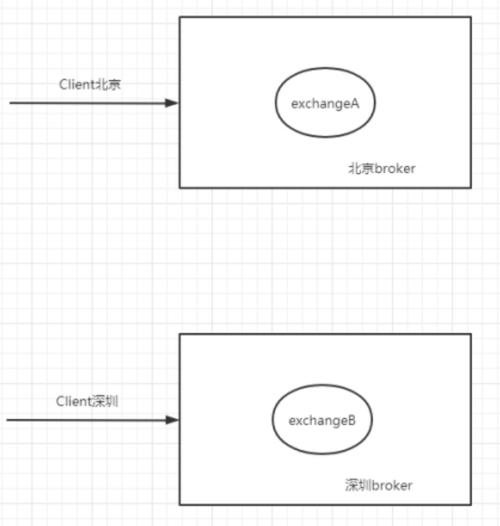
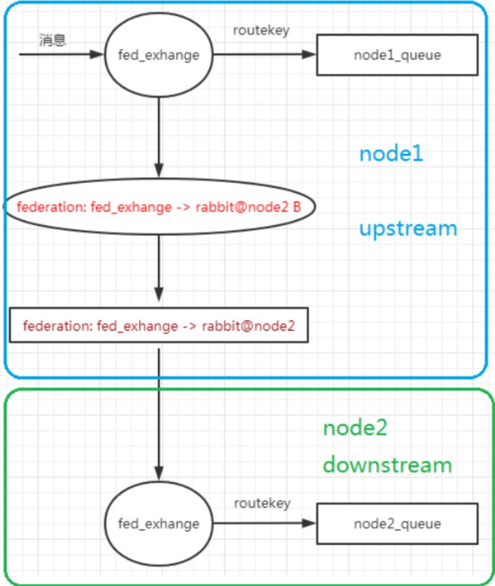
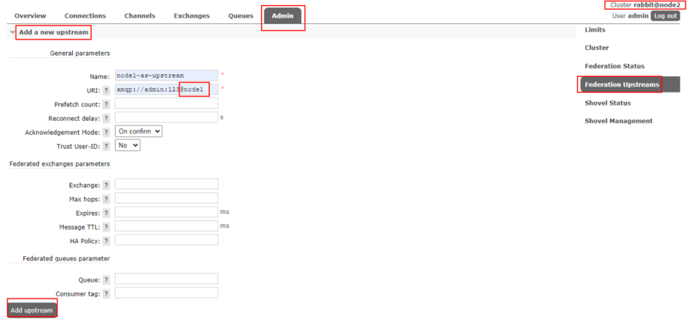
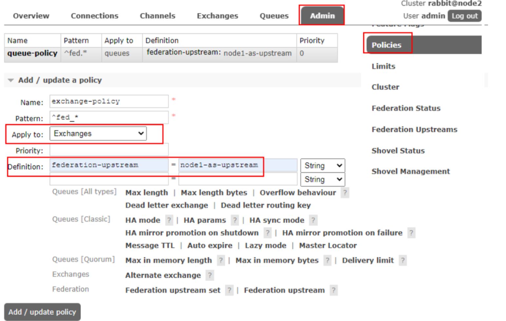
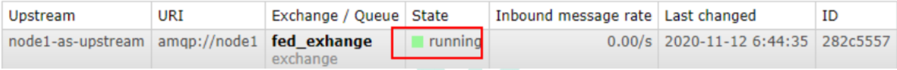
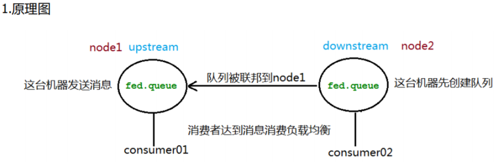
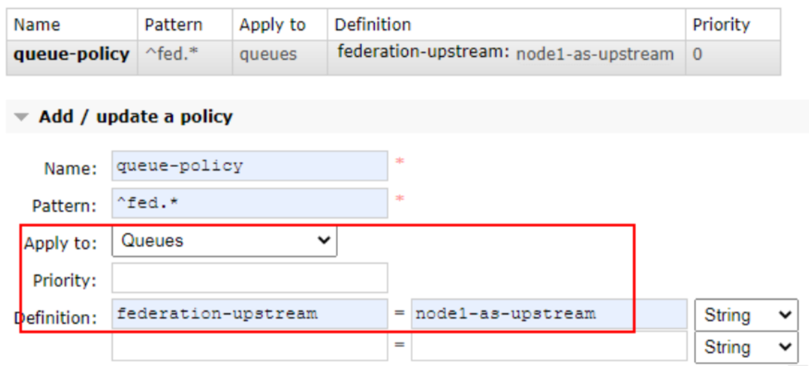
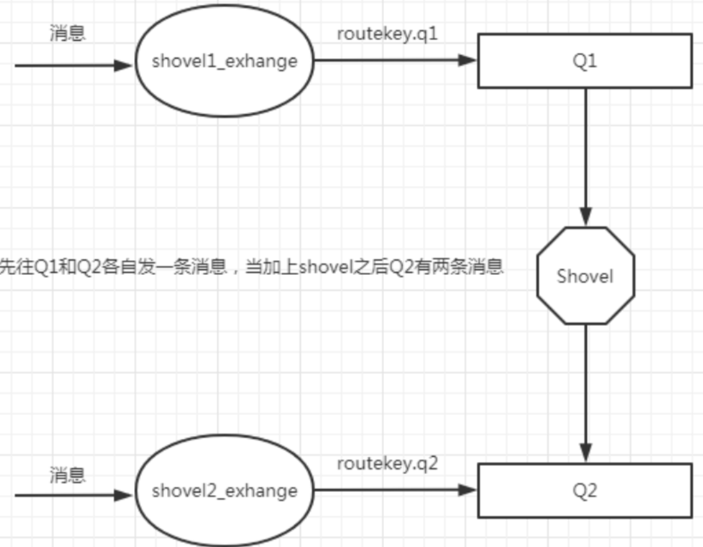
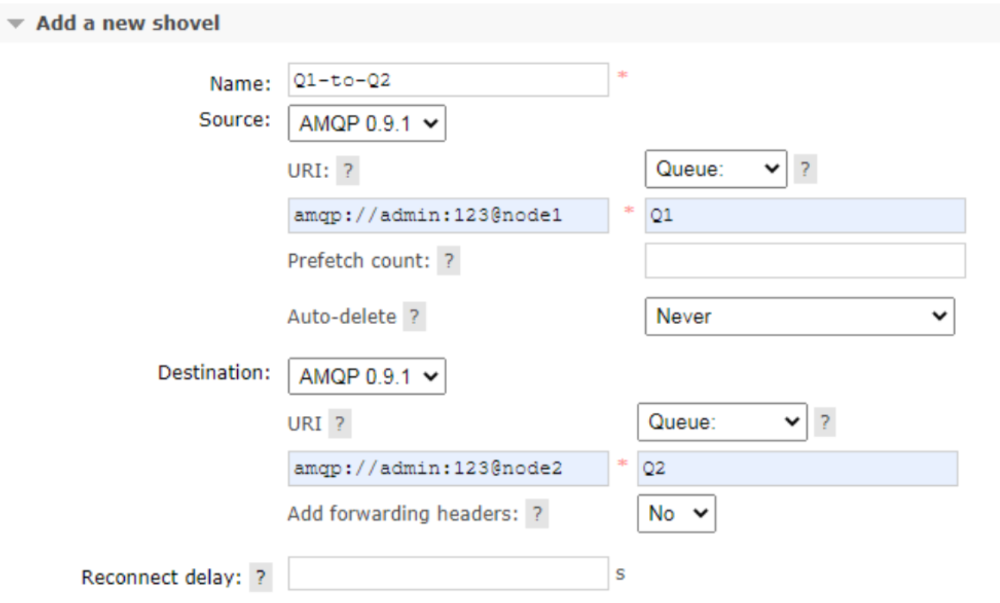

# 10. RabbitMq【联邦队列和shovel】

## 1.1. Federation Exchange

### 1.1.1. 使用它的原因 

(broker 北京)，(broker 深圳)彼此之间相距甚远，网络延迟是一个不得不面对的问题。有一个在北京的业务(Client 北京) 需要连接(broker 北京)，向其中的交换器 exchangeA 发送消息，此时的网络延迟很小，(Client 北京)可以迅速将消息发送至 exchangeA 中，就算在开启了 `publisherconfirm` 机制或者事务机制的情况下，也可以迅速收到确认信息。此时又有个在深圳的业务(Client 深圳)需要向 `exchangeA` 发送消息，那么(Client 深圳) (broker 北京)之间有很大的网络延迟，(Client 深圳) 将发送消息至 `exchangeA` 会经历一定的延迟，尤其是在开启了 `publisherconfirm` 机制或者事务机制的情况下，(Client 深圳) 会等待很长的延迟时间来接收(broker 北京)的确认信息，进而必然造成这条发送线程的性能降低，甚至造成一定程度上的阻塞。

将业务(Client 深圳)部署到北京的机房可以解决这个问题，但是如果(Client 深圳)调用的另些服务都部署在深圳，那么又会引发新的时延问题，总不见得将所有业务全部部署在一个机房，那么容灾又何以实现？这里使用 Federation 插件就可以很好地解决这个问题.



### 1.1.2. 搭建步骤 

1.需要保证每台节点单独运行

2.在每台机器上开启 federation 相关插件【这两个插件自带，但是没有启动】

```sh
rabbitmq-plugins enable rabbitmq_federation
```

```sh
rabbitmq-plugins enable rabbitmq_federation_management
```

在admin的右侧栏可以看到多了这两个选项


3. 原理图(先运行 consumer 在 node2 创建 fed_exchange)



4. 在 downstream(node2)配置 upstream(node1)



4. 添加 policy



5. 成功的前提



## 1.2. Federation Queue

### 1.2.1. 使用它的原因 

联邦队列可以在多个 `Broker` 节点(或者集群)之间为单个队列提供均衡负载的功能。一个联邦队列可以连接一个或者多个上游队列(`upstream queue`)，并从这些上游队列中获取消息以满足本地消费者消费消息的需求。

### 1.2.2. 搭建步骤 

箭头没反，联邦的方向和消息走向是相反的



2. 添加 upstream(同上)

3. 添加 policy



## 1.3. Shovel

### 1.3.1. 使用它的原因 

`Federation` 具备的数据转发功能类似，`Shovel` 够可靠、持续地从一个 `Broker` 中的队列(作为源端，即`source`)拉取数据并转发至另一个 `Broker` 中的交换器(作为目的端，即 `destination`)。作为源端的队列和作为目的端的交换器可以同时位于同一个 `Broker`，也可以位于不同的 `Broker` 上。`Shovel` 可以翻译为"铲子"，是一种比较形象的比喻，这个"铲子"可以将消息从一方"铲子"另一方。`Shovel` 行为就像优秀的客户端应用程序能够负责连接源和目的地、负责消息的读写及负责连接失败问题的处理。

### 1.3.2. 搭建步骤 

1. 开启插件(需要的机器都开启)

```sh
rabbitmq-plugins enable rabbitmq_shovel
```

```sh
rabbitmq-plugins enable rabbitmq_shovel_management
```


2.原理图(在源头发送的消息直接回进入到目的地队列)



3. 添加 shovel 源和目的地 

