# Work Queues

工作队列(又称任务队列)的主要思想是避免立即执行资源密集型任务，而不得不等待它完成。相反我们安排任务在之后执行。我们把任务封装为消息并将其发送到队列。在后台运行的工作进程将弹出任务并最终执行作业。当有多个工作线程时，这些工作线程将一起处理这些任务。

## 1.1. 轮询分发消息

在这个案例中我们会启动两个工作线程【 **这里实质上相当于开了两个进程来当作开两个线程，实际应该使用java关于线程的Thread包的方法，实现Runnable接口** 】，一个消息发送线程，我们来看看他们两个工作线程是如何工作的。


### 1.1.1. 抽取工具类

**我做了一个单例工厂并且保存一条单例连接的工具类，也可以通过方法获取不同连接的不同信道**

```java
public class RabbitMqUtils {

    static private ConnectionFactory factory;

    static private Connection connection;

    //得到一个单实例的工厂
    static {
        //创建一个连接工厂
        factory = new ConnectionFactory();
        factory.setHost("192.168.110.100");
        factory.setUsername("admin");
        factory.setPassword("123456");
        try {
            connection = factory.newConnection();
        } catch (Exception e) {
            throw new RuntimeException(e);
        }
    }

    //得到随机连接的一个连接的 channel
    public static Channel getChannel() throws Exception {
        Connection connection = factory.newConnection();
        Channel channel = connection.createChannel();
        return channel;
    }

    //得到单实例的连接
    public static Connection getConnection(){
        return connection;
    }
}
```


### 1.1.2. 启动两个工作线程

```java
public class Consumer1 {
    public static final String QUEUE_NAME = "hello";

    public static void main(String[] args) throws Exception {

        Channel channel = RabbitMqUtils.getChannel();

        // 消息接受
        DeliverCallback deliverCallback = (consumerTag, message) -> {
            System.out.println("Consumer1 receive" + new String(message.getBody(), "UTF-8"));
        };

        // 取消消息的回调
        CancelCallback cancelCallback = consumerTag -> {
            System.out.println(consumerTag + "message Cancelled");
        };

        /**
         * 消费者消费消息
         */
        System.out.println("Consumer1 waiting...");
        channel.basicConsume(QUEUE_NAME, true, deliverCallback, cancelCallback);
    }
}
```

```java
public class Consumer2 {
    public static final String QUEUE_NAME = "hello";

    public static void main(String[] args) throws Exception {

        Channel channel = RabbitMqUtils.getChannel();

        // 消息接受
        DeliverCallback deliverCallback = (consumerTag, message) -> {
            System.out.println("Consumer2 receive" + new String(message.getBody(), "UTF-8"));
        };

        // 取消消息的回调
        CancelCallback cancelCallback = consumerTag -> {
            System.out.println(consumerTag + "message Cancelled");
        };

        /**
         * 消费者消费消息
         */
        System.out.println("Consumer2 waiting...");
        channel.basicConsume(QUEUE_NAME, true, deliverCallback, cancelCallback);
    }
}

```

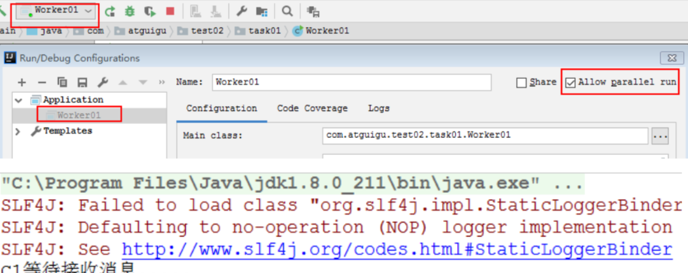


### 1.1.3. 启动一个发送线程

```java
public class Task01 {
    private static final String QUEUE_NAME="hello";
    public static void main(String[] args) throws Exception {
        try(Channel channel=RabbitMqUtils.getChannel();) {
            channel.queueDeclare(QUEUE_NAME,false,false,false,null);
            //从控制台当中接受信息
            Scanner scanner = new Scanner(System.in);
            while (scanner.hasNext()){
                String message = scanner.next();
                channel.basicPublish("",QUEUE_NAME,null,message.getBytes());
                System.out.println("发送消息完成:"+message);
            }
        }
    }
}
```


### 1.1.4. 结果展示 

通过程序执行发现生产者总共发送 4 个消息，消费者 1 和消费者 2 分别分得两个消息，并且是按照有序的一个接收一次消息


## 1.2. 消息应答

### 1.2.1. 概念

消费者完成一个任务可能需要一段时间，如果其中一个消费者处理一个长的任务并仅只完成了部分突然它挂掉了，会发生什么情况。RabbitMQ 一旦向消费者传递了一条消息，便立即将该消息标记为删除。在这种情况下，突然有个消费者挂掉了，我们将丢失正在处理的消息。以及后续发送给该消费这的消息，因为它无法接收到。为了保证消息在发送过程中不丢失，rabbitmq 引入消息应答机制，消息应答就是:**消费者在接收到消息并且处理该消息之后，告诉 rabbitmq 它已经处理了，rabbitmq 可以把该消息删除了。**


### 1.2.2. 自动应答

消息发送后立即被认为已经传送成功，这种模式需要在**高吞吐量和数据传输安全性方面做权衡**,因为这种模式如果消息在接收到之前，消费者那边出现连接或者 channel 关闭，那么消息就丢失了,当然另一方面这种模式消费者那边可以传递过载的消息，**没有对传递的消息数量进行限制**，当然这样有可能使得消费者这边由于接收太多还来不及处理的消息，导致这些消息的积压，最终使得内存耗尽，最终这些消费者线程被操作系统杀死，**所以这种模式仅适用在消费者可以高效并以某种速率能够处理这些消息的情况下使用。**


### 1.2.3. 消息应答的方法 

- **A**.`Channel.basicAck`(用于肯定确认)
  - `RabbitMQ` 已知道该消息并且成功的处理消息，可以将其丢弃了
- **B**.`Channel.basicNack`(用于否定确认)
- **C**.`Channel.basicReject`(用于否定确认)
  - 与 `Channel.basicNack` 相比少一个参数
  - 不处理该消息了直接拒绝，可以将其丢弃了


### 1.2.4. Multiple 的解释 

**手动应答的好处是可以批量应答并且减少网络拥堵**
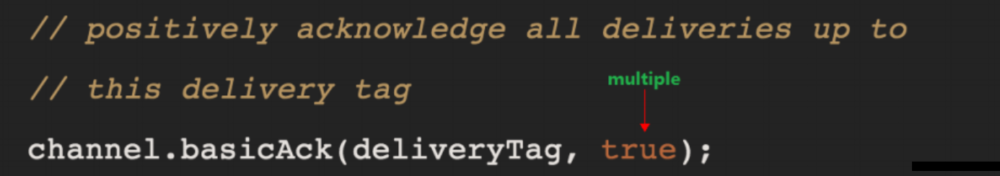

- **multiple 的 true 和 false 代表不同意思**
  - **true 代表批量应答 channel 上未应答的消息**
    - **比如说 channel 上有传送 tag 的消息 5,6,7,8 当前 tag 是 8 那么此时**
    - **5-8 的这些还未应答的消息都会被确认收到消息应答**
- **false 同上面相比**
  - **只会应答 tag=8 的消息 5,6,7 这三个消息依然不会被确认收到消息应答**
    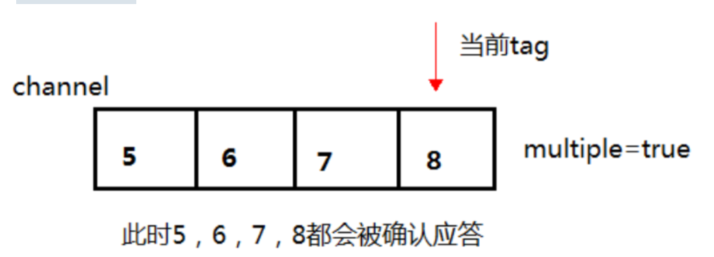
    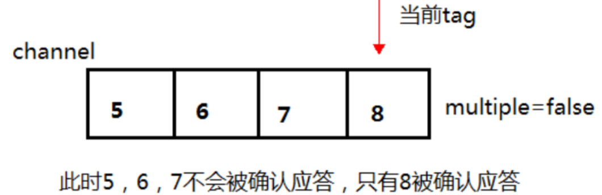


### 1.2.5. 消息自动重新入队 

如果消费者由于某些原因失去连接(其通道已关闭，连接已关闭或 TCP 连接丢失)，导致消息未发送 ACK 确认，RabbitMQ 将了解到消息未完全处理，并将对其重新排队。如果此时其他消费者可以处理，它将很快将其重新分发给另一个消费者。这样，即使某个消费者偶尔死亡，也可以确保不会丢失任何消息。
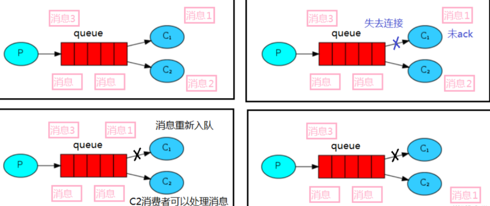


### 1.2.6. 消息手动应答代码 

默认消息采用的是自动应答，所以我们要想实现消息消费过程中不丢失，需要把自动应答改为手动应答，消费者在上面代码的基础上增加下面画红色部分代码。
**生产者**

```java
public class Producer {

    public static final String PRODUCE_QUEUE_NAME = "ack_queue";

    public static void main(String[] args) throws Exception {
        Channel channel = RabbitMqUtils.getChannel();
        // 声明队列
        channel.queueDeclare(PRODUCE_QUEUE_NAME, false, false, false, null);
        System.out.println("生产者已经就绪");

        Scanner scanner = new Scanner(System.in);
        while (scanner.hasNext()) {
            String message = scanner.next();
            channel.basicPublish("", PRODUCE_QUEUE_NAME, null, message.getBytes("UTF-8"));
            System.out.println("生产者发出消息 -> " + message);
        }
    }
}
```

**消费者1**

```java
public class Consumer1 {
    public static final String PRODUCE_QUEUE_NAME = "ack_queue";

    public static void main(String[] args) throws Exception {

        Channel channel = RabbitMqUtils.getChannel();

        // 消息接受
        DeliverCallback deliverCallback = (consumerTag, message) -> {
            SleepUtils.sleep(1);
            System.out.println("Consumer1 receive" + new String(message.getBody(), "UTF-8"));
            // 开启手动应答 一定要自己进行应答
            channel.basicAck(message.getEnvelope().getDeliveryTag(), false);
        };

        // 取消消息的回调
        CancelCallback cancelCallback = consumerTag -> {
            System.out.println(consumerTag + "message Cancelled");
        };

        /**
         * 消费者消费消息 -> 取消自动应答
         */
        System.out.println("Consumer1 waiting...");
        channel.basicConsume(PRODUCE_QUEUE_NAME, false, deliverCallback, cancelCallback);
    }
}
```

**消费者2**

```java
public class Consumer2 {
    public static final String PRODUCE_QUEUE_NAME = "ack_queue";

    public static void main(String[] args) throws Exception {

        Channel channel = RabbitMqUtils.getChannel();

        // 消息接受
        DeliverCallback deliverCallback = (consumerTag, message) -> {
            SleepUtils.sleep(3);
            System.out.println("Consumer2 receive" + new String(message.getBody(), "UTF-8"));
            // 开启手动应答 一定要自己进行应答
            channel.basicAck(message.getEnvelope().getDeliveryTag(), false);
        };

        // 取消消息的回调
        CancelCallback cancelCallback = consumerTag -> {
            System.out.println(consumerTag + "message Cancelled");
        };

        /**
         * 消费者消费消息 -> 取消自动应答
         */
        System.out.println("Consumer1 waiting...");
        channel.basicConsume(PRODUCE_QUEUE_NAME, false, deliverCallback, cancelCallback);
    }
}
```


### 1.2.7. 手动应答效果演示

正常情况下消息发送方发送两个消息 `C1` 和 `C2` 分别接收到消息并进行处理
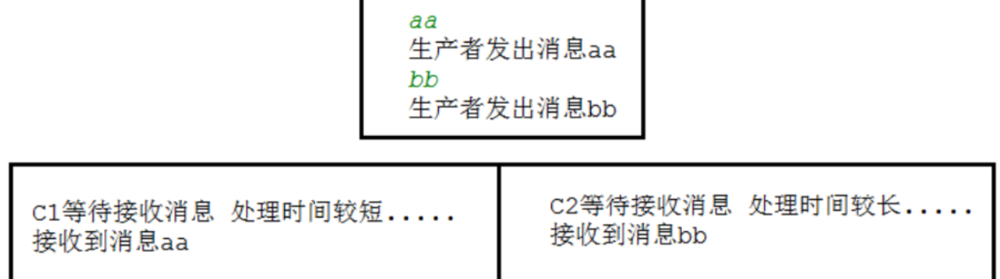
在发送者发送消息 `dd`，发出消息之后的把 `C2` 消费者停掉，按理说该 `C2` 来处理该消息，但是由于它处理时间较长，在还未处理完，也就是说 `C2` 还没有执行 `ack` 代码的时候，`C2` 被停掉了，此时会看到消息被 `C1` 接收到了，说明消息 `dd` 被重新入队，然后分配给能处理消息的 `C1` 处理了

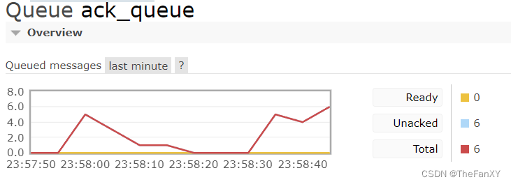
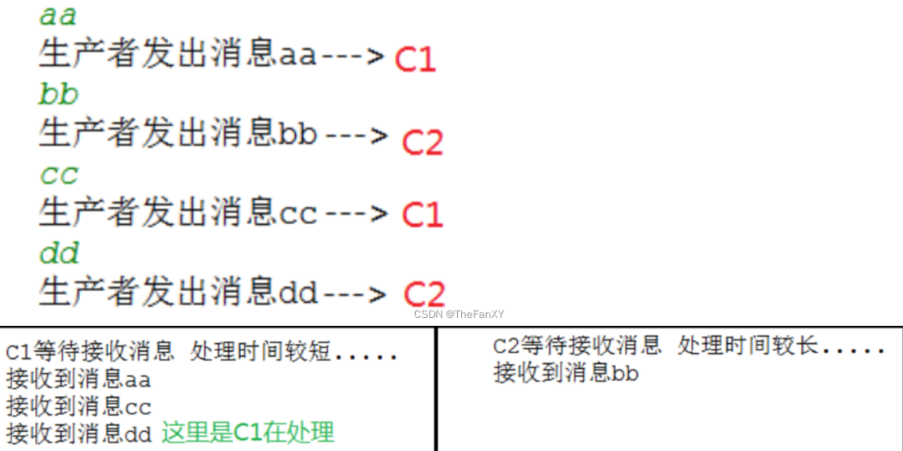

## 1.3. RabbitMQ 持久化

### 1.3.1. 概念

刚刚我们已经看到了如何处理任务不丢失的情况，但是如何保障当 `RabbitMQ` 服务停掉以后消息生产者发送过来的消息不丢失。默认情况下 `RabbitMQ` 退出或由于某种原因崩溃时，它忽视队列和消息，除非告知它不要这样做。确保消息不会丢失需要做两件事：**我们需要将队列和消息都标记为持久化。**


### 1.3.2. 队列如何实现持久化

之前我们创建的队列都是非持久化的，`rabbitmq` 如果重启的化，该队列就会被删除掉，如果要队列实现持久化 需要在声明队列的时候把 `durable` 参数设置为持久化
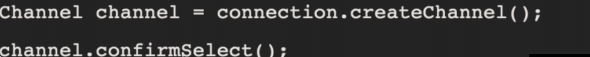
**但是需要注意的就是如果之前声明的队列不是持久化的，需要把原先队列先删除，或者重新创建一个持久化的队列，不然就会出现错误**
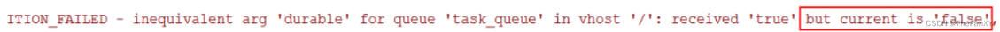
**以下为控制台中持久化与非持久化队列的 `UI` 显示区**
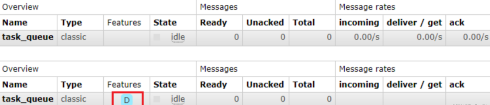
**这个时候即使重启 `rabbitmq` 队列也依然存在**

**`RabbitMQ`中的队列持久化和消息持久化都是为了保证消息不会丢失，但它们的作用不同。
队列持久化是指在`RabbitMQ`服务器重启后，仍然能够保留该队列及其中的消息。如果队列没有被持久化，那么在`RabbitMQ`服务器重启后，该队列将会被删除。
消息持久化是指在消息发送到`RabbitMQ`服务器后，即使在服务器重启之后，消息仍然能够被消费者接收到。如果消息没有被持久化，那么在`RabbitMQ`服务器重启后，该消息将会丢失。
因此，队列持久化和消息持久化都是为了保证消息不会丢失，但它们的作用不同。如果需要确保消息在重启后不丢失，需要同时使用队列持久化和消息持久化。**


### 1.3.3. 消息实现持久化

**要想让消息实现持久化需要在消息生产者修改代码
`MessageProperties.PERSISTENT_TEXT_PLAIN`添加这个属性。**
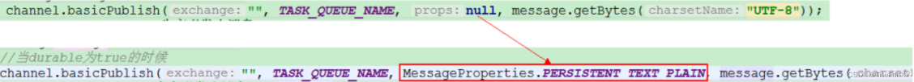
**将消息标记为持久化并不能完全保证不会丢失消息。** 尽管它告诉 `RabbitMQ` 将消息保存到磁盘，但是
这里依然存在当消息刚准备存储在磁盘的时候 但是还没有存储完，消息还在缓存的一个间隔点。此时并没有真正写入磁盘。持久性保证并不强，但是对于我们的简单任务队列而言，这已经绰绰有余了。**如果需要更强有力的持久化策略，参考后边章节。**


### 1.3.4. 不公平分发

在最开始的时候我们学习到 `RabbitMQ` 分发消息采用的**轮询分发**，但是在**某种场景下这种策略并不是很好**，**比方说有两个消费者在处理任务，其中有个消费者 1 处理任务的速度非常快，而另外一个消费者 2处理速度却很慢**，这个时候我们还是采用轮询分发的化就会到这处理速度快的这个消费者很大一部分时间处于空闲状态，而处理慢的那个消费者一直在干活，这种分配方式在这种情况下其实就不太好，但是`RabbitMQ` 并不知道这种情况它依然很公平的进行分发。
**为了避免这种情况，我们可以在消费者处设置参数 `channel.basicQos(1)`【默认是0】**

**每次分配给该消费者的任务数量不超过1条，若超过一条分配给不忙的消费者**
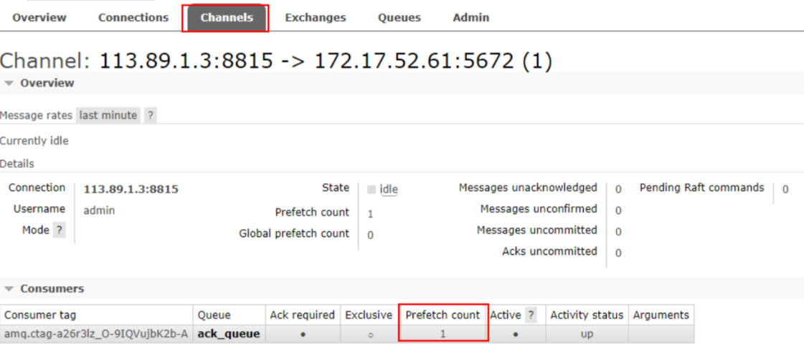
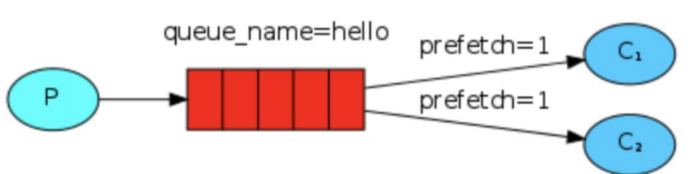
意思就是如果这个任务我还没有处理完或者我还没有应答你，你先别分配给我，我目前只能处理**一个【设置的值代表最多给一个消费者分配的消息数量】**任务，**然后 `rabbitmq` 就会把该任务分配给没有那么忙的那个空闲消费者，当然如果所有的消费者都没有完成手上任务，队列还在不停的添加新任务，队列有可能就会遇到队列被撑满的情况，这个时候就只能添加新的 `worker` 或者改变其他存储任务的策略。**


### 1.3.5. 预取值【和前面是一个`api`，可以看作信道窗口大小】

本身消息的发送就是异步发送的，所以在任何时候，channel 上肯定不止只有一个消息另外来自消费者的手动确认本质上也是异步的。因此这里就存在一个未确认的消息缓冲区，因此希望开发人员能**限制此缓冲区的大小，以避免缓冲区里面无限制的未确认消息问题。** 这个时候就可以通过使用 `basic.qos` **方法设置“预取计数”值来完成的。** **该值定义通道上允许的未确认消息的最大数量。** 一旦数量达到配置的数量，`RabbitMQ` 将停止在通道上传递更多消息，除非至少有一个未处理的消息被确认，例如，假设在通道上有未确认的消息 `5、6、7，8`，并且通道的预取计数设置为 `4`，此时 `RabbitMQ` 将不会在该通道上再传递任何消息，**除非至少有一个未应答的消息被 ack**。比方说 `tag=6` 这个消息刚刚被确认`ACK`，`RabbitMQ` 将会感知这个情况到并再发送一条消息。**消息应答和 `QoS` 预取值对用户吞吐量有重大影响。通常，增加预取将提高向消费者传递消息的速度。虽然自动应答传输消息速率是最佳的，但是，在这种情况下已传递但尚未处理的消息的数量也会增加，从而增加了消费者的 RAM 消耗(随机存取存储器)应该小心使用具有无限预处理的自动确认模式或手动确认模式，消费者消费了大量的消息如果没有确认的话，会导致消费者连接节点的内存消耗变大，所以找到合适的预取值是一个反复试验的过程，不同的负载该值取值也不同 100 到 300 范围内的值通常可提供最佳的吞吐量，并且不会给消费者带来太大的风险。预取值为 1 是最保守的。当然这将使吞吐量变得很低，特别是消费者连接延迟很严重的情况下，特别是在消费者连接等待时间较长的环境中。对于大多数应用来说，稍微高一点的值将是最佳的**

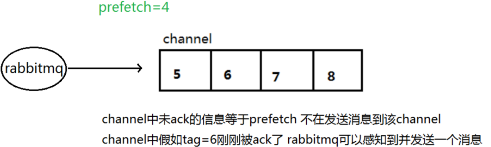