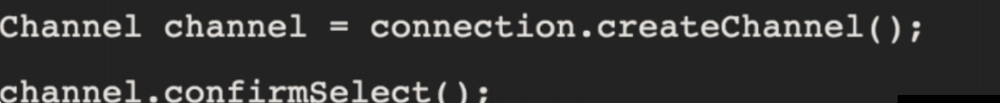
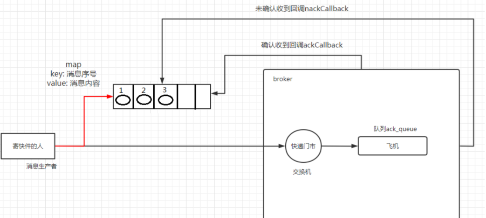
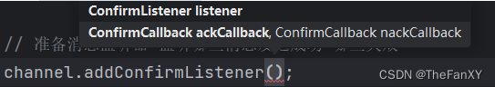

# 发布确认

## 1.1. 发布确认原理

生产者将信道设置成 `confirm` 模式，一旦信道进入 `confirm` 模式，**所有在该信道上面发布的消息都将会被指派一个唯一的 ID(从 1 开始)**，一旦消息被投递到所有匹配的队列之后，`broker`就会发送一个确认给生产者(包含消息的唯一 `ID`)，这就使得生产者知道消息已经正确到达目的队列了，如果消息和队列是可持久化的，那么确认消息会在将消息写入磁盘之后发出，`broker` 回传给生产者的确认消息中 `delivery-tag` 域包含了确认消息的序列号，此外 `broker` 也可以设置`basic.ack` 的 `multiple` 域，表示到这个序列号之前的所有消息都已经得到了处理。`confirm` 模式最大的好处在于他是异步的，一旦发布一条消息，生产者应用程序就可以在等信道返回确认的同时继续发送下一条消息，当消息最终得到确认之后，生产者应用便可以通过回调方法来处理该确认消息，如果 `RabbitMQ` 因为自身内部错误导致消息丢失，就会发送一条 `nack` 消息，生产者应用程序同样可以在回调方法中处理该 `nack` 消息。

## 1.2. 发布确认的策略

### 1.2.1. 开启发布确认的方法

发布确认默认是没有开启的，如果要开启需要调用方法 `confirmSelect`，每当你要想使用发布确认，都需要在 `channel` 上调用该方法




### 1.2.2. 单个确认发布

这是一种简单的确认方式，它是一种 **同步确认发布** 的方式，也就是发布一个消息之后只有它被确认发布，后续的消息才能继续发布, `waitForConfirmsOrDie(long)` 这个方法只有在消息被确认的时候才返回，如果在指定时间范围内这个消息没有被确认那么它将抛出异常。
这种确认方式有一个最大的缺点就是：**发布速度特别的慢**，因为如果没有确认发布的消息就会阻塞所有后续消息的发布，这种方式最多提供每秒不超过数百条发布消息的吞吐量。当然对于某些应用程序来说这可能已经足够了。

```java
public class ProducerIndividual {

    //发布消息个数
    public static final int MESSAGE_COUNT = 1000;

    public static void main(String[] args) throws Exception {
        PublishMessage();
    }

    public static void PublishMessage() throws Exception {
        Channel channel = RabbitMqUtils.getChannel();
        String queueName = UUID.randomUUID().toString();
        channel.queueDeclare(queueName, false, false, false, null);
        // 开启发布确认
        channel.confirmSelect();

        // 开始时间
        long start = System.currentTimeMillis();

        for (int i = 0; i < MESSAGE_COUNT; i++) {
            String message = i + "";
            channel.basicPublish("", queueName, null, message.getBytes());
            boolean flag = channel.waitForConfirms();
            if (flag) {
                System.out.println("消息发送成功");
            }
        }
        long end = System.currentTimeMillis();
        System.out.println("发布 " + MESSAGE_COUNT + "条单独确认消息耗时 " + (end - start) + "ms");
    }
}
```


### 1.2.3. 批量确认发布 

上面那种方式非常慢，与单个等待确认消息相比，先发布一批消息然后一起确认可以极大地提高吞吐量，**当然这种方式的缺点就是:当发生故障导致发布出现问题时，不知道是哪个消息出现问题了，我们必须将整个批处理保存在内存中，以记录重要的信息而后重新发布消息。当然这种方案仍然是同步的，也一样阻塞消息的发布。**

```java
    public static void PublishMessageBatch() throws Exception {
        Channel channel = RabbitMqUtils.getChannel();
        String queueName = UUID.randomUUID().toString();
        channel.queueDeclare(queueName, false, false, false, null);
        // 开启发布确认
        channel.confirmSelect();

        // 开始时间
        long start = System.currentTimeMillis();

        for (int i = 1; i <= MESSAGE_COUNT; i++) {
            String message = i + "";
            channel.basicPublish("", queueName, null, message.getBytes());
            if (i % 100 == 0){
                if (channel.waitForConfirms()) {
                    System.out.println("消息发送成功——> 100条");
                }
            }
        }

        long end = System.currentTimeMillis();
        System.out.println("发布 " + MESSAGE_COUNT + "条消息耗时 " + (end - start) + "ms");
    }
```


### 1.2.4. 异步确认发布

**异步确认虽然编程逻辑比上两个要复杂，但是性价比最高，无论是可靠性还是效率都没得说，他是利用回调函数来达到消息可靠性传递的，这个中间件也是通过函数回调来保证是否投递成功，下面就让我们来详细讲解异步确认是怎么实现的。**


**发消息前需要设置监听器，建议写两个参数的构造方法，把成功和失败的回调函数都完成。**



**基本实现异步发送，但没有实现如何进行异步的处理**

```java
    public static void PublishMessageAsync() throws Exception {
        Channel channel = RabbitMqUtils.getChannel();
        String queueName = UUID.randomUUID().toString();
        channel.queueDeclare(queueName, false, false, false, null);
        // 开启发布确认
        channel.confirmSelect();

        // 开始时间
        long start = System.currentTimeMillis();

        /**
         * 消息确认成功的回调函数
         * 参数
         * 1. 消息的标签
         * 2. 是否是批量确认
         */
        ConfirmCallback ackCallback = (deliveryTag, multiple) ->{
            System.out.println("确认的消息---> " + deliveryTag);
        };

        // 消息确认失败的回调函数
        ConfirmCallback nackCallback = (deliveryTag, multiple) ->{
            System.out.println("未确认的消息---> " + deliveryTag);
        };

        // 添加监听器
        channel.addConfirmListener(ackCallback, nackCallback);

        for (int i = 0; i < MESSAGE_COUNT; i++) {
            String message = i + "消息";
            channel.basicPublish("", queueName, null, message.getBytes());
        }

        long end = System.currentTimeMillis();
        System.out.println("发布 " + MESSAGE_COUNT + "条消息耗时 " + (end - start) + "ms");
    }
```


### 1.2.5. 如何处理异步未确认消息 

**最好的解决的解决方案就是把未确认的消息放到一个基于内存的能被发布线程访问的队列，
比如说用 `ConcurrentLinkedQueue` 这个队列在 `confirm callbacks` 与`发布线程`之间进行消息的传
递**

```java
    public static void PublishMessageAsync() throws Exception {
        Channel channel = RabbitMqUtils.getChannel();
        String queueName = UUID.randomUUID().toString();
        channel.queueDeclare(queueName, false, false, false, null);

        // 开启发布确认
        channel.confirmSelect();

        /**
         * 线程安全有序的一个哈希表 适用于高并发的情况
         * 1. 轻松将序号和消息进行关联
         * 2. 轻松批量删除条目 只要给到序号
         * 3. 支持高并发【多线程】
         */

        ConcurrentSkipListMap<Long, String> outstandingConfirms =
                new ConcurrentSkipListMap<>();

        /**
         * 消息确认成功的回调函数
         * 参数
         * 1. 消息的标签
         * 2. 是否是批量确认
         */
        ConfirmCallback ackCallback = (deliveryTag, multiple) -> {
            if (multiple) {
                ConcurrentNavigableMap<Long, String> confirmed =
                        outstandingConfirms.headMap(deliveryTag);
                confirmed.clear();
            } else {
                outstandingConfirms.remove(deliveryTag);
            }
            System.out.println("确认的消息的tag---> " + deliveryTag);
        };

        // 消息确认失败的回调函数
        ConfirmCallback nackCallback = (deliveryTag, multiple) -> {
            String message = outstandingConfirms.get(deliveryTag);
            System.out.println("未确认的消息---> " + message + " 它的tag是---> " + deliveryTag);
        };

        // 添加监听器
        channel.addConfirmListener(ackCallback, nackCallback);

        // 开始时间
        long start = System.currentTimeMillis();

        for (int i = 0; i < MESSAGE_COUNT; i++) {
            String message = i + "消息";

            // 先获取下一次发布的序号，然后再放入哈希表
            outstandingConfirms.put(channel.getNextPublishSeqNo(), message);

            // 紧接着发布消息
            channel.basicPublish("", queueName, null, message.getBytes());
        }

        long end = System.currentTimeMillis();
        System.out.println("发布 " + MESSAGE_COUNT + "条消息耗时 " + (end - start) + "ms");
    }
```

**`ConcurrentSkipListMap`是Java中的一种并发有序映射表，它基于`SkipList`数据结构实现。`SkipList`是一种基于链表的数据结构，它通过在链表中加入多级索引来提高查找效率，类似于平衡树的思想。`ConcurrentSkipListMap`的特点是可以支持并发读写，并且操作具有良好的时间复杂度。**


> **`ConcurrentSkipListMap`的主要API包括：**
>
> `put(K key, V value)`：将指定的键值对插入到映射表中，如果键已经存在，则更新对应的值。
>
> `remove(Object key)`：从映射表中删除指定键对应的键值对。
>
> `get(Object key)`：获取指定键对应的值。
>
> `headMap(K toKey)`：返回小于toKey的所有键值对的子映射。
>
> `tailMap(K fromKey)`：返回大于等于fromKey的所有键值对的子映射。
>
> `subMap(K fromKey, K toKey)`：返回大于等于fromKey且小于toKey的所有键值对的子映射。


**上面代码中使用了`headMap`方法，它返回小于指定`delivery tag`的所有键值对的子映射。在这里，`outstandingConfirms`是一个`ConcurrentNavigableMap`类型的对象，它维护了消息的`delivery tag`和消息内容之间的映射关系。在确认消息时，我们需要将已经确认的消息从`outstandingConfirms`中删除，因此使用了`headMap`方法来获取需要删除的消息。**


### 1.2.6. 以上 3 种发布确认速度对比

- **单独发布消息**
  - 同步等待确认，简单，但吞吐量非常有限。
- **批量发布消息**
  - 批量同步等待确认，简单，合理的吞吐量，一旦出现问题但很难推断出是那条消息出现了问题。
- **异步处理**
  - **最佳性能和资源使用，在出现错误的情况下可以很好地控制，但是实现起来稍微难些**

```java
    public static void main(String[] args) throws Exception {

        // 单条发送确认 发布1000条消息耗时 853ms
        PublishMessageIndividual();

        // 批量100条确认一次 发布 1000条消息耗时 69ms
        PublishMessageBatch();

        // 异步发送确认【无处理版本】 发布 1000条消息耗时 34ms
        // 异步发送确认【处理版本】 发布 发布 1000条消息耗时 44ms
        PublishMessageAsync();
    }
```
