# 交换机

**在上一节中，我们创建了一个工作队列。我们假设的是工作队列背后，每个任务都恰好交付给一个消费者(工作进程)。在这一部分中，我们将做一些完全不同的事情-我们将消息传达给多个消费者。这模式称为 `”发布/订阅”`.
为了说明这种模式，我们将构建一个简单的日志系统。它将由两个程序组成:第一个程序将发出日志消息，第二个程序是消费者。其中我们会启动两个消费者，其中一个消费者接收到消息后把日志存储在磁盘
另外一个消费者接收到消息后把消息打印在屏幕上，事实上第一个程序发出的日志消息将广播给所有消费者**

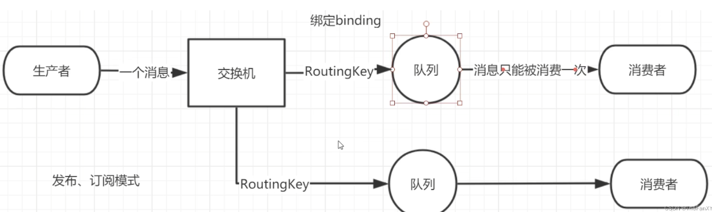

## 1.1. Exchanges

### 1.1.1. Exchanges 概念

`RabbitMQ` 消息传递模型的核心思想是: **生产者生产的消息从不会直接发送到队列**。实际上，通常生产者甚至都不知道这些消息传递传递到了哪些队列中。
相反，**生产者只能将消息发送到交换机(`exchange`)**，交换机工作的内容非常简单，一方面它接收来自生产者的消息，另一方面将它们推入队列。交换机必须确切知道如何处理收到的消息。是应该把这些消息放到特定队列还是说把他们到许多队列中还是说应该丢弃它们。这就的由交换机的类型来决定
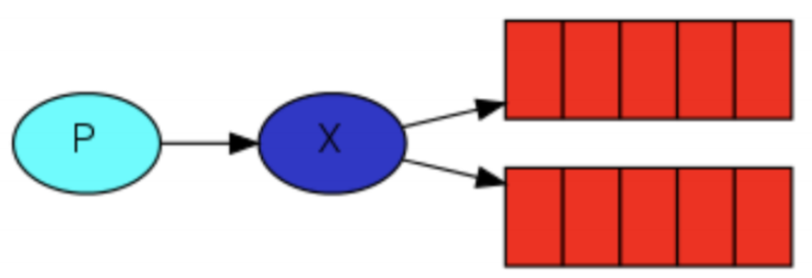


### 1.1.2. Exchanges 的类型 

**总共有以下类型：**
**直接(direct), 主题(topic) ,标题(headers) 【不常用】, 扇出(fanout)**


### 1.1.3. 无名 exchange 

**在本教程的前面部分我们对 `exchange` 一无所知，但仍然能够将消息发送到队列。之前能实现的原因是因为我们使用的是默认交换，我们通过空字符串(`“”`)进行标识。**


**第一个参数是交换机的名称。空字符串表示默认或无名称交换机：消息能路由发送到队列中其实是由 `routingKey(bindingkey)`绑定 `key` 指定的，如果它存在的话**


## 1.2. 临时队列

之前的章节我们使用的是具有特定名称的队列(还记得 `hello` 和 `ack_queue` 吗？)。队列的名称我们来说至关重要-我们需要指定我们的消费者去消费哪个队列的消息。
每当我们连接到 `Rabbit` 时，我们都需要一个全新的空队列，为此我们可以创建一个具有**随机名称的队列**，或者能让服务器为我们选择一个随机队列名称那就更好了。其次**一旦我们断开了消费者的连接，队列将被自动删除。**

创建临时队列的方式如下:

```java
String queueName = channel.queueDeclare().getQueue();
```

创建出来之后长成这样:
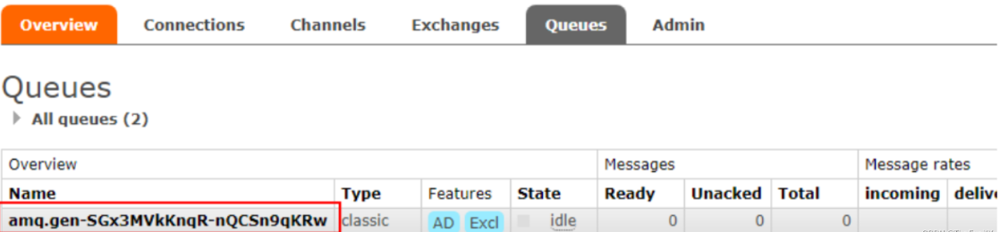


## 1.3. 绑定(bindings)

**什么是 `bingding` 呢，`binding` 其实是 `exchange` 和 `queue` 之间的桥梁，它告诉我们 `exchange` 和那个队列进行了绑定关系。比如说下面这张图告诉我们的就是 `X` 与 `Q1` 和 `Q2` 进行了绑定**
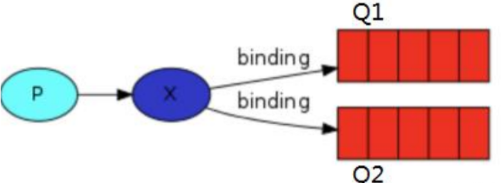

## 1.4. Fanout【扇出交换机：也称发布订阅模式】

### 1.4.1. Fanout 介绍 

Fanout 这种类型非常简单。正如从名称中猜到的那样，它是将接收到的所有消息 **广播** 到它知道的所有队列中。系统中默认有些 `exchange` 类型

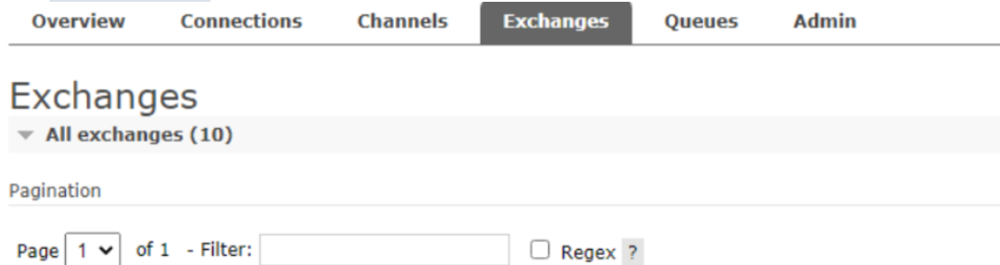


### 1.4.2. Fanout 实战

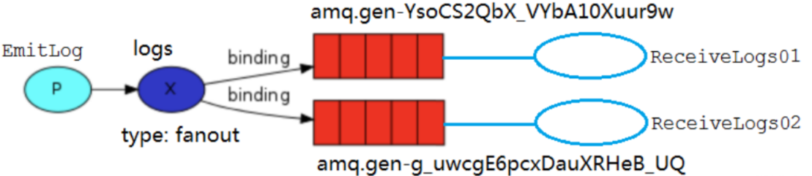
**`Logs` 和临时队列的绑定关系如下图，这里 `Routing key` 没写代表是空串，而不是没有**
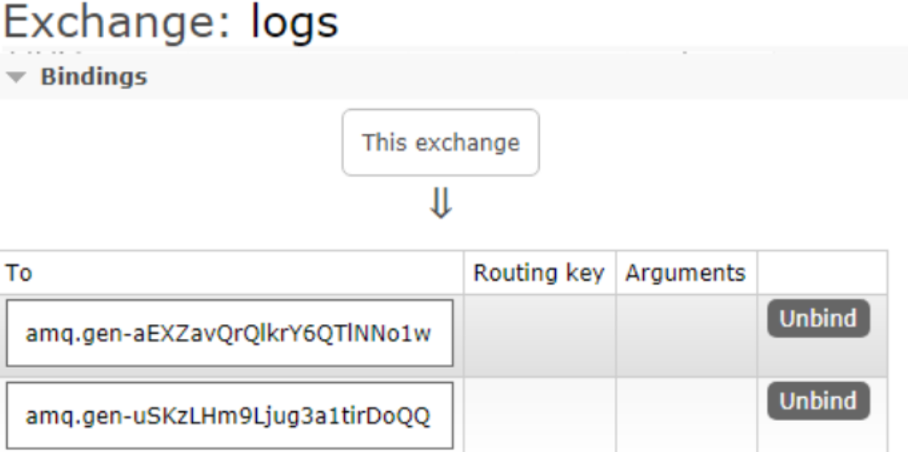
**官方文档写的很清楚 `fanout`类型的交换机可以忽略`routingkey` 只要队列绑定了交换机都能收到，哪怕专门写了不同的`routingKey`【这里写什么都无所谓，建议写空串，比较规范】，也能广播接受，所以只和交换机类型有关，和其他无关**

**`EmitLog` 发送消息给两个消费者接收**

```java
public class EmitLog {
    public static final String EXCHANGE_NAME = "logs";

    public static void main(String[] args) throws Exception {
        Channel channel = RabbitMqUtils.getChannel();
        channel.exchangeDeclare(EXCHANGE_NAME, "fanout");

        Scanner scanner = new Scanner(System.in);
        while (scanner.hasNext()) {
            String message = scanner.next();
            if (message.equals("quit")) break;
            // 第三个 填 null 的参数代表 props 可以传入一个 hashmap 存一些配置
            channel.basicPublish(EXCHANGE_NAME, "", null, message.getBytes("UTF-8"));
            System.out.println("生产者发送消息成功 【消息为】 ---> :" + message);
        }
    }
}
```

**ReceiveLogs01 将接收到的消息打印在控制台**

```java
public class ReceiveLogs01 {

    public static final String EXCHANGE_NAME = "logs";

    public static void main(String[] args) throws Exception {
        Channel channel = RabbitMqUtils.getChannel();

        // 声明一个交换机
        channel.exchangeDeclare(EXCHANGE_NAME, "fanout");

        /**
         *  声明一个临时队列，它的名字是随机的
         *  当消费者断开与队列的连接的时候 队列就自动删除了
         */
        String queueName = channel.queueDeclare().getQueue();

        /**
         * 绑定队列和交换机
         * 官方文档写的很清楚 fanout类型的交换机
         * 可以忽略routingKey 只要队列绑定了交换机都能收到
         */
        channel.queueBind(queueName, EXCHANGE_NAME, "");
        System.out.println("消费者01准备好接受消息");

        DeliverCallback callback = (consumerTag, message) ->{
            System.out.println("控制台打印接收到的消息---> " + new String(message.getBody(), "UTF-8"));
        };

        channel.basicConsume(queueName, true, callback, consumerTag -> {});
    }
}
```

**ReceiveLogs02 将接收到的消息打印在控制台，代码和01没有任何区别**

## 1.5. Direct exchange

### 1.5.1. 回顾 

在上一节中，我们构建了一个简单的日志记录系统。我们能够向许多接收者广播日志消息。在本节我们将向其中添加一些特别的功能-比方说我们只让某个消费者订阅发布的部分消息。例如我们只把严重错误消息定向存储到日志文件(以节省磁盘空间)，同时仍然能够在控制台上打印所有日志消息。我们再次来回顾一下什么是 `bindings`，绑定是交换机和队列之间的桥梁关系。**也可以这么理解：队列只对它绑定的交换机的消息感兴趣。绑定用参数：`routingKey` 来表示也可称该参数为 `binding key`，创建绑定我们用代码:**

```java
channel.queueBind(queueName, EXCHANGE_NAME, "routingKey");
```

**绑定之后的意义由其交换类型决定。**


### 1.5.2. Direct exchange 介绍 

上一节中的我们的日志系统将所有消息广播给所有消费者，对此我们想做一些改变，例如我们希望将日志消息写入磁盘的程序仅接收严重错误(errros)，而不存储哪些警告(warning)或信息(info)日志消息避免浪费磁盘空间。Fanout 这种交换类型并不能给我们带来很大的灵活性-它只能进行无意识的广播，在这里我们将使用 direct 这种类型来进行替换，这种类型的工作方式是，消息只去到它绑定的routingKey 队列中去。

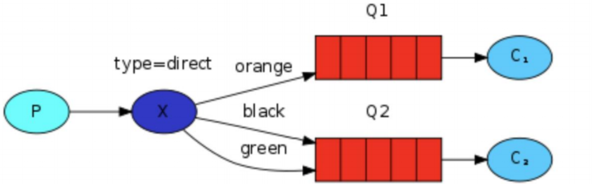
**在上面这张图中，我们可以看到 `X` 绑定了两个队列，绑定类型是 `direct`。队列 Q1 绑定键为 `orange`，队列 `Q2` 绑定键有两个:一个绑定键为 `black`，另一个绑定键为 `green` 
在这种绑定情况下，生产者发布消息到 `exchange` 上，绑定键为 `orange` 的消息会被发布到队列`Q1`。绑定键为 `black，green` 和的消息会被发布到队列 `Q2`，其他消息类型的消息将被丢弃。**


### 1.5.3. 多重绑定

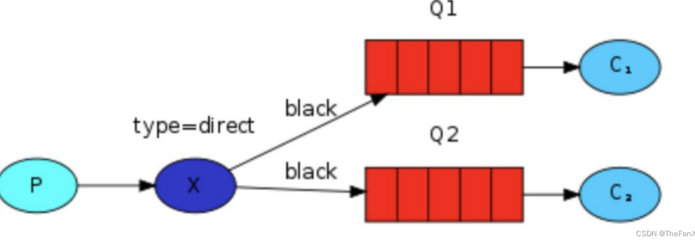
当然如果 `exchange` 的绑定类型是 `direct`，**但是它绑定的多个队列的 `key` 如果都相同**，在这种情况下虽然绑定类型是 `direct` **但是它表现的就和 `fanout` 有点类似了**，就跟广播差不多，如上图所示


### 1.5.4. 实战

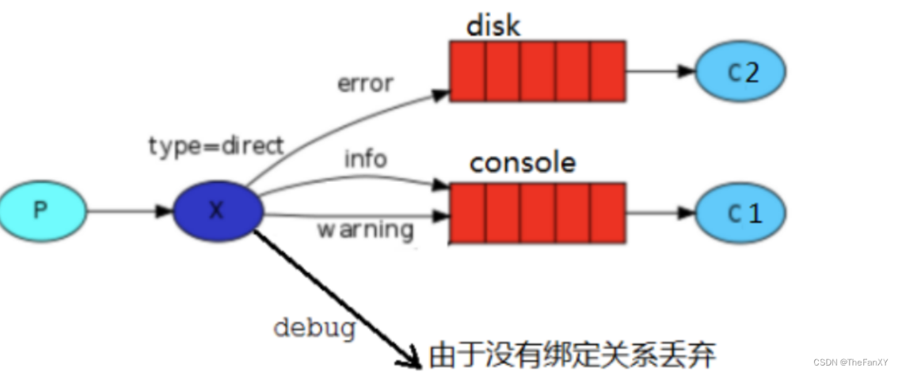

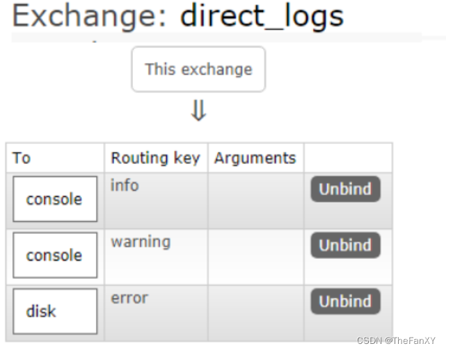
**ReceiveLogsDirect01 将接收到路由为【info  warning】的消息打印在控制台**

```java
public class ReceiveLogsDirect01 {
    public static final String EXCHANGE_NAME = "direct_logs";
    public static final String QUEUE_NAME = "console";

    public static void main(String[] args) throws Exception {
        Channel channel = RabbitMqUtils.getChannel();

        // 声明交换机
        channel.exchangeDeclare(EXCHANGE_NAME, BuiltinExchangeType.DIRECT);

        // 声明队列
        channel.queueDeclare(QUEUE_NAME, false, false, true, null);

        // 路由绑定
        channel.queueBind(QUEUE_NAME, EXCHANGE_NAME, "info");
        channel.queueBind(QUEUE_NAME, EXCHANGE_NAME, "warning");

        DeliverCallback callback = (consumerTag, message) ->{
            System.out.println("ReceiveLogsDirect01接收到的消息---> " + new String(message.getBody(), "UTF-8"));
        };

        channel.basicConsume(QUEUE_NAME, callback, consumerTag -> {});
    }
}
```

**ReceiveLogsDirect02 将接收到路由为【error】的消息打印在控制台**

```java
public class ReceiveLogsDirect02 {
    public static final String EXCHANGE_NAME = "direct_logs";
    public static final String QUEUE_NAME = "disk";

    public static void main(String[] args) throws Exception {
        Channel channel = RabbitMqUtils.getChannel();

        // 声明交换机
        channel.exchangeDeclare(EXCHANGE_NAME, BuiltinExchangeType.DIRECT);

        // 声明队列
        channel.queueDeclare(QUEUE_NAME, false, false, true, null);

        // 路由绑定
        channel.queueBind(QUEUE_NAME, EXCHANGE_NAME, "error");

        DeliverCallback callback = (consumerTag, message) ->{
            System.out.println("ReceiveLogsDirect02接收到的消息---> " + new String(message.getBody(), "UTF-8"));
        };

        channel.basicConsume(QUEUE_NAME, callback, consumerTag -> {});
    }
}
```

**DirectLogs 通过控制台将消息发送给交换机，而路由可以输入选择发送到哪**

```java
public class DirectLogs {
    public static final String EXCHANGE_NAME = "direct_logs";

    public static void main(String[] args) throws Exception {
        Channel channel = RabbitMqUtils.getChannel();
        channel.exchangeDeclare(EXCHANGE_NAME, BuiltinExchangeType.DIRECT);

        Scanner scanner = new Scanner(System.in);
        while (scanner.hasNext()) {
            System.out.println("请输入一个routingKey【error info warning】");
            String op = scanner.next();
            if (!op.equals("error") && !op.equals("info") && !op.equals("warning")) continue;
            System.out.println("请输入发布信息");
            String message = scanner.next();
            channel.basicPublish(EXCHANGE_NAME, op, null, message.getBytes("UTF-8"));
            System.out.println("生产者发送消息成功 【消息为】 ---> :" + message);
        }
    }
}

```


## 1.6. Topics

### 1.6.1. 之前类型的问题 

**在上一个小节中，我们改进了日志记录系统。我们没有使用只能进行随意广播的 `fanout` 交换机，而是使用了 `direct` 交换机，从而有能实现有选择性地接收日志。**

**尽管使用 `direct` 交换机改进了我们的系统，但是它仍然存在局限性-比方说我们想接收的日志类型有`info.base` 和 `info.advantage`，某个队列只想 `info.base` 的消息，那这个时候 `direct` 就办不到了。这个时候就只能使用 `topic` 类型**


### 1.6.2. Topic 的要求 

**发送到类型是 `topic` 交换机的消息的 `routing_key` 不能随意写，必须满足一定的要求，它必须是一个单词列表，以点号分隔开。这些单词可以是任意单词，比如说："`stock.usd.nyse`", "`nyse.vmw`", "`quick.orange.rabbit`".这种类型的。当然这个单词列表最多不能超过 `255` 个字节。**

**在这个规则列表中，其中有两个替换符是大家需要注意的**
	

- **`*`(星号)可以代替一个单词**
- **`#`(井号)可以替代零个或多个单词**


### 1.6.3. Topic 匹配案例 

下图绑定关系如下

- Q1-->绑定的是
  - 中间带 `orange` 带 3 个单词的字符串(`*.orange.*`)
- Q2-->绑定的是
  - 最后一个单词是 `rabbit` 的 3 个单词(`*.*.rabbit`)
  - 第一个单词是 `lazy` 的多个单词(`lazy.#`)
    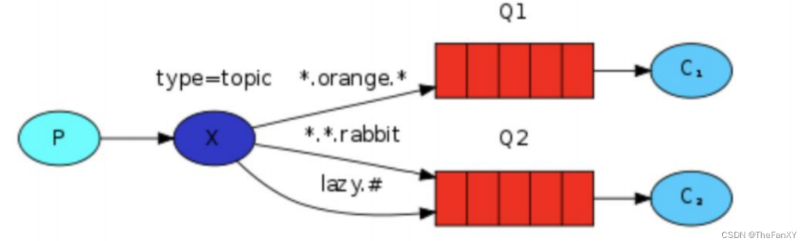
    上图是一个队列绑定关系图，我们来看看他们之间数据接收情况是怎么样的
- `quick.orange.rabbit` 被队列 `Q1 Q2` 接收到
- `lazy.orange.elephant` 被队列 `Q1 Q2` 接收到
- `quick.orange.fox` 被队列 `Q1` 接收到
- `lazy.brown.fox` 被队列 `Q2` 接收到
- `lazy.pink.rabbit` 虽然满足两个绑定但只被队列 `Q2` 接收一次
- `quick.brown.fox` 不匹配任何绑定不会被任何队列接收到会被丢弃
- `quick.orange.male.rabbit` 是四个单词不匹配任何绑定会被丢弃
- `lazy.orange.male.rabbit` 是四个单词但匹配 `Q2`

当队列绑定关系是下列这种情况时需要引起注意

- **当一个队列绑定键是`#`,那么这个队列将接收所有数据，就有点像 `fanout` 了**
- **如果队列绑定键当中没有`#`和`*`出现，那么该队列绑定类型就是 `direct` 了**

### 1.6.4. 实战

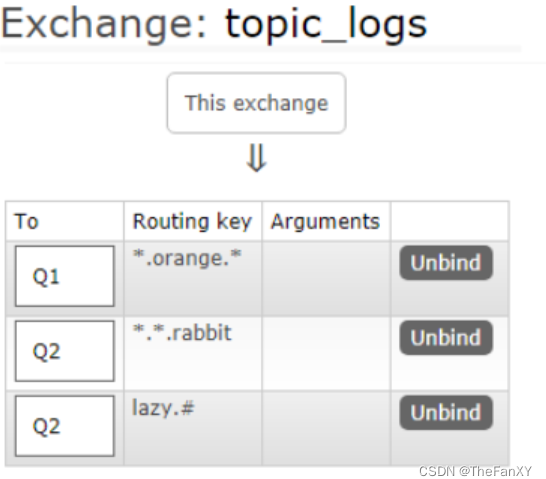
**`TopicLogs` 通过控制台将消息发送给交换机，而路由可以输入选择发送到哪**

```java
public class TopicLogs {
    public static final String EXCHANGE_NAME = "topic_logs";

    public static void main(String[] args) throws Exception {
        Channel channel = RabbitMqUtils.getChannel();
        channel.exchangeDeclare(EXCHANGE_NAME, BuiltinExchangeType.TOPIC);

        Scanner scanner = new Scanner(System.in);
        while (scanner.hasNext()) {
            System.out.println("请输入一个routingKey");
            String op = scanner.next();
            System.out.println("请输入发布信息");
            String message = scanner.next();
            channel.basicPublish(EXCHANGE_NAME, op, null, message.getBytes("UTF-8"));
            System.out.println("生产者发送消息成功 【消息为】 ---> :" + message);
        }
    }
}
```

**ReceiveLogsTopic01 将接收到路由规则为【`*.orange.*`】的消息打印在控制台**

```java
public class ReceiveLogsTopic01 {
    public static final String EXCHANGE_NAME = "topic_logs";
    public static final String QUEUE_NAME = "Q1";

    public static void main(String[] args) throws Exception {
        Channel channel = RabbitMqUtils.getChannel();

        // 声明交换机
        channel.exchangeDeclare(EXCHANGE_NAME, BuiltinExchangeType.TOPIC);

        // 声明队列
        channel.queueDeclare(QUEUE_NAME, false, false, true, null);

        // 路由绑定
        channel.queueBind(QUEUE_NAME, EXCHANGE_NAME, "*.orange.*");

        DeliverCallback callback = (consumerTag, message) ->{
            System.out.println("Q1接收到的消息---> " + new String(message.getBody(), "UTF-8"));
        };

        channel.basicConsume(QUEUE_NAME, callback, consumerTag -> {});
    }
}
```

**ReceiveLogsTopic02 将接收到路由规则为【`*.*.rabbit`】或【`lazy.#`】的消息打印在控制台**

```java
public class ReceiveLogsTopic02 {
    public static final String EXCHANGE_NAME = "topic_logs";
    public static final String QUEUE_NAME = "Q2";

    public static void main(String[] args) throws Exception {
        Channel channel = RabbitMqUtils.getChannel();

        // 声明交换机
        channel.exchangeDeclare(EXCHANGE_NAME, BuiltinExchangeType.TOPIC);

        // 声明队列
        channel.queueDeclare(QUEUE_NAME, false, false, true, null);

        // 路由绑定
        channel.queueBind(QUEUE_NAME, EXCHANGE_NAME, "*.*.rabbit");
        channel.queueBind(QUEUE_NAME, EXCHANGE_NAME, "lazy.#");

        DeliverCallback callback = (consumerTag, message) ->{
            System.out.println("Q2接收到的消息---> " + new String(message.getBody(), "UTF-8"));
        };

        channel.basicConsume(QUEUE_NAME, callback, consumerTag -> {});
    }
}

```

# 