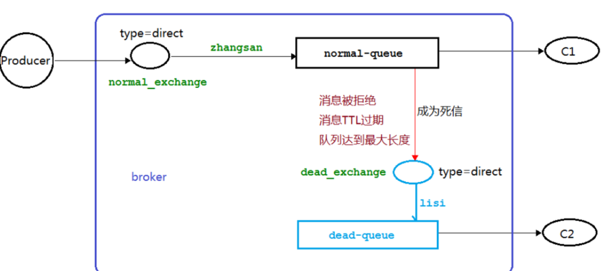
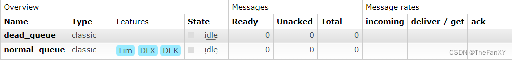

# 死信队列

## 1.1. 死信的概念

先从概念解释上搞清楚这个定义，死信，顾名思义就是无法被消费的消息，字面意思可以这样理解，一般来说，`producer` 将消息投递到 `broker` 或者直接到 `queue` 里了，`consumer` 从 `queue` 取出消息进行消费，但某些时候由于特定的**原因导致 queue 中的某些消息无法被消费**，这样的消息如果没有后续的处理，就变成了死信，有死信自然就有了死信队列。

**应用场景:** 为了保证订单业务的消息数据不丢失，需要使用到 `RabbitMQ` 的死信队列机制，当消息消费发生异常时，将消息投入死信队列中.还有比如说: 用户在商城下单成功并点击去支付后在指定时间未支付时自动失效

## 1.2. 死信的来源

**消息 `TTL` 过期
队列达到最大长度(队列满了，无法再添加数据到 `mq` 中)
消息被拒绝(`basic.reject` 或 `basic.nack`)并且 `requeue=false`.**

**当生产者和队列都设置了`TTL`时，以`TTL`较短的为准。**

**具体来说，当生产者发送一条消息时，RabbitMQ会首先检查该消息是否设置了TTL。如果设置了TTL，则会使用该TTL值作为消息的过期时间。如果该消息没有设置TTL，则会检查队列是否设置了TTL。如果队列设置了TTL，则会使用队列的TTL值作为消息的过期时间。如果消息和队列都没有设置TTL，则消息不会过期。**

**因此，无论是生产者还是队列，只要设置了TTL，就会影响消息的过期时间。而当两者都设置了TTL时，<font color="bb000">以TTL较短的为准，即消息的过期时间为两者中较短的那个TTL值。</font>**

## 1.3. 死信实战

### 1.3.1. 代码架构图



### 1.3.2. 消息 TTL 过期

**生产者代码**

```java
public class Producer {
    public static final String NORMAL_EXCHANGE = "normal_exchange";

    public static void main(String[] args) throws Exception {
        Channel channel = RabbitMqUtils.getChannel();

        // 声明交换机
        channel.exchangeDeclare(NORMAL_EXCHANGE, BuiltinExchangeType.DIRECT);

        // 死信消息 设置TTL时间
        AMQP.BasicProperties properties =
                new AMQP.BasicProperties()
                        .builder().expiration("10000")
                        .build();

        for (int i = 1; i < 11; i++) {
            String message = "info" + i;
            channel.basicPublish(NORMAL_EXCHANGE, "zhangsan", properties, message.getBytes("UTF-8"));
        }
    }
}
```

**消费者1负责构建中间队列和路由的关系，同时完成普通队列和死信路由的绑定，开启后手动关闭，模拟消费者1死亡，完成消息过期从普通队列输送到死信队列的操作**

**RabbitMQ的队列参数属性中，arguments是一个比较常用的属性，它可以用来设置队列的其他属性。以下是一些常用的arguments属性及其对应的参数名称：**

1. **`x-message-ttl`：消息过期时间，单位为毫秒。当消息在队列中等待的时间超过该时间时，消息会被自动删除。**
2. **`x-max-length`：队列中最大的消息数量。当队列中的消息数量达到该值时，旧的消息会被自动删除。**
3. **`x-expires`：队列过期时间，单位为毫秒。当队列在指定的时间内没有被使用时，队列会被自动删除。**
4. **`x-max-priority`：队列中消息的最大优先级。如果设置了该属性，则可以为每个消息指定一个优先级，高优先级的消息会先被消费。**
5. **`x-dead-letter-exchange`：死信交换机名称。当消息被拒绝、过期或达到最大重试次数后，会成为死信消息，并发送到指定的交换机中。**
6. **`x-dead-letter-routing-key`：死信路由键名称。当消息成为死信消息后，会使用该路由键将消息发送到指定的交换机中。**
7. **`x-queue-mode`：队列模式。可以设置为lazy或者default。如果设置为lazy，则队列会尽可能地将消息存储在磁盘上，以减少内存使用。**
8. **`x-queue-master-locator`：队列主节点定位器。可以设置为client-local或者random。如果设置为client-local，则每个消费者只会连接到一个节点上进行消费，否则会随机选择一个节点进行消费。**

**这些`arguments`属性可以通过`RabbitMQ`的管理界面或者`AMQP`协议进行设置。根据实际需求，可以选择不同的属性来控制队列的行为。**

```java
public class Consumer1 {

    public static final String NORMAL_EXCHANGE = "normal_exchange";
    public static final String DEAD_EXCHANGE = "dead_exchange";
    public static final String NORMAL_QUEUE = "normal_queue";
    public static final String DEAD_QUEUE = "dead_queue";

    public static void main(String[] args) throws Exception {
        Channel channel = RabbitMqUtils.getChannel();

        // 声明死信和普通交换机
        channel.exchangeDeclare(NORMAL_EXCHANGE, BuiltinExchangeType.DIRECT);
        channel.exchangeDeclare(DEAD_EXCHANGE, BuiltinExchangeType.DIRECT);

        // 这里声明死信队列需要更改代码
        /**********************************************************************
         *
         *   死信队列
         *   1. 声明过期时间参数
         *   2. 设置死信RoutingKey
         */
        HashMap<String, Object> arguments = new HashMap<>();
        // 过期时间 【可以在生产者处设置】
        //arguments.put("x-dead-letter-exchange", 10000);
        // 正常队列设置死信队列交换机
        arguments.put("x-dead-letter-exchange", DEAD_EXCHANGE);
        // 设置死信RoutingKey
        arguments.put("x-dead-letter-routing-key", "lisi");

        // 将参数绑定给普通队列
        channel.queueDeclare(NORMAL_QUEUE, false, false, false, arguments);

        // 死信队列不需要设置参数
        channel.queueDeclare(DEAD_QUEUE, false, false, false, null);

        // 绑定普通交换机和普通队列
        channel.queueBind(NORMAL_QUEUE, NORMAL_EXCHANGE, "zhangsan");

        // 绑定死信交换机和死信队列
        channel.queueBind(DEAD_QUEUE, DEAD_EXCHANGE, "lisi");

        System.out.println("等待接受消息");

        DeliverCallback callback = (consumerTag, message) -> {
            System.out.println(new String(message.getBody(), "UTF-8"));
        };
        channel.basicConsume(NORMAL_QUEUE, true, callback, consumerTag -> {});
    }
}
```

**消费者2，消费死信队列的死信消息**

```java
public class Consumer2 {

    public static final String DEAD_QUEUE = "dead_queue";

    public static void main(String[] args) throws Exception {
        Channel channel = RabbitMqUtils.getChannel();

        System.out.println("等待接受消息");

        DeliverCallback callback = (consumerTag, message) -> {
            System.out.println(new String(message.getBody(), "UTF-8"));
        };
        channel.basicConsume(DEAD_QUEUE, true, callback, consumerTag -> {});
    }
}
```


### 1.3.3. 队列达到最大长度 

1. **消息生产者代码去掉 `TTL` 属性**

```java
public class Producer {
    public static final String NORMAL_EXCHANGE = "normal_exchange";

    public static void main(String[] args) throws Exception {
        Channel channel = RabbitMqUtils.getChannel();

        // 声明交换机
        channel.exchangeDeclare(NORMAL_EXCHANGE, BuiltinExchangeType.DIRECT);

        // 死信消息 设置TTL时间
        /**
        AMQP.BasicProperties properties =
                new AMQP.BasicProperties()
                        .builder().expiration("10000")
                        .build();
		**/
        for (int i = 1; i < 11; i++) {
            String message = "info" + i;
            channel.basicPublish(NORMAL_EXCHANGE, "zhangsan", null, message.getBytes("UTF-8"));
        }
    }
}
```

**消费者1负责构建中间队列和路由的关系，同时我们设置队列最大长度，我们改了参数，但是之前的队列已经创建了，rabbitmq不支持更改已经生成的队列的参数，所以需要删除重新运行，而消费者2的代码不变**

```java
public class Consumer1 {

    public static final String NORMAL_EXCHANGE = "normal_exchange";
    public static final String DEAD_EXCHANGE = "dead_exchange";
    public static final String NORMAL_QUEUE = "normal_queue";
    public static final String DEAD_QUEUE = "dead_queue";

    public static void main(String[] args) throws Exception {
        Channel channel = RabbitMqUtils.getChannel();

        // 声明死信和普通交换机
        channel.exchangeDeclare(NORMAL_EXCHANGE, BuiltinExchangeType.DIRECT);
        channel.exchangeDeclare(DEAD_EXCHANGE, BuiltinExchangeType.DIRECT);

        // 这里声明死信队列需要更改代码
        /**********************************************************************
         *
         *   死信队列
         *   1. 声明过期时间参数
         *   2. 设置死信RoutingKey
         */
        HashMap<String, Object> arguments = new HashMap<>();
        // 过期时间 【可以在生产者处设置】
        //arguments.put("x-dead-letter-exchange", 10000);
        // 正常队列设置死信队列交换机
        arguments.put("x-dead-letter-exchange", DEAD_EXCHANGE);
        // 设置死信RoutingKey
        arguments.put("x-dead-letter-routing-key", "lisi");
        // 设置队列最大长度
        arguments.put("x-max-length", 6);

        // 将参数绑定给普通队列
        channel.queueDeclare(NORMAL_QUEUE, false, false, false, arguments);

        // 死信队列不需要设置参数
        channel.queueDeclare(DEAD_QUEUE, false, false, false, null);

        // 绑定普通交换机和普通队列
        channel.queueBind(NORMAL_QUEUE, NORMAL_EXCHANGE, "zhangsan");

        // 绑定死信交换机和死信队列
        channel.queueBind(DEAD_QUEUE, DEAD_EXCHANGE, "lisi");

        System.out.println("等待接受消息");

        DeliverCallback callback = (consumerTag, message) -> {
            System.out.println(new String(message.getBody(), "UTF-8"));
        };
        channel.basicConsume(NORMAL_QUEUE, true, callback, consumerTag -> {});
    }
}
```

启动消费者1，发现多了参数limit限制长度


### 1.3.4. 消息被拒 

1.消息生产者代码同上生产者一致

```java
public class Producer {
    public static final String NORMAL_EXCHANGE = "normal_exchange";

    public static void main(String[] args) throws Exception {
        Channel channel = RabbitMqUtils.getChannel();

        // 声明交换机
        channel.exchangeDeclare(NORMAL_EXCHANGE, BuiltinExchangeType.DIRECT);

        // 死信消息 设置TTL时间
/*        AMQP.BasicProperties properties =
                new AMQP.BasicProperties()
                        .builder().expiration("10000")
                        .build();*/

        for (int i = 1; i < 11; i++) {
            String message = "info" + i;
            channel.basicPublish(NORMAL_EXCHANGE, "zhangsan", null, message.getBytes("UTF-8"));
        }
    }
}
```

2.**C1 消费者代码，需要在声明消费的时候，声明关闭自动应答。并在应答回调里面，如果接受到的消息内容为info5，就拒绝接受，就会转交给死信交换机分发给死信路由，C2代码不变，可以不启动在浏览器界面看到死信队列堆积消息**

```java
public class Consumer1 {

    public static final String NORMAL_EXCHANGE = "normal_exchange";
    public static final String DEAD_EXCHANGE = "dead_exchange";
    public static final String NORMAL_QUEUE = "normal_queue";
    public static final String DEAD_QUEUE = "dead_queue";

    public static void main(String[] args) throws Exception {
        Channel channel = RabbitMqUtils.getChannel();

        // 声明死信和普通交换机
        channel.exchangeDeclare(NORMAL_EXCHANGE, BuiltinExchangeType.DIRECT);
        channel.exchangeDeclare(DEAD_EXCHANGE, BuiltinExchangeType.DIRECT);

        // 这里声明死信队列需要更改代码
        /**********************************************************************
         *
         *   死信队列
         *   1. 声明过期时间参数
         *   2. 设置死信RoutingKey
         */
        HashMap<String, Object> arguments = new HashMap<>();
        // 过期时间 【可以在生产者处设置】
        //arguments.put("x-dead-letter-exchange", 10000);
        // 正常队列设置死信队列交换机
        arguments.put("x-dead-letter-exchange", DEAD_EXCHANGE);
        // 设置死信RoutingKey
        arguments.put("x-dead-letter-routing-key", "lisi");
        // 设置队列最大长度
        //arguments.put("x-max-length", 6);

        // 将参数绑定给普通队列
        channel.queueDeclare(NORMAL_QUEUE, false, false, false, arguments);

        // 死信队列不需要设置参数
        channel.queueDeclare(DEAD_QUEUE, false, false, false, null);

        // 绑定普通交换机和普通队列
        channel.queueBind(NORMAL_QUEUE, NORMAL_EXCHANGE, "zhangsan");

        // 绑定死信交换机和死信队列
        channel.queueBind(DEAD_QUEUE, DEAD_EXCHANGE, "lisi");

        System.out.println("等待接受消息");

        DeliverCallback callback = (consumerTag, message) -> {
            String msg = new String(message.getBody(), "UTF-8");
            if ("info5".equals(msg)){
                // 第一个参数是消息的tag 第二个参数是是否重新放回原来的队列 这里选择不放回 就会放给死信路由
                channel.basicReject(message.getEnvelope().getDeliveryTag(), false);
                System.out.println("被拒绝的消息是---> " + msg);
            }else {
                channel.basicAck(message.getEnvelope().getDeliveryTag(), false);
                System.out.println("正常获得的消息是--->" + msg);
            }
        };
        channel.basicConsume(NORMAL_QUEUE, false, callback, consumerTag -> {});
    }
}
```

