# 延迟队列

## 1.1. 延迟队列概念

延时队列,队列内部是有序的，最重要的特性就体现在它的延时属性上，延时队列中的元素是希望在指定时间到了以后或之前取出和处理，简单来说，延时队列就是用来存放需要在指定时间被处理的元素的队列。

## 1.2. 延迟队列使用场景

1. 订单在十分钟之内未支付则自动取消
2. 新创建的店铺，如果在十天内都没有上传过商品，则自动发送消息提醒。
3. 用户注册成功后，如果三天内没有登陆则进行短信提醒。
4. 用户发起退款，如果三天内没有得到处理则通知相关运营人员。
5. 预定会议后，需要在预定的时间点前十分钟通知各个与会人员参加会议

**这些场景都有一个特点，需要在某个事件发生之后或者之前的指定时间点完成某一项任务**，如：发生订单生成事件，在十分钟之后检查该订单支付状态，然后将未支付的订单进行关闭；看起来似乎使用定时任务，一直轮询数据，每秒查一次，取出需要被处理的数据，然后处理不就完事了吗？

如果数据量比较少，确实可以这样做，比如：对于“如果账单一周内未支付则进行自动结算”这样的需求，如果对于时间不是严格限制，而是宽松意义上的一周，那么每天晚上跑个定时任务检查一下所有未支付的账单，确实也是一个可行的方案。

**但对于数据量比较大，并且时效性较强的场景**，如：“订单十分钟内未支付则关闭“，**短期内未支付的订单数据可能会有很多，活动期间甚至会达到百万甚至千万级别，对这么庞大的数据量仍旧使用轮询的方式显然是不可取的，很可能在一秒内无法完成所有订单的检查，同时会给数据库带来很大压力，无法满足业务要求而且性能低下。**

**这里其实是`三线同时进行的`，生成订单后 ——》`入库【暂时停止这张票购买】 && 提醒用户30秒内下单 && 进入延时队列`**
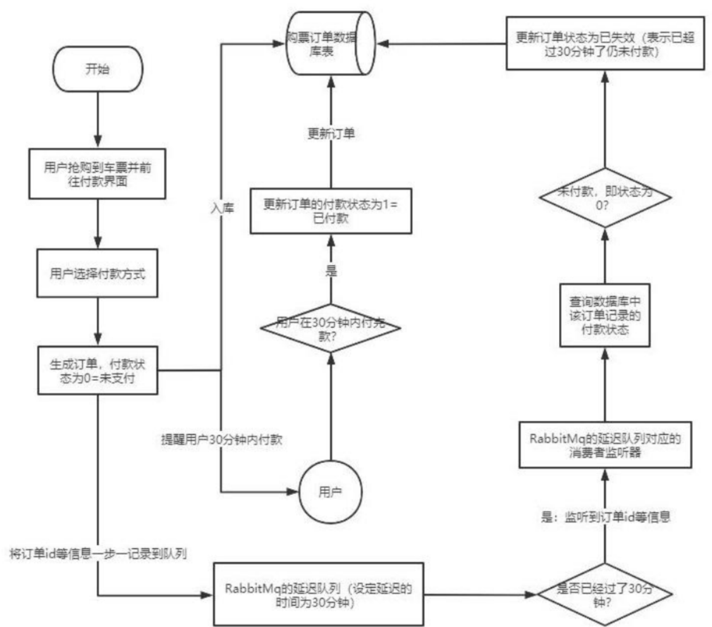

## 1.3. RabbitMQ 中的 TTL

`TTL` 是什么呢？`TTL` 是 `RabbitMQ` 中一个消息或者队列的属性，表明一条消息或者该队列中的所有消息的最大存活时间，单位是毫秒。换句话说，如果一条消息设置了 `TTL` 属性或者进入了设置 `TTL` 属性的队列，那么这条消息如果在 `TTL` 设置的时间内没有被消费，则会成为"死信"。如果同时配置了队列的 `TTL` 和消息的`TTL`，那么较小的那个值将会被使用，有两种方式设置 `TTL`。

### 1.3.1. 消息设置 TTL 

另一种方式便是针对每条消息设置 `TTL`
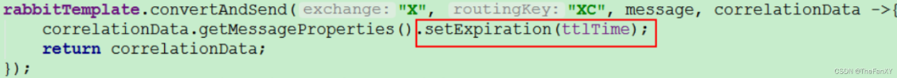

### 1.3.2. 队列设置 TTL 

第一种是在创建队列的时候设置队列的“`x-message-ttl`”属性
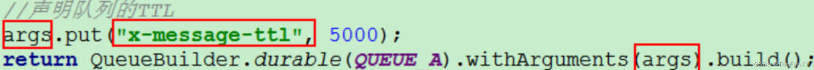

### 1.3.3. 两者的区别

如果设置了队列的 `TTL` 属性，那么一旦消息过期，就会被队列丢弃(如果配置了死信队列被丢到死信队列中)，而第二种方式，消息即使过期，也不一定会被马上丢弃，**因为消息是否过期是在即将投递到消费者之前判定的**，如果当前队列有严重的消息积压情况，则已过期的消息也许还能存活较长时间；另外，还需要注意的一点是，如果不设置 `TTL`，表示消息永远不会过期，如果将 `TTL` 设置为 0，则表示除非此时可以直接投递该消息到消费者，否则该消息将会被丢弃。
前一小节我们介绍了死信队列，刚刚又介绍了 `TTL`，至此利用 `RabbitMQ` 实现延时队列的两大要素已经集齐，接下来只需要将它们进行融合，再加入一点点调味料，延时队列就可以新鲜出炉了。想想看，延时队列，不就是想要消息延迟多久被处理吗，`TTL` 则刚好能让消息在延迟多久之后成为死信，另一方面，成为死信的消息都会被投递到死信队列里，这样只需要消费者一直消费死信队列里的消息就完事了，因为里面的消息都是希望被立即处理的消息。

## 1.4. 整合 springboot

### 1.4.1. 创建项目

创建一个无启动器的就行，直接复制下面的依赖

### 1.4.2. 添加依赖

```xml
    <dependencies>
        <!--RabbitMQ 依赖-->
        <dependency>
            <groupId>org.springframework.boot</groupId>
            <artifactId>spring-boot-starter-amqp</artifactId>
        </dependency>
        <dependency>
            <groupId>org.springframework.boot</groupId>
            <artifactId>spring-boot-starter-web</artifactId>
        </dependency>
        <dependency>
            <groupId>org.springframework.boot</groupId>
            <artifactId>spring-boot-starter-test</artifactId>
            <scope>test</scope>
        </dependency>
        <dependency>
            <groupId>com.alibaba</groupId>
            <artifactId>fastjson</artifactId>
            <version>1.2.47</version>
        </dependency>
        <dependency>
            <groupId>org.projectlombok</groupId>
            <artifactId>lombok</artifactId>
        </dependency>
        <!--swagger-->
        <dependency>
            <groupId>io.springfox</groupId>
            <artifactId>springfox-swagger2</artifactId>
            <version>2.9.2</version>
        </dependency>
        <dependency>
            <groupId>io.springfox</groupId>
            <artifactId>springfox-swagger-ui</artifactId>
            <version>2.9.2</version>
        </dependency>
        <!--RabbitMQ 测试依赖-->
        <dependency>
            <groupId>org.springframework.amqp</groupId>
            <artifactId>spring-rabbit-test</artifactId>
            <scope>test</scope>
        </dependency>
    </dependencies>
```

### 1.4.3. 修改配置文件

```yaml
spring.rabbitmq.host=192.168.110.100
spring.rabbitmq.port=5672
spring.rabbitmq.username=admin
spring.rabbitmq.password=123456
```

### 1.4.4. 添加 Swagger 配置类

```java
@Configuration
@EnableSwagger2
public class SwaggerConfig {
    @Bean
    public Docket webApiConfig(){
        return new Docket(DocumentationType.SWAGGER_2)
                .groupName("webApi")
                .apiInfo(webApiInfo())
                .select()
                .build();
    }
    private ApiInfo webApiInfo(){
        return new ApiInfoBuilder()
                .title("rabbitmq 接口文档")
                .description("本文档描述了 rabbitmq 微服务接口定义")
                .version("1.0")
                .contact(new Contact("fanxy", "http://fanxy.com",
                        "1111111@qq.com"))
                .build();
    }
}
```

## 1.5. 队列 TTL

### 1.5.1. 代码架构图

创建两个队列 QA 和 QB，两者队列 TTL 分别设置为 10S 和 40S，然后在创建一个交换机 X 和死信交换机 Y，它们的类型都是 direct，创建一个死信队列 QD，它们的绑定关系如下：

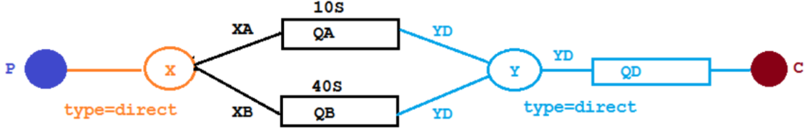

### 1.5.2. 配置文件类代码

**之前我们的架构都是采用把路由和队列的配置和绑定关系写在消费者那里，这是强耦合的，也就意味着我们必须先启动消费者，才能启动生产者，如果项目复杂，启动起来也是会出现很多问题，这里整合`springboot`之后我们就写在配置类里面，进行解耦合，写生产者消费者只需要单独写他们的功能即可**

```java
@Configuration
public class TtlQueueConfig {

    // 普通交换机名称
    public static final String X_EXCHANGE = "X";

    // 死信交换机的名称
    public static final String Y_DEAD_LETTER_EXCHANGE = "Y";

    // 普通队列名称
    public static final String QUEUE_A = "QA";
    public static final String QUEUE_B = "QB";

    // 死信队列名称
    public static final String DEAD_LETTER_QUEUE_D = "QD";

    // 声明X普通交换机
    @Bean
    public DirectExchange xExchange() {
        return new DirectExchange(X_EXCHANGE, false, false);
    }

    // 声明Y死信交换机
    @Bean
    public DirectExchange yExchange() {
        return new DirectExchange(Y_DEAD_LETTER_EXCHANGE, false, false);
    }

    // 声明普通队列
    @Bean
    public Queue queueA() {
        return QueueBuilder.durable(QUEUE_A)
                .deadLetterExchange(Y_DEAD_LETTER_EXCHANGE)
                .deadLetterRoutingKey("YD")
                .ttl(10 * 1000)
                .build();
    }

    @Bean
    public Queue queueB() {
        return QueueBuilder.durable(QUEUE_B)
                .deadLetterExchange(Y_DEAD_LETTER_EXCHANGE)
                .deadLetterRoutingKey("YD")
                .ttl(40 * 1000)
                .build();
    }

    // 声明死信队列
    @Bean
    public Queue queueD() {
        return QueueBuilder.durable(DEAD_LETTER_QUEUE_D).build();
    }

    // 绑定普通交换机和普通延时队列
    @Bean
    public Binding queueABindingX(@Qualifier("queueA") Queue queueA,
                                  @Qualifier("xExchange") DirectExchange xExchange){
        return BindingBuilder.bind(queueA).to(xExchange).with("XA");
    }

    @Bean
    public Binding queueBBindingX(@Qualifier("queueB") Queue queueB,
                                  @Qualifier("xExchange") DirectExchange xExchange){
        return BindingBuilder.bind(queueB).to(xExchange).with("XB");
    }

    // 绑定死信交换机和死信队列
    @Bean
    public Binding queueDBindingY(@Qualifier("queueD") Queue queueD,
                                  @Qualifier("yExchange") DirectExchange yExchange){
        return BindingBuilder.bind(queueD).to(yExchange).with("YD");
    }
}
```

### 1.5.3. 消息生产者代码

**`send`和`convertAndSend`都是`RabbitTemplate`中用于发送消息的方法，<font color="bb000">但它们之间有一些区别。</font>
`send`方法用于将消息发送到指定的交换机和路由键，它需要一个`Message`对象作为参数。使用`send`方法时，你需要手动创建`Message`对象并设置消息体、消息头和消息属性等信息。**

**`convertAndSend`方法则是在`send`方法的基础上进行了封装，它可以将`Java`对象自动转换为消息，并将消息发送到指定的交换机和路由键。在使用`convertAndSend`方法时，你只需要传入一个`Java`对象作为参数，`RabbitTemplate`会自动将其转换为消息，并设置消息头和消息属性等信息。**


**因此，如果你需要手动控制消息的各项属性，可以使用`send`方法；如果你想要简化发送消息的操作，并且不需要手动控制消息的各项属性，可以使用`convertAndSend`方法。**


```java
@Slf4j
@RestController
@RequestMapping("/ttl")
public class SendMessageController {

    @Autowired
    private RabbitTemplate rabbitTemplate;

    @GetMapping("/sendMsg/{message}")
    public void sendMsg(@PathVariable("message") String message) {
        log.info("当前时间:{} 发送一条信息给两个TTL队列 {}", new Date().toString(), message);

        rabbitTemplate.convertAndSend("X", "XA", "消息来自ttl为10s的队列" + message);
        rabbitTemplate.convertAndSend("X", "XB", "消息来自ttl为40s的队列" + message);
    }
}
```

### 1.5.4. 消息消费者代码

```java
@Component
@Slf4j
public class DeadLetterQueueConsumer {

    @RabbitListener(queues = {"QD"})
    public void receiveD(Message message, Channel channel) throws Exception {
        String msg = new String(message.getBody(), "UTF-8");
        log.info("Current Time: {} Received message: {}", new Date().toString(), msg);
    }
}
```

发起一个请求 http://localhost:8080/ttl/sendMsg/你好

**2.6以上就报错需要去配置文件中加**
**`spring.mvc.pathmatch.matching-strategy=ANT_PATH_MATCHER`**
因为我们的路径匹配优化成了[SpringBoot3笔记](https://blog.csdn.net/weixin_44981126/article/details/131462812?spm=1001.2014.3001.5502)的
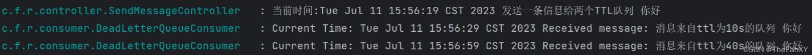
第一条消息在 10S 后变成了死信消息，然后被消费者消费掉，第二条消息在 40S 之后变成了死信消息，然后被消费掉，这样一个延时队列就打造完成了。
不过，如果这样使用的话，岂不是**每增加一个新的时间需求，就要新增一个队列**，这里只有 10S 和 40S两个时间选项，如果需要一个小时后处理，那么就需要增加 TTL 为一个小时的队列，如果是预定会议室然后提前通知这样的场景，岂不是要增加无数个队列才能满足需求？

## 1.6. 延时队列优化

### 1.6.1. 代码架构图 

在这里新增了一个队列 QC,绑定关系如下,该队列不设置 TTL 时间
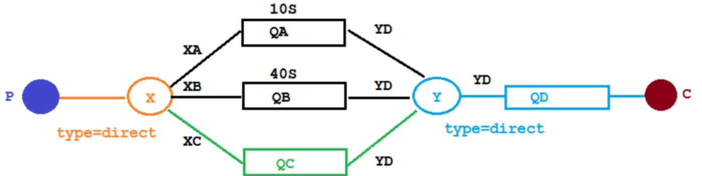

### 1.6.2. 配置文件类代码

**添加普通队列C和普通队列C和交换机X的绑定**

```java
@Configuration
public class TtlQueueConfig {

    // 普通交换机名称
    public static final String X_EXCHANGE = "X";

    // 死信交换机的名称
    public static final String Y_DEAD_LETTER_EXCHANGE = "Y";

    // 普通队列名称
    public static final String QUEUE_A = "QA";
    public static final String QUEUE_B = "QB";

    // 死信队列名称
    public static final String DEAD_LETTER_QUEUE_D = "QD";

    // 无延时普通队列名称
    public static final String QUEUE_C = "QC";

    // 声明X普通交换机
    @Bean
    public DirectExchange xExchange() {
        return new DirectExchange(X_EXCHANGE, false, false);
    }

    // 声明Y死信交换机
    @Bean
    public DirectExchange yExchange() {
        return new DirectExchange(Y_DEAD_LETTER_EXCHANGE, false, false);
    }

    // 声明普通队列
    @Bean
    public Queue queueA() {
        return QueueBuilder.durable(QUEUE_A)
                .deadLetterExchange(Y_DEAD_LETTER_EXCHANGE)
                .deadLetterRoutingKey("YD")
                .ttl(10 * 1000)
                .build();
    }

    @Bean
    public Queue queueB() {
        return QueueBuilder.durable(QUEUE_B)
                .deadLetterExchange(Y_DEAD_LETTER_EXCHANGE)
                .deadLetterRoutingKey("YD")
                .ttl(40 * 1000)
                .build();
    }

    @Bean
    public Queue queueC() {
        return QueueBuilder.durable(QUEUE_C)
                .deadLetterExchange(Y_DEAD_LETTER_EXCHANGE)
                .deadLetterRoutingKey("YD")
                .build();
    }

    // 声明死信队列
    @Bean
    public Queue queueD() {
        return QueueBuilder.durable(DEAD_LETTER_QUEUE_D).build();
    }

    // 绑定普通交换机和普通延时队列
    @Bean
    public Binding queueABindingX(@Qualifier("queueA") Queue queueA,
                                  @Qualifier("xExchange") DirectExchange xExchange){
        return BindingBuilder.bind(queueA).to(xExchange).with("XA");
    }

    @Bean
    public Binding queueBBindingX(@Qualifier("queueB") Queue queueB,
                                  @Qualifier("xExchange") DirectExchange xExchange){
        return BindingBuilder.bind(queueB).to(xExchange).with("XB");
    }

    // 绑定普通交换机和无延时队列
    @Bean
    public Binding queueCBindingX(@Qualifier("queueC") Queue queueC,
                                  @Qualifier("xExchange") DirectExchange xExchange){
        return BindingBuilder.bind(queueC).to(xExchange).with("XC");
    }

    // 绑定死信交换机和死信队列
    @Bean
    public Binding queueDBindingY(@Qualifier("queueD") Queue queueD,
                                  @Qualifier("yExchange") DirectExchange yExchange){
        return BindingBuilder.bind(queueD).to(yExchange).with("YD");
    }
}
```

### 1.6.3. 消息生产者代码

**可以给无延时的队列，从生产者的角度发送一条带有延时的消息。**

```java
@Slf4j
@RestController
@RequestMapping("/ttl")
public class SendMessageController {

    @Autowired
    private RabbitTemplate rabbitTemplate;

    @GetMapping("/sendMsg/{message}")
    public void sendMsg(@PathVariable("message") String message) {

        log.info("当前时间:{} 发送一条信息给两个TTL队列 {}", new Date().toString(), message);

        rabbitTemplate.convertAndSend("X", "XA", "消息来自ttl为10s的队列 :" + message);
        rabbitTemplate.convertAndSend("X", "XB", "消息来自ttl为40s的队列 :" + message);
    }

    @GetMapping("/sendExpirationMsg/{message}/{ttlTime}")
    public void sendMsg(@PathVariable("message") String message,
                        @PathVariable("ttlTime") String ttlTime) {

        log.info("当前时间:{} 发送一条自带TTL为: {}毫秒 的信息给普通队列C: {}", new Date().toString(), ttlTime, message);
        rabbitTemplate.convertAndSend("X",
                "XC",
                message,
                msg -> {
                    msg.getMessageProperties().setExpiration(ttlTime);
                    return msg;
                });
    }
}
```

**这里主要增加能从url设置延时时间的请求方法，消费者不需要更改**
发起请求

> http://localhost:8080/ttl/sendExpirationMsg/你好 1/20000
>
> http://localhost:8080/ttl/sendExpirationMsg/你好 2/2000

看起来似乎没什么问题，但是在最开始的时候，就介绍过**如果使用在消息属性上设置 TTL 的方式，消
息可能并不会按时“死亡“，因为 `RabbitMQ` 只会检查第一个消息是否过期，如果过期则丢到死信队列，如果第一个消息的延时时长很长，而第二个消息的延时时长很短，第二个消息并不会优先得到执行。**
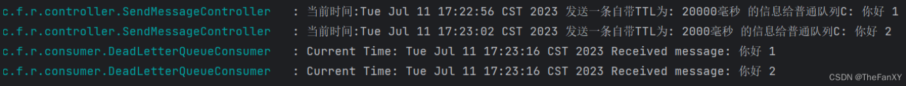

## 1.7. `Rabbitmq` 插件实现延迟队列

上文中提到的问题，确实是一个问题，如果不能实现在消息粒度上的 `TTL`，并使其在设置的 `TTL` 时间及时死亡，就无法设计成一个通用的延时队列。

那如何解决呢，接下来我们就去解决该问题。

### 1.7.1. 安装延时队列插件 

在官网上下载 `https://www.rabbitmq.com/community-plugins.html`，下载**`rabbitmq_delayed_message_exchange`** 插件，然后解压放置到 `RabbitMQ` 的插件目录。
进入 `RabbitMQ` 的安装目录下的 `plgins` 目录，执行下面命令让该插件生效，然后重启 `RabbitMQ`

```sh
/usr/lib/rabbitmq/lib/rabbitmq_server-3.8.8/plugins
```

```sh
rabbitmq-plugins enable rabbitmq_delayed_message_exchange
```


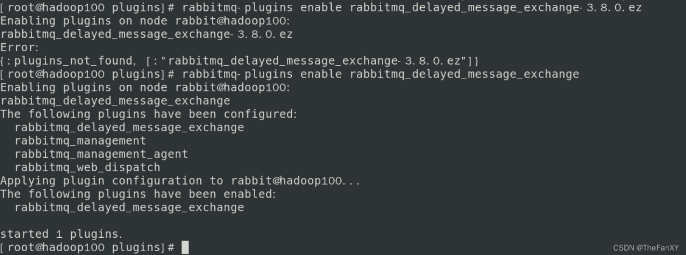
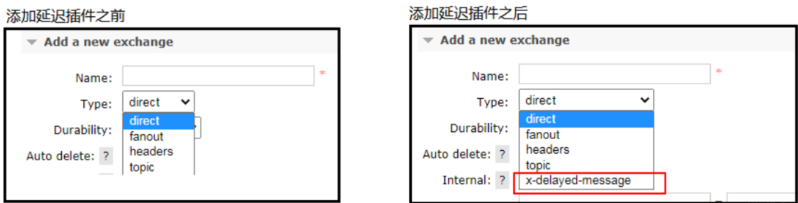


### 1.7.2. 代码架构图 

在这里新增了一个队列 `delayed.queue`,一个自定义交换机 `delayed.exchange`，绑定关系如下:
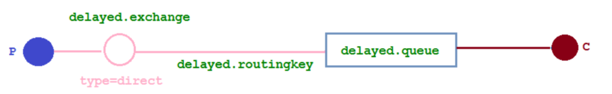
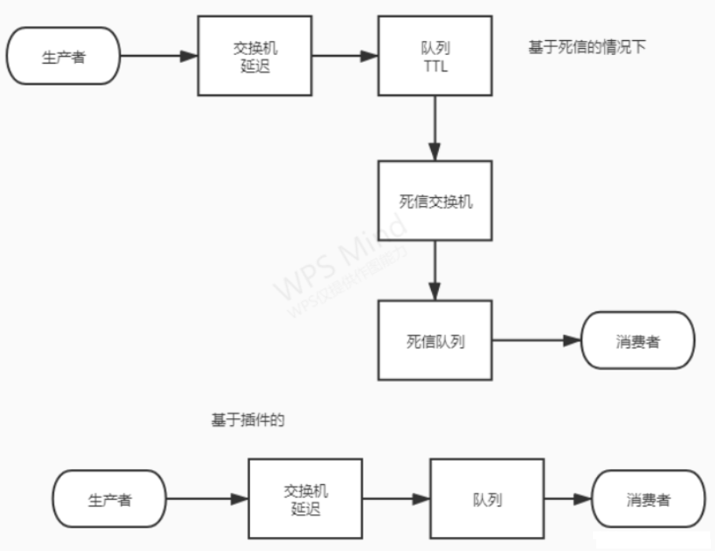

### 1.7.3. 配置文件类代码 

在我们自定义的交换机中，这是一种新的交换类型，该类型消息支持延迟投递机制，消息传递后并不会立即投递到目标队列中，而是存储在 `mnesia`(一个分布式数据系统)表中，当达到投递时间时，才投递到目标队列中。

```java
@Configuration
public class DelayedQueueConfig {

    // 延迟交换机名称
    public static final String DELAYED_EXCHANGE_NAME = "delayed.exchange";

    // 队列名称
    public static final String DELAYED_QUEUE_NAME = "delayed.queue";

    // routingKey
    public static final String DELAYED_ROUTING_KEY = "delayed.routingkey";

    // 定义基于插件的延迟交换机
    @Bean
    public CustomExchange delayedExchange() {
        HashMap<String, Object> arguments = new HashMap<String, Object>();
        arguments.put("x-delayed-type", "direct");
        return new CustomExchange(DELAYED_EXCHANGE_NAME, "x-delayed-message",
                true, false, arguments);
    }

    // 定义延迟队列
    @Bean
    public Queue delayedQueue() {
        return QueueBuilder
                .durable(DELAYED_QUEUE_NAME)
                .build();
    }

    // 定义绑定
    @Bean
    public Binding delayedQueueBindingDelayedExchange(
            @Qualifier("delayedQueue") Queue delayedQueue,
            @Qualifier("delayedExchange") CustomExchange delayedExchange) {

        return BindingBuilder.bind(delayedQueue).to(delayedExchange).with(DELAYED_ROUTING_KEY).noargs();
    }
}

```

### 1.7.4. 消息生产者代码

```java
@Slf4j
@RestController
@RequestMapping("/ttl")
public class SendMessageController {

    @Autowired
    private RabbitTemplate rabbitTemplate;

    // 给延时交换机发消息 基于插件的的  消息   和   延迟时间
    @GetMapping("/sendDelayMsg/{message}/{delayTime}")
    public void sendMsg(@PathVariable("message") String message,
                        @PathVariable("delayTime") Integer delayTime) {
        log.info("当前时间:{} 发送一条自带TTL为: {}毫秒 的信息给延时队列delayed.queue: {}",
                new Date().toString(), delayTime, message);

        rabbitTemplate.convertAndSend(
                DelayedQueueConfig.DELAYED_EXCHANGE_NAME,
                DelayedQueueConfig.DELAYED_ROUTING_KEY,
                message,
                msg -> {
                    msg.getMessageProperties().setDelay(delayTime);
                    return msg;
                });
    }
}
```

### 1.7.5. 消息消费者代码

```java
@Slf4j
@Component
public class DelayQueueConsumer {

    //监听消息
    @RabbitListener(queues = DelayedQueueConfig.DELAYED_QUEUE_NAME)
    public void receiveDelayQueue(Message message) throws Exception {
        String msg = new String(message.getBody(), "UTF-8");
        log.info("Current Time: {} 收到延时队列的消息: {}", new Date().toString(), msg);
    }
}
```

发起请求：
http://localhost:8080/ttl/sendDelayMsg/come on baby1/20000
http://localhost:8080/ttl/sendDelayMsg/come on baby2/2000

第二个消息被先消费掉了，符合预期

## 1.8. 总结

**延时队列在需要延时处理的场景下非常有用，使用 `RabbitMQ` 来实现延时队列可以很好的利用`RabbitMQ` 的特性，如：消息可靠发送、消息可靠投递、死信队列来保障消息至少被消费一次以及未被正确处理的消息不会被丢弃。另外，通过 `RabbitMQ` 集群的特性，可以很好的解决单点故障问题，不会因为单个节点挂掉导致延时队列不可用或者消息丢失。
死信队列并非被完全取代，比如消息长度超出的处理，或者是延时固定的情况。**

**当然，延时队列还有很多其它选择，比如利用 `Java` 的 `DelayQueue`【`无法防止数据丢失问题，以及丢失的后续处理工作`】，利用 `Redis` 的 `zset`，利用 `Quartz`或者利用 `kafka` 的时间轮，这些方式各有特点,看需要适用的场景**