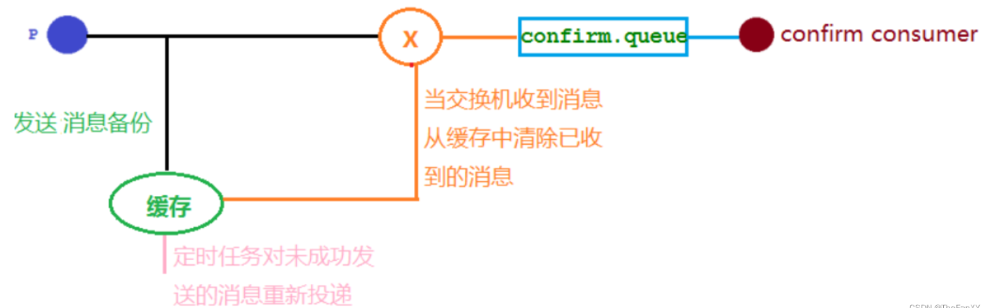
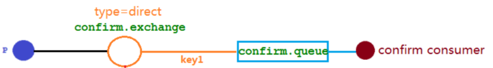
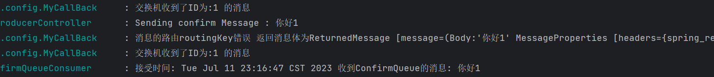
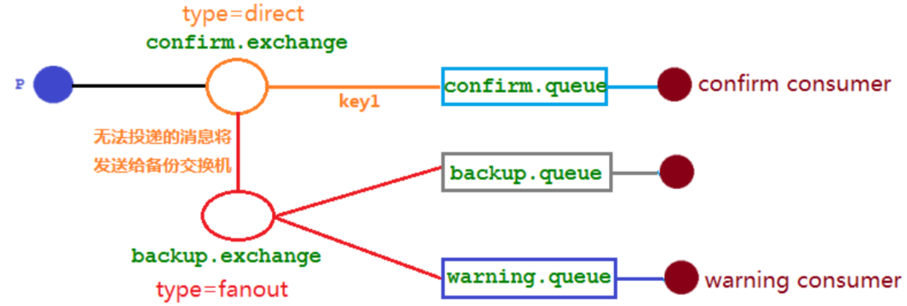
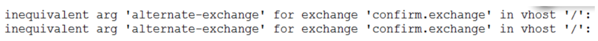
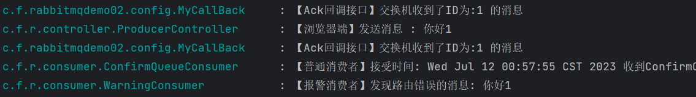

# 发布确认 `springboot` 版本

### 1.1.1. 确认机制方案



### 1.1.2. 代码架构图



### 1.1.3. 配置文件

在配置文件当中需要添加
**`spring.rabbitmq.publisher-confirm-type=correlated`**

- `NONE`
  - **禁用发布确认模式，是默认值**
- `CORRELATED`
  - **发布消息成功到交换器后会触发回调方法**
- `SIMPLE`
  - **经测试有两种效果，其一效果和 `CORRELATED` 值一样会触发回调方法，其二在发布消息成功后使用 `rabbitTemplate` 调用 `waitForConfirms` 或 `waitForConfirmsOrDie` 方法。等待 `broker` 节点返回发送结果，根据返回结果来判定下一步的逻辑，要注意的点是 `waitForConfirmsOrDie` 方法如果返回 `false` 则会关闭 `channel`，则接下来无法发送消息到 `broker`**

```yaml
spring.rabbitmq.host=192.168.110.100
spring.rabbitmq.port=5672
spring.rabbitmq.username=admin
spring.rabbitmq.password=123456
spring.rabbitmq.publisher-confirm-type=correlated
```

### 1.1.4. 添加配置类

```java
@Configuration
public class ConfirmConfig {

    // 交换机名称
    public static final String CONFIRM_EXCHANGE_NAME = "confirm.exchange";

    // 队列名称
    public static final String CONFIRM_QUEUE_NAME = "confirm.queue";

    // RoutingKey
    public static final String CONFIRM_ROUTE_KEY = "key1";

    // 交换机声明
    @Bean
    public DirectExchange confirmExchange() {
        return new DirectExchange(CONFIRM_EXCHANGE_NAME, true, false);
    }

    // 队列声明
    @Bean
    public Queue confirmQueue() {
        return QueueBuilder.durable(CONFIRM_QUEUE_NAME).build();
    }

    // 路由队列绑定
    @Bean
    public Binding confirmQueueBindingConfirmExchange(
            @Qualifier("confirmExchange") DirectExchange directExchange,
            @Qualifier("confirmQueue") Queue confirmQueue){

        return BindingBuilder.bind(confirmQueue).to(directExchange).with(CONFIRM_ROUTE_KEY);
    }
}
```

### 1.1.5. 消息生产者

**想要完成回调，回调的消息里面会携带一些消息的信息，这个信息并非自带，是需要生产者发送时定义**

```java
@Slf4j
@RestController
@RequestMapping("/confirm")
public class ProducerController {

    @Autowired
    private RabbitTemplate rabbitTemplate;

    @GetMapping("/sendConfirmMsg/{message}")
    public void sendConfirmMsg(@PathVariable("message") String message) {
        CorrelationData correlationData = new CorrelationData("1");

        rabbitTemplate.convertAndSend(
                ConfirmConfig.CONFIRM_EXCHANGE_NAME,
                ConfirmConfig.CONFIRM_ROUTE_KEY,
                message,
                correlationData);

        log.info("Sending confirm Message : " + message);
    }
}
```

### 1.1.6. 回调接口

**[`springboot`笔记，注解驱动整理部分有这个注解的说明:@`PostConstruct`:在Bean创建完成并属性赋值之后，执行初始化方法，遵循JSR250规范](https://blog.csdn.net/weixin_44981126/article/details/131462812?spm=1001.2014.3001.5502)**

**`@PostConstruct`注解,在对象加载完依赖注入后执行它通常都是一些初始化的操作，但初始化可能依赖于注入的其他组件，所以要等依赖全部加载完再执行，`rabbitmqTamplate`是一个单实例，所以无论你注入多少次都是同一个实例，而`callback`的实现是需要`rabbit`调用的，所以要注入到`rabbit`里**

**`@PostConstruct`是一个标准的`Java`注解，用于指定一个方法在类被创建后调用。它被用来标注一个非静态的`void()`方法，该方法会在类被实例化后自动调用，通常用于初始化操作。**

**使用`@PostConstruct`注解的方法会在依赖注入完成后，初始化之前自动调用。这个注解通常用于执行一些需要在类实例化后立即进行的操作，例如初始化变量、建立数据库连接、加载配置文件等等。**

**使用`@PostConstruct`注解的方法必须满足以下条件：**

- **方法不能有任何参数**
- **方法不能有任何返回值**
- **方法不能抛出已检查异常**

```java
@Slf4j
@Component
public class MyCallBack implements RabbitTemplate.ConfirmCallback {

    @Autowired
    private RabbitTemplate rabbitTemplate;

    // 把内部接口实现类注入
    @PostConstruct
    public void init() {
        rabbitTemplate.setConfirmCallback(this);
    }

    /**
     * @param correlationData 保存回调的消息的ID和相关信息
     * @param ack             true for ack, false for nack
     * @param cause           An optional cause, for nack, when available, otherwise null.
     */
    @Override
    public void confirm(CorrelationData correlationData, boolean ack, String cause) {
        String id = correlationData != null ? correlationData.getId() : "";
        if (ack) {
            log.info("交换机收到了ID为:{} 的消息", id);
        } else {
            log.info("交换机未收到了ID为:{} 的消息, 原因为 :{}", id, cause);
        }
    }
}
```

### 1.1.7. 消息消费者

```java
@Slf4j
@Component
public class ConfirmQueueConsumer {

    @RabbitListener(queues = ConfirmConfig.CONFIRM_QUEUE_NAME)
    public void receive(Message message) throws Exception {
        String msg = new String(message.getBody(), "UTF-8");
        log.info("接受时间: {} 收到ConfirmQueue的消息: {}", new Date().toString(), msg);
    }
}
```

### 1.1.8. 结果分析

测试用例

> http://localhost:8080/confirm/sendConfirmMsg/你好1
> http://localhost:8080/confirm/sendConfirmMsg/你好2

**两个实验**
**我们发送两条消息，第一条消息的 `交换机名称` 为 正确的，第二条消息的 `交换机名称` 为`错误的`【人为修改代码】，一条收到了确认的回调消息，一条收到了没有确认的失败回调消息**

**我们发送两条消息，第一条消息的 `RoutingKey` 为 正确的`"key1"`，第二条消息的 `RoutingKey` 为`"key2"`【人为修改代码】，两条消息都成功被交换机接收，也收到了交换机的确认回调，但消费者只收到了一条消息，因为第二条消息的 `RoutingKey` 与队列的 `BindingKey` 不一致，也没有其它队列能接收这个消息，所有第二条消息被直接丢弃了。**

## 1.2. 回退消息

### 1.2.1. Mandatory 参数 

**在仅开启了生产者确认机制的情况下，交换机接收到消息后，会直接给消息生产者发送确认消息**，**如果发现该消息不可路由，那么消息会被直接丢弃，此时生产者是不知道消息被丢弃这个事件的。**

那么如何让无法被路由的消息帮我想办法处理一下？最起码通知我一声，我好自己处理啊。通过设置 mandatory 参数可以在当消息传递过程中不可达目的地时将消息返回给生产者。

**`开启回退配置`**

```text
spring.rabbitmq.publisher-returns=true
```


### 1.2.2. 消息生产者代码 

```java
@Slf4j
@RestController
@RequestMapping("/confirm")
public class ProducerController {

    @Autowired
    private RabbitTemplate rabbitTemplate;

    @GetMapping("/sendConfirmMsg/{message}")
    public void sendConfirmMsg(@PathVariable("message") String message) {
        CorrelationData correlationData = new CorrelationData("1");

        // 正确路由消息
        rabbitTemplate.convertAndSend(
                ConfirmConfig.CONFIRM_EXCHANGE_NAME,
                ConfirmConfig.CONFIRM_ROUTE_KEY,
                message,
                correlationData
        );
        // 错误路由消息
        rabbitTemplate.convertAndSend(
                ConfirmConfig.CONFIRM_EXCHANGE_NAME,
                ConfirmConfig.CONFIRM_ROUTE_KEY + "fake",
                message,
                correlationData
        );
        log.info("Sending confirm Message : " + message);
    }
}
```


### 1.2.3. 回调接口

**<font color="000bb"> 千万别忘了把回退接口也注入回rabbitTemplate对象</font>**

```java
@Slf4j
@Component
public class MyCallBack implements RabbitTemplate.ConfirmCallback, RabbitTemplate.ReturnsCallback {

    @Autowired
    private RabbitTemplate rabbitTemplate;

    // 把内部接口实现类注入
    @PostConstruct
    public void init() {
        rabbitTemplate.setConfirmCallback(this);
        rabbitTemplate.setReturnsCallback(this);
    }

    /**
     * @param correlationData 保存回调的消息的ID和相关信息
     * @param ack             true for ack, false for nack
     * @param cause           An optional cause, for nack, when available, otherwise null.
     */
    @Override
    public void confirm(CorrelationData correlationData, boolean ack, String cause) {
        String id = correlationData != null ? correlationData.getId() : "";
        if (ack) {
            log.info("交换机收到了ID为:{} 的消息", id);
        } else {
            log.info("交换机收到了ID为:{} 的消息, 原因为 :{}", id, cause);
        }
    }

    @Override
    public void returnedMessage(ReturnedMessage returned) {
        log.info("消息的路由routingKey错误 返回消息体为{}", returned);
    }
}
```


### 1.2.4. 结果分析




## 1.3. 备份交换机

有了 `mandatory` 参数和回退消息，我们获得了对无法投递消息的感知能力，有机会在生产者的消息无法被投递时发现并处理。但有时候，我们并不知道该如何处理这些无法路由的消息，最多打个日志，然后触发报警，再来手动处理。而通过日志来处理这些无法路由的消息是很不优雅的做法，特别是当生产者所在的服务有多台机器的时候，手动复制日志会更加麻烦而且容易出错。而且设置 `mandatory` 参数会增加生产者的复杂性，需要添加处理这些被退回的消息的逻辑。如果既不想丢失消息，又不想增加生产者的复杂性，该怎么做呢？

前面在设置死信队列的文章中，我们提到，可以为队列设置死信交换机来存储那些处理失败的消息，可是这些不可路由消息根本没有机会进入到队列，因此无法使用死信队列来保存消息。在 `RabbitMQ` 中，有一种备份交换机的机制存在，可以很好的应对这个问题。什么是备份交换机呢？

备份交换机可以理解为 `RabbitMQ` 中交换机的“备胎”，当我们为某一个交换机声明一个对应的备份交换机时，就是为它创建一个备胎，当交换机接收到一条不可路由消息时，将会把这条消息转发到备份交换机中，由备份交换机来进行转发和处理，通常备份交换机的类型为 Fanout ，这样就能把所有消息都投递到与其绑定的队列中，然后我们在备份交换机下绑定一个队列，这样所有那些原交换机无法被路由的消息，就会都进入这个队列了。当然，我们还可以建立一个报警队列，用独立的消费者来进行监测和报警。


### 1.3.1. 代码架构图




### 1.3.2. 修改配置类 

这里首先我们肯定要在之前的代码上增加备份交换机，备份队列，报警队列的配置和绑定关系。而普通交换机和备份交换机的绑定关系，就不能像之前一样直接`new`了，而是要使用交换机`Builder`。

这里类似死信队列是通过队列指定 `deadletter-exchage`，备份交换机显然也是通过上游的交换机，指明下游的备份交换机，这里使用自带的函数式编程的方法 `alternate`。

```java
@Configuration
public class ConfirmConfig {

    // 普通交换机
    public static final String CONFIRM_EXCHANGE_NAME = "confirm.exchange";

    // 备份交换机
    public static final String BACKUP_EXCHANGE_NAME = "backup.exchange";

    // 队列名称
    public static final String CONFIRM_QUEUE_NAME = "confirm.queue";

    // 备份队列
    public static final String BACKUP_QUEUE_NAME = "backup.queue";

    // 报警队列
    public static final String WARNING_QUEUE_NAME = "warning.queue";

    // RoutingKey
    public static final String CONFIRM_ROUTE_KEY = "key1";

    // 普通交换机声明
    @Bean
    public DirectExchange confirmExchange() {
        return ExchangeBuilder
                .directExchange(CONFIRM_EXCHANGE_NAME)
                .durable(true)
                .alternate(BACKUP_EXCHANGE_NAME)
                .build();
    }

    // 备份交换机声明
    @Bean
    public FanoutExchange backupExchange() {
        return ExchangeBuilder
                .fanoutExchange(BACKUP_EXCHANGE_NAME)
                .durable(true)
                .build();
    }

    // 普通消费队列声明
    @Bean
    public Queue confirmQueue() {
        return QueueBuilder.durable(CONFIRM_QUEUE_NAME).build();
    }

    // 备份队列声明
    @Bean
    public Queue backupQueue() {
        return QueueBuilder.durable(BACKUP_QUEUE_NAME).build();
    }

    // 报警队列声明
    @Bean
    public Queue warningQueue() {
        return QueueBuilder.durable(WARNING_QUEUE_NAME).build();
    }

    // 普通路由队列绑定
    @Bean
    public Binding confirmQueueBindingConfirmExchange(
            @Qualifier("confirmExchange") DirectExchange directExchange,
            @Qualifier("confirmQueue") Queue confirmQueue) {

        return BindingBuilder.bind(confirmQueue).to(directExchange).with(CONFIRM_ROUTE_KEY);
    }

    // 备份交换机和备份队列绑定
    @Bean
    public Binding backupQueueBindingBackupExchange(
            @Qualifier("backupExchange") FanoutExchange backupExchange,
            @Qualifier("backupQueue") Queue backupQueue) {

        return BindingBuilder.bind(backupQueue).to(backupExchange);
    }

    // 备份交换机和报警队列绑定
    @Bean
    public Binding warningQueueBindingBackupExchange(
            @Qualifier("backupExchange") FanoutExchange backupExchange,
            @Qualifier("warningQueue") Queue warningQueue) {

        return BindingBuilder.bind(warningQueue).to(backupExchange);
    }
}
```


### 1.3.3. 报警消费者 

```java
@Component
@Slf4j
public class WarningConsumer {

    @RabbitListener
    public void receiveWarningMsg(Message message) throws Exception {
        String msg = new String(message.getBody(), "UTF-8");
        log.error("【报警消费者】发现路由错误的消息: {}", msg);
    }
}
```


### 1.3.4. 测试注意事项 

重新启动项目的时候需要把原来的 `confirm.exchange` 删除因为我们修改了其绑定属性，不然报以下错:




### 1.3.5. 结果分析 

测试用例

> http://localhost:8080/confirm/sendConfirmMsg/你好1



`mandatory` 参数与备份交换机可以一起使用的时候，如果两者同时开启，消息究竟何去何从？谁优先级高，经过上面结果显示答案是<font color="bb000">**备份交换机优先级比未收到的消息的回调接口优先级高**。</font>

同时这里发现<font color="bb000">**【Ack回调接口】居然先于生产者处的发送消息的输出，可见回调接口是异步实现的。**</font>