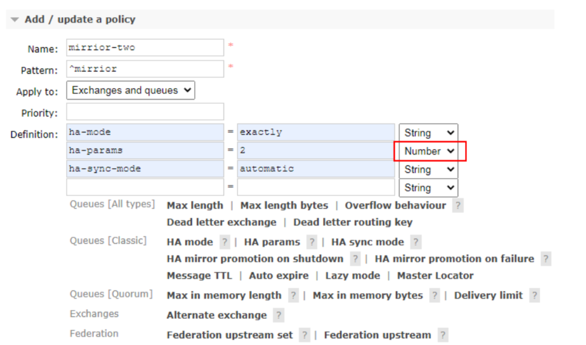
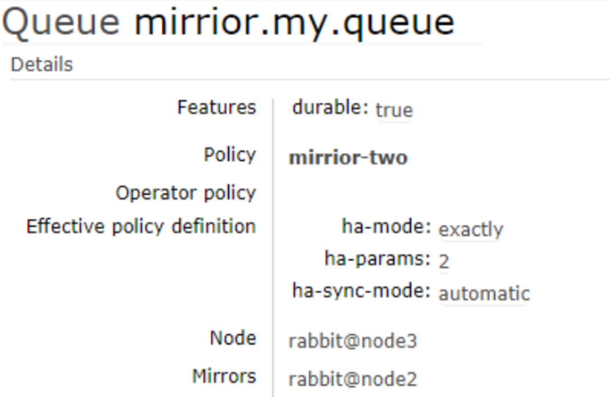
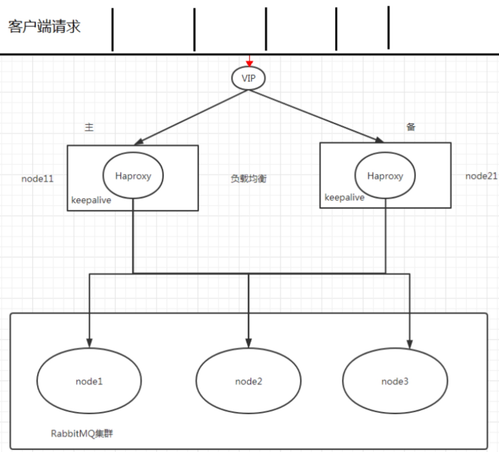

# 集群高可用和镜像队列

## 1.1. clustering

### 1.1.1. 使用集群的原因 

最开始我们介绍了如何安装及运行 `RabbitMQ` 服务，不过这些是单机版的，无法满足目前真实应用的要求。如果`RabbitMQ` 服务器遇到内存崩溃、机器掉电或者主板故障等情况，该怎么办？单台 `RabbitMQ` 服务器可以满足每秒 `1000` 条消息的吞吐量，那么如果应用需要 `RabbitMQ` 服务满足每秒 `10` 万条消息的吞吐量呢？购买昂贵的服务器来增强单机 `RabbitMQ` 务的性能显得捉襟见肘，搭建一个 `RabbitMQ` 集群才是解决实际问题的关键.


### 1.1.2. 搭建步骤 

搭建集群，三台虚拟机分别都安装`rabbitmq`，并且在 `/etc/hosts`根据彼此的`ip`写一个方便记忆的域名。

`rabbitmq`集群需要各个节点的`cookie`文件使用同一个值

在 第一台服务器 上执行远程操作命令

```shell
scp /var/lib/rabbitmq/.erlang.cookie root@hadoop101:/var/lib/rabbitmq/.erlang.cookie
```

```shell
scp /var/lib/rabbitmq/.erlang.cookie root@hadoop102:/var/lib/rabbitmq/.erlang.cookie
```

启动 `RabbitMQ` 服务,顺带启动 `Erlang` 虚拟机和 `RbbitMQ` 应用服务(在三台节点上分别执行以下命令)【这个命令就可以完成`Erlang`虚拟机和`RabbitMQ`的重启】

```shell
rabbitmq-server -detached
```

这里如果报错Error when reading /var/lib/rabbitmq/...错误，是由于Cookie的权限问题，也就是rabbit这个属性组不认识这个Cookie，使用下面的命令解决

> chown rabbitmq:rabbitmq Cookie路径

在节点 2 执行

```shell
rabbitmqctl stop_app
```

(`rabbitmqctl stop` 会将 `Erlang` 虚拟机关闭，`rabbitmqctl stop_app` 只关闭 `RabbitMQ` 服务)

```shell
rabbitmqctl reset
```

```shell
rabbitmqctl join_cluster rabbit@hadoop100
```

```shell
rabbitmqctl start_app
```

(只启动应用服务)

在节点 3 执行

```sh
rabbitmqctl stop_app
```

```sh
rabbitmqctl reset
```

```sh
rabbitmqctl join_cluster rabbit@hadoop100
```

```sh
rabbitmqctl start_app
```

集群状态

```sh
rabbitmqctl cluster_status
```

解除集群节点的命令(node2 和 node3 机器分别执行)

```sh
rabbitmqctl stop_app
```

```sh
rabbitmqctl reset
```

```sh
rabbitmqctl start_app
```

```sh
rabbitmqctl cluster_status
```

(node1 机器上执行) 

```sh
rabbitmqctl forget_cluster_node rabbit@hadoop101
```

## 1.2. 镜像队列

### 1.2.1. 使用镜像的原因 

如果 `RabbitMQ` 集群中只有一个 `Broker` 节点，那么该节点的失效将导致整体服务的临时性不可用，并且也可能会导致消息的丢失。可以将所有消息都设置为持久化，并且对应队列的 `durable` 属性也设置为`true`，但是这样仍然无法避免由于缓存导致的问题：因为消息在发送之后和被写入磁盘井执行刷盘动作之间存在一个短暂却会产生问题的时间窗。通过 `publisherconfirm` 机制能够确保客户端知道哪些消息己经存入磁盘，尽管如此，一般不希望遇到因单点故障导致的服务不可用。

引入镜像队列(`Mirror Queue`)的机制，可以将队列镜像到集群中的其他 `Broker` 节点之上，如果集群中的一个节点失效了，队列能自动地切换到镜像中的另一个节点上以保证服务的可用性。


### 1.2.2. 搭建步骤 

1. 启动三台集群节点

2. 随便找一个节点添加 policy【**点击admin然后点右侧的policy**】

   名字是随便取，见名知意即可，这里是给 / 添加策略

   第二行pattern是正则匹配，这里填写代表必须以 `mirrior` 开头才行

   `HA` 全称`high available` 高可用

   设置匹配数为 `2`【代表本身一份，还有一份放在别的集群节点，且能在宕机后自动转移还保持两份在两个不同的节点】

   同步策略为自动

   

   


3. 在 node1 上创建一个队列发送一条消息，队列存在镜像队列



4. 停掉 node1 之后发现 node2 成为镜像队列

```sh
rabbitmqctl stop_app
```


5. 就算整个集群只剩下一台机器了 依然能消费队列里面的消息

 说明队列里面的消息被镜像队列传递到相应机器里面了

## 10.3. `Haproxy` + `Keepalive` 实现高可用负载均衡

### 10.3.1. 整体架构图 




### 10.3.2. `Haproxy` 实现负载均衡 

`HAProxy` 提供高可用性、负载均衡及基于 `TCPHTTP` 应用的代理，支持虚拟主机，它是免费、快速并且可靠的一种解决方案，包括 `Twitter`,`Reddit`,`StackOverflow`,`GitHub` 在内的多家知名互联网公司在使用。`HAProxy` 实现了一种事件驱动、单一进程模型，此模型支持非常大的井发连接数。

扩展 `nginx`,`lvs`,`haproxy` 之间的区别: http://www.ha97.com/5646.html

### 10.3.3. 搭建步骤

1. 下载 `haproxy`(在 `node1` 和 `node2`)

```sh
yum -y install haproxy
```

2. 修改 `node1` 和 `node2` 的 `haproxy.cfg`

```sh
vim /etc/haproxy/haproxy.cfg
```

需要修改红色 IP 为当前机器 IP


3. 在两台节点启动 `haproxy`

```sh
haproxy -f /etc/haproxy/haproxy.cfg
```

```sh
ps -ef | grep haproxy
```

4. 访问地址

http://localhost:8888/stats


### 10.3.4. `Keepalived` 实现双机(主备)热备 

试想如果前面配置的 `HAProxy` 主机突然宕机或者网卡失效，那么虽然 `RbbitMQ` 集群没有任何故障但是对于外界的客户端来说所有的连接都会被断开结果将是灾难性的为了确保负载均衡服务的可靠性同样显得十分重要，这里就要引入 `Keepalived` 它能够通过自身健康检查、资源接管功能做高可用(双机热备)，实现故障转移

### 10.3.5. 搭建步骤 

1. 下载 `keepalived`

```sh
yum -y install keepalived
```

2. 节点 node1 配置文件

```sh
vim /etc/keepalived/keepalived.conf
```

把资料里面的 `keepalived.conf` 修改之后替换

3. 节点 node2 配置文件

需要修改 `global_defs` 的 `router_id`,如:`nodeB`

其次要修改 `vrrp_instance_VI` 中 `state` 为"`BACKUP`"；

最后要将 `priority` 设置为小于 `100` 的值

4. 添加 `haproxy_chk.sh`

(为了防止 `HAProxy` 服务挂掉之后 `Keepalived` 还在正常工作而没有切换到 Backup 上，所以这里需要编写一个脚本来检测 `HAProxy` 务的状态,当 `HAProxy` 服务挂掉之后该脚本会自动重启

`HAProxy` 的服务，如果不成功则关闭 `Keepalived` 服务，这样便可以切换到 Backup 继续工作)

```sh
vim /etc/keepalived/haproxy_chk.sh
```

(可以直接上传文件)

修改权限 

```sh
chmod 777 /etc/keepalived/haproxy_chk.sh
```

5.启动 keepalive 命令(node1 和 node2 启动)

```sh
systemctl start keepalived
```

6.观察 `Keepalived` 的日志

```sh
tail -f /var/log/messages -n 200
```

7.观察最新添加的 `vip`

```sh
ip add show
```

8.node1 模拟 `keepalived` 关闭状态

```sh
systemctl stop keepalived 
```

9.使用 `vip` 地址来访问 `rabbitmq` 集群