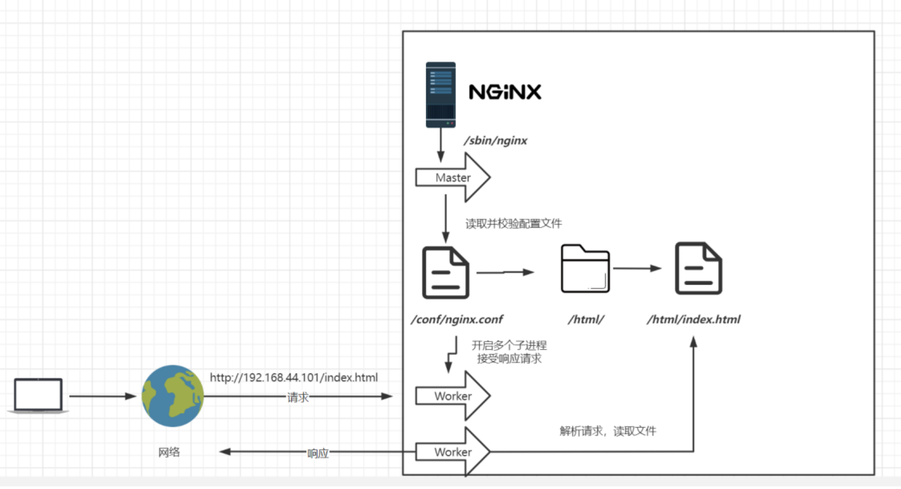

# 1. Nginx安装

## 1.1.版本区别

常用版本分为四大阵营

Nginx开源版

http://nginx.org/

Nginx plus 商业版

https://www.nginx.com

openresty -> Nginx + Lua脚本 【整合】 -> 【官网中文】

http://openresty.org/cn/

Tengine -> Nginx + c语言开发的【淘宝天猫使用 阿里研发 可拓展性不是特别强】

http://tengine.taobao.org/

## 1.2. 编译安装

我这里把.tar的压缩文件放到了usr/local/software/

使用`tar zxvf`解压缩，并进入解包后的文件夹里，可以看到是存在 `configure`文件夹的

运行如下命令可以编译看看缺少什么环境或者依赖，如下有解决方案 

```sh
./configure
```

确认无误后使用如下命令安装

这里是个大坑，我之前安装的时候没安装 `ssl 模块`，所以即便配置了证书，也不能 `https` 访问。

如果已经安装了不带 `ssl` 证书的版本，网上也有编译之后覆盖的方法，我的建议是最好直接备份一下配置文件，直接卸载重装，反正 `nginx` 才 `1Mb` ，覆盖的方式我还是有些问题。 

```sh
./configure --prefix=/usr/local/nginx --with-http_stub_status_module --with-http_ssl_module
```

```sh
make
```

```sh
make install
```


**卸载**

```sh
systemctl stop nginx [这里我在后面有把 nginx 注册为系统服务的方法]
find / -name nginx

rm -rf [上面查到的]
执行命令 删除nignx安装的相关文件
```


配置 `http` `https` 共存

```sh
    server {
	  listen 80;
	  listen [::]:80;
	  server_name www.fanxy.cloud【你的域名】;
	  client_max_body_size 1024m;
	  listen 443 ssl;

	  ssl_certificate      fanxy.cloud_bundle.pem【配置你的】;
      ssl_certificate_key  fanxy.cloud.key【配置你的】;
    }
```


## 1.3. 如果出现警告或报错

提示

>checking for OS
>
>\+ Linux 3.10.0-693.el7.x86_64 x86_64
>
>checking for C compiler ... not found
>
>./configure: error: C compiler cc is not found

安装gcc

```sh
yum install -y gcc
```

提示：

> ./configure: error: the HTTP rewrite module requires the PCRE library.
>
> You can either disable the module by using --without-http_rewrite_module
>
> option, or install the PCRE library into the system, or build the PCRE library
>
> statically from the source with nginx by using --with-pcre=<path> option.

安装perl库

```sh
yum install -y pcre pcre-devel
```

提示：

> ./configure: error: the HTTP gzip module requires the zlib library.
>
> You can either disable the module by using --without-http_gzip_module
>
> option, or install the zlib library into the system, or build the zlib library
>
> statically from the source with nginx by using --with-zlib=<path> option.

安装zlib库

```sh
yum install -y zlib zlib-devel
```

接下来执行

```sh
make
```

```sh
make install
```

## 1.4. 启动Nginx

进入安装好的目录 `/usr/local/nginx/sbin`

启动：其实会同时启动nginx相关的主线程和副线程

```sh
./nginx 
```

快速停止

```sh
./nginx -s stop 
```

优雅关闭：在退出前完成已经接受的连接请求

```sh
./nginx -s quit 
```

重新加载配置：不重启nginx而读取更改的配置文件 **<font color="#bb000">其实这里并不是真的没有重启，而是开启一个新的线程，原本的线程还保持之前的连接完成之前未完成的任务，然后再关闭它，改用读取配置文件的新线程作为主线程</font>**

```sh
./nginx -s reload 
```

## 1.5. 关于防火墙

**关闭防火墙**

```sh
systemctl stop firewalld.service
```

**禁止防火墙开机启动**

```sh
systemctl disable firewalld.service
```

**放行端口**

```sh
firewall-cmd --zone=public --add-port=80/tcp --permanent
```

**重启防火墙**

```sh
firewall-cmd --reload
```

## 1.6. 安装成系统服务

每次都自行进入目录打开太麻烦，想要完成开机自启动的任务：创建服务脚本。此时把nginx设置为系统服务了，可以通过系统命令进行进程管理。

```sh
vi /usr/lib/systemd/system/nginx.service
```

服务脚本内容

```shell
[Unit]
Description=nginx - web server
After=network.target remote-fs.target nss-lookup.target

[Service]
Type=forking
PIDFile=/usr/local/nginx/logs/nginx.pid
ExecStartPre=/usr/local/nginx/sbin/nginx -t -c /usr/local/nginx/conf/nginx.conf
ExecStart=/usr/local/nginx/sbin/nginx -c /usr/local/nginx/conf/nginx.conf
ExecReload=/usr/local/nginx/sbin/nginx -s reload
ExecStop=/usr/local/nginx/sbin/nginx -s stop
ExecQuit=/usr/local/nginx/sbin/nginx -s quit
PrivateTmp=true

[Install]
WantedBy=multi-user.target
```

重新加载系统服务

```sh
systemctl daemon-reload
```

启动服务

```sh
systemctl start nginx.service
```

**开机启动**

```sh
systemctl enable nginx.service
```

**重新加载 `nginx` 配置**

```sh
systemctl reload nginx.service
```


# 2. 目录结构

进入Nginx的主目录我们可以看到这些文件夹

```sh
client_body_temp conf fastcgi_temp html logs proxy_temp sbin scgi_temp uwsgi_temp
```

其中这几个文件夹在刚安装后是没有的，主要用来存放运行过程中的临时文件

```sh
client_body_temp fastcgi_temp proxy_temp scgi_temp
```

**conf**

用来存放配置文件相关，这里可以看到有一份主配置文件 `nginx.conf`，后期我们也可以设置分配置文件，并入其中，或者是改写主配置文件

**html**

用来存放静态文件的默认目录 html、css等

**sbin**

nginx的主程序

**logs**
是用来记录日志的目录，用户的访问出现的error和access记录。配置文件这里也能限制大小，包括文件达到一定大小也会开新的文件记录。同时也有`nginx.pid`文件，记录当前文件的进程id号。

# 3. 基本运行原理



Nginx是【多进程】的，主进程不处理业务，是用来协调子进程【woker进程】，用户的访问是由woker进程响应的，woker进程已经读取了配置文件，所以它知道资源的位置和资源是否存在，它会解析用户的请求，并把请求的资源返回给用户。

这里就能理解上面说的，当【优雅】重启nginx的时候，并不是重启主线程，而是主线程fork出新的woker进程，当之前的woker进程处理完后再把它kill，然后让新的woker进程接替他。 

