# 1. Nginx安装

## 1.1.**版本区别**

常用版本分为四大阵营

Nginx开源版

http://nginx.org/

Nginx plus 商业版

https://www.nginx.com

openresty -> Nginx + Lua脚本 【整合】 -> 【官网中文】

http://openresty.org/cn/

Tengine -> Nginx + c语言开发的【淘宝天猫使用 阿里研发 可拓展性不是特别强】

http://tengine.taobao.org/

## 1.2. **编译安装**

我这里把.tar的压缩文件放到了usr/local/software/

使用`tar zxvf`解压缩，并进入解包后的文件夹里，可以看到是存在 `configure`文件夹的

运行如下命令可以编译看看缺少什么环境或者依赖，如下有解决方案 

```sh
./configure
```

确认无误后使用如下命令安装

```sh
./configure --prefix=/usr/local/nginx
```

```sh
make
```

```sh
make install
```

## 1.3. **如果出现警告或报错**

提示

>checking for OS
>
>\+ Linux 3.10.0-693.el7.x86_64 x86_64
>
>checking for C compiler ... not found
>
>./configure: error: C compiler cc is not found

安装gcc

```sh
yum install -y gcc
```

提示：

> ./configure: error: the HTTP rewrite module requires the PCRE library.
>
> You can either disable the module by using --without-http_rewrite_module
>
> option, or install the PCRE library into the system, or build the PCRE library
>
> statically from the source with nginx by using --with-pcre=<path> option.

安装perl库

```sh
yum install -y pcre pcre-devel
```

提示：

> ./configure: error: the HTTP gzip module requires the zlib library.
>
> You can either disable the module by using --without-http_gzip_module
>
> option, or install the zlib library into the system, or build the zlib library
>
> statically from the source with nginx by using --with-zlib=<path> option.

安装zlib库

```sh
yum install -y zlib zlib-devel
```

接下来执行

```sh
make
```

```sh
make install
```

## 1.4. 启动Nginx

进入安装好的目录 `/usr/local/nginx/sbin`

启动：其实会同时启动nginx相关的主线程和副线程

```sh
./nginx 
```

快速停止

```sh
./nginx -s stop 
```

优雅关闭：在退出前完成已经接受的连接请求

```sh
./nginx -s quit 
```

重新加载配置：不重启nginx而读取更改的配置文件 **<font color="#bb000">其实这里并不是真的没有重启，而是开启一个新的线程，原本的线程还保持之前的连接完成之前未完成的任务，然后再关闭它，改用读取配置文件的新线程作为主线程</font>**

```sh
./nginx -s reload 
```

## 1.5. 关于防火墙

**关闭防火墙**

```sh
systemctl stop firewalld.service
```

**禁止防火墙开机启动**

```sh
systemctl disable firewalld.service
```

**放行端口**

```sh
firewall-cmd --zone=public --add-port=80/tcp --permanent
```

**重启防火墙**

```sh
firewall-cmd --reload
```

## 1.6. **安装成系统服务**

每次都自行进入目录打开太麻烦，想要完成开机自启动的任务：创建服务脚本。此时把nginx设置为系统服务了，可以通过系统命令进行进程管理。

```sh
vi /usr/lib/systemd/system/nginx.service
```

服务脚本内容

```shell
[Unit]
Description=nginx - web server
After=network.target remote-fs.target nss-lookup.target

[Service]
Type=forking
PIDFile=/usr/local/nginx/logs/nginx.pid
ExecStartPre=/usr/local/nginx/sbin/nginx -t -c /usr/local/nginx/conf/nginx.conf
ExecStart=/usr/local/nginx/sbin/nginx -c /usr/local/nginx/conf/nginx.conf
ExecReload=/usr/local/nginx/sbin/nginx -s reload
ExecStop=/usr/local/nginx/sbin/nginx -s stop
ExecQuit=/usr/local/nginx/sbin/nginx -s quit
PrivateTmp=true

[Install]
WantedBy=multi-user.target
```

重新加载系统服务

```sh
systemctl daemon-reload
```

启动服务

```sh
systemctl start nginx.service
```

**开机启动**

```sh
systemctl enable nginx.service
```

# 2. 目录结构

进入Nginx的主目录我们可以看到这些文件夹

```sh
client_body_temp conf fastcgi_temp html logs proxy_temp sbin scgi_temp uwsgi_temp
```

其中这几个文件夹在刚安装后是没有的，主要用来存放运行过程中的临时文件

```sh
client_body_temp fastcgi_temp proxy_temp scgi_temp
```

**conf**

用来存放配置文件相关，这里可以看到有一份主配置文件 `nginx.conf`，后期我们也可以设置分配置文件，并入其中，或者是改写主配置文件

**html**

用来存放静态文件的默认目录 html、css等

**sbin**

nginx的主程序

**logs**
是用来记录日志的目录，用户的访问出现的error和access记录。配置文件这里也能限制大小，包括文件达到一定大小也会开新的文件记录。同时也有`nginx.pid`文件，记录当前文件的进程id号。

# 3. 基本运行原理


Nginx是【多进程】的，主进程不处理业务，是用来协调子进程【woker进程】，用户的访问是由woker进程响应的，woker进程已经读取了配置文件，所以它知道资源的位置和资源是否存在，它会解析用户的请求，并把请求的资源返回给用户。

这里就能理解上面说的，当【优雅】重启nginx的时候，并不是重启主线程，而是主线程fork出新的woker进程，当之前的woker进程处理完后再把它kill，然后让新的woker进程接替他。 

# 4. Nginx配置和应用场景

## 4.1 **最小配置**【即默认开启的配置 去除注释的自定义配置】

### 4.1.1. **worker_processes**

```sh
worker_processes 1;
```

 默认为1，表示开启一个业务进程。一般一个cpu核心对应一个woker进程，如果设置多了就只能分时调度，效率并不高


### 4.1.2. **worker_connections**

```
events{
	worker_connections 1024;
}
```

单个业务进程可接受连接数


### 4.1.3. **include mime.types**;

```sh
http {
    include       mime.types;
    default_type  application/octet-stream;

    sendfile        on;
    
    keepalive_timeout  65;
    
    server {
        listen       80;
        server_name  localhost;

        location / {
            root   html;
            index  index.html index.htm;
        }
        
        error_page   500 502 503 504  /50x.html;
        location = /50x.html {
            root   html;
        }
    }
```

引入http mime类型，这个文件里面其实指明了各种文件类型和后缀名的对应关系，我们在网络上传输数据是二进制流的形式，需要在hhtp请求头写名文件的类型，这样接收端才能正常解码文件，正常读取传输的文件。 

后面我们也会使用`include`命令引入多个配置文件，多人开发配置也是这么配置的，自己配置自己的配置文件，这样就不会出现同时打开一个配置文件，一个人打开另一个就不能打开了【竞争锁】。


### 4.1.4. **default_type application/octet-stream**

如果mime类型没匹配上，默认使用二进制流的方式传输。


### 4.1.5. **sendfifile on**

使用linux的 sendfile(socket, file, len) 高效网络传输，也就是数据0拷贝。0拷贝是指DMI，数据不需要从内存到CPU到内存，而是直接从内存再到内存。

未开启sendfifile的情况下，会多出数据从服务器磁盘读到服务器内存，然后再写给网络接口缓存，再通过复杂的中间操作，通过字节流传给请求端，然后请求端再获取。


开启之后，nginx直接给网络接口缓存发送一个信号，由网络接口缓存直接发送给用户端。磁盘数据直接到内核缓冲区 而减少一次到应用程序内存的拷贝。


### 4.1.6. **keepalive_timeout 65;**

这里可以理解为保持长连接的时间，其实即有对客户端，也有对服务端的含义。反向代理会深入讲解配置和具体含义。


### 4.1.7. **server**

虚拟主机配置 vhost【virtual host】，一个nginx可以配置多个主机，一个server就对应一个主机

```sh
server {
        listen 80; 监听端口号
        server_name localhost; 主机名 域名
        
        
        location -> 可以当作子目录 -> uri 后续章节讲解
        URI 统一资源定位器 唯一  url里面包含多个uri 即资源路径
       
        location / { 匹配路径
        	root html; 文件根目录
        	index index.html index.htm; 默认页名称
		} 
        
        error_page 500 502 503 504 /50x.html; 
        报错编码对应页面-> 但这里没有对应文件 -> 所以写了一个location
        location = /50x.html {
        	root html;
        }
	}
```

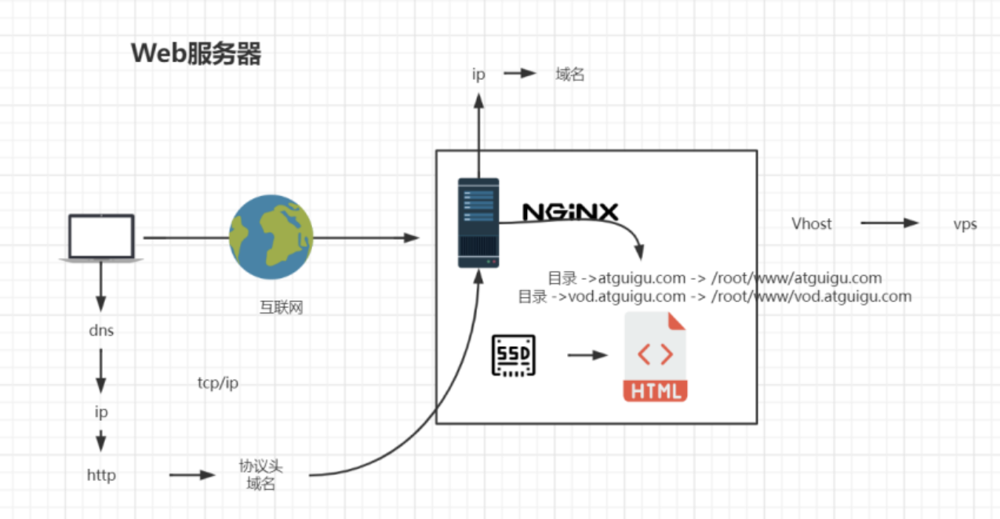


## 4.2. 虚拟主机与域名解析

tcp/ip -> 以二进制流的形式约定进行数据传输

http -> 有很多对发收双方的约束，请求报文的头信息会携带本次发送的信息的内容的一些信息

https -> 在http协议之上，加了一层ssl证书，保障数据的安全

原本一台服务器只能对应一个站点，通过虚拟主机技术可以虚拟化成多个站点同时对外提供服务


### 4.2.1 servername 匹配规则 

**我们需要注意的是servername匹配分先后顺序，写在前面的匹配上就不会继续往下匹配了。且通配符匹配的顺序要优于静态域名匹配的顺序，而正则匹配的优先级最高。当都无法匹配，而在外网的dns域名解析我们的设置的域名映射是通配符开头，nginx没有设置对应的，nginx会把它分配给第一个vhost**


### 4.2.2 **完整匹配**

我们可以在同一servername中匹配多个域名

```sh
server_name vod.mmban.com www1.mmban.com;
```


### 4.2.3 **通配符匹配**

```sh
server_name *.mmban.com
```


### 4.2.4 **通配符结束匹配**

```sh
server_name vod.*;
```


### 4.2.5 **正则匹配**

波浪号代表接下来要使用正则匹配了

```sh
server_name ~^[0-9]+\.mmban\.com$;
```


### 4.2.6 实战配置

在根目录下创建www文件夹，然后在内部创建两个文件夹www和vod，同时在他们内部创建两个测试用的index.html文件。并改写配置文件如下。

```sh
worker_processes  1;

events {
    worker_connections  1024;
}

http {
    include       mime.types;
    default_type  application/octet-stream;

    sendfile        on;

    keepalive_timeout  65;
   
    # 虚拟主机 vhost
    server {
        listen       80;
        server_name  localhost;

        location / {
            root   /www/www;
            index  index.html index.htm;
        }

        error_page   500 502 503 504  /50x.html;
        location = /50x.html {
            root   html;
        }
    }

    server {
        listen       88;
        server_name  localhost;

        location / {
            root   /www/vod;
            index  index.html index.htm;
        }

        error_page   500 502 503 504  /50x.html;
        location = /50x.html {
            root   html;
        }
    }
}
```

此时需要重启nginx服务器，我们使用之前学过的命令进行操作。

```sh
systemctl restart nginx
```

```sh
systemctl reload nginx
```

因为之前将nginx配置成服务了，所以就可以用systemctl的方式开启、关闭nginx服务。也可以到对应sbin目录下使用下面的命令。

```sh
nginx -t  
```

```sh
nginx -s reload
```

然后我们访问 http://192.168.110.100:88/      和    http://192.168.110.100 即可完成访问我们写的欢迎页

同时我们也可以都设置成80端口，但设置不同的域名或者主机名，仍能访问。即可以通过相同端口不同域名，或相同域名，不同端口进行虚拟主机分配。这两者的集合构成一个唯一标识，不能配置域名和端口号都相同的不同虚拟主机。


### 4.2.7 域名解析相关企业项目实战技术架构

#### 1. 多用户二级域名：可以基于DB或者写上面的vh配置文件

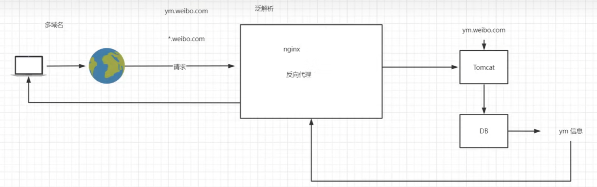


#### 2. 短网址

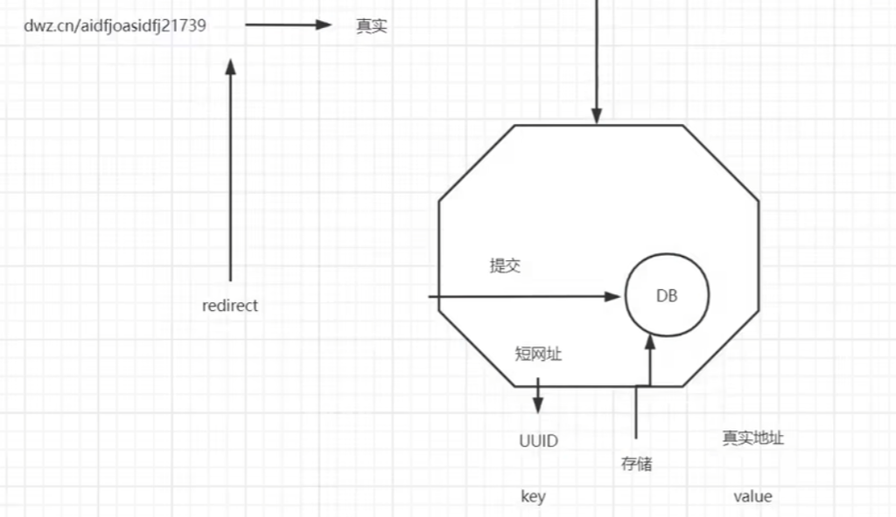

短网址是通过将长网址转换为短字符串来实现的，这样可以缩短URL长度，方便用户记忆和分享。在Nginx中，可以通过使用ngx_http_rewrite_module模块来实现短网址的转换。

具体实现方式如下：

首先需要在Nginx配置文件中定义一个location，用于接收短网址的请求。
在该location中，可以使用rewrite指令来将短网址转换为长网址。例如，可以使用正则表达式来匹配短网址，并将其转换为对应的长网址。
如果需要将长网址转换为短网址，可以使用Nginx的变量和自定义函数来生成短字符串，并将其与长网址进行映射。
最后，可以将映射关系存储在Nginx的缓存中，以提高性能和减轻数据库负担。
需要注意的是，在实现短网址时，需要考虑到安全性和唯一性。为了防止恶意用户生成重复的短字符串，可以使用随机数或时间戳等方式来生成唯一的短字符串。同时，也需要对短网址进行访问权限控制，以避免被非法访问或滥用。同时为了防止Nginx缓存过多，可以像上图一样使用数据库进行存储KV，每次接受查询进行数据库查询。


#### 3. HTTPDNS

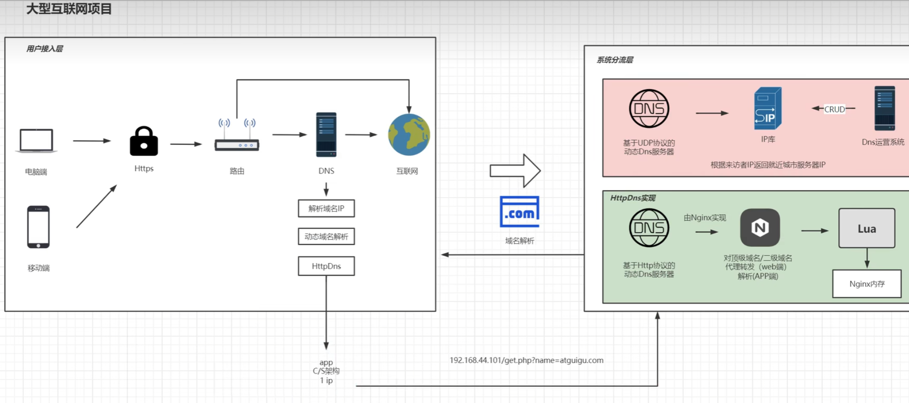

HTTPDNS是一种将域名解析请求通过HTTP协议进行转发的方式，以解决DNS污染等问题。与传统DNS不同的是，HTTPDNS的解析结果并非通过UDP或TCP协议返回，而是通过HTTP协议返回。

在Nginx中，可以通过HTTP模块中的resolver指令来指定DNS服务器地址。在resolver指令中，可以指定多个DNS服务器地址，它们会按照顺序逐个进行解析，直到解析成功。如果所有的DNS服务器都无法解析成功，则会返回解析失败的响应。

当使用HTTPDNS时，可以将HTTP请求发送到指定的HTTPDNS服务器，该服务器会返回解析结果。在Nginx中，可以通过ngx_http_upstream_module模块来实现将HTTP请求发送到指定的HTTPDNS服务器，并将结果缓存起来以提高性能。同时，也可以通过设置TTL（Time To Live）来控制缓存时间，以避免缓存过期导致的问题。


# 5. 反向代理

## 5.1. 基本概念

反向代理是一种网络技术，它可以将客户端的请求转发到后端服务器，并将响应返回给客户端。与正向代理不同，反向代理隐藏了后端服务器的身份，客户端只能看到反向代理服务器。反向代理可以用于负载均衡、安全性和缓存等方面。

正向代理是一个位于客户端和目标服务器之间的代理服务器（中间服务器）。为了从目标服务器取得内容，客户端向代理服务器发送一个请求，并且指定目标服务器，之后代理向目标服务器转发请求，将获得的内容返回给客户端。正向代理的情况下，客户端必须要进行一些特殊的设置才能使用。

不管是正向代理还是反向代理，本质代理服务器的带宽限制了网络传递数据的速度，有先天的局限性。

Nginx这种反向代理模式，也可以称作隧道式代理，为了解决上面说的局限性，如果能让我们后端的服务器，返回数据的时候，自己发送而不是经过代理服务器，就可以解决问题，这种模型就是`DR`模型，可以使用类似`nginx`的应用如 `lvs`进行这样的操作，它本质上也算来连接内网的网关，只能向外面传数据，但是无法接受外面的请求。

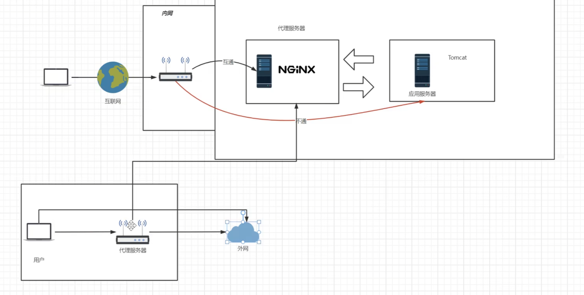


## 5.2. 反向代理在企业中的应用

### 5.2.1. 传统公司架构

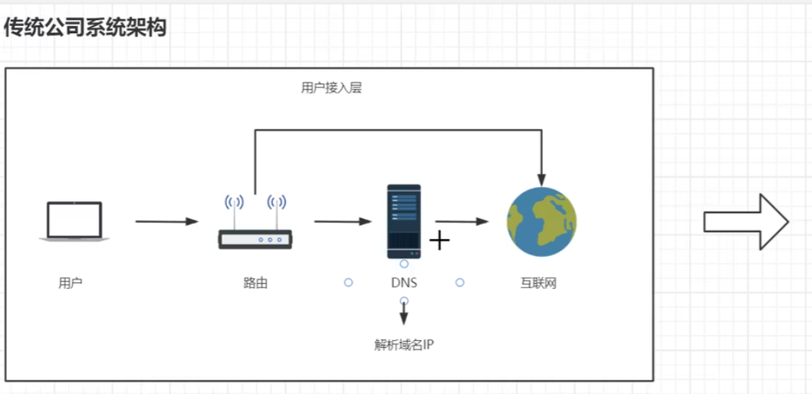

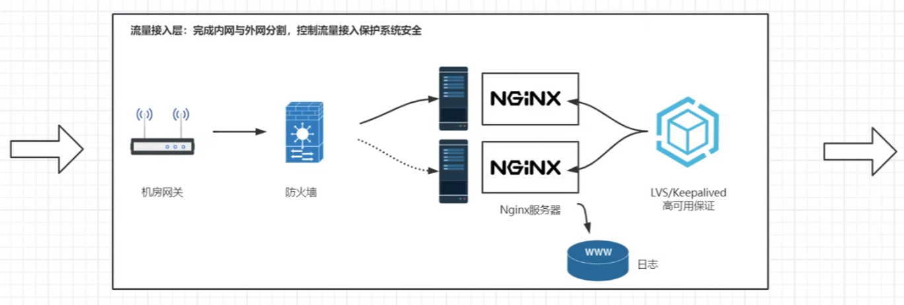

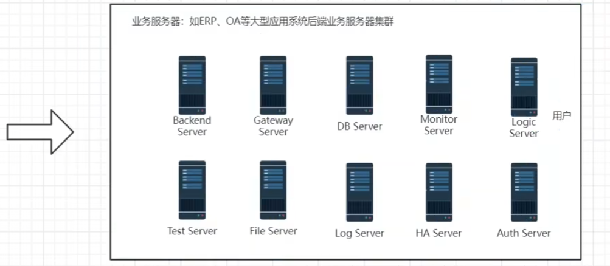

QPS是指每秒钟处理的请求数量，是衡量系统性能的重要指标之一。它可以用来评估一个服务器或网络设备的处理能力，通常用于衡量高并发系统的性能。QPS越高，说明系统每秒钟能够处理的请求数量越多，系统的性能也就越好。

Gataway Server 起到了统一管理后端服务器的网络请求，起到了鉴权作用，并非所有的请求都能访问后端的所有服务器，需要先经过网关服务器进行认证。

ERP是企业资源计划系统的缩写，是一种集成管理软件，旨在帮助企业管理和协调其各个部门的业务流程。它将各个部门的业务流程整合在一起，包括销售、采购、生产、库存、财务等，以提高企业的效率和生产力。ERP系统可以提供实时数据和分析，帮助企业做出更好的决策，并优化业务流程，减少重复工作和错误。


### 5.2.2. 中小型互联网公司架构

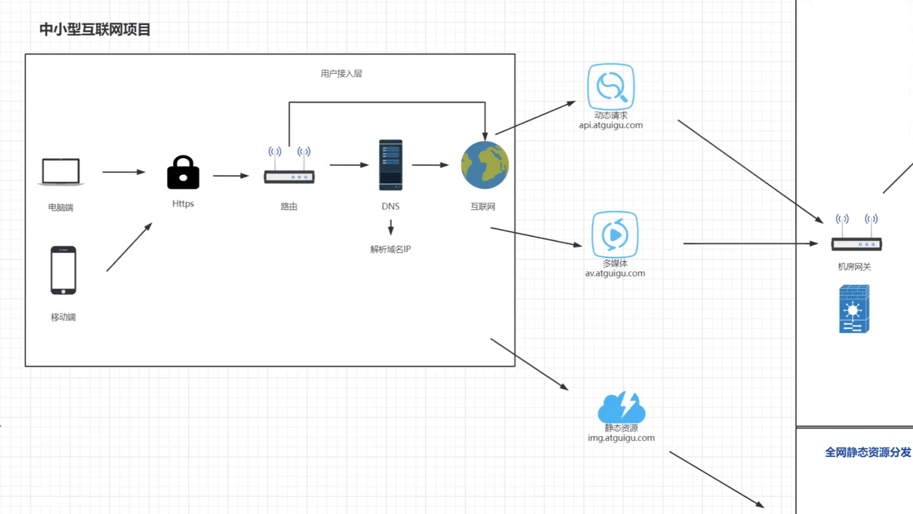

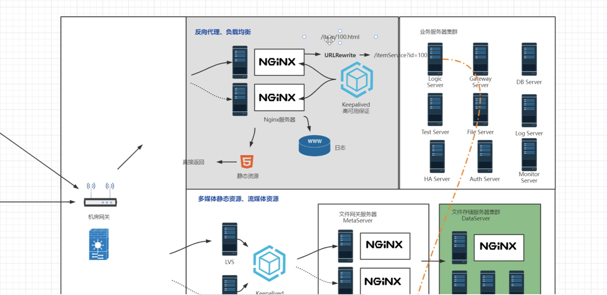

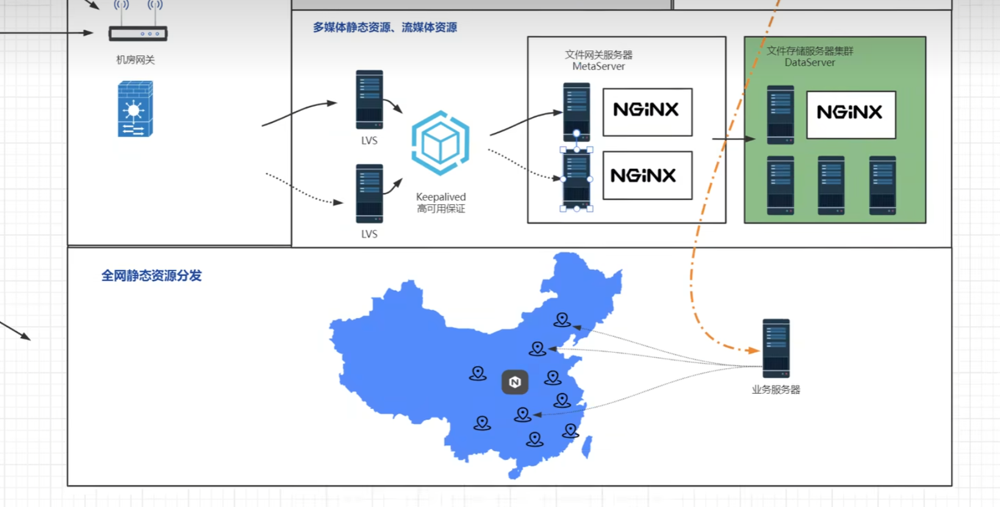

多台计算机干同样的事，多台服务器跑的都是一套完整的代码服务，这就叫集群，访问Nginx代理服务器，让它基于算法，如轮询，哈希等进行对集群的访问，达到最大化利用服务器资源的目的，这个功能就叫负载均衡。当然服务器看能不能访问的通肯定是访问才知道，所以当访问不同存在`retry`重新向别的集群节点访问的能力。


## 5.3 反向代理实战

### 5.3.1 **配置反向代理**

反向代理也是配置在server的location下的，但是配置了反向代理，就不能配置`root`和`index`了。可以配置网址，主机，或者是主机群体。

同时如果不写前面的`www.`会发现浏览器域名变成了跳转过去的域名，打开浏览器控制台能看到`302`码【重定向】，说明进行了请求重定向。同时这里也不支持`https`协议的代理，因为有了`ca`证书，后续会深入讲解。这里我们可以改为其他服务器的ip，看看能否完成代理。

```sh
    server {
        listen       80;
        server_name  www.fanxy.cloud;

        location / {
            proxy_pass http://www.bilibili.com;
        }
```

这里克隆两个虚拟机，并把配置换成最小化的默认配置，然后把他们默认index页面的样式改成对应主机名称方便辨认和做实验，然后把完成后续的代理学习。

```sh
worker_processes  1;

events {
    worker_connections  1024;
}

http {
    include       mime.types;
    default_type  application/octet-stream;

    sendfile        on;
    
    keepalive_timeout  65;

    server {
        listen       80;
        server_name  localhost;

        location / {
            root   html;
            index  index.html index.htm;
        }
    }
}
```


## 5.4. **基于反向代理的负载均衡**

### 5.4.1. 轮询

这里类似RabbitMQ在联邦里学过的，上下流，定义一个上流对应的名称，这个层级和server是同一级别的。然后我们配置的反向代理域名填入上流定义的名称，即可完成最基本的负载均衡。【此时测试就是轮询访问，逐一转发，这种方式适用于无状态请求。】

```sh
    upstream httptest {
    server 192.168.110.103:80;
    server 192.168.110.104:80;
}
   
    # 虚拟主机 vhost
    server {
        listen       80;
        server_name  www.fanxy.cloud;

        location / {
              proxy_pass http://httptest;
       #     root   /www/www;
       #     index  index.html index.htm;
        }
}
```


### 5.4.2. weight【权重】

指定轮询几率，weight和访问比率成正比，用于后端服务器性能不均的情况。

```sh
upstream httptest {
server 192.168.110.103:80 weight=10 backup;
server 192.168.110.104:80 down;
server 192.168.110.105:80 weight=2;
}
```

- `down`：表示当前的server暂时不参与负载

- `weight`：默认为`1`.`weight越大，负载的权重就越大。`

- `backup`： 其它所有的非`backup`机器`down`或者忙的时候，请求`backup`机器。

**<font color="bb000">后面几种负载均衡的方式，几乎在企业中用不到这里只是保持知识的全面性来科普。ip_hash 在一些简单的、传统的架构里边还是有用的。工作环境中一般要么是使用基本的轮询和权重，只是会话一致性没法保证了，需要特别处理，而可以结合lua脚本去解决这个问题。后端的服务器一般轮询就无法保证有状态，常用的解决方案如SpringSession，就是利用把session统一放到一个服务器上，比如Redis服务器集群，每次访问的Sesion就不从对应的服务器找，而是先去Redis服务器上找。但这么做并不适合真正的高并发场景，高并发场景可以通过下放tocken的方式，比如每次访问服务器，会先经过权限校验服务器，客户端第一次登录的时候服务器给客户端办法一个令牌（token）会返回到客户端存储。后面所有的请求在请求头加上这个令牌去请求就可以了，tocken记录了当前会话的信息，且做了加密【非对称加密】，双方无法更改，或者说更改服务端校验就会失败。</font>**

**补充**

**<font color="000bb">Session 是一种有状态的技术，浏览器中通过Cookie保持访问的状态，一个Session对应一个Cookie，Cookie保存了用户的SessionID，而服务器创建对应容器存放容器通过KV的Id找到对应的Session。有状态和无状态是指计算机系统的特性，有状态系统存储了关于用户或客户端的信息，以便在后续交互中使用。而无状态系统则不存储任何关于用户或客户端的信息，每个请求都是相互独立的。</font>**

**<font color="000bb">在 Web 应用程序中，Session 技术通常用于跟踪用户的登录状态、购物车内容、偏好设置等信息。服务器会为每个用户分配一个唯一的 Session ID，并将其存储在服务器端。在用户与服务器进行交互时，服务器可以通过 Session ID 来识别用户，并访问存储在 Session 中的信息。</font>**

**<font color="000bb">相比之下，无状态 Web 应用程序不存储任何关于用户的信息，每个请求都是相互独立的。因此，无状态应用程序通常需要在每个请求中包含足够的信息来标识用户和处理请求。这种方式可以提高系统的可伸缩性和可靠性，但也可能需要更多的网络带宽和处理能力。</font>**


### 5.4.3. **ip_hash**

根据客户端的ip地址转发同一台服务器，可以保持回话【Session】。现在因为移动端的存在，ip是经常变化的，所以这个策略就不太有意义了。


### 5.4.4. least_conn

最少连接访问，这个也不是特别合理，因为本身出现资源倾斜可能就是因为我们根据服务器的性能分配了不同权重，这么设置就导致又拉回均衡访问。同时我们动态扩容一台服务器上下线，我们设置了最少连接访问也是不支持的。因为上了一台新机器要重新reload配置文件，会导致服务暂时中断，之前说过其实会开新的进程，原先进程如果有后端服务会让它继续完成再关闭，如果没关闭可能是耗时的服务，或者是延迟服务，比如15分钟的交易时间。一般后端会进行异步化处理，可以比如放入rabbitmq的延迟队列，以异步方式进行使用。此时大家几乎都归零了，使用这个策略并不会达到我们预期想要完成的平衡。


### 5.4.5. **url_hash**

需要专门下载第三方插件，根据用户访问的url定向转发请求，可以完成定向流量转发，本质也是为了解决会话一致性问题，由于 url_hash 的哈希冲突问题，可能会导致请求被错误地分配给错误的服务器，或者缓存响应时出现数据丢失或混淆的情况。此外，url_hash 只能存储有限的信息，并且不是唯一的，因此在某些情况下可能不够灵活。因此，在使用 url_hash 之前，需要仔细考虑其局限性，并确定它是否适合特定的应用场景。


### 5.4.6. **fair**

需要专门下载第三方插件，根据后端服务器响应时间转发请求。这个也不合理，因为实际情况下响应时间是动态变化的， 可能本身设置好访问策略，有一台性能好的服务器它只是因为交换机过热，导致访问它的速度变慢，使用这个策略导致访问集中分给了其他性能差的，形成了流量倾斜的风险，甚至可能出现突然压垮这些服务器的可能。


# 6. 动静分离

## 6.1. 基础版

**配置反向代理**

```sh
location / {
    proxy_pass http://192.168.110.104:8080;
}
```

**增加每一个location**

```sh
location /css {
    root /usr/local/nginx/static;
    index index.html index.htm;
}
location /images {
    root /usr/local/nginx/static;
    index index.html index.htm;
}
location /js {
    root /usr/local/nginx/static;
    index index.html index.htm;
}
```

**最长前缀匹配**： / 这个的优先级比较低 如果有在它基础上更深层次的路径则优先访问那个


## 6.2. **使用一个location**

tomcat和nginx比性能只是略差，因为有session的存在，其实tomcat在7以上的版本就通过底层存在的nio机制，已经可以做到keepalive了。

**location** **前缀**

- **`/` 通用匹配，任何请求都会匹配到。**

- **`=` 精准匹配，不是以指定模式开头**

- **`~` 正则匹配，区分大小写**

- **`~*` 正则匹配，不区分大小写**

- **`^~` 非正则匹配，匹配以指定模式开头的location**

**location匹配顺序**

- 多个正则location直接按书写顺序匹配，成功后就不会继续往后面匹配

- 普通（非正则）location会一直往下，直到找到匹配度最高的（最大前缀匹配）

- 当普通location与正则location同时存在，如果正则匹配成功,则不会再执行普通匹配

- 所有类型location存在时，“=”匹配 > “^~”匹配 > 正则匹配 > 普通（最大前缀匹配）

```sh
location ~*/(css|img|js) {
    root /usr/local/nginx/static;
    index index.html index.htm;
}
```

这么书写即可完成配置一个`location`的动静分离，我们只需要放到对应的我们书写的`root`目录下即可

**alias与root**

```sh
location /css {
    alias /usr/local/nginx/static/css;
    index index.html index.htm;
}
```

**root用来设置根目录，而alias在接受请求的时候在路径上不会加上location。**

1）alias指定的目录是准确的，即location匹配访问的path目录下的文件直接是在alias目录下查找的；

2）root指定的目录是location匹配访问的path目录的上一级目录,这个path目录一定要是真实存在root指定目录下的；

3）使用alias标签的目录块中不能使用rewrite的break（具体原因不明）；另外，alias指定的目录后面必须要加上"/"符号！！

4）**alias虚拟目录配置中，location匹配的path目录如果后面不带"/"，那么访问的url地址中这个path目录后**

**面加不加"/"不影响访问，访问时它会自动加上"/"； 但是如果location匹配的path目录后面加上"/"，那么访问的url地址中这个path目录必须要加上"/"，访问时它不会自动加上"/"。如果不加上"/"，访问就会失败！** 

5）**root目录配置中，location匹配的path目录后面带不带"/"，都不会影响访问。**


# 7. **UrlRewrite**

## 7.1. **rewrite语法格式及参数语法**

要注意 `rewrite` 要放在 `proxy_pass` 前面，否则 `rewrite` 不生效

`rewrite`是实现URL重写的关键指令，根据`regex` (正则表达式)部分内容，

重定向到`replacement`，结尾是`flag`标记。

>  **<font color="bb000">`rewrite <regex> <replacement> [flag];`</font>**

​      关键字        正则            替代内容          `flag` 标记

**关键字**：其中关键字`error_log`不能改变

**正则**：perl兼容正则表达式语句进行规则匹配

**替代内容**：将正则匹配的内容替换成`replacement`

**`flag`标记**：rewrite支持的`flag`标记，**这里记住不加flag标记可能会出现反向代理无效**

`rewrite`参数的标签段位置：

`server`,`location`,`if`

`flag`标记说明：

`last` #本条规则匹配完成后，继续向下匹配新的location URI规则

`break` #本条规则匹配完成即终止，不再匹配后面的任何规则

`redirect` #返回302临时重定向，浏览器地址会显示跳转后的URL地址

`permanent` #返回301永久重定向，浏览器地址栏会显示跳转后的URL地址

301 的重定向会记录到浏览器缓存，下次无需 Nginx 也能直接跳转；302 不会记录到缓存，必须先要过 Nginx 才能跳转

**实例  利用rewrite实现了伪静态**

```sh
location / {
	rewrite ^/([0-9]+).html$ /index.jsp?pageNum=$1 break;
	proxy_pass http://192.168.110.104:8080;
}
```


## 7.2. 负载均衡 + UrlRewrite

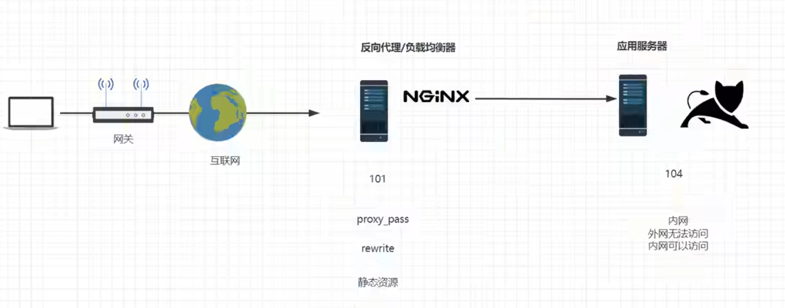

**应用服务器防火墙配置**

**开启防火墙——重启防火墙**

```sh
systemctl start firewalld
systemctl restart firewalld
```

**重载规则**

```sh
firewall-cmd --reload
```

**查看已配置规则**

```sh
firewall-cmd --list-all
```

**指定端口和ip访问【这里指的就是我们反向代理的服务器 加了 --permanent 相当于是永久规则】**

```sh
firewall-cmd --permanent --add-rich-rule="rule family="ipv4" source address="192.168.44.101"
port protocol="tcp" port="8080" accept"
```

**移除规则**

```sh
firewall-cmd --permanent --remove-rich-rule="rule family="ipv4" source address="192.168.44.101" port port="8080" protocol="tcp" accept"
```

**网关配置**

```sh
upstream httpds {
    server 192.168.44.102 weight=8 down;
    server 192.168.44.103:8080 weight=2;
    server 192.168.44.104:8080 weight=1 backup;
}

# 虚拟主机 vhost
server {
    listen       80;
    server_name  www.fanxy.cloud;

    location / {
        rewrite ^/([0-9]+).html$ /index.jsp?pageNum=$1 redirect;
        proxy_pass http://httpds;
    }
}
```

**起到了网关服务器的作用**


# 8. 防盗链

## 8.1. 基本使用

当我们通过浏览器访问后端项目，其实页面内联的css或者js等静态文件，是通过浏览器接受到返回来的请求后又发送的第二次http请求获得的，这次的请求头还有`refer`字段，利用这个字段，就可以起到判断是否来自于同一个站点。


> **<font color="bb000">valid_referers none | blocked | server_names | strings ....;</font>**

- `none`， 检测 `Referer` 头域不存在的情况。如果没有`referers` 就允许访问。

- `blocked`，检测 `Referer` 头域的值被防火墙或者代理服务器删除或伪装的情况。这种情况该头域的值不以“`http://`” 或 “`https://`” 开头。配置了这个不带也能访问。

- `server_names` ，设置一个或多个 `URL` ，检测 `Referer` 头域的值是否是这些 `URL` 中的某一个。生产环境配的是域名不是IP，我们这里用虚拟机所以使用的ip地址做示例。

这里举个例子，如我们通过网关服务器100反向代理到后端101的项目，而另一个服务器102通过反向代理访问网关服务器100，来模拟直接访问100网关服务器，以及通过服务器102间接访问服务器100，我们需要在网关服务器100处【需要防盗链的`location`中配置】

**<font color="bb000">注意这里的 if 和 ( 之间必须有个空格；常用：return 200 "要返回的文字"</font>**

```sh
location ~*/(css|img|js) {
	valid_referers 192.168.110.100;
    if ($invalid_referer) {
    return 403;
	}
	 root /usr/local/nginx/static;
     index index.html index.htm;
}
```

**如果想要完成一个自定义的错误页的返回，只需要自己更改配置文件并创建对应http状态码的html文件。** 

```sh
	upstream httpds {
        server 192.168.44.102 weight=8 down;
        server 192.168.44.103:8080 weight=2;
        server 192.168.44.104:8080 weight=1 backup;
	}

	server {
        listen       80;
        server_name  www.fanxy.cloud;

        location / {
            rewrite ^/*([0-9]+).html$ /index.jsp?pageNum=$1 break;
            proxy_pass http://httptest;
        }
        
        location ~*/(css|img|js) {
            valid_referers 192.168.110.100;
            if ($invalid_referer) {
            return 401;
		}
	 		root /usr/local/nginx/static;
     		index index.html index.htm;
		}
		
        error_page   500 502 503 504  /50x.html;
        location = /50x.html {
            root   html;
        }
        error_page   401    /401.html;
        location = /401.html {
        	root   html;
        }
	}              
```

**如果想要完成显示自定义的错误图片，可以在防盗链上结合`rewrite`，这里把所有以/开头的请求都匹配了，而所有的请求肯定都以/开头。我们只需要在对应后面替换的请求位置放上我们的自定义图片即可**

 ```sh
         location ~*/(css|img|js) {
             valid_referers 192.168.110.100;
             if ($invalid_referer) {
             rewrite ^/      /img/x.png break;
             # return 401;
 		}
 ```


## 8.2. **使用curl测试**

如果没有这个软件需要进行下载

```sh
yum install -y curl
```

参数 :  `-I` 可以在服务器端，直接通过命令查看访问一个ip所返回的头信息，不加这个参数返回的是完整信息

```sh
curl -I http://192.168.44.101/img/logo.png
```

**带引用：即自定义是从哪个站点跳转过来的，自定义前面的refer头域**

```sh
curl -e "http://baidu.com" -I http://192.168.44.101/img/logo.png
```


# 9. 高可用配置

nginx的高可用需要利用`Keepalived`软件，我们可以设想这么一个问题，虽然我们利用nginx实现了如果后端出现问题，还能通过反向代理机制，完成访问迁移到内部别的服务器，但是如果nginx挂了，肯定不能再同时加nginx，然后多个nginx服务器上再套nginx【无限套娃】。

`Keepalived`就是提供了两个`nginx`能互相保持通信，一个不行了另外一个能顶上，但是这里有个问题，难不成他们是替换了`Ip`？其实不是，如果这么频繁换`ip`，会出现很多问题：如假死，两个服务器出现`ip`冲突。他们类似之前我们`nginx`配置的，虚拟`IP`，这个虚拟`IP`是两个人一起使用的。


## 9.1. **安装Keepalived**

### 9.1.1. **编译安装**

下载地址 https://www.keepalived.org/download.html#

使用 ./configure 编译安装

如遇报错提示

> configure: error:
>
> !!! OpenSSL is not properly installed on your system. !!!
>
> !!! Can not include OpenSSL headers files. !!!

安装依赖

```sh
yum install openssl-devel
```


### 9.1.2. **yum安装**

```sh
yum install keepalived
```


### 9.1.3. **配置**

使用yum安装后配置文件在		/etc/keepalived/keepalived.conf


### 9.1.4. **最小配置**

它的配置文件比Nginx还要多，这里用不到那么多配置，直接上最小配置。

```sh
! Configuration File for keepalived

global_defs {
	# 虚拟路由的名称
	router_id lb100
}
# vrrp是keepalived在内网通信的协议 而instance代表实例 这里给我们的实例起名字 同一组要保持相同
vrrp_instance myinstance {
	# 当前状态的是主机
    state MASTER
    # 这里填写网卡名称 可以使用 ip ADDR 查看
    interface ens33
    # 实例的虚拟路由ID 相同实例保持相同
    virtual_router_id 51
    # 竞选优先级 数值越大优先级越高 默认100
    priority 100
    # 间隔检测时间
    advert_int 1
    # 同一组的认证配置 同一组保持一致
    authentication {
        auth_type PASS
        auth_pass 1111
	}
# 虚拟IP地址 可以配置多个 但意义不大
virtual_ipaddress {
		192.168.110.200
	}
}
```

**第二台机器，改的是虚拟路由名称，主从状态，竞选优先级。**

```sh
! Configuration File for keepalived

global_defs {
	# 虚拟路由的名称
	router_id lb101
}
# vrrp是keepalived在内网通信的协议 而instance代表实例 这里给我们的实例起名字 同一组要保持相同
vrrp_instance myinstance {
	# 当前状态的是备用机
    state BACKUP
    # 这里填写网卡名称 可以使用 ip ADDR 查看
    interface ens33
    # 实例的虚拟路由ID 相同实例保持相同
    virtual_router_id 51
    # 竞选优先级 数值越大优先级越高 默认100
    priority 50
    # 间隔检测时间
    advert_int 1
    # 同一组的认证配置 同一组保持一致
    authentication {
        auth_type PASS
        auth_pass 1111
	}
# 虚拟IP地址 可以配置多个 但意义不大
virtual_ipaddress {
		192.168.110.200
	}
}
```

**两台实例都启动`keepalived`，可以模拟主机`ping`虚拟`IP`，然后直接给主机关机，发现，当主机关机，备用机的虚拟IP发生变化，此时从机上位接替虚拟IP。`keepalived`是个比较简单的机制，是通过判断当前`keepalived`进程是否存活来判断的。**

**更高级的版本可以通过写一个脚本定时检测nginx服务器的状态，一旦发现服务器出现问题，就kill掉keepalived的进程，达到更优的切换**

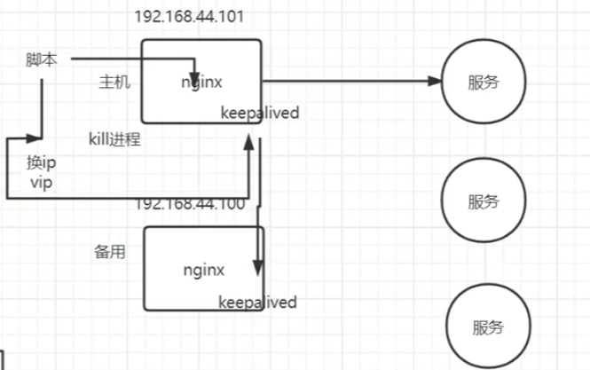


# 10. **Https证书配置**

## 10.1. **不安全的http协议**

对称加密：加密密钥=解密密钥；非对称加密：加密密钥！=解密密钥；

对称加密加密与解密使用的是同样的密钥，所以速度快，但由于需要将密钥在网络传输，所以安全性不高。

非对称加密使用了一对密钥，公钥与私钥，所以安全性高，但加密与解密速度慢。

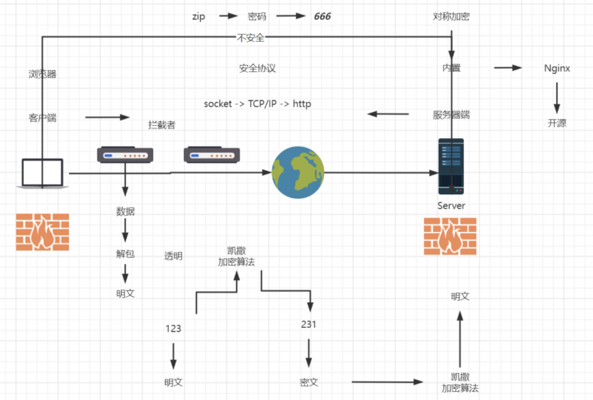

443端口通讯目的是为了获得客户端产生的私钥。服务端得到客户单私钥后，使用的是客户端私钥加密，而不是服务端的私钥！

类似钥匙和锁，使用这种算法，发送方可以使用接收方的公钥对信息进行加密，只有拥有相应私钥的接收方才能解密信息。这种方式比对称加密更加安全，因为即使公钥被泄露，公钥无法解密消息，黑客也无法破解信息，因为他们没有私钥。

从伪造客户端的角度杜绝了信息泄露，那伪造服务器端呢？所以非对称加密算法也无法保证安全性，这就引出了CA证书认证，相当于第三方。

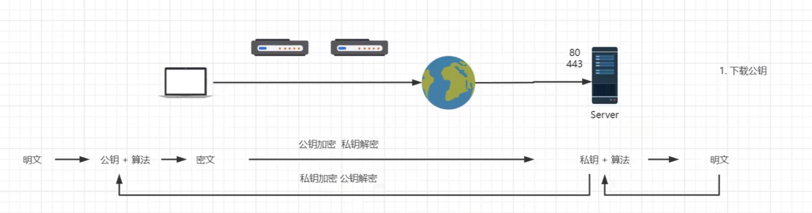

只使用非对称加密算法，公钥可以被查看并篡改，有了CA机构后，公钥可以被查看，但是不能被篡改

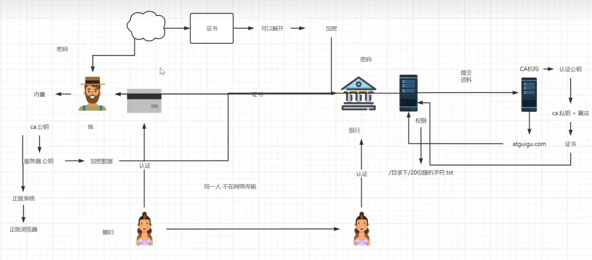


## 10.2. **自签名: openssl**

系统内置：openssl包含：SSL协议库、应用程序以及密码算法库

**图形化工具 XCA** : https://www.hohnstaedt.de/xca/index.php/download

**CA 签名**

可以购买下载对应nginx的证书zip文件，上传到服务器内的conf目录下，并修改配置文件，填写证书的公私钥。

```sh
    server {
        listen       443 ssl;
        server_name  localhost;

        ssl_certificate      fanxy.cloud_bundle.pem;
        ssl_certificate_key  fanxy.cloud.key;
    }
```

想要直接通过nginx安装一个论坛，可以参考discuz.net 直接安装，通过浏览器能实现部署。
