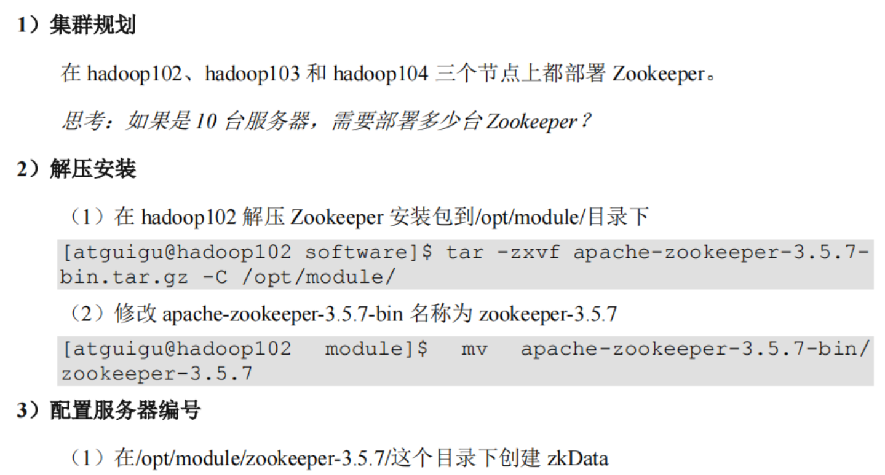
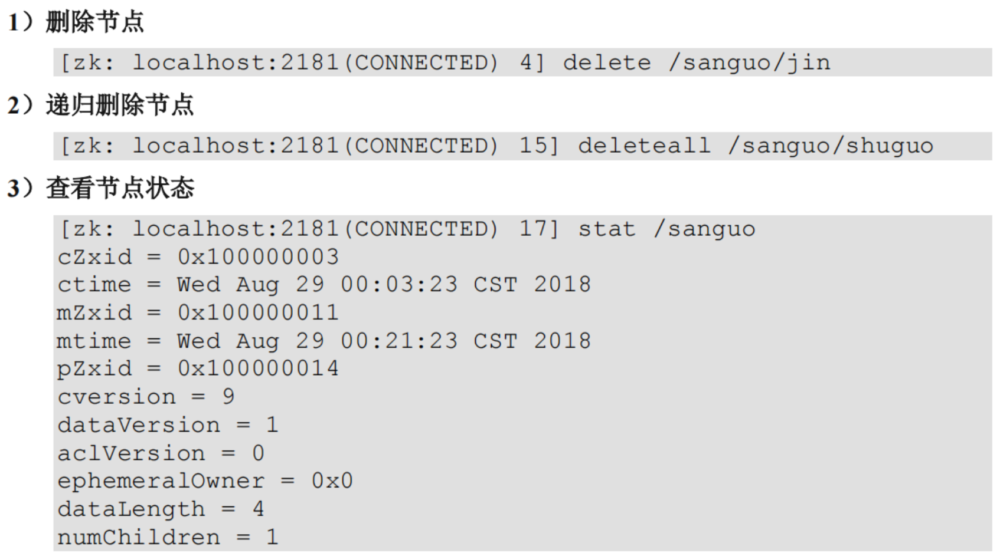
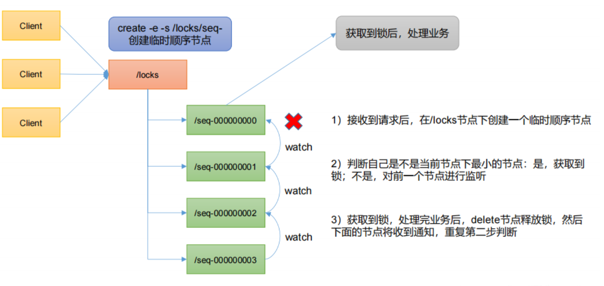

# 第 1 章 Zookeeper 入门

## 1.1. 概述

`Zookeeper` 是一个开源的分布式的，为分布式框架提供协调服务的 `Apache` 项目

`Zookeeper` 从设计模式角度来理解：是一个基于观察者模式设计的分布式服务管理框架，它负责存储和管理大家都关心的数据，然 后接受观察者的注册，一旦这些数据的状态发生变化，`Zookeeper`就将负责通知已经在`Zookeeper`上注册的那些观察者做出相应的反应。

## 1.2. 特点


1）Zookeeper：一个领导者（Leader），多个跟随者（Follower）组成的集群。

2）集群中只要有**半数以上**节点存活，Zookeeper集群就能正常服务。所以Zookeeper适合安装奇数台服务器。

3）全局数据一致：每个Server保存一份相同的数据副本，Client无论连接到哪个Server，数据都是一致的。

4）更新请求顺序执行，来自同一个Client的更新请求按其发送顺序依次执行。

5）数据更新原子性，一次数据更新要么成功，要么失败。

6）实时性，在一定时间范围内，Client能读到最新数据

**补充**：为什么Zookeeper适合安奇数台机器？【半数以上存活就能工作】

如有5台服务器，down了2台仍能继续工作，down3台便停止。

而如果加一台服务器，仍然是一样的效果，故从奇数增加到偶数的一台机器对可靠性并没有提升，所以一般选择奇数台。

## 1.3. 数据结构


## **1.4. 应用场景**

提供的服务包括：统一命名服务、统一配置管理、统一集群管理、服务器节点动态上下线、软负载均衡等。

### 1.4.1. 统一命名服务


### 1.4.2. 统一配置管理


### 1.4.3. 统一集群管理


### 1.4.4. 服务动态上下线


### 1.4.5. **软负载均衡**


## 1.5. 下载地址

**1）官网首页：**

https://zookeeper.apache.org/

**2）下载截图**


# 第 2 章 Zookeeper 本地安装

## **2.1.** **本地模式安装**

**1）安装前准备**


**这里最好还是改个名字，把原本的配置文件当成备用。**


## 2.2. 配置参数解读

Zookeeper中的配置文件`zoo.cfg`中参数含义解读如下：

**1）`tickTime` = 2000：通信心跳时间，Zookeeper服务器与客户端心跳时间，单位毫秒**


这个10代表次数，即初始化状态的时候，`Leader` 和 `Follower` `10 * tickTime` 的时间内，还没有建立连接，认为连接失败了。


# 第 3 章 Zookeeper 集群操作

## **3.1.** 集群操作

### **3.1.1.** 集群安装




### 3.1.2. 选举机制【面试重点】

#### <font color="bb000">Zookeeper选举机制——第一次启动</font>


（5）服务器5启动，同4一样当小弟。

#### <font color="bb000">Zookeeper选举机制——非第一次启动</font>


**选举Leader规则：**

**<font color="bb000">①EPOCH大的直接胜出</font>**

**<font color="bb000">②EPOCH相同，事务id大的胜出 </font>**

**<font color="bb000">③事务id相同，服务器id大的胜出</font>**

### 3.1.3. ZK集群启动停止脚本

**1）在 hadoop102 的/home/fanxy/bin 目录下创建脚本**

```sh
vim zk.sh
```

**在脚本中编写如下内容**

```sh
#!/bin/bash
case $1 in
"start"){
for i in hadoop100 hadoop101 hadoop102
do
 echo ---------- zookeeper $i 启动 ------------
ssh $i "/opt/module/zookeeper-3.5.7/bin/zkServer.sh start"
done
};;
"stop"){
for i in hadoop100 hadoop101 hadoop102
do
 echo ---------- zookeeper $i 停止 ------------ 
ssh $i "/opt/module/zookeeper-3.5.7/bin/zkServer.sh stop"
done
};;
"status"){
for i in hadoop100 hadoop101 hadoop102
do
 echo ---------- zookeeper $i 状态 ------------ 
ssh $i "/opt/module/zookeeper-3.5.7/bin/zkServer.sh status"
done
};;
esac
```

**2）增加脚本执行权限**

```sh
chmod u+x zk.sh
```

**3）Zookeeper 集群启动脚本**

```sh
zk.sh start
```

**4）Zookeeper 集群停止脚本**

```sh
zk.sh stop
```

**5）配置SSH免密登录**

```sh
ssh-keygen
```

```sh
ssh-copyid [想要把公钥发给对方的域名或者ip]
```

## **3.2.** 客户端命令行操作

### 3.2.1. 命令行语法

| **命令基本语法** | **功能描述**                                                 |
| ---------------- | ------------------------------------------------------------ |
| `help`           | 显示所有操作命令                                             |
| `ls path`        | 使用 `ls` 命令来查看当前 `znode` 的子节点 [可监听] `-w` 监听子节点变化 `-s` 附加次级信息 |
| `create `        | 普通创建      `-s` 含有序列   `-e` 临时（重启或者超时消失）  |
| `get path `      | 获得节点的值 [可监听]    `-w` 监听节点内容变化    `-s` 附加次级信息 |
| `set `           | 设置节点的具体值                                             |
| `stat`           | 查看节点状态                                                 |
| `delete`         | 删除节点                                                     |
| `deleteall`      | 递归删除节点                                                 |

**1）启动客户端**

```sh
bin/zkCli.sh -server hadoop100:2181
```

**2）显示所有操作命令**

```sh
help
```

### **3.2.2 znode** **节点数据信息**

**1）查看当前znode中所包含的内容**

```sh
ls /
```

**2）查看当前节点详细数据**

```sh
ls -s /
```


### 3.2.3. 节点类型【持久/短暂/有序号/无序号】

**<font color="bb000">节点类型</font>**


（1）持久化目录节点

客户端与`Zookeeper`断开连接后，该节点依旧存在

（2）持久化顺序编号目录节点

客户端与`Zookeeper`断开连接后，该节点依旧存在，只是`Zookeeper`给该节点名称进行顺序编号

（3）临时目录节点

客户端与`Zookeeper`断开连接后，该节点被删除

（4）临时顺序编号目录节点

客户端与 `Zookeeper` 断开连接后，该节点被删除 ， 只 是`Zookeeper`给该节点名称进行顺序编号

**1）分别创建 2 个普通节点（永久节点 + 不带序号）**

```sh
create /sanguo "diaochan"
```

```sh
create /sanguo/shuguo "liubei"
```

注意：创建节点时，要赋值

**2）获得节点的值**

```sh
get -s /sanguo
```

```sh
get -s /sanguo/shuguo
```

**3）创建带序号的节点（永久节点 + 带序号）**

（1）先创建一个普通的根节点/sanguo/weiguo

```sh
create /sanguo/weiguo "caocao"
```

（2）创建带序号的节点

```sh
create -s 
```

**带序号的节点的序列号是自动根据出现次数增加，并且是在原本名字的基础上增加，重名创建就创建自增的序号名字的新的带序号的节点，而不带序号的永久节点无法重复创建。此时退出客户端，再次重新连接也没有消失，说明是永久节点。**


**4）创建短暂节点（短暂节点 + 不带序号 or 带序号）**


### **3.2.4**. 监听器原理

客户端注册监听它关心的目录节点，当目录节点发生变化（数据改变、节点删除、子目录节点增加删除）时，`ZooKeeper` 会通知客户端。监听机制保证 `ZooKeeper` 保存的任何的数据的任何改变都能快速的响应到监听了该节点的应用程序。


**1）节点的值变化监听**


**2）节点的子节点变化监听（路径变化）**

（1）在 hadoop104 主机上注册监听`/sanguo` 节点的子节点变化


### 3.2.5 节点删除与查看



## **3.3.** **客户端** **API** **操作**

前提：保证 hadoop100、hadoop101、hadoop102 服务器上 Zookeeper 集群服务端启动。

### **3.3.1. IDEA** **环境搭建**

**1）创建一个工程：zookeeper**

**2）添加pom文件**

```xml
    <dependencies>
        <dependency>
            <groupId>junit</groupId>
            <artifactId>junit</artifactId>
            <version>RELEASE</version>
        </dependency>
        <dependency>
            <groupId>org.apache.logging.log4j</groupId>
            <artifactId>log4j-core</artifactId>
            <version>2.8.2</version>
        </dependency>
        <dependency>
            <groupId>org.apache.zookeeper</groupId>
            <artifactId>zookeeper</artifactId>
            <version>3.5.7</version>
        </dependency>
    </dependencies>
```

**3）拷贝log4j.properties文件到项目根目录**

需要在项目的 src/main/resources 目录下，新建一个文件，命名为“log4j.properties”，在文件中填入

```properties
log4j.rootLogger=INFO, stdout 
log4j.appender.stdout=org.apache.log4j.ConsoleAppender 
log4j.appender.stdout.layout=org.apache.log4j.PatternLayout 
log4j.appender.stdout.layout.ConversionPattern=%d %p [%c] - %m%n 
log4j.appender.logfile=org.apache.log4j.FileAppender 
log4j.appender.logfile.File=target/spring.log 
log4j.appender.logfile.layout=org.apache.log4j.PatternLayout 
log4j.appender.logfile.layout.ConversionPattern=%d %p [%c] - %m%n
```

**4）创建包名com.fanxy.zk**

**5）创建类名称zkClient**


### **3.3.2.** 创建 `ZooKeeper` 客户端

```java
public class ZooKeeperClient {

    private String connectionString = "hadoop100:2181,hadoop101:2181,hadoop102:2181";
    private int sessionTimeout = 2000;

    private ZooKeeper zkClient;

    @Before
    public void init() throws IOException {

        zkClient = new ZooKeeper(connectionString, sessionTimeout, new Watcher() {
            @Override
            public void process(WatchedEvent watchedEvent) {
                List<String> children = null;
                try {
                    children = zkClient.getChildren("/", true);
                    children.forEach(System.out::println);
                } catch (Exception e) {
                    throw new RuntimeException(e);
                }
            }
        });
    }

    @Test
    public void create() throws InterruptedException, KeeperException {
        zkClient.create("/sanguo", "lvbei".getBytes(), ZooDefs.Ids.OPEN_ACL_UNSAFE,CreateMode.PERSISTENT);
    }
}   
```


### 3.3.3. 创建子节点

这里设置监听器`true`或`false`的含义是：是否使用监听器监听，`true`是使用初始化这个`Zookeeper`对象的监听器的方法，而`false`代表不使用，也可以传入一个新的监听器。

```java
    @Test
    public void getChildren() throws InterruptedException, KeeperException {
        List<String> children = zkClient.getChildren("/", true);
        children.forEach(System.out::println);

        // 延时
        Thread.sleep(Long.MAX_VALUE);
    }
```

**Junit的Thread.sleep期间还能执行当前线程的回调函数吗？**

可以执行。`Thread.sleep`只会使当前线程休眠，不会影响其他线程的执行。如果有回调函数在当前线程中注册，那么它们仍然会被执行。

此时我们对监听的 "`/`" 下进行节点的添加等操作，会被监听到，并调用回调函数，将当前 "`/`" 下的子节点都遍历打印出来。


### 3.3.5. 判断 `Znode` 是否存在

这里记得把上面的监听器注释掉，可以看的清楚一些。

```java
    @Test
    public void exist() throws InterruptedException, KeeperException {
        Stat exists = zkClient.exists("/sanguo", false);
        System.out.println(exists == null ? "not exist" : "exist");
    }
```


## 3.4. 客户端向服务端写数据流程

### 3.4.1. <font color="bb000">写流程之写入请求直接发送给 Leader 节点</font>


### 3.4.2. <font color="bb000">写流程之写入请求发送给 follower 节点</font>

`ZooKeeper`数据写入超过半数就可以应答了


# 第 4 章 服务器动态上下线监听案例

## 4.1. 需求

某分布式系统中，主节点可以有多台，可以动态上下线，任意一台客户端都能实时感知到主节点服务器的上下线。

## 4.2. 需求分析


### 4.3. 具体实现


**（2）在 Idea 中创建包名：`com.fanxy.zkcase1`**

**（3）服务器端向 `Zookeeper` 注册代码**

```java
public class DistributeServer {
    private String connectString = "hadoop100:2181,hadoop101:2181,hadoop102:2181";
    private int sessionTimeout = 2000;
    private ZooKeeper zkClient;

    void getConnection() throws Exception {
        zkClient = new ZooKeeper(connectString, sessionTimeout, new Watcher() {
            @Override
            public void process(WatchedEvent watchedEvent) {

            }
        });
    }

    private void regist(String hostName) throws Exception {
        String serverName = zkClient.create(
                "/servers/" + hostName,
                hostName.getBytes(),
                ZooDefs.Ids.OPEN_ACL_UNSAFE,
                CreateMode.EPHEMERAL_SEQUENTIAL);

        System.out.println(serverName + " is online");
    }

    private void business() throws InterruptedException {
        Thread.sleep(Long.MAX_VALUE);
    }

    public static void main(String[] args) throws Exception {
        DistributeServer server = new DistributeServer();

        // 1 获取连接
        server.getConnection();

        // 2 注册服务器到zk集群
        server.regist(args[0]);

        // 3 启动业务逻辑【睡觉】
        server.business();
    }
}
```

**（4）客户端代码**

```java
public class DistributeClient {

    private String connectString = "hadoop100:2181,hadoop101:2181,hadoop102:2181";
    private int sessionTimeout = 2000;
    private ZooKeeper zooKeeper;

    private void getConnection() throws Exception {
        zooKeeper = new ZooKeeper(connectString, sessionTimeout, new Watcher() {
            @Override
            public void process(WatchedEvent watchedEvent) {
                // 因为监听只在后面注册一次 这里就递归调用
                try {
                    getServerList();
                } catch (Exception e) {
                    throw new RuntimeException(e);
                }
            }
        });
    }

    private void getServerList() throws InterruptedException, KeeperException {
        List<String> children = zooKeeper.getChildren("/servers", true);

        ArrayList<String> servers = new ArrayList<>();

        for (String child : children) {
            byte[] data = zooKeeper.getData("/servers/" + child, false, null);
            if (data != null) {
                servers.add(new String(data));
            }
        }

        System.out.println(servers);
    }

    private void business() throws InterruptedException {
        Thread.sleep(Long.MAX_VALUE);
    }

    public static void main(String[] args) throws Exception {
        DistributeClient client = new DistributeClient();

        // 1 获取zk连接
        client.getConnection();

        // 2 监听servers下面节点得增加和删除
        client.getServerList();

        // 3 业务逻辑【睡觉】
        client.business();
    }
}
```


## 4.4. 测试


# 第 5 章 ZooKeeper 分布式锁案例

什么叫做分布式锁呢？

比如说"进程 1"在使用该资源的时候，会先去获得锁，"进程 1"获得锁以后会对该资源保持独占，这样其他进程就无法访问该资源，"进程 1"用完该资源以后就将锁释放掉，让其他进程来获得锁，那么通过这个锁机制，我们就能保证了分布式系统中多个进程能够有序的访问该临界资源。那么我们把这个分布式环境下的这个锁叫作分布式锁。




## 5.1 原生 Zookeeper 实现分布式锁案例

**1）分布式锁实现**

```java
public class DistributedLock {

    private final String connetString = "hadoop100:2181,hadoop101:2181,hadoop102:2181";
    private final int sessionTimeout = 2000;
    private ZooKeeper zooKeeper;
    private CountDownLatch connectDownLatch = new CountDownLatch(1);
    private CountDownLatch waitLatch = new CountDownLatch(1);
    private String waitPath;
    private String currentNode;

    public DistributedLock() throws IOException, InterruptedException, KeeperException {
        // 获取连接
        zooKeeper = new ZooKeeper
                (connetString, sessionTimeout, new Watcher() {
                    @Override
                    public void process(WatchedEvent event) {
                        // connectDownLatch : 如果连接到服务器 进行放行
                        if(event.getState() == Event.KeeperState.SyncConnected){
                            connectDownLatch.countDown();
                        }

                        // waitLatch : 如果等待成功 进行放行
                        if(event.getType() == Event.EventType.NodeDeleted && event.getPath().equals(waitPath)){
                            waitLatch.countDown();
                        }
                    }
                });

        // 阻塞式等待是否连上
        connectDownLatch.await();

        // 判断 /locks 是否存在
        Stat exists = zooKeeper.exists("/locks", false);

        // 不存在则创建根节点
        if (exists == null) {
            zooKeeper.create("/locks",
                    "locks".getBytes(),
                    ZooDefs.Ids.OPEN_ACL_UNSAFE,
                    CreateMode.PERSISTENT);
        }
    }

    public void zkLock() {
        try {
            // 创建对应带序号的临时节点
            currentNode = zooKeeper.create("/locks/seq-",
                    null,
                    ZooDefs.Ids.OPEN_ACL_UNSAFE,
                    CreateMode.EPHEMERAL_SEQUENTIAL);

            // 判断当前节点是否是带序号最小的 如果是获取到锁 如果不是监听上一个节点
            List<String> children = zooKeeper.getChildren("/locks", false);

            // 如果只有这一个节点 直接获取到锁
            if (children.size() == 1) {
                return;
            } else {
                Collections.sort(children);

                // 获取节点名称 seq-xxxxxxxxxxxx
                String thisNode = currentNode.substring("/locks/".length());

                // 找寻节点对应位置
                int index = children.indexOf(thisNode);

                // 分情况判断
                if (index == -1) {
                    System.out.println("数据异常");
                } else if (index == 0) {
                    // 是第一个直接获取到锁
                    return;
                } else {
                    // 需要监听前一个节点的变化情况
                    waitPath = "/locks/" + children.get(index - 1);
                    // 监视器在构造方法定义
                    zooKeeper.getData(waitPath, true, null);

                    // 等待监听前一个节点释放锁
                    waitLatch.await();

                    return;
                }
            }
        } catch (KeeperException e) {
            throw new RuntimeException(e);
        } catch (InterruptedException e) {
            throw new RuntimeException(e);
        }
    }

    public void zkUnlock() {
        // 删除节点
        try {
            zooKeeper.delete(currentNode, -1);
        } catch (InterruptedException e) {
            throw new RuntimeException(e);
        } catch (KeeperException e) {
            throw new RuntimeException(e);
        }
    }
}
```

**2）分布式锁测试**

```java
public class DistributedLockTest {
    public static void main(String[] args) throws IOException, InterruptedException, KeeperException {
        final DistributedLock lock1 = new DistributedLock();
        final DistributedLock lock2 = new DistributedLock();

        new Thread(new Runnable() {
            @Override
            public void run() {
                try {
                    lock1.zkLock();
                    System.out.println("线程1启动 获取到锁");
                    Thread.sleep(5 * 1000);

                    lock1.zkUnlock();
                    System.out.println("线程1 释放锁");
                } catch (InterruptedException e) {
                    throw new RuntimeException(e);
                }
            }
        }).start();

        new Thread(new Runnable() {
            @Override
            public void run() {
                try {
                    lock2.zkLock();
                    System.out.println("线程2启动 获取到锁");
                    Thread.sleep(5 * 1000);

                    lock2.zkUnlock();
                    System.out.println("线程2 释放锁");
                } catch (InterruptedException e) {
                    throw new RuntimeException(e);
                }
            }
        }).start();
    }
}
```

（2）观察控制台变化：

线程 1 获取锁

线程 1 释放锁

线程 2 获取锁

线程 2 释放锁

process exit

## 5.2 Curator 框架实现分布式锁案例

**1）原生的 Java API 开发存在的问题**

（1）会话连接是异步的，需要自己去处理。比如使用 CountDownLatch

（2）Watch 需要重复注册，不然就不能生效

（3）开发的复杂性还是比较高的

（4）不支持多节点删除和创建。需要自己去递归

**2）Curator 是一个专门解决分布式锁的框架，解决了原生 JavaAPI 开发分布式遇到的问题。**

详情请查看官方文档：https://curator.apache.org/index.html

**3）Curator 案例实操**

（1）添加依赖

```xml
        <dependency>
            <groupId>org.apache.curator</groupId>
            <artifactId>curator-framework</artifactId>
            <version>4.3.0</version>
        </dependency>
        <dependency>
            <groupId>org.apache.curator</groupId>
            <artifactId>curator-recipes</artifactId>
            <version>4.3.0</version>
        </dependency>
        <dependency>
            <groupId>org.apache.curator</groupId>
            <artifactId>curator-client</artifactId>
            <version>4.3.0</version>
        </dependency>
```

（2）代码实现

这里可以看到框架实现的方法可以实现锁的复录，且再全部的锁释放之前，其他线程都无法获取到锁。

```java
public class CuratorLockTest {

    public static void main(String[] args) {

        // 创建分布式锁1
        InterProcessMutex lock1 = new InterProcessMutex(getCuratorFramework(), "/locks");

        // 创建分布式锁2
        InterProcessMutex lock2 = new InterProcessMutex(getCuratorFramework(), "/locks");

        new Thread(new Runnable() {
            @Override
            public void run() {
                try {
                    lock1.acquire();
                    System.out.println("线程1 获取到锁");

                    Thread.sleep(5 * 1000);

                    lock1.acquire();
                    System.out.println("线程1 再次获取到锁");

                    Thread.sleep(5 * 1000);

                    lock1.release();
                    System.out.println("线程1 释放锁");

                    Thread.sleep(5 * 1000);

                    lock1.release();
                    System.out.println("线程1 再次释放锁");

                } catch (Exception e) {
                    throw new RuntimeException(e);
                }
            }
        }).start();

        new Thread(new Runnable() {
            @Override
            public void run() {
                try {
                    lock2.acquire();
                    System.out.println("线程2 获取到锁");

                    Thread.sleep(5 * 1000);

                    lock2.acquire();
                    System.out.println("线程2 再次获取到锁");

                    Thread.sleep(5 * 1000);

                    lock2.release();
                    System.out.println("线程2 释放锁");

                    Thread.sleep(5 * 1000);

                    lock2.release();
                    System.out.println("线程2 再次释放锁");

                } catch (Exception e) {
                    throw new RuntimeException(e);
                }
            }
        }).start();
    }

    private static CuratorFramework getCuratorFramework() {

        ExponentialBackoffRetry policy = new ExponentialBackoffRetry(3000, 3);

        CuratorFramework client = CuratorFrameworkFactory
                .builder()
                .connectString("hadoop100:2181,hadoop101:2181,hadoop102:2181")
                .connectionTimeoutMs(2000)
                .sessionTimeoutMs(2000)
                .retryPolicy(policy)
                .build();

        // 启动客户端
        client.start();
        System.out.println("Zookeeper启动成功 获取到连接");
        return client;
    }
}

```

（3）观察控制台变化：

线程 1 获取锁

线程 1 再次获取锁

线程 1 释放锁

线程 1 再次释放锁

线程 2 获取锁

线程 2 再次获取锁

线程 2 释放锁

线程 2 再次释放锁

# 第 6 章 企业面试真题（面试重点）

## 6.1 选举机制

**<font color="bb000">半数机制，超过半数的投票通过，即通过。</font>**

（1）第一次启动选举规则：

**<font color="bb000">投票过半数时，服务器 id 大的胜出</font>**

（2）第二次启动选举规则：

**<font color="bb000">①EPOCH 大的直接胜出</font>**

**<font color="bb000">②EPOCH 相同，事务 id 大的胜出</font>**

**<font color="bb000">③事务 id 相同，服务器 id 大的胜出</font>**

## 6.2 生产集群安装多少 **zk** 合适？

安装奇数台。

**<font color="bb000">生产经验：</font>**

- 10 台服务器：3 台 zk；

- 20 台服务器：5 台 zk；

- 100 台服务器：11 台 zk；

- 200 台服务器：11 台 zk

**<font color="bb000">服务器台数多：好处，提高可靠性；坏处：提高通信延时</font>**


## 6.3 常用命令

ls、get、create、delete
