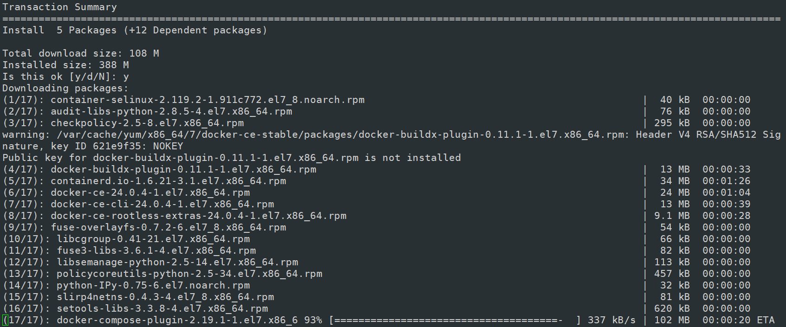
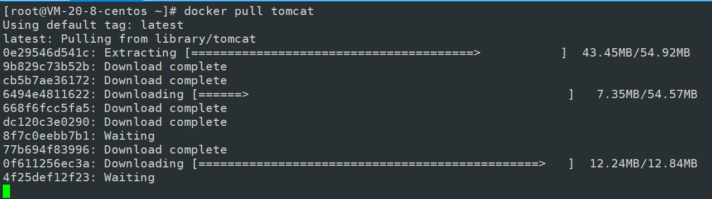

# 第一章 Docker简介

## 1.1. 概述


**解决了运行环境和配置问题的软件容器，方便做持续集成并有助于整体发布的容器虚拟化技术。**

## 1.2. 和虚拟机的对比


虚拟机的缺点：
1    资源占用多               2    冗余步骤多                 3    启动慢


**Docker容器是在操作系统层面上实现虚拟化，直接复用本地主机的操作系统，而传统虚拟机则是在硬件层面实现虚拟化。与传统的虚拟机相比，Docker优势体现为启动速度快、占用体积小。**


## 1.3. 优点和下载

更快速的应用交付和部署

传统的应用开发完成后，需要提供一堆安装程序和配置说明文档，安装部署后需根据配置文档进行繁杂的配置才能正常运行。Docker化之后只需要交付少量容器镜像文件，在正式生产环境加载镜像并运行即可，应用安装配置在镜像里已经内置好，大大节省部署配置和测试验证时间。

更便捷的升级和扩缩容

随着微服务架构和Docker的发展，大量的应用会通过微服务方式架构，应用的开发构建将变成搭乐高积木一样，每个Docker容器将变成一块“积木”，应用的升级将变得非常容易。当现有的容器不足以支撑业务处理时，可通过镜像运行新的容器进行快速扩容，使应用系统的扩容从原先的天级变成分钟级甚至秒级。

更简单的系统运维

应用容器化运行后，生产环境运行的应用可与开发、测试环境的应用高度一致，容器会将应用程序相关的环境和状态完全封装起来，不会因为底层基础架构和操作系统的不一致性给应用带来影响，产生新的BUG。当出现程序异常时，也可以通过测试环境的相同容器进行快速定位和修复。

更高效的计算资源利用

Docker是内核级虚拟化，其不像传统的虚拟化技术一样需要额外的Hypervisor支持，所以在一台物理机上可以运行很多个容器实例，可大大提升物理服务器的CPU和内存的利用率。

docker官网：http://www.docker.com

Docker Hub官网: https://hub.docker.com/

# 第二章 Docker安装


## 2.1. Docker的基本组成

### 2.1.1. 镜像(image)


### 2.1.2. 容器(container)


### 2.1.3. 仓库(repository)


### 2.1.4. 小总结


## 2.2. Docker平台架构图解(架构版)

首次懵逼正常，后续深入，先有大概轮廓，混个眼熟

整体架构及底层通信原理简述

Docker是一个CIS模式的架构，后端是一个松耦合架构，众多模块各司其职。Docker运行的基本流程为:

1. 用户是使用Docker Client与Docker Daemon建立通信，并发送请求给后者。

2. Docker Daemon作为Docker架构中的主体部分，首先提供Docker Server的功能使其可以接受Docker Client的请求。

3. Docker Engine执行Docker内部的一系列工作，每一项工作都是以一个Job的形式的存在。

4. Job的运行过程中，当需要容器镜像时，则从 Docker Registry 中下载镜像，并通过镜像管理驱动Graph driver将下载镜像以Graph的形式存储。

5. 当需要为Docker创建网络环境时，通过网络管理驱动Network driver创建并配置Docker容器网络环境。

6. 当需要限制Docker容器运行资源或执行用户指令等操作时，则通过Exec driver来完成。

7. Libcontainer是一项独立的容器管理包，Network driver以及Exec driver都是通过Libcontainer来实现具体对容器进行的操作。


## 2.2. 安装步骤

CentOS7安装Docker      https://docs.docker.com/engine/install/centos/

### 2.2.1. 确定你是CentOS7及以上版本

```sh
cat /etc/redhat-release
```

### 2.2.2. 卸载旧版本


### 2.2.3. yum安装gcc相关

```sh
yum -y install gcc
```

```sh
yum -y install gcc-c++
```

### 2.2.4. 安装需要的软件包


执行命令

```sh
yum install -y yum-utils
```

### 2.2.5. 设置stable镜像仓库

#### 1. 大坑

```sh
yum-config-manager --add-repo https://download.docker.com/linux/centos/docker-ce.repo
```


#### 2. 推荐

```sh
yum-config-manager --add-repo http://mirrors.aliyun.com/docker-ce/linux/centos/docker-ce.repo
```


### 2.2.6. 更新yum软件包索引

**这里官网没有，但是强烈建议更新一下索引，后续会经常使用yum进行安装操作**

```sh
yum makecache fast
```

### 2.2.7. 安装DOCKER CE

最新版

```sh
yum install docker-ce docker-ce-cli containerd.io docker-buildx-plugin docker-compose-plugin
```

旧版

```sh
yum -y install docker-ce docker-ce-cli containerd.io
```




### 2.2.8. 启动docker

```sh
systemctl start docker
```

### 2.2.9. 测试

查看版本

```sh
docker version
```


运行helloworld

```sh
docker run hello-world
```

### 2.2.10. 卸载

```sh
systemctl stop docker 
```

```sh
yum remove docker-ce docker-ce-cli containerd.io docker-buildx-plugin docker-compose-plugin docker-ce-rootless-extras
```

```sh
rm -rf /var/lib/docker
```

```sh
rm -rf /var/lib/containerd
```

## 2.3. 阿里云镜像加速

https://promotion.aliyun.com/ntms/act/kubernetes.html


粘贴脚本直接执行

**或者分部操作**

```sh
mkdir -p /etc/docker
```

```sh
vim  /etc/docker/daemon.json
```

```sh
 #阿里云
{
  "registry-mirrors": ["https://｛自已的编码｝.mirror.aliyuncs.com"]
}
```

```sh
systemctl daemon-reload
```

```sh
systemctl restart docker
```

## 2.4. 永远的HelloWorld

启动Docker后台容器(测试运行 hello-world)

```sh
docker run hello-world
```


## 2.5. 底层原理【为什么Docker会比VM虚拟机快】

(1)**docker有着比虚拟机更少的抽象层**

   由于docker不需要Hypervisor(虚拟机)实现硬件资源虚拟化,运行在docker容器上的程序直接使用的都是实际物理机的硬件资源。因此在CPU、内存利用率上docker将会在效率上有明显优势。

(2)**docker利用的是宿主机的内核,而不需要加载操作系统OS内核**

   当新建一个容器时,docker不需要和虚拟机一样重新加载一个操作系统内核。进而避免引寻、加载操作系统内核返回等比较费时费资源的过程,当新建一个虚拟机时,虚拟机软件需要加载OS,返回新建过程是分钟级别的。而docker由于直接利用宿主机的操作系统,则省略了返回过程,因此新建一个docker容器只需要几秒钟。


# 第三章 Docker常用命令

## 3.1. 帮助启动类命令

启动 重启 状态 开启启动 【就还是systemctl那一套，我就不多赘述了 不会说明你linux命令没学好】

```sh
systemctl start docker
```

查看docker概要信息

```sh
docker info
```

查看docker总体帮助文档

```sh
docker --help
```

查看docker命令帮助文档

```sh
docker 具体命令 --help
```

## 3.2. 镜像命令

### 3.2.1. 查看本地镜像

其实很多命令雷同`linux`，都是

```sh
docker image [OPTION]
```

等同于 `docker image ls`

```sh
docker images
```


**`-a` :列出本地所有的镜像（含历史映像层）**

**`-q` :只显示镜像ID。**

### 3.2.2. 搜索镜像

```sh
docker search [OPTIONS] 镜像名字
```

网站  https://hub.docker.com


**OPTIONS说明：**

**`--limit` : 只列出N个镜像，默认25个**

```sh
docker search --limit 5 redis
```

### 3.2.3. 拉取镜像

```sh
docker pull 镜像名字[:TAG]
```

没有TAG就是最新版

等价于

**`docker pull` 镜像名字:`latest`**

```sh
docker pull ubuntu
```


### 3.2.4. 查看镜像/容器/数据卷所占的空间

```sh
docker system df 
```

### 3.2.5. 删除镜像

```sh
docker rmi 某个XXX镜像名字ID
```

**删除单个**

```sh
docker rmi -f 镜像ID
```

**删除多个**

```sh
docker rmi -f 镜像名1:TAG 镜像名2:TAG 
```

**删除全部**

```sh
docker rmi -f $(docker images -qa)
```

**面试题：谈谈docker虚悬镜像是什么？**

仓库名、标签都是<none>的镜像，俗称虚悬镜像dangling image


**后续`Dockerfile`章节再介绍**

## 3.3. 容器命令

有镜像才能创建容器，这是根本前提(下载一个CentOS或者ubuntu镜像演示)


```sh
docker pull centos
```

```sh
docker pull ubuntu
```

本次演示用ubuntu演示

### 3.3.1. 新建+启动容器

```sh
docker run [OPTIONS] IMAGE [COMMAND] [ARG...]
```


**目前新版的应该是不需要/bin/bash 也可以了**

```sh
docker run -it ubuntu /bin/bash
```

解释：使用镜像`ubuntu:latest`以交互模式启动一个容器，并在容器内部执行 `/bin/bash`命令

在使用Docker启动容器时，通常需要指定一个命令来运行容器中的应用程序。如果未指定命令，则Docker将使用容器映像中的默认命令来运行容器。在某些情况下，这可能不是您想要的结果。

/bin/bash是一种常用的shell，它提供了一个交互式的命令行界面，允许用户在容器中执行命令和操作。当您在Docker容器中指定/bin/bash时，您实际上是在告诉Docker在容器启动时启动一个交互式shell，以便您可以在其中运行命令和操作。

/bin/bash的另一个作用是在容器中运行多个命令。如果您指定多个命令，则Docker将按顺序运行这些命令。例如，您可以使用以下命令将容器启动为交互式shell，并运行多个命令：

```sh
docker run -it myimage /bin/bash -c "echo 'Hello World!' && ls -la"
```

这将启动一个交互式shell，并在其中运行两个命令：echo 'Hello World!' 和 ls -la

如果要退出终端，输入

```sh
exit
```

### 3.3.2. 列出当前所有正在运行的容器

```sh
docker ps [OPTIONS]
```


**这里测试过，删了的容器没法显示，但查历史容器还能查到**

**这里是ps把启动命令等信息过滤的操作 可以清晰显示 ：**https://liyangweb.com/service/339.html

### 3.3.3. 退出容器

**两种退出方式**

#### 1. exit

**`run`进去容器，`exit`退出，容器停止**

#### 2. ctrl+p+q

**`run`进去容器，`ctrl+p+q`退出，容器不停止**

### 3.3.4. 启动已停止运行的容器

```sh
docker start 【容器ID或者容器名】
```

### 3.3.5. 重启容器

```sh
docker restart 【容器ID或者容器名】
```

### 3.3.6. 停止容器

```sh
docker stop 容器ID或者容器名
```

### 3.3.7. 强制停止容器

```sh
docker kill 容器ID或容器名
```

### 3.3.8. 删除已停止的容器

```sh
docker rm 容器ID
```

**一次性删除多个容器实例**

```sh
docker rm -f $(docker ps -a -q)
```

```sh
docker ps -a -q | xargs docker rm
```

### 3.3.9. 重要

有镜像才能创建容器，这是根本前提(下载一个Redis6.0.8镜像演示)

#### 1. 启动守护式容器(后台服务器)

在大部分的场景下，我们希望 docker 的服务是在后台运行的，我们可以过 -d 指定容器的后台运行模式。

```sh
docker run -d 【容器名】
```


**redis 前后台启动演示case**

**前台交互式启动**

```sh
docker run -it redis:6.0.8
```

**后台守护式启动**

```sh
docker run -d redis:6.0.8
```

**因为redis自带前台守护进程，所以它是可以做到直接使用后台守护式启动的**

#### 2. 查看容器日志

```sh
docker logs 【容器ID】
```

#### 3. 查看容器内运行的进程

```sh
docker top 【容器ID】
```

#### 4. 查看容器内部细节

```sh
docker inspect 【容器ID】
```

#### 5. 进入正在运行的容器并以命令行交互

**进入，必须这个容器是活着的，要使用exit那么exec就不行了，你得start之后才能exec**

```sh
docker exec -it 【容器ID】 bashShell
```

**重新进入**

```sh
docker attach 【容器ID】
```

**上述两个区别**

- **attach 直接进入容器启动命令的终端，不会启动新的进程，用exit退出，会导致容器的停止。**

- **exec 是在容器中打开新的终端，并且可以启动新的进程，用exit退出，不会导致容器的停止。**

- **推荐大家使用 docker exec 命令，因为退出容器终端，不会导致容器的停止。**

**用之前的redis容器实例进入试试**

**进入redis服务**

```sh
docker exec -it 【容器ID】 /bin/bash
```

```sh
docker exec -it 容器ID redis-cli
```

- **一般用-d后台启动的程序，再用exec进入对应容器实例**

#### 6. 从容器内拷贝文件到主机上

**容器→主机**

```shell
docker cp  【容器ID】:【容器内路径】 【目的主机路径】
```

#### 7. 导入和导出容器

```sh
export 导出容器的内容留作为一个tar归档文件[对应import命令]
```

```sh
import 从tar包中的内容创建一个新的文件系统再导入为镜像[对应export]
```

**案例**

```sh
docker export 容器ID > 文件名.tar
```

```sh
cat 文件名.tar | docker import - 镜像用户/镜像名:镜像版本号
```


## 3.4. 小总结


```sh
attach    Attach to a running container                 
# 当前 shell 下 attach 连接指定运行镜像
build     Build an image from a Dockerfile              
# 通过 Dockerfile 定制镜像
commit    Create a new image from a container changes   
# 提交当前容器为新的镜像
cp        Copy files/folders from the containers filesystem to the host path   
#从容器中拷贝指定文件或者目录到宿主机中
create    Create a new container                        
# 创建一个新的容器，同 run，但不启动容器
diff      Inspect changes on a container's filesystem   
# 查看 docker 容器变化
events    Get real time events from the server          
# 从 docker 服务获取容器实时事件
exec      Run a command in an existing container        
# 在已存在的容器上运行命令
export    Stream the contents of a container as a tar archive   
# 导出容器的内容流作为一个 tar 归档文件[对应 import ]
history   Show the history of an image                  
# 展示一个镜像形成历史
images    List images                                   
# 列出系统当前镜像
import    Create a new filesystem image from the contents of a tarball 
# 从tar包中的内容创建一个新的文件系统映像[对应export]
info      Display system-wide information               
# 显示系统相关信息
inspect   Return low-level information on a container   
# 查看容器详细信息
kill      Kill a running container                      
# kill 指定 docker 容器
load      Load an image from a tar archive              
# 从一个 tar 包中加载一个镜像[对应 save]
login     Register or Login to the docker registry server    
# 注册或者登陆一个 docker 源服务器
logout    Log out from a Docker registry server          
# 从当前 Docker registry 退出
logs      Fetch the logs of a container                 
# 输出当前容器日志信息
port      Lookup the public-facing port which is NAT-ed to PRIVATE_PORT    
# 查看映射端口对应的容器内部源端口
pause     Pause all processes within a container        
# 暂停容器
ps        List containers                               
# 列出容器列表
pull      Pull an image or a repository from the docker registry server   
# 从docker镜像源服务器拉取指定镜像或者库镜像
push      Push an image or a repository to the docker registry server    
# 推送指定镜像或者库镜像至docker源服务器
restart   Restart a running container                   
# 重启运行的容器
rm        Remove one or more containers                 
# 移除一个或者多个容器
rmi       Remove one or more images       
# 移除一个或多个镜像[无容器使用该镜像才可删除，否则需删除相关容器才可继续或 -f 强制删除]
run       Run a command in a new container              
# 创建一个新的容器并运行一个命令
save      Save an image to a tar archive                
# 保存一个镜像为一个 tar 包[对应 load]
search    Search for an image on the Docker Hub         
# 在 docker hub 中搜索镜像
start     Start a stopped containers                    
# 启动容器
stop      Stop a running containers                     
# 停止容器
tag       Tag an image into a repository                
# 给源中镜像打标签
top       Lookup the running processes of a container   
# 查看容器中运行的进程信息
unpause   Unpause a paused container                    
# 取消暂停容器
version   Show the docker version information           
# 查看 docker 版本号
wait      Block until a container stops, then print its exit code   
# 截取容器停止时的退出状态值
```

# 第四章 Docker镜像

## 4.1. 是什么

### 4.1.1. 镜像

是一种轻量级、可执行的独立软件包，它包含运行某个软件所需的所有内容，我们把应用程序和配置依赖打包好形成一个可交付的运行环境(包括代码、运行时需要的库、环境变量和配置文件等)，这个打包好的运行环境就是image镜像文件。

只有通过这个镜像文件才能生成Docker容器实例(类似Java中new出来一个对象)。

### 4.1.2. 分层的镜像

以我们的pull为例，在下载的过程中我们可以看到docker的镜像好像是在一层一层的在下载



### 4.1.3. Docker镜像加载原理


### 4.1.4. 为什么 Docker 镜像要采用这种分层结构呢

镜像分层最大的一个好处就是共享资源，方便复制迁移，就是为了复用。

比如说有多个镜像都从相同的 base 镜像构建而来，那么 Docker Host 只需在磁盘上保存一份 base 镜像；
同时内存中也只需加载一份 base 镜像，就可以为所有容器服务了。而且镜像的每一层都可以被共享。

## 4.2. 重点理解

**Docker镜像层都是只读的，容器层是可写的**
**当容器启动时，一个新的可写层被加载到镜像的顶部。**
**这一层通常被称作“容器层”，“容器层”之下的都叫“镜像层”。**

**当容器启动时，一个新的可写层被加载到镜像的顶部。这一层通常被称作“容器层”，“容器层”之下的都叫“镜像层”。**
**所有对容器的改动 - 无论添加、删除、还是修改文件都只会发生在容器层中。只有容器层是可写的，容器层下面的所有镜像层都是只读的。**


## 4.3. Docker镜像commit操作案例

docker commit提交容器副本使之成为一个新的镜像

```sh
docker commit -m="提交的描述信息" -a="作者" 【容器ID】 【要创建的目标镜像名】:【标签名】
```

原始的默认Ubuntu镜像是不带着vim命令的，案例演示ubuntu安装vim

docker容器内执行上述两条命令：

```sh
apt-get update
```

```sh
apt-get -y install vim
```

安装完成后，commit我们自己的新镜像

```sh
docker commit -m="add vim cmd" -a="fanxy" 【容器id】 fanxy/ubuntu:1.1
```

启动我们的新镜像并和原来的对比

```sh
docker run -it 【新建的镜像的镜像id】
```

官网是默认下载的Ubuntu没有vim命令

我们自己commit构建的镜像，新增加了vim功能，可以成功使用。

## 4.4. 小总结

Docker中的镜像分层，支持通过扩展现有镜像，创建新的镜像。类似Java继承于一个Base基础类，自己再按需扩展。
新镜像是从 base 镜像一层一层叠加生成的。每安装一个软件，就在现有镜像的基础上增加一层


# 第五章 本地镜像发布到阿里云

## 5.1. 本地镜像发布到阿里云流程

阿里云ECS Docker生态如下图所示


## 5.2. 镜像的生成方法

基于当前容器创建一个新的镜像，新功能增强

```sh
docker commit [OPTIONS] 容器ID [REPOSITORY[:TAG]]
```

后面的DockerFile章节，第2种方法

## 5.3. 将本地镜像推送到阿里云

https://promotion.aliyun.com/ntms/act/kubernetes.html

**选择控制台，进入容器镜像服务，然后选择个人实例**

**

**命名空间**


**镜像仓库**


**创建仓库**


**可以点击管理进行管理设置**


**将镜像推送到阿里云registry**

 

**这里用户名填写阿里云的账号，密码就是登录的密码，而镜像id填写自动生成的即可，版本号自定义。**

```sh
docker login --username=thefanxy registry.cn-hangzhou.aliyuncs.com
```

```sh
docker tag [ImageId] registry.cn-hangzhou.aliyuncs.com/fanxy/fanxy_repository:[镜像版本号]
```

```sh
docker push registry.cn-hangzhou.aliyuncs.com/fanxy/fanxy_repository:[镜像版本号]
```


## 5.4. 将阿里云上的镜像下载到本地

这里其实能看出来，对应仓库名字，其实应该是一个镜像的名字，可以迭代版本，叫fanxy_repository不太合适

```sh
docker pull registry.cn-hangzhou.aliyuncs.com/thefanxy/fanxy_repository:[镜像版本号]
```

# 第六章 本地镜像发布到私有库

## 6.1. 本地镜像发布到私有库流程


1 官方Docker Hub地址：https://hub.docker.com/，中国大陆访问太慢了且准备被阿里云取代的趋势，不太主流。

2 Dockerhub、阿里云这样的公共镜像仓库可能不太方便，涉及机密的公司不可能提供镜像给公网，所以需要创建一个本地私人仓库供给团队使用，基于公司内部项目构建镜像。

Docker Registry是官方提供的工具，可以用于构建私有镜像仓库

## 6.2. 将本地镜像推送到私有库

### 6.2.1. 下载镜像Docker Registry

```sh
docker pull registry 
```

### 6.2.2. 运行私有库Registry，相当于本地有个私有Docker hub

```sh
docker run -d -p 5000:5000  -v /fanxyuse/myregistry/:/tmp/registry --privileged=true registry
```

### 6.2.3. 案例演示创建一个新镜像，ubuntu安装ifconfig命令

从Hub上下载ubuntu镜像到本地并成功运行，原始的Ubuntu镜像是不带着ifconfig命令的，然后试着从本地镜像下载相关命令

```sh
apt-get update
```

```sh
apt-get install net-tools
```

安装完成后，commit我们自己的新镜像

公式：

```sh
docker commit -m="提交的描述信息" -a="作者" 容器ID 要创建的目标镜像名:[标签名]
```

命令：在容器外执行，记得启动我们的新镜像并和原来的对比

```sh
docker commit -m="ifconfig cmd add" -a="fanxy" a69d7c825c4f fanxy/ubuntu:1.0
```

### 6.2.4. curl验证私服库上有什么镜像

空仓库

```sh
 curl -XGET http://localhost:5000/v2/_catalog
```


### 6.2.5. 将新镜像fanxy/ubuntu:1.0修改符合私服规范的Tag

按照公式： 

```sh
docker   tag   镜像:Tag   Host:Port/Repository:Tag
```

**自己host主机IP地址，填写同学你们自己的，不要粘贴错误，O(∩_∩)O，这里就不再提醒了，我是在我的腾讯云服务器上部署运行的，用的是公网ip，操作完全相同，同时自己的windows虚拟机也可以从对应的地方获取镜像**

使用命令 docker tag 将fanxy/ubuntu:1.0 这个镜像修改为192.168.111.162:5000/fanxy/ubuntu:1.0

```sh
docker tag  fanxy/ubuntu:1.0  192.168.110.100:5000/fanxy/ubuntu:1.0
```

### 6.2.6. 修改配置文件使之支持http

这里ip填写主机，即部署了docker 注册中心的机器的ip

```sh
"insecure-registries": ["192.168.111.162:5000"]
```


上述理由：docker默认不允许http方式推送镜像，通过配置选项来取消这个限制。====> 修改完后如果不生效，建议重启docker

**20.10.9版本默认允许http推送。不用改配置**

### 6.2.7. push推送到私服库

```sh
docker push 192.168.111.162:5000/fanxy/ubuntu:1.0
```

### 6.2.8. curl验证私服库上有什么镜像2

```sh
curl -XGET http://192.168.111.162:5000/v2/_catalog
```


### 6.2.9. pull到本地并运行

**自己host主机IP地址，填写同学你们自己的，不要粘贴错误，O(∩_∩)O，这里就不再提醒了，我是在我的腾讯云服务器上部署运行的，用的是公网ip，操作完全相同，同时自己的windows虚拟机也可以从对应的地方获取镜像，当然千万别忘了给自己虚拟机下载端也配置http允许的配置，ip填要下载的那端的ip**

```sh
docker pull 192.168.111.162:5000/fanxy/ubuntu:1.0
```

```sh
docker run -it 镜像ID /bin/bash
```


# 第七章 Docker容器数据卷

## 7.1. 坑：容器卷记得加入

```sh
--privileged=true
```


## 7.2. 是什么

上一章我们使用了这个命令，带有 `-v`的参数

```sh
docker run -d -p 5000:5000  -v /fanxyuse/myregistry/:/tmp/registry --privileged=true registry
```

一句话：有点类似我们Redis里面的rdb和aof文件，将docker容器内的数据保存进宿主机的磁盘中，运行一个带有容器卷存储功能的容器实例

```sh
 docker run -it --privileged=true -v /宿主机绝对路径目录:/容器内目录      镜像名
```

## 7.3. 能干嘛

*  将运用与运行的环境打包镜像，run后形成容器实例运行 ，但是我们对数据的要求希望是持久化的

Docker容器产生的数据，如果不备份，那么当容器实例删除后，容器内的数据自然也就没有了。
为了能保存数据在docker中我们使用卷。

特点：
1：数据卷可在容器之间共享或重用数据
2：卷中的更改可以直接实时生效，爽
3：数据卷中的更改不会包含在镜像的更新中
4：数据卷的生命周期一直持续到没有容器使用它为止

## 7.4. 数据卷案例

### 7.4.1. 宿主vs容器之间映射添加容器卷

直接命令添加【公式】：

```sh
docker run -it -v /宿主机目录:/容器内目录 ubuntu /bin/bash
```

查看数据卷是否挂载成功

```sh
docker inspect 容器ID
```


容器和宿主机之间数据共享

1  docker修改，主机同步获得 
2 主机修改，docker同步获得
3 docker容器stop，主机修改，docker容器重启看数据是否同步。

### 7.4.2. 读写规则映射添加说明

**读写是默认的**


```sh
 docker run -it --privileged=true -v /宿主机绝对路径目录:/容器内目录:rw      镜像名
```

**默认同上案例，默认就是rw**

**只读**

**容器实例内部被限制，只能读取不能写**

```sh
 docker run -it --privileged=true -v /宿主机绝对路径目录:/容器内目录:ro      镜像名
```


### 7.4.3. 卷的继承和共享

**容器1完成和宿主机的映射**

```sh
docker run -it  --privileged=true -v /mydocker/u:/tmp --name u1 ubuntu
```

****

**容器2继承容器1的卷规则**

```sh
docker run -it  --privileged=true --volumes-from 父类  --name u2 ubuntu
```


这里我补充一下啊，我发现哪怕删了容器，删了数据卷的文件夹，它还是占空间，可能和硬链接有关，磁盘这块空间没有得到释放，查了一下可以通过下面的命令删除全部的数据卷，慎用，确定备份，或者是确认可以删除使用。

```sh
docker volume rm $(docker volume ls -q)
```

# 第八章 Docker常规软件安装

## 8.1. 总体步骤

- 搜索镜像
- 拉取镜像
- 查看镜像
- 启动镜像【端口映射/数据卷挂载】
- 停止容器
- 移除容器

## 8.2. 安装Tomcat

### 8.2.1. docker hub上面查找tomcat镜像

```sh
docker search tomcat
```

### 8.2.2. 从docker hub上拉取tomcat镜像到本地

```sh
docker pull tomcat
```

### 8.2.3. docker images查看是否有拉取到的tomcat

```sh
docker images
```

### 8.2.4. 使用tomcat镜像创建容器实例(也叫运行镜像)

```sh
docker run -it -p 8080:8080 tomcat
```

-p 小写，主机端口:docker容器端口

-P 大写，随机分配端口

### 8.2.5. 访问猫首页

404 not found

解决

**1. 可能没有映射端口或者没有关闭防火墙**

**2. 把webapps.dist目录换成webapps**

- 先成功启动tomcat
- 查看webapps 文件夹查看为空


### 8.2.6. 原因：新版本更改了目录

其实我们用不到那么新的版本，目前我们只需要使用旧版就可以了。

可以直接docker pull tomcat:8.0.52

下面这个是阳哥的版本

```sh
docker pull billygoo/tomcat8-jdk8
```

```sh
docker run -d -p 8080:8080 --name mytomcat8 billygoo/tomcat8-jdk8
```

## 8.3. 安装Mysql

### 8.3.1. 安装5.7

```sh
docker search mysql
```

从docker hub上(阿里云加速器)拉取mysql镜像到本地标签为5.7

```sh
docker pull mysql:5.7
```

### 8.3.2. 使用mysql5.7镜像创建容器(也叫运行镜像)


### 8.3.3. 简单版

使用mysql镜像，密码自己填写

```sh
docker run -p 3306:3306 -e MYSQL_ROOT_PASSWORD=123456 -d mysql:5.7
```

```sh
docker ps
```

```sh
docker exec -it 容器ID /bin/bash
```

```sh
mysql -uroot -p
```

建库建表插入数据


外部Win10也来连接运行在dokcer上的mysql容器实例服务


**<font color="bb000">问题</font>**

1. **插入中文数据，报错---->docker上默认字符集编码隐患**

**docker里面的mysql容器实例查看，内容如下：**

```sh
SHOW VARIABLES LIKE 'character%'
```

2. **删除容器后，里面的mysql数据如何办**

### 8.3.4. 实战版

1. **新建mysql容器实例，密码自己写**

```sh
docker run -d -p 3306:3306 --privileged=true -v /fanxyuse/mysql/log:/var/log/mysql -v /fanxyuse/mysql/data:/var/lib/mysql -v /fanxyuse/mysql/conf:/etc/mysql/conf.d -e MYSQL_ROOT_PASSWORD=123456  --name mysql57 mysql:8
```

2. **新建my.cnf**

**通过容器卷同步给mysql容器实例**

```sh
cd /fanxyuse/mysql/conf/
```

```sh
vim my.cnf
```

```sh
[client]
default_character_set=utf8
[mysqld]
collation_server = utf8_general_ci
character_set_server = utf8
```

3. **重新启动mysql容器实例再重新进入并查看字符编码**

```sh
docker restart mysql57
```

```sh
docker exec -it mysql57 /bin/bash
```

```sh
mysql -uroot -p
```

```sh
SHOW VARIABLES LIKE 'character%';
```

4. **再新建库新建表再插入中文测试**

```sh
create database db01;
```

```sh
use db01;
```

```sh
create table bb(id int, name varchar(20));
```

利用工具插入中文，发现正常

5. **结论**

**之前的 `DB`无效**

**修改字符集操作+重启mysql容器实例**

**之后的`DB`有效，需要新建**

**结论：docker安装完MySQL并run出容器后，建议请先修改完字符集编码后再新建mysql库-表-插数据**

**假如将当前容器实例删除，再重新来一次，之前建的db01实例还有吗？trytry**

## 8.4. 安装Redis

### 8.4.1. 基本拉取运行

```sh
docker run -d -p 6379:6379 redis:6.0.8
```

```sh
docker exec -it fa209ee820 /bin/bash
```

**运行起来可以直接通过redis基本命令操作**

```sh
redis-cli
```

**但是这个安装方式也是没有本机的挂载配置文件，故只是个基本运行的demo**

### 8.4.2. 数据卷安装

**<font color='bb000'>命令提醒：容器卷记得加入--privileged=true。</font>**

**Docker挂载主机目录Docker访问出现cannot open directory .: Permission denied**

**解决办法：在挂载目录后多加一个--privileged=true参数即可**

**<font color='bb000'>在CentOS宿主机下新建目录/fanxyuse/redis</font>**

```sh
mkdir -p /fanxyuse/redis
```

**将一个redis.conf原版配置文件模板拷贝进/fanxyuse/redis目录下**

**完整版运行命令**

```sh
docker run  -p 6379:6379 --name redis7 --privileged=true -v /fanxyuse/redis/redis.conf:/etc/redis/redis.conf -v /fanxyuse/redis/data:/data -d redis:7 redis-server /etc/redis/redis.conf
```


## 8.5. 安装Nginx【见高级篇】

