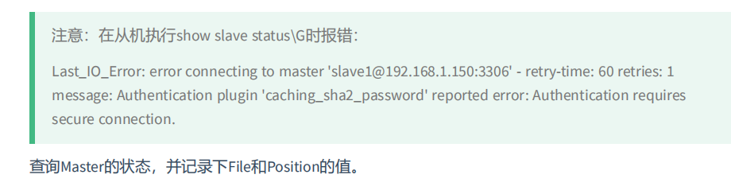
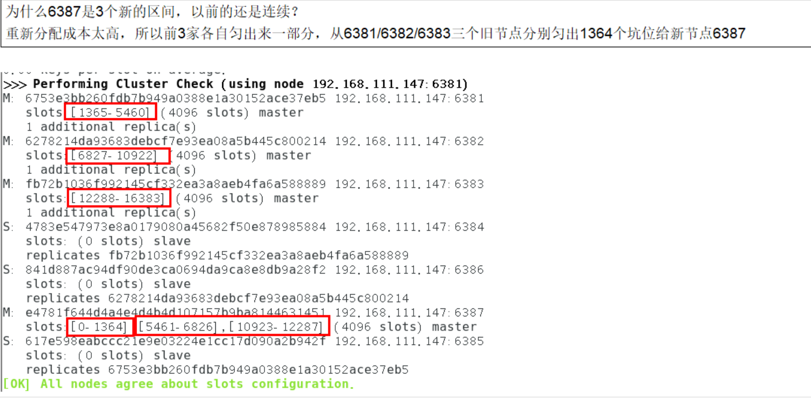
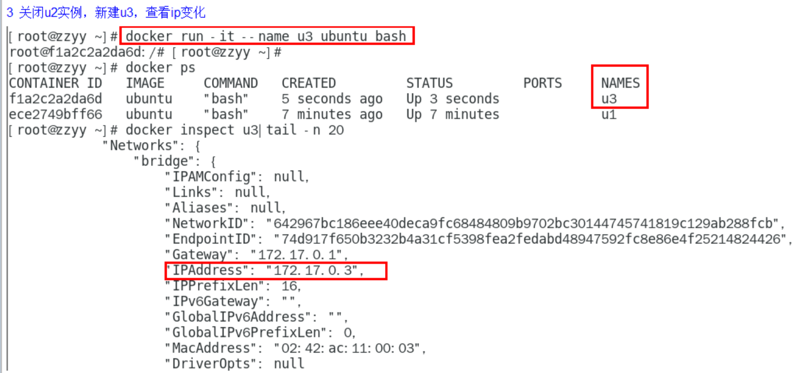
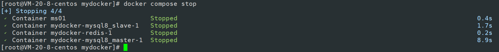

# 第一章 Docker复杂安装详说

## 1.1. 安装mysql主从复制

### 1.1.1. 新建容器实例

**这里我绑定的目录和之前的mysql不同是/fanxyuse/mysql-master**

**这里哪怕显式指明密码，其实密码都是123456，需要进去改。**

```sh
docker run -d -p 3307:3306 --privileged=true -v /fanxyuse/mysql-master/log:/var/log/mysql -v /fanxyuse/mysql-master/data:/var/lib/mysql -v /fanxyuse/mysql-master/conf:/etc/mysql/conf.d -e MYSQL_ROOT_PASSWORD=123456  --name mysql8_master mysql:8.0
```

**1.** **使用ALTER USER命令来修改当前用户密码**

```sql
ALTER USER USER() IDENTIFIED BY 'new_password';
```

**2.** **使用SET语句来修改当前用户密码**

```sql
SET PASSWORD='new_password';
```

### 1.1.2. 进入/fanxyuse/mysql-master/conf目录下新建my.cnf

```sh
vim my.cnf
```

**<font color='bb000'>配置文件行不能有空格</font>**

```ini
[mysqld]
## 设置server_id，同一局域网中需要唯一
server_id=100
## 指定不需要同步的数据库名称
binlog-ignore-db=mysql
## 开启二进制日志功能
log-bin=server-log-bin
## 设置二进制日志使用内存大小（事务)
binlog_cache_size=1M  
## 设置使用的二进制日志格式（mixed,statement,row）
binlog_format=mixed
## 二进制日志过期清理时间。默认值为0，表示不自动清理。
expire_logs_days=7
## 跳过主从复制中遇到的所有错误或指定类型的错误，避免slave端复制中断。
## 如：1062错误是指一些主键重复，1032错误是因为主从数据库数据不一致
slave_skip_errors=1062
```

### 1.1.3. 修改完配置后重启master实例

```sh
docker restart mysql8_master
```

### 1.1.4. 进入mysql-master容器

```sh
docker exec -it mysql8_master /bin/bash
```

```sh
mysql -uroot -p
```

### 1.1.5. master容器实例内创建数据同步用户

```sql
CREATE USER 'slave1'@'%' IDENTIFIED BY '123456';
```

```sql
GRANT REPLICATION SLAVE, REPLICATION CLIENT ON *.* TO 'slave1'@'%';
```

**注意：如果使用的是MySQL8，需要如下的方式建立账户，并授权slave：**

```sql
CREATE USER 'slave1'@'%' IDENTIFIED BY '123456';
GRANT REPLICATION SLAVE ON *.* TO 'slave1'@'%';
#此语句必须执行。否则见下面。
ALTER USER 'slave1'@'%' IDENTIFIED WITH mysql_native_password BY '123456';
flush privileges;
```



```sql
show master status;
```


#### 1.1.6. 新建从服务器容器实例3308

**这里我绑定的目录和之前的mysql不同是/fanxyuse/mysql-slave**

```sh
docker run -d -p 3308:3306 --privileged=true -v /fanxyuse/mysql-slave/log:/var/log/mysql -v /fanxyuse/mysql-slave/data:/var/lib/mysql -v /fanxyuse/mysql-slave/conf:/etc/mysql/conf.d -e MYSQL_ROOT_PASSWORD=123456  --name mysql8_slave mysql:8.0
```

**进入/fanxyuse/mysql-slave/conf目录下新建my.cnf**

```sh
vim: my.cnf
```

**<font color='bb000'>配置文件行不能有空格</font>**

```ini
[mysqld]
## 设置server_id，同一局域网中需要唯一
server_id=101
## 指定不需要同步的数据库名称
binlog-ignore-db=mysql
## 开启二进制日志功能，以备Slave作为其它数据库实例的Master时使用
log-bin=server-mysql-slave1-bin
## 设置二进制日志使用内存大小（事务）
binlog_cache_size=1M
## 设置使用的二进制日志格式（mixed,statement,row）
binlog_format=mixed
## 二进制日志过期清理时间。默认值为0，表示不自动清理。
expire_logs_days=7
## 跳过主从复制中遇到的所有错误或指定类型的错误，避免slave端复制中断。
## 如：1062错误是指一些主键重复，1032错误是因为主从数据库数据不一致
slave_skip_errors=1062
## relay_log配置中继日志
relay_log=server-mysql-relay-bin
## log_slave_updates表示slave将复制事件写进自己的二进制日志
log_slave_updates=1
## slave设置为只读（具有super权限的用户除外）
read_only=1
```

### 1.1.8. 修改完配置后重启slave实例

```sh
docker restart mysql8-slave
```

### 1.1.9. 在主数据库中查看主从同步状态

**此前已经写了在上面**

### 1.1.10. 进入mysql-slave容器

```sh
docker exec -it mysql8-slave /bin/bash
```

```sh
mysql -uroot -p
```

### 1.1.11. 在从数据库中配置主从复制

```sql
change master to master_host='宿主机ip', master_user='slave1', master_password='123456', master_port=3307, master_log_file='server-mysql-bin.000001', master_log_pos=617, master_connect_retry=30;
```

**`master_host`：主数据库的IP地址；**
**`master_port`：主数据库的运行端口；**
**`master_user`：在主数据库创建的用于同步数据的用户账号；**
**`master_password`：在主数据库创建的用于同步数据的用户密码；**
**`master_log_file`：指定从数据库要复制数据的日志文件，通过查看主数据的状态，获取File参数；**
**`master_log_pos`：指定从数据库从哪个位置开始复制数据，通过查看主数据的状态，获取Position参数；**
**`master_connect_retry`：连接失败重试的时间间隔，单位为秒。**


### 1.1.12. 在从数据库中查看主从同步状态

```sql
show slave status \G
```

此时发现已经完成主从同步的状态了

### 1.1.13. 主从复制测试

主机新建库-使用库-新建表-插入数据，ok

从机使用库-查看记录，ok

## 1.2. 安装redis集群

### 1.2.1. 面试题

**1~2亿条数据需要缓存，请问如何设计这个存储案例**

**单机单台100%不可能，肯定是分布式存储，用redis如何落地？**

**上述问题阿里P6~P7工程案例和场景设计类必考题目，一般业界有3种解决方案**

**1. 哈希取余分区，这里的东西redis都学过**


**2. 一致性哈希算法分区**

**一致性Hash算法背景**

**一致性哈希算法在1997年由麻省理工学院中提出的，设计目标是为了解决分布式缓存数据变动和映射问题，某个机器宕机了，分母数量改变了，自然取余数不OK了。**

**提出一致性Hash解决方案。目的是当服务器个数发生变动时，尽量减少影响客户端到服务器的映射关系**


**服务器IP节点映射**


**key落到服务器的落键规则**


**一致性哈希算法的数据倾斜问题**


**为了在节点数目发生改变时尽可能少的迁移数据**

**将所有的存储节点排列在收尾相接的Hash环上，每个key在计算Hash后会<font color='bb000'>顺时针</font>找到临近的存储节点存放。**
**而当有节点加入或退出时仅影响该节点在Hash环上<font color='bb000'>顺时针相邻的后续节点。</font>**  

**<font color='bb000'>优点</font>**
**加入和删除节点只影响哈希环中顺时针方向的相邻的节点，对其他节点无影响。**

**<font color='bb000'>缺点</font>** 
**数据的分布和节点的位置有关，因为这些节点不是均匀的分布在哈希环上的，所以数据在进行存储时达不到均匀分布的效果。**

**3. 哈希槽分区**


### 1.2.2. 配置开始

#### 1. 新建6个docker容器redis实例

```sh
docker run -d --name redis-node-1 --net host --privileged=true -v /fanxyuse/redis-cluster/redis-node-1:/data redis:7 --cluster-enabled yes --appendonly yes --port 6381
 
docker run -d --name redis-node-2 --net host --privileged=true -v /fanxyuse/redis-cluster/redis-node-2:/data redis:7 --cluster-enabled yes --appendonly yes --port 6382

docker run -d --name redis-node-3 --net host --privileged=true -v /fanxyuse/redis-cluster/redis-node-3:/data redis:7 --cluster-enabled yes --appendonly yes --port 6383
 
docker run -d --name redis-node-4 --net host --privileged=true -v /fanxyuse/redis-cluster/redis-node-4:/data redis:7 --cluster-enabled yes --appendonly yes --port 6384
 
docker run -d --name redis-node-5 --net host --privileged=true -v /fanxyuse/redis-cluster/redis-node-5:/data redis:7 --cluster-enabled yes --appendonly yes --port 6385
 
docker run -d --name redis-node-6 --net host --privileged=true -v /fanxyuse/redis-cluster/redis-node-6:/data redis:7 --cluster-enabled yes --appendonly yes --port 6386
```


#### 2. 进入容器redis-node-1并为6台机器构建集群关系

**进入容器**

```sh
docker exec -it redis-node-1 /bin/bash
```

**构建主从关系**

```sh
redis-cli --cluster create 10.0.20.8:6381 10.0.20.8:6382 10.0.20.8:6383 10.0.20.8:6384 10.0.20.8:6385 10.0.20.8:6386 --cluster-replicas 1
```

**--cluster-replicas 1 表示为每个master创建一个slave节点**


**一切OK的话，3主3从搞定**

#### 3. 链接进入6381作为切入点，查看集群状态


```sh
cluster info
```

```sh
cluster nodes
```

### 1.2.3. 主从容错切换迁移案例

```sh
cluster nodes
```


此时关系如图

```sh
M              S
6381         6385
6382         6386
6383         6384
```

**主6381和从机切换，先停止主机6381**

```sh
docker stop redis-node-1
```

**6381主机停了，对应的真实从机上位，6381作为1号主机分配的从机以实际情况为准，具体是几号机器就是几号**

**再次查看集群信息**


**此时关系如同**

```sh
M              S
6381[fali]   
6385
6382         6386
6383         6384
```

**然后测试读写仍然没问题，重新运行6381，发现主从调换**

```sh
M              S   
6385         6381
6382         6386
6383         6384
```

**redis我们学过可以通过命令重新调换主从**

```sh
cluster failover
```

**查看集群状态**

```sh
redis-cli --cluster check 自己IP:6381
```


### 1.2.4. 主从扩容案例

**新建6387、6388两个节点+新建后启动+查看是否8节点**

```sh
docker run -d --name redis-node-7 --net host --privileged=true -v /fanxyuse/redis-cluster/redis-node-7:/data redis:7 --cluster-enabled yes --appendonly yes --port 6387
 
docker run -d --name redis-node-8 --net host --privileged=true -v /fanxyuse/redis-cluster/redis-node-8:/data redis:7 --cluster-enabled yes --appendonly yes --port 6388
```

**进入6387容器实例内部**

```sh
docker exec -it redis-node-7 /bin/bash
```

**将新增的6387节点(空槽号)作为master节点加入原集群**

**将新增的6387作为master节点加入集群**

**<font color='bb000'>`redis-cli --cluster add-node 自己实际IP地址:6387 自己实际IP地址:6381`</font>**

**6387 就是将要作为master新增节点**

**6381 就是原来集群节点里面的领路人，相当于6387拜拜6381的码头从而找到组织加入集群**

```sh
redis-cli --cluster add-node 10.0.20.8:6387 10.0.20.8:6381
```

**这里只需要把6387加入，测试我发现全加入的时候6388直接是空master节点，无法成为6387的slave，把它移除重新添加才行**

```sh
redis-cli --cluster del-node localhost:6388 5d149074b7e57b802287d1797a874ed7a1a284a8
```

**检查集群情况第1次**

```sh
redis-cli --cluster check 真实ip地址:6381
```

**重新分派槽号**
**命令:<font color='bb000'>redis-cli --cluster reshard IP地址:端口号</font>**

```sh
redis-cli --cluster reshard 10.0.20.8:6381
```


**检查集群情况第2次**

```sh
redis-cli --cluster check 真实ip地址:6381
```




**为主节点6387分配从节点6388**

**<font color='bb000'>redis-cli --cluster add-node ip:新slave端口 ip:新master端口 --cluster-slave --cluster-master-id 新主机节点ID</font>**

```sh
redis-cli --cluster add-node 10.0.20.8:6388 10.0.20.8:6387 --cluster-slave --cluster-master-id 2c9e0a7009374bbf2a76849b346204306d4389e5
```

**检查集群情况第3次。完成四主四从**

```sh
redis-cli --cluster check 10.0.20.8:6383
```


### 1.2.5. 主从缩容案例

**目的：6387和6388下线**

**检查集群情况1获得6388的节点ID**

```sh
redis-cli --cluster check localhost:6382
```

**从集群中将4号从节点6388删除**

**命令：<font color="bb000">redis-cli --cluster del-node ip:从机端口 从机6388节点ID</font>**

```sh
redis-cli --cluster del-node localhost:6388 5d149074b7e57b802287d1797a874ed7a1a284a8
```


**将6387的槽号清空，重新分配，本着严谨的态度，这里我选择一个个还给他们原本的槽位，就按6387偷了它们的槽位一个个还回去**

```sh
redis-cli --cluster reshard localhost:6381
```


**检查集群情况第二次**

```sh
redis-cli --cluster check localhost:6381
```

**将6387删除**

**命令：<font color='bb000'>redis-cli --cluster del-node ip:端口 6387节点ID</font>**

```sh
redis-cli --cluster del-node localhost:6387 e4781f644d4a4e4d4b4d107157b9ba8144631451
```

**检查集群情况第三次**

```sh
redis-cli --cluster check localhost:6381
```

# 第二章 DockerFile解析

## 2.1. 是什么

**Dockerfile是用来构建Docker镜像的文本文件，是由一条条构建镜像所需的指令和参数构成的脚本。**


官网 ：https://docs.docker.com/engine/reference/builder/

**构建三步骤**

**编写Dockerfile文件  -> docker build命令构建镜像 -> docker run依镜像运行容器实例**

## 2.2. DockerFile构建过程解析

### 2.2.1. Dockerfile内容基础知识

**1：每条保留字指令都必须为<font color='bb000'>大写字母</font>且后面要跟随至少一个参数**

**2：指令按照从上到下，顺序执行**

**3：#表示注释**

**4：每条指令都会创建一个新的镜像层并对镜像进行提交**

### 2.2.2. Docker执行Dockerfile的大致流程

**（1）docker从基础镜像运行一个容器**

**（2）执行一条指令并对容器作出修改**

**（3）执行类似docker commit的操作提交一个新的镜像层**

**（4）docker再基于刚提交的镜像运行一个新容器**

**（5）执行dockerfile中的下一条指令直到所有指令都执行完成**

### 2.2.3. 小总结


**1 Dockerfile，需要定义一个Dockerfile，Dockerfile定义了进程需要的一切东西。Dockerfile涉及的内容包括执行代码或者是文件、环境变量、依赖包、运行时环境、动态链接库、操作系统的发行版、服务进程和内核进程(当应用进程需要和系统服务和内核进程打交道，这时需要考虑如何设计namespace的权限控制)等等;**

**2 Docker镜像，在用Dockerfile定义一个文件之后，docker build时会产生一个Docker镜像，当运行 Docker镜像时会真正开始提供服务;**

**3 Docker容器，容器是直接提供服务的**

## 2.3. DockerFile常用保留字指令

参考tomcat8的dockerfile入门 ： https://github.com/docker-library/tomcat

### 2.3.1. FROM

**基础镜像，当前新镜像是基于哪个镜像的，指定一个已经存在的镜像作为模板，第一条必须是from**

### 2.3.2. MAINTAINER

**镜像维护者的姓名和邮箱地址**

### 2.3.3. RUN

**容器构建时需要运行的命令 RUN是在 docker build时运行** 

**两种格式**

- **shell格式**


```sh
RUN yum -y install vim
```

- **exec格式**


### 2.3.4. EXPOSE

**当前容器对外暴露出的端口**

### 2.3.5. WORKDIR

**指定在创建容器后，终端默认登陆的进来工作目录，一个落脚点**

### 2.3.6. USER

**指定该镜像以什么样的用户去执行，如果都不指定，默认是root**

### 2.3.7. ENV

**用来在构建镜像过程中设置环境变量**

```sh
ENV MY_PATH /usr/mytest
```

**这个环境变量可以在后续的任何RUN指令中使用，这就如同在命令前面指定了环境变量前缀一样；**
**也可以在其它指令中直接使用这些环境变量，**

**比如：**

```sh
WORKDIR $MY_PATH
```

### 2.3.8. ADD

**将宿主机目录下的文件拷贝进镜像且会自动处理URL和解压tar压缩包**

### 2.3.9. COPY

**类似ADD，拷贝文件和目录到镜像中。**
**将从构建上下文目录中 <源路径> 的文件/目录复制到新的一层的镜像内的 <目标路径> 位置**

```sh
COPY src dest
```

```sh
COPY ["src", "dest"]
```

```sh
<src源路径>：源文件或者源目录
```

```sh
<dest目标路径>：容器内的指定路径，该路径不用事先建好，路径不存在的话，会自动创建。
```

### 2.3.10. VOLUME

**容器数据卷，用于数据保存和持久化工作**

### 2.3.11. CMD

**指定容器启动后的要干的事情**


**Dockerfile 中可以有多个 CMD 指令，<font color='bb000'>但只有最后一个生效，CMD 会被 docker run 之后的参数替换</font>**

**参考官网Tomcat的dockerfile演示讲解 官网最后一行命令**


**我们演示自己的覆盖操作**


**<font color='bb000'>它和前面RUN命令的区别</font>**

**<font color='bb000'>CMD是在 docker run 时运行。</font>**

**<font color='bb000'>RUN是在 docker build时运行。</font>**

### 2.3.12. ENTRYPOINT

**也是用来指定一个容器启动时要运行的命令**

**类似于 CMD 指令，<font color='bb000'>但是ENTRYPOINT不会被docker run后面的命令覆盖，而且这些命令行参数会被当作参数送给 ENTRYPOINT 指令指定的程序</font>**

**命令格式和案例说明**


**优点**

**<font color='bb000'>执行docker run的时候可以指定 ENTRYPOINT 运行所需的参数。</font>**

**注意**

**<font color='bb000'>如果 Dockerfile 中如果存在多个 ENTRYPOINT 指令，仅最后一个生效。</font>**

### 2.3.13. 小总结


## 2.4. 案例

### 2.4.1. 自定义镜像mycentosjava8

#### 1. 要求

**Centos7镜像具备vim+ifconfig+jdk8**

**JDK的下载镜像地址  https://www.oracle.com/java/technologies/downloads/#java8**

**镜像地址 ：https://mirrors.yangxingzhen.com/jdk/**

#### 2. 编写

**准备编写Dockerfile文件**


**大写字母D**

```dockerfile
FROM centos:7
MAINTAINER Fanxy<wfanxy@qq.com>
 
ENV MYPATH /usr/local
WORKDIR $MYPATH
 
#安装vim编辑器
RUN yum -y install vim
#安装ifconfig命令查看网络IP
RUN yum -y install net-tools
#安装java8及lib库
RUN yum -y install glibc.i686
RUN mkdir /usr/local/java
#ADD 是相对路径jar,把jdk-8u381-linux-x64.tar.gz添加到容器中,安装包必须要和Dockerfile文件在同一位置
ADD jdk-8u381-linux-x64.tar.gz /usr/local/java/
#配置java环境变量
ENV JAVA_HOME /usr/local/java/jdk1.8.0_381
ENV JRE_HOME $JAVA_HOME/jre
ENV CLASSPATH $JAVA_HOME/lib/dt.jar:$JAVA_HOME/lib/tools.jar:$JRE_HOME/lib:$CLASSPATH
ENV PATH $JAVA_HOME/bin:$PATH
 
EXPOSE 80
 
CMD echo $MYPATH
CMD echo "success--------------ok"
CMD /bin/bash
```

#### 3. 构建 【注意：TAG后面有个空格，有个点】

**docker build -t 新镜像名字:TAG .**

```sh
docker build -t centosjava8:1.0 .
```

#### 4. 运行

**docker run -it 新镜像名字:TAG** 

```sh
docker run -it centosjava8:1.0 /bin/bash
```


#### 5. 再体会下UnionFS（联合文件系统）


### 2.4.2. 虚悬镜像

#### 1. 是什么

**仓库名、标签都是`<none>`的镜像，俗称dangling image**

**Dockerfile写一个**

```sh
vim Dockerfile
```

```dockerfile
from ubuntu
CMD echo 'action is success'
```

```sh
docker build .
```


#### 2. 查看

```sh
docker image ls -f dangling=true
```

**命令结果**


#### 3. 删除

```sh
docker image prune
```


### 2.4.3. 家庭作业-自定义镜像myubuntu

#### 1. 编写

准备编写DockerFile文件

```sh
FROM ubuntu
MAINTAINER fanxy<fanxy@www.com>
 
ENV MYPATH /usr/local
WORKDIR $MYPATH
 
RUN apt-get update
RUN apt-get install net-tools
#RUN apt-get install -y iproute2
#RUN apt-get install -y inetutils-ping
 
EXPOSE 80
 
CMD echo $MYPATH
CMD echo "install inconfig cmd into ubuntu success--------------ok"
CMD /bin/bash
```

#### 2. 构建

**docker build -t 新镜像名字:TAG .**

#### 3. 运行

**docker run -it 新镜像名字:TAG** 

## 2.5. 小总结


# 第三章 Docker微服务实战


**这里把端口改为 6001**

**把文件放入这个文件夹**

```sh
docker-boot-0.0.1-SNAPSHOT.jar
```

```sh
mkdir mydocker
```

**编写Dockerfile**

```dockerfile
# 基础镜像使用java
FROM java:8
# 作者
MAINTAINER fanxy
# VOLUME 指定临时文件目录为/tmp，在主机/var/lib/docker目录下创建了一个临时文件并链接到容器的/tmp
VOLUME /tmp
# 将jar包添加到容器中并更名为zzyy_docker.jar
ADD docker-boot-0.0.1-SNAPSHOT fanxy_docker.jar
# 运行jar包
RUN bash -c 'touch /fanxy_docker.jar'
ENTRYPOINT ["java","-jar","/fanxy_docker.jar"]
#暴露6001端口作为微服务
EXPOSE 6001
```

**将微服务jar包和Dockerfile文件上传到同一个目录下/mydocker**

**构建镜像 打包成镜像文件**

```sh
docker build -t fanxy_docker:1.0 .
```

**运行容器**

```sh
docker run -d -p 6001:6001 --name fanxt_docker_demo fanxy_docker:1.0
```

**测试是否运行成功**

```sh
curl 127.0.0.1:6001/order/docker
curl 127.0.0.1:6001/order/index
```

**访问测试**


# 第四章 Docker网络

## 4.1. 是什么

### 4.1.1. docker不启动，默认网络情况

```sh
ens33 lo virbr0
```


**在CentOS7的安装过程中如果有选择相关虚拟化的的服务安装系统后，启动网卡时会发现有一个以网桥连接的私网地址的virbr0网卡(virbr0网卡：它还有一个固定的默认IP地址192.168.122.1)，是做虚拟机网桥的使用的，其作用是为连接其上的虚机网卡提供 NAT访问外网的功能。**

**我们之前学习Linux安装，勾选安装系统的时候附带了libvirt服务才会生成的一个东西，如果不需要可以直接将libvirtd服务卸载**

```sh
yum remove libvirt-libs.x86_64
```

### 4.1.2. docker启动后，网络情况


**查看docker网络模式命令**


## 4.2. 常用基本命令


**查看网络**

```sh
docker network ls
```

**查看网络源数据**

```sh
docker network inspect 【xxx网络名称】
```

**删除网络**

```sh
docker network rm 【XXX网络名字】
```

**案例**


## 4.3. 能干嘛

**容器间的互联和通信以及端口映射**

**容器IP变动时候可以通过服务名直接网络通信而不受到影响**

## 4.4. 网络模式

### 4.4.1. 总体介绍


```java
bridge模式：使用--network  bridge指定，默认使用docker0
```

```java
host模式：使用--network host指定
```

```java
none模式：使用--network none指定
```

```java
container模式：使用--network container:NAME或者容器ID指定
```

### 4.4.2. 容器实例内默认网络IP生产规则




**结论**

**docker容器内部的ip是有可能会发生改变的**

### 4.4.3. 案例说明

#### 1. bridge


**1 Docker使用Linux桥接，在宿主机虚拟一个Docker容器网桥(docker0)，Docker启动一个容器时会根据Docker网桥的网段分配给容器一个IP地址，称为Container-IP，同时Docker网桥是每个容器的默认网关。因为在同一宿主机内的容器都接入同一个网桥，这样容器之间就能够通过容器的Container-IP直接通信。**

**2 docker run 的时候，没有指定network的话默认使用的网桥模式就是bridge，使用的就是docker0。在宿主机ifconfig,就可以看到docker0和自己create的network(后面讲)eth0，eth1，eth2……代表网卡一，网卡二，网卡三……，lo代表127.0.0.1，即localhost，inet addr用来表示网卡的IP地址**

**3 网桥docker0创建一对对等虚拟设备接口一个叫veth，另一个叫eth0，成对匹配。**
   **3.1 整个宿主机的网桥模式都是docker0，类似一个交换机有一堆接口，每个接口叫veth，在本地主机和容器内分别创建一个虚拟接口，并让他们彼此联通（这样一对接口叫veth pair）；**
   **3.2 每个容器实例内部也有一块网卡，每个接口叫eth0；**
   **3.3 docker0上面的每个veth匹配某个容器实例内部的eth0，两两配对，一一匹配。**
 **通过上述，将宿主机上的所有容器都连接到这个内部网络上，两个容器在同一个网络下,会从这个网关下各自拿到分配的ip，此时两个容器的网络是互通的。**


**代码**

```sh
docker run -d -p 8081:8080   --name tomcat81 billygoo/tomcat8-jdk8
```

```sh
docker run -d -p 8082:8080   --name tomcat82 billygoo/tomcat8-jdk8
```

**两两匹配验证**


#### 2. host

**直接使用宿主机的 IP 地址与外界进行通信，不再需要额外进行NAT 转换。**

**案例**


**代码**

**警告**

```sh
docker run -d -p 8083:8080 --network host --name tomcat83 billygoo/tomcat8-jdk8
```


**正确**

```sh
docker run -d --network host --name tomcat83 billygoo/tomcat8-jdk8
```

**无之前的配对显示了，看容器实例内部**


**没有设置-p的端口映射了，如何访问启动的tomcat83？？**

```sh
http://宿主机IP:8080/
```

**在CentOS里面用默认的火狐浏览器访问容器内的tomcat83看到访问成功，因为此时容器的IP借用主机的，**
**所以容器共享宿主机网络IP，这样的好处是外部主机与容器可以直接通信。**

#### 3. none

**在none模式下，并不为Docker容器进行任何网络配置。** 
**也就是说，这个Docker容器没有网卡、IP、路由等信息，只有一个lo**
**需要我们自己为Docker容器添加网卡、配置IP等。**

**案例**

```sh
docker run -d -p 8084:8080 --network none --name tomcat84 billygoo/tomcat8-jdk8
```

**进入容器内部查看**


**在容器外部查看**


#### 4. container


**❌案例**

```sh
docker run -d -p 8085:8080 --name tomcat85 billygoo/tomcat8-jdk8
```

```sh
docker run -d -p 8086:8080 --network container:tomcat85 --name tomcat86 billygoo/tomcat8-jdk8
```

**运行结果**


**✔案例**

**lpine Linux 是一款独立的、非商业的通用 Linux 发行版，专为追求安全性、简单性和资源效率的用户而设计。 可能很多人没听说过这个 Linux 发行版本，但是经常用 Docker 的朋友可能都用过，因为他小，简单，安全而著称，所以作为基础镜像是非常好的一个选择，可谓是麻雀虽小但五脏俱全，镜像非常小巧，不到 6M的大小，所以特别适合容器打包。**

```sh
docker run -it --name alpine1  alpine /bin/sh
```

```sh
docker run -it --network container:alpine1 --name alpine2  alpine /bin/sh
```

**运行结果，验证共用搭桥**


**假如此时关闭alpine1，再看看alpine2**


#### 5. 自定义网络

**过时的link**


##### **before**

**案例**

```sh
docker run -d -p 8081:8080   --name tomcat81 billygoo/tomcat8-jdk8
```

```sh
docker run -d -p 8082:8080   --name tomcat82 billygoo/tomcat8-jdk8
```

**上述成功启动并用docker exec进入各自容器实例内部**

**问题**

**按照IP地址ping是OK的**


**按照服务名ping结果???**


##### **after**

**自定义桥接网络,自定义网络默认使用的是桥接网络bridge**

**新建自定义网络**


```sh
docker network create fanxy_network
```

**新建容器加入上一步新建的自定义网络**

```sh
docker run -d -p 8081:8080 --network fanxy_network  --name tomcat81 billygoo/tomcat8-jdk8
```

```sh
docker run -d -p 8082:8080 --network fanxy_network  --name tomcat82 billygoo/tomcat8-jdk8
```

**互相ping测试**


**问题结论**

**<font color='bb000'>自定义网络本身就维护好了主机名和ip的对应关系（ip和域名都能通）</font>**

## 4.5. Docker平台架构图解

### 4.5.1. 整体说明

**从其架构和运行流程来看，Docker 是一个 C/S 模式的架构，后端是一个松耦合架构，众多模块各司其职。** 

**Docker 运行的基本流程为：**

**1 用户是使用 Docker Client 与 Docker Daemon 建立通信，并发送请求给后者。**
**2 Docker Daemon 作为 Docker 架构中的主体部分，首先提供 Docker Server 的功能使其可以接受 Docker Client 的请求。**
**3 Docker Engine 执行 Docker 内部的一系列工作，每一项工作都是以一个 Job 的形式的存在。**
**4 Job 的运行过程中，当需要容器镜像时，则从 Docker Registry 中下载镜像，并通过镜像管理驱动 Graph driver将下载镜像以Graph的形式存储。**
**5 当需要为 Docker 创建网络环境时，通过网络管理驱动 Network driver 创建并配置 Docker 容器网络环境。**
**6 当需要限制 Docker 容器运行资源或执行用户指令等操作时，则通过 Execdriver 来完成。**
**7 Libcontainer是一项独立的容器管理包，Network driver以及Exec driver都是通过Libcontainer来实现具体对容器进行的操作。**


# 第五章 Docker-compose容器编排

## 5.1. 是什么

**Compose 是 Docker 公司推出的一个工具软件，可以管理多个 Docker 容器组成一个应用。你需要定义一个 YAML 格式的配置文件docker-compose.yml，<font color='bb000'>写好多个容器之间的调用关系。然后，只要一个命令，就能同时启动/关闭这些容器</font>**

## 5.2. 能干嘛

**docker建议我们每一个容器中只运行一个服务,因为docker容器本身占用资源极少,所以最好是将每个服务单独的分割开来但是这样我们又面临了一个问题？**

**如果我需要同时部署好多个服务,难道要每个服务单独写Dockerfile然后在构建镜像,构建容器,这样累都累死了,所以docker官方给我们提供了docker-compose多服务部署的工具**

**例如要实现一个Web微服务项目，除了Web服务容器本身，往往还需要再加上后端的数据库mysql服务容器，redis服务器，注册中心eureka，甚至还包括负载均衡容器等等。。。。。。**

**Compose允许用户通过一个单独的<font color='000bb'>docker-compose.yml模板文件（YAML 格式）来定义</font><font color='bb000'>一组相关联的应用容器为一个项目（project）。</font>**

**可以很容易地用一个配置文件定义一个多容器的应用，然后使用一条指令安装这个应用的所有依赖，完成构建。Docker-Compose 解决了容器与容器之间如何管理编排的问题。**

## 5.3. 去哪下

**<font color='bb000'>新版自带了，不用下载 docker compose version</font>**

**官网 https://docs.docker.com/compose/compose-file/compose-file-v3/**

**官网下载 ：https://docs.docker.com/compose/install/**

**安装步骤**

```sh
curl -L "https://github.com/docker/compose/releases/download/1.29.2/docker-compose-$(uname -s)-$(uname -m)" -o /usr/local/bin/docker-compose
```

```sh
chmod +x /usr/local/bin/docker-compose
```

```sh
docker-compose --version
```

**卸载步骤**


## 5.4. Compose核心概念

### 5.4.1. 一文件 docker-compose.yml

### 5.4.2. 两要素

**服务（service）**

**一个个应用容器实例，比如订单微服务、库存微服务、mysql容器、nginx容器或者redis容器**

**工程（project）**

**由一组关联的应用容器组成的一个<font color='bb000'>完整业务单元</font>，在 docker-compose.yml 文件中定义。**

## 5.5. Compose使用的三个步骤

**1. 编写`Dockerfile`定义各个微服务应用并构建出对应的镜像文件**

**2. 使用 `docker-compose.yml` 定义一个完整业务单元，安排好整体应用中的各个容器服务。**

**3. 最后，执行`docker-compose up`命令 来启动并运行整个应用程序，完成一键部署上线**

## 5.6. Compose常用命令

```sh
# 查看帮助
docker compose -h
# 启动所有docker-compose服务
docker compose up
# 启动所有docker-compose服务并后台运行
docker compose up -d
# 停止并删除容器、网络、卷、镜像
docker compose down                       

# 进入容器实例内部  docker-compose exec docker-compose.yml文件中写的服务id /bin/bash
docker compose exec  yml里面的服务id
# 展示当前docker-compose编排过的运行的所有容器
docker compose ps
# 展示当前docker-compose编排过的容器进程
docker compose top                    

# 查看容器输出日志
docker compose logs  yml里面的服务id
# 检查配置
docker compose config
# 检查配置，有问题才有输出
docker compose config -q
# 重启服务
docker compose restart 
# 启动服务
docker compose start
# 停止服务
docker compose stop 
```

## 5.7. Compose编排微服务

### 5.7.1. 改造升级微服务工程docker_boot

**SQL建表建库**

```sql
DROP DATABASE IF EXISTS `test_db`;

CREATE DATABASE `test_db`;

USE `test_db`;
CREATE TABLE `t_user`
(
    `id`          int(10) unsigned    NOT NULL AUTO_INCREMENT,
    `username`    varchar(50)         NOT NULL DEFAULT '' COMMENT '用户名',
    `password`    varchar(50)         NOT NULL DEFAULT '' COMMENT '密码',
    `sex`         tinyint(4)          NOT NULL DEFAULT '0' COMMENT '性别 0=女 1=男 ',
    `deleted`     tinyint(4) unsigned NOT NULL DEFAULT '0' COMMENT '删除标志，默认0不删除，1删除',
    `update_time` timestamp           NOT NULL DEFAULT CURRENT_TIMESTAMP ON UPDATE CURRENT_TIMESTAMP COMMENT '更新时间',
    `create_time` timestamp           NOT NULL DEFAULT CURRENT_TIMESTAMP COMMENT '创建时间',
    PRIMARY KEY (`id`)
) ENGINE = InnoDB
  AUTO_INCREMENT = 1
  DEFAULT CHARSET = utf8 COMMENT ='用户表';
```

**POM**

```xml
<?xml version="1.0" encoding="UTF-8"?>
<project xmlns="http://maven.apache.org/POM/4.0.0" xmlns:xsi="http://www.w3.org/2001/XMLSchema-instance"
         xsi:schemaLocation="http://maven.apache.org/POM/4.0.0 https://maven.apache.org/xsd/maven-4.0.0.xsd">
    <modelVersion>4.0.0</modelVersion>
    <parent>
        <groupId>org.springframework.boot</groupId>
        <artifactId>spring-boot-starter-parent</artifactId>
        <version>2.5.6</version>
        <!--<version>2.3.10.RELEASE</version>-->
        <relativePath/> <!-- lookup parent from repository -->
    </parent>

    <groupId>com.fanxy</groupId>
    <artifactId>demo-plus</artifactId>
    <version>0.0.1-SNAPSHOT</version>
    <name>demo-plus</name>
    <description>demo-plus</description>

    <properties>
        <project.build.sourceEncoding>UTF-8</project.build.sourceEncoding>
        <maven.compiler.source>1.8</maven.compiler.source>
        <maven.compiler.target>1.8</maven.compiler.target>
        <junit.version>4.12</junit.version>
        <log4j.version>1.2.17</log4j.version>
        <lombok.version>1.16.18</lombok.version>
        <mysql.version>5.1.47</mysql.version>
        <druid.version>1.1.16</druid.version>
        <mapper.version>4.1.5</mapper.version>
        <mybatis.spring.boot.version>1.3.0</mybatis.spring.boot.version>
    </properties>

    <dependencies>
        <!--guava Google 开源的 Guava 中自带的布隆过滤器-->
        <dependency>
            <groupId>com.google.guava</groupId>
            <artifactId>guava</artifactId>
            <version>23.0</version>
        </dependency>
        <!-- redisson -->
        <dependency>
            <groupId>org.redisson</groupId>
            <artifactId>redisson</artifactId>
            <version>3.13.4</version>
        </dependency>
        <!--SpringBoot通用依赖模块-->
        <dependency>
            <groupId>org.springframework.boot</groupId>
            <artifactId>spring-boot-starter-web</artifactId>
        </dependency>
        <dependency>
            <groupId>org.springframework.boot</groupId>
            <artifactId>spring-boot-starter-actuator</artifactId>
        </dependency>
        <!--swagger2-->
        <dependency>
            <groupId>io.springfox</groupId>
            <artifactId>springfox-swagger2</artifactId>
            <version>2.9.2</version>
        </dependency>
        <dependency>
            <groupId>io.springfox</groupId>
            <artifactId>springfox-swagger-ui</artifactId>
            <version>2.9.2</version>
        </dependency>
        <!--SpringBoot与Redis整合依赖-->
        <dependency>
            <groupId>org.springframework.boot</groupId>
            <artifactId>spring-boot-starter-data-redis</artifactId>
        </dependency>
        <!--springCache-->
        <dependency>
            <groupId>org.springframework.boot</groupId>
            <artifactId>spring-boot-starter-cache</artifactId>
        </dependency>
        <!--springCache连接池依赖包-->
        <dependency>
            <groupId>org.apache.commons</groupId>
            <artifactId>commons-pool2</artifactId>
        </dependency>
        <!-- jedis -->
        <dependency>
            <groupId>redis.clients</groupId>
            <artifactId>jedis</artifactId>
            <version>3.1.0</version>
        </dependency>
        <!--Mysql数据库驱动-->
        <dependency>
            <groupId>mysql</groupId>
            <artifactId>mysql-connector-java</artifactId>
            <version>5.1.47</version>
        </dependency>
        <!--SpringBoot集成druid连接池-->
        <dependency>
            <groupId>com.alibaba</groupId>
            <artifactId>druid-spring-boot-starter</artifactId>
            <version>1.1.10</version>
        </dependency>
        <dependency>
            <groupId>com.alibaba</groupId>
            <artifactId>druid</artifactId>
            <version>${druid.version}</version>
        </dependency>
        <!--mybatis和springboot整合-->
        <dependency>
            <groupId>org.mybatis.spring.boot</groupId>
            <artifactId>mybatis-spring-boot-starter</artifactId>
            <version>${mybatis.spring.boot.version}</version>
        </dependency>
        <dependency>
            <groupId>commons-codec</groupId>
            <artifactId>commons-codec</artifactId>
            <version>1.10</version>
        </dependency>
        <!--通用基础配置junit/devtools/test/log4j/lombok/hutool-->
        <!--hutool-->
        <dependency>
            <groupId>cn.hutool</groupId>
            <artifactId>hutool-all</artifactId>
            <version>5.2.3</version>
        </dependency>
        <dependency>
            <groupId>junit</groupId>
            <artifactId>junit</artifactId>
            <version>${junit.version}</version>
        </dependency>
        <dependency>
            <groupId>org.springframework.boot</groupId>
            <artifactId>spring-boot-devtools</artifactId>
            <scope>runtime</scope>
            <optional>true</optional>
        </dependency>
        <dependency>
            <groupId>org.springframework.boot</groupId>
            <artifactId>spring-boot-starter-test</artifactId>
            <scope>test</scope>
        </dependency>
        <dependency>
            <groupId>log4j</groupId>
            <artifactId>log4j</artifactId>
            <version>${log4j.version}</version>
        </dependency>
        <dependency>
            <groupId>org.projectlombok</groupId>
            <artifactId>lombok</artifactId>
            <version>${lombok.version}</version>
            <optional>true</optional>
        </dependency>
        <!--persistence-->
        <dependency>
            <groupId>javax.persistence</groupId>
            <artifactId>persistence-api</artifactId>
            <version>1.0.2</version>
        </dependency>
        <!--通用Mapper-->
        <dependency>
            <groupId>tk.mybatis</groupId>
            <artifactId>mapper</artifactId>
            <version>${mapper.version}</version>
        </dependency>
    </dependencies>

    <build>
        <plugins>
            <plugin>
                <groupId>org.springframework.boot</groupId>
                <artifactId>spring-boot-maven-plugin</artifactId>
            </plugin>
            <plugin>
                <groupId>org.apache.maven.plugins</groupId>
                <artifactId>maven-resources-plugin</artifactId>
                <version>3.1.0</version>
            </plugin>
        </plugins>
    </build>

</project>


```

**yml文件**

```properties
server.port=6001
# ========================alibaba.druid相关配置=====================
spring.datasource.type=com.alibaba.druid.pool.DruidDataSource
spring.datasource.driver-class-name=com.mysql.jdbc.Driver
spring.datasource.url=jdbc:mysql://localhost:3306/test_db?useUnicode=true&characterEncoding=utf-8&useSSL=false
spring.datasource.username=root
spring.datasource.password=xxxxxxxxxx
spring.datasource.druid.test-while-idle=false
# ========================redis相关配置=====================
spring.redis.database=0
spring.redis.host=xxxxxxxxxxxxxx
spring.redis.port=6379
spring.redis.password=xxxxxxxxxxxxx
spring.redis.lettuce.pool.max-active=8
spring.redis.lettuce.pool.max-wait=-1ms
spring.redis.lettuce.pool.max-idle=8
spring.redis.lettuce.pool.min-idle=0
# ========================mybatis相关配置===================
mybatis.mapper-locations=classpath:mapper/*.xml
mybatis.type-aliases-package=com.fanxy.demoplus.entities
# ========================swagger=====================
spring.swagger2.enabled=true

```

**主启动**

```java
@SpringBootApplication
@MapperScan("com.fanxy.demoplus.mapper")
public class DemoPlusApplication {

    public static void main(String[] args) {
        SpringApplication.run(DemoPlusApplication.class, args);
    }

}
```

**config配置类**

```sh
RedisConfig
```

```java
@Configuration
@Slf4j
public class RedisConfig {
    /**
     * @param lettuceConnectionFactory
     * @return
     *
     * redis序列化的工具配置类，下面这个请一定开启配置
     * 127.0.0.1:6379> keys *
     * 1) "ord:102"  序列化过
     * 2) "\xac\xed\x00\x05t\x00\aord:102"   野生，没有序列化过
     */
    @Bean
    public RedisTemplate<String,Serializable> redisTemplate(LettuceConnectionFactory lettuceConnectionFactory) {
        RedisTemplate<String,Serializable> redisTemplate = new RedisTemplate<>();

        redisTemplate.setConnectionFactory(lettuceConnectionFactory);
        //设置key序列化方式string
        redisTemplate.setKeySerializer(new StringRedisSerializer());
        //设置value的序列化方式json
        redisTemplate.setValueSerializer(new GenericJackson2JsonRedisSerializer());

        redisTemplate.setHashKeySerializer(new StringRedisSerializer());
        redisTemplate.setHashValueSerializer(new GenericJackson2JsonRedisSerializer());

        redisTemplate.afterPropertiesSet();

        return redisTemplate;
    }

}
```

```sh
SwaggerConfig
```

```java
@Configuration
@EnableSwagger2
public class SwaggerConfig
{
    @Value("${spring.swagger2.enabled}")
    private Boolean enabled;

    @Bean
    public Docket createRestApi() {
        return new Docket(DocumentationType.SWAGGER_2)
                .apiInfo(apiInfo())
                .enable(enabled)
                .select()
                .apis(RequestHandlerSelectors.basePackage("com.fanxy.demoplus")) //你自己的package
                .paths(PathSelectors.any())
                .build();
    }

    public ApiInfo apiInfo() {
        return new ApiInfoBuilder()
                .title("Fanxy的测试"+"\t"+new SimpleDateFormat("yyyy-MM-dd").format(new Date()))
                .description("docker-compose")
                .version("1.0")
                .termsOfServiceUrl("https://www.fanxy.com/")
                .build();
    }
}
```

**新建entity**

```java
@Data
@AllArgsConstructor
@NoArgsConstructor
@Table(name = "t_user")
public class User {
    @Id
    @GeneratedValue(generator = "JDBC")
    private Integer id;

    /**
     * 用户名
     */
    private String username;

    /**
     * 密码
     */
    private String password;

    /**
     * 性别 0=女 1=男
     */
    private Byte sex;

    /**
     * 删除标志，默认0不删除，1删除
     */
    private Byte deleted;

    /**
     * 更新时间
     */
    @Column(name = "update_time")
    private Date updateTime;

    /**
     * 创建时间
     */
    @Column(name = "create_time")
    private Date createTime;
}
```

**新建mapper**

```java
public interface UserMapper {

    User selectUser(@Param("id") Integer id);

    int insertUser(User user);
}
```

**src\main\resources路径下新建mapper文件夹并新增UserMapper.xml**

```xml
<?xml version="1.0" encoding="UTF-8" ?>
<!DOCTYPE mapper PUBLIC "-//mybatis.org//DTD Mapper 3.0//EN" "http://mybatis.org/dtd/mybatis-3-mapper.dtd" >
<mapper namespace="com.fanxy.demoplus.mapper.UserMapper">

    <resultMap id="UserMap" type="com.fanxy.demoplus.entities.User">
        <id property="id" column="id" jdbcType="INTEGER"></id>
        <result property="username" column="username" jdbcType="VARCHAR"></result>
        <result property="password" column="password" jdbcType="VARCHAR"></result>
        <result property="sex" column="sex" jdbcType="TINYINT"></result>
        <result property="deleted" column="deleted" jdbcType="TINYINT"></result>
        <result property="updateTime" column="update_time" jdbcType="TIMESTAMP"></result>
        <result property="createTime" column="create_time" jdbcType="TIMESTAMP"></result>
    </resultMap>

    <!--User selectUser(@Param("id") Integer id);-->
    <select id="selectUser" resultMap="UserMap" >
        SELECT id, username, password, sex, deleted, update_time, create_time FROM t_user WHERE id = #{id}
    </select>

    <!--int insertUser(User user);-->
    <insert id="insertUser" keyProperty="id">
        INSERT INTO t_user (null, #{username}, #{password}, #{sex}, #{deleted}, #{update_time}, #{create_time});
    </insert>
</mapper>
```

**新建service**

```java
@Service
@Slf4j
public class UserService {

    public static final String CACHE_KEY_USER = "user:";

    @Resource
    private UserMapper userMapper;
    @Resource
    private RedisTemplate redisTemplate;

    /**
     * addUser
     *
     * @param user
     */
    public void addUser(User user) {
        //1 先插入mysql并成功
        int i = userMapper.insertUser(user);

        if (i > 0) {
            //2 需要再次查询一下mysql将数据捞回来并ok
            user = userMapper.selectUser(user.getId());
            //3 将捞出来的user存进redis，完成新增功能的数据一致性。
            String key = CACHE_KEY_USER + user.getId();
            redisTemplate.opsForValue().set(key, user);
        }
    }

    /**
     * findUserById
     *
     * @param id
     * @return
     */
    public User findUserById(Integer id) {
        User user = null;
        String key = CACHE_KEY_USER + id;

        //1 先从redis里面查询，如果有直接返回结果，如果没有再去查询mysql
        user = (User) redisTemplate.opsForValue().get(key);

        if (user == null) {
            //2 redis里面无，继续查询mysql
            user = userMapper.selectUser(id);
            if (user == null) {
                //3.1 redis+mysql 都无数据
                //你具体细化，防止多次穿透，我们规定，记录下导致穿透的这个key回写redis
                return user;
            } else {
                //3.2 mysql有，需要将数据写回redis，保证下一次的缓存命中率
                redisTemplate.opsForValue().set(key, user);
            }
        }
        return user;
    }
}
```

**新建controller**

```java
@Api(description = "用户User接口")
@RestController
@Slf4j
public class UserController {
    @Resource
    private UserService userService;

    @ApiOperation("数据库新增3条记录")
    @RequestMapping(value = "/user/add",method = RequestMethod.POST)
    public void addUser() {
        for (int i = 1; i <=3; i++) {
            User user = new User();

            user.setUsername("User"+i);
            user.setPassword(IdUtil.simpleUUID().substring(0,6));
            user.setSex((byte) new Random().nextInt(2));

            userService.addUser(user);
        }
    }


    @ApiOperation("查询1条记录")
    @RequestMapping(value = "/user/find/{id}",method = RequestMethod.GET)
    public User findUserById(@PathVariable Integer id) {
        return userService.findUserById(id);
    }
}
```

```java
@RestController
public class OrderController {

    @Value("${server.port}")
    private String port;

    @GetMapping("/order/docker")
    public String helloDocker(){
        return "hello docker" + "\t" + port + "\t" + UUID.randomUUID().toString();
    }

    @GetMapping("/order/index")
    public String index(){
        return "服务端口号:" + "\t" + port + "\t" + UUID.randomUUID().toString();
    }
}
```

**mvn package命令将微服务形成新的jar包 并上传到Linux服务器/mydocker目录下**

**编写Dockerfile**

```dockerfile
# 基础镜像使用java
FROM java:8
# 作者
MAINTAINER fanxy
# VOLUME 指定临时文件目录为/tmp，在主机/var/lib/docker目录下创建了一个临时文件并链接到容器的/tmp
VOLUME /tmp
# 将jar包添加到容器中并更名为fanxy_docker.jar
ADD docker_boot-0.0.1-SNAPSHOT.jar fanxy_docker.jar
# 运行jar包
RUN bash -c 'touch /fanxy_docker.jar'
ENTRYPOINT ["java","-jar","/fanxy_docker.jar"]
#暴露6001端口作为微服务
EXPOSE 6001
```

**构建镜像**

```sh
docker build -t fanxy_docker:1.0 .
```

### 5.7.2. 不用Compose

**新建mysql容器实例，这里我用的之前配的主从复制，而且读配置文件，按理说如果没删配置文件，应该是默认配置好了主从复制，直接启动run出容器即可完成，密码也是之前改好的密码**

```sh
docker run -d -p 3307:3306 --privileged=true -v /fanxyuse/mysql-master/log:/var/log/mysql -v /fanxyuse/mysql-master/data:/var/lib/mysql -v /fanxyuse/mysql-master/conf:/etc/mysql/conf.d -e MYSQL_ROOT_PASSWORD=123456  --name mysql8_master mysql:8.0
```

```sh
docker run -d -p 3308:3306 --privileged=true -v /fanxyuse/mysql-slave/log:/var/log/mysql -v /fanxyuse/mysql-slave/data:/var/lib/mysql -v /fanxyuse/mysql-slave/conf:/etc/mysql/conf.d -e MYSQL_ROOT_PASSWORD=123456  --name mysql8_slave mysql:8.0
```

**进入mysql容器实例并新建库test_db + 新建表t_user**

```sql
DROP DATABASE IF EXISTS `test_db`;

CREATE DATABASE `test_db`;

USE `test_db`;
CREATE TABLE `t_user`
(
    `id`          int(10) unsigned    NOT NULL AUTO_INCREMENT,
    `username`    varchar(50)         NOT NULL DEFAULT '' COMMENT '用户名',
    `password`    varchar(50)         NOT NULL DEFAULT '' COMMENT '密码',
    `sex`         tinyint(4)          NOT NULL DEFAULT '0' COMMENT '性别 0=女 1=男 ',
    `deleted`     tinyint(4) unsigned NOT NULL DEFAULT '0' COMMENT '删除标志，默认0不删除，1删除',
    `update_time` timestamp           NOT NULL DEFAULT CURRENT_TIMESTAMP ON UPDATE CURRENT_TIMESTAMP COMMENT '更新时间',
    `create_time` timestamp           NOT NULL DEFAULT CURRENT_TIMESTAMP COMMENT '创建时间',
    PRIMARY KEY (`id`)
) ENGINE = InnoDB
  AUTO_INCREMENT = 1
  DEFAULT CHARSET = utf8 COMMENT ='用户表';
```

**redis这里我简单拉了个单机的，之前docker基础学的，本地我也有配置文件，有密码，在我的腾讯云实例里面**

```sh
docker run  -p 6379:6379 --name redis7 --privileged=true -v /fanxyuse/redis/redis.conf:/etc/redis/redis.conf -v /fanxyuse/redis/data:/data -d redis:7 redis-server /etc/redis/redis.conf
```

**现在直接拉取微服务运行**

```sh
docker run -d --name myservice -p 6001:6001 fanxy_docker:1.0
```

**上面三个容器实例依次顺序启动成功**

### 5.7.3. swagger测试 

```sh
http://localhost:你的微服务端口/swagger-ui.html#/
```

### 5.7.4. 上面成功了，有哪些问题?

**先后顺序要求固定，先mysql+redis才能微服务访问成功**

**多个run命令......**

**容器间的启停或宕机，有可能导致IP地址对应的容器实例变化，映射出错**

**要么生产IP写死(可以但是不推荐)，要么通过服务调用**

### 5.7.5. 使用Compose

#### 1. **编写docker-compose.yml文件**

```yaml
version: "3"
 
services:
  microService:
    image: fanxy_docker:1.0
    container_name: ms01
    ports:
      - "6001:6001"
    volumes:
      - /fanxyuse/microService:/data
    networks: 
      - fanxy_net
    depends_on: 
      - redis
      - mysql8_master
      - mysql8_slave
 
  redis:
    image: redis:7
    ports:
      - "6379:6379"
    volumes:
      - /fanxyuse/redis/redis.conf:/etc/redis/redis.conf
      - /fanxyuse/redis/data:/data
    networks: 
      - fanxy_net
    command: redis-server /etc/redis/redis.conf
 
  mysql8_master:
    image: mysql:8.0
    environment:
      MYSQL_ROOT_PASSWORD: '123456'
      MYSQL_ALLOW_EMPTY_PASSWORD: 'no'
      MYSQL_DATABASE: 'test_db'
      MYSQL_USER: 'root'
      MYSQL_PASSWORD: 'xxxx'
    ports:
       - "3307:3306"
    volumes:
       - /fanxyuse/mysql-master/data:/var/lib/mysql
       - /fanxyuse/mysql-master/conf:/etc/mysql/conf.d
       - /fanxyuse/mysql-master/log:/var/log/mysql
       - /app/mysql/init:/docker-entrypoint-initdb.d
    networks:
      - fanxy_net
    command: --default-authentication-plugin=mysql_native_password #解决外部无法访问

  mysql8_slave:
    image: mysql:8.0
    environment:
      MYSQL_ROOT_PASSWORD: '123456'
      MYSQL_ALLOW_EMPTY_PASSWORD: 'no'
      MYSQL_DATABASE: 'test_db'
      MYSQL_USER: 'root'
      MYSQL_PASSWORD: 'xxxxxxx'
    ports:
       - "3308:3306"
    volumes:
       - /fanxyuse/mysql-slave/data:/var/lib/mysql
       - /fanxyuse/mysql-slave/conf:/etc/mysql/conf.d
       - /fanxyuse/mysql-slave/log:/var/log/mysql
       - /fanxyuse/mysql-slave/init:/docker-entrypoint-initdb.d
    networks:
      - fanxy_net
    command: --default-authentication-plugin=mysql_native_password #解决外部无法访问
 	depends_on:
      - mysql8_master
 	
networks: 
   fanxy_net: 
```

#### 2. 改写yaml文件

**把之前的ip改写成服务名称**

```properties
server.port=6001
# ========================alibaba.druid相关配置=====================
spring.datasource.type=com.alibaba.druid.pool.DruidDataSource
spring.datasource.driver-class-name=com.mysql.jdbc.Driver
spring.datasource.url=jdbc:mysql://mysql8_master:3307/test_db?useUnicode=true&characterEncoding=utf-8&useSSL=false
spring.datasource.username=root
spring.datasource.password=xxxxxxx
spring.datasource.druid.test-while-idle=false
# ========================redis相关配置=====================
spring.redis.database=0
spring.redis.host=redis
spring.redis.port=6379
spring.redis.password=xxxxxxxxxxx
spring.redis.lettuce.pool.max-active=8
spring.redis.lettuce.pool.max-wait=-1ms
spring.redis.lettuce.pool.max-idle=8
spring.redis.lettuce.pool.min-idle=0
# ========================mybatis相关配置===================
mybatis.mapper-locations=classpath:mapper/*.xml
mybatis.type-aliases-package=com.fanxy.demoplus.entities
# ========================swagger=====================
spring.swagger2.enabled=true
```

**打包并上传服务器   重新生成新的镜像**

```sh
docker build -t fanxy_docker:1.0 .
```

**最新版我发现命令都应该不带 - 了， 应该是空格**

```sh
# 查看帮助
docker compose -h
# 启动所有docker-compose服务
docker compose up
# 启动所有docker-compose服务并后台运行
docker compose up -d
# 停止并删除容器、网络、卷、镜像
docker compose down                       

# 进入容器实例内部  docker-compose exec docker-compose.yml文件中写的服务id /bin/bash
docker compose exec  yml里面的服务id
# 展示当前docker-compose编排过的运行的所有容器
docker compose ps
# 展示当前docker-compose编排过的容器进程
docker compose top                    

# 查看容器输出日志
docker compose logs  yml里面的服务id
# 检查配置
docker compose config
# 检查配置，有问题才有输出
docker compose config -q
# 重启服务
docker compose restart 
# 启动服务
docker compose start
# 停止服务
docker compose stop
```

**执行** 

```sh
docker-compose up
```

**或者执行**

```sh
docker-compose up -d
```


**这里看到所有的服务和网都加上了文件夹的名称作为前缀**

**进入mysql容器实例并新建库test_db+新建表t_user <font color='bb000'>如果你是跟着我做的，那你的mysql集群肯定配置文件已经有了主从复制的默认配置，数据库数据也在，同时数据库可读可写。</font>**


 **测试通过        关停**

```sh
docker-compose stop
```



# 第六章 Docker轻量级可视化工具Portainer

**Portainer 是一款轻量级的应用，它提供了图形化界面，用于方便地管理Docker环境，包括单机环境和集群环境。**

## 6.1. 安装

### 6.1.1. 官网

https://www.portainer.io/

https://docs.portainer.io/start/install-ce/server/docker/linux

### 6.1.2. 步骤

**docker命令安装**


**最新版的端口从9000改为了9443**

```sh
docker run -d -p 8000:8000 -p 9443:9443 --name portainer --restart=always -v /var/run/docker.sock:/var/run/docker.sock -v portainer_data:/data portainer/portainer-ce:latest
```

**第一次登录需创建admin，访问地址：xxx.xxx.xxx.xxx:9000**

**用户名，直接用默认admin     密码记得8位，随便你写**


**选择local选项卡后本地docker详细信息展示**


**上一步的图形展示，能想得起对应命令吗？**

```sh
docker system df
```

**登陆并演示介绍常用操作case**

# 第七章 容器监控 CAdvisor+InfluxDB+Granfana

## 7.1. 原生监控

```sh
docker stats
```


**通过docker stats命令可以很方便的看到当前宿主机上所有容器的CPU,内存以及网络流量等数据，一般小公司够用了**

**但是，docker stats统计结果只能是当前宿主机的全部容器，数据资料是实时的，没有地方存储、没有健康指标过线预警等功能**

## 7.2. 是什么->容器监控3剑客


**CAdvisor监控收集+InfluxDB存储数据+Granfana展示图表**


## 7.3. compose容器编排，一套带走

```sh
mkdir mydocker/cig
```

### 7.3.1. 新建3件套组合的docker-compose.yml

```sh
docker-compose.yml
```

```yml
version: '3.1'
 
volumes:
  grafana_data: {}
 
services:
 influxdb:
  image: tutum/influxdb:latest
  restart: always
  environment:
    - PRE_CREATE_DB=cadvisor
  ports:
    - "8083:8083"
    - "8086:8086"
  volumes:
    - /fanxyuse/influxdb:/data
 
 cadvisor:
  image: google/cadvisor
  links:
    - influxdb:influxsrv
  command: 
    -storage_driver=influxdb 
    -storage_driver_db=cadvisor
    -storage_driver_host=influxsrv:8086
  restart: always
  ports:
    - "8080:8080"
  volumes:
    - /:/rootfs:ro
    - /var/run:/var/run:rw
    - /sys:/sys:ro
    - /var/lib/docker/:/var/lib/docker:ro
 
 grafana:
  user: "104"
  image: grafana/grafana
  restart: always
  links:
    - influxdb:influxsrv
  ports:
    - "3000:3000"
  volumes:
    - /fanxyuse/grafana/grafana_data:/var/lib/grafana
  environment:
    - HTTP_USER=admin
    - HTTP_PASS=admin
    - INFLUXDB_HOST=influxsrv
    - INFLUXDB_PORT=8086
    - INFLUXDB_NAME=cadvisor
    - INFLUXDB_USER=root
    - INFLUXDB_PASS=root
```

**如果出现grafana无法启动可以从portainer查看日志，可以看到没有权限创建`/var/lib/grafana`，可以执行下面的**

```sh
chmod 777 -p /fanxyuse/grafana/grafana_data
```

### 7.3.2. 启动docker-compose文件

```sh
docker-compose up
```

### 7.3.3. 查看三个服务容器是否启动


### 7.3.4. 浏览cAdvisor收集服务

**第一次访问慢，请稍等，cadvisor也有基础的图形展现功能，这里主要用它来作数据采集**

```sh
http://ip:8080/
```

### 7.3.5. 浏览influxdb存储服务

```sh
http://ip:8083/
```

### 7.3.6. 浏览grafana展现服务

**ip+3000端口的方式访问,默认帐户密码（admin/admin）**

```sh
http://ip:3000
```

**配置步骤**

#### 1. 配置数据源


#### 2. 选择influxdb数据源


#### 3. 配置细节


#### 4. 配置面板 panel


