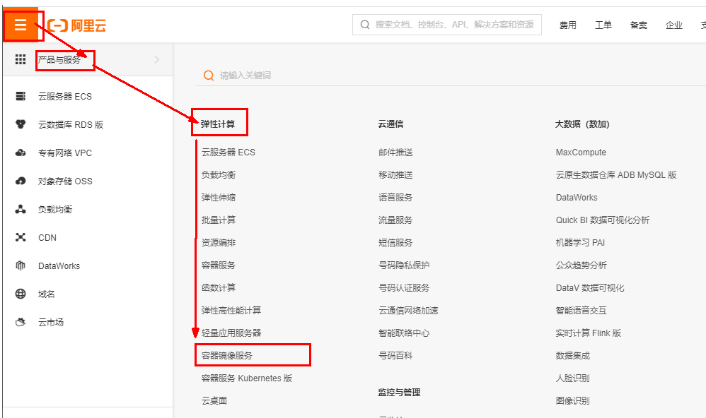

# 1 【安装docker】

## 1.1. 前情题要

**这是官网链接，建议以官网为准，因为我的博客存在过时的危险，当然我会尽量保证我的博客时效性。**

其次我的博客不会涵盖基础的 `docker` 使用，默认阅读者已经会了，这里主要是介绍一些常用的集群的快速搭建的命令，以及一些比较有用的容器和镜像的使用。

## 1.2. 安装步骤

CentOS7安装Docker      https://docs.docker.com/engine/install/centos/


### 1.2.1. 确定你是CentOS7及以上版本

```sh
cat /etc/redhat-release
```

### 1.2.2. 卸载旧版本


### 1.2.3. yum安装gcc相关

```sh
yum -y install gcc
```

```sh
yum -y install gcc-c++
```

### 1.2.4. 安装需要的软件包


执行命令

```sh
yum install -y yum-utils
```

### 1.2.5. 设置stable镜像仓库

1. 大坑

```sh
yum-config-manager --add-repo https://download.docker.com/linux/centos/docker-ce.repo
```


2. 推荐

**阿里的镜像源 当然可以选别的**

```sh
yum-config-manager --add-repo http://mirrors.aliyun.com/docker-ce/linux/centos/docker-ce.repo
```


### 1.2.6. 更新yum软件包索引

**这里官网没有，但是强烈建议更新一下索引，后续会经常使用yum进行安装操作**

```sh
yum makecache fast
```


### 1.2.7. 安装DOCKER CE

最新版

```sh
yum install docker-ce docker-ce-cli containerd.io docker-buildx-plugin docker-compose-plugin
```

旧版

```sh
yum -y install docker-ce docker-ce-cli containerd.io
```


### 1.2.8. 启动docker

```sh
systemctl start docker
```

### 1.2.9. 测试

查看版本

```sh
docker version
```


### 1.2.10. 卸载

```sh
systemctl stop docker 
```

```sh
yum remove docker-ce docker-ce-cli containerd.io docker-buildx-plugin docker-compose-plugin docker-ce-rootless-extras
```

```sh
rm -rf /var/lib/docker
```

```sh
rm -rf /var/lib/containerd
```


## 1.3. 阿里云镜像加速

当然，可以选华为云和别的，因为至少下载 `portaner` 的时候，我发现阿里云的镜像并非是最新版，而是一个很旧的版本，听说华为云更新一些。

https://promotion.aliyun.com/ntms/act/kubernetes.html




粘贴脚本直接执行

**或者分部操作**

```sh
mkdir -p /etc/docker
```

```sh
vim  /etc/docker/daemon.json
```

**docker 目前进一步被墙 我目前找到的一个最简单的办法是使用如下镜像源可以防止无法拉取镜像。**

```sh
{
    "registry-mirrors": [
        "https://do.nark.eu.org",
        "https://dc.j8.work",
        "https://docker.m.daocloud.io",
        "https://dockerproxy.com",
        "https://docker.mirrors.ustc.edu.cn",
        "https://docker.nju.edu.cn"
    ]
}
```

```sh
systemctl daemon-reload
```

```sh
systemctl restart docker
```

