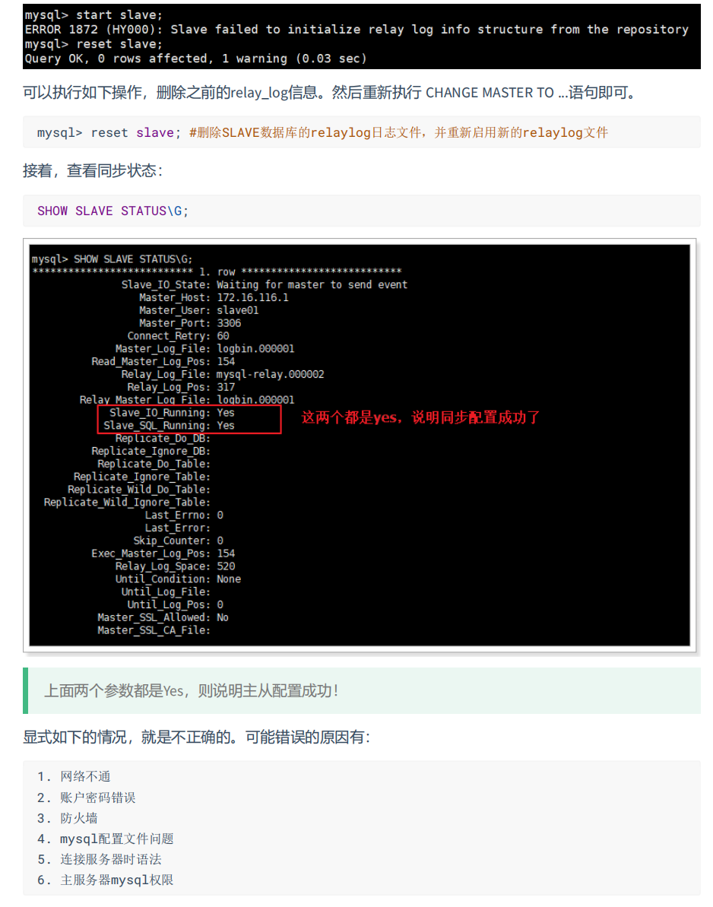

# 2 【安装mysql主从复制】

## 2.1. 新建容器实例【主机】

**这里我绑定的目录和之前的mysql不同是/fanxyuse/mysql-master**

**这里密码部分如果指令输错了，密码会变成123456，需要进去改。【这个我反正两次都是这样，也许是我命令输错了，懒得测试就按我的方法来】**

```sh
docker run -d -p 3307:3306 --privileged=true -v /fanxyuse/mysql-master/log:/var/log/mysql -v /fanxyuse/mysql-master/data:/var/lib/mysql -v /fanxyuse/mysql-master/conf:/etc/mysql/conf.d -e MYSQL_ROOT_PASSWORD=123456  --name mysql8_master mysql:8.0
```

**1.** **使用ALTER USER命令来修改当前用户密码**

```sql
ALTER USER USER() IDENTIFIED BY 'new_password';
```

**2.** **使用SET语句来修改当前用户密码**

```sql
SET PASSWORD='new_password';
```

## 2.2. 进入/fanxyuse/mysql-master/conf目录下新建my.cnf

```sh
vim my.cnf
```

**<font color='bb000'>配置文件行不能有空格</font>**

```ini
[mysqld]
## 设置server_id，同一局域网中需要唯一
server_id=100
## 指定不需要同步的数据库名称
binlog-ignore-db=mysql
## 开启二进制日志功能
log-bin=server-log-bin
## 设置二进制日志使用内存大小（事务)
binlog_cache_size=1M  
## 设置使用的二进制日志格式（mixed,statement,row）
binlog_format=mixed
## 二进制日志过期清理时间。默认值为0，表示不自动清理。
expire_logs_days=7
## 跳过主从复制中遇到的所有错误或指定类型的错误，避免slave端复制中断。
## 如：1062错误是指一些主键重复，1032错误是因为主从数据库数据不一致
slave_skip_errors=1062
```

## 2.3. 修改完配置后重启master实例

```sh
docker restart mysql8_master
```

## 2.4. 进入mysql-master容器

```sh
docker exec -it mysql8_master /bin/bash
```

```sh
mysql -uroot -p
```

## 2.5. master容器实例内创建数据同步用户

**mysql5.7的步骤**

```sql
CREATE USER 'slave1'@'%' IDENTIFIED BY '123456';
```

```sql
GRANT REPLICATION SLAVE, REPLICATION CLIENT ON *.* TO 'slave1'@'%';
```

**注意：如果使用的是MySQL8，需要如下的方式建立账户，并授权slave：**

```sql
CREATE USER 'slave1'@'%' IDENTIFIED BY '123456';
GRANT REPLICATION SLAVE ON *.* TO 'slave1'@'%';
#此语句必须执行。否则见下面。
ALTER USER 'slave1'@'%' IDENTIFIED WITH mysql_native_password BY '123456';
flush privileges;
```


```sql
show master status;
```


## 2.6. 新建从服务器容器实例3308

**这里我绑定的目录和之前的mysql不同是/fanxyuse/mysql-slave**

```sh
docker run -d -p 3308:3306 --privileged=true -v /fanxyuse/mysql-slave/log:/var/log/mysql -v /fanxyuse/mysql-slave/data:/var/lib/mysql -v /fanxyuse/mysql-slave/conf:/etc/mysql/conf.d -e MYSQL_ROOT_PASSWORD=123456  --name mysql8_slave mysql:8.0
```

**进入/fanxyuse/mysql-slave/conf目录下新建my.cnf**

```sh
vim: my.cnf
```

**<font color='bb000'>配置文件行不能有空格</font>**

```ini
[mysqld]
## 设置server_id，同一局域网中需要唯一
server_id=101
## 指定不需要同步的数据库名称
binlog-ignore-db=mysql
## 开启二进制日志功能，以备Slave作为其它数据库实例的Master时使用
log-bin=server-mysql-slave1-bin
## 设置二进制日志使用内存大小（事务）
binlog_cache_size=1M
## 设置使用的二进制日志格式（mixed,statement,row）
binlog_format=mixed
## 二进制日志过期清理时间。默认值为0，表示不自动清理。
expire_logs_days=7
## 跳过主从复制中遇到的所有错误或指定类型的错误，避免slave端复制中断。
## 如：1062错误是指一些主键重复，1032错误是因为主从数据库数据不一致
slave_skip_errors=1062
## relay_log配置中继日志
relay_log=server-mysql-relay-bin
## log_slave_updates表示slave将复制事件写进自己的二进制日志
log_slave_updates=1
## slave设置为只读（具有super权限的用户除外）
read_only=1
```

## 2.8. 修改完配置后重启slave实例

```sh
docker restart mysql8-slave
```

## 2.9. 在主数据库中查看主从同步状态

```sh
show master status;
```

**此前已经写了在上面**

## 2.10. 进入mysql-slave容器

```sh
docker exec -it mysql8-slave /bin/bash
```

```sh
mysql -uroot -p
```

## 2.11. 在从数据库中配置主从复制

- 记得改成自己的配置。尤其是比如`bin-log`文件的名字，偏移量，设置的密码，名称什么的。

```sql
change master to master_host='宿主机ip', master_user='slave1', master_password='123456', master_port=3307, master_log_file='server-mysql-bin.000001', master_log_pos=617, master_connect_retry=30;
```

**`master_host`：主数据库的IP地址；**

**`master_port`：主数据库的运行端口；**

**`master_user`：在主数据库创建的用于同步数据的用户账号；**

**`master_password`：在主数据库创建的用于同步数据的用户密码；**

**`master_log_file`：指定从数据库要复制数据的日志文件，通过查看主数据的状态，获取File参数；**

**`master_log_pos`：指定从数据库从哪个位置开始复制数据，通过查看主数据的状态，获取Position参数；**

**`master_connect_retry`：连接失败重试的时间间隔，单位为秒。**





### 2.12. 在从数据库中查看主从同步状态

```sql
show slave status \G
```

此时发现已经完成主从同步的状态了

### 2.13. 主从复制测试

主机新建库-使用库-新建表-插入数据，ok

从机使用库-查看记录，ok