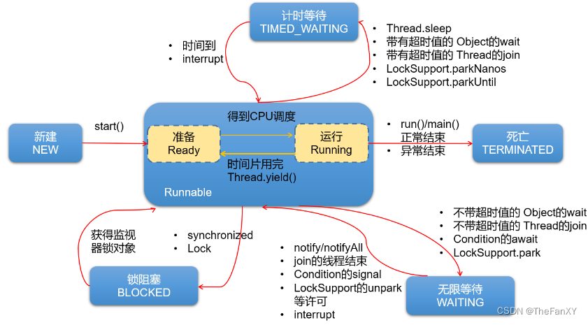
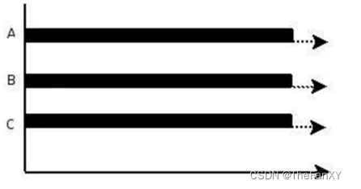
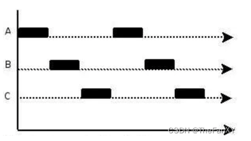
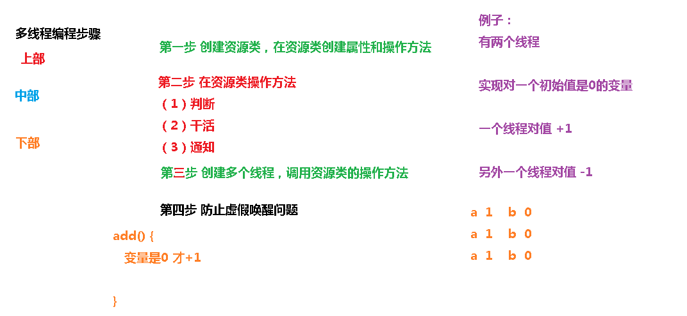
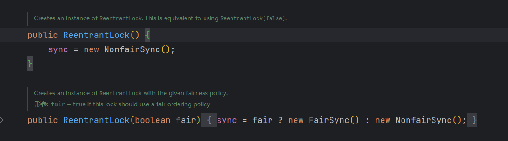
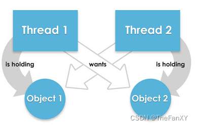
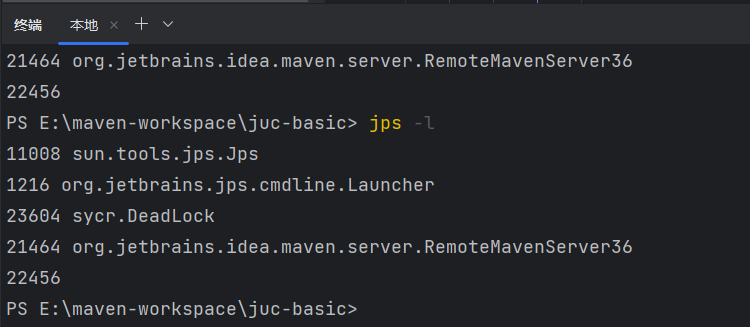
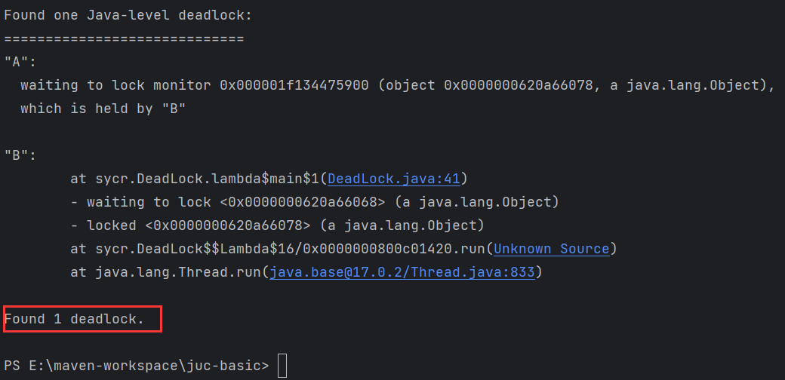

# 0 这部分建议结合JAVA基础的多线程一起看

# 1 什么是 JUC

## 1.1 JUC 简介 

在 Java 中，线程部分是一个重点，本篇文章说的 JUC 也是关于线程的。JUC 就是 java.util .concurrent 工具包的简称。这是一个处理线程的工具包，JDK 1.5 开始出现的。

## 1.2 进程与线程 

- **程序（program）**：为完成特定任务，用某种语言编写的`一组指令的集合`。**即指`一段静态的代码`，静态对象。**
- **进程（process）**：**程序的一次执行过程，或是正在内存中运行的应用程序。**如：运行中的QQ，运行中的网易音乐播放器。
  - **每个进程都有一个独立的内存空间，系统运行一个程序即是一个进程从创建、运行到消亡的过程。（生命周期）**
  - **程序是静态的，进程是动态的**
  - **进程作为`操作系统调度和分配资源的最小单位`（亦是系统运行程序的基本单位）**，**系统在运行时会为每个进程分配不同的内存区域。**
  - 现代的操作系统，大都是支持多进程的，支持同时运行多个程序。比如：现在我们上课一边使用编辑器，一边使用录屏软件，同时还开着画图板，dos窗口等软件。
- **线程（thread）**：**进程可进一步细化为线程，是程序内部的`一条执行路径`。一个进程中至少有一个线程。**
  - **一个进程同一时间若`并行`执行多个线程**，**就是支持多线程的。**
  - **线程作为`CPU调度和执行的最小单位`。**
  - **一个进程中的多个线程共享相同的内存单元，它们从同一个堆中分配对象，可以访问相同的变量和对象。**这就使得线程间通信更简便、高效。**但多个线程操作共享的系统资源可能就会带来`安全的隐患`。**

**不同的进程之间是不共享内存的。**

**进程之间的数据交换和通信的成本很高。**

## 1.3 线程的状态 

### 1.3.1 线程状态枚举类 



Thread.State

- **`NEW（新建）`：**线程刚被创建，但是并未启动。还没调用start方法。
- **`RUNNABLE（可运行）`：**这里没有区分就绪和运行状态。因为**对于Java对象来说，只能标记为可运行**，至于**什么时候运行**，不是JVM来控制的了，是**OS来进行调度的**，而且时间非常短暂，因此对于Java对象的状态来说，无法区分。
- **`Teminated（被终止）`：**表明此线程已经**结束生命周期，终止运行**。
- 重点说明，根据**`Thread.State`**的定义，**阻塞状态分为三种**：**`BLOCKED`、`WAITING`、`TIMED_WAITING`。**
  - **`BLOCKED（锁阻塞）`**：在API中的介绍为：一个正在阻塞、等待一个监视器锁（锁对象）的线程处于这一状态。只有获得锁对象的线程才能有执行机会。
    - 比如，线程A与线程B代码中使用同一锁，如果线程A获取到锁，线程A进入到Runnable状态，那么线程B就进入到Blocked锁阻塞状态。
  - **`TIMED_WAITING（计时等待）`**：在API中的介绍为：一个正在限时等待另一个线程执行一个（唤醒）动作的线程处于这一状态。
    - 当前线程执行过程中遇到Thread类的`sleep`或`join`，Object类的`wait`，LockSupport类的`park`方法，并且在调用这些方法时，`设置了时间`，那么当前线程会进入TIMED_WAITING，直到时间到，或被中断。
  - **`WAITING（无限等待）`**：在API中介绍为：一个正在无限期等待另一个线程执行一个特别的（唤醒）动作的线程处于这一状态。
    - 当前线程执行过程中遇到遇到Object类的`wait`，Thread类的`join`，`LockSupport`类的`park`方法，并且在调用这些方法时，`没有指定时间`，那么当前线程会进入WAITING状态，直到被唤醒。
      - 通过Object类的wait进入WAITING状态的要有Object的notify/notifyAll唤醒；
      - 通过Condition的await进入WAITING状态的要有Condition的signal方法唤醒；
      - 通过`LockSupport`类的park方法进入WAITING状态的要有LockSupport类的unpark方法唤醒
      - 通过Thread类的join进入WAITING状态，只有调用join方法的线程对象结束才能让当前线程恢复；

说明：当从WAITING或TIMED_WAITING恢复到Runnable状态时，如果发现当前线程没有得到监视器锁，那么会立刻转入BLOCKED状态。

### 1.3.2 wait/sleep 的区别 

（1）sleep 是 Thread 的静态方法，wait 是 Object 的方法，任何对象实例都能调用。

（2）sleep 不会释放锁，它也不需要占用锁。wait 会释放锁，但调用它的前提是当前线程占有锁(即代码要在 synchronized 中)。

（3）它们都可以被 interrupted 方法中断。

## 1.4 并发与并行 

**并行（parallel）**：**指两个或多个事件在`同一时刻`发生（同时发生）。指在同一时刻，有`多条指令`在`多个CPU`上`同时`执行。**比如：多个人同时做不同的事。



 **并发（concurrency）**：**指两个或多个事件在`同一个时间段内`发生。即在一段时间内，有`多条指令`在`单个CPU`上`快速轮换、交替`执行，使得在宏观上具有多个进程同时执行的效果。**



**在操作系统中，启动了多个程序，`并发`指的是在一段时间内宏观上有多个程序同时运行，这在单核 CPU 系统中，每一时刻只能有一个程序执行，即微观上这些程序是分时的交替运行，只不过是给人的感觉是同时运行，那是因为分时交替运行的时间是非常短的。**

而在**多核 CPU 系统**中，则这些可以**`并发`执行的程序便可以分配到多个CPU上**，实现多任务并行执行，**即利用每个处理器来处理一个可以并发执行的程序，这样多个程序便可以同时执行。**目前电脑市场上说的多核 CPU，便是多核处理器，**核越多，`并行`处理的程序越多，能大大的提高电脑运行的效率。**

**要解决大并发问题，通常是将大任务分解成多个小任务**, 由于操作系统对进程的调度是随机的，所以切分成多个小任务后，可能会从任一小任务处执行。这可能会出现一些现象：

• 可能出现一个小任务执行了多次，还没开始下个任务的情况。这时一般会采用队列或类似的数据结构来存放各个小任务的成果

• 可能出现还没准备好第一步就执行第二步的可能。这时，一般采用多路复用或异步的方式，比如只有准备好产生了事件通知才执行某个任务。

• 可以多进程/多线程的方式并行执行这些小任务。也可以单进程/单线程执行这些小任务，这时很可能要配合多路复用才能达到较高的效率

## 1.5 管程 

管程(monitor)是保证了同一时刻只有一个进程在管程内活动,即管程内定义的操作在同一时刻只被一个进程调用(由编译器实现)

但是这样并不能保证进程以设计的顺序执行 JVM 中同步是基于进入和退出管程(monitor)对象实现的，每个对象都会有一个管程(monitor)对象，管程(monitor)会随着 java 对象一同创建和销毁执行线程首先要持有管程对象，然后才能执行方法，当方法完成之后会释放管程，方法在执行时候会持有管程，其他线程无法再获取同一个管程

## 1.6 用户线程和守护线程 

**用户线程**:平时用到的普通线程,自定义线程

**守护线程**:运行在后台,是一种特殊的线程,比如垃圾回收

**当主线程结束后**,用户线程还在运行, JVM **存活**

**如果没有用户线程**,都是守护线程, JVM **结束**

```java
public class ThreadTest {

    public static void main(String[] args) throws InterruptedException {
        Thread thread = new Thread(() -> {
            System.out.println(Thread.currentThread().getName() + " :: " + Thread.currentThread().isDaemon());
        }, "线程1");
		
       	// 如果注释掉这句 会发现主线程结束的时候 整个进程没有结束 
        thread.setDaemon(true);
        thread.start();
        System.out.println(Thread.currentThread().getName());
        Thread.sleep(3000);
    }
}
```

# 2 Lock 接口 

## 2.1 Synchronized 

### 2.1.1 Synchronized 关键字回顾 

synchronized 是 Java 中的关键字，是一种同步锁。它修饰的对象有以下几种：

1. 修饰一个代码块，被修饰的代码块称为同步语句块，其作用的范围是大括号{}括起来的代码，作用的对象是调用这个代码块的对象；

2. 修饰一个方法，被修饰的方法称为同步方法，其作用的范围是整个方法，作用的对象是调用这个方法的对象；

- 虽然可以使用 synchronized 来修饰方法，但 synchronized 并不属于方法定义的一部分，因此，synchronized 关键字不能被继承。如果在父类中的某个方法使用了 synchronized 关键字，而在子类中覆盖了这个方法，在子类中的这个方法默认情况下并不是同步的，而必须显式地在子类的这个方法中加上synchronized 关键字才可以。当然，**还可以在子类方法中调用父类中相应的方法，这样虽然子类中的方法不是同步的，但子类调用了父类的同步方法，因此，子类的方法也就相当于同步了。**

3. 修饰一个静态的方法，其作用的范围是整个静态方法，作用的对象是这个类的所有对象；

4. 修饰一个类，其作用的范围是 synchronized 后面括号括起来的部分，作用主的对象是这个类的所有对象。

### 2.1.2 售票案例

**多线程编程步骤**

1. 创建资源类，在资源类创建属性和操作方法

2. 创建多个线程并调用资源类的操作方法

``` java
class Ticket {
    private int ticketCount = 30;

    public synchronized void sale() {
        if (ticketCount > 0){
            System.out.println("now ticketCount : " + --ticketCount + "\t" +
                    Thread.currentThread().getName() + "\t" + "have sailed one ticket");
        } else {
            System.out.println(Thread.currentThread().getName() + "\t" +
                    "want to sale one ticket, but all ticket had been sailed");
        }
    }
}

public class TicketSale {

    public static void main(String[] args) {

        Ticket ticket = new Ticket();

        new Thread(() -> {
            for (int i = 0; i < 15; i++) {
                ticket.sale();
                try {
                    Thread.sleep(300);
                } catch (InterruptedException e) {
                    throw new RuntimeException(e);
                }
            }
        }, "AA").start();

        new Thread(() -> {
            for (int i = 0; i < 15; i++) {
                ticket.sale();
                try {
                    Thread.sleep(300);
                } catch (InterruptedException e) {
                    throw new RuntimeException(e);
                }
            }
        }, "BB").start();

        new Thread(() -> {
            for (int i = 0; i < 15; i++) {
                ticket.sale();
                try {
                    Thread.sleep(300);
                } catch (InterruptedException e) {
                    throw new RuntimeException(e);
                }
            }
        }, "CC").start();
    }
}
```

**这个案例是我设计的，因为sychronized关键字修饰的是非静态方法，所以监视器为对象，这里三个线程都调用同一个对象的sychronized方法，故会因为同步机制导致同一时间只有一个能执行，然后再进行睡眠 300ms，让其他线程可以竞争获取同步监视器。**

**那么如果这个获取锁的线程由于要等待 IO 或者其他原因（比如调用 sleep方法）被阻塞了，但是又没有释放锁，其他线程便只能干巴巴地等待，试想一下，这多么影响程序执行效率。**

**因此就需要有一种机制可以不让等待的线程一直无期限地等待下去（比如只等待一定的时间或者能够响应中断），通过 Lock 就可以办到。**

## 2.2 什么是 Lock

Lock 锁实现提供了比使用同步方法和语句可以获得的更广泛的锁操作。它们允许更灵活的结构，可能具有非常不同的属性，并且可能支持多个关联的条件对象。Lock 提供了比 synchronized 更多的功能。

**Lock 与的 Synchronized 区别**

- Lock 不是 Java 语言内置的，synchronized 是 Java 语言的关键字，因此是内置特性。Lock 是一个类，通过这个类可以实现同步访问；

- Lock 和 synchronized 有一点非常大的不同，**采用 synchronized 不需要用户去手动释放锁**，当 synchronized 方法或者 synchronized 代码块执行完之后，系统会自动让线程释放对锁的占用；**而 Lock 则必须要用户去手动释放锁，如果没有主动释放锁，就有可能导致出现死锁现象**

### 2.2.1 Lock 接口

```java
public interface Lock {
    void lock();
    void lockInterruptibly() throws InterruptedException;
    boolean tryLock();
    boolean tryLock(long time, TimeUnit unit) throws InterruptedException;
    void unlock();
    Condition newCondition();
}
```

### 2.2.2 lock

lock()方法是平常使用得最多的一个方法，就是用来获取锁。如果锁已被其他线程获取，则进行等待。

采用 Lock，必须主动去释放锁，并且在发生异常时，不会自动释放锁。因此一般来说，使用 Lock 必须在 try{}catch{}块中进行，并且将释放锁的操作放在 finally 块中进行，以保证锁一定被被释放，防止死锁的发生。通常使用 Lock来进行同步的话，是以下面这种形式去使用的：

```java
{
    // ---------------
	Lock lock = ...;
    lock.lock();
    try {
        //处理任务
    } catch(Exception ex){ 
        //处理异常
    } finally {
        lock.unlock(); //释放锁
    }
	// ----------------
}
```

### 2.2.3 newCondition

关键字 synchronized 与 wait()/notify()这两个方法一起使用可以实现等待/通知模式， Lock 锁的 newContition()方法返回 Condition 对象，Condition 类也可以实现等待/通知模式。

用 notify()通知时，JVM 会随机唤醒某个等待的线程， 使用 Condition 类可以进行选择性通知， Condition 比较常用的两个方法：

- await()会使当前线程等待,同时会释放锁,当其他线程调用 signal()时,线程会重新获得锁并继续执行。

- signal()用于唤醒一个等待的线程。

**注意**：在调用 Condition 的 await()/signal()方法前，也需要线程持有相关的 Lock 锁，调用 await()后线程会释放这个锁，在 singal()调用后会从当前Condition 对象的等待队列中，唤醒 一个线程，唤醒的线程尝试获得锁， 一旦获得锁成功就继续执行。

## 2.3 ReentrantLock

ReentrantLock，意思是“可重入锁”，关于可重入锁的概念将在后面讲述。

ReentrantLock 是唯一实现了 Lock 接口的类，并且 ReentrantLock 提供了更多的方法。下面通过一些实例看具体看一下如何使用。

**可重入锁**指的是同一个线程可无限次地进入同一把锁的不同代码，又因该锁通过线程独占共享资源的方式确保并发安全，又称为**独占锁**。**可重入指的是已经获得该锁了，但在代码块里还能接着获得该锁，只是后面也要释放两次该锁。<font color='bb000'>下面这个例子并没有体现这一点，但zookeeper的笔记有一个帮助生成关于zookeeper锁的那里有代码，那个锁的案例是展示了多次上锁和对应次数释放锁的操作。</font>**

举个例子：同一个类中的synchronize关键字修饰了不同的方法。synchronize是内置的隐式的可重入锁，例子中的两个方法使用的是同一把锁，只要能执行testB()也就说明线程拿到了锁，所以执行testA()方法就不用被阻塞等待获取锁了；如果不是同一把锁或非可重入锁，就会在执行testA()时被阻塞等待。

**上面的例子换成使用lock接口来复现。**

**<font color='bb000'>补充一下，并不是调用start方法就代表线程立马被创建了，其实点击进入源码，可以看到当start执行的时候，需要先进行start0方法调用，这个方法是native方法，即是否创建由操作系统决定，而java代码层面无能为力。</font>**

```java
class LTicket { 
    private int ticketCount = 30;

    // 创建可重入锁
    private final ReentrantLock lock = new ReentrantLock();

    public void sale() {
        // 上锁
        lock.lock();

        try {
            if (ticketCount > 0){
                System.out.println("now ticketCount : " + --ticketCount + "\t" +
                        Thread.currentThread().getName() + "\t" + "have sailed one ticket");
            }
        } catch (Exception e) {
            throw new RuntimeException(e);
        } finally {
            // 释放锁
            lock.unlock();
        }
    }
}

public class LTicketSale {

    public static void main(String[] args) {
        LTicket ticket = new LTicket();

        new Thread(() -> {
            for (int i = 0; i < 20; i++) {
                ticket.sale();
                try {
                    Thread.sleep(300);
                } catch (InterruptedException e) {
                    throw new RuntimeException(e);
                }
            }
        }, "AA").start();

        new Thread(() -> {
            for (int i = 0; i < 20; i++) {
                ticket.sale();
                try {
                    Thread.sleep(300);
                } catch (InterruptedException e) {
                    throw new RuntimeException(e);
                }
            }
        }, "BB").start();

        new Thread(() -> {
            for (int i = 0; i < 20; i++) {
                ticket.sale();
                try {
                    Thread.sleep(300);
                } catch (InterruptedException e) {
                    throw new RuntimeException(e);
                }
            }
        }, "CC").start();
    }
}
```

## 2.4 小结(重点)

**<font color='000bb'>Lock 和 synchronized 有以下几点不同：</font>**

1. **Lock 是一个接口，而 synchronized 是 Java 中的关键字，synchronized 是内置的语言实现；**

2. **synchronized 在发生异常时，会自动释放线程占有的锁，因此不会导致死锁现象发生；而 Lock 在发生异常时，如果没有主动通过 unLock()去释放锁，则很可能造成死锁现象，因此使用 Lock 时需要在 finally 块中释放锁；**

3. **Lock 可以让等待锁的线程响应中断，而 synchronized 却不行，使用synchronized 时，等待的线程会一直等待下去，不能够响应中断；如果 使用ReentrantLock，如果A不释放，可以使B在等待了足够长的时间以后，中断等待，而干别的事情**

4. **通过 Lock 可以知道有没有成功获取锁，而 synchronized 却无法办到。**
5. **Lock 可以提高多个线程进行读操作的效率。在性能上来说，如果竞争资源不激烈，两者的性能是差不多的，而当竞争资源非常激烈时（即有大量线程同时竞争），此时 Lock 的性能要远远优于synchronized。**

# 3 线程间通信 

线程间通信的模型有两种：共享内存和消息传递，以下方式都是基本这两种模型来实现的。我们来基本一道面试常见的题目来分析

**场景---两个线程，一个线程对当前数值加 1，另一个线程对当前数值减 1,要求用线程间通信**



**<font color='bb000'>同时这里要补充一点，我们在进入线程通信的等待唤醒的条件判断，应该使用 `while`，这样能保证不会出现虚假唤醒，因为java的唤醒机制是，从哪里睡眠，就从哪里唤醒，如果使用`if`导致出现并不应该唤醒的情况下，线程被唤醒，错误的执行了不该执行的方法。</font>**

## 3.1 synchronized 方案

```java
class share {
    // 资源
    private int numbers = 0;

    // +1 的方法
    public synchronized void incr() throws InterruptedException {
        // 第二步 判断 干活 通知
        while (numbers == 1) {
            this.wait();
        }
        // 如果 number 值为 0 就 + 1
        numbers++;
        this.notifyAll();
        System.out.println(Thread.currentThread().getName() + " :: " + numbers);
    }

    // -1 的方法
    public synchronized void decr() throws InterruptedException {
        while (numbers != 1) {
            this.wait();
        }
        numbers--;
        this.notifyAll();
        System.out.println(Thread.currentThread().getName() + " :: " + numbers);
    }
}

public class ThreadDemo1 {

    public static void main(String[] args) {
        share share = new share();

        new Thread(() -> {
            try {
                for (int i = 0; i < 10; i++) {
                    share.incr();
                }
            } catch (InterruptedException e) {
                throw new RuntimeException(e);
            }
        }, "AA").start();

        new Thread(() -> {
            try {
                for (int i = 0; i < 10; i++) {
                    share.decr();
                }
            } catch (InterruptedException e) {
                throw new RuntimeException(e);
            }
        }, "BB").start();
        
                new Thread(() -> {
            try {
                for (int i = 0; i < 10; i++) {
                    share.incr();
                }
            } catch (InterruptedException e) {
                throw new RuntimeException(e);
            }
        }, "CC").start();

        new Thread(() -> {
            try {
                for (int i = 0; i < 10; i++) {
                    share.decr();
                }
            } catch (InterruptedException e) {
                throw new RuntimeException(e);
            }
        }, "DD").start();
    }
}
```

## 3.2 Lock 方案 

**<font color='bb000'>切记使用 Lock 接口，一定要使用 try finally 环绕，防止出现异常之后导致死锁。</font>**

```java
class Share {

    private int numbers = 0;
    private final Lock lock = new ReentrantLock();

    private Condition condition = lock.newCondition();

    // + 1 方法
    public void incr() throws InterruptedException {

        try {
            lock.lock();
            while (numbers == 1){
                condition.await();
            }
            numbers ++;
            System.out.println(Thread.currentThread().getName() + " :: " + numbers);
            condition.signalAll();
        } finally {
            lock.unlock();
        }
    }

    // - 1 方法
    public void decr() throws InterruptedException {
        try {
            lock.lock();
            while (numbers != 1){
                condition.await();
            }
            numbers --;
            System.out.println(Thread.currentThread().getName() + " :: " + numbers);
            condition.signalAll();
        } finally {
            lock.unlock();
        }
    }

}

public class ThreadDemo2 {

    public static void main(String[] args) {
        Share share = new Share();

        new Thread(()-> {
            try {
                for (int i = 0; i < 10; i++) {
                    share.incr();
                }
            } catch (InterruptedException e) {
                throw new RuntimeException(e);
            }
        }, "AA").start();

        new Thread(()-> {
            try {
                for (int i = 0; i < 10; i++) {
                    share.decr();
                }
            } catch (InterruptedException e) {
                throw new RuntimeException(e);
            }
        }, "BB").start();

        new Thread(()-> {
            try {
                for (int i = 0; i < 10; i++) {
                    share.incr();
                }
            } catch (InterruptedException e) {
                throw new RuntimeException(e);
            }
        }, "CC").start();

        new Thread(()-> {
            try {
                for (int i = 0; i < 10; i++) {
                    share.decr();
                }
            } catch (InterruptedException e) {
                throw new RuntimeException(e);
            }
        }, "DD").start();
    }
}
```

## 3.3 线程间定制化通信 

### 3.3.1 案例介绍 

**问题: A 线程打印 5 次 A，B 线程打印 10 次 B，C 线程打印 15 次 C,按照此顺序循环 10 轮**

**<font color='bb000'>这里定义 flag 是为了线程阻塞的时候，能按情况进行阻塞，如果flag不到达合法值就一直等待被唤醒，而为什么设置三个`condition`，是因为唤醒的时候就不用使用 `signalAll`了，要不然还要全部唤醒，进入二次竞争，然后再次等待，每进行一次唤醒，就进行一次竞争行为，效率降低。</font>**

```java
class ThreadShare {
    private Lock lock = new ReentrantLock();
    private Condition c1 = lock.newCondition();
    private Condition c2 = lock.newCondition();
    private Condition c3 = lock.newCondition();
    private int flag = 0;

    public void print5(int loop) throws InterruptedException {
        try {
            lock.lock();
            while (flag != 0) {
                c1.await();
            }
            for (int i = 0; i < 5; i++) {
                System.out.println(Thread.currentThread().getName() + " :: " + i + " 轮数 : " + loop + " flag : " + flag);
            }
            flag = (flag + 1) % 3;
            c2.signal();
        } finally {
            lock.unlock();
        }
    }

    public void print10(int loop) throws InterruptedException {
        try {
            lock.lock();
            while (flag != 1) {
                c2.await();
            }
            for (int i = 0; i < 10; i++) {
                System.out.println(Thread.currentThread().getName() + " :: " + i + " 轮数 : " + loop);
            }
            flag = (flag + 1) % 3;
            c3.signal();
        } finally {
            lock.unlock();
        }
    }

    public void print15(int loop) throws InterruptedException {
        try {
            lock.lock();
            while (flag != 2) {
                c3.await();
            }
            for (int i = 0; i < 15; i++) {
                System.out.println(Thread.currentThread().getName() + " :: " + i);
            }
            flag = (flag + 1) % 3;
            c1.signal();
        } finally {
            lock.unlock();
        }
    }
}

public class ThreadDemo3 {

    public static void main(String[] args) {
        ThreadShare share = new ThreadShare();

        new Thread(()->{
            for (int i = 0; i < 5; i++) {
                try {
                    share.print5(i);
                } catch (InterruptedException e) {
                    throw new RuntimeException(e);
                }
            }
        }, "AA").start();

        new Thread(()->{
            for (int i = 0; i < 5; i++) {
                try {
                    share.print10(i);
                } catch (InterruptedException e) {
                    throw new RuntimeException(e);
                }
            }
        }, "BB").start();

        new Thread(()->{
            for (int i = 0; i < 5; i++) {
                try {
                    share.print15(i);
                } catch (InterruptedException e) {
                    throw new RuntimeException(e);
                }
            }
        }, "CC").start();
    }
}
```

**synchronized实现同步的基础:Java中的每一个对象都可以作为锁。具体表现为以下3种形式。**
**对于普通同步方法，锁是当前实例对象。**
**对于静态同步方法，锁是当前类的class对象。**
**对于同步方法块，锁是synchonized括号里配置的对象**

# 4 集合的线程安全 

## 4.1 集合操作 Demo 

**创建30个线程，每个线程都分别执行三次插入操作，线程一旦开始就会并发的和前面未执行过三次的线程出现并发书写的线程写异常。**

```java
public class ThreadDemo4 {
    public static void main(String[] args) {
        List<String> list = new ArrayList<>();

        for (int i = 0; i < 30; i++) {
            // 创建10个线程 均向集合添加内容
            for (int j = 0; j < 3; j++) {
                new Thread(() -> {
                    list.add(UUID.randomUUID().toString().substring(0, 8));
                    System.out.println(list);
                }, String.valueOf(i)).start();
            }
        }
    }
}
```

`java.util.ConcurrentModificationException`

**问题: 为什么会出现并发修改异常?**

查看 ArrayList 的 add 方法源码

**没有synchronized关键字**

```java
/**
* Appends the specified element to the end of this list.
*
* @param e element to be appended to this list
* @return <tt>true</tt> (as specified by {@link Collection#add})
*/
public boolean add(E e) {
ensureCapacityInternal(size + 1); // Increments modCount!!
elementData[size++] = e;
return true;
}
```

**那么我们如何去解决 List 类型的线程安全问题?**

## 4.2 Vector 

Vector 是**矢量队列**，它是 JDK1.0 版本添加的类。继承于 AbstractList，实现了 List, RandomAccess, Cloneable 这些接口。 Vector 继承了 AbstractList，实现了 List；所以，**它是一个队列，支持相关的添加、删除、修改、遍历等功能**。 Vector 实现了 RandmoAccess 接口，即**提供了随机访问功能**。

RandmoAccess 是 java 中用来被 List 实现，为 List 提供快速访问功能的。在Vector 中，我们即可以通过元素的序号快速获取元素对象；这就是快速随机访问。 Vector 实现了 Cloneable 接口，即实现 clone()函数。它能被克隆。

**==和 ArrayList 不同，Vector 中的操作是线程安全的。==**

代码修改

```java
public class ThreadDemo4 {
    public static void main(String[] args) {
        List<String> list = new Vector<>();

        for (int i = 0; i < 30; i++) {
            // 创建10个线程 均向集合添加内容
            for (int j = 0; j < 3; j++) {
                new Thread(() -> {
                    list.add(UUID.randomUUID().toString().substring(0, 8));
                    System.out.println(list);
                }, String.valueOf(i)).start();
            }
        }
    }
}
```

## 4.3 Collections 

Collections 提供了方法 synchronizedList 保证 list 是同步线程安全的

```java
public class ThreadDemo4 {
    public static void main(String[] args) {
        //List<String> list = new ArrayList<String>();
        //List<String> list = new Vector<>();
        List<String> list = Collections.synchronizedList(new ArrayList<String>());

        for (int i = 0; i < 30; i++) {
            // 创建10个线程 均向集合添加内容
            for (int j = 0; j < 3; j++) {
                new Thread(() -> {
                    list.add(UUID.randomUUID().toString().substring(0, 8));
                    System.out.println(list);
                }, String.valueOf(i)).start();
            }
        }
    }
}
```

**源码**

```java
public static <T> List<T> synchronizedList(List<T> list) {
    return (list instanceof RandomAccess ?
        new SynchronizedRandomAccessList<>(list) : new SynchronizedList<>(list));
}
```

## 4.4 CopyOnWriteArrayList(重点) 

首先我们对 CopyOnWriteArrayList 进行学习,其特点如下:

它相当于线程安全的 ArrayList。和 ArrayList 一样，它是个可变数组；但是和ArrayList 不同的时，它具有以下特性：

1. 它最适合于具有以下特征的应用程序：List 大小通常保持很小，只读操作远多于可变操作，需要在遍历期间防止线程间的冲突。

2. 它是线程安全的。
3. 因为通常需要复制整个基础数组，所以可变操作（add()、set() 和 remove() 等等）的开销很大。

4. 迭代器支持 hasNext(), next()等不可变操作，但不支持可变 remove()等操作。
5. 使用迭代器进行遍历的速度很快，并且不会与其他线程发生冲突。在构造迭代器时，迭代器依赖于不变的数组快照。

**1. 独占锁效率低：采用读写分离思想解决**

**2. 写线程获取到锁，其他写线程阻塞**

**3. 复制思想：**

当我们往一个容器添加元素的时候，不直接往当前容器添加，而是先将当前容器进行 Copy，复制出一个新的容器，然后新的容器里添加元素，添加完元素之后，再将原容器的引用指向新的容器。

**这时候会抛出来一个新的问题，也就是数据不一致的问题。如果写线程还没来得及写会内存，其他的线程就会读到了脏数据。**

==**这就是 CopyOnWriteArrayList 的思想和原理。就是拷贝一份。**==

没有线程安全问题

**原因分析**(**重点**):==**动态数组与线程安全**==

下面从“动态数组”和“线程安全”两个方面进一步对CopyOnWriteArrayList 的原理进行说明。

- **“动态数组”机制**

- 它内部有个“volatile 数组”(array)来保持数据。在“添加/修改/删除”数据时，都会新建一个数组，并将更新后的数据拷贝到新建的数组中，最后再将该数组赋值给“volatile 数组”, 这就是它叫做 CopyOnWriteArrayList 的原因

- **由于它在“添加/修改/删除”数据时，都会新建数组，所以涉及到修改数据的操作，CopyOnWriteArrayList 效率很低；但是单单只是进行遍历查找的话，效率比较高。**

- **“线程安全”机制**
- 通过 volatile 和互斥锁来实现的。

- 通过“volatile 数组”来保存数据的。一个线程读取 volatile 数组时，总能看到其它线程对该 volatile 变量最后的写入；就这样，通过 volatile 提供了“读取到的数据总是最新的”这个机制的保证。

- 通过互斥锁来保护数据。在“添加/修改/删除”数据时，会先“获取互斥锁”，再修改完毕之后，先将数据更新到“volatile 数组”中，然后再“释放互斥锁”，就达到了保护数据的目的。

## 4.5 小结(重点) 

**1.线程安全与线程不安全集合**

集合类型中存在线程安全与线程不安全的两种,常见例如:

ArrayList ----- Vector

HashMap -----HashTable

但是以上都是通过 synchronized 关键字实现,效率较低

**2.Collections 构建的线程安全集合**

**3.java.util.concurrent 并发包下**

CopyOnWriteArrayList CopyOnWriteArraySet ConcurrentHashMap 类型,通过动态数组与线程安全个方面保证线程安全

# 5 多线程锁 

## 5.1 锁的八个问题演示 

```java
class Phone {
    public static synchronized void sendSMS() throws Exception {
        //停留 4 秒
        TimeUnit.SECONDS.sleep(4);
        System.out.println("------sendSMS");
    }

    public synchronized void sendEmail() throws Exception {
        System.out.println("------sendEmail");
    }

    public void getHello() {
        System.out.println("------getHello");
    }
}
```

**1 标准访问，先打印短信还是邮件**

------sendSMS

------sendEmail

**这里把睡4秒注释，因为两个线程创建之间主线程睡了100ms，导致必定第一个线程先创建，故必然执行顺序固定为上**

```java
    public static void main(String[] args) throws Exception {
        Phone phone1 = new Phone();
        Phone phone2 = new Phone();

        new Thread(()->{

            try {
                phone1.sendSMS();
            } catch (Exception e) {
                throw new RuntimeException(e);
            }

        }, "AA").start();

        Thread.sleep(100);

        new Thread(()->{

            try {
                phone1.sendEmail();
            } catch (Exception e) {
                throw new RuntimeException(e);
            }

        }, "BB").start();
    }
```

**2 停 4 秒在短信方法内，先打印短信还是邮件**

------sendSMS

------sendEmail

**如果把睡4秒取消注释，还是这个顺序，因为我们的锁是加在非静态方法，即给对象加锁，而调用同一个对象，故当第一个线程执行senSMS，必然持有锁，第二个只能等它睡完了，才能拿到锁，执行其他的同步方法。**

**3 新增普通的 hello 方法，是先打短信还是 hello**

------getHello

------sendSMS

**显然，肯定是非同步方法执行，它不是同步方法，不需要拿锁，不会被阻塞**

**4 现在有两部手机，先打印短信还是邮件**

------sendEmail

------sendSMS

**必然没有睡的sendEmail先执行完，目前是对象锁，换了对象，拿到的不是同一个锁，那加了线程休眠的肯定执行的慢**

**5 两个静态同步方法，1 部手机，先打印短信还是邮件**

------sendSMS

------sendEmail

**6 两个静态同步方法，2 部手机，先打印短信还是邮件**

------sendSMS

------sendEmail

**既然是静态方法，那就是单例的Class类锁，那显然执行的方法哪怕对象不同，仍会阻塞别的Class锁的线程。**

**7          1 个静态同步方法,1 个普通同步方法，1 部手机，先打印短信还是邮件**

------sendEmail

------sendSMS

**8         1 个静态同步方法,1 个普通同步方法，2 部手机，先打印短信还是邮件**

------sendEmail

------sendSMS

**一个是Class锁，一个是对象锁，互不影响，所以不睡的方法，显然先执行。**

**结论 : **

一个对象里面如果有多个 `synchronized` 方法，某一个时刻内，只要一个线程去调用其中的一个 `synchronized` 方法了，其它的线程都只能等待，换句话说，某一个时刻内，只能有唯一一个线程去访问这些 `synchronized` 方法锁的是当前对象 `this`，被锁定后，其它的线程都不能进入到当前对象的其它的synchronized 方法

加个普通方法后发现和同步锁无关

换成两个对象后，不是同一把锁了，情况立刻变化。

`synchronized` 实现同步的基础：`Java` 中的每一个对象都可以作为锁。

**具体表现为以下** **3** **种形式。**

**对于普通同步方法，锁是当前实例对象。**

**对于静态同步方法，锁是当前类的** **Class** **对象。**

**对于同步方法块，锁是** **Synchonized** **括号里配置的对象**

当一个线程试图访问同步代码块时，它首先必须得到锁，退出或抛出异常时必须释放锁。也就是说如果一个实例对象的非静态同步方法获取锁后，该实例对象的其他非静态同步方法必须等待获取锁的方法释放锁后才能获取锁，可是别的实例对象的非静态同步方法因为跟该实例对象的非静态同步方法用的是不同的锁，所以毋须等待该实例对象已获取锁的非静态同步方法释放锁就可以获取他们自己的锁。

所有的静态同步方法用的也是同一把锁——类对象本身，这两把锁是两个不同的对象，所以静态同步方法与非静态同步方法之间是不会有竞争条件的。

但是一旦一个静态同步方法获取锁后，其他的静态同步方法都必须等待该方法释放锁后才能获取锁，而不管是同一个实例对象的静态同步方法之间，还是不同的实例对象的静态同步方法之间，只要它们同一个类的实例对象，就会产生竞争关系！

## 5.2 公平锁和非公平锁



**这里以之前的卖票代码为案例，我们发现 ReentrantLock 默认构造就是非公平锁，同时有一个带布尔的有参构造是可以构建公平锁。**

之前卖票案例，可以看到在AA线程没有结束for循环之前，其他线程没有机会调用方法进行卖票。

**非公平锁 ： 线程饿死      效率高**

**公平锁 ： 均衡调用      效率低**

**非公平锁的话就是抢的，就不管你来的早还是晚，同时竞争，公平锁的话就是有一个队列，咱们依次按队列排。**

## 5.3. 可重入锁

**synchronized（隐式）和Lock（显式）都是可重入锁**

**重复获取锁有一个加锁计数器，同一个线程获取同一个锁时+1，离开时-1，到0就完全释放锁**

**可重入锁**指的是同一个线程可无限次地进入同一把锁的不同代码，又因该锁通过线程独占共享资源的方式确保并发安全，又称为**独占锁**。**可重入指的是已经获得该锁了，但在代码块里还能接着获得该锁，只是后面也要释放两次该锁。**

举个例子：同一个类中的synchronize关键字修饰了不同的方法。synchronize是内置的隐式的可重入锁，例子中的两个方法使用的是同一把锁，只要能执行testB()也就说明线程拿到了锁，所以执行testA()方法就不用被阻塞等待获取锁了；如果不是同一把锁或非可重入锁，就会在执行testA()时被阻塞等待。

```java
class tryReentrant{

    public synchronized void testA() throws InterruptedException {
        System.out.println( Thread.currentThread().getName() + " :: TestA");
        Thread.sleep(1000);
        testB();
    }

    public synchronized void testB(){
        System.out.println(Thread.currentThread().getName() + " :: TestB");
    }
}

public class ReentrantLockTest {

    public static void main(String[] args) throws InterruptedException {
        tryReentrant tryReentrant = new tryReentrant();

        new Thread(()->{
            try {
                tryReentrant.testA();
            } catch (InterruptedException e) {
                throw new RuntimeException(e);
            }
        }, "AA").start();

        Thread.sleep(100);

        new Thread(tryReentrant::testB, "BB").start();
    }
}
```

```sh
AA :: TestA
AA :: TestB
BB :: TestB
```

## 5.4. 死锁

**不同的线程分别占用对方需要的同步资源不放弃，都在等待对方放弃自己需要的同步资源，就形成了线程的死锁。 一旦出现死锁，整个程序既不会发生异常，也不会给出任何提示，只是所有线程处于阻塞状态，无法继续。**



**诱发死锁的原因：**

- **互斥条件**
- **占用且等待**
- **不可抢夺（或不可抢占）**
- **循环等待**

**以上4个条件，同时出现就会触发死锁。**

**解决死锁：**

死锁一旦出现，基本很难人为干预，只能尽量规避。可以考虑打破上面的诱发条件。

**针对条件1：互斥条件基本上无法被破坏。因为线程需要通过互斥解决安全问题。**

**针对条件2：可以考虑一次性申请所有所需的资源，这样就不存在等待的问题。**

**针对条件3：占用部分资源的线程在进一步申请其他资源时，如果申请不到，就主动释放掉已经占用的资源。**

**针对条件4：可以将资源改为线性顺序。申请资源时，先申请序号较小的，这样避免循环等待问题。**

```java
public class DeadLock {

    public static void main(String[] args) {
        Object a = new Object();
        Object b = new Object();

        new Thread(()-> {
            synchronized (a){
                System.out.println(Thread.currentThread().getName() + 
                                   " 持有锁 a 想要持有锁 b");
                try {
                    Thread.sleep(200);
                } catch (InterruptedException e) {
                    throw new RuntimeException(e);
                }
                synchronized (b){
                    System.out.println(Thread.currentThread().getName() +
                                       " 持有锁 a b 线程死亡");
                }
            }
        }, "A").start();

        new Thread(()-> {
            synchronized (b){
                System.out.println(Thread.currentThread().getName() + 
                                   " 持有锁 b 想要持有锁 a");
                try {
                    Thread.sleep(200);
                } catch (InterruptedException e) {
                    throw new RuntimeException(e);
                }
                synchronized (a){
                    System.out.println(Thread.currentThread().getName() + 
                                       " 持有锁 a b 线程死亡");
                }
            }
        }, "B").start();
    }
}
```

**验证是否死锁**

**1 jps** 

**如果没有给 jps.exe 配置到环境变量需要自行前往jdk目录使用命令**

```sh
jps -l
```



**2 jstack**

```sh
jstack 23604
```



# 6 Callable & Future 接口

## 6.1 Callable 接口

目前我们学习了有两种创建线程的方法-一种是通过创建 Thread 类，另一种是通过使用 Runnable 创建线程。但是，Runnable 缺少的一项功能是，当线程终止时（即 run（）完成时），我们无法使线程返回结果。为了支持此功能，Java 中提供了 Callable 接口。

==**现在我们学习的是创建线程的第三种方案---Callable 接口**==

**Callable 接口的特点如下(重点)**

- 为了实现 Runnable，需要实现不返回任何内容的 run（）方法，而对于Callable，需要实现在完成时返回结果的 call（）方法。

- call（）方法可以引发异常，而 run（）则不能。

- 为实现 Callable 而必须重写 call 方法。

- 不能直接替换 runnable,因为 Thread 类的构造方法根本没有 Callable。

## 6.2 Future 接口 

当 call（）方法完成时，结果必须存储在主线程已知的对象中，以便主线程可以知道该线程返回的结果。为此，可以使用 Future 对象。

将 Future 视为保存结果的对象–它可能暂时不保存结果，但将来会保存（一旦Callable 返回）。Future 基本上是主线程可以跟踪进度以及其他线程的结果的一种方式。要实现此接口，必须重写 5 种方法，这里列出了重要的方法,如下:

- **public boolean cancel（boolean mayInterrupt）：**用于停止任务。

==如果尚未启动，它将停止任务。如果已启动，则仅在 mayInterrupt 为 true时才会中断任务。==

- **public Object get（）throws InterruptedException，ExecutionException：**用于获取任务的结果。

==如果任务完成，它将立即返回结果，否则将等待任务完成，然后返回结果。==

- **public boolean isDone（）：**如果任务完成，则返回 true，否则返回 false可以看到 Callable 和 Future 做两件事-Callable 与 Runnable 类似，因为它封装了要在另一个线程上运行的任务，而 Future 用于存储从另一个线程获得的结果。实际上，future 也可以与 Runnable 一起使用。

要创建线程，需要 Runnable。为了获得结果，需要 future。

## 6.3 FutureTask 

Java 库具有具体的 FutureTask 类型，该类型实现 Runnable 和 Future，并方便地将两种功能组合在一起。 可以通过为其构造函数提供 Callable 来创建FutureTask。然后，将 FutureTask 对象提供给 Thread 的构造函数以创建 Thread 对象。因此，间接地使用 Callable 创建线程。

**核心原理:(重点)**

在主线程中需要执行比较耗时的操作时，但又不想阻塞主线程时，可以把这些作业交给 Future 对象在后台完成

- 当主线程将来需要时，就可以通过 Future 对象获得后台作业的计算结果或者执行状态

- 一般 FutureTask 多用于耗时的计算，主线程可以在完成自己的任务后，再去获取结果。

- 仅在计算完成时才能检索结果；如果计算尚未完成，则阻塞 get 方法

- 一旦计算完成，就不能再重新开始或取消计算

- get 方法而获取结果只有在计算完成时获取，否则会一直阻塞直到任务转入完成状态，然后会返回结果或者抛出异常

- get 只计算一次,因此 get 方法放到最后

```java
class Thread1 implements Runnable {
    @Override
    public void run() {

    }
}

// 实现Callable接口
class Thread2 implements Callable {
    @Override
    public Integer call() throws Exception {
        return 200;
    }
}


public class Demo1 {
    public static void main(String[] args) {
        // Runnable 接口线程
        new Thread(new Thread1(), "AA").start();

        // Callable 接口线程 报错
        // new Thread(new Thread2(), "BB").start();

        // FutureTask
        FutureTask<Integer> futureTask1 = new FutureTask<>(new Thread2());

        // lambda
        FutureTask<Integer> futureTask2 = new FutureTask<>(() -> 1024);
    }
}
```

## 6.4 使用 Callable 和 Future 

**改写上面的main方法**

```java
// 实现Callable接口
class Thread2 implements Callable {
    @Override
    public Integer call() throws Exception {
        for (int i = 0; i < 5; i++) {
            System.out.println(Thread.currentThread().getName() + " is sleeping :: idx is :: " + i);
            Thread.sleep(1000);
        }
        return 200;
    }
}

public class Demo1 {
    public static void main(String[] args) throws InterruptedException {

        // FutureTask
        FutureTask<Integer> futureTask1 = new FutureTask<>(new Thread2());

        // lambda
        FutureTask<Integer> futureTask2 = new FutureTask<>(() -> {
            while (!futureTask1.isDone()){
                System.out.println(Thread.currentThread().getName() + " is waiting...");
                Thread.sleep(500);
            }
            System.out.println(Thread.currentThread().getName() + " get futureTask1 :: " + futureTask1.get());
            return 1024;
        });

        new Thread(futureTask1, "AA").start();
        Thread.sleep(300);
        new Thread(futureTask2, "BB").start();
    }
}
```

**这里通过AA BB 线程之间的主线程睡眠保证 AA 线程先创建， 然后 AA 线程睡眠 5 秒才会返回值，而 BB 线程每 500ms 就会尝试通过 futureTask1的get方法获取线程1的 futureTask1 获取返回值，但因为AA线程的run方法没有执行完而阻塞。**

```sh
AA is sleeping :: idx is :: 0
BB is waiting...
BB is waiting...
AA is sleeping :: idx is :: 1
BB is waiting...
BB is waiting...
AA is sleeping :: idx is :: 2
BB is waiting...
BB is waiting...
AA is sleeping :: idx is :: 3
BB is waiting...
BB is waiting...
AA is sleeping :: idx is :: 4
BB is waiting...
BB is waiting...
BB get futureTask1 :: 200
```

## 6.5 小结(重点) 

- 在主线程中需要执行比较耗时的操作时，但又不想阻塞主线程时，可以把这些作业交给 Future 对象在后台完成, 当主线程将来需要时，就可以通过 Future 对象获得后台作业的计算结果或者执行状态。

- 一般 FutureTask 多用于耗时的计算，主线程可以在完成自己的任务后，再去获取结果。

- 仅在计算完成时才能检索结果；如果计算尚未完成，则阻塞 get 方法。一旦计算完成，就不能再重新开始或取消计算。get 方法而获取结果只有在计算完成时获取，否则会一直阻塞直到任务转入完成状态，然后会返回结果或者抛出异常。

- 只计算一次。

# 7 JUC 三大辅助类

JUC 中提供了三种常用的辅助类，通过这些辅助类可以很好的解决线程数量过多时 Lock 锁的频繁操作。这三种辅助类为：

- **CountDownLatch: 减少计数**

- **CyclicBarrier: 循环栅栏**
- **Semaphore: 信号灯**

下面我们分别进行详细的介绍和学习

## 7.1 减少计数 CountDownLatch

CountDownLatch 类可以设置一个计数器，然后通过 countDown 方法来进行减 1 的操作，使用 await 方法等待计数器不大于 0，然后继续执行 await 方法之后的语句。

- CountDownLatch 主要有两个方法，当一个或多个线程调用 await 方法时，这些线程会阻塞

- 其它线程调用 countDown 方法会将计数器减 1(调用 countDown 方法的线程不会阻塞)

- 当计数器的值变为 0 时，因 await 方法阻塞的线程会被唤醒，继续执行

**场景: 6 个用户线程陆续离开后主线程关闭。**

```java
public class CountDownDemo {

    public static void main(String[] args) throws InterruptedException {

        CountDownLatch countDownLatch = new CountDownLatch(6);
        System.out.println("主线程要关闭 关闭前请其他线程陆续退出");
        for (int i = 1; i <= 6; i++) {
            new Thread(()->{
                System.out.println(Thread.currentThread().getName() + " :: is exiting");
                countDownLatch.countDown();
            }, "线程" + String.valueOf(i)).start();
        }

        countDownLatch.await();
        System.out.println(Thread.currentThread().getName() + " is finished");
    }
}
```

## 7.2 循环栅栏 CyclicBarrier

CyclicBarrier 看英文单词可以看出大概就是循环阻塞的意思，在使用中CyclicBarrier 的构造方法第一个参数是目标障碍数，每次执行 CyclicBarrier 一次障碍数会加一，如果达到了目标障碍数，才会执行 cyclicBarrier.await()之后的语句。可以将 CyclicBarrier 理解为加 1 操作

**跟cyclicbarrier await线程数相关 只要await达到的线程数刚好符合 就唤醒所有线程并执行runnable方法**

**场景: 集齐 7 颗龙珠就可以召唤神龙**

```java
public class CyclicBarrierDemo {
    
    private static int NUM = 7;
    
    public static void main(String[] args) {
        CyclicBarrier cyclicBarrier = new CyclicBarrier(NUM, ()->{
            System.out.println("七颗龙珠被收集到了 可以召唤神龙!");
        });

        for (int i = 1; i <= 7; i++) {
            new Thread(()-> {
                try {
                    System.out.println(Thread.currentThread().getName() + " :: 星龙珠被收集到了!");
                    cyclicBarrier.await();
                } catch (Exception e) {
                    throw new RuntimeException(e);
                }
            }, String.valueOf(i)).start();
        }
    }
}
```

## 7.3 信号灯 Semaphore

`Semaphore` 的构造方法中传入的第一个参数是最大信号量（可以看成最大线程池），每个信号量初始化为一个最多只能分发一个许可证。使用 `acquire` 方法获得许可证，`release` 方法释放许可

**场景: 抢车位, 6 部汽车 3 个停车位**

```java
public class SemaphoreDemo {

    public static void main(String[] args) {
        Semaphore semaphore = new Semaphore(3);

        for (int i = 1; i <= 6; i++) {
            new Thread(()-> {
                try {
                    semaphore.acquire();
                    System.out.println(Thread.currentThread().getName() + "抢到了车位....");
                    TimeUnit.SECONDS.sleep(new Random().nextInt(5));
                } catch (InterruptedException e) {
                    throw new RuntimeException(e);
                } finally {
                    System.out.println(Thread.currentThread().getName() + "离开了车位....");
                    semaphore.release();
                }
            }, "线程 :: " + String.valueOf(i)).start();
        }
    }
}
```

# 8 读写锁

## 8.1 读写锁介绍

现实中有这样一种场景：对共享资源有读和写的操作，且写操作没有读操作那么频繁。在没有写操作的时候，多个线程同时读一个资源没有任何问题，所以应该允许多个线程同时读取共享资源；但是如果一个线程想去写这些共享资源，就不应该允许其他线程对该资源进行读和写的操作了。

针对这种场景，**JAVA 的并发包提供了读写锁 ReentrantReadWriteLock，它表示两个锁，一个是读操作相关的锁，称为共享锁；一个是写相关的锁，称为排他锁**

1. **线程进入读锁的前提条件：**

- 没有其他线程的写锁

- 没有写请求, 或者==有写请求，但调用线程和持有锁的线程是同一个(可重入锁)。==

2. **线程进入写锁的前提条件：**

- 没有其他线程的读锁

- 没有其他线程的写锁

**而读写锁有以下三个重要的特性：**

（1）公平选择性：支持非公平（默认）和公平的锁获取方式，吞吐量还是非公平优于公平。

（2）重进入：读锁和写锁都支持线程重进入。

（3）锁降级：遵循获取写锁、获取读锁再释放写锁的次序，写锁能够降级成为读锁。


## 8.2 ReentrantReadWriteLock 

ReentrantReadWriteLock 类的整体结构


可以看到，ReentrantReadWriteLock 实现了 ReadWriteLock 接口，ReadWriteLock 接口定义了获取读锁和写锁的规范，具体需要实现类去实现；同时其还实现了 Serializable 接口，表示可以进行序列化，在源代码中可以看到 ReentrantReadWriteLock 实现了自己的序列化逻辑。

## 8.3 入门案例 

**场景: 使用 ReentrantReadWriteLock 对一个 hashmap 进行读和写操作**

### 8.3.1 实现案例


## 8.4 小结(重要) 

- 在线程持有读锁的情况下，该线程不能取得写锁(因为获取写锁的时候，如果发现当前的读锁被占用，就马上获取失败，不管读锁是不是被当前线程持有)。

- 在线程持有写锁的情况下，该线程可以继续获取读锁（获取读锁时如果发现写锁被占用，只有写锁没有被当前线程占用的情况才会获取失败）。

**原因**: 当线程获取读锁的时候，可能有其他线程同时也在持有读锁，因此不能把获取读锁的线程“升级”为写锁；而对于获得写锁的线程，它一定独占了读写锁，因此可以继续让它获取读锁，当它同时获取了写锁和读锁后，还可以先释放写锁继续持有读锁，这样一个写锁就“降级”为了读锁。


