# 1. 序章及微服务架构代码构建

## 1.1. 创建工程

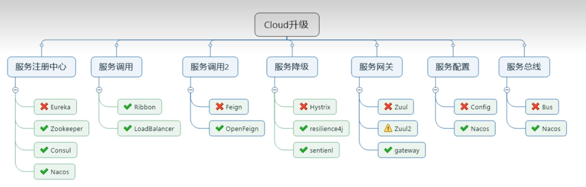

本笔记所采用软件版本，软件Cloud和Boot有适配问题，上Spring官网，可以看到Cloud对应Boot的版本对应关系。

| 软件          | 版本          |
| ------------- | ------------- |
| SpringCloud   | Hoxton.SR1    |
| SpringBoot    | 2.2.2.RELEASE |
| Cloud alibaba | 2.1.0.RELEASE |
| JAVA          | JDK8          |
| Maven         | 3.5以上       |
| Mysql         | 5.7以上       |

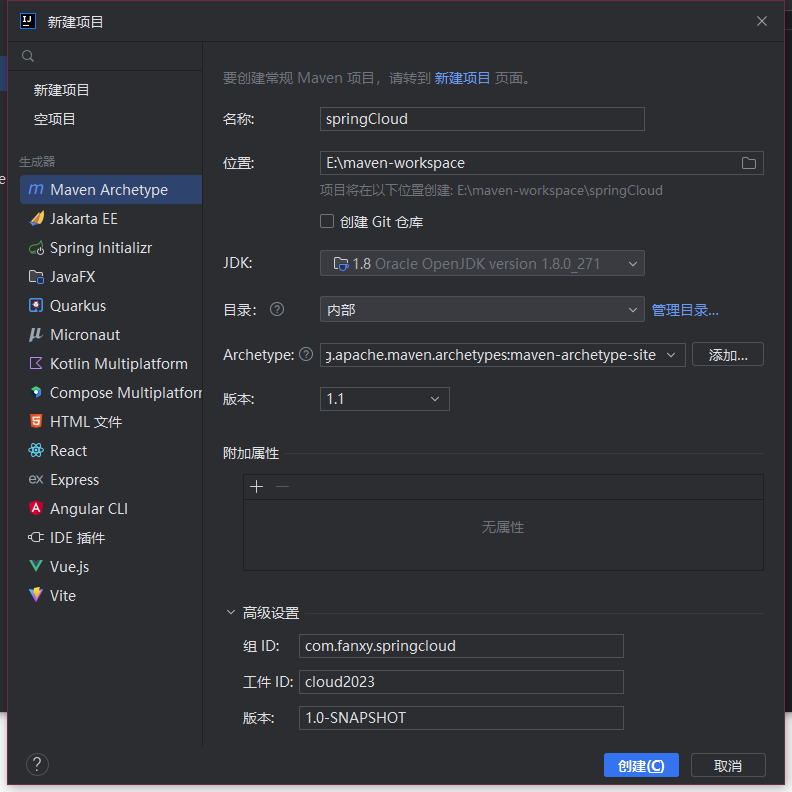

记得要打开注解驱动设置

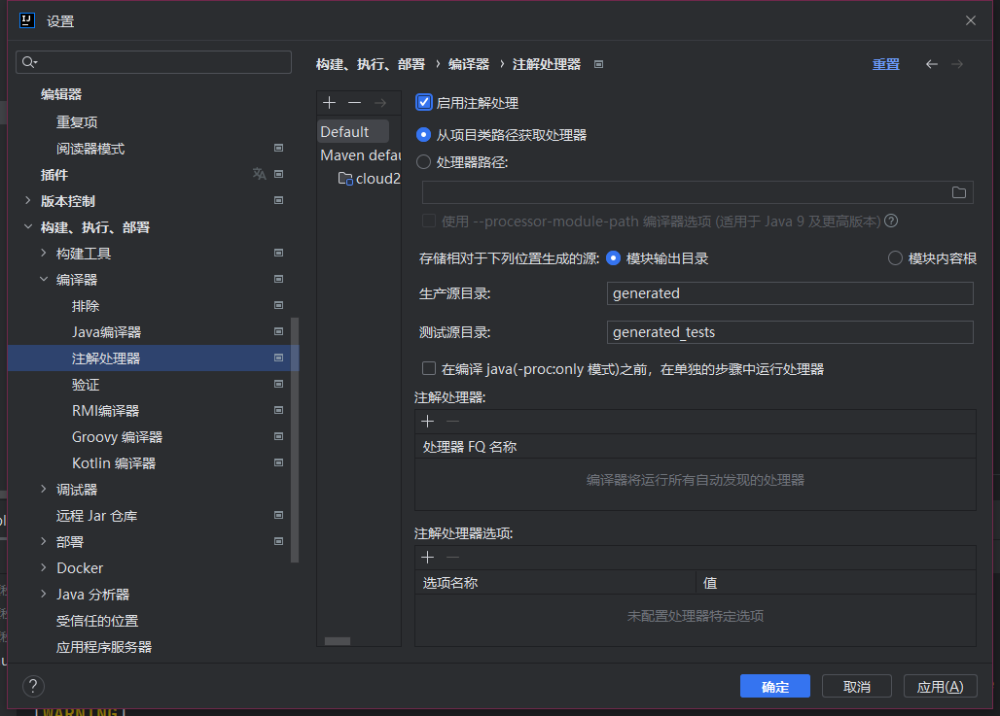

## 1.2. Maven文件

**dependencyManagement**

Maven 使用dependencyManagement 元素来提供了一种管理依赖版本号的方式。
**<font color="bb000">通常会在一个组织或者项目的最顶层的父POM 中看到dependencyManagement 元素。</font>**

使用pom.xml 中的dependencyManagement 元素能让所有在子项目中引用一个依赖而不用显式的列出版本号。
Maven 会沿着父子层次向上走，直到找到一个拥有dependencyManagement 元素的项目，然后它就会使用这个
dependencyManagement 元素中指定的版本号。

这样做的好处就是：如果有多个子项目都引用同一样依赖，则可以避免在每个使用的子项目里都声明一个版本号，这样当想升级或切换到另一个版本时，只需要在顶层父容器里更新，而不需要一个一个子项目的修改 ；另外如果某个子项目需要另外的一个版本，只需要声明version就可。

*     **<font color="bb000">dependencyManagement里只是声明依赖，并不实现引入，因此子项目需要显示的声明需要用的依赖。</font>**

*   **<font color="bb000">如果不在子项目中声明依赖，是不会从父项目中继承下来的；只有在子项目中写了该依赖项，并且没有指定具体版本，才会从父项目中继承该项，并且version和scope都读取自父pom;</font>**
    
*     如果子项目中指定了版本号，那么会使用子项目中指定的jar版本。

**<font color="bb000">指定跳过Maven的测试生命周期</font>**

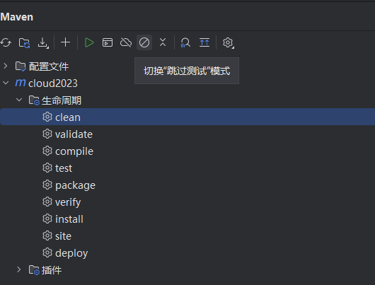

```xml
<?xml version="1.0" encoding="UTF-8"?>
<project xmlns="http://maven.apache.org/POM/4.0.0"
         xmlns:xsi="http://www.w3.org/2001/XMLSchema-instance"
         xsi:schemaLocation="http://maven.apache.org/POM/4.0.0 http://maven.apache.org/xsd/maven-4.0.0.xsd">
    <modelVersion>4.0.0</modelVersion>

    <groupId>com.fanxy.springcloud</groupId>
    <artifactId>cloud2023</artifactId>
    <version>1.0-SNAPSHOT</version>
    <packaging>pom</packaging>

  <modules>
    <module>cloud-provider-payment8001</module>
  </modules>

  <!--统一管理jar包版本-->
  <properties>
    <project.build.sourceEncoding>UTF-8</project.build.sourceEncoding>
    <maven.compiler.source>8</maven.compiler.source>
    <maven.compiler.target>8</maven.compiler.target>
    <junit.version>4.12</junit.version>
    <lombok.version>1.18.10</lombok.version>
    <log4j.version>1.2.17</log4j.version>
    <mysql.version>5.1.47</mysql.version>
    <druid.version>1.1.16</druid.version>
    <mybatis.spring.boot.version>1.3.0</mybatis.spring.boot.version>
  </properties>

  <!--子模块继承之后，提供作用：锁定版本+子module不用谢groupId和version-->
  <dependencyManagement>
  <dependencies>
  <!--spring boot 2.2.2-->
  <dependency>
    <groupId>org.springframework.boot</groupId>
    <artifactId>spring-boot-dependencies</artifactId>
    <version>2.2.2.RELEASE</version>
    <type>pom</type>
    <scope>import</scope>
  </dependency>
  <!--spring cloud Hoxton.SR1-->
  <dependency>
    <groupId>org.springframework.cloud</groupId>
    <artifactId>spring-cloud-dependencies</artifactId>
    <version>Hoxton.SR1</version>
    <type>pom</type>
    <scope>import</scope>
  </dependency>
  <!--spring cloud 阿里巴巴-->
  <dependency>
    <groupId>com.alibaba.cloud</groupId>
    <artifactId>spring-cloud-alibaba-dependencies</artifactId>
    <version>2.1.0.RELEASE</version>
    <type>pom</type>
    <scope>import</scope>
  </dependency>
  <!--mysql-->
  <dependency>
    <groupId>mysql</groupId>
    <artifactId>mysql-connector-java</artifactId>
    <version>${mysql.version}</version>
    <scope>runtime</scope>
  </dependency>
  <!-- druid-->
  <dependency>
    <groupId>com.alibaba</groupId>
    <artifactId>druid</artifactId>
    <version>${druid.version}</version>
  </dependency>
    <!--mybatis-->
    <dependency>
      <groupId>org.mybatis.spring.boot</groupId>
      <artifactId>mybatis-spring-boot-starter</artifactId>
      <version>${mybatis.spring.boot.version}</version>
    </dependency>
    <!--junit-->
    <dependency>
      <groupId>junit</groupId>
      <artifactId>junit</artifactId>
      <version>${junit.version}</version>
    </dependency>
    <!--log4j-->
    <dependency>
      <groupId>log4j</groupId>
      <artifactId>log4j</artifactId>
      <version>${log4j.version}</version>
    </dependency>
  </dependencies>

  </dependencyManagement>
  <build>
    <plugins>
      <plugin>
        <groupId>org.springframework.boot</groupId>
        <artifactId>spring-boot-maven-plugin</artifactId>
        <version>2.5.0</version>
        <configuration>
          <fork>true</fork>
          <addResources>true</addResources>
        </configuration>
      </plugin>
    </plugins>
  </build>

</project>
```

## 1.3. 微服务提供者支付Module模块

```sh
cloud-provider-payment8001
```

### 1.3.1. 改POM文件

```xml
<project xmlns="http://maven.apache.org/POM/4.0.0" xmlns:xsi="http://www.w3.org/2001/XMLSchema-instance"
         xsi:schemaLocation="http://maven.apache.org/POM/4.0.0 http://maven.apache.org/xsd/maven-4.0.0.xsd">
    <modelVersion>4.0.0</modelVersion>
    <parent>
        <groupId>com.fanxy.springcloud</groupId>
        <artifactId>cloud2023</artifactId>
        <version>1.0-SNAPSHOT</version>
    </parent>

    <artifactId>cloud-provider-payment8001</artifactId>
    <packaging>jar</packaging>

    <name>cloud-provider-payment8001</name>
    <url>http://maven.apache.org</url>

    <properties>
        <project.build.sourceEncoding>UTF-8</project.build.sourceEncoding>
    </properties>

    <dependencies>
        <dependency>
            <groupId>org.springframework.boot</groupId>
            <artifactId>spring-boot-starter-web</artifactId>
        </dependency>
        <dependency>
            <groupId>org.springframework.boot</groupId>
            <artifactId>spring-boot-starter-actuator</artifactId>
        </dependency>
        <dependency>
            <groupId>org.mybatis.spring.boot</groupId>
            <artifactId>mybatis-spring-boot-starter</artifactId>
        </dependency>
        <dependency>
            <groupId>com.alibaba</groupId>
            <artifactId>druid-spring-boot-starter</artifactId>
        </dependency>
        <!--mysql-connector-java-->
        <dependency>
            <groupId>mysql</groupId>
            <artifactId>mysql-connector-java</artifactId>
        </dependency>
        <!--jdbc-->
        <dependency>
            <groupId>org.springframework.boot</groupId>
            <artifactId>spring-boot-starter-jdbc</artifactId>
        </dependency>
        <dependency>
            <groupId>org.springframework.boot</groupId>
            <artifactId>spring-boot-devtools</artifactId>
            <scope>runtime</scope>
            <optional>true</optional>
        </dependency>
        <dependency>
            <groupId>org.projectlombok</groupId>
            <artifactId>lombok</artifactId>
            <optional>true</optional>
        </dependency>
        <dependency>
            <groupId>org.springframework.boot</groupId>
            <artifactId>spring-boot-starter-test</artifactId>
            <scope>test</scope>
        </dependency>
    </dependencies>
</project>
```

### 1.3.2. 写yml文件和主程序

```yml
server:
  port: 8001


spring:
  application:
    name: cloud-payment-service
  datasource:
    type: com.alibaba.druid.pool.DruidDataSource         # 当前数据源操作类型
    driver-class-name: com.mysql.cj.jdbc.Driver              # mysql驱动包 com.mysql.jdbc.Driver
    url: jdbc:mysql://localhost:13306/db2023?useUnicode=true&characterEncoding=utf-8&useSSL=false
    username: root
    password: xxxxxxxx

mybatis:
  mapperLocations: classpath:mapper/*.xml
  type-aliases-package: com.fanxy.springcloud.entities    # 所有Entity别名类所在包
```

```java
@SpringBootApplication
public class PaymentMain8001 {
    public static void main(String[] args) {
        SpringApplication.run(PaymentMain8001.class, args);
    }
}
```

### 1.3.3. 业务类

#### 1. 建表SQL

**本篇强调的是Cloud，所以SQL并不复杂，就一个主键一个流水号。直接建库建表就行。**

```sql
CREATE DATABASE db2023;
USE db2023;
CREATE TABLE `payment` (
                           
    `id` bigint(20) NOT NULL AUTO_INCREMENT COMMENT 'ID',                      
    `serial` varchar(200) DEFAULT '',                  
     PRIMARY KEY (`id`)
    
) ENGINE=InnoDB AUTO_INCREMENT=1 DEFAULT CHARSET=utf8
```

#### 2. Entities

**订单实体类**

```java
@Data
@NoArgsConstructor
@AllArgsConstructor
public class Payment implements Serializable {
    private Long id;
    private String serial;
}
```

**为了前后端分离，需要把返回给前端的数据封装成一个具有Http状态码，消息，以及包装传递数据的类。这里有可能我们的数据为Null，就还要写一个两个参数的构造器**

```java
@Data
@AllArgsConstructor
@NoArgsConstructor
public class CommonResult<T> {

    private Integer code;
    private String message;
    private T data;

    public CommonResult(Integer code, String message) {
        this(code, message, null);
    }
}
```

#### 3. Mapper

**这里更推荐使用`@Mapper`是`Java apache`下的注解，而使用`@Repository`更多是注解在实现类，即以前不用`Mybatis`的时候。<font color="bb000">更简单的：雷神在`Springboot`教过，直接在启动类注解`@MapperScan(baseOacjages = "com.xx.xx")`即可。可能会爆红在注入的时候，因为`IDEA`不知道把对应的`mapper`注入了，无需理会</font>**

```java
@Mapper                       
public interface PaymentMapper {

    public int create(Payment payment);

    public Payment getPaymentById(@Param("id") Long id);
}
```

**这里`mapper`的`xml`，我这里使用`mybatis-x`插件一键生成，然后一定要遵循规范，尽量查询的返回类型使用`ResultMap`而不是实体类型，因为未必每个人都会遵循命名规范。**

```xml
<?xml version="1.0" encoding="UTF-8" ?>
<!DOCTYPE mapper PUBLIC "-//mybatis.org//DTD Mapper 3.0//EN" "http://mybatis.org/dtd/mybatis-3-mapper.dtd" >
<mapper namespace="com.fanxy.springcloud.mapper.PaymentMapper">

    <!--public int create(Payment payment);-->
    <insert id="create" parameterType="payment" useGeneratedKeys="true" keyProperty="id">
        INSERT INTO payment (serial) VALUES (#{serial})
    </insert>

    <!-- public Payment getPaymentById(@Param("id") Long id);-->
    <resultMap id="BaseResultMap" type="com.fanxy.springcloud.entities.Payment">
        <id column="id" property="id" jdbcType="BIGINT"/>
        <result column="serial" property="serial" jdbcType="VARCHAR"/>
    </resultMap>
    <select id="getPaymentById" parameterType="long" resultMap="BaseResultMap">
        SELECT id, serial FROM payment WHERE id = #{id}
    </select>

</mapper>
```

#### 4. Service

**接口类**

```java
public interface PaymentService {
    public int create(Payment payment);
    public Payment getPaymentById(Long id);
}
```

**实现类**

```java
@Service
public class PaymentServiceImpl implements PaymentService {

    @Autowired
    private PaymentMapper paymentMapper;

    public int create(Payment payment){
        return paymentMapper.create(payment);
    }

    public Payment getPaymentById(Long id){
        return paymentMapper.getPaymentById(id);
    }
}
```

#### 5. Controller

```java
@RestController
@Slf4j
public class PaymentController {

    @Autowired
    private PaymentService paymentService;

    @PostMapping("/payment/create")
    public CommonResult create(Payment payment) {
        int result = paymentService.create(payment);
        log.info("*********插入结果: " + result);

        if (result > 0) {
            return new CommonResult(200, "插入数据库成功", result);
        } else {
            return new CommonResult(444, "插入数据库失败", null);
        }
    }

    @GetMapping("/payment/get/{id}")
    public CommonResult getPaymentById(@PathVariable("id") Long id) {
        Payment payment = paymentService.getPaymentById(id);
        log.info("*********插入结果: " + payment);

        if (payment != null) {
            return new CommonResult(200, "查询成功", payment);
        } else {
            return new CommonResult(444, "查询失败,没有对应的id:" + id, null);
        }
    }
}
```

### 1.3.4. 总结

利用`PostMan`测试，发现可以正常插入数据，并且查询到数据，此时第一个模块完成。

整个微服务的模块开发流程

1. 建module
2. 改Pom
3. 写YML
4. 主启动
5. 业务类

### 1.3.5. <font color="bb000">开启Run DshBoard</font>

在左下角的服务，点击添加`Springboot`服务，即可自动导入并显示

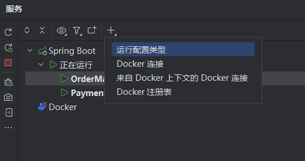

## 1.4. 微服务消费者订单Module模块

```sh
cloud-consumer-order80
```

### 1.4.1. 改POM文件

```xml
<project xmlns="http://maven.apache.org/POM/4.0.0" xmlns:xsi="http://www.w3.org/2001/XMLSchema-instance"
         xsi:schemaLocation="http://maven.apache.org/POM/4.0.0 http://maven.apache.org/xsd/maven-4.0.0.xsd">
    <modelVersion>4.0.0</modelVersion>
    <parent>
        <groupId>com.fanxy.springcloud</groupId>
        <artifactId>cloud2023</artifactId>
        <version>1.0-SNAPSHOT</version>
    </parent>

    <artifactId>cloud-consumer-order80</artifactId>
    <packaging>jar</packaging>

    <name>cloud-consumer-order80</name>
    <url>http://maven.apache.org</url>

    <properties>
        <project.build.sourceEncoding>UTF-8</project.build.sourceEncoding>
    </properties>

    <dependencies>
        <dependency>
            <groupId>org.springframework.boot</groupId>
            <artifactId>spring-boot-starter-web</artifactId>
        </dependency>
        <dependency>
            <groupId>org.springframework.boot</groupId>
            <artifactId>spring-boot-starter-actuator</artifactId>
        </dependency>

        <dependency>
            <groupId>org.springframework.boot</groupId>
            <artifactId>spring-boot-devtools</artifactId>
            <scope>runtime</scope>
            <optional>true</optional>
        </dependency>
        <dependency>
            <groupId>org.projectlombok</groupId>
            <artifactId>lombok</artifactId>
            <optional>true</optional>
        </dependency>
        <dependency>
            <groupId>org.springframework.boot</groupId>
            <artifactId>spring-boot-starter-test</artifactId>
            <scope>test</scope>
        </dependency>
    </dependencies>
</project>
```

### 1.4.2. 写yml文件和主程序

```yaml
server:
  port: 80
```

```java
@SpringBootApplication
public class OrderMain80 {
    public static void main(String[] args) {
        SpringApplication.run(OrderMain80.class, args);
    }
}
```

### 1.4.3. RestTemplate和业务类

作为80端口即门面，我们理应不存在`Service`能对底层数据库进行操作的能力，故这里应该只存在`Controller`，那我们该如何调用提供者的模块呢？

**`RestTemplate`提供了多种便捷访问远程`Http`服务的方法**
**是一种简单便捷的访问`restful`服务模板类，是`Spring`提供的用于访问`Rest`服务的<font color="bb000">客户端模板工具集</font>**

官网地址  https://docs.spring.io/spring-framework/docs/5.2.2.RELEASE/javadoc-api/org/springframework/web/client/RestTemplate.html
**使用`restTemplate`访问`restful`接口非常的简单粗暴无脑。有三个参数：**
**`(url, requestMap, ResponseBean.class)`**

**`REST`请求地址、请求参数、`HTTP`响应转换被转换成的对象类型。**

通过配置类给容器注入

```java
@Configuration
public class ApplicationContextConfig {
    
    @Bean
    public RestTemplate restTemplate(){
        return new RestTemplate();
    }
}
```

 写好`Controller`这里为了区分度，也能更好地明白关系，将80这里声明为`consumer`

```java
@RestController
@Slf4j
public class OrderController {

    public static final String PAYMENT_URL = "http://localhost:8001";

    @Autowired
    private RestTemplate restTemplate;

    @GetMapping("/consumer/payment/create")
    public CommonResult<Payment> create(Payment payment){
        return restTemplate.postForObject(PAYMENT_URL + "/payment/create", payment, CommonResult.class);
    }

    @GetMapping("/consumer/payment/get/{id}")
    public CommonResult<Payment> getPaymentById(@PathVariable("id") Long id){
        return restTemplate.getForObject(PAYMENT_URL + "/payment/get/" + id, CommonResult.class);
    }
}
```

此时同时启动两个微服务，直接浏览器通过访问消费者的链接，发现可以完成微服务的互相访问

**<font color='bb000'>但是！通过消费者创建消费者，数据库有主键，但是没有数据，是`NULL`。这是因为跨服务访问，需要在我们的`8001`服务的请求加`@RequstBody`，它可以获取请求体，需要在控制器方法设置一个形参，使用`@RequestBody`进行标识，当前请求的请求体就会为当前注解所标识的形参赋值。`@RequsetBody` 的请求参数是转化为JSON字符串形式，而通过`RestTemplate`传过来的是json数据</font>**

## 1.5. 工程重构

**我们发现无论是前后端交互的实体类，还是订单类，这种实体类如果在每个微服务模块都去写，实在是太冗余，所以我们需要重构一下我们的代码。** 

### 1.5.1. 建立模块 + POM文件

```sh
cloud-api-commons
```

这里导入了`hutool` 工具包，后续会详细进行讲解，可以很方便完成很多操作如时间。

```xml
<project xmlns="http://maven.apache.org/POM/4.0.0" xmlns:xsi="http://www.w3.org/2001/XMLSchema-instance"
         xsi:schemaLocation="http://maven.apache.org/POM/4.0.0 http://maven.apache.org/xsd/maven-4.0.0.xsd">
    <modelVersion>4.0.0</modelVersion>
    <parent>
        <groupId>com.fanxy.springcloud</groupId>
        <artifactId>cloud2023</artifactId>
        <version>1.0-SNAPSHOT</version>
    </parent>

    <artifactId>cloud-api-common</artifactId>
    <packaging>jar</packaging>

    <name>cloud-api-common</name>
    <url>http://maven.apache.org</url>

    <properties>
        <project.build.sourceEncoding>UTF-8</project.build.sourceEncoding>
    </properties>

    <dependencies>
        <dependency>
            <groupId>org.springframework.boot</groupId>
            <artifactId>spring-boot-devtools</artifactId>
            <scope>runtime</scope>
            <optional>true</optional>
        </dependency>
        <dependency>
            <groupId>org.projectlombok</groupId>
            <artifactId>lombok</artifactId>
            <optional>true</optional>
        </dependency>
        <dependency>
            <groupId>cn.hutool</groupId>
            <artifactId>hutool-all</artifactId>
            <version>5.1.0</version>
        </dependency>
    </dependencies>

</project>
```

### 1.5.2 实体类转移


**将其他两个模块的实体类的包和类转移过来，然后把他们的进行删除，然后我们对`Maven`进行`clean`操作，然后进行`install`，然后对另外两个模块进行`Maven`引入**

```xml
        <dependency><!-- 引入自己定义的api通用包，可以使用Payment支付Entity -->
            <groupId>com.fanxy.springcloud</groupId>
            <artifactId>cloud-api-commons</artifactId>
            <version>${project.version}</version>
        </dependency>
```

# 2. Eureka服务注册与发现

## 2.1. Eureka基础知识

### 2.1.1. 什么是服务治理

`Spring Cloud` 封装了 `Netflix` 公司开发的 `Eureka` 模块来实现<font color="bb000">服务治理</font>

在传统的`rpc`远程调用框架中，管理每个服务与服务之间依赖关系比较复杂，管理比较复杂，所以需要使用服务治理，管理服务于服务之间依赖关系，可以实现服务调用、负载均衡、容错等，实现服务发现与注册。

### 2.1.2. 什么是服务注册

Eureka采用了CS的设计架构，Eureka Server 作为服务注册功能的服务器，它是服务注册中心。而系统中的其他微服务，使用 Eureka的客户端连接到 Eureka Server并维持**心跳连接**。这样系统的维护人员就可以通过 `Eureka Server` 来监控系统中各个微服务是否正常运行。

**在服务注册与发现中，有一个注册中心。当服务器启动的时候，会把当前自己服务器的信息 比如 服务地址通讯地址等以别名方式注册到注册中心上。另一方（消费者|服务提供者），以该别名的方式去注册中心上获取到实际的服务通讯地址，然后再实现本地RPC调用RPC远程调用框架核心设计思想：在于注册中心，因为使用注册中心管理每个服务与服务之间的一个依赖关系(服务治理概念)。在任何rpc远程框架中，都会有一个注册中心(存放服务地址相关信息(接口地址)**

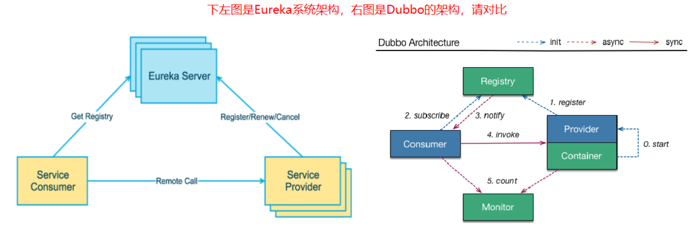

### 2.1.3. Eureka两组件

**<font color="000bb">Eureka包含两个组件：Eureka Server和Eureka Client</font>**

**<font color="bb000">`Eureka Server`</font>提供服务注册服务**
**各个微服务节点通过配置启动后，会在EurekaServer中进行注册，这样EurekaServer中的服务注册表中将会存储所有可用服务节点的信息，服务节点的信息可以在界面中直观看到。**

**<font color="bb000">`EurekaClient`</font>通过注册中心进行访问**
**是一个`Java`客户端，用于简化`Eureka Server`的交互，客户端同时也具备一个内置的、使用轮询(`round-robin`)负载算法的负载均衡器。在应用启动后，将会向`Eureka Server`发送心跳(默认周期为`30`秒)。如果`Eureka Server`在多个心跳周期内没有接收到某个节点的心跳，`EurekaServer`将会从服务注册表中把这个服务节点移除（默认`90`秒）**

## 2.2. 单机Eureka构建步骤

此时我们的之前的代码构建，80作为消费者，8001作为服务提供者，是直接调用的，现在我们将要通过`Eureka`，端口号7001添加服务注册和服务发现。

### 2.2.1. 将cloud-eureka-server7001注册为EurekaServer

#### 1. 建立模块改POM

```sh
cloud-eureka-server7001
```

```xml
以前的老版本（当前使用2018）
<dependency>
        <groupId>org.springframework.cloud</groupId>
        <artifactId>spring-cloud-starter-eureka</artifactId>
</dependency>
```

```xml
现在新版本（当前使用2020.2）
<dependency>
    <groupId>org.springframework.cloud</groupId>
    <artifactId>spring-cloud-starter-netflix-eureka-server</artifactId>
</dependency>
```

```xml
<project xmlns="http://maven.apache.org/POM/4.0.0" xmlns:xsi="http://www.w3.org/2001/XMLSchema-instance"
         xsi:schemaLocation="http://maven.apache.org/POM/4.0.0 http://maven.apache.org/xsd/maven-4.0.0.xsd">
    <modelVersion>4.0.0</modelVersion>
    <parent>
        <groupId>com.fanxy.springcloud</groupId>
        <artifactId>cloud2023</artifactId>
        <version>1.0-SNAPSHOT</version>
    </parent>

    <artifactId>cloud-eureka-server7001</artifactId>
    <packaging>jar</packaging>

    <name>cloud-eureka-server7001</name>
    <url>http://maven.apache.org</url>

    <properties>
        <project.build.sourceEncoding>UTF-8</project.build.sourceEncoding>
    </properties>

    <dependencies>
        <!--eureka-server-->
        <dependency>
            <groupId>org.springframework.cloud</groupId>
            <artifactId>spring-cloud-starter-netflix-eureka-server</artifactId>
        </dependency>
        <!-- 引入自己定义的api通用包，可以使用Payment支付Entity -->
        <dependency>
            <groupId>com.fanxy.springcloud</groupId>
            <artifactId>cloud-api-commons</artifactId>
            <version>1.0-SNAPSHOT</version>
        </dependency>
        <!--boot web actuator-->
        <dependency>
            <groupId>org.springframework.boot</groupId>
            <artifactId>spring-boot-starter-web</artifactId>
        </dependency>
        <dependency>
            <groupId>org.springframework.boot</groupId>
            <artifactId>spring-boot-starter-actuator</artifactId>
        </dependency>
        <!--一般通用配置-->
        <dependency>
            <groupId>org.springframework.boot</groupId>
            <artifactId>spring-boot-devtools</artifactId>
            <scope>runtime</scope>
            <optional>true</optional>
        </dependency>
        <dependency>
            <groupId>org.projectlombok</groupId>
            <artifactId>lombok</artifactId>
        </dependency>
        <dependency>
            <groupId>org.springframework.boot</groupId>
            <artifactId>spring-boot-starter-test</artifactId>
            <scope>test</scope>
        </dependency>
        <dependency>
            <groupId>junit</groupId>
            <artifactId>junit</artifactId>
        </dependency>
    </dependencies>

</project>
```

#### 2. 建立yaml

**配置文件这里写明不向注册中心注册自己，而url通过上面的配置进行拼接**

```yaml
server:
  port: 7001

eureka:
  instance:
    hostname: localhost #eureka服务端的实例名称
  client:
    #false表示不向注册中心注册自己。
    register-with-eureka: false
    #false表示自己端就是注册中心，我的职责就是维护服务实例，并不需要去检索服务
    fetch-registry: false
    service-url:
      #设置与Eureka Server交互的地址查询服务和注册服务都需要依赖这个地址。
      defaultZone: http://${eureka.instance.hostname}:${server.port}/eureka/
```

#### 3. 主启动 @EnableEurekaServer

这里由于`7001`是`EurekaServer`端，故需要在主启动写明注解配置

```java
@SpringBootApplication
@EnableEurekaServer
public class EurekaMain7001 {
    public static void main(String[] args) {
        SpringApplication.run(EurekaMain7001.class, args);
    }
}
```

**此时启动主程序，即可直接通过对应的`ip:7001`通过浏览器访问到`Eureka`的网页控制端。**

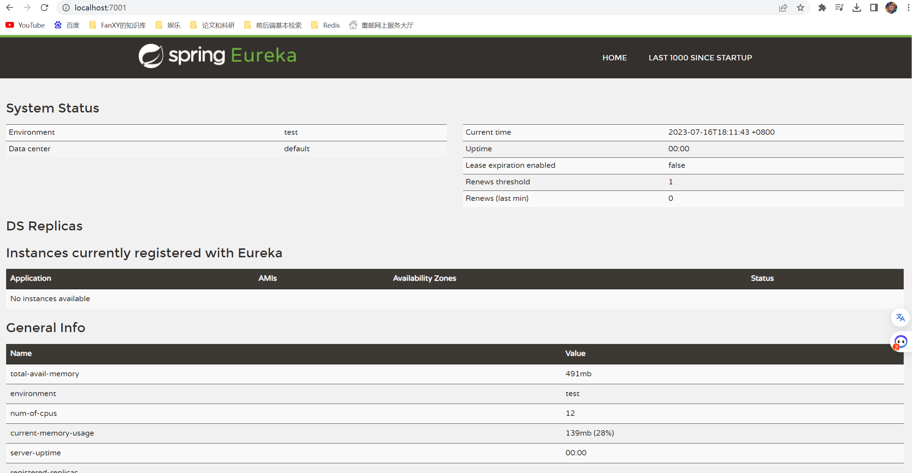

### 2.2.2. 将cloud-provider-payment8001注册入Eureka成为服务提供者

#### 1. 改POM

**把对应的`client`的`maven`配置文件导入`8001`模块**

```xml
以前老版本 别再使用
<dependency>
        <groupId>org.springframework.cloud</groupId>
        <artifactId>spring-cloud-starter-eureka</artifactId>
</dependency>

现在新版本 当前使用
<dependency>
    <groupId>org.springframework.cloud</groupId>
    <artifactId>spring-cloud-starter-netflix-eureka-client</artifactId>
</dependency>
```

#### 2. 改yaml

**微服务的名称记得不要随便改，因为我们注册会把这个名称注册到Eureka的服务端，然后加入eureka的client端的配置，然后主启动的主程序加上 `@EnaleEurekaClient`主解，完成注册的配置**

```yaml
eureka:
  client:
    #表示是否将自己注册进EurekaServer默认为true。
    register-with-eureka: true
    #是否从EurekaServer抓取已有的注册信息，默认为true。单节点无所谓，集群必须设置为true才能配合ribbon使用负载均衡
    fetchRegistry: true
    service-url:
      defaultZone: http://localhost:7001/eureka
```

**此时我们先启动`7001`的情况下，如果启动`8001`，在我们之前的网页端就能看到它被注册进来了。名称就是我们之前定义的`application-name`，而`status`可以看到实例的主机和模块名称和端口号**

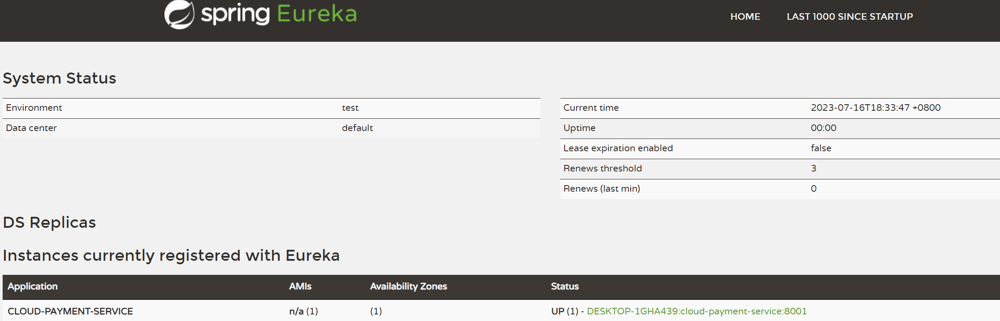

### 2.2.3. 将cloud-consumer-order80注册入Eureka成为服务消费者

#### 1. 改POM

**把对应的`client`的`maven`配置文件导入`80`模块**

```xml
<dependency>
    <groupId>org.springframework.cloud</groupId>
    <artifactId>spring-cloud-starter-netflix-eureka-client</artifactId>
</dependency>
```

#### 2. 改yaml

**微服务的名称记得不要随便改，因为我们注册会把这个名称注册到Eureka的服务端，然后加入eureka的client端的配置，然后主启动的主程序加上 `@EnaleEurekaClient`主解，完成注册的配置**

```yaml
spring:
    application:
        name: cloud-order-service

eureka:
  client:
    #表示是否将自己注册进EurekaServer默认为true。
    register-with-eureka: true
    #是否从EurekaServer抓取已有的注册信息，默认为true。单节点无所谓，集群必须设置为true才能配合ribbon使用负载均衡
    fetchRegistry: true
    service-url:
      defaultZone: http://localhost:7001/eureka
```

**红色字体是Eureka的自我保护机制，不用理会** 

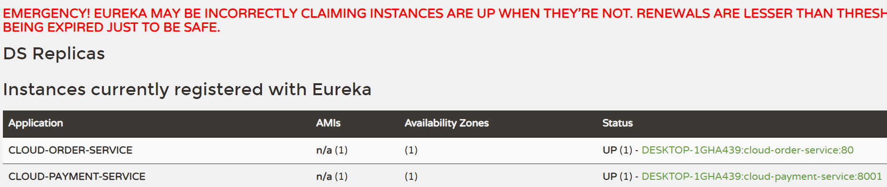

## 2.3. 集群Eureka构建步骤

### 2.3.1. Eureka集群原理说明

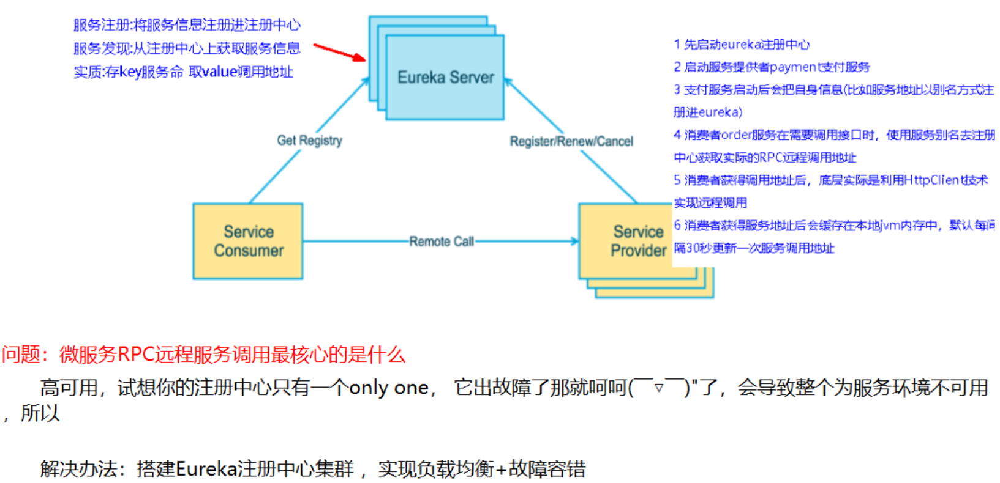

`Eureka Server`集群的每个都会互相记录互相注册，并互相守望。

### 2.3.2. Eureka集群模块搭建

#### 1. 模块搭建

```sh
cloud-eureka-server7002
```

**pom文件和`7001`完全相同，而主程序名称就是`EurekaMain7002`，和`7001`一样需要添加`@SpringbootAppilicationContext`配置类注解，和`@EnableEurekaServer`。**

**而配置文件显然我们无法和之前一样，因为我们之前直接使用`localhost`，现在虽然端口号不同，但是无法体现出是两台机器，这里就修改host文件，添加本机的ip域名映射**

```sh
127.0.0.1 eureka7001.com
127.0.0.1 eureka7002.com
```

**而配置文件我们为了完成相互守望，需要把`service-url`更改为对方的，如果是三台及其以上就添加即可。使用逗号分割，下面是7002机器的配置文件，7001对称修改即可**

```yaml
server:
  port: 7002

eureka:
  instance:
    hostname: eureka7002.com #eureka服务端的实例名称
  client:
    #false表示不向注册中心注册自己。
    register-with-eureka: false
    #false表示自己端就是注册中心，我的职责就是维护服务实例，并不需要去检索服务
    fetch-registry: false
    service-url:
      #设置与Eureka Server交互的地址查询服务和注册服务都需要依赖这个地址。
      defaultZone: http://eureka7001.com:7001/eureka/
```

#### 2. 将消费者80和生产者8001配置入集群

**两个都更改`yaml`配置文件，主要是yaml配置文件的`eureka` 的`url`同时填写相应全部的`url`，其他不需要改变**

```yaml
eureka:
  client:
    #表示是否将自己注册进EurekaServer默认为true。
    register-with-eureka: true
    #是否从EurekaServer抓取已有的注册信息，默认为true。单节点无所谓，集群必须设置为true才能配合ribbon使用负载均衡
    fetchRegistry: true
    service-url:
      defaultZone: http://eureka7001.com:7001/eureka,http://eureka7002.com:7002/eureka
```

此时按顺序启动`7001/7002`，`8001`，`80`，完美启动。

### 2.3.3. 订单服务的集群搭建

#### 1. 模块搭建【复制部分】

```sh
cloud-provider-payment8002
```

**`pom`文件应该和`8001`没有区别，主程序也是把名称换成`8002`，其他的包和mapper文件全部复制过来，而`yaml`配置文件把端口号改为`8002`即可。而微服务名称都保持一致，不需要更改**

#### 2. 修改Controller【变化部分】

**虽然我们配置文件部分两个都是一个微服务的名称，但是端口号不同，我们也不知道到底后台调用了哪个，甚至我们也不知道到底是否它们此时构建了负载均衡，所以我们通过`@Value`读取配置文件的值，传给前端的数据可以写出端口号，这样在前台就知道后端到底有没有成功完成集群工作**

```java
@RestController
@Slf4j
public class PaymentController {

    @Autowired
    private PaymentService paymentService;
    
    @Value("${server.port}")
    private String serverPort;
    
    @PostMapping("/payment/create")
    public CommonResult create(@RequestBody Payment payment) {
        int result = paymentService.create(payment);
        log.info("*********插入结果: " + result);

        if (result > 0) {
            return new CommonResult(200, "插入数据库成功, 端口号为: " + serverPort, result);
        } else {
            return new CommonResult(444, "插入数据库失败", null);
        }
    }

    @GetMapping("/payment/get/{id}")
    public CommonResult getPaymentById(@PathVariable("id") Long id) {
        Payment payment = paymentService.getPaymentById(id);
        log.info("*********插入结果: " + payment);

        if (payment != null) {
            return new CommonResult(200, "查询成功, 端口号为: " + serverPort, payment);
        } else {
            return new CommonResult(444, "查询失败,没有对应的id:" + id, null);
        }
    }
}
```

依次启动，从`Eureka`前台观看服务注册

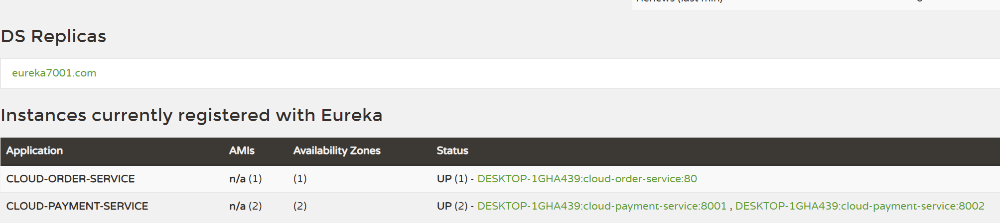

**我们发现集群构建成功，单独测试不经过消费者微服务，我们选择对应的端口号，能获取对应端口号获取的消息但是当我们使用消费者微服务，调用的情况下，发现无论访问多少次，永远都是同一个端口号返回的信息。**

**这是因为我们最开始配置的时候，就在消费者微服务端写死了访问的url，我们应该修改为微服务的名称，也就是在Eureka界面看到的服务名称<font color="bb000">【大小写均可】</font>**

```java
    // public static final String PAYMENT_URL = "http://localhost:8001";
    public static final String PAYMENT_URL = "http://CLOUD-PAYMENT-SERVICE";
```

**但是此时再调用消费者访问，发现直接保存白页，无法找到对应的主机名，这是因为我们通过消费者调用生产者，是通过RestTemplate完成的，而它在此时并不知道到底该访问哪个生产者，需要我们给配置类注入的`restTemplate`加入注解`@LoadBalanced`**

```java
@Configuration
public class ApplicationContextBean
{
    @Bean
    @LoadBalanced //使用@LoadBalanced注解赋予RestTemplate负载均衡的能力
    public RestTemplate getRestTemplate()
    {
        return new RestTemplate();
    }
}
```

进行调用消费者访问

```sh
http://localhost/consumer/payment/get/1
```

**此时发现端口号交替出现，可以访问到后端的生产者服务器，完成了轮询的负载均衡模式**

## 2.4. actuator微服务信息完善

### 2.4.1. 主机名称：服务名称修改

此前我们的界面这里有主机的名称，一般我们希望能通过点击进行跳转，而我们希望能直观看到域名，端口号，实例名称，而没有主机的名称

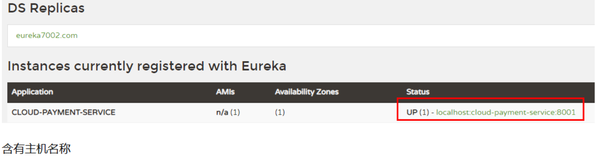

我们之前导入的这两个包，有了它们两个才能完成图形化界面的信息完善，第一个不必说，第二个就是图形化的包

```xml
        <dependency>
            <groupId>org.springframework.boot</groupId>
            <artifactId>spring-boot-starter-web</artifactId>
        </dependency>
        <dependency>
            <groupId>org.springframework.boot</groupId>
            <artifactId>spring-boot-starter-actuator</artifactId>
        </dependency>
```

**修改配置文件加入一个`id`即可**

```yaml
eureka:
  client:
    #表示是否将自己注册进EurekaServer默认为true。
    register-with-eureka: true
    #是否从EurekaServer抓取已有的注册信息，默认为true。单节点无所谓，集群必须设置为true才能配合ribbon使用负载均衡
    fetchRegistry: true
    service-url:
      defaultZone: http://eureka7001.com:7001/eureka,http://eureka7002.com:7002/eureka
  instance:
    instance-id: payment8001
```

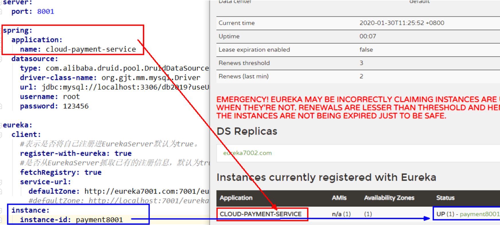

### 2.4.2. 访问信息有IP信息提示

**这里加入一个配置，开启`ip`前缀即可**

```yaml
eureka:
  client:
    #表示是否将自己注册进EurekaServer默认为true。
    register-with-eureka: true
    #是否从EurekaServer抓取已有的注册信息，默认为true。单节点无所谓，集群必须设置为true才能配合ribbon使用负载均衡
    fetchRegistry: true
    service-url:
      defaultZone: http://eureka7001.com:7001/eureka,http://eureka7002.com:7002/eureka  # 集群版
      #defaultZone: http://localhost:7001/eureka  # 单机版
  instance:
    instance-id: payment8001
    prefer-ip-address: true     #访问路径可以显示IP地址
```

## 2.5. 服务发现Discovery

**对于注册进`eureka`里面的微服务，可以通过服务发现来获得该服务的信息**

**这里我们以修改`8001`生产者的`Controller`为例子，展现服务发现能展示哪些信息。不仅能获得Eureka后台展示的各个微服务的名称信息，还能通过名称信息获取内部微服务对应的各个服务端的信息。**

```java
@RestController
@Slf4j
public class PaymentController {
    @Value("${server.port}")
    private String serverPort;

    @Resource
    private PaymentService paymentService;

    @Resource
    private DiscoveryClient discoveryClient;

    @PostMapping(value = "/payment/create")
    public CommonResult create(@RequestBody Payment payment){---------}

    @GetMapping(value = "/payment/get/{id}")
    public CommonResult<Payment> getPaymentById(@PathVariable("id") Long id){---------}

    @GetMapping(value = "/payment/discovery")
    public Object discovery() {
        List<String> services = discoveryClient.getServices();
        for (String element : services) {
            System.out.println(element);
        }

        List<ServiceInstance> instances = discoveryClient.getInstances("CLOUD-PAYMENT-SERVICE");
        for (ServiceInstance element : instances) {
            System.out.println(element.getServiceId() + "\t" + element.getHost() + "\t" + element.getPort() + "\t"
                    + element.getUri());
        }
        return this.discoveryClient;
    }
}
```

**同时主程序类需要添加`@EnableDiscoveryClient`注解。**

**<font color="bb000">新版本可以不加这两个注解: `@EnableDiscoveryClient`和`@EnableEurekaClient`</font>**

## 2.6. Eureka自我保护

### 2.6.1. 故障现象

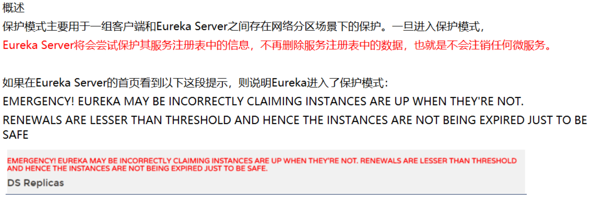

### 2.6.2. 导致原因

**一句话：某时刻某一个微服务不可用了，Eureka不会立刻清理，依旧会对该微服务的信息进行保存**

**属于CAP里面的AP分支**

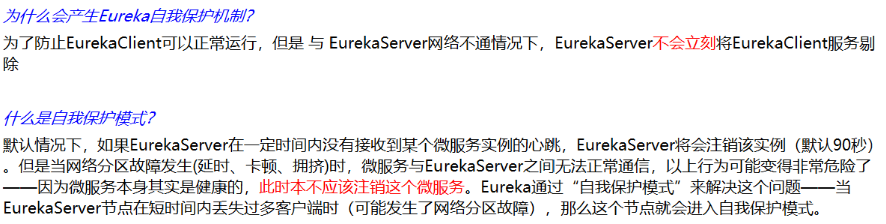

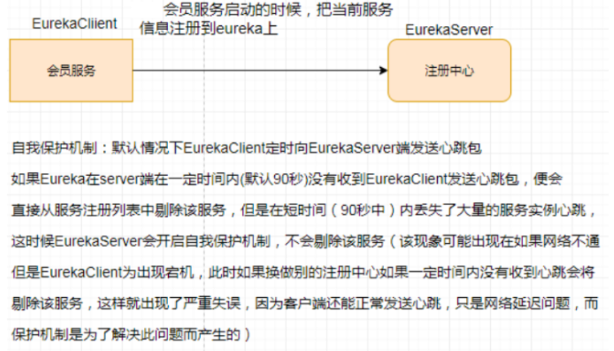


### 2.6.3. 怎么禁止自我保护

#### 1. 注册中心eureakeServer端7001

出厂默认，自我保护机制是开启的

```yaml
eureka:
  server:
    enable-self-preservation: true
```

使用如下配置可以禁用自我保护模式

```yaml
eureka: 
  server:
    enable-self-preservation: false 
```

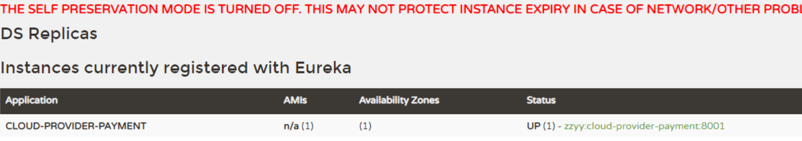

#### 2. 生产者客户端eureakeClient端8001

**`Eureka`的默认自动配置 单位为秒**

**`Eureka`客户端向服务端发送心跳的时间间隔，单位为秒(默认是30秒)**

```yaml
eureka:
  instance:
    lease-renewal-interval-in-seconds: 30
```

**`Eureka`服务端在收到最后一次心跳后等待时间上限，单位为秒(默认是90秒)，超时将剔除服务**

```yaml
eureka:
  instance:
    lease-expiration-duration-in-seconds: 90
```

**我们把这两个配置更改，然后手动断开`8001`，即可在`Eureka`网页端发现瞬间注册信息被删除**

# 3. Zookeeper服务注册和发现

## 3.1. 服务提供者

`zookeeper`是一个分布式协调工具，可以实现注册中心功能，这里我们`zookeeper`服务器取代`Eureka`服务器，`zk`作为服务注册中心，建立如下模块

```sh
cloud-provider-payment8004
```

依赖多了`zookeeper`的依赖

```xml
    <dependencies>
        <!-- SpringBoot整合Web组件 -->
        <dependency>
            <groupId>org.springframework.boot</groupId>
            <artifactId>spring-boot-starter-web</artifactId>
        </dependency>
        <dependency><!-- 引入自己定义的api通用包，可以使用Payment支付Entity -->
            <groupId>com.fanxy.springcloud</groupId>
            <artifactId>cloud-api-commons</artifactId>
            <version>${project.version}</version>
        </dependency>
        <!-- SpringBoot整合zookeeper客户端 -->
        <dependency>
            <groupId>org.springframework.cloud</groupId>
            <artifactId>spring-cloud-starter-zookeeper-discovery</artifactId>
        </dependency>
        <dependency>
            <groupId>org.springframework.boot</groupId>
            <artifactId>spring-boot-devtools</artifactId>
            <scope>runtime</scope>
            <optional>true</optional>
        </dependency>
        <dependency>
            <groupId>org.projectlombok</groupId>
            <artifactId>lombok</artifactId>
            <optional>true</optional>
        </dependency>
        <dependency>
            <groupId>org.springframework.boot</groupId>
            <artifactId>spring-boot-starter-test</artifactId>
            <scope>test</scope>
        </dependency>
    </dependencies>
```

配置文件和`springcloud`没有太大区别，也是服务名称，端口号，以及对应`zookeeper`的`ip`等属性配置，这里就使用我之前学了`zookeeper`配置的三台集群。

```yaml
#8004表示注册到zookeeper服务器的支付服务提供者端口号
server:
  port: 8004
#服务别名----注册zookeeper到注册中心名称
spring:
  application:
    name: cloud-provider-payment
  cloud:
    zookeeper:
      connect-string: hadoop100:2181,hadoop101:2181,hadoop102:2181
```

主启动以后我们使用别的注册中心一般就不用之前专门给`Eureka`的注解了，直接使用服务发现的注解

```java
@SpringBootApplication
@EnableDiscoveryClient // 该注解用于向使用consul或者zookeeper作为注册中心时注册服务
public class PaymentMain8004 {
    public static void main(String[] args) {
        SpringApplication.run(PaymentMain8004.class, args);
    }
}
```

`Controller`这里就简单完成一个业务即可，获取是否注册到了

```java
@RestController
@Slf4j
public class PaymentController {

    @Value("${server.port}")
    private String serverPort;

    @RequestMapping(value = "/payment/zk")
    public String paymentzk() {
        return "springcloud with zookeeper: " + serverPort + "\t" + UUID.randomUUID().toString();
    }
}
```

补充一下：如果主程序启动如下的错，是因为zookeeper的场景包自带一个`3.5.7beta`版的jar包，优先使用了它的，但如果是比这个版本新就没有问题，如果报错可以在maven排除这个jar包

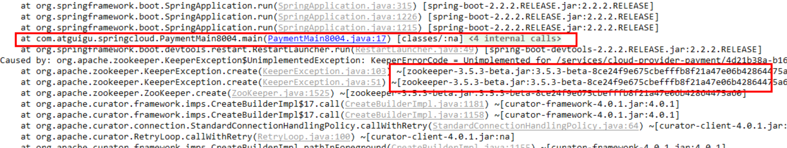


这里排除包内的选择自己的即可，这里我用的`3.5.7`所以没有报错，这里是给老版本的一个补充

```xml
        <!-- SpringBoot整合zookeeper客户端 -->
        <dependency>
            <groupId>org.springframework.cloud</groupId>
            <artifactId>spring-cloud-starter-zookeeper-discovery</artifactId>
            <!--先排除自带的zookeeper3.5.3-->
            <exclusions>
                <exclusion>
                    <groupId>org.apache.zookeeper</groupId>
                    <artifactId>zookeeper</artifactId>
                </exclusion>
            </exclusions>
        </dependency>
        <!--添加zookeeper3.4.9版本-->
        <dependency>
            <groupId>org.apache.zookeeper</groupId>
            <artifactId>zookeeper</artifactId>
            <version>3.4.9</version>
        </dependency>
```

**此时运行发现集群的节点可以查询到根目录多了`/services`节点，同时在它下面能查到我们写的服务名称。而且断开主程序过一小段时间，会发现服务对应的`cloud-provider-payment`消失，说明是不带序号的临时节点。能检测到服务上下线。**

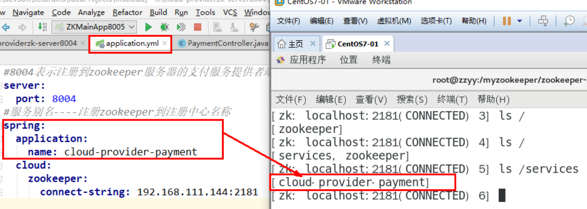

测试是否能通过web端注册：http://localhost:8004/payment/zk

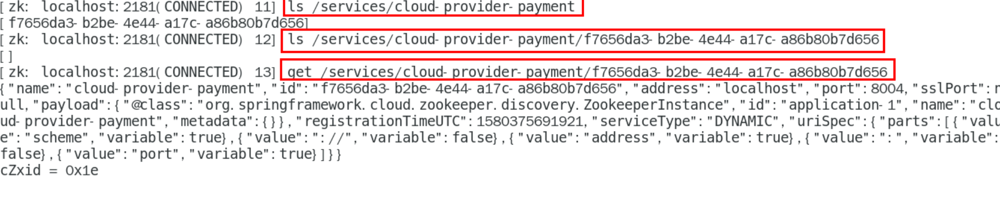

## 3.2. 服务消费者

新建

```sh
cloud-consumerzk-order80
```

多了`zookeeper`的客户端包

```xml
        <!-- SpringBoot整合Web组件 -->
        <dependency>
            <groupId>org.springframework.boot</groupId>
            <artifactId>spring-boot-starter-web</artifactId>
        </dependency>
        <!-- SpringBoot整合zookeeper客户端 -->
        <dependency>
            <groupId>org.springframework.cloud</groupId>
            <artifactId>spring-cloud-starter-zookeeper-discovery</artifactId>
            <!--先排除自带的zookeeper-->
            <exclusions>
                <exclusion>
                    <groupId>org.apache.zookeeper</groupId>
                    <artifactId>zookeeper</artifactId>
                </exclusion>
            </exclusions>
        </dependency>
        <!--添加zookeeper3.5.7版本-->
        <dependency>
            <groupId>org.apache.zookeeper</groupId>
            <artifactId>zookeeper</artifactId>
            <version>3.5.7</version>
        </dependency>
        <dependency>
            <groupId>org.springframework.boot</groupId>
            <artifactId>spring-boot-devtools</artifactId>
            <scope>runtime</scope>
            <optional>true</optional>
        </dependency>
        <dependency>
            <groupId>org.projectlombok</groupId>
            <artifactId>lombok</artifactId>
            <optional>true</optional>
        </dependency>
        <dependency>
            <groupId>org.springframework.boot</groupId>
            <artifactId>spring-boot-starter-test</artifactId>
            <scope>test</scope>
        </dependency>
```

配置文件

```yaml
server:
  port: 80

spring:
  application:
    name: cloud-consumer-order
  cloud:
    #注册到zookeeper地址
    zookeeper:
      connect-string: hadoop100:2181,hadoop101:2181,hadoop102:2181
```

```java
@SpringBootApplication
public class OrderZK80{
    public static void main(String[] args){
        SpringApplication.run(OrderZK80.class,args);
    }
}
```

**这里因为后端是服务器集群，且是微服务之间通信，所以需要引入配置类配置`restTemplate`的对象进入容器，完成跨服务交互和进行负载均衡**

```java
@Configuration
public class ApplicationContextBean {
    @Bean
    @LoadBalanced
    public RestTemplate getRestTemplate() {
        return new RestTemplate();
    }
}
```

`Controller`

```java
@RestController
public class OrderZKController {
    public static final String INVOKE_URL = "http://cloud-provider-payment";

    @Autowired
    private RestTemplate restTemplate;

    @RequestMapping(value = "/consumer/payment/zk")
    public String paymentInfo() {
        String result = restTemplate.getForObject(INVOKE_URL + "/payment/zk", String.class);
        System.out.println("消费者调用支付服务(zookeeper)--->result:" + result);
        return result;
    }
}
```

**验证检测**

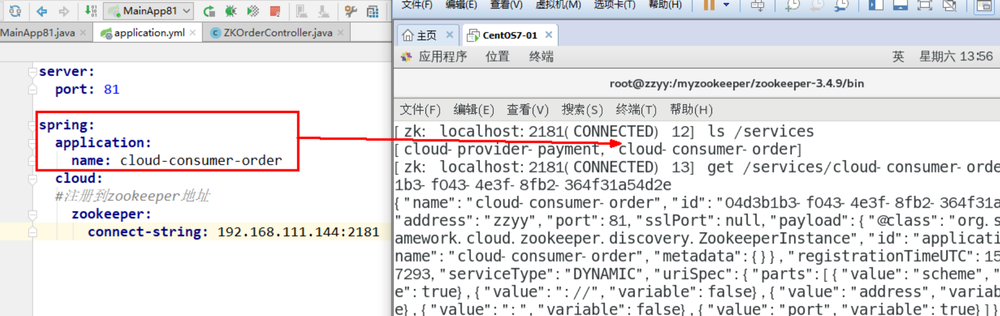

访问测试地址：http://localhost/consumer/payment/zk

# 4. Consul服务注册与发现【中国已经禁用】

## 4.1. Consul简介

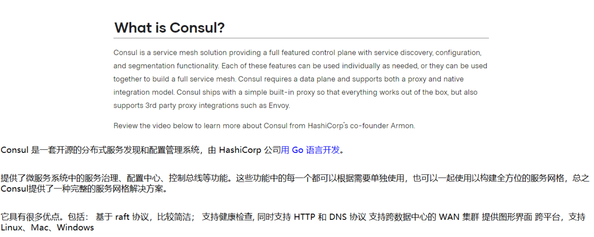

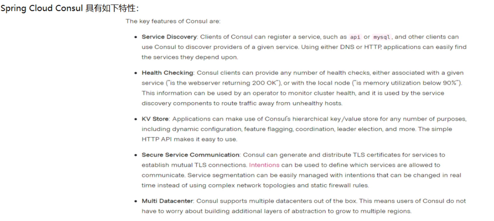

1. 服务发现 - 提供HTTP和DNS两种发现方式

2. 健康监测 - 支持多种方式，HTTP、TCP、Docker、Shell脚本定制化监控

3. KV存储 - Key、Value的存储方式

4. 多数据中心 - Consul支持多数据中心
5. 可视化Web界面

下载地址：https://www.consul.io/downloads.html

官网介绍：https://www.springcloud.cc/spring-cloud-consul.html

**<font color='bb000'>中国都禁了，我就不学了兄弟们</font>**

# 5. 三个注册中心异同点 

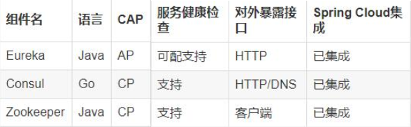

## 5.1. CAP

**C:Consistency（强一致性）**

**A:Availability（可用性）**

**P:Partition tolerance（分区容错性）**

**CAP理论关注粒度是数据，而不是整体系统设计的策略**

**<font color="bb000">最多只能同时较好的满足两个。</font>**
**CAP理论的核心是：<font color="bb000">一个分布式系统不可能同时很好的满足一致性，可用性和分区容错性这三个需求，</font>**
**因此，根据 CAP 原理将 NoSQL 数据库分成了满足 CA 原则、满足 CP 原则和满足 AP 原则三 大类：**
**CA - 单点集群，满足一致性，可用性的系统，通常在可扩展性上不太强大。**
**CP - 满足一致性，分区容忍必的系统，通常性能不是特别高。**
**AP - 满足可用性，分区容忍性的系统，通常可能对一致性要求低一些。**

## 5.2. 经典CAP图


**AP(Eureka)**

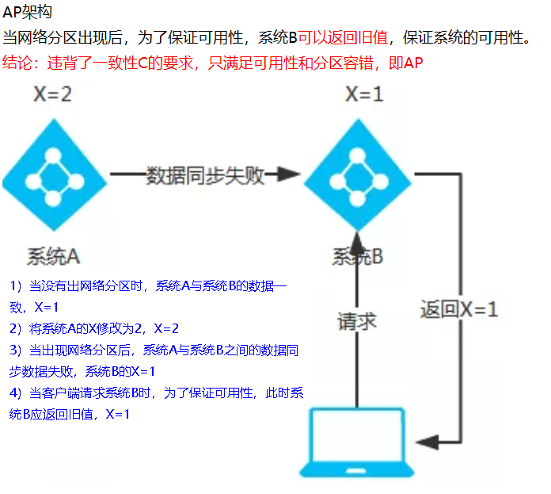

**CP(Zookeeper/Consul)**

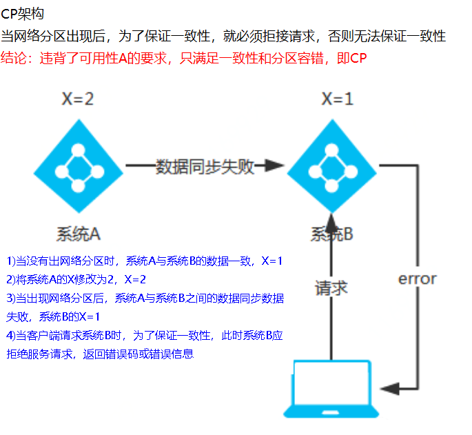

# 6. Ribbon负载均衡服务调用【过时】

## 6.1. 概述

**Spring Cloud Ribbon**是基于**Netflix Ribbon**实现的一套**客户端负载均衡的工具**。

**通常情况下，客户端请求会先经过Nginx反向代理服务器，然后再由微服务的负载均衡器（如Ribbon或LoadBalancer）将请求转发到具体的微服务实例。这种方式称为软负载均衡，可以提高应用程序的可伸缩性和可靠性。**

简单的说，Ribbon是Netflix发布的开源项目，主要功能是提供**客户端的软件负载均衡算法和服务调用**。Ribbon客户端组件提供一系列完善的配置项如连接超时，重试等。简单的说，就是在配置文件中列出Load Balancer（简称LB）后面所有的机器，Ribbon会自动的帮助你基于某种规则（如简单轮询，随机连接等）去连接这些机器。我们很容易使用Ribbon实现自定义的负载均衡算法。

官网：https://github.com/Netflix/ribbon/wiki/Getting-Started

Ribbon目前进入维护模式：——> 未来Spring官网的替代方案：`Spring Cloud LoadBalancer`

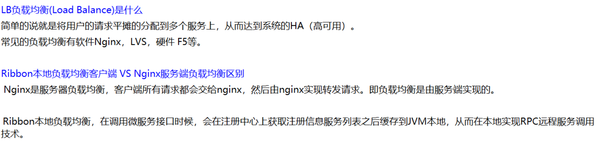

1. **集中式LB**

即在服务的消费方和提供方之间使用独立的LB设施(可以是硬件，如F5, 也可以是软件，如nginx), 由该设施负责把访问请求通过某种策略转发至服务的提供方；

2. **进程内LB**

将LB逻辑集成到消费方，消费方从服务注册中心获知有哪些地址可用，然后自己再从这些地址中选择出一个合适的服务器。

**<font color="bb000">Ribbon就属于进程内LB</font>，它只是一个类库，<font color="bb000">集成于消费方进程</font>，消费方通过它来获取到服务提供方的地址。**

前面我们讲解过了80通过轮询负载访问8001/8002

负载均衡 + `RestTemplate` 调用

## 6.2. Ribbon负载均衡演示

### 6.2.1. 架构说明

`Ribbon`在工作时分成两步
第一步先选择 `EurekaServer` ,它优先选择在同一个区域内负载较少的`server`.
第二步再根据用户指定的策略，在从 `server` 取到的服务注册列表中选择一个地址。
其中 `Ribbon` 提供了多种策略：比如轮询、随机和根据响应时间加权。

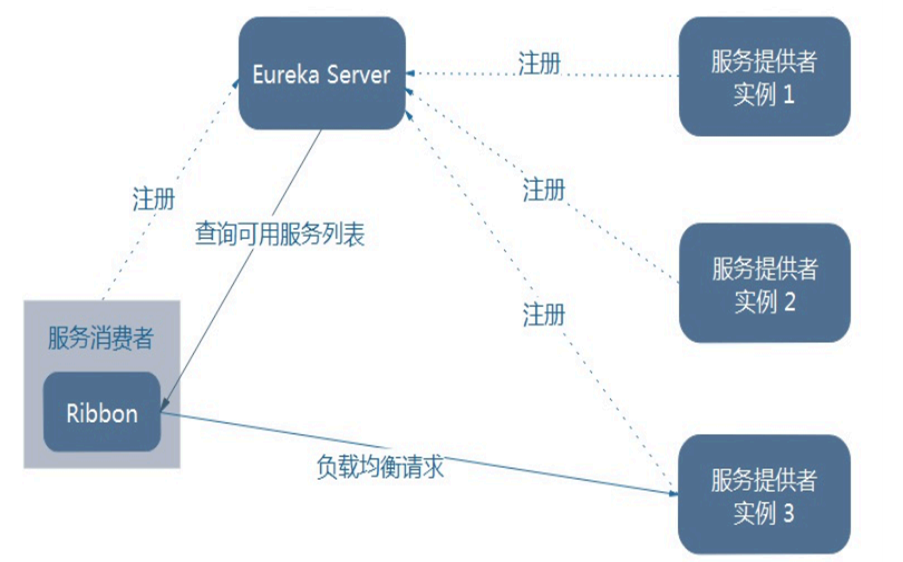

之前写样例时候没有引入`spring-cloud-starter-ribbon`也可以使用`ribbon`

```xml
<dependency>
    <groupId>org.springframework.cloud</groupId>
    <artifactId>spring-cloud-starter-netflix-ribbon</artifactId>
</dependency>
```


### 6.2.2. 二说`RestTemplate`的使用

官网：https://docs.spring.io/spring-framework/docs/5.2.2.RELEASE/javadoc-api/org/springframework/web/client/RestTemplate.html

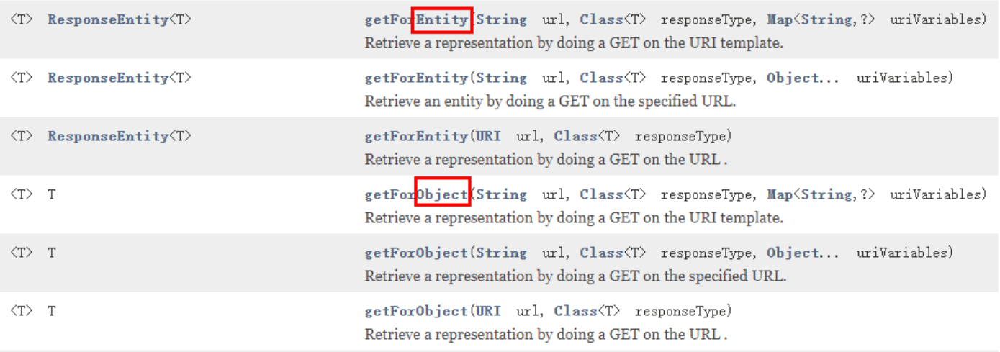

#### 1. getForObject方法/getForEntity方法

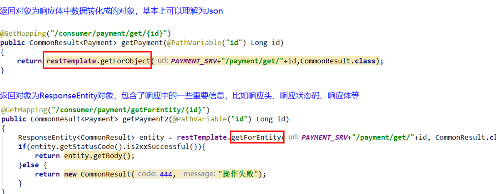

#### 2. postForObject/postForEntity

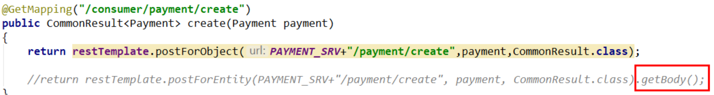

#### 3. GET请求方法

```java
<T> T getForObject(String url, Class<T> responseType, Object... uriVariables);
 
<T> T getForObject(String url, Class<T> responseType, Map<String, ?> uriVariables);
 
<T> T getForObject(URI url, Class<T> responseType);
 
<T> ResponseEntity<T> getForEntity(String url, Class<T> responseType, Object... uriVariables);
 
<T> ResponseEntity<T> getForEntity(String url, Class<T> responseType, Map<String, ?> uriVariables);
 
<T> ResponseEntity<T> getForEntity(URI var1, Class<T> responseType);
```

#### 4. POST请求方法

```java
<T> T postForObject(String url, @Nullable Object request, Class<T> responseType, Object... uriVariables);
 
<T> T postForObject(String url, @Nullable Object request, Class<T> responseType, Map<String, ?> uriVariables);
 
<T> T postForObject(URI url, @Nullable Object request, Class<T> responseType);
 
<T> ResponseEntity<T> postForEntity(String url, @Nullable Object request, Class<T> responseType, Object... uriVariables);
 
<T> ResponseEntity<T> postForEntity(String url, @Nullable Object request, Class<T> responseType, Map<String, ?> uriVariables);
 
<T> ResponseEntity<T> postForEntity(URI url, @Nullable Object request, Class<T> responseType);
```

## 6.3. Ribbon核心组件IRule

IRule：根据特定算法中从服务列表中选取一个要访问的服务

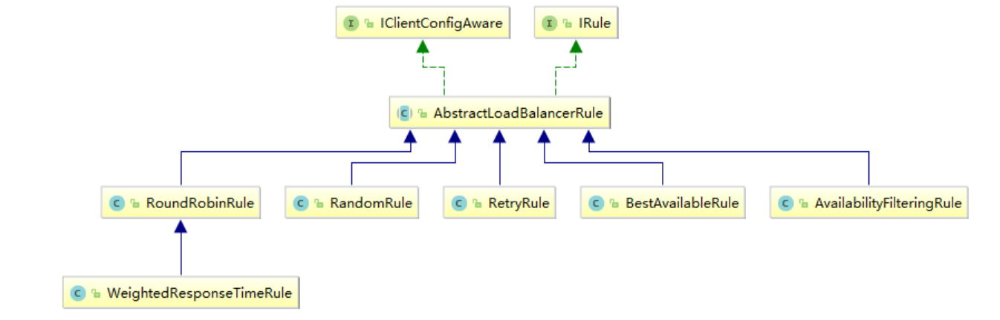

### 6.3.1. 算法列表

| 算法                                    | 具体功能                                                     |
| --------------------------------------- | ------------------------------------------------------------ |
| com.netflix.loadbalancer.RoundRobinRule | 轮询                                                         |
| com.netflix.loadbalancer.RandomRule     | 随机                                                         |
| com.netflix.loadbalancer.RetryRule      | 先按照RoundRobinRule的策略获取服务，如果获取服务失败则在指定时间内会进行重试，获取可用的服务 |
| WeightedResponseTimeRule                | 对RoundRobinRule的扩展，响应速度越快的实例选择权重越大，越容易被选择 |
| BestAvailableRule                       | 会先过滤掉由于多次访问故障而处于断路器跳闸状态的服务，然后选择一个并发量最小的服务 |
| AvailabilityFilteringRule               | 先过滤掉故障实例，再选择并发较小的实例                       |
| ZoneAvoidanceRule                       | 默认规则,复合判断server所在区域的性能和server的可用性选择服务器 |

### 6.3.1. 如何替换

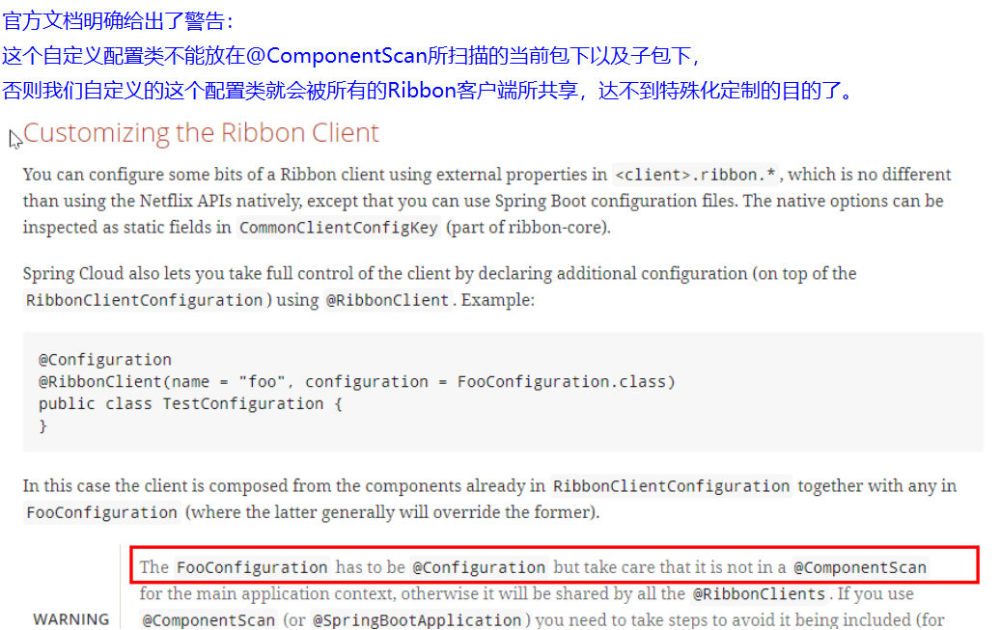

#### 1. 新建包以boot入口包分开

```sh
com.fanxy.myrule
```

#### 2. 上面包下新建MySelfRule规则类

```java
@Configuration
public class MyselfRule {
    
    @Bean
    public IRule myRule(){
        // 随机访问
        return new RandomRule();
    }
}
```

#### 3. 主启动类添加@RibbonClient

**这里必须得和我们在服务端的yaml配置文件的大小写一致，尽管在eureka上显示是大写，但是实际是以配置文件为准，网页端是为了显眼默认显示全大写**

```java
@RibbonClient(name = "cloud-payment-service",configuration=MySelfRule.class)
```

#### 4. 测试

http://localhost/consumer/payment/get/31

## 6.4. Ribbon负载均衡算法【手写实现】

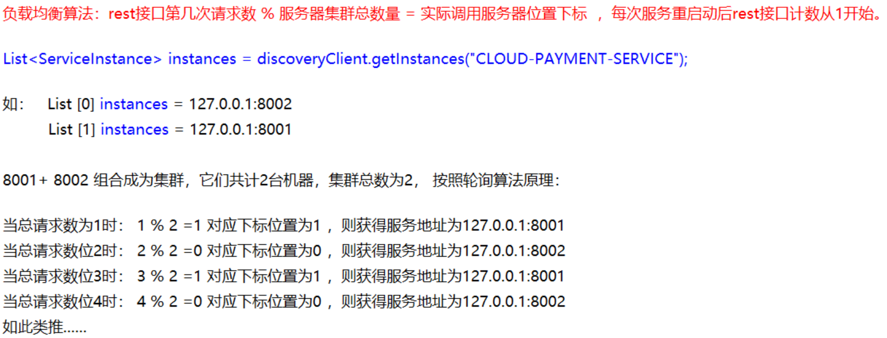


**这里源码底层使用了CAS自旋锁，可以学习完JUC后去深入看一下，源码写的很短也很优雅，值得学习。**

暂时等学完JUC再补充这里的笔记。

# 7. OpenFeign服务接口调用

## 7.1. 概述

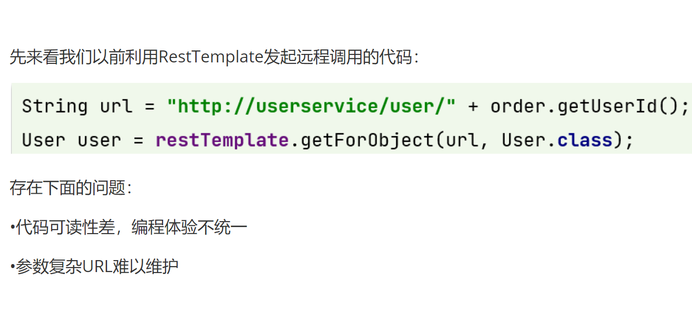

官网解释：
https://cloud.spring.io/spring-cloud-static/Hoxton.SR1/reference/htmlsingle/#spring-cloud-openfeign

github:

https://github.com/spring-cloud/spring-cloud-openfeign

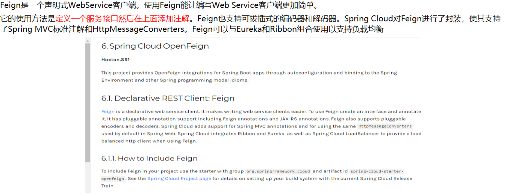

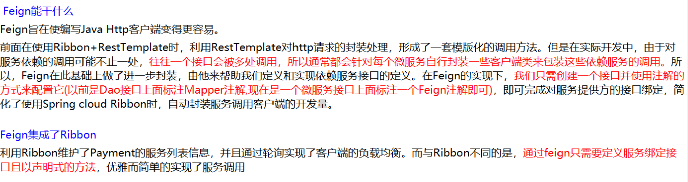

**<font color="bb000">Feign和OpenFeign两者区别</font>**

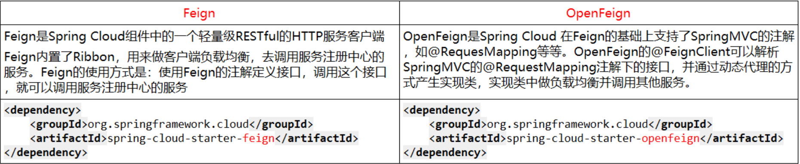

## 7.2. OpenFeign使用步骤

### 7.2.1. 模块初步构建

**Feign在消费端使用**

```sh
cloud-consumer-feign-order80
```

**pom文件这里比起之前多了一个`openfeign`的包**

```xml
<!--openfeign-->
        <dependency>
            <groupId>org.springframework.cloud</groupId>
            <artifactId>spring-cloud-starter-openfeign</artifactId>
        </dependency>
        <!--eureka client-->
        <dependency>
            <groupId>org.springframework.cloud</groupId>
            <artifactId>spring-cloud-starter-netflix-eureka-client</artifactId>
        </dependency>
        <!-- 引入自己定义的api通用包，可以使用Payment支付Entity -->
        <dependency>
            <groupId>com.atguigu.springcloud</groupId>
            <artifactId>cloud-api-commons</artifactId>
            <version>${project.version}</version>
        </dependency>
        <!--web-->
        <dependency>
            <groupId>org.springframework.boot</groupId>
            <artifactId>spring-boot-starter-web</artifactId>
        </dependency>
        <dependency>
            <groupId>org.springframework.boot</groupId>
            <artifactId>spring-boot-starter-actuator</artifactId>
        </dependency>
        <!--一般基础通用配置-->
        <dependency>
            <groupId>org.springframework.boot</groupId>
            <artifactId>spring-boot-devtools</artifactId>
            <scope>runtime</scope>
            <optional>true</optional>
        </dependency>
        <dependency>
            <groupId>org.projectlombok</groupId>
            <artifactId>lombok</artifactId>
            <optional>true</optional>
        </dependency>
        <dependency>
            <groupId>org.springframework.boot</groupId>
            <artifactId>spring-boot-starter-test</artifactId>
            <scope>test</scope>
        </dependency>
```

**yaml配置文件，这里使用`open-feign`就在配置文件不注册到`eureka`里面作为服务了，这里没注册是因为不给别人提供服务，只需要去`Eureka`调用别人即可**

```yaml
server:
  port: 80

eureka:
  client:
    register-with-eureka: false
    service-url:
      defaultZone: http://eureka7001.com:7001/eureka/,http://eureka7002.com:7002/eureka/
```

**主启动，使用FeignClient需要在主启动上标注<font color="bb000">`@EnableFeignClients`</font>**

```java
@SpringBootApplication
@EnableFeignClients
public class OrderFeignMain80 {
    public static void main(String[] args) {
        SpringApplication.run(OrderFeignMain80.class, args);
    }
}
```

### 7.2.2. 业务类

**业务逻辑接口+<font color="bb000">@FeignClient配置调用provider服务</font>**

**<font color="bb000">新建PaymentFeignService接口并新增注解@FeignClient</font>**

**因为定义必须是接口，controller一般不好写接口 所以定义在service，这里是相当于把8001和8002的同名的Controller层的方法搬过来了，本质会调用对方同名的方法实现。这里就只写了一个获取方法图省事，而另一个新增的方法懒得写。而我发现不需要写老师写了的`@Component`也照样能注入，估计是这个注解本身就可以通过动态代理生成实现类**

```java
@FeignClient(value = "cloud-payment-service")
public interface PaymentFeignService {

    @GetMapping(value = "/payment/get/{id}")
    CommonResult<Payment> getPaymentById(@PathVariable("id") Long id);
}
```

**控制层Controller**

```java
@RestController
public class PaymentFeignController {

    @Resource
    private PaymentFeignService paymentFeignService;

    @GetMapping("/consumer/payment/get/{id}")
    public CommonResult<Payment> getPaymentById(@PathVariable("id") Long id){
        return paymentFeignService.getPaymentById(id);
    }
}
```

**此时测试，发现是可以实现远程调用，且实现了轮询的负载均衡【底层是用Ribbon实现的】而且并不会把我们的服务端注册在Eureka上作为一个服务 ：http://localhost/consumer/payment/get/1**

## 7.3. OpenFeign超时控制

超时设置，故意设置超时演示出错情况

### 7.3.1. 服务提供方8001故意写暂停程序

```java
    @GetMapping(value = "/payment/feign/timeout")
    public String paymentFeignTimeOut(){

        System.out.println("*****paymentFeignTimeOut from port: "+serverPort);
        //暂停几秒钟线程
        try {
            TimeUnit.SECONDS.sleep(3);
        } catch (InterruptedException e) {
            throw new RuntimeException(e);
        }
        return serverPort;
    }
```

### 7.3.2. 服务消费方80添加超时方法PaymentFeignService

```java
@FeignClient(value = "cloud-payment-service")
public interface PaymentFeignService {

    @GetMapping(value = "/payment/get/{id}")
    CommonResult<Payment> getPaymentById(@PathVariable("id") Long id);

    @GetMapping(value = "/payment/feign/timeout")
    String paymentFeignTimeOut();
}
```

### 7.3.3. 服务消费方80添加超时方法OrderFeignController


默认Feign客户端只等待一秒钟，但是服务端处理需要超过1秒钟，导致Feign客户端不想等待了，直接返回报错。
为了避免这样的情况，有时候我们需要设置Feign客户端的超时控制。

yml文件中开启ribbon相关配置【新版已经不集成ribbon了】

```yaml
#设置feign客户端超时时间(OpenFeign默认支持ribbon)
ribbon:
#指的是建立连接后从服务器读取到可用资源所用的时间
  ReadTimeout: 5000
#指的是建立连接所用的时间，适用于网络状况正常的情况下,两端连接所用的时间
  ConnectTimeout: 5000
```

**<font color="bb000">新版是</font>**

```yaml
feign:
  client:
    config:
      default:
        connect-timeout: 5000
        read-timeout: 5000
```

### 7.3.4. 测试

经测试 添加配置后能正常访问，但是不添加就会报错：

http://localhost:8001/payment/feign/timeout ：耗时3秒能够访问成功

http://localhost/consumer/payment/feign/timeout ：1s后报错


## 7.4. OpenFeign日志打印功能【和一些其他配置】

Feign可以支持很多的自定义配置，如下表所示：

| 类型                   | 作用             | 说明                                                   |
| ---------------------- | ---------------- | ------------------------------------------------------ |
| **feign.Logger.Level** | 修改日志级别     | 包含四种不同的级别：NONE、BASIC、HEADERS、FULL         |
| feign.codec.Decoder    | 响应结果的解析器 | http远程调用的结果做解析，例如解析json字符串为java对象 |
| feign.codec.Encoder    | 请求参数编码     | 将请求参数编码，便于通过http请求发送                   |
| feign. Contract        | 支持的注解格式   | 默认是SpringMVC的注解                                  |
| feign. Retryer         | 失败重试机制     | 请求失败的重试机制，默认是没有，不过会使用Ribbon的重试 |

**一般情况下，默认值就能满足我们使用，如果要自定义时，只需要创建自定义的@Bean覆盖默认Bean即可。**

**Feign 提供了日志打印功能，我们可以通过配置来调整日志级别，从而了解 Feign 中 Http 请求的细节。**
**说白了就是<font color="bb000">Feign接口的调用情况进行监控和输出</font>**

- **NONE：默认的，不显示任何日志；**

- **BASIC：仅记录请求方法、URL、响应状态码及执行时间；**

- **HEADERS：除了 BASIC 中定义的信息之外，还有请求和响应的头信息；**

- **FULL：除了 HEADERS 中定义的信息之外，还有请求和响应的正文及元数据。**

**配置日志`Bean`**

```java
@Configuration
public class FeignConfig {
    @Bean
    Logger.Level feignLoggerLevel() {
        return Logger.Level.FULL;
    }
}
```

**可以直接在yaml中配置：**

**其中"`default`”可以换成`FeignClient`中配置的`name`属性，也可以直接用`default`**

**对应的是`FeignClientProperties`类中的`config`属性。该类为`Feign`自动配置类引入的配置项类**

```yaml
feign:
  client:
    config:
      default:
        logger-level: full
```

**配置文件，这里可以使用通配符**

```yaml
logging:
  level:
    # feign日志以什么级别监控哪个接口
    com.fanxy.springcloud.service.PaymentFeignService: debug
```

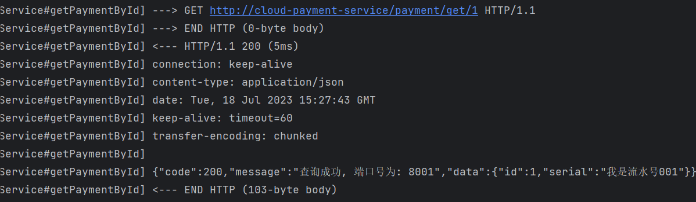

## 7.5. Feign使用优化

Feign底层发起http请求，依赖于其它的框架。其底层客户端实现包括：

•URLConnection：默认实现，不支持连接池

•Apache HttpClient ：支持连接池

•OKHttp：支持连接池


因此提高Feign的性能主要手段就是使用**连接池**代替默认的URLConnection。


这里我们用Apache的HttpClient来演示。

1）引入依赖

在order-service的pom文件中引入Apache的HttpClient依赖：

```xml
<!--httpClient的依赖 -->
<dependency>
    <groupId>io.github.openfeign</groupId>
    <artifactId>feign-httpclient</artifactId>
</dependency>
```

2）配置连接池

在order-service的application.yml中添加配置：

```yaml
feign:
  client:
    config:
      default: # default全局的配置
        loggerLevel: BASIC # 日志级别，BASIC就是基本的请求和响应信息
  httpclient:
    enabled: true # 开启feign对HttpClient的支持
    max-connections: 200 # 最大的连接数
    max-connections-per-route: 50 # 每个路径的最大连接数
```


接下来，在FeignClientFactoryBean中的loadBalance方法中打断点：


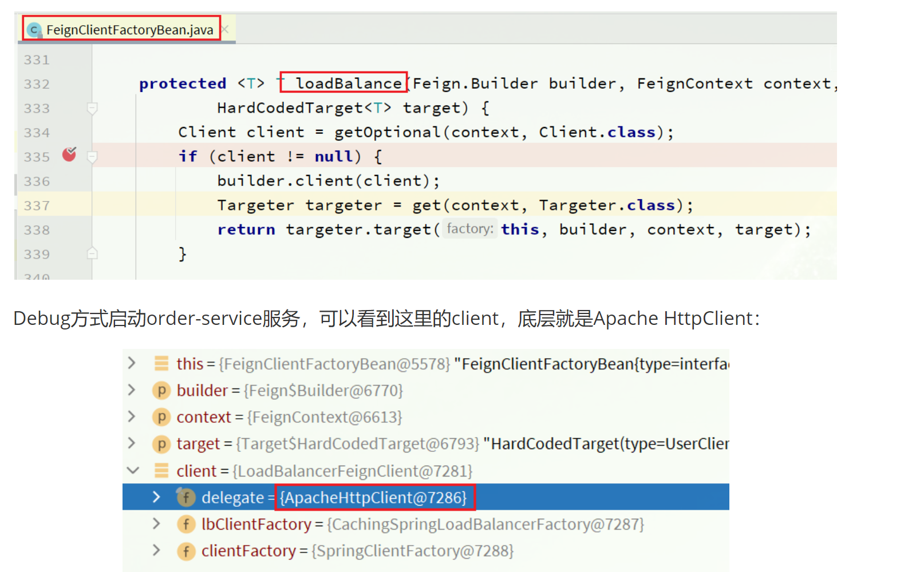

总结，Feign的优化：

1.日志级别尽量用basic

2.使用HttpClient或OKHttp代替URLConnection

①  引入feign-httpClient依赖

②  配置文件开启httpClient功能，设置连接池参数

# 8. Hystrix断路器【已停止维护】

## 8.1. 概述

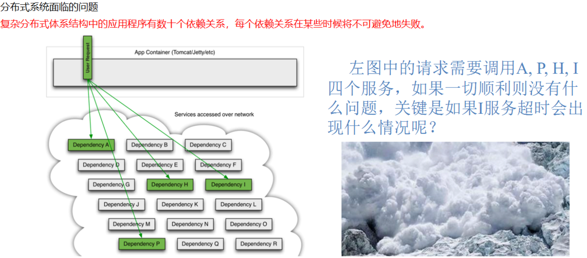

**<font color="bb000">服务雪崩</font>**
多个微服务之间调用的时候，假设微服务A调用微服务B和微服务C，微服务B和微服务C又调用其它的微服务，这就是所谓的“扇出”。如果扇出的链路上某个微服务的调用响应时间过长或者不可用，对微服务A的调用就会占用越来越多的系统资源，进而引起系统崩溃，所谓的“雪崩效应”.

对于高流量的应用来说，单一的后端依赖可能会导致所有服务器上的所有资源都在几秒钟内饱和。比失败更糟糕的是，这些应用程序还可能导致服务之间的延迟增加，备份队列，线程和其他系统资源紧张，导致整个系统发生更多的级联故障。这些都表示需要对故障和延迟进行隔离和管理，以便单个依赖关系的失败，不能取消整个应用程序或系统。
所以，通常当你发现一个模块下的某个实例失败后，这时候这个模块依然还会接收流量，然后这个有问题的模块还调用了其他的模块，这样就会发生级联故障，或者叫雪崩。

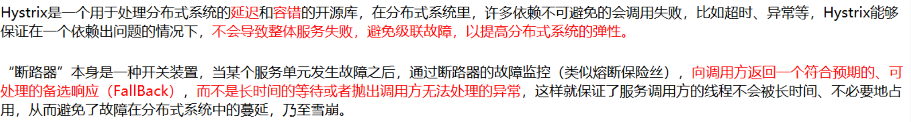

- 服务降级
- 服务熔断
- 接近实时的监控
- 服务限流
- ....................

官网资料 ：https://github.com/Netflix/Hystrix/wiki/How-To-Use

**<font color="000bb">Hystrix官宣，停更进维</font>**

被动修复bugs，不再接受合并请求，不再发布新版本

## 8.2. Hystrix重要概念

### 8.2.1. 服务降级【fallback】

服务器忙，请稍后再试，不让客户端等待并立刻返回一个友好提示，fallback

哪些情况会出发降级

- 程序运行异常
- 超时
- 服务熔断触发服务降级
- 线程池/信号量打满也会导致服务降级

### 8.2.2. 服务熔断【break】

类比保险丝达到最大服务访问后，直接拒绝访问，拉闸限电，然后调用服务降级的方法并返回友好提示

就是保险丝

服务的降级->进而熔断->恢复调用链路

### 8.2.3. 服务限流【flowlimit】

秒杀高并发等操作，严禁一窝蜂的过来拥挤，大家排队，一秒钟N个，有序进行

## 8.3. hystrix案例

### 8.3.1. Demo构建

```sh
cloud-provider-hystrix-payment8001
```

POM文件 多引入的`hystrix`的maven

```xml
		<!--hystrix-->
        <dependency>
            <groupId>org.springframework.cloud</groupId>
            <artifactId>spring-cloud-starter-netflix-hystrix</artifactId>
        </dependency>
        <!--eureka client-->
        <dependency>
            <groupId>org.springframework.cloud</groupId>
            <artifactId>spring-cloud-starter-netflix-eureka-client</artifactId>
        </dependency>
        <!--web-->
        <dependency>
            <groupId>org.springframework.boot</groupId>
            <artifactId>spring-boot-starter-web</artifactId>
        </dependency>
        <dependency>
            <groupId>org.springframework.boot</groupId>
            <artifactId>spring-boot-starter-actuator</artifactId>
        </dependency>
        <dependency><!-- 引入自己定义的api通用包，可以使用Payment支付Entity -->
            <groupId>com.fanxy.springcloud</groupId>
            <artifactId>cloud-api-commons</artifactId>
            <version>1.0-SNAPSHOT</version>
        </dependency>
        <dependency>
            <groupId>org.springframework.boot</groupId>
            <artifactId>spring-boot-devtools</artifactId>
            <scope>runtime</scope>
            <optional>true</optional>
        </dependency>
        <dependency>
            <groupId>org.projectlombok</groupId>
            <artifactId>lombok</artifactId>
            <optional>true</optional>
        </dependency>
        <dependency>
            <groupId>org.springframework.boot</groupId>
            <artifactId>spring-boot-starter-test</artifactId>
            <scope>test</scope>
        </dependency>
```

**主启动**

```java
@SpringBootApplication
@EnableEurekaClient //本服务启动后会自动注册进eureka服务中
public class PaymentHystrixMain8001 {
    public static void main(String[] args) {
        SpringApplication.run(PaymentHystrixMain8001.class, args);
    }
}
```

`Service`

```java
@Service
public class PaymentService {
    /**
     * 正常访问 一切 OK
     *
     * @param id
     * @return
     */
    public String paymentInfo_OK(Integer id) {
        return "线程池:  " + Thread.currentThread().getName()
                + "  paymentInfo_OK, id:  " + id + "\t" + "O(∩_∩)O";
    }

    /**
     * 超时访问，演示降级
     *
     * @param id
     * @return
     */
    public String paymentInfo_TimeOut(Integer id) {
        int timeNum = 3;
        try {
            TimeUnit.SECONDS.sleep(timeNum);
        } catch (InterruptedException e) {
            throw new RuntimeException(e);
        }
        return "线程池:  " + Thread.currentThread().getName()
                + "  paymentInfo_TimeOut, id:  " + id + "\t" + "O(∩_∩)O,耗费" + timeNum + "秒";
    }
}
```

`Controller`

```java
@RestController
@Slf4j
public class PaymentController {

    @Value("server.port")
    private String serverPort;
    @Resource
    private PaymentService paymentService;

    @GetMapping("/payment/hystrix/ok/{id}")
    public String paymentInfo_OK(@PathVariable("id") Integer id) {
        String result = paymentService.paymentInfo_OK(id);
        log.info("******** result: " + result);
        return result;
    }

    @GetMapping("/payment/hystrix/timeout/{id}")
    public String paymentInfo_TimeOut(@PathVariable("id") Integer id) {
        String result = paymentService.paymentInfo_TimeOut(id);
        log.info("******** result: " + result);
        return result;
    }
}
```

**这里启动测试，没有问题，demo建立成功。**

**以上述为根基平台，从正确->错误->降级熔断->恢复**

### 8.3.2. 高并发测试

上述在非高并发情形下，还能勉强满足，但高并发就未必了。

1. Jmeter压测测试

这里设置线程组，200个线程，100次循环，即20000的并发

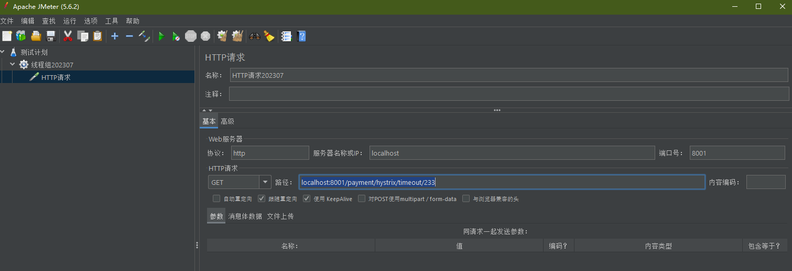

同时我们去尝试访问没有延迟的 http://localhost:8001/payment/hystrix/ok/1

发现居然开始转圈，有了延迟，为什么？

tomcat的默认的工作线程数被打满了，没有多余的线程来分解压力和处理。【tomcat默认10个线程的线程池】

2. Jmeter压测结论

上面还是**服务提供者8001自己测试**，假如此时**外部的消费者80**也来访问，那**消费者**只能干等，最终导致消费端80不满意，服务端8001直接被拖死

### 8.3.3. 消费者80新建加入

```sh
cloud-consumer-feign-hystrix-order80
```

```xml
        <!--openfeign-->
        <dependency>
            <groupId>org.springframework.cloud</groupId>
            <artifactId>spring-cloud-starter-openfeign</artifactId>
        </dependency>
        <!--hystrix-->
        <dependency>
            <groupId>org.springframework.cloud</groupId>
            <artifactId>spring-cloud-starter-netflix-hystrix</artifactId>
        </dependency>
        <!--eureka client-->
        <dependency>
            <groupId>org.springframework.cloud</groupId>
            <artifactId>spring-cloud-starter-netflix-eureka-client</artifactId>
        </dependency>
        <!-- 引入自己定义的api通用包，可以使用Payment支付Entity -->
        <dependency>
            <groupId>com.fanxy.springcloud</groupId>
            <artifactId>cloud-api-commons</artifactId>
            <version>${project.version}</version>
        </dependency>
        <!--web-->
        <dependency>
            <groupId>org.springframework.boot</groupId>
            <artifactId>spring-boot-starter-web</artifactId>
        </dependency>
        <dependency>
            <groupId>org.springframework.boot</groupId>
            <artifactId>spring-boot-starter-actuator</artifactId>
        </dependency>
        <!--一般基础通用配置-->
        <dependency>
            <groupId>org.springframework.boot</groupId>
            <artifactId>spring-boot-devtools</artifactId>
            <scope>runtime</scope>
            <optional>true</optional>
        </dependency>
        <dependency>
            <groupId>org.projectlombok</groupId>
            <artifactId>lombok</artifactId>
            <optional>true</optional>
        </dependency>
        <dependency>
            <groupId>org.springframework.boot</groupId>
            <artifactId>spring-boot-starter-test</artifactId>
            <scope>test</scope>
        </dependency>
```

```yaml
server:
  port: 80

eureka:
  client:
    register-with-eureka: false
    service-url:
      defaultZone: http://eureka7001.com:7001/eureka/,http://eureka7002.com:7002/eureka/
```

```java
@SpringBootApplication
@EnableFeignClients
public class OrderHystrixMain80 {
    public static void main(String[] args) {
        SpringApplication.run(OrderHystrixMain80.class, args);
    }
}
```

`Service`

```java
@FeignClient(value = "CLOUD-PROVIDER-HYSTRIX-PAYMENT")
public interface PaymentHystrixService {

    @GetMapping("/payment/hystrix/ok/{id}")
    public String paymentInfo_OK(@PathVariable("id") Integer id);

    @GetMapping("/payment/hystrix/timeout/{id}")
    public String paymentInfo_TimeOut(@PathVariable("id") Integer id);
}
```

`Controller`

```java
@RestController
@Slf4j
public class PaymentHystrixController {

    @Resource
    private PaymentHystrixService paymentHystrixService;

    @GetMapping("/consumer/payment/hystrix/ok/{id}")
    public String paymentInfo_OK(@PathVariable("id") Integer id){
        return paymentHystrixService.paymentInfo_OK(id);
    }

    @GetMapping("/consumer/payment/hystrix/timeout/{id}")
    public String paymentInfo_TimeOut(@PathVariable("id") Integer id){
        return paymentHystrixService.paymentInfo_TimeOut(id);
    }
}
```

普通测试 ：http://localhost/consumer/payment/hystrix/ok/31

此时我们通过80设置jemeter同样的200线程组的并发访问，发现正常访问转圈严重。

**故障现象和导致原因**

8001同一层次的其它接口服务被困死，因为tomcat线程池里面的工作线程已经被挤占完毕

80此时调用8001，客户端访问响应缓慢，转圈圈

**上诉结论**

正因为有上述故障或不佳表现，才有我们的降级/容错/限流等技术诞生

**如何解决？解决的要求**

超时导致服务器变慢(转圈) ---> **超时不再等待**

出错(宕机或程序运行出错) ---> **出错要有兜底**

**解决**

对方服务(8001)超时了，调用者(80)不能一直卡死等待，必须有服务降级

对方服务(8001)down机了，调用者(80)不能一直卡死等待，必须有服务降级

对方服务(8001)OK，调用者(80)自己出故障或有自我要求（自己的等待时间小于服务提供者），自己处理降级

### 8.3.4. 服务降级

**降级配置 <font color="bb000"> @HystrixCommand</font>**

#### 1. 8001自身的服务降级

设置自身调用超时时间的峰值，峰值内可以正常运行，超过了需要有兜底的方法处理，作服务降级fallback

8001fallback

```java
@Service
public class PaymentService {

    public String paymentInfo_OK(Integer id) {
        return "线程池:  " + Thread.currentThread().getName()
                + "  paymentInfo_OK, id:  " + id + "\t" + "O(∩_∩)O";
    }

    @HystrixCommand(
            fallbackMethod = "paymentInfo_TimeOutHandler",
            commandProperties = {
                    @HystrixProperty(name = "execution.isolation.thread.timeoutInMilliseconds", value = "3000")
            }
    )
    public String paymentInfo_TimeOut(Integer id) {
        int timeNum = 5;
        try {
            TimeUnit.SECONDS.sleep(timeNum);
        } catch (InterruptedException e) {
            throw new RuntimeException(e);
        }
        return "线程池:  " + Thread.currentThread().getName()
                + "  paymentInfo_TimeOut, id:  " + id + "\t" + "O(∩_∩)O,耗费" + timeNum + "秒";
    }

    public String paymentInfo_TimeOutHandler(Integer id) {
        return "线程池:  " + Thread.currentThread().getName()
                + "  paymentInfo_TimeOutHandler, id:  " + id + "\t" + "8001服务超时或服务出错/(ㄒoㄒ)/~~";
    }
}
```

`@HystrixCommand`报异常后如何处理

一旦调用服务方法失败并抛出了错误信息后，会自动调用`@HystrixCommand`标注好的`fallbackMethod`调用类中的指定方法

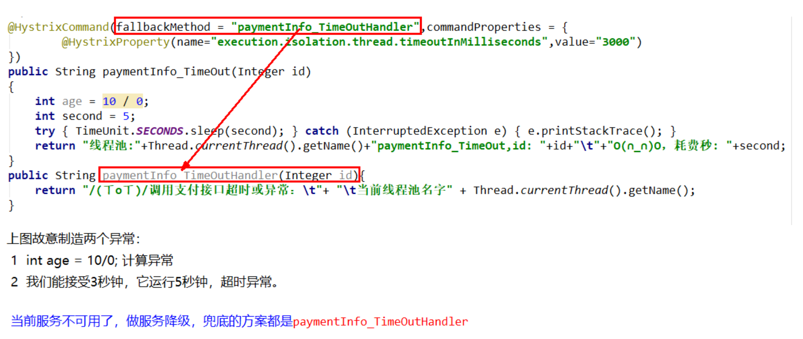

**<font color="bb000">主启动类激活 添加新注解@EnableCircuitBreaker</font>**

**此时测试发现无论是出现整除错误，或者是时间超时，都可以通过我们标注的方法去处理。**

#### 2. 80的服务降级

80订单微服务，也可以更好的保护自己，自己也依样画葫芦进行客户端降级保护

题外话：**<font color="bb000">我们自己配置过的热部署方式对java代码的改动明显，但对@HystrixCommand内属性的修改建议重启微服务</font>**

配置文件加入【这里其实不加配置文件，主启动加入注解也可以保证能运行，8001那里就没有使用这个配置】

```yaml
feign:
  hystrix:
    enabled: true
```

**<font color="bb000">而这里配置文件需要更改一下Feign的访问时间，这里默认1秒就超时了，具体配置和详细内容见 7.3.3 服务消费方80添加超时方法OrderFeignController</font>**

**<font color="bb000">主启动加入 ：@EnableHystrix，大家可以点@EnableHystrix进去，发现这个注解上面自带@EnableCircuitBreaker，也就是两个都可以</font>**

```java
@SpringBootApplication
@EnableFeignClients
@EnableHystrix
public class OrderHystrixMain80 {
    public static void main(String[] args) {
        SpringApplication.run(OrderHystrixMain80.class,args);
    }
}
```

**<font color="bb000">服务类加入服务降级的方法</font>**

```java
@RestController
@Slf4j
public class PaymentHystrixController {

    @Resource
    private PaymentHystrixService paymentHystrixService;

    @GetMapping("/consumer/payment/hystrix/ok/{id}")
    public String paymentInfo_OK(@PathVariable("id") Integer id) {
        return paymentHystrixService.paymentInfo_OK(id);
    }

    @GetMapping("/consumer/payment/hystrix/timeout/{id}")
    @HystrixCommand(
            fallbackMethod = "paymentTimeOutFallbackMethod",
            commandProperties = {
                    @HystrixProperty(name = "execution.isolation.thread.timeoutInMilliseconds", value = "1500")
            }
    )
    public String paymentInfo_TimeOut(@PathVariable("id") Integer id) {
        String result = paymentHystrixService.paymentInfo_TimeOut(id);
        return result;
    }

    public String paymentTimeOutFallbackMethod(@PathVariable("id") Integer id) {
        return "我是消费者80,对方支付系统繁忙请10秒钟后再试或者自己运行出错请检查自己,o(╥﹏╥)o";
    }
}
```

此时测试，果然可以完成80的服务降级。

#### 3.  代码优化

每个业务方法对应一个兜底的方法，代码膨胀，能否完成统一和自定义的分开？

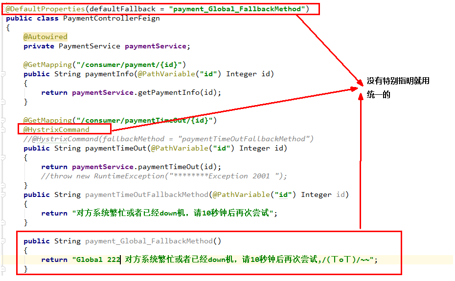

服务降级，客户端去调用服务端，碰上服务端宕机或关闭

本次案例服务降级处理是在客户端80实现完成的，与服务端8001没有关系，只需要为Feign客户端定义的接口添加一个服务降级处理的实现类即可实现解耦

未来我们要面对的异常：运行，超时，宕机

修改cloud-consumer-feign-hystrix-order80

**根据cloud-consumer-feign-hystrix-order80已经有的PaymentHystrixService接口，**
**重新新建一个类<font color="bb000">(PaymentFallbackService)实现该接口，统一为接口里面的方法进行异常处理</font>**

**<font color="bb000">必须要加`@Component`</font>**

```java
@Component
public class PaymentFallbackService implements PaymentHystrixService {
    @Override
    public String paymentInfo_OK(Integer id) {
        return "服务调用失败，提示来自：cloud-consumer-feign-order80";
    }

    @Override
    public String paymentInfo_TimeOut(Integer id) {
        return "服务调用失败，提示来自：cloud-consumer-feign-order80";
    }
}
```

**同时接口的注解添加属性要声明为当前实现类。**

```java
@FeignClient(value = "CLOUD-PROVIDER-HYSTRIX-PAYMENT", fallback = PaymentFallbackService.class)
public interface PaymentHystrixService {

    @GetMapping("/payment/hystrix/ok/{id}")
    public String paymentInfo_OK(@PathVariable("id") Integer id);

    @GetMapping("/payment/hystrix/timeout/{id}")
    public String paymentInfo_TimeOut(@PathVariable("id") Integer id);
}
```

访问测试 ：http://localhost/consumer/payment/hystrix/ok/31

**故意关闭8001 ——> 客户端自己调用提示  ——> 此时服务端provider已经down了，但是我们做了服务降级处理，让客户端在服务端不可用时也会获得提示信息而不会挂起耗死服务器**

写在controller类内部的处理，并加上默认或者指定降级处理。**如果没有继承service的降级处理，他处理的是服务端与客户端异常**

继承service的降级处理，他处理的是服务端的异常

写在controller类内部的处理，并加上默认或者指定降级处理。**如果存在一个继承service的降级处理，他处理的是客户端自身的异常**

### 8.3.5. 服务熔断

断路器：一句话就是家里的保险丝

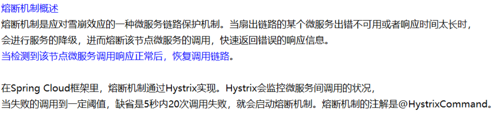

大神论文：https://martinfowler.com/bliki/CircuitBreaker.html

- **调用失败会触发降级，而降级会调用fallback方法**

- **但无论如何降级的流程一定会先调用正常方法再调用fallback方法**

- **假如单位时间内调用失败次数过多，也就是降级次数过多，则触发熔断**

- **熔断以后就会跳过正常方法直接调用fallback方法**

- **所谓“熔断后服务不可用”就是因为跳过了正常方法直接执行fallback**
- **进入半闭半开状态后【默认5秒】，如果这次访问正常，就会关闭，恢复下一个周期，正常运作。如果还是错误，继续进入熔断状态，打开断路器。**

#### 1. 实操

修改cloud-provider-hystrix-payment8001

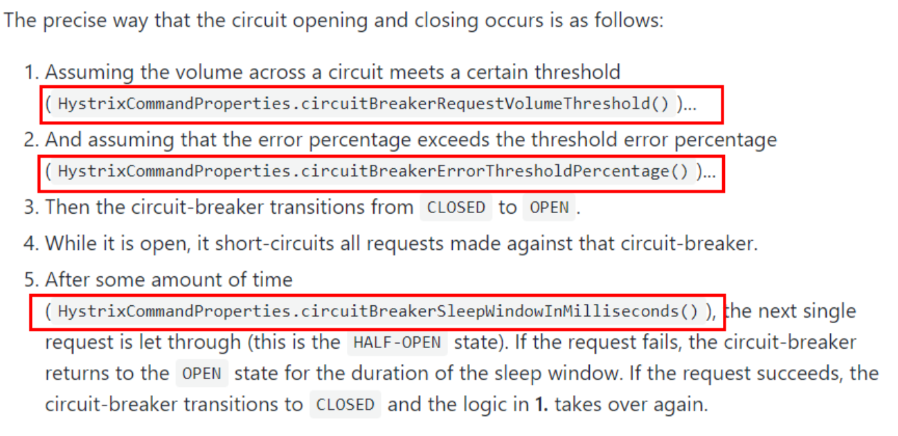

`Service`

```java
    //=========服务熔断
    @HystrixCommand(fallbackMethod = "paymentCircuitBreaker_fallback",
            commandProperties = {
                	// 是否开启断路器
                    @HystrixProperty(name = "circuitBreaker.enabled",value = "true"), 
                    // 请求次数
                	@HystrixProperty(name = "circuitBreaker.requestVolumeThreshold",value = "10"),  			
                	// 时间窗口期
                    @HystrixProperty(name = "circuitBreaker.sleepWindowInMilliseconds",value = "10000"), 		
                	// 失败率达到多少后熔断
                    @HystrixProperty(name = "circuitBreaker.errorThresholdPercentage",value = "60"), 
            }
    )
    public String paymentCircuitBreaker(@PathVariable("id") Integer id) {
        if(id < 0) {
            throw new RuntimeException("******id 不能负数");
        }
        String serialNumber = IdUtil.simpleUUID();

        return Thread.currentThread().getName()+"\t"+"调用成功，流水号: " + serialNumber;
    }
    public String paymentCircuitBreaker_fallback(@PathVariable("id") Integer id) {
        return "id 不能负数，请稍后再试，/(ㄒoㄒ)/~~   id: " +id;
    }
```

`Controller`

```java
@GetMapping("/payment/circuit/{id}")
public String paymentCircuitBreaker(@PathVariable("id") Integer id) {
    String result = paymentService.paymentCircuitBreaker(id);
    log.info("****result: "+result);
    return result;
}
```

正确 http://localhost:8001/payment/circuit/31

错误 http://localhost:8001/payment/circuit/-31

多次错误，然后慢慢正确，发现刚开始不满足条件，就算是正确的访问地址也不能进行

#### 2. 总结

熔断类型

1. 熔断打开：请求不再进行调用当前服务，内部设置时钟一般为MTTR（平均故障处理时间)，当打开时长达到所设时钟则进入半熔断状态
2. 熔断关闭：熔断关闭不会对服务进行熔断
3. 熔断半开：部分请求根据规则调用当前服务，如果请求成功且符合规则则认为当前服务恢复正常，关闭熔断

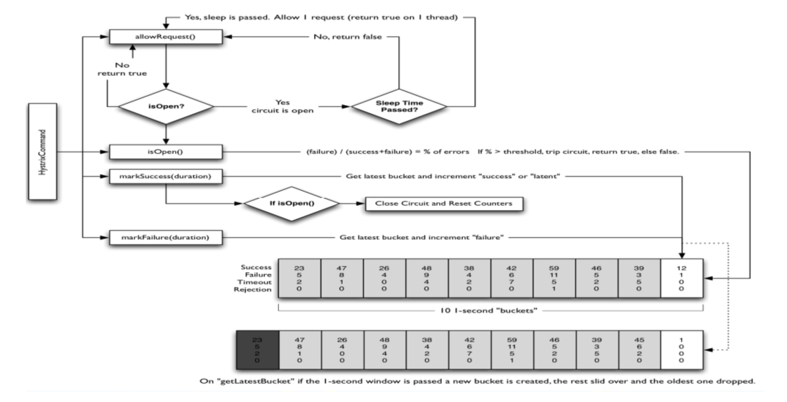

断路器在什么情况下开始起作用

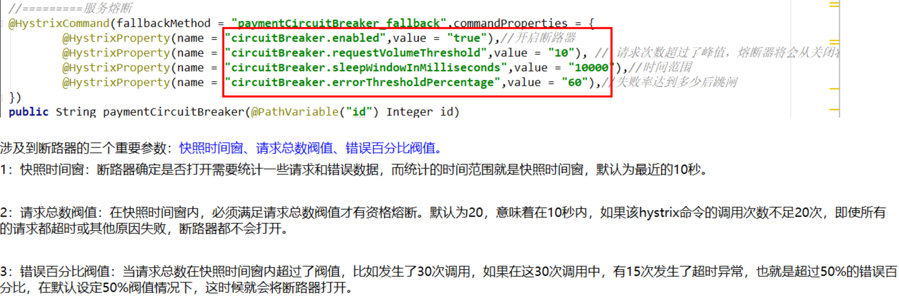

**断路器开启或者关闭的条件**

1. **当满足一定的阀值的时候（默认10秒内超过20个请求次数）**

2. **当失败率达到一定的时候（默认10秒内超过50%的请求失败）**

3. **到达以上阀值，断路器将会开启**

4. **当开启的时候，所有请求都不会进行转发**

5. **一段时间之后（默认是5秒），这个时候断路器是半开状态，会让其中一个请求进行转发。如果成功，断路器会关闭，若失败，继续开启。重复4和5**

**断路器打开之后**

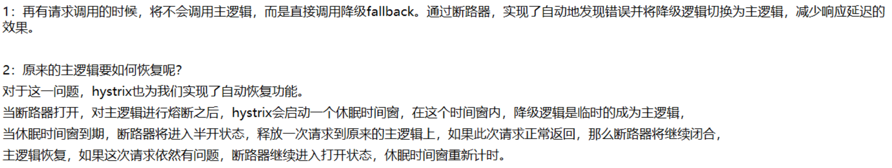

```java
//========================All
@HystrixCommand(fallbackMethod = "str_fallbackMethod",
        groupKey = "strGroupCommand",
        commandKey = "strCommand",
        threadPoolKey = "strThreadPool",

        commandProperties = {
                // 设置隔离策略，THREAD 表示线程池 SEMAPHORE：信号池隔离
                @HystrixProperty(name = "execution.isolation.strategy", value = "THREAD"),
                // 当隔离策略选择信号池隔离的时候，用来设置信号池的大小（最大并发数）
                @HystrixProperty(name = "execution.isolation.semaphore.maxConcurrentRequests", value = "10"),
                // 配置命令执行的超时时间
                @HystrixProperty(name = "execution.isolation.thread.timeoutinMilliseconds", value = "10"),
                // 是否启用超时时间
                @HystrixProperty(name = "execution.timeout.enabled", value = "true"),
                // 执行超时的时候是否中断
                @HystrixProperty(name = "execution.isolation.thread.interruptOnTimeout", value = "true"),
                // 执行被取消的时候是否中断
                @HystrixProperty(name = "execution.isolation.thread.interruptOnCancel", value = "true"),
                // 允许回调方法执行的最大并发数
                @HystrixProperty(name = "fallback.isolation.semaphore.maxConcurrentRequests", value = "10"),
                // 服务降级是否启用，是否执行回调函数
                @HystrixProperty(name = "fallback.enabled", value = "true"),
                // 是否启用断路器
                @HystrixProperty(name = "circuitBreaker.enabled", value = "true"),
                // 该属性用来设置在滚动时间窗中，断路器熔断的最小请求数。例如，默认该值为 20 的时候，
                // 如果滚动时间窗（默认10秒）内仅收到了19个请求， 即使这19个请求都失败了，断路器也不会打开。
                @HystrixProperty(name = "circuitBreaker.requestVolumeThreshold", value = "20"),
                // 该属性用来设置在滚动时间窗中，表示在滚动时间窗中，在请求数量超过
                // circuitBreaker.requestVolumeThreshold 的情况下，如果错误请求数的百分比超过50,
                // 就把断路器设置为 "打开" 状态，否则就设置为 "关闭" 状态。
                @HystrixProperty(name = "circuitBreaker.errorThresholdPercentage", value = "50"),
                // 该属性用来设置当断路器打开之后的休眠时间窗。 休眠时间窗结束之后，
                // 会将断路器置为 "半开" 状态，尝试熔断的请求命令，如果依然失败就将断路器继续设置为 "打开" 状态，
                // 如果成功就设置为 "关闭" 状态。
                @HystrixProperty(name = "circuitBreaker.sleepWindowinMilliseconds", value = "5000"),
                // 断路器强制打开
                @HystrixProperty(name = "circuitBreaker.forceOpen", value = "false"),
                // 断路器强制关闭
                @HystrixProperty(name = "circuitBreaker.forceClosed", value = "false"),
                // 滚动时间窗设置，该时间用于断路器判断健康度时需要收集信息的持续时间
                @HystrixProperty(name = "metrics.rollingStats.timeinMilliseconds", value = "10000"),
                // 该属性用来设置滚动时间窗统计指标信息时划分"桶"的数量，断路器在收集指标信息的时候会根据
                // 设置的时间窗长度拆分成多个 "桶" 来累计各度量值，每个"桶"记录了一段时间内的采集指标。
                // 比如 10 秒内拆分成 10 个"桶"收集这样，所以 timeinMilliseconds 必须能被 numBuckets 整除。否则会抛异常
                @HystrixProperty(name = "metrics.rollingStats.numBuckets", value = "10"),
                // 该属性用来设置对命令执行的延迟是否使用百分位数来跟踪和计算。如果设置为 false, 那么所有的概要统计都将返回 -1。
                @HystrixProperty(name = "metrics.rollingPercentile.enabled", value = "false"),
                // 该属性用来设置百分位统计的滚动窗口的持续时间，单位为毫秒。
                @HystrixProperty(name = "metrics.rollingPercentile.timeInMilliseconds", value = "60000"),
                // 该属性用来设置百分位统计滚动窗口中使用 “ 桶 ”的数量。
                @HystrixProperty(name = "metrics.rollingPercentile.numBuckets", value = "60000"),
                // 该属性用来设置在执行过程中每个 “桶” 中保留的最大执行次数。如果在滚动时间窗内发生超过该设定值的执行次数，
                // 就从最初的位置开始重写。例如，将该值设置为100, 滚动窗口为10秒，若在10秒内一个 “桶 ”中发生了500次执行，
                // 那么该 “桶” 中只保留 最后的100次执行的统计。另外，增加该值的大小将会增加内存量的消耗，并增加排序百分位数所需的计算时间。
                @HystrixProperty(name = "metrics.rollingPercentile.bucketSize", value = "100"),
                // 该属性用来设置采集影响断路器状态的健康快照（请求的成功、 错误百分比）的间隔等待时间。
                @HystrixProperty(name = "metrics.healthSnapshot.intervalinMilliseconds", value = "500"),
                // 是否开启请求缓存
                @HystrixProperty(name = "requestCache.enabled", value = "true"),
                // HystrixCommand的执行和事件是否打印日志到 HystrixRequestLog 中
                @HystrixProperty(name = "requestLog.enabled", value = "true"),
        },
        threadPoolProperties = {
                // 该参数用来设置执行命令线程池的核心线程数，该值也就是命令执行的最大并发量
                @HystrixProperty(name = "coreSize", value = "10"),
                // 该参数用来设置线程池的最大队列大小。当设置为 -1 时，线程池将使用 SynchronousQueue 实现的队列，
                // 否则将使用 LinkedBlockingQueue 实现的队列。
                @HystrixProperty(name = "maxQueueSize", value = "-1"),
                // 该参数用来为队列设置拒绝阈值。 通过该参数， 即使队列没有达到最大值也能拒绝请求。
                // 该参数主要是对 LinkedBlockingQueue 队列的补充,因为 LinkedBlockingQueue
                // 队列不能动态修改它的对象大小，而通过该属性就可以调整拒绝请求的队列大小了。
                @HystrixProperty(name = "queueSizeRejectionThreshold", value = "5"),
        }
)
public String strConsumer() {
    return "hello 2020";
}
public String str_fallbackMethod()
{
    return "*****fall back str_fallbackMethod";
}

```

### 8.3.6. 服务限流【高级篇讲解alibaba的Sentinel说明】

## 8.4. hystrix工作流程

官网  https://github.com/Netflix/Hystrix/wiki/How-it-Works

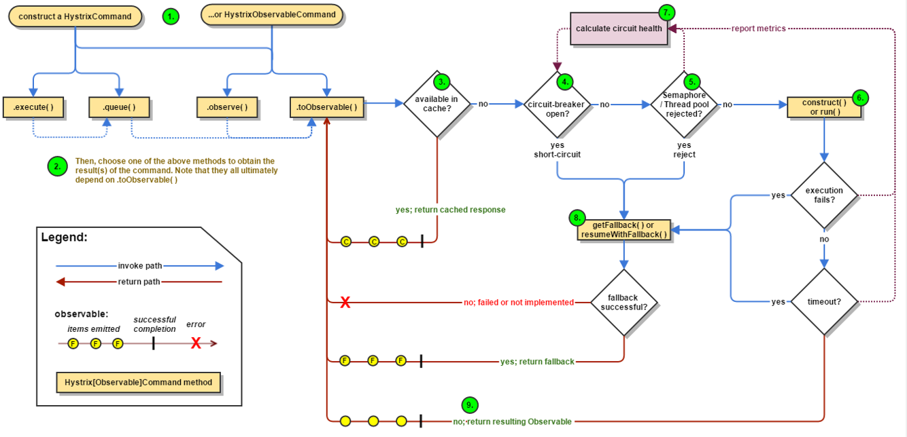

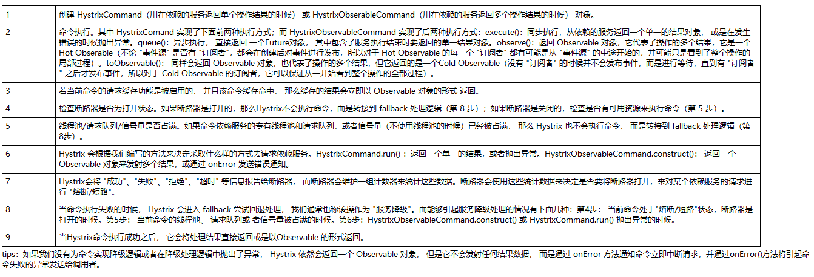

## 8.5. 服务监控hystrixDashboard

### 8.5.1. 配置监控模块

除了隔离依赖服务的调用以外，Hystrix还提供了**准实时的调用监控（Hystrix Dashboard）**，Hystrix会持续地记录所有通过Hystrix发起的请求的执行信息，并以统计报表和图形的形式展示给用户，包括每秒执行多少请求多少成功，多少失败等。Netflix通过hystrix-metrics-event-stream项目实现了对以上指标的监控。Spring Cloud也提供了Hystrix Dashboard的整合，对监控内容转化成可视化界面。

```sh
cloud-consumer-hystrix-dashboard9001
```

```xml
        <dependency>
            <groupId>org.springframework.cloud</groupId>
            <artifactId>spring-cloud-starter-netflix-hystrix-dashboard</artifactId>
        </dependency>
        <dependency>
            <groupId>org.springframework.boot</groupId>
            <artifactId>spring-boot-starter-actuator</artifactId>
        </dependency>

        <dependency>
            <groupId>org.springframework.boot</groupId>
            <artifactId>spring-boot-devtools</artifactId>
            <scope>runtime</scope>
            <optional>true</optional>
        </dependency>
        <dependency>
            <groupId>org.projectlombok</groupId>
            <artifactId>lombok</artifactId>
            <optional>true</optional>
        </dependency>
        <dependency>
            <groupId>org.springframework.boot</groupId>
            <artifactId>spring-boot-starter-test</artifactId>
            <scope>test</scope>
        </dependency>
```

```yaml
server:
  port: 9001
```

**HystrixDashboardMain9001+新注解@EnableHystrixDashboard**

**所有Provider微服务提供类(8001/8002/8003)都需要监控依赖配置，此前已经配好了**

```xml
   <!-- actuator监控信息完善 -->
<dependency>
    <groupId>org.springframework.boot</groupId>
    <artifactId>spring-boot-starter-actuator</artifactId>
</dependency>
```

**启动cloud-consumer-hystrix-dashboard9001该微服务后续将监控微服务8001**

```java
@SpringBootApplication
@EnableHystrixDashboard
public class HystrixDashboardMain9001 {
    public static void main(String[] args) {
        SpringApplication.run(HystrixDashboardMain9001.class, args);
    }
}
```

http://localhost:9001/hystrix

### 8.5.2. 断路器演示(服务监控hystrixDashboard)

修改cloud-provider-hystrix-payment8001

注意:新版本Hystrix需要在主启动类MainAppHystrix8001中指定监控路径

```java
@SpringBootApplication
@EnableEurekaClient //本服务启动后会自动注册进eureka服务中
@EnableCircuitBreaker//对hystrixR熔断机制的支持
public class MainAppHystrix8001 {
    public static void main(String[] args) {
        SpringApplication.run(MainAppHystrix8001.class,args);
    }

/**
 *此配置是为了服务监控而配置，与服务容错本身无关，springcloud升级后的坑
 *ServletRegistrationBean因为springboot的默认路径不是"/hystrix.stream"，
 *只要在自己的项目里配置上下面的servlet就可以了
 */
@Bean
public ServletRegistrationBean getServlet() {
    HystrixMetricsStreamServlet streamServlet = new HystrixMetricsStreamServlet();
    ServletRegistrationBean registrationBean = new ServletRegistrationBean(streamServlet);
    registrationBean.setLoadOnStartup(1);
    registrationBean.addUrlMappings("/hystrix.stream");
    registrationBean.setName("HystrixMetricsStreamServlet");
    return registrationBean;
}

}
```

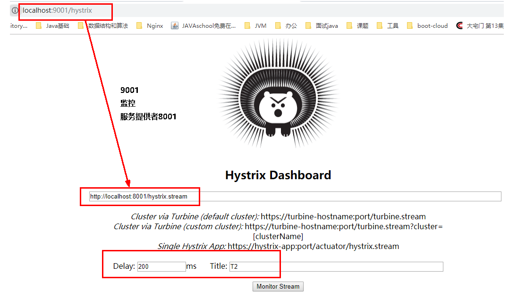

1：Delay：该参数用来控制服务器上轮询监控信息的延迟时间，默认为2000毫秒，可以通过配置该属性来降低客户端的网络和CPU消耗。

2：Title：该参数对应了头部标题Hystrix Stream之后的内容，默认会使用具体监控实例的URL，可以通过配置该信息来展示更合适的标题。 

测试填写地址http://localhost:8001/hystrix.stream

测试案例 ：http://localhost:8001/payment/circuit/31

测试案例 ：http://localhost:8001/payment/circuit/-31

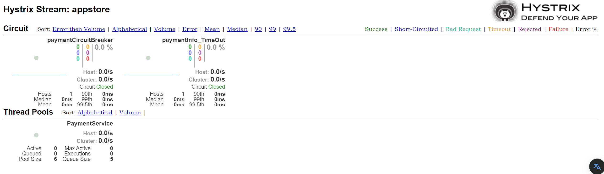

七色：每种原色对应一种状态

实心圆：共有两种含义。它通过颜色的变化代表了实例的健康程度，它的健康度从绿色<黄色<橙色<红色递减。
该实心圆除了颜色的变化之外，它的大小也会根据实例的请求流量发生变化，流量越大该实心圆就越大。所以通过该实心圆的展示，就可以在大量的实例中快速的发现故障实例和高压力实例

曲线：用来记录2分钟内流量的相对变化，可以通过它来观察到流量的上升和下降趋势。

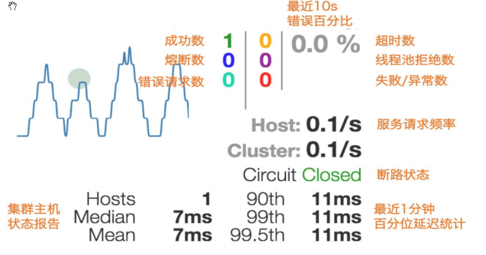

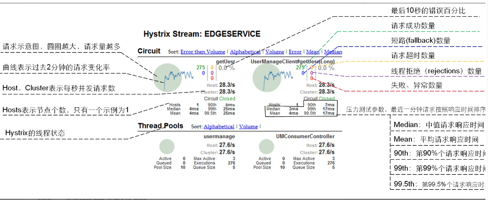


# 9. Gateway新一代网关

## 9.1. 概述简介

### 9.1.1. 概述

上一代zuul 1.X https://github.com/Netflix/zuul/wiki

当前gateway https://cloud.spring.io/spring-cloud-static/spring-cloud-gateway/2.2.1.RELEASE/reference/html/

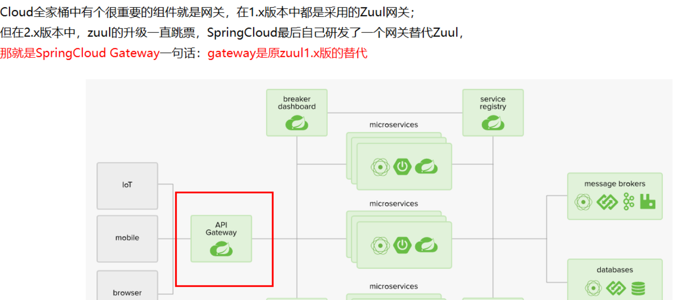

Gateway是在Spring生态系统之上构建的API网关服务，基于Spring 5，Spring Boot 2和 Project Reactor等技术。
Gateway旨在提供一种简单而有效的方式来对API进行路由，以及提供一些强大的过滤器功能， 例如：熔断、限流、重试等

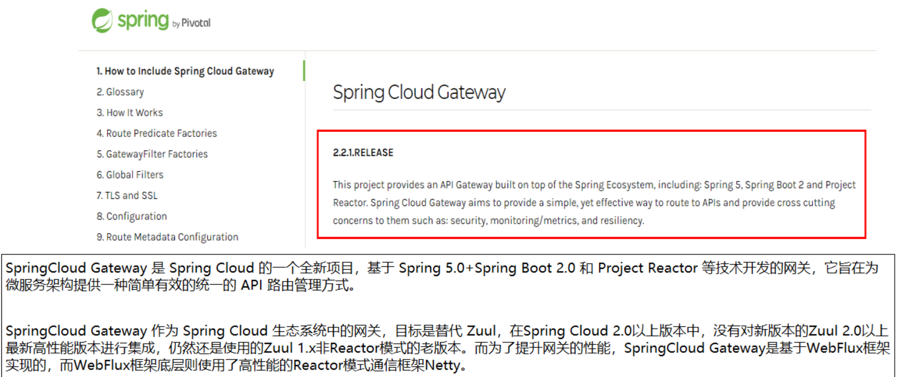

SpringCloud Gateway 使用的Webflux中的reactor-netty响应式编程组件，底层使用了Netty通讯框架。


能干嘛

- 反向代理
- 鉴权
- 流量控制
- 熔断
- 日志监控

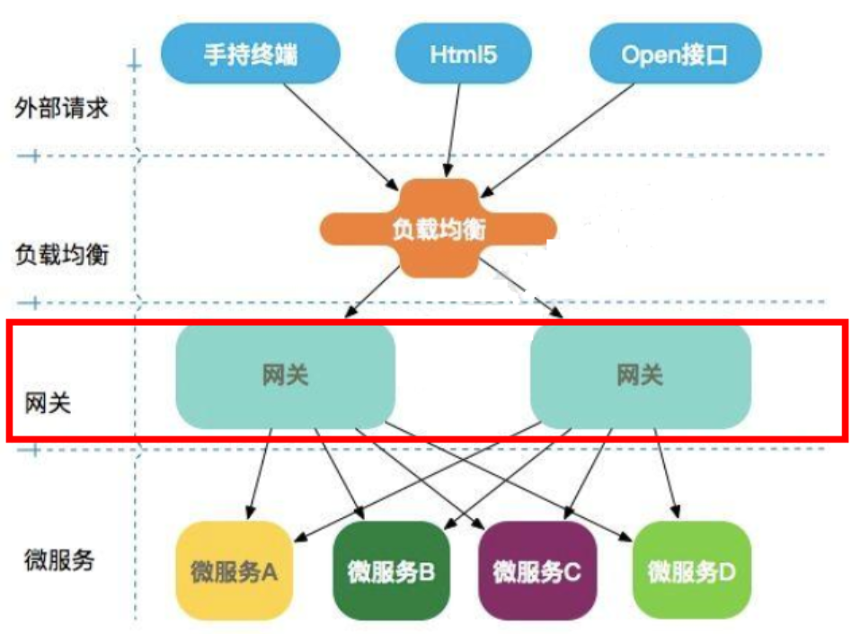

有Zuul了怎么又出来了gateway

### 9.1.3. 我们为什么选择Gateway？

1. **一方面因为Zuul1.0已经进入了维护阶段，而且Gateway是SpringCloud团队研发的，是亲儿子产品，值得信赖。而且很多功能Zuul都没有，用起来也非常的简单便捷。**

Gateway是基于异步非阻塞模型上进行开发的，性能方面不需要担心。虽然Netflix早就发布了最新的 Zuul 2.x，但 Spring Cloud 貌似没有整合计划。而且Netflix相关组件都宣布进入维护期；不知前景如何？

多方面综合考虑Gateway是很理想的网关选择。

2. **Spring Cloud Gateway 具有如下特性：**

基于Spring Framework 5, Project Reactor 和 Spring Boot 2.0 进行构建；
动态路由：能够匹配任何请求属性；
可以对路由指定 Predicate（断言）和 Filter（过滤器）；
集成Hystrix的断路器功能；
集成 Spring Cloud 服务发现功能；
易于编写的 Predicate（断言）和 Filter（过滤器）；
请求限流功能；
支持路径重写。

3. **Spring Cloud Gateway 与 Zuul的区别**

   在SpringCloud Finchley 正式版之前，Spring Cloud 推荐的网关是 Netflix 提供的Zuul：

1、Zuul 1.x，是一个基于阻塞 I/ O 的 API Gateway

2、Zuul 1.x 基于Servlet 2. 5使用阻塞架构它不支持任何长连接(如 WebSocket) Zuul 的设计模式和Nginx较像，每次 I/ O 操作都是从工作线程中选择一个执行，请求线程被阻塞到工作线程完成，但是差别是Nginx 用C++ 实现，Zuul 用 Java 实现，而 JVM 本身会有第一次加载较慢的情况，使得Zuul 的性能相对较差。

3、Zuul 2.x理念更先进，想基于Netty非阻塞和支持长连接，但SpringCloud目前还没有整合。 Zuul 2.x的性能较 Zuul 1.x 有较大提升。在性能方面，根据官方提供的基准测试， Spring Cloud Gateway 的 RPS（每秒请求数）是Zuul 的 1. 6 倍。

4、Spring Cloud Gateway 建立 在 Spring Framework 5、 Project Reactor 和 Spring Boot 2 之上， 使用非阻塞 API。

5、Spring Cloud Gateway 还 支持 WebSocket， 并且与Spring紧密集成拥有更好的开发体验

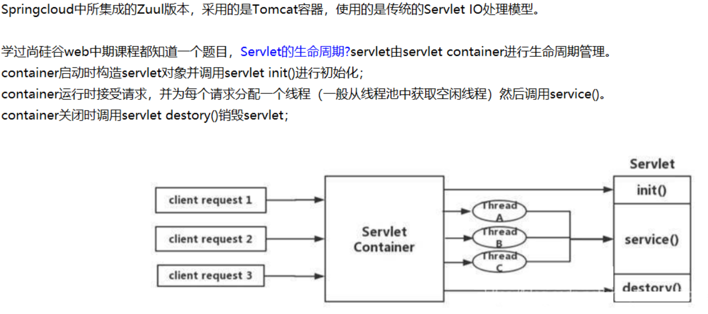

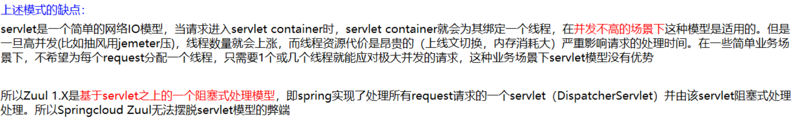

GateWay模型

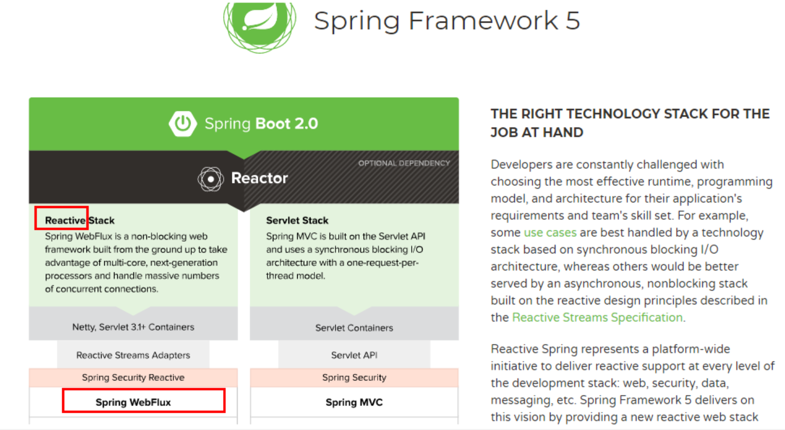

https://docs.spring.io/spring/docs/current/spring-framework-reference/web-reactive.html#webflux-new-framework

传统的Web框架，比如说：struts2，springmvc等都是基于Servlet API与Servlet容器基础之上运行的。
**但是在Servlet3.1之后有了异步非阻塞的支持。**而WebFlux是一个典型非阻塞异步的框架，它的核心是基于Reactor的相关API实现的。相对于传统的web框架来说，它可以运行在诸如Netty，Undertow及支持Servlet3.1的容器上。非阻塞式+函数式编程（Spring5必须让你使用java8）

Spring WebFlux 是 Spring 5.0 引入的新的响应式框架，区别于 Spring MVC，它不需要依赖Servlet API，它是完全异步非阻塞的，并且基于 Reactor 来实现响应式流规范。

## 9.2. 三大核心概念

### 9.2.1. Route(路由)

路由是构建网关的基本模块，它由ID，目标URI，一系列的断言和过滤器组成，如果断言为true则匹配该路由

### 9.2.2. Predicate(断言)

参考的是Java8的`java.util.function.Predicate`
开发人员可以匹配HTTP请求中的所有内容(例如请求头或请求参数)，<font color="bb000">如果请求与断言相匹配则进行路由</font>

### 9.2.3. Filter(过滤)

指的是Spring框架中GatewayFilter的实例，使用过滤器，可以在请求被路由前或者之后对请求进行修改。

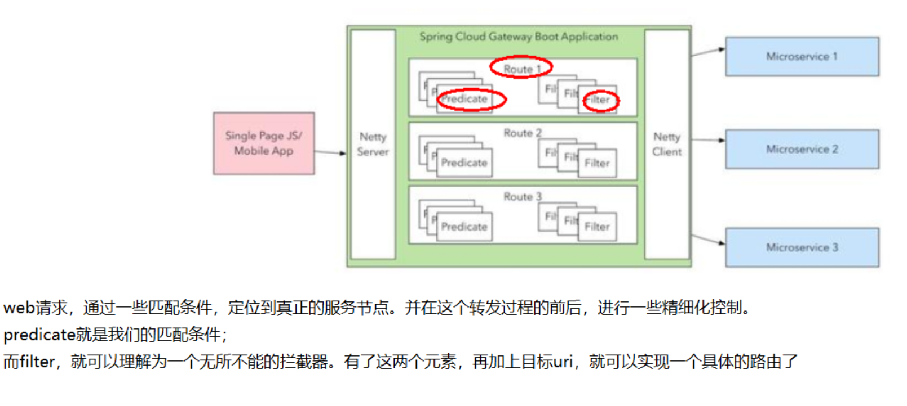

## 9.3. 工作流程

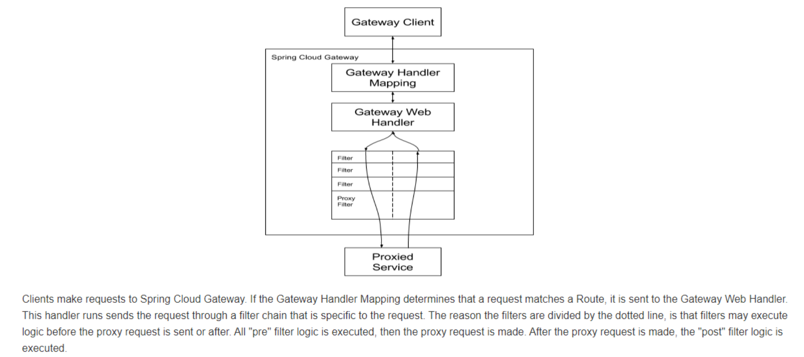

客户端向 Spring Cloud Gateway 发出请求。然后在 Gateway Handler Mapping 中找到与请求相匹配的路由，将其发送到 Gateway Web Handler。

Handler 再通过指定的过滤器链来将请求发送到我们实际的服务执行业务逻辑，然后返回。
过滤器之间用虚线分开是因为过滤器可能会在发送代理请求之前（“pre”）或之后（“post”）执行业务逻辑。

Filter在“pre”类型的过滤器可以做参数校验、权限校验、流量监控、日志输出、协议转换等，
在“post”类型的过滤器中可以做响应内容、响应头的修改，日志的输出，流量监控等有着非常重要的作用。

**核心逻辑 :路由转发+执行过滤器链**

## 9.4. 入门配置

### 9.4.1. 新建module

#### 1. 基础配置

```sh
cloud-gateway-gateway9527
```

网关是不需要配置web-starter和图形化界面的包的。

```xml
        <!--gateway-->
        <dependency>
            <groupId>org.springframework.cloud</groupId>
            <artifactId>spring-cloud-starter-gateway</artifactId>
        </dependency>
        <!--eureka-client-->
        <dependency>
            <groupId>org.springframework.cloud</groupId>
            <artifactId>spring-cloud-starter-netflix-eureka-client</artifactId>
        </dependency>
        <!-- 引入自己定义的api通用包，可以使用Payment支付Entity -->
        <dependency>
            <groupId>com.fanxy.springcloud</groupId>
            <artifactId>cloud-api-commons</artifactId>
            <version>${project.version}</version>
        </dependency>
        <!--一般基础配置类-->
        <dependency>
            <groupId>org.springframework.boot</groupId>
            <artifactId>spring-boot-devtools</artifactId>
            <scope>runtime</scope>
            <optional>true</optional>
        </dependency>
        <dependency>
            <groupId>org.projectlombok</groupId>
            <artifactId>lombok</artifactId>
            <optional>true</optional>
        </dependency>
        <dependency>
            <groupId>org.springframework.boot</groupId>
            <artifactId>spring-boot-starter-test</artifactId>
            <scope>test</scope>
        </dependency>
```

```yaml
server:
  port: 9527

spring:
  application:
    name: cloud-gateway

eureka:
  instance:
    hostname: cloud-gateway-service
  client: #服务提供者provider注册进eureka服务列表内
    service-url:
      register-with-eureka: true
      fetch-registry: true
      defaultZone: http://eureka7001.com:7001/eureka,http://eureka7002.com:7002/eureka
```

业务类 : 无。主启动要注册到Eureka

```java
@SpringBootApplication
@EnableEurekaClient
public class GateWayMain9527 {
    public static void main(String[] args) {
        SpringApplication.run(GateWayMain9527.class,args);
    }
}
```

#### 2. 9527网关路由映射

cloud-provider-payment8001看看controller的访问地址

- get
- lb

我们目前不想暴露8001端口，希望在8001外面套一层9527

```yaml
server:
  port: 9527

spring:
  application:
    name: cloud-gateway
  cloud:
    gateway:
      routes:
        - id: payment_routh #payment_route    #路由的ID，没有固定规则但要求唯一，建议配合服务名
          uri: http://localhost:8001          #匹配后提供服务的路由地址
          predicates:
            - Path=/payment/get/**         # 断言，路径相匹配的进行路由

        - id: payment_routh2 #payment_route    #路由的ID，没有固定规则但要求唯一，建议配合服务名
          uri: http://localhost:8001          #匹配后提供服务的路由地址
          predicates:
            - Path=/payment/lb/**         # 断言，路径相匹配的进行路由

eureka:
  instance:
    hostname: cloud-gateway-service
  client: #服务提供者provider注册进eureka服务列表内
    service-url:
      register-with-eureka: true
      fetch-registry: true
      defaultZone: http://eureka7001.com:7001/eureka,http://eureka7002.com:7002/eureka
```

启动7001 7002

启动8001 ------->cloud-provider-payment8001

启动9527网关

添加网关前------->http://localhost:8001/payment/get/31

添加网关后------->http://localhost:9527/payment/get/31

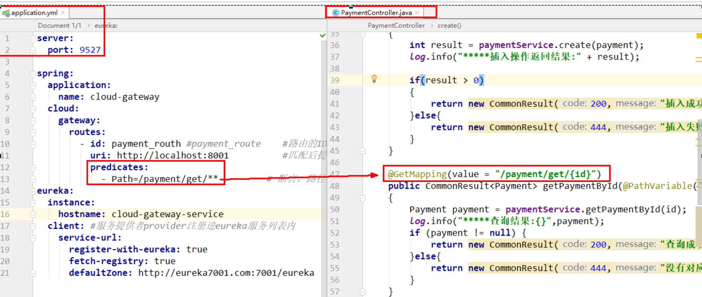

### 9.4.2. YAML配置说明

Gateway网关路由有两种配置方式：

1. 在配置文件yml中配置

2. 代码中注入RouteLocator的Bean

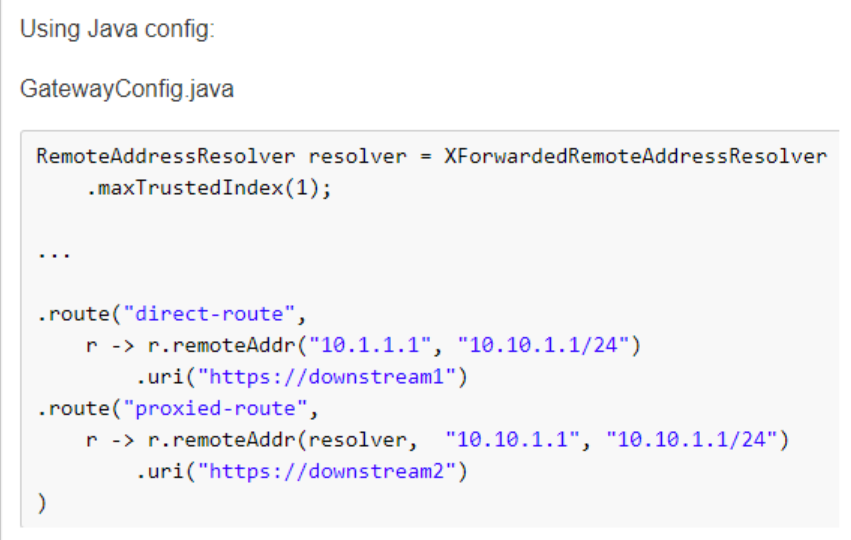

B站鬼畜区

https://www.bilibili.com/v/kichiku

业务需求

通过9527网关访问到外网的B站鬼畜区 ---->编码

cloud-gateway-gateway9527

```java
@Configuration
public class GateWayConfiguration {
    /**
     * 配置了一个id为route-name的路由规则，
     * 当访问地址 http://localhost:9527/guichu时会自动转发到地址https://www.bilibili.com/v/kichiku
     * @param builder
     * @return
     */
    @Bean
    public RouteLocator customRouteLocator(RouteLocatorBuilder builder) {
        RouteLocatorBuilder.Builder routes = builder.routes();

        routes.route("path_route_guichu", r -> r.path("/guichu").uri("https://www.bilibili.com/v/kichiku"));

        return routes.build();

    }
}
```

## 9.5. 通过微服务名实现动态路由

默认情况下Gateway会根据注册中心注册的服务列表，以注册中心上微服务名为路径创建<font color="bb000">动态路由进行转发，从而实现动态路由的功能</font>

启动：一个eureka7001 + 两个服务提供者8001/8002

```xml
<dependency>
    <groupId>org.springframework.cloud</groupId>
    <artifactId>spring-cloud-starter-netflix-eureka-client</artifactId>
</dependency>
```

**这里开启服务名称的动态路由的配置好像是默认为true，我关闭了仍能实现动态负载均衡**

```yaml
server:
  port: 9527

spring:
  application:
    name: cloud-gateway
  cloud:
    gateway:
      discovery:
        locator:
          enabled: true #开启从注册中心动态创建路由的功能，利用微服务名进行路由
      routes:
        - id: payment_routh #payment_route    #路由的ID，没有固定规则但要求唯一，建议配合服务名
          # uri: http://localhost:8001          #匹配后提供服务的路由地址
          uri: lb://cloud-payment-service #匹配后提供服务的路由地址
          predicates:
            - Path=/payment/get/**         # 断言，路径相匹配的进行路由

        - id: payment_routh2 #payment_route    #路由的ID，没有固定规则但要求唯一，建议配合服务名
          # uri: http://localhost:8001          #匹配后提供服务的路由地址
          uri: lb://cloud-payment-service #匹配后提供服务的路由地址
          predicates:
            - Path=/payment/lb/**         # 断言，路径相匹配的进行路由

eureka:
  instance:
    hostname: cloud-gateway-service
  client: #服务提供者provider注册进eureka服务列表内
    service-url:
      register-with-eureka: true
      fetch-registry: true
      defaultZone: http://eureka7001.com:7001/eureka,http://eureka7002.com:7002/eureka
```

需要注意的是`uri`的协议为`lb`，表示启用`Gateway`的负载均衡功能。

`lb://serviceName`是`spring cloud gateway`在微服务中自动为我们创建的负载均衡`uri`

测试http://localhost:9527/payment/lb

实现了8001/8002两个端口切换

## 9.6. Predicate的使用

### 9.6.1. 概述

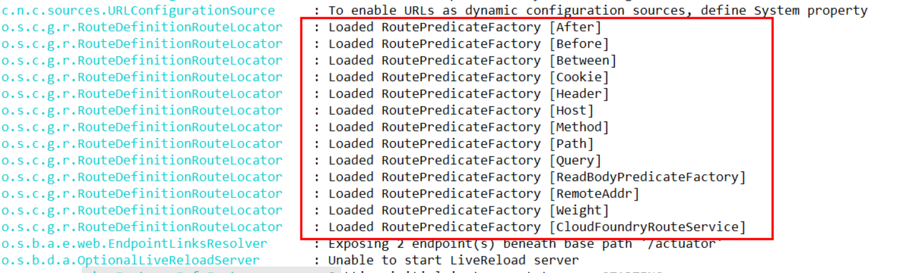

Route Predicate Factories 是什么？

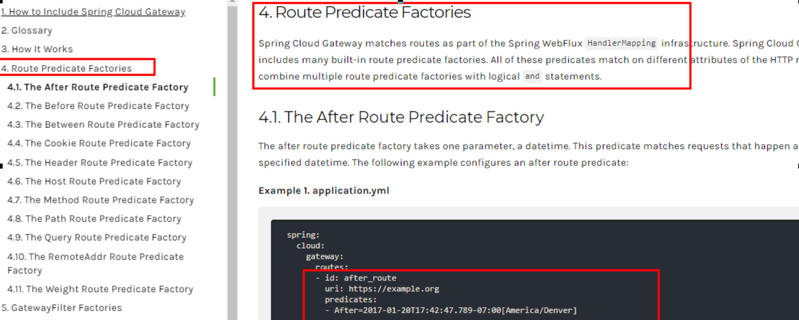

### 9.6.2. 常用的Route Predicate

#### 1. After Route Predicate

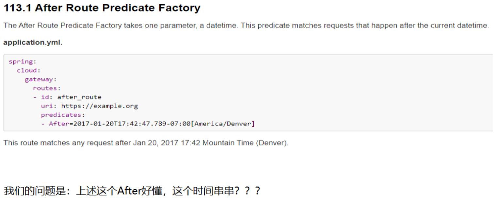

可以直接利用`java8`的时间api获取。

```java
public class TestTime {

    @Test
    public void test1() {
        ZonedDateTime zbj = ZonedDateTime.now(); // 默认时区
        System.out.println(zbj);
        // 用指定时区获取当前时间
//        ZonedDateTime zny = ZonedDateTime.now(ZoneId.of("America/New_York"));         
//        System.out.println(zny);
    }
}
```

```yaml
server:
  port: 9527

spring:
  application:
    name: cloud-gateway
  cloud:
    gateway:
      discovery:
        locator:
          enabled: true #开启从注册中心动态创建路由的功能
      routes:
        - id: payment_routh #payment_route    #路由的ID，没有固定规则但要求唯一，建议配合服务名
          # uri: http://localhost:8001          #匹配后提供服务的路由地址
          uri: lb://cloud-payment-service #匹配后提供服务的路由地址
          predicates:
            - Path=/payment/get/**         # 断言，路径相匹配的进行路由

        - id: payment_routh2 #payment_route    #路由的ID，没有固定规则但要求唯一，建议配合服务名
          # uri: http://localhost:8001          #匹配后提供服务的路由地址
          uri: lb://cloud-payment-service #匹配后提供服务的路由地址
          predicates:
       - Path=/payment/lb/**         # 断言，路径相匹配的进行路由
             - After=2023-07-20T16:38:30.342+08:00[Asia/Shanghai]         
             # 断言，路径相匹配的进行路由


eureka:
  instance:
    hostname: cloud-gateway-service
  client: #服务提供者provider注册进eureka服务列表内
    service-url:
      register-with-eureka: true
      fetch-registry: true
      defaultZone: http://eureka7001.com:7001/eureka,http://eureka7002.com:7002/eureka

```

#### 2. Before Route Predicate

雷同

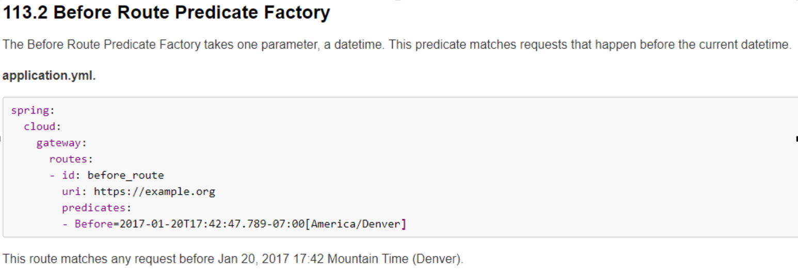

```yaml
          uri: lb://cloud-payment-service #匹配后提供服务的路由地址
          predicates:
            - Path=/payment/lb/**         # 断言，路径相匹配的进行路由
            - After=2023-07-20T16:38:30.342+08:00[Asia/Shanghai]         
            # 断言，路径相匹配的进行路由
            - Before=2023-07-22T16:38:30.342+08:00[Asia/Shanghai]       
            # 断言，路径相匹配的进行路由
```

### 9.6.3. Between Route Predicate

雷同不多阐述，一看就懂

```yaml
          uri: lb://cloud-payment-service #匹配后提供服务的路由地址
          predicates:
            - Path=/payment/lb/**         # 断言，路径相匹配的进行路由
            - Between=2023-07-20T16:38:30.342+08:00[Asia/Shanghai],2023-07-22T16:38:30.342+08:00[Asia/Shanghai]
```

### 9.6.4. Cookie Route Predicate

**Cookie Route Predicate需要两个参数，一个是 Cookie name ,一个是正则表达式。**
**路由规则会通过获取对应的 Cookie name 值和正则表达式去匹配，如果匹配上就会执行路由，如果没有匹配上则不执行。**

```yaml
          uri: lb://cloud-payment-service          #匹配后提供服务的路由地址
          predicates:
            - Path=/payment/lb/**         # 断言，路径相匹配的进行路由
            - After=2023-07-20T15:38:30.342+08:00[Asia/Shanghai]
            - Cookie=username,fanxy
```

**开发常见测试一般使用 Jmeter，postman，同时也有在命令行的命令 curl**

不带cookies访问

```sh
curl http://localhost:9527/payment/lb
```

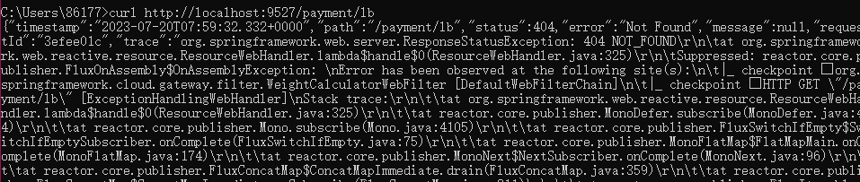

带Cookies访问

```sh
curl http://localhost:9527/payment/lb --Cookie "username,fanxy"
```

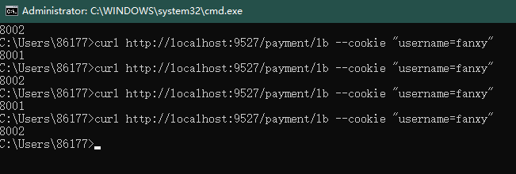

如果控制台返回乱码【window控制台默认编码GBK，其实就是设置成UTF-8】 ：https://blog.csdn.net/leedee/article/details/82685636 

### 9.6.5. Header Route Predicate

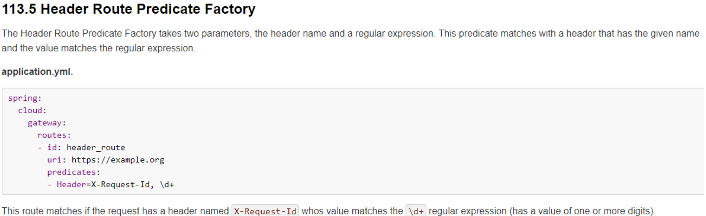

两个参数：一个是属性名称和一个正则表达式，这个属性值和正则表达式匹配则执行。

```yaml
          uri: lb://cloud-payment-service          #匹配后提供服务的路由地址
          predicates:
            - Path=/payment/lb/**         # 断言，路径相匹配的进行路由
            - After=2023-07-20T15:38:30.342+08:00[Asia/Shanghai]
        	- Header=X-Request-Id, \d+  # 请求头要有X-Request-Id属性并且值为整数的正则表达式
```

测试

```sh
curl http://localhost:9527/payment/lb -H "X-Request-Id:123"
```

如果没有带这个请求头，返回404

### 9.6.6. Host Route Predicate

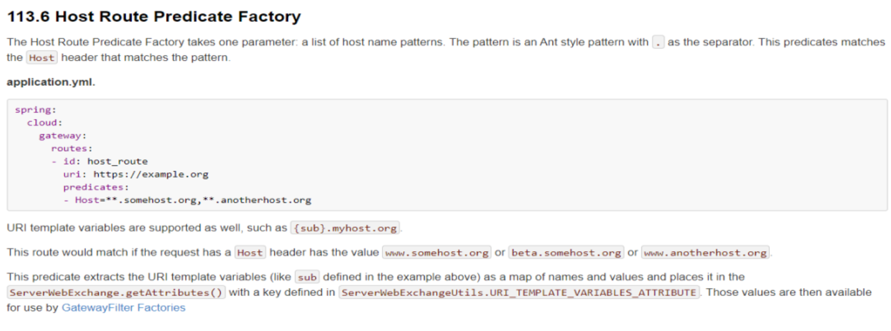

Host Route Predicate 接收一组参数，一组匹配的域名列表，这个模板是一个 ant 分隔的模板，用.号作为分隔符。
它通过参数中的主机地址作为匹配规则。

```yaml
          predicates:
            - Path=/payment/lb/**         # 断言，路径相匹配的进行路由
            - After=2023-07-20T15:38:30.342+08:00[Asia/Shanghai]
            - Host=**.fanxy.cloud
```

测试样例

```sh
curl http://localhost:9527/payment/lb -H "Host:www.fanxy.cloud"
```

### 9.6.7. Method Route Predicate

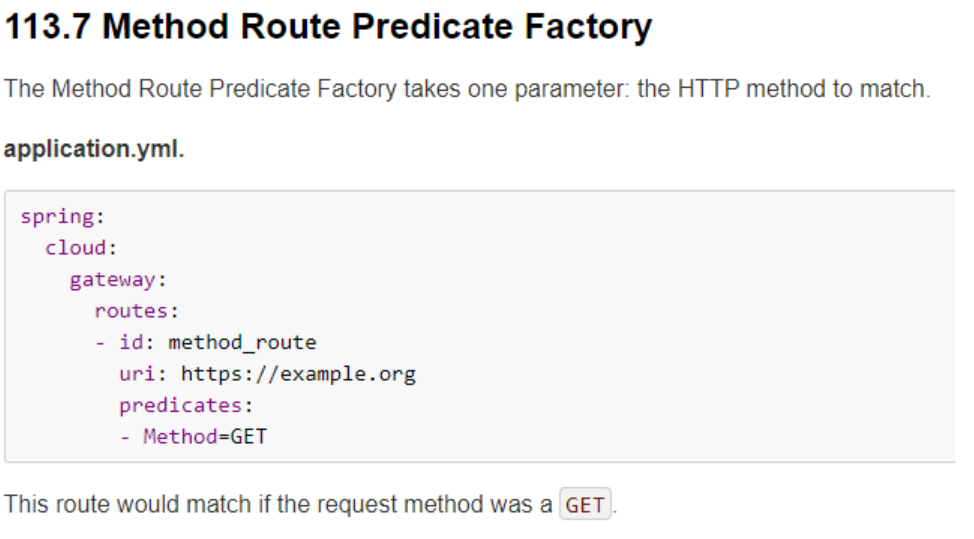

```yaml
          predicates:
            - Path=/payment/lb/**         # 断言，路径相匹配的进行路由
            - After=2023-07-20T15:38:30.342+08:00[Asia/Shanghai]
            - Method=GET
```

测试

```sh
curl -X -POST http://localhost:9527/payment/lb
```

### 9.6.8. Path Route Predicate

**这就是我们此前一直用的**

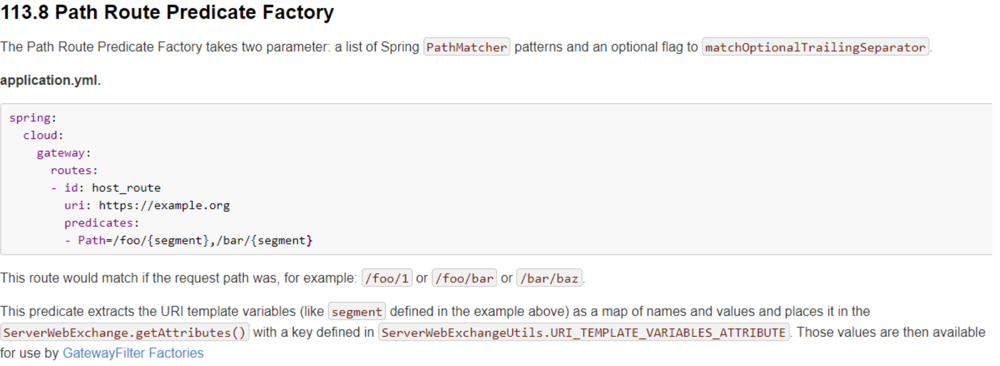

```yaml
          predicates:
            - Path=/payment/lb/**         # 断言，路径相匹配的进行路由
            - After=2023-07-20T15:38:30.342+08:00[Asia/Shanghai]
```

### 9.6.9. Query Route Predicate

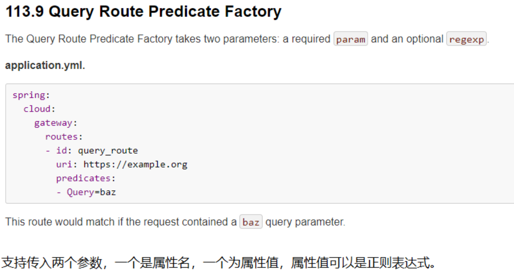

```yaml
          predicates:
            - Path=/payment/lb/**         # 断言，路径相匹配的进行路由
            - After=2023-07-20T15:38:30.342+08:00[Asia/Shanghai]
            - Query=username, \d+ # 要有参数名username并且值还要是整数才能路由
```

测试样例

```sh
http://localhost:9527/payment/lb?username=31
```

```sh
http://localhost:9527/payment/lb?username=-31
```

### 9.6.10. 小总结

断言：是来控制你的网关像那个服务器转发信息。过滤器：是用来过滤你的请求信息。

说白了，Predicate就是为了实现一组匹配规则，让请求过来找到对应的Route进行处理。

## 9.7. Filter的使用

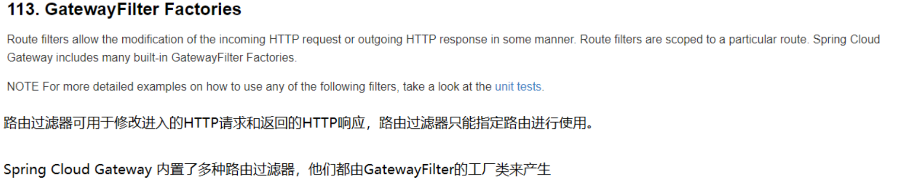

### 9.7.1. **Spring Cloud Gateway的Filter**

生命周期，Only Two

- pre
- post

种类，Only Two

- 1. **GatewayFilter**  https://cloud.spring.io/spring-cloud-static/spring-cloud-gateway/2.2.1.RELEASE/reference/html/#the-addrequestparameter-gatewayfilter-factory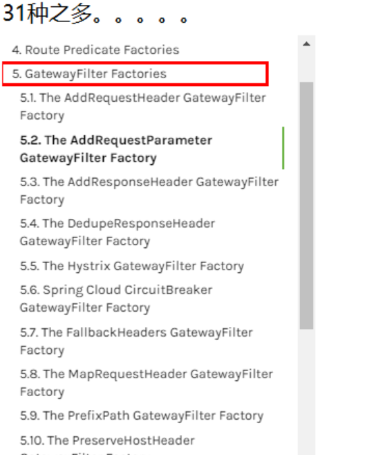
- 2. GlobalFilter


### 9.7.2. 常用的GatewayFilter

**AddRequestParameter**

```yaml
spring:
  application:
    name: cloud-gateway
  cloud:
    gateway:
      discovery:
        locator:
          enabled: true #开启从注册中心动态创建路由的功能
          lower-case-service-id: true #使用小写服务名，默认是大写
      routes:
        - id: payment_routh #payment_route #路由的ID，没有固定规则但要求唯一，建议配合服务名
          uri: lb://cloud-provider-payment #匹配后的目标服务地址，供服务的路由地址
          #uri: http://localhost:8001 #匹配后提供服务的路由地址
          filters:
            - AddRequestParameter=X-Request-Id,1024 
            #过滤器工厂会在匹配的请求头加上一对请求头，名称为X-Request-Id值为1024
          predicates:
            - Path=/paymentInfo/**        # 断言，路径相匹配的进行路由
            - Method=GET,POST
```

### 9.7.3. 自定义过滤器

自定义全局GlobalFilter

两个主要接口介绍

**implements <font color="bb000">GlobalFilter,Ordered</font>**

```java
@Component //必须加，必须加，必须加
public class MyLogGateWayFilter implements GlobalFilter,Ordered {
    @Override
    public Mono<Void> filter(ServerWebExchange exchange, GatewayFilterChain chain) {
        System.out.println("time:"+new Date()+"\t 执行了自定义的全局过滤器: "+"MyLogGateWayFilter"+"hello");

        String uname = exchange.getRequest().getQueryParams().getFirst("uname");
        if (uname == null) {
            System.out.println("****用户名为null，无法登录");
            exchange.getResponse().setStatusCode(HttpStatus.NOT_ACCEPTABLE);
            return exchange.getResponse().setComplete();
        }
        return chain.filter(exchange);
    }
	
    // 顺序 越小优先级越高 最小为0 这就是 springmvc的@Order
    @Override
    public int getOrder() {
        return 0;
    }
}
```

测试，这里记得把之前添加的各种规则看一下，别不满足断言，那就没机会到过滤链这一层了。

```sh
http://localhost:9527/payment/lb?uname=fanxy
```

```sh
http://localhost:9527/payment
```

# 10. SpringCloud Config【被Nacos取代】

## 10.1. 概述

分布式系统面临的---配置问题

微服务意味着要将单体应用中的业务拆分成一个个子服务，每个服务的粒度相对较小，因此系统中会出现大量的服务。由于每个服务都需要必要的配置信息才能运行，所以一套集中式的、动态的配置管理设施是必不可少的。

SpringCloud提供了ConfigServer来解决这个问题，我们每一个微服务自己带着一个application.yml，上百个配置文件的管理....../(ㄒoㄒ)/~~


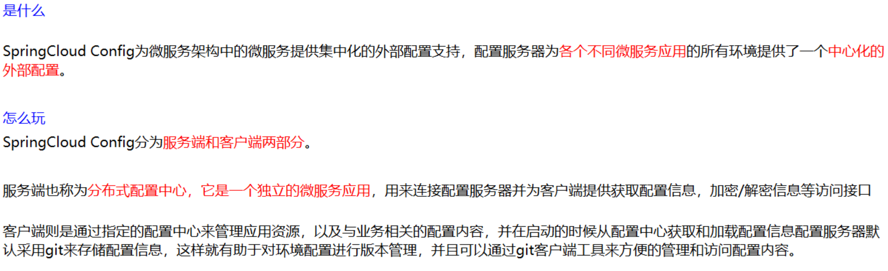

**能干嘛**

- 集中管理配置文件
- 不同环境不同配置，动态化的配置更新，分环境部署比如dev/test/prod/beta/release
- 运行期间动态调整配置，不再需要在每个服务部署的机器上编写配置文件，服务会向配置中心统一拉取配置自己的信息
- 当配置发生变动时，服务不需要重启即可感知到配置的变化并应用新的配置
- 将配置信息以REST接口的形式暴露
- post、curl访问刷新均可......

**与GitHub整合配置**

由于SpringCloud Config默认使用Git来存储配置文件(也有其它方式,比如支持SVN和本地文件)，但最推荐的还是Git，而且使用的是http/https访问的形式

官网：https://cloud.spring.io/spring-cloud-static/spring-cloud-config/2.2.1.RELEASE/reference/html/

## 10.2. Config服务端配置与测试

用你自己的账号在GitHub上新建一个名为springcloud-config的新Repository

```sh
springcloud-config
```

然后clone到本地，然后建立配置文件


新建Module模块名字如下，它即为Cloud的配置中心模块cloudConfig Center

```sh
cloud-config-center-3344
```

```xml
        <dependency>
            <groupId>org.springframework.cloud</groupId>
            <artifactId>spring-cloud-config-server</artifactId>
        </dependency>
        <dependency>
            <groupId>org.springframework.cloud</groupId>
            <artifactId>spring-cloud-starter-netflix-eureka-client</artifactId>
        </dependency>
        <dependency>
            <groupId>org.springframework.boot</groupId>
            <artifactId>spring-boot-starter-web</artifactId>
        </dependency>

        <dependency>
            <groupId>org.springframework.boot</groupId>
            <artifactId>spring-boot-starter-actuator</artifactId>
        </dependency>
        <dependency>
            <groupId>org.springframework.boot</groupId>
            <artifactId>spring-boot-devtools</artifactId>
            <scope>runtime</scope>
            <optional>true</optional>
        </dependency>
        <dependency>
            <groupId>org.projectlombok</groupId>
            <artifactId>lombok</artifactId>
            <optional>true</optional>
        </dependency>
        <dependency>
            <groupId>org.springframework.boot</groupId>
            <artifactId>spring-boot-starter-test</artifactId>
            <scope>test</scope>
        </dependency>
```

```yaml
server:
  port: 3344

spring:
  application:
    name:  cloud-config-center #注册进Eureka服务器的微服务名
  cloud:
    config:
      server:
        git:
          uri: https://github.com/TheFANXY/springcloud-config.git #GitHub上面的git仓库名字
        ####搜索目录
          search-paths:
            - springcloud-config
      ####读取分支
      label: main

#服务注册到eureka地址
eureka:
  client:
    service-url:
      defaultZone: http://eureka7001.com:7001/eureka/,http://eureka7002.com:7002/eureka/
```

```java
@SpringBootApplication
@EnableConfigServer
public class ConfigCenterMain3344 {
    public static void main(String[] args) {
        SpringApplication.run(ConfigCenterMain3344.class, args);
    }
}
```

**配置hosts，模拟本机为配置管理网站。**

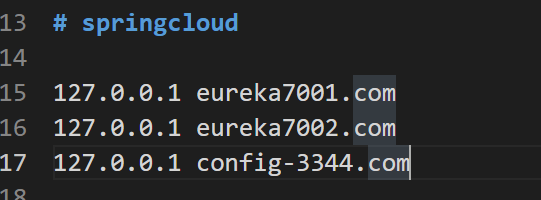

测试通过Config微服务是否可以从GitHub上获取配置内容

启动微服务3344  ------->   http://config-3344.com:3344/main/config-dev.yml

### 10.3.1. 配置读取规则

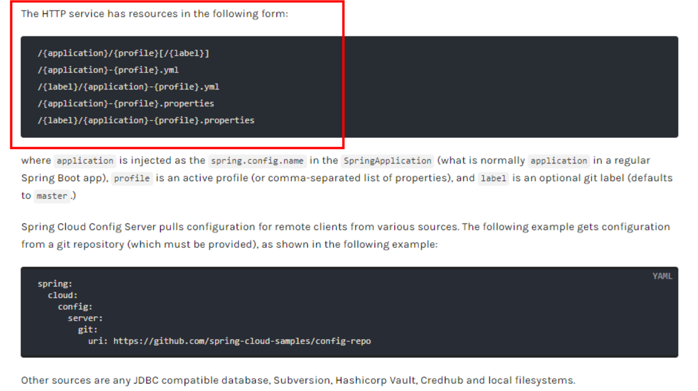

规则一

```sh
/{label}/{application}-{profile}.yml
```

master分支

```sh
http://config-3344.com:3344/master/config-dev.yml
http://config-3344.com:3344/master/config-test.yml
http://config-3344.com:3344/master/config-prod.yml
```

dev分支

```sh
http://config-3344.com:3344/dev/config-dev.yml
http://config-3344.com:3344/dev/config-test.yml
http://config-3344.com:3344/dev/config-prod.yml
```

规则二

配置文件配置了，读取main分支，但是如果你不写，但存在多个分支，默认读取的也是main分支

```sh
/{application}-{profile}.yml
```

```sh
http://config-3344.com:3344/config-dev.yml
http://config-3344.com:3344/config-test.yml
http://config-3344.com:3344/config-prod.yml
http://config-3344.com:3344/config-xxxx.yml(不存在的配置)
```

规则三，从小到大写，默认解析为json串

```sh
/{application}/{profile}[/{label}]
```

```sh
http://config-3344.com:3344/config/dev/master
http://config-3344.com:3344/config/test/master
http://config-3344.com:3344/config/test/dev
```

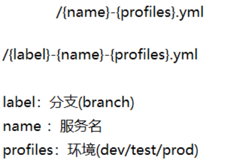

成功实现了用SpringCloud Config通过GitHub获取配置信息

## 10.3. Config客户端配置与测试

新建模块

```sh
cloud-config-client-3355
```

**这里其实也能发现，配置文件这个启动器和3344不同，`spring-cloud-starter-config`没有`server`后缀**

```xml
        <dependency>
            <groupId>org.springframework.cloud</groupId>
            <artifactId>spring-cloud-starter-config</artifactId>
        </dependency>
        <dependency>
            <groupId>org.springframework.cloud</groupId>
            <artifactId>spring-cloud-starter-netflix-eureka-client</artifactId>
        </dependency>
        <dependency>
            <groupId>org.springframework.boot</groupId>
            <artifactId>spring-boot-starter-web</artifactId>
        </dependency>
        <dependency>
            <groupId>org.springframework.boot</groupId>
            <artifactId>spring-boot-starter-actuator</artifactId>
        </dependency>

        <dependency>
            <groupId>org.springframework.boot</groupId>
            <artifactId>spring-boot-devtools</artifactId>
            <scope>runtime</scope>
            <optional>true</optional>
        </dependency>
        <dependency>
            <groupId>org.projectlombok</groupId>
            <artifactId>lombok</artifactId>
            <optional>true</optional>
        </dependency>
        <dependency>
            <groupId>org.springframework.boot</groupId>
            <artifactId>spring-boot-starter-test</artifactId>
            <scope>test</scope>
        </dependency>
```

**<font color="bb000">bootstrap.yml</font>**

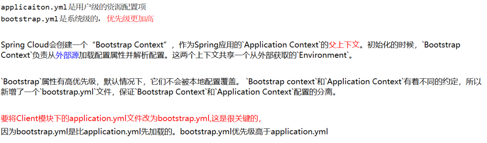**<font color='bb000'>bootstrap > extension > application</font>**

```yaml
server:
  port: 3355

spring:
  application:
    name: config-client
  cloud:
    #Config客户端配置
    config:
      label: main #分支名称
      name: config #配置文件名称
      profile: dev #读取后缀名称   上述3个综合：master分支上config-dev.yml的配置文件被读取http://config-3344.com:3344/master/config-dev.yml
      uri: http://localhost:3344 #配置中心地址k

#服务注册到eureka地址
eureka:
  client:
    service-url:
      defaultZone: http://eureka7001.com:7001/eureka/,http://eureka7002.com:7002/eureka/
```

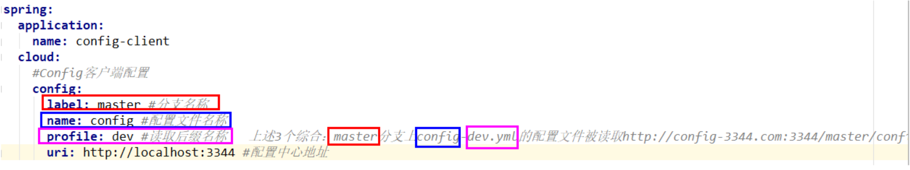

```java
@EnableEurekaClient
@SpringBootApplication
public class ConfigClientMain3355 {
    public static void main(String[] args) {
        SpringApplication.run(ConfigClientMain3355.class,args);
    }
}
```

业务类

```java
@RestController
public class ConfigClientController {
    
    @Value("${config.info}")
    private String configInfo;

    @GetMapping("/configInfo")
    public String getConfigInfo() {
        return configInfo;
    }
}
```

成功实现了客户端3355访问SpringCloud Config3344通过GitHub获取配置信息

修改config-dev.yml配置并提交到GitHub中，比如加个变量age或者版本号version

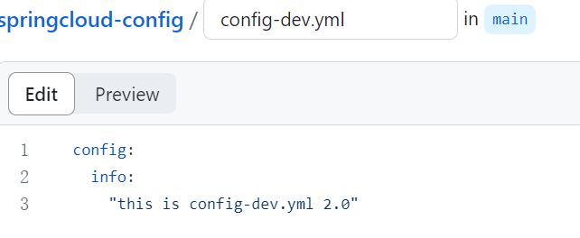

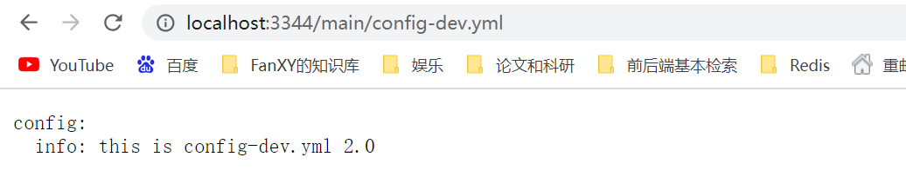

**发现3344端口这里立马发生配置更改，但3355没有变化**

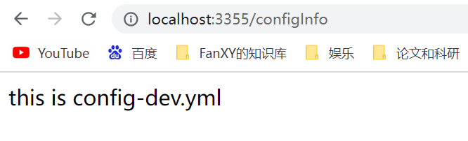

**难到每次运维修改配置文件，客户端都需要重启？？噩梦**

## 10.4. Config客户端之动态刷新

修改3355模块

```xml
<dependency>
    <groupId>org.springframework.boot</groupId>
    <artifactId>spring-boot-starter-actuator</artifactId>
</dependency>
```

```yaml
server:
  port: 3355

spring:
  application:
    name: config-client
  cloud:
    #Config客户端配置
    config:
      label: main #分支名称
      name: config #配置文件名称
      profile: dev #读取后缀名称   上述3个综合：master分支上config-dev.yml的配置文件被读取
      uri: http://localhost:3344 #配置中心地址k

#服务注册到eureka地址
eureka:
  client:
    service-url:
      defaultZone: http://eureka7001.com:7001/eureka/,http://eureka7002.com:7002/eureka/
# 暴露监控端点
management:
  endpoints:
    web:
      exposure:
        include: "*"
```

业务类添加刷新注解`@RefreshScope`

```java
@RestController
@RefreshScope
public class ConfigClientController {
    @Value("${config.info}")
    private String configInfo;

    @GetMapping("/configInfo")
    public String getConfigInfo() {
        return configInfo;
    }
}
```

此时启动，更换3.0版本，但是发现，3355还是没更新？？？

需要运维人员发送Post请求刷新3355

```sh
curl -X POST "http://localhost:3355/actuator/refresh"
```

2021最新的应该是

```sh
curl -X POST "http://localhost:3344/actuator/busrefresh"
```

成功实现了客户端3355刷新到最新配置内容 ---->避免了服务重启

每个微服务都要执行一次post请求，手动刷新？

可否广播，一次通知，处处生效？

我们想大范围的自动刷新，求方法

# 11. SpringCloud Bus 消息总线【被Nacos取代】

## 11.1. 概述

分布式自动刷新配置功能

Spring Cloud Bus 配合 Spring Cloud Config 使用可以实现配置的动态刷新。

Bus支持两种消息代理：RabbitMQ 和 Kafka

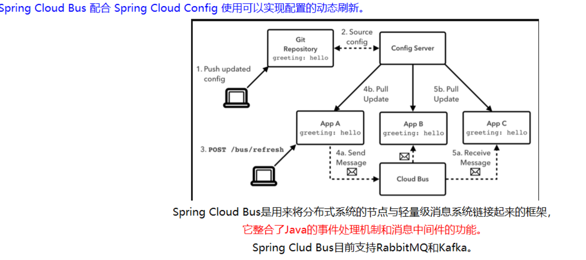

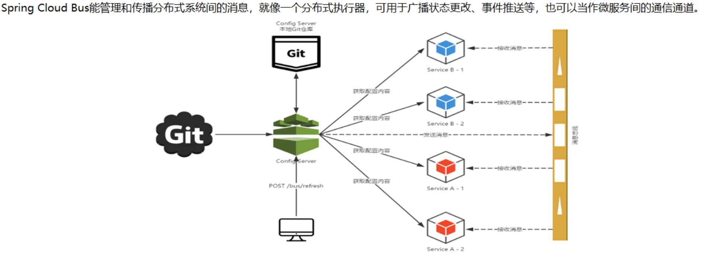

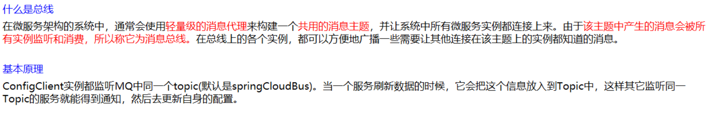

## 11.2. RabbitMQ环境配置

**这里我没用windows版，在自己的云服务器配置了docker版的rabbitmq**

```sh
mkdir fanxyuse/RabbitMQ
cd fanxyuse/RabbitMQ
vim docker-compose.yml
```

```sh
version: "3.8"
services:
  rabbitmq:
    image: daocloud.io/library/rabbitmq:3.8.8
    container_name: rabbitmq
    restart: always
    volumes:
      - ./data/:/var/lib/rabbitmq/
    ports:
      - 5672:5672
      - 15672:15672
```

```sh
docker-compose up -d
```

```sh
docker exec -it rabbitmq /bin/bash
# 进入rabbitmq的可执行命令目录
cd /opt/rabbitmq/sbin
# 图形化界面默认是关闭的，这里需要开启
./rabbitmq-plugins enable rabbitmq_management
```

**登录默认初始账户     账号   guest      密码      guest          去图形化管理界面删除这个角色**

```sh
http://【ip】:15672
```

**创建账号 【记得改密码】**

```sh
rabbitmqctl add_user admin 123456
```

**设置用户角色**

```sh
rabbitmqctl set_user_tags admin administrator
```

**设置用户权限**

```sh
set_permissions [-p <vhostpath>] <user> <conf> <write> <read>
```

```sh
rabbitmqctl set_permissions -p "/" admin ".*" ".*" ".*"
```

**用户 user_admin 具有/vhost1 这个 virtual host 中所有资源的配置、写、读权限**

**当前用户和角色**

```sh
rabbitmqctl list_users
```

**docker安装出现无法在管理界面进行管理，需要增加配置**

```sh
因为是使用docker 容器安装的，所有需要进入容器
docker exec -it rabbitmq /bin/bash

进入目录
cd /etc/rabbitmq/conf.d/

执行命令
echo management_agent.disable_metrics_collector = false > management_agent.disable_metrics_collector.conf

退出容器
exit

重启rabbitmq
docker restart rabbitmq
```

## 11.3. SpringCloud Bus动态刷新全局广播

**必须先具备良好的RabbitMQ环境先**

### 11.3.1. 演示广播效果，增加复杂度，再以3355为模板再制作一个3366

```sh
cloud-config-client-3366
```

```xml
    <dependencies>
        <dependency>
            <groupId>org.springframework.cloud</groupId>
            <artifactId>spring-cloud-starter-config</artifactId>
        </dependency>
        <dependency>
            <groupId>org.springframework.cloud</groupId>
            <artifactId>spring-cloud-starter-netflix-eureka-client</artifactId>
        </dependency>
        <dependency>
            <groupId>org.springframework.boot</groupId>
            <artifactId>spring-boot-starter-web</artifactId>
        </dependency>
        <dependency>
            <groupId>org.springframework.boot</groupId>
            <artifactId>spring-boot-starter-actuator</artifactId>
        </dependency>

        <dependency>
            <groupId>org.springframework.boot</groupId>
            <artifactId>spring-boot-devtools</artifactId>
            <scope>runtime</scope>
            <optional>true</optional>
        </dependency>
        <dependency>
            <groupId>org.projectlombok</groupId>
            <artifactId>lombok</artifactId>
            <optional>true</optional>
        </dependency>
        <dependency>
            <groupId>org.springframework.boot</groupId>
            <artifactId>spring-boot-starter-test</artifactId>
            <scope>test</scope>
        </dependency>
    </dependencies>
```

`bootstrap.yaml`

```yml
server:
  port: 3366

spring:
  application:
    name: config-client
  cloud:
    #Config客户端配置
    config:
      label: master #分支名称
      name: config #配置文件名称
      profile: dev #读取后缀名称   上述3个综合：master分支上config-dev.yml的配置文件被读取http://config-3344.com:3344/master/config-dev.yml
      uri: http://localhost:3344 #配置中心地址

#服务注册到eureka地址
eureka:
  client:
    service-url:
      defaultZone: http://eureka7001.com:7001/eureka/,http://eureka7002.com:7002/eureka/

# 暴露监控端点
management:
  endpoints:
    web:
      exposure:
        include: "*"
```

```java
@EnableEurekaClient
@SpringBootApplication
public class ConfigClientMain3366 {
    public static void main(String[] args) {
        SpringApplication.run(ConfigClientMain3366.class,args);
    }
}
```

```java
@RestController
@RefreshScope
public class ConfigClientController {
    @Value("${server.port}")
    private String serverPort;

    @Value("${config.info}")
    private String configInfo;

    @GetMapping("/configInfo")
    public String configInfo() {
        return "serverPort: "+serverPort+"\t\n\n configInfo: "+configInfo;
    }
}
```

### 11.3.2. 设计思想

**1）利用消息总线触发一个客户端/bus/refresh,而刷新所有客户端的配置**


**2）利用消息总线触发一个服务端ConfigServer的/bus/refresh端点，而刷新所有客户端的配置**


**图二的架构显然更加适合，图一不适合的原因如下**

**打破了微服务的职责单一性，因为微服务本身是业务模块，它本不应该承担配置刷新的职责。**

**破坏了微服务各节点的对等性。**

**有一定的局限性。例如，微服务在迁移时，它的网络地址常常会发生变化，此时如果想要做到自动刷新，那就会增加更多的修改**

### 11.3.3. 给cloud-config-center-3344配置中心服务端添加消息总线支持

```xml
<!--添加消息总线RabbitMQ支持-->
<dependency>
    <groupId>org.springframework.cloud</groupId>
    <artifactId>spring-cloud-starter-bus-amqp</artifactId>
</dependency>
```

**这里我们三个服务器都配置了如下的pom，如果需要暴露端口等操作都需要引入这个pom**

```xml
<dependency>
    <groupId>org.springframework.boot</groupId>
    <artifactId>spring-boot-starter-actuator</artifactId>
</dependency>
```

**暴露端点改为Rabbitmq将来要改的**

```yaml
server:
  port: 3344

spring:
  application:
    name:  cloud-config-center #注册进Eureka服务器的微服务名
  cloud:
    config:
      server:
        git:
          uri: https://github.com/TheFANXY/springcloud-config.git #GitHub上面的git仓库名字
        ####搜索目录
          search-paths:
            - springcloud-config
      ####读取分支
      label: main
    #rabbitmq相关配置
    rabbitmq:
        host: xxxxxxxxxxxx[你自己的ip【我这里用的云服务器】]
        port: 5672
        username: admin
        password: xxxxxxx

#服务注册到eureka地址
eureka:
  client:
    service-url:
      defaultZone: http://eureka7001.com:7001/eureka/,http://eureka7002.com:7002/eureka/

##rabbitmq相关配置,暴露bus刷新配置的端点
management:
  endpoints: #暴露bus刷新配置的端点
    web:
      exposure:
        include: 'bus-refresh'
```

### 11.3.4. 给cloud-config-client-3355客户端添加消息总线支持

```xml
<!--添加消息总线RabbitMQ支持-->
<dependency>
    <groupId>org.springframework.cloud</groupId>
    <artifactId>spring-cloud-starter-bus-amqp</artifactId>
</dependency>
```

**多了Rabbitmq的配置**

```yaml
server:
  port: 3355

spring:
  application:
    name: config-client
  cloud:
    #Config客户端配置
    config:
      label: main #分支名称
      name: config #配置文件名称
      profile: dev #读取后缀名称   上述3个综合：master分支上config-dev.yml的配置文件被读取
      uri: http://localhost:3344 #配置中心地址k
#rabbitmq相关配置 15672是Web管理界面的端口；5672是MQ访问的端口
  rabbitmq:
    host: xxxxxxxxxxxx
    port: 5672
    username: admin
    password: xxxxxxxxxx

#服务注册到eureka地址
eureka:
  client:
    service-url:
      defaultZone: http://eureka7001.com:7001/eureka/,http://eureka7002.com:7002/eureka/
# 暴露监控端点
management:
  endpoints:
    web:
      exposure:
        include: "*"   # 'refresh'
```

### 11.3.5. 给cloud-config-client-3366客户端添加消息总线支持

```xml
<!--添加消息总线RabbitMQ支持-->
<dependency>
    <groupId>org.springframework.cloud</groupId>
    <artifactId>spring-cloud-starter-bus-amqp</artifactId>
</dependency>
```

**同样多了这个**

```yaml
#rabbitmq相关配置 15672是Web管理界面的端口；5672是MQ访问的端口
  rabbitmq:
    host: xxxxxxxxxxxx
    port: 5672
    username: admin
    password: xxxxxxxxxx
```

### 11.3.6. 一次修改，广播通知，处处生效

**1. 运维工程师**

**修改Github上配置文件增加版本号**

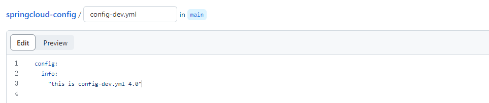

**发送POST请求**

```sh
curl -X POST "http://localhost:3344/actuator/bus-refresh"
```

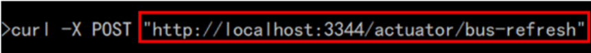

**一次发送，处处生效**

**2. 配置中心** 

```sh
http://config-3344.com:3344/config-dev.yml
```

**3. 客户端**

```sh
http://localhost:3355/configInfo
```

```sh
http://localhost:3366/configInfo
```

**获取配置信息，发现都已经刷新了**

## 11.4. SpringCloud Bus动态刷新定点通知

**不想全部通知，只想定点通知**

**指定具体某一个实例生效而不是全部** 

```sh
公式：http://localhost:配置中心的端口号/actuator/bus-refresh/{destination}
```

**/bus/refresh请求不再发送到具体的服务实例上，而是发给config server并通过destination参数类指定需要更新配置的服务或实例**

**案例**

**我们这里以刷新运行在3355端口上的config-client为例**

**只通知3355        不通知3366**

```sh
curl -X POST "http://localhost:3344/actuator/bus-refresh/config-client:3355"
```

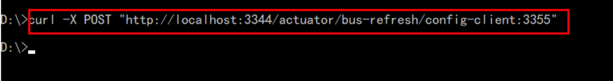

**通知总结All**

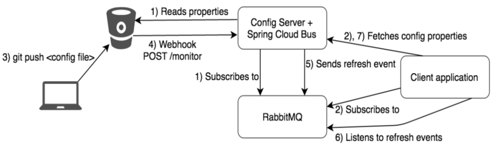

# 12. SpringCloud Stream 消息驱动【过时】

## 12.1. 消息驱动概述

### 12.1.1. 是什么

**屏蔽底层消息中间件的差异,降低切换成本，统一消息的编程模型**

**官网**

https://spring.io/projects/spring-cloud-stream#overview


https://cloud.spring.io/spring-cloud-static/spring-cloud-stream/3.0.1.RELEASE/reference/html/

**Spring Cloud Stream中文指导手册**

https://m.wang1314.com/doc/webapp/topic/20971999.html

### 12.1.2. 设计思想

**标准MQ**


- 生产者/消费者之间靠消息媒介传递信息内容：Message

- 消息必须走特定的通道：消息通道MessageChannel

- 消息通道里的消息如何被消费呢，谁负责收发处理：消息通道MessageChannel的子接口SubscribableChannel，由MessageHandler消息处理器所订阅

**为什么用CloudStream**

**比方说我们用到了RabbitMQ和Kafka，由于这两个消息中间件的架构上的不同，像RabbitMQ有exchange，kafka有Topic和Partitions分区**


这些中间件的差异性导致我们实际项目开发给我们造成了一定的困扰，我们如果用了两个消息队列的其中一种，后面的业务需求，我想往另外一种消息队列进行迁移，这时候无疑就是一个灾难性的，**一大堆东西都要重新推倒重新做**，因为它跟我们的系统耦合了，这时候springcloud Stream给我们提供了一种解耦合的方式。

**stream凭什么可以统一底层差异？**


**<font color='bb000'>通过定义绑定器Binder作为中间层，实现了应用程序与消息中间件细节之间的隔离。</font>**

**Binder可以生成Binding，Binding用来绑定消息容器的生产者和消费者，它有两种类型，INPUT和OUTPUT，INPUT对应于消费者，OUTPUT对应于生产者。**

**Stream中的消息通信方式遵循了发布-订阅模式**

**Topic主题进行广播**

**在RabbitMQ就是Exchange**

**在Kakfa中就是Topic**

### 12.1.3. Spring Cloud Stream标准流程套路


- **Binder ：很方便的连接中间件，屏蔽差异**
- **Channel ：通道，是队列Queue的一种抽象，在消息通讯系统中就是实现存储和转发的媒介，通过Channel对队列进行配置**
- **Source和Sink：简单的可理解为参照对象是Spring Cloud Stream自身，从Stream发布消息就是输出，接受消息就是输入。**

### 12.1.4. 编码API和常用注解

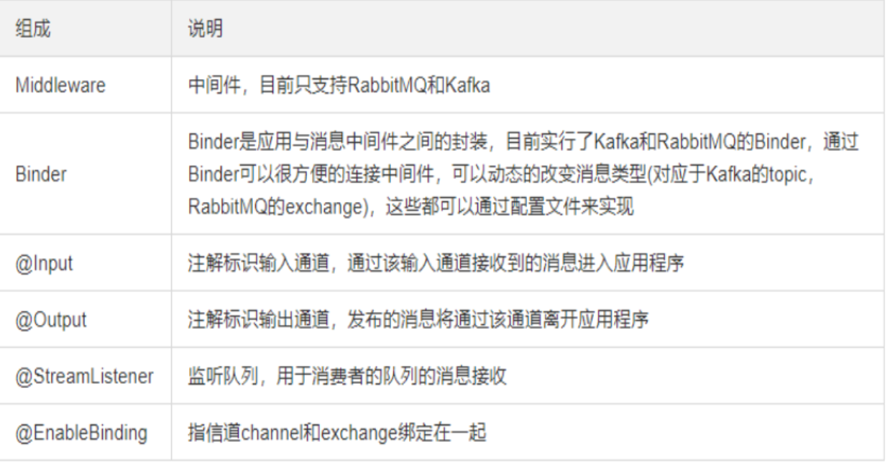

## 12.2. 案例说明

**RabbitMQ环境已经OK**

**工程中新建三个子模块**

```sh
cloud-stream-rabbitmq-provider8801  作为生产者进行发消息模块
```

```sh
cloud-stream-rabbitmq-consumer8802  作为消息接收模块
```

```sh
cloud-stream-rabbitmq-consumer8803  作为消息接收模块
```

## 12.3. 消息驱动之生产者

```sh
cloud-stream-rabbitmq-provider8801  作为生产者进行发消息模块
```

```xml
    <dependencies>
        <dependency>
            <groupId>org.springframework.boot</groupId>
            <artifactId>spring-boot-starter-web</artifactId>
        </dependency>
        <dependency>
            <groupId>org.springframework.boot</groupId>
            <artifactId>spring-boot-starter-actuator</artifactId>
        </dependency>
        <dependency>
            <groupId>org.springframework.cloud</groupId>
            <artifactId>spring-cloud-starter-netflix-eureka-client</artifactId>
        </dependency>
        <dependency>
            <groupId>org.springframework.cloud</groupId>
            <artifactId>spring-cloud-starter-stream-rabbit</artifactId>
        </dependency>
        <!--基础配置-->
        <dependency>
            <groupId>org.springframework.boot</groupId>
            <artifactId>spring-boot-devtools</artifactId>
            <scope>runtime</scope>
            <optional>true</optional>
        </dependency>
        <dependency>
            <groupId>org.projectlombok</groupId>
            <artifactId>lombok</artifactId>
            <optional>true</optional>
        </dependency>
        <dependency>
            <groupId>org.springframework.boot</groupId>
            <artifactId>spring-boot-starter-test</artifactId>
            <scope>test</scope>
        </dependency>
    </dependencies>
```

```yaml
server:
  port: 8801

spring:
  application:
    name: cloud-stream-provider
  cloud:
      stream:
        binders: # 在此处配置要绑定的rabbitmq的服务信息；
          defaultRabbit: # 表示定义的名称，用于于binding整合
            type: rabbit # 消息组件类型
            environment: # 设置rabbitmq的相关的环境配置
              spring:
                rabbitmq:
                  host: localhost
                  port: 5672
                  username: guest
                  password: guest
        bindings: # 服务的整合处理
          output: # 这个名字是一个通道的名称
            destination: studyExchange # 表示要使用的Exchange名称定义
            content-type: application/json # 设置消息类型，本次为json，文本则设置“text/plain”
        	binder: defaultRabbit # 设置要绑定的消息服务的具体设置

eureka:
  client: # 客户端进行Eureka注册的配置
    service-url:
      defaultZone: http://localhost:7001/eureka,http://localhost:7002/eureka
  instance:
    lease-renewal-interval-in-seconds: 2 # 设置心跳的时间间隔（默认是30秒）
    lease-expiration-duration-in-seconds: 5 # 如果现在超过了5秒的间隔（默认是90秒）
    instance-id: send-8801.com  # 在信息列表时显示主机名称
    prefer-ip-address: true     # 访问的路径变为IP地址
```

**主启动**

```java
@SpringBootApplication
public class StreamMQMain8801 {
    public static void main(String[] args) {
        SpringApplication.run(StreamMQMain8801.class,args);
    }
}
```

**业务类**

**发送消息接口**

```java
public interface IMessageProvider {
    public String send() ;
}
```

**发送消息接口实现类**

```java
@EnableBinding(Source.class) // 可以理解为是一个消息的发送管道的定义
public class MessageProviderImpl implements IMessageProvider {
    
    @Resource
    private MessageChannel output; // 消息的发送管道

    @Override
    public String send() {
        String serial = UUID.randomUUID().toString();
        this.output.send(MessageBuilder.withPayload(serial).build()); // 创建并发送消息
        System.out.println("***serial: "+serial);

        return serial;
    }
}
```

**Controller**

```java
@RestController
public class SendMessageController {
    @Resource
    private IMessageProvider messageProvider;

    @GetMapping(value = "/sendMessage")
    public String sendMessage() {
        return messageProvider.send();
    }
}
```

**测试**

**启动7001eureka**

**启动8801**


```sh
http://localhost:8801/sendMessage
```

## 12.4. 消息驱动之消费者

```sh
cloud-stream-rabbitmq-consumer8802
```

```xml
    <dependencies>
        <dependency>
            <groupId>org.springframework.boot</groupId>
            <artifactId>spring-boot-starter-web</artifactId>
        </dependency>
        <dependency>
            <groupId>org.springframework.cloud</groupId>
            <artifactId>spring-cloud-starter-netflix-eureka-client</artifactId>
        </dependency>
        <dependency>
            <groupId>org.springframework.cloud</groupId>
            <artifactId>spring-cloud-starter-stream-rabbit</artifactId>
        </dependency>
        <dependency>
            <groupId>org.springframework.boot</groupId>
            <artifactId>spring-boot-starter-actuator</artifactId>
        </dependency>
        <!--基础配置-->
        <dependency>
            <groupId>org.springframework.boot</groupId>
            <artifactId>spring-boot-devtools</artifactId>
            <scope>runtime</scope>
            <optional>true</optional>
        </dependency>
        <dependency>
            <groupId>org.projectlombok</groupId>
            <artifactId>lombok</artifactId>
            <optional>true</optional>
        </dependency>
        <dependency>
            <groupId>org.springframework.boot</groupId>
            <artifactId>spring-boot-starter-test</artifactId>
            <scope>test</scope>
        </dependency>
    </dependencies>
```

```yaml
server:
  port: 8802

spring:
  application:
    name: cloud-stream-consumer
  cloud:
      stream:
        binders: # 在此处配置要绑定的rabbitmq的服务信息；
          defaultRabbit: # 表示定义的名称，用于于binding整合
            type: rabbit # 消息组件类型
            environment: # 设置rabbitmq的相关的环境配置
              spring:
                rabbitmq:
                  host: localhost
                  port: 5672
                  username: guest
                  password: guest
        bindings: # 服务的整合处理
          input: # 这个名字是一个通道的名称
            destination: studyExchange # 表示要使用的Exchange名称定义
            content-type: application/json # 设置消息类型，本次为对象json，如果是文本则设置“text/plain”
        	binder: defaultRabbit # 设置要绑定的消息服务的具体设置

eureka:
  client: # 客户端进行Eureka注册的配置
    service-url:
      defaultZone: http://localhost:7001/eureka,http://localhost:7002/eureka
  instance:
    lease-renewal-interval-in-seconds: 2 # 设置心跳的时间间隔（默认是30秒）
    lease-expiration-duration-in-seconds: 5 # 如果现在超过了5秒的间隔（默认是90秒）
    instance-id: receive-8802.com  # 在信息列表时显示主机名称
    prefer-ip-address: true     # 访问的路径变为IP地址
```

**主启动类StreamMQMain8802**

```java
@SpringBootApplication
public class StreamMQMain8802 {
    public static void main(String[] args) {
        SpringApplication.run(StreamMQMain8802.class,args);
    }
}
```

**业务类**

```java
@Component
@EnableBinding(Sink.class)
public class ReceiveMessageListener {
    @Value("${server.port}")
    private String serverPort;

    @StreamListener(Sink.INPUT)
    public void input(Message<String> message) {
        System.out.println("消费者1号，------->接收到的消息：" + message.getPayload()+"\t port: "+serverPort);
    }
}
```

**测试8801发送8802接收消息**

```sh
http://localhost:8801/sendMessage
```

## 12.5. 分组消费与持久化

### 12.5.1. 依照8802，clone出来一份运行8803

```sh
cloud-stream-rabbitmq-consumer8803
```

```xml
    <dependencies>
        <dependency>
            <groupId>org.springframework.boot</groupId>
            <artifactId>spring-boot-starter-web</artifactId>
        </dependency>
        <dependency>
            <groupId>org.springframework.cloud</groupId>
            <artifactId>spring-cloud-starter-netflix-eureka-client</artifactId>
        </dependency>
        <dependency>
            <groupId>org.springframework.cloud</groupId>
            <artifactId>spring-cloud-starter-stream-rabbit</artifactId>
        </dependency>
        <dependency>
            <groupId>org.springframework.boot</groupId>
            <artifactId>spring-boot-starter-actuator</artifactId>
        </dependency>
        <!--基础配置-->
        <dependency>
            <groupId>org.springframework.boot</groupId>
            <artifactId>spring-boot-devtools</artifactId>
            <scope>runtime</scope>
            <optional>true</optional>
        </dependency>
        <dependency>
            <groupId>org.projectlombok</groupId>
            <artifactId>lombok</artifactId>
            <optional>true</optional>
        </dependency>
        <dependency>
            <groupId>org.springframework.boot</groupId>
            <artifactId>spring-boot-starter-test</artifactId>
            <scope>test</scope>
        </dependency>
    </dependencies>
```

```yaml
server:
  port: 8803

spring:
  application:
    name: cloud-stream-consumer
  cloud:
      stream:
        binders: # 在此处配置要绑定的rabbitmq的服务信息；
          defaultRabbit: # 表示定义的名称，用于于binding整合
            type: rabbit # 消息组件类型
            environment: # 设置rabbitmq的相关的环境配置
              spring:
                rabbitmq:
                  host: localhost
                  port: 5672
                  username: guest
                  password: guest
        bindings: # 服务的整合处理
          input: # 这个名字是一个通道的名称，在分析具体源代码的时候会进行说明
            destination: studyExchange # 表示要使用的Exchange名称定义
            content-type: application/json # 设置消息类型，本次为对象json，如果是文本则设置“text/plain”
            binder: defaultRabbit # 设置要绑定的消息服务的具体设置

eureka:
  client: # 客户端进行Eureka注册的配置
    service-url:
      defaultZone: http://localhost:7001/eureka ,http://localhost:7002/eureka
  instance:
    lease-renewal-interval-in-seconds: 2 # 设置心跳的时间间隔（默认是30秒）
    lease-expiration-duration-in-seconds: 5 # 如果现在超过了5秒的间隔（默认是90秒）
    instance-id: receive-8803.com  # 在信息列表时显示主机名称
    prefer-ip-address: true     # 访问的路径变为IP地址
```

```java
@SpringBootApplication
public class StreamMQMain8803 {
    public static void main(String[] args) {
        SpringApplication.run(StreamMQMain8803.class,args);
    }
}
```

**业务类**

```java
@Component
@EnableBinding(Sink.class)
public class ReceiveMessageListener {
    @Value("${server.port}")
    private String serverPort;

    @StreamListener(Sink.INPUT)
    public void input(Message<String> message) {
        System.out.println("消费者2号，------->接收到的消息：" + message.getPayload()+"\t port: "+serverPort);
    }
}
```

### 12.5.2. 启动

- **RabbitMQ**
- **7001 7002  服务注册**
- **8801  消息生产**
- **8802  消息消费**
- **8803  消息消费**

**运行后有两个问题**

- **有重复消费问题**
- **消息持久化问题**

### 12.5.3. 分组

**原理 : 微服务应用放置于同一个group中，就能够保证消息只会被其中一个应用消费一次。<font color='bb000'>不同的组是可以消费的，同一个组内会发生竞争关系，只有其中一个可以消费。</font>**

**8802/8803都变成<font color='000bb'>不同组</font>，group两个不同**

**group:<font color='bb000'> groupA、groupB</font>**

**8802修改YML**

```yaml
server:
  port: 8802

spring:
  application:
    name: cloud-stream-consumer
  cloud:
      stream:
        binders: # 在此处配置要绑定的rabbitmq的服务信息；
          defaultRabbit: # 表示定义的名称，用于于binding整合
            type: rabbit # 消息组件类型
            environment: # 设置rabbitmq的相关的环境配置
              spring:
                rabbitmq:
                  host: localhost
                  port: 5672
                  username: guest
                  password: guest
        bindings: # 服务的整合处理
          input: # 这个名字是一个通道的名称，在分析具体源代码的时候会进行说明
            destination: studyExchange # 表示要使用的Exchange名称定义
            content-type: application/json # 设置消息类型，本次为对象json，如果是文本则设置“text/plain”
        	binder: defaultRabbit # 设置要绑定的消息服务的具体设置
            group: groupA
eureka:
  client: # 客户端进行Eureka注册的配置
    service-url:
      defaultZone: http://localhost:7001/eureka,http://localhost:7002/eureka
  instance:
    lease-renewal-interval-in-seconds: 2 # 设置心跳的时间间隔（默认是30秒）
    lease-expiration-duration-in-seconds: 5 # 如果现在超过了5秒的间隔（默认是90秒）
    instance-id: receive-8802.com  # 在信息列表时显示主机名称
    prefer-ip-address: true     # 访问的路径变为IP地址
```

**8803修改YML**

```yaml
server:
  port: 8803

spring:
  application:
    name: cloud-stream-consumer
  cloud:
      stream:
        binders: # 在此处配置要绑定的rabbitmq的服务信息；
          defaultRabbit: # 表示定义的名称，用于于binding整合
            type: rabbit # 消息组件类型
            environment: # 设置rabbitmq的相关的环境配置
              spring:
                rabbitmq:
                  host: localhost
                  port: 5672
                  username: guest
                  password: guest
        bindings: # 服务的整合处理
          input: # 这个名字是一个通道的名称，在分析具体源代码的时候会进行说明
            destination: studyExchange # 表示要使用的Exchange名称定义
            content-type: application/json # 设置消息类型，本次为对象json，如果是文本则设置“text/plain”
        binder: defaultRabbit # 设置要绑定的消息服务的具体设置
        group: groupB
eureka:
  client: # 客户端进行Eureka注册的配置
    service-url:
      defaultZone: http://localhost:7001/eureka,http://localhost:7002/eureka
  instance:
    lease-renewal-interval-in-seconds: 2 # 设置心跳的时间间隔（默认是30秒）
    lease-expiration-duration-in-seconds: 5 # 如果现在超过了5秒的间隔（默认是90秒）
    instance-id: receive-8803.com  # 在信息列表时显示主机名称
    prefer-ip-address: true     # 访问的路径变为IP地址
```

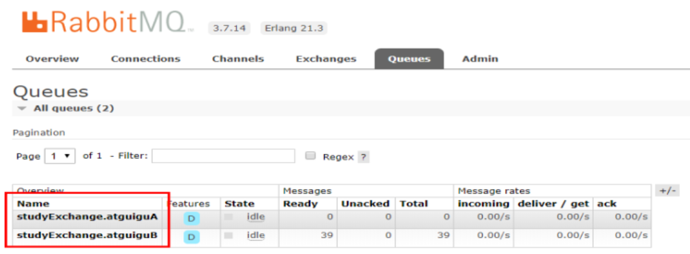

分布式微服务应用为了实现高可用和负载均衡，实际上都会部署多个实例，本例启动了两个消费微服务(8802/8803)

多数情况，生产者发送消息给某个具体微服务时只希望被消费一次，按照上面我们启动两个应用的例子，虽然它们同属一个应用，但是这个消息出现了被重复消费两次的情况。为了解决这个问题，在Spring Cloud Stream中提供了消费组的概念。

**结论          还是重复消费**

**8802/8803实现了轮询分组，每次只有一个消费者**
**8801模块的发的消息只能被8802或8803其中一个接收到，这样避免了重复消费。**

**8802/8803都变成相同组，<font color='bb000'>group两个相同</font>**

**group: groupA**

**8802修改YML**

```yaml
server:
  port: 8802

spring:
  application:
    name: cloud-stream-consumer
  cloud:
      stream:
        binders: # 在此处配置要绑定的rabbitmq的服务信息；
          defaultRabbit: # 表示定义的名称，用于于binding整合
            type: rabbit # 消息组件类型
            environment: # 设置rabbitmq的相关的环境配置
              spring:
                rabbitmq:
                  host: localhost
                  port: 5672
                  username: guest
                  password: guest
        bindings: # 服务的整合处理
          input: # 这个名字是一个通道的名称，在分析具体源代码的时候会进行说明
            destination: studyExchange # 表示要使用的Exchange名称定义
            content-type: application/json # 设置消息类型，本次为对象json，如果是文本则设置“text/plain”
       binder: defaultRabbit # 设置要绑定的消息服务的具体设置
             group: groupA
eureka:
  client: # 客户端进行Eureka注册的配置
    service-url:
      defaultZone: http://localhost:7001/eureka
  instance:
    lease-renewal-interval-in-seconds: 2 # 设置心跳的时间间隔（默认是30秒）
    lease-expiration-duration-in-seconds: 5 # 如果现在超过了5秒的间隔（默认是90秒）
    instance-id: receive-8802.com  # 在信息列表时显示主机名称
    prefer-ip-address: true     # 访问的路径变为IP地址
```

**8803修改YML**

```yaml
server:
  port: 8803

spring:
  application:
    name: cloud-stream-consumer
  cloud:
      stream:
        binders: # 在此处配置要绑定的rabbitmq的服务信息；
          defaultRabbit: # 表示定义的名称，用于于binding整合
            type: rabbit # 消息组件类型
            environment: # 设置rabbitmq的相关的环境配置
              spring:
                rabbitmq:
                  host: localhost
                  port: 5672
                  username: guest
                  password: guest
        bindings: # 服务的整合处理
          input: # 这个名字是一个通道的名称，在分析具体源代码的时候会进行说明
            destination: studyExchange # 表示要使用的Exchange名称定义
            content-type: application/json # 设置消息类型，本次为对象json，如果是文本则设置“text/plain”
       binder: defaultRabbit # 设置要绑定的消息服务的具体设置
             group: groupA
eureka:
  client: # 客户端进行Eureka注册的配置
    service-url:
      defaultZone: http://localhost:7001/eureka
  instance:
    lease-renewal-interval-in-seconds: 2 # 设置心跳的时间间隔（默认是30秒）
    lease-expiration-duration-in-seconds: 5 # 如果现在超过了5秒的间隔（默认是90秒）
    instance-id: receive-8803.com  # 在信息列表时显示主机名称
    prefer-ip-address: true     # 访问的路径变为IP地址
```

**结论               同一个组的多个微服务实例，每次只会有一个拿到**

### 12.5.4. 持久化

**通过上述，解决了重复消费问题，再看看持久化**

**停止8802/8803并去除掉8802的分组group: groupA          8803的分组group: groupA没有去掉**

**8801先发送4条消息到rabbitmq**

**先启动8802，无分组属性配置，后台没有打出来消息**

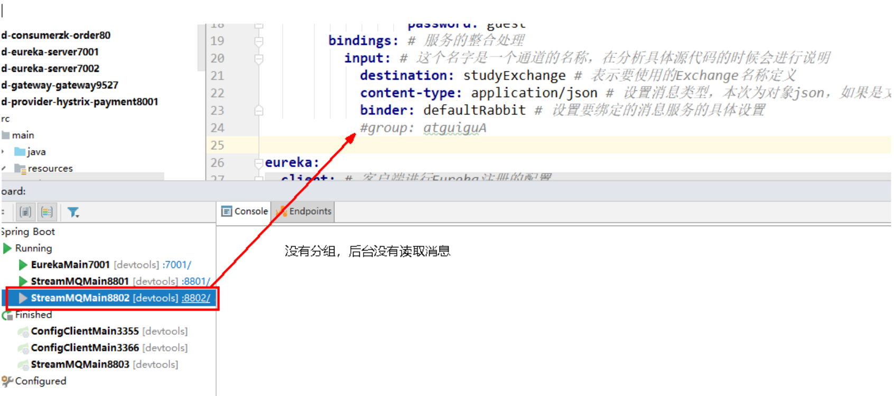

**再启动8803，有分组属性配置，后台打出来了MQ上的消息**

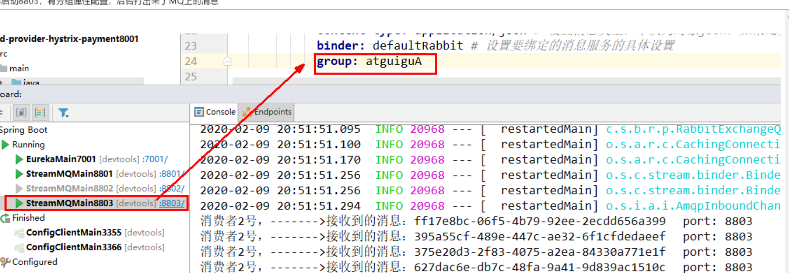

# 13. SpringCloud Sleuth 分布式请求链路跟踪【boot3移除】

## 13.1. 概述

### 13.1.1. 为什么会出现这个技术？需要解决哪些问题？

在微服务框架中，一个由客户端发起的请求在后端系统中会经过多个不同的的服务节点调用来协同产生最后的请求结果，每一个前段请求都会形成一条复杂的分布式服务调用链路，链路中的任何一环出现高延时或错误都会引起整个请求最后的失败。


### 13.1.2. 是什么

https://github.com/spring-cloud/spring-cloud-sleuth

**Spring Cloud Sleuth提供了一套完整的服务跟踪的解决方案**

**在分布式系统中提供追踪解决方案并且兼容支持了zipkin**

### 13.1.3. 解决


## 13.2. 搭建链路监控步骤

### 13.2.1. zipkin

**下载**

**SpringCloud从F版起已不需要自己构建Zipkin Server了，只需调用jar包即可**

https://repo1.maven.org/maven2/io/zipkin/java/zipkin-server/2.12.9/

**zipkin-server-2.12.9-exec.jar**

**运行jar**

```sh
java -jar zipkin-server-2.12.9-exec.jar
```


**运行控制台**

```sh
http://localhost:9411/zipkin/
```

**docker安装**

```sh
docker run -d --restart always -p 9411:9411 --name zipkin openzipkin/zipkin
```

```sh
http://192.168.110.100:9411/zipkin/
```

**术语**

**完整的调用链路** 

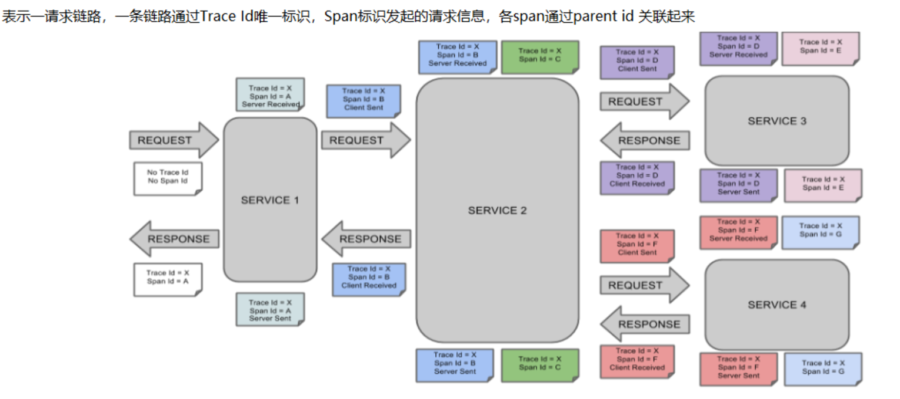


**名词解释**

**Trace:类似于树结构的Span集合，表示一条调用链路，存在唯一标识**

**span:表示调用链路来源，通俗的理解span就是一次请求信息**

### 13.2.2. 服务提供者

**配置完全相同，就只写一个了**

```sh
cloud-provider-payment8001
cloud-provider-payment8002
```

**加入如下maven模块**

```xml
        <!--包含了sleuth+zipkin-->
        <dependency>
            <groupId>org.springframework.cloud</groupId>
            <artifactId>spring-cloud-starter-zipkin</artifactId>
        </dependency>
```

**而配置文件加入关于链路追踪的部分其他和之前一样，这里一般设置为0.5即可，但是这里只是个小demo就用1完全展示**

```yaml
server:
  port: 8001

spring:
  application:
    name: cloud-payment-service
  zipkin:
    base-url: http://192.168.110.100:9411
  sleuth:
    sampler:
      #采样率值介于 0 到 1 之间，1 则表示全部采集
     probability: 1
  datasource:
    type: com.alibaba.druid.pool.DruidDataSource            # 当前数据源操作类型
    driver-class-name: org.gjt.mm.mysql.Driver              # mysql驱动包
    url: jdbc:mysql://localhost:3306/db2019?useUnicode=true&characterEncoding=utf-8&useSSL=false
    username: root
    password: xxxxxxxx

eureka:
-----------------------------------以下省略----------------------------------------------
```

**业务类PaymentController**

```java
    @GetMapping("/payment/zipkin")
    public String paymentZipkin() {
        return "hi ,i'am paymentzipkin server fall back，i am zipkin, O(∩_∩)O哈哈~";
    }
```

### 13.2.3. 服务消费者(调用方)

```sh
cloud-consumer-order80
```

**新版是spring-cloud-sleuth-zipkin**

```xml
        <!--包含了sleuth+zipkin-->
        <dependency>
            <groupId>org.springframework.cloud</groupId>
            <artifactId>spring-cloud-starter-zipkin</artifactId>
        </dependency>
```

**配置文件增加如下配置**

```yaml
spring:
    application:
        name: cloud-order-service
    zipkin:
      base-url: http://192.168.110.100:9411
    sleuth:
      sampler:
        probability: 1
```

**业务类OrderController**

```java
// ====================> zipkin+sleuth
@GetMapping("/consumer/payment/zipkin")
public String paymentZipkin() {
    String result = restTemplate.getForObject("http://localhost:8001"+"/payment/zipkin/", String.class);
    return result;
}
```

### 13.2.4. 依次启动eureka7001&7002/8001&8002/80

**80调用8001几次测试下**

```sh
localhost/consumer/payment/zipkin
```

### 13.2.5. 打开浏览器访问

```sh
http://localhost:9411
```

**会出现以下界面**

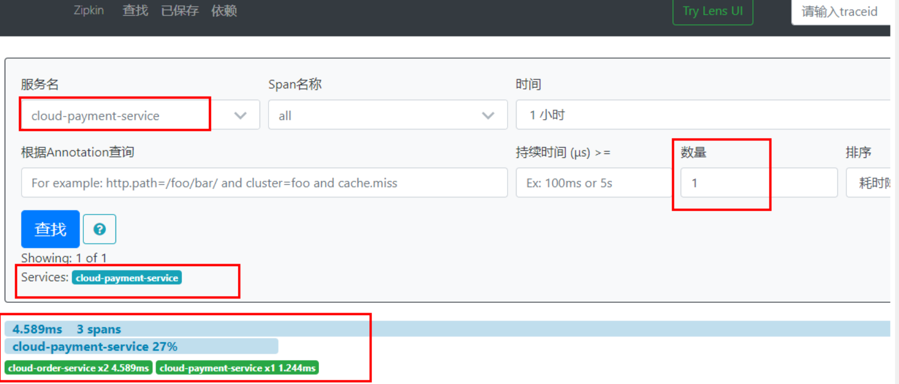

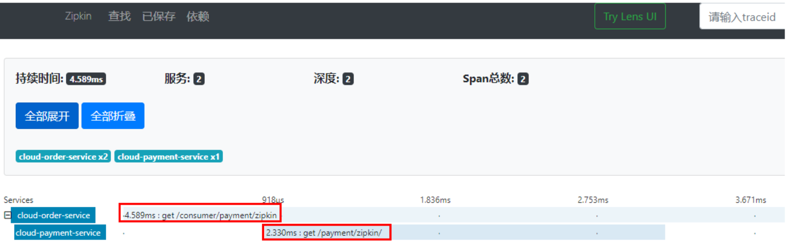

**查看依赖关系**

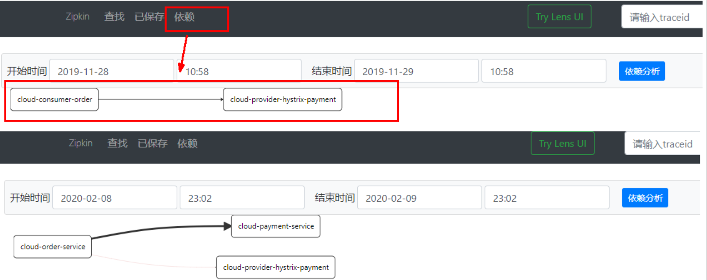

**原理**


# 14. SpringCloud Alibaba 入门简介【正篇开始】

## 14.1. why会出现SpringCloud alibaba

Spring Cloud Netflix项目进入维护模式

https://spring.io/blog/2018/12/12/spring-cloud-greenwich-rc1-available-now


**Spring Cloud Netflix项目进入维护模式**
**最近，Netfilix宣布Hystrix正在进入维护模式。自2016年以来，Ribbon已处于类似状态。虽然Hystrix和Ribbon现已处于维护模式,但它们仍然在Netflix大规模部署。**
**Hystrix Dashboard和Turbine已被Atlas取代。这些项目的最后一次提交别是2年和4年前。Zuul 1和Archaius 1都被后来不兼容的版本所取代。**
**以下Spring Cloud Netflix模块和相应的Starter将进入维护模式:**

1. spring-cloud-netflix-archaius

2. spring-cloud-netflix-hystrix-contract
3. spring-cloud-netflix-hystrix-dashboard
4. spring-cloud-netflix-hystrix-stream
5. spring-cloud-netflix-hystrix
6. spring-cloud-netflix-ribbon
7. spring-cloud-netflix-turbine-stream
8. spring-cloud-netflix-turbine
9. spring-cloud-netflix-zuul这不包括Eureka或并发限制模块

**什么是维护模式?**
**将模块置于维护模式，意味着Spring Cloud团队将不会再向模块添加新功能。我们将修复block级别的bug以及安全问题，我们也会考虑并审查社区的小型pull request**

**我们打算继续支持这些模块，直到Greenwich版本被普遍采用至少一年**

## 14.2. SpringCloud alibaba带来了什么

### 14.1.1. 是什么

官网：
https://github.com/alibaba/spring-cloud-alibaba/blob/master/README-zh.md

诞生：
2018.10.31，Spring Cloud Alibaba 正式入驻了 Spring Cloud 官方孵化器，并在 Maven 中央库发布了第一个版本。


### 14.1.2. 能干嘛

- **服务限流降级**：默认支持 Servlet、Feign、RestTemplate、Dubbo 和 RocketMQ 限流降级功能的接入，可以在运行时通过控制台实时修改限流降级规则，还支持查看限流降级 Metrics 监控。

- **服务注册与发现**：适配 Spring Cloud 服务注册与发现标准，默认集成了 Ribbon 的支持。
- **分布式配置管理**：支持分布式系统中的外部化配置，配置更改时自动刷新。
- **消息驱动能力**：基于 Spring Cloud Stream 为微服务应用构建消息驱动能力。
- **阿里云对象存储**：阿里云提供的海量、安全、低成本、高可靠的云存储服务。支持在任何应用、任何时间、任何地点存储和访问任意类型的数据。
- **分布式任务调度**：提供秒级、精准、高可靠、高可用的定时（基于 Cron 表达式）任务调度服务。同时提供分布式的任务执行模型，如网格任务。网格任务支持海量子任务均匀分配到所有 Worker（schedulerx-client）上执行。

### 14.1.3. 去哪下

https://github.com/alibaba/spring-cloud-alibaba/blob/master/README-zh.md

### 14.1.4. 怎么玩

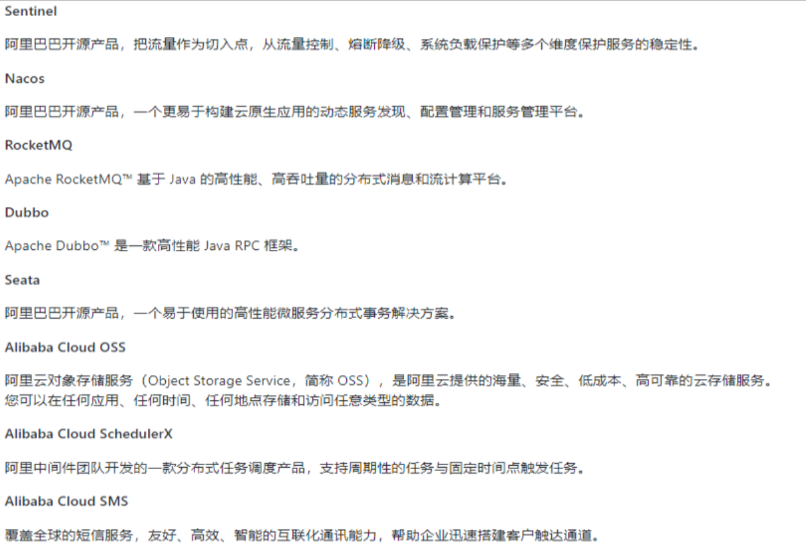

## 14.3. SpringCloud alibaba学习资料获取

**官网  https://spring.io/projects/spring-cloud-alibaba#overview**

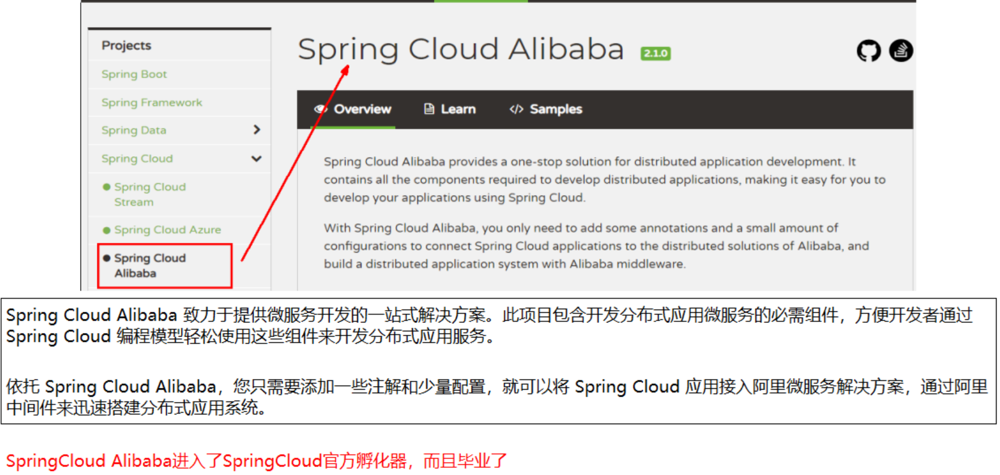

**英文**

https://github.com/alibaba/spring-cloud-alibaba

https://spring-cloud-alibaba-group.github.io/github-pages/greenwich/spring-cloud-alibaba.html

**中文**

https://github.com/alibaba/spring-cloud-alibaba/blob/master/README-zh.md

# 15. SpringCloud Alibaba Nacos服务注册和配置中心

## 15.1. Nacos简介

### 15.1.1. 为什么叫Nacos

**前四个字母分别为Naming和Configuration的前两个字母，最后的s为Service。**

### 15.1.2. 是什么

**一个更易于构建云原生应用的动态服务发现、配置管理和服务管理平台。**

**Nacos: Dynamic Naming and Configuration Service**

**Nacos就是注册中心 + 配置中心的组合**

**<font color='bb000'>Nacos = Eureka+Config + Bus</font>**

### 15.1.3. 能干嘛

**替代Eureka做服务注册中心**

**替代Config做服务配置中心**

### 15.1.4. 去哪下

https://github.com/alibaba/Nacos

**官网文档**

https://nacos.io/zh-cn/index.html

https://spring-cloud-alibaba-group.github.io/github-pages/greenwich/spring-cloud-alibaba.html#_spring_cloud_alibaba_nacos_discovery

### 15.1.5. 各种注册中心比较

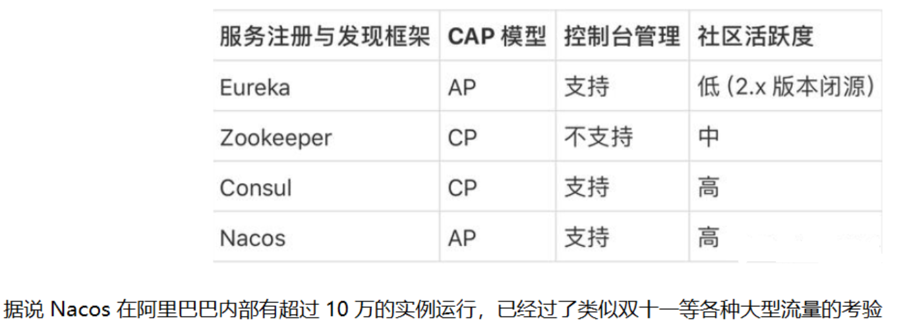

## 15.2. 安装并运行Nacos

**本地 Java8 + Maven 环境已经OK**

**先从官网下载Nacos**

https://github.com/alibaba/nacos/releases

**解压安装包，直接运行bin目录下的startup.cmd**

```sh
startup.cmd -m standalone
```

**命令运行成功后直接访问  默认账号密码都是nacos**

```sh
http://localhost:8848/nacos
```

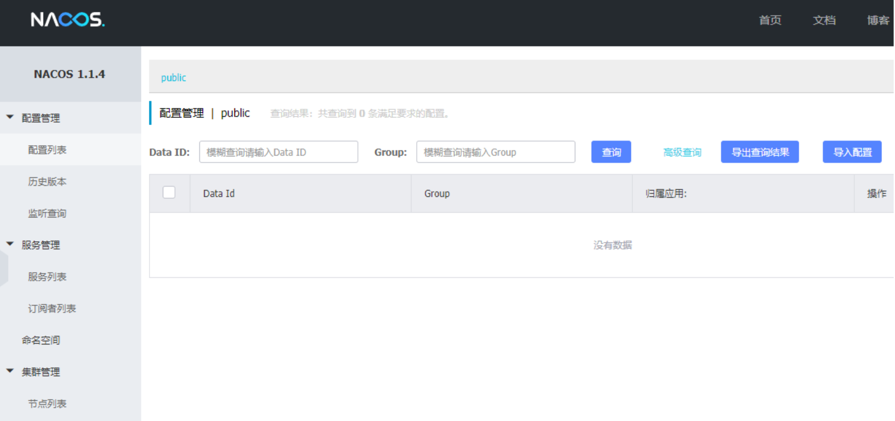

## 15.3. Nacos作为服务注册中心演示

### 15.3.1. 官网文档

https://spring-cloud-alibaba-group.github.io/github-pages/greenwich/spring-cloud-alibaba.html#_spring_cloud_alibaba_nacos_config

### 15.3.2. 基于Nacos的服务提供者

**新建Module**

```sh
cloudalibaba-provider-payment9001
```

**父POM，之前导入过，这里主要是有这个**

```xml
            <dependency>
                <groupId>com.alibaba.cloud</groupId>
                <artifactId>spring-cloud-alibaba-dependencies</artifactId>
                <version>2.1.0.RELEASE</version>
                <type>pom</type>
                <scope>import</scope>
            </dependency>
```

**本模块POM**

```xml
    <dependencies>
        <!--SpringCloud ailibaba nacos -->
        <dependency>
            <groupId>com.alibaba.cloud</groupId>
            <artifactId>spring-cloud-starter-alibaba-nacos-discovery</artifactId>
        </dependency>
        <!-- SpringBoot整合Web组件 -->
        <dependency>
            <groupId>org.springframework.boot</groupId>
            <artifactId>spring-boot-starter-web</artifactId>
        </dependency>
        <dependency>
            <groupId>org.springframework.boot</groupId>
            <artifactId>spring-boot-starter-actuator</artifactId>
        </dependency>
        <!--日常通用jar包配置-->
        <dependency>
            <groupId>org.springframework.boot</groupId>
            <artifactId>spring-boot-devtools</artifactId>
            <scope>runtime</scope>
            <optional>true</optional>
        </dependency>
        <dependency>
            <groupId>org.projectlombok</groupId>
            <artifactId>lombok</artifactId>
            <optional>true</optional>
        </dependency>
        <dependency>
            <groupId>org.springframework.boot</groupId>
            <artifactId>spring-boot-starter-test</artifactId>
            <scope>test</scope>
        </dependency>
    </dependencies>
```

**YML**

```yaml
server:
  port: 9001

spring:
  application:
    name: nacos-payment-provider
  cloud:
    nacos:
      discovery:
        server-addr: localhost:8848 #配置Nacos地址

management:
  endpoints:
    web:
      exposure:
        include: '*'
```

**主启动**

```java
@EnableDiscoveryClient
@SpringBootApplication
public class PaymentMain9001 {
    public static void main(String[] args) {
            SpringApplication.run(PaymentMain9001.class, args);
    }
}
```

**业务类**

```java
@RestController
public class PaymentController {
    @Value("${server.port}")
    private String serverPort;

    @GetMapping(value = "/payment/nacos/{id}")
    public String getPayment(@PathVariable("id") Integer id) {
        return "nacos registry, serverPort: "+ serverPort+"\t id: "+id;
    }
}
```

**测试**

```sh
http://localhost:9001/payment/nacos/1
```

**nacos控制台**

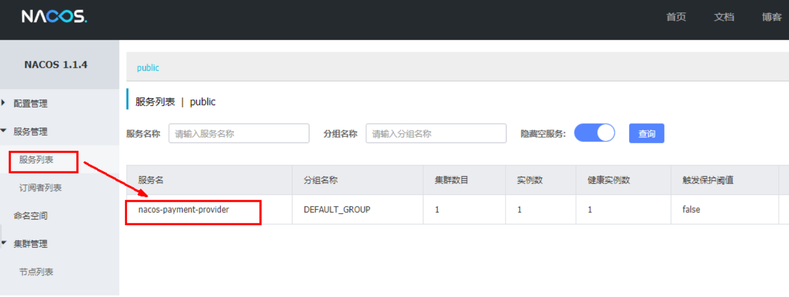

**nacos服务注册中心+服务提供者9001都OK了**

**为了下一章节演示nacos的负载均衡，参照9001新建9002**

**新建**

```sh
cloudalibaba-provider-payment9002
```

**9002其它步骤你懂的**

**或者取巧不想新建重复体力劳动，直接拷贝虚拟端口映射，但是有时候会出问题，建议调试可以玩玩**


### 15.3.3. 基于Nacos的服务消费者

```sh
cloudalibaba-consumer-nacos-order83
```

```xml
    <dependencies>
		<!--openfeign 这里因为新版已经把ribon移除了 这里我就用openFeign了-->
        <dependency>
            <groupId>org.springframework.cloud</groupId>
            <artifactId>spring-cloud-starter-openfeign</artifactId>
        </dependency>
        <!--SpringCloud ailibaba nacos -->
        <dependency>
            <groupId>com.alibaba.cloud</groupId>
            <artifactId>spring-cloud-starter-alibaba-nacos-discovery</artifactId>
        </dependency>
        <!-- 引入自己定义的api通用包，可以使用Payment支付Entity -->
        <dependency>
            <groupId>com.fanxy.springcloud</groupId>
            <artifactId>cloud-api-commons</artifactId>
            <version>${project.version}</version>
        </dependency>
        <!-- SpringBoot整合Web组件 -->
        <dependency>
            <groupId>org.springframework.boot</groupId>
            <artifactId>spring-boot-starter-web</artifactId>
        </dependency>
        <dependency>
            <groupId>org.springframework.boot</groupId>
            <artifactId>spring-boot-starter-actuator</artifactId>
        </dependency>
        <!--日常通用jar包配置-->
        <dependency>
            <groupId>org.springframework.boot</groupId>
            <artifactId>spring-boot-devtools</artifactId>
            <scope>runtime</scope>
            <optional>true</optional>
        </dependency>
        <dependency>
            <groupId>org.projectlombok</groupId>
            <artifactId>lombok</artifactId>
            <optional>true</optional>
        </dependency>
        <dependency>
            <groupId>org.springframework.boot</groupId>
            <artifactId>spring-boot-starter-test</artifactId>
            <scope>test</scope>
        </dependency>
    </dependencies>
```

**为什么nacos支持负载均衡**


**YML**

```yaml
server:
  port: 83

spring:
  application:
    name: nacos-order-consumer
  cloud:
    nacos:
      discovery:
        server-addr: localhost:8848


#消费者将要去访问的微服务名称(注册成功进nacos的微服务提供者)
service-url:
  nacos-user-service: http://nacos-payment-provider 
```

**主启动**

```java
@EnableDiscoveryClient
@SpringBootApplication
@EnableFeignClients // 给Openfeign提供的
public class OrderNacosMain83 {
    public static void main(String[] args) {
        SpringApplication.run(OrderNacosMain83.class,args);
    }
} 
```

**<font color='bb000'>这里阳哥用的RestTemplate，我为了标准用了`Open-Feign`</font>**

**业务类【阳哥】OrderNacosController**

```java
@RestController
public class OrderNacosController {
    
    @Resource
    private RestTemplate restTemplate;

    @Value("${service-url.nacos-user-service}")
    private String serverURL;

    @GetMapping("/consumer/payment/nacos/{id}")
    public String paymentInfo(@PathVariable("id") Long id) {
        return restTemplate.getForObject(serverURL+"/payment/nacos/"+id,String.class);
    }
}
```

**业务类【我的】OrderNacosController**

```java
@RestController
@Slf4j
public class OrderNacosController {
    
    @Resource
    private PaymentService paymentService;

    @GetMapping("/consumer/payment/nacos/{id}")
    public String paymentInfo(@PathVariable("id") Integer id) {
        return paymentService.getPayment(id);
    }
}
```

**需要把远程调用的对方的Controller抽象成的Service接口**

```java
@FeignClient(value = "nacos-payment-provider")
public interface PaymentService {

    @GetMapping(value = "/payment/nacos/{id}")
    public String getPayment(@PathVariable("id") Integer id);
}
```

**<font color='bb000'>ApplicationContextBean【阳哥 使用RestTemplate】使用OpenFeign就不用写</font>**

```java
@Configuration
public class ApplicationContextBean {
    
    @Bean
    @LoadBalanced
    public RestTemplate getRestTemplate() {
        return new RestTemplate();
    }
}
```

**测试**

```sh
http://localhost:83/consumer/payment/nacos/12
```

**nacos控制台**


**83访问9001/9002，轮询负载OK,OpenFeign自带负载均衡**

### 15.3.4. 服务注册中心对比

**各种注册中心对比**

**Nacos全景图所示**


**Nacos和CAP**


**<font color='bb000'>Nacos 支持AP和CP模式的切换</font>**

<font color='bb000'>**C是所有节点在同一时间看到的数据是一致的；而A的定义是所有的请求都会收到响应。**</font>

**<font color='000bb'>何时选择使用何种模式？</font>**

**一般来说，**
**如果不需要存储服务级别的信息且服务实例是通过nacos-client注册，并能够保持心跳上报，那么就可以选择AP模式。当前主流的服务如 Spring cloud 和 Dubbo 服务，都适用于AP模式，AP模式为了服务的可能性而减弱了一致性，因此AP模式下只支持注册临时实例。**

**如果需要在服务级别编辑或者存储配置信息，那么 CP 是必须，K8S服务和DNS服务则适用于CP模式。**
**CP模式下则支持注册持久化实例，此时则是以 Raft 协议为集群运行模式，该模式下注册实例之前必须先注册服务，如果服务不存在，则会返回错误。**

```sh
curl -X PUT '$NACOS_SERVER:8848/nacos/v1/ns/operator/switches?entry=serverMode&value=CP'
```

## 15.4. Nacos作为服务配置中心演示

### 15.4.1. Nacos作为配置中心-基础配置

#### 1. 基础配置

```sh
cloudalibaba-config-nacos-client3377
```

**多了 `nacos-config` ，以后使用`nacos`建议`config`和服务发现一起粘贴**

```xml
		<dependencies>
        <!--nacos-config-->
        <dependency>
            <groupId>com.alibaba.cloud</groupId>
            <artifactId>spring-cloud-starter-alibaba-nacos-config</artifactId>
        </dependency>
        <!--nacos-discovery-->
        <dependency>
            <groupId>com.alibaba.cloud</groupId>
            <artifactId>spring-cloud-starter-alibaba-nacos-discovery</artifactId>
        </dependency>
        <!--web + actuator-->
        <dependency>
            <groupId>org.springframework.boot</groupId>
            <artifactId>spring-boot-starter-web</artifactId>
        </dependency>
        <dependency>
            <groupId>org.springframework.boot</groupId>
            <artifactId>spring-boot-starter-actuator</artifactId>
        </dependency>
        <!--一般基础配置-->
        <dependency>
            <groupId>org.springframework.boot</groupId>
            <artifactId>spring-boot-devtools</artifactId>
            <scope>runtime</scope>
            <optional>true</optional>
        </dependency>
        <dependency>
            <groupId>org.projectlombok</groupId>
            <artifactId>lombok</artifactId>
            <optional>true</optional>
        </dependency>
        <dependency>
            <groupId>org.springframework.boot</groupId>
            <artifactId>spring-boot-starter-test</artifactId>
            <scope>test</scope>
        </dependency>
    </dependencies>

```

**YML**

**why配置两个**

**Nacos同springcloud-config一样，在项目初始化时，要保证先从配置中心进行配置拉取，拉取配置之后，才能保证项目的正常启动。**

**springboot中配置文件的加载是存在优先级顺序的，<font color='bb000'>bootstrap优先级高于application</font>**

**bootstrap.yml是由程序引导的时候就加载,优先于application.yml加载**

**applicaiton.yml在应用程序的时候就加载**

**bootstrap.yml > application.yml > application-dev.yml**

**application-dev.yml会覆盖bootstrap.yml和applicaiton.yml的属性**

**但是application.yml会覆盖bootstrap.yml里面的属性.**

**如果命令行指定server.port,所有的yml文件都不能覆盖它的属性.**

**所以基础的配置放在bootstrap.yml**

**应用程序的配置放在application-dev.yml**

**bootstrap**

```yaml
# nacos配置
server:
  port: 3377

spring:
  application:
    name: nacos-config-client
  cloud:
    nacos:
      discovery:
        server-addr: localhost:8848 #Nacos服务注册中心地址
      config:
        server-addr: localhost:8848 #Nacos作为配置中心地址
        file-extension: yaml #指定yaml格式的配置
 
 
# ${spring.application.name}-${spring.profile.active}.${spring.cloud.nacos.config.file-extension}
```

**application**

```yaml
spring:
  profiles:
    active: dev # 表示开发环境
```

**主启动**

```java
@EnableDiscoveryClient
@SpringBootApplication
public class NacosConfigClientMain3377 {
    public static void main(String[] args) {
            SpringApplication.run(NacosConfigClientMain3377.class, args);
    }
}
```

**业务类**

```sh
ConfigClientController
```

```java
@RestController
@RefreshScope //在控制器类加入@RefreshScope注解使当前类下的配置支持Nacos的动态刷新功能。
public class ConfigClientController {
    @Value("${config.info}")
    private String configInfo;

    @GetMapping("/config/info")
    public String getConfigInfo() {
        return configInfo;
    }
}
```

**<font color='bb000'>@RefreshScope 可实现Nacos的动态刷新功能。</font>**

#### 2. 在Nacos中添加配置信息【Nacos中的匹配规则】

Nacos中的dataid的组成格式及与SpringBoot配置文件中的匹配规则

官网 https://nacos.io/zh-cn/docs/quick-start-spring-cloud.html

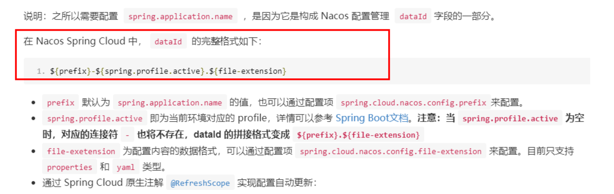

**最后公式：**

```sh
${spring.application.name}-${spring.profiles.active}.${spring.cloud.nacos.config.file-extension}
```

**配置新增:**

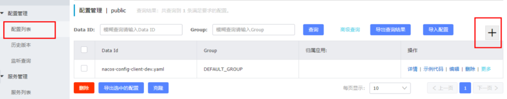

```sh
nacos-config-client-dev
```

**实操**

**Nacos界面配置对应**  


**设置DataId**

**公式：**

```sh
${spring.application.name}-${spring.profiles.active}.${spring.cloud.nacos.config.file-extension}
```

**prefix 默认为 spring.application.name 的值**

**spring.profile.active 即为当前环境对应的 profile，可以通过配置项 spring.profile.active 来配置。**

**file-exetension 为配置内容的数据格式，可以通过配置项 spring.cloud.nacos.config.file-extension 来配置**

**小总结说明**


**历史配置**

Nacos会记录配置文件的历史版本默认保留30天，此外还有一键回滚功能，回滚操作将会触发配置更新

**回滚**

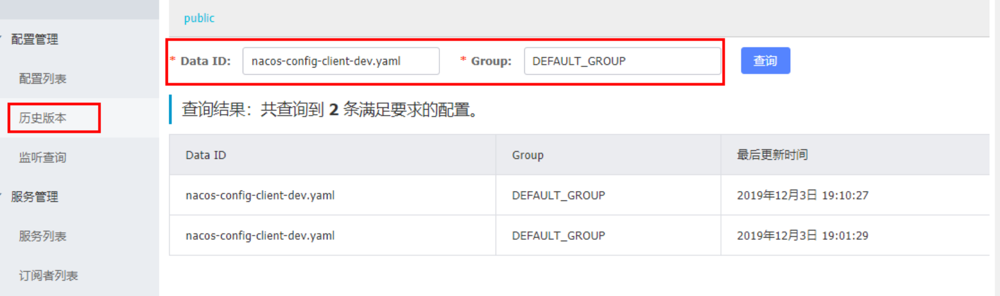

**测试**

**启动前需要在nacos客户端-配置管理-配置管理栏目下有对应的yaml配置文件**

**运行cloud-config-nacos-client3377的主启动类**

**调用接口查看配置信息**

```sh
http://localhost:3377/config/info
```

**自带动态刷新**

**修改下Nacos中的yaml配置文件，再次调用查看配置的接口，就会发现配置已经刷新**

### 15.4.2. Nacos作为配置中心-分类配置

#### 1. 问题【多环境多项目管理】

**问题1：**
实际开发中，通常一个系统会准备
dev开发环境
test测试环境
prod生产环境。
如何保证指定环境启动时服务能正确读取到Nacos上相应环境的配置文件呢？

**问题2：**
一个大型分布式微服务系统会有很多微服务子项目，
每个微服务项目又都会有相应的开发环境、测试环境、预发环境、正式环境......
那怎么对这些微服务配置进行管理呢？

#### 2. Nacos的图形化管理界面

**配置管理**

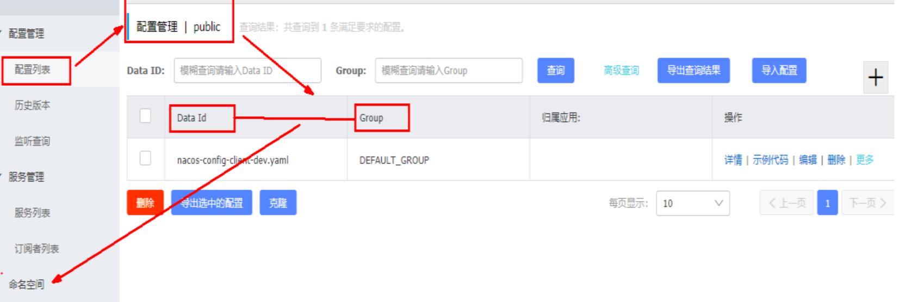

**命名空间**


#### 3. Namespace+Group+Data ID三者关系？为什么这么设计？


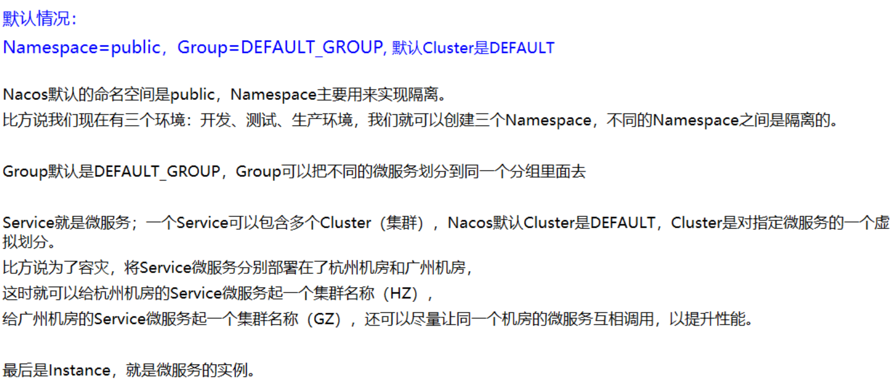

#### 4. Case【三种方案加载配置】

##### **1. DataID方案**

**指定spring.profile.active和配置文件的DataID来使不同环境下读取不同的配置**

**默认空间+默认分组+新建dev和test两个DataID**

**新建dev配置DataID**


**新建test配置DataID**


**通过spring.profile.active属性就能进行多环境下配置文件的读取**


**测试**

```sh
http://localhost:3377/config/info
```

**配置是什么就加载什么**

##### **2. Group方案**

**通过Group实现环境区分**

**新建Group**


**在nacos图形界面控制台上面新建配置文件DataID**

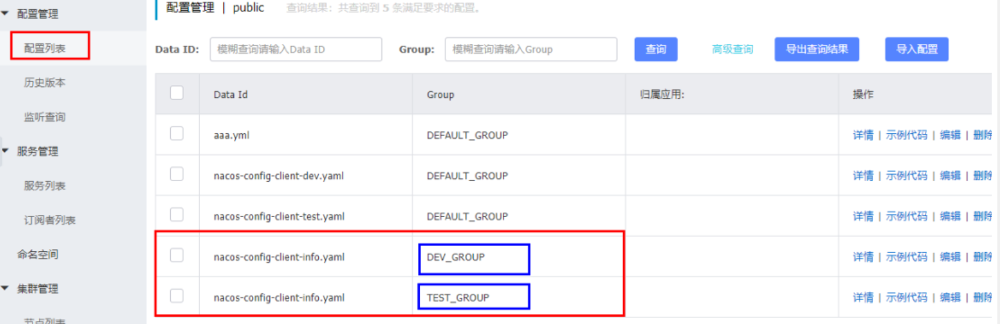

**bootstrap+application**


**在config下增加一条group的配置即可。可配置为DEV_GROUP或TEST_GROUP**

##### **3. Namespace方案**

**新建dev/test的Namespace**

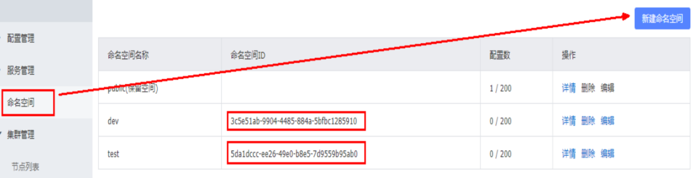

**回到服务管理-服务列表查看**


**按照域名配置填写**


**YML**

**bootstrap**

```yaml
# nacos注册中心
server:
  port: 3377

spring:
  application:
    name: nacos-order
  cloud:
    nacos:
      discovery:
        server-addr: localhost:8848 #Nacos服务注册中心地址
      config:
        server-addr: localhost:8848 #Nacos作为配置中心地址
        file-extension: yaml #这里我们获取的yaml格式的配置
        namespace: 5da1dccc-ee26-49e0-b8e5-7d9559b95ab0
        #group: DEV_GROUP
        group: TEST_GROUP
```

**application**

```yaml
# Nacos注册配置，application.yml
spring:
  profiles:
    #active: test
    active: dev
    #active: info
```

## 15.5. Nacos集群和持久化配置【重要】

### 15.5.1. 官网说明

https://nacos.io/zh-cn/docs/cluster-mode-quick-start.html

**官网架构图**

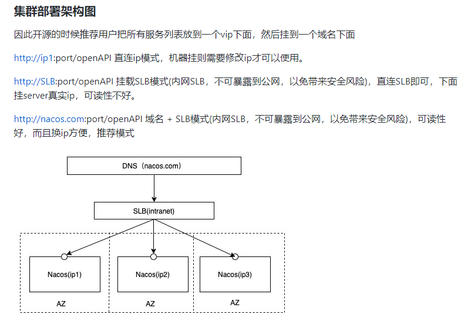

**简单理解为——>**


**说明**

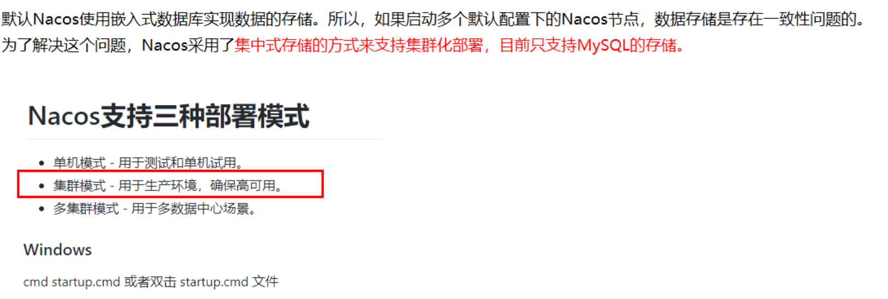

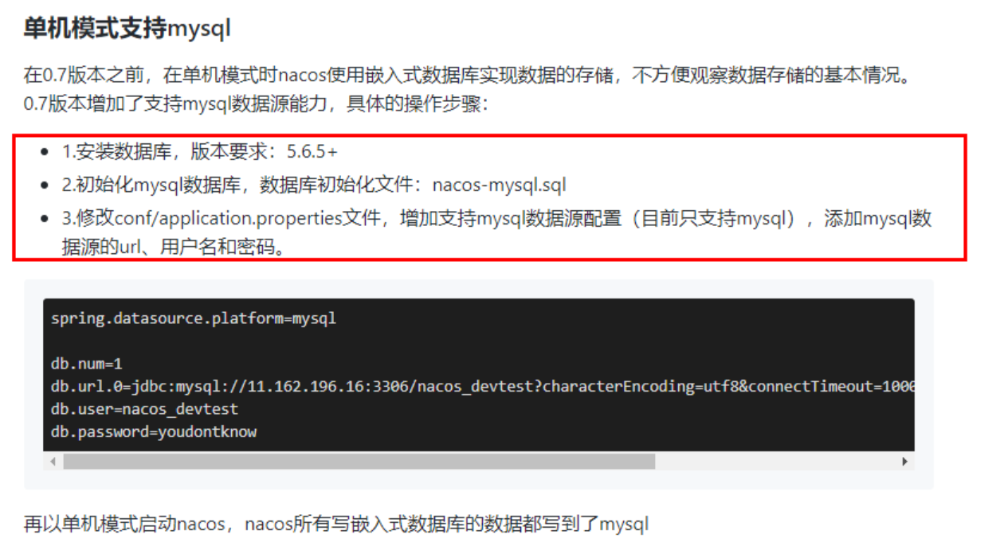

**按照上述，我们需要mysql数据库**

**官网说明**                   https://nacos.io/zh-cn/docs/deployment.html

### 15.5.2. Nacos持久化配置解释

**Nacos默认自带的是嵌入式数据库derby**

https://github.com/alibaba/nacos/blob/develop/config/pom.xml

**derby到mysql切换配置步骤**

**nacos-server-1.1.4\nacos\conf目录下找到sql脚本           nacos-mysql.sql**

**nacos-server-1.1.4\nacos\conf目录下找到application.properties**

```properties
spring.datasource.platform=mysql
 
db.num=1
db.url.0=jdbc:mysql://127.0.0.1:3306/nacos_config?characterEncoding=utf8&connectTimeout=1000&socketTimeout=3000&autoReconnect=true
db.user=root
db.password=123456
```

**启动Nacos，可以看到是个全新的空记录界面，以前是记录进derby**

### 15.5.3. Linux版Nacos+MySQL生产环境配置

**预计需要，1个Nginx+3个nacos注册中心+1个mysql**

**Nacos下载Linux版**


https://github.com/alibaba/nacos/releases/tag/1.1.4

nacos-server-1.1.4.tar.gz

解压后安装


#### 1. 集群配置步骤(重点)

##### 1. Linux服务器上mysql数据库配置

**SQL脚本在哪里**

```sh
【安装目录】/nacos/conf/nacos-mysql.sql
```

**自己Linux机器上的Mysql数据库粘贴**


##### 2. application.properties 配置


```properties
spring.datasource.platform=mysql

db.num=1
db.url.0=jdbc:mysql://127.0.0.1:3306/nacos_config?characterEncoding=utf8&connectTimeout=1000&socketTimeout=3000&autoReconnect=true
db.user=root
db.password=123456
```

**mysql8**

```properties
spring.datasource.platform=mysql

db.num=1
db.url.0=jdbc:mysql://192.168.110.100:3306/nacos_config?characterEncoding=utf8&connectTimeout=1000&socketTimeout=3000&autoReconnect=true&useUnicode=true&useSSL=false&serverTimezone=UTC
db.user=root
db.password=123456
```

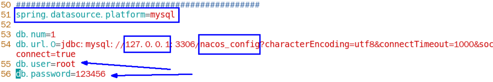

##### 3. Linux服务器上nacos的集群配置cluster.conf

**梳理出3台nacos集器的不同服务端口号**

**复制如上的cluster.conf文件**

**内容**

```sh
192.168.110.100:3333
192.168.110.100:4444
192.168.110.100:5555
```

**这个IP不能写127.0.0.1，必须是Linux命令hostname -i能够识别的IP**

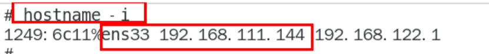

##### 4. 编辑Nacos的启动脚本startup.sh，使它能够接受不同的启动端口

**在什么地方，修改什么，怎么修改**

```sh
/mynacos/nacos/bin 目录下有startup.sh
```

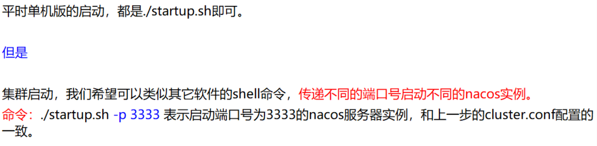**修改内容**

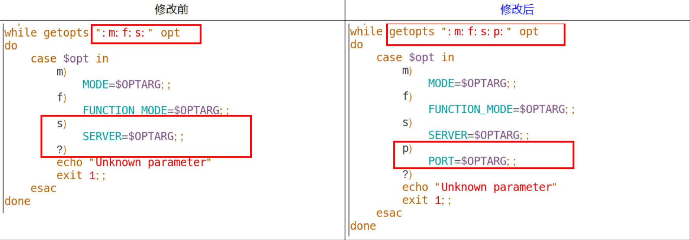

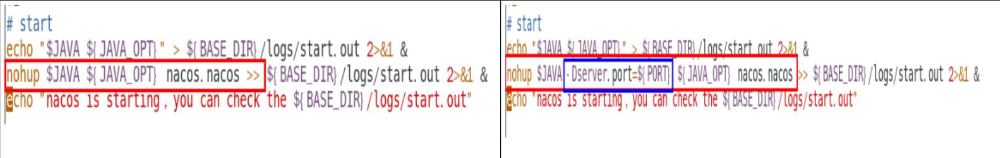

```sh
-Dserver.port=${PORT}
```

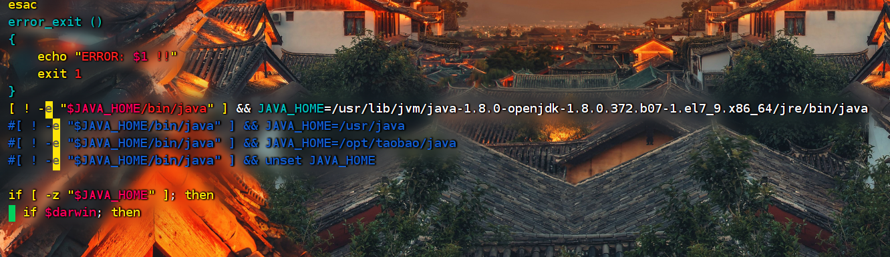

**<font color='bb000'>如果出现java环境问题，血泪教训，各种改java的环境变量都没用，怒改脚本，直接写到我的java路径，终于成功。</font>**

**执行方式**

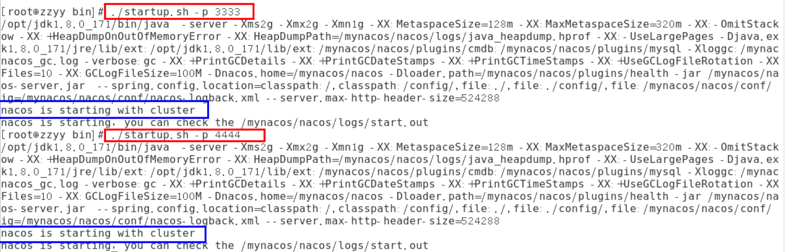

**<font color='bb000'>这里我实在是配不好nacos集群，不知道为什么出错，这里直接配windows版了。恶心坏了，本来要配docker集群，各种问题，从云服务器换到虚拟机，还不行，出现maven和java的问题。最后换了版本，换成windows搭建集群，终于成了，我受不了。</font>**

##### 5. Nginx的配置，由它作为负载均衡器

**修改nginx的配置文件**

```sh
upstream cluster{
        server 127.0.0.1:3333;
        server 127.0.0.1:4444;
        server 127.0.0.1:5555;
    }
    
server {
        listen       1111;
        server_name  localhost;
        #charset koi8-r;
        #access_log  logs/host.access.log  main;
        location / {
            #root   html;
            #index  index.html index.htm;
            proxy_pass http://cluster;
        }
.......省略
```

**按照指定启动**

```sh
./nginx -c /usr/local/nginx/conf/nginx.conf
```

##### 6. 截止到此处，1个Nginx+3个nacos注册中心+1个mysql

**测试通过nginx访问nacos**

```sh
http://192.168.111.144:1111/nacos/#/login
```

**新建一个配置测试**


**linux服务器的mysql插入一条记录**

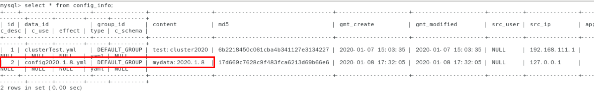

#### 2. 测试

**微服务cloudalibaba-provider-payment9002启动注册进nacos集群**

```yaml
server:
  port: 9002

spring:
  application:
    name: nacos-payment-provider
  cloud:
    nacos:
      discovery:
        #配置Nacos地址
        #server-addr: localhost:8848
        # 换成nginx的1111端口，做集群
        server-addr: 192.168.111.144:1111


management:
  endpoints:
    web:
      exposure:
        include: '*'
```


#### 3. 小总结


# 16. SpringCloud Alibaba Sentinel实现熔断与限流

## 16.1. Sentinel

### 16.1.1. 官网

https://github.com/alibaba/Sentinel

中文        https://github.com/alibaba/Sentinel/wiki/%E4%BB%8B%E7%BB%8D

### 16.1.2. 是什么 去哪下


https://github.com/alibaba/Sentinel/releases


### 16.1.3. 能干什么

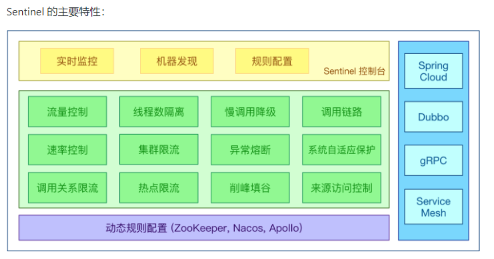

### 16.1.4. 怎么玩

https://spring-cloud-alibaba-group.github.io/github-pages/greenwich/spring-cloud-alibaba.html#_spring_cloud_alibaba_sentinel

**服务使用中的各种问题**

- **服务雪崩**

- **服务降级**

- **服务熔断**
- **服务限流**

## 16.2. 安装Sentinel控制台

### 16.2.1. sentinel组件由2部分构成

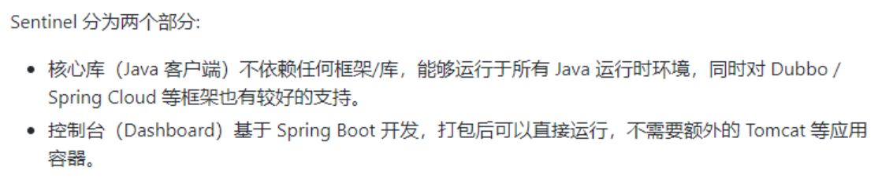

- **后台 8719**
- **前台 8080**

### 16.2.2. 安装步骤

**下载**        https://github.com/alibaba/Sentinel/releases

**下载到本地sentinel-dashboard-1.8.1.jar**

**运行命令前提**

- **java8环境OK**
- **8080端口不能被占用**

**命令**

**如果要修改Sentinel的默认端口、账户、密码，可以通过下列配置：**

| **配置项**                       | **默认值** | **说明**   |
| -------------------------------- | ---------- | ---------- |
| server.port                      | 8080       | 服务端口   |
| sentinel.dashboard.auth.username | sentinel   | 默认用户名 |
| sentinel.dashboard.auth.password | sentinel   | 默认密码   |

```sh
java -jar sentinel-dashboard-1.8.1.jar
```

**例如，修改端口：**

```sh
java -Dserver.port=8090 -jar sentinel-dashboard-1.8.1.jar
```

访问sentinel管理界面

```sh
http://localhost:8080
```

**登录账号密码均为sentinel**

## 16.3. 初始化演示工程

**启动Nacos8848成功**

```sh
http://localhost:8848/nacos/#/login
```

### 16.3.1. 建立Module并启动

```sh
cloudalibaba-sentinel-service8401
```

```xml
    <dependencies>
        <!--SpringCloud ailibaba nacos -->
        <dependency>
            <groupId>com.alibaba.cloud</groupId>
            <artifactId>spring-cloud-starter-alibaba-nacos-discovery</artifactId>
        </dependency>
        <!--SpringCloud ailibaba sentinel-datasource-nacos 后续做持久化用到-->
        <dependency>
            <groupId>com.alibaba.csp</groupId>
            <artifactId>sentinel-datasource-nacos</artifactId>
        </dependency>
        <!--SpringCloud ailibaba sentinel -->
        <dependency>
            <groupId>com.alibaba.cloud</groupId>
            <artifactId>spring-cloud-starter-alibaba-sentinel</artifactId>
        </dependency>
        <!--openfeign-->
        <dependency>
            <groupId>org.springframework.cloud</groupId>
            <artifactId>spring-cloud-starter-openfeign</artifactId>
        </dependency>
        <!-- SpringBoot整合Web组件+actuator -->
        <dependency>
            <groupId>org.springframework.boot</groupId>
            <artifactId>spring-boot-starter-web</artifactId>
        </dependency>
        <dependency>
            <groupId>org.springframework.boot</groupId>
            <artifactId>spring-boot-starter-actuator</artifactId>
        </dependency>
        <!--日常通用jar包配置-->
        <dependency>
            <groupId>org.springframework.boot</groupId>
            <artifactId>spring-boot-devtools</artifactId>
            <scope>runtime</scope>
            <optional>true</optional>
        </dependency>
        <dependency>
            <groupId>cn.hutool</groupId>
            <artifactId>hutool-all</artifactId>
            <version>4.6.3</version>
        </dependency>
        <dependency>
            <groupId>org.projectlombok</groupId>
            <artifactId>lombok</artifactId>
            <optional>true</optional>
        </dependency>
        <dependency>
            <groupId>org.springframework.boot</groupId>
            <artifactId>spring-boot-starter-test</artifactId>
            <scope>test</scope>
        </dependency>
    </dependencies>
```

```yaml
server:
  port: 8401

spring:
  application:
    name: cloudalibaba-sentinel-service
  cloud:
    nacos:
      discovery:
        #Nacos服务注册中心地址
        server-addr: localhost:8848
    sentinel:
      transport:
        #配置Sentinel dashboard地址
        dashboard: localhost:8080
        #默认8719端口，假如被占用会自动从8719开始依次+1扫描,直至找到未被占用的端口
        port: 8719

management:
  endpoints:
    web:
      exposure:
        include: '*'
```

```java
@EnableDiscoveryClient
@SpringBootApplication
public class MainApp8401 {
    public static void main(String[] args) {
        SpringApplication.run(MainApp8401.class, args);
    }
}
```

**业务类FlowLimitController**

```java
@RestController
public class FlowLimitController {

    @GetMapping("/testA")
    public String testA() {
        return "------testA";
    }

    @GetMapping("/testB")
    public String testB() {
        return "------testB";
    }
}
```

**启动Sentinel8080**

```sh
java -jar sentinel-dashboard-1.7.0.jar
```

**启动8401微服务后查看sentienl控制台**

**空空如也，啥都没有Sentinel采用的懒加载说明**

**执行一次访问即可**

```sh
http://localhost:8401/testA
```

```sh
http://localhost:8401/testB
```

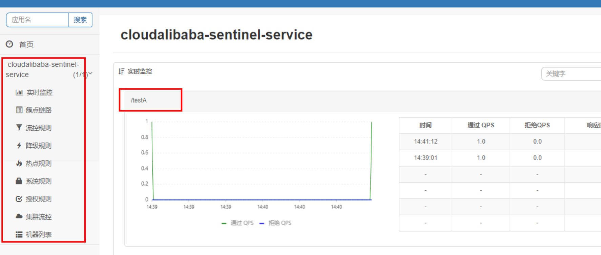

**sentinel8080正在监控微服务8401**

## 16.4. 流控规则

### 16.4.0. 线程隔离（舱壁模式）

#### 1. 线程隔离的实现方式

线程隔离有两种方式实现：

- 线程池隔离

- 信号量隔离（Sentinel默认采用）


**线程池隔离**：给每个服务调用业务分配一个线程池，利用线程池本身实现隔离效果

**信号量隔离**：不创建线程池，而是计数器模式，记录业务使用的线程数量，达到信号量上限时，禁止新的请求。


两者的优缺点：


#### 2. sentinel的线程隔离

**用法说明**：

在添加限流规则时，可以选择两种阈值类型：


- QPS：就是每秒的请求数

- 线程数：是该资源能使用用的tomcat线程数的最大值。也就是通过限制线程数量，实现**线程隔离**（舱壁模式）。

这里的线程数隔离默认使用的是信号量隔离。

### 16.4.1. 基本说明

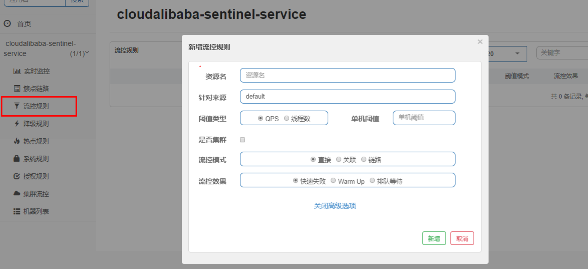

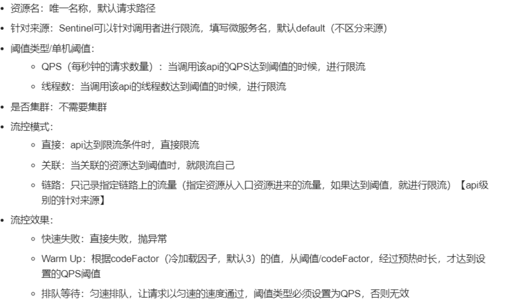

### 16.4.2. 流控模式

#### 1. 直接(默认)

**系统默认：直接->快速失败**

**配置及说明**

**表示1秒钟内查询1次就是OK，若超过次数1，就直接-快速失败，报默认错误**


**测试**

**快速点击访问**

```sh
http://localhost:8401/testA
```

**结果**

**Blocked by Sentinel (flow limiting)**

**思考???**

**直接调用默认报错信息，技术方面OK                but,是否应该有我们自己的后续处理?**

**类似有个fallback的兜底方法？**

**<font color='bb000'>线程数的拒绝不是线程池，这是用信号量限制了并发线程数</font>**

#### 2. 关联

**是什么**

- **当关联的资源达到阈值时，就限流自己**
- **当与A关联的资源B达到阀值后，就限流A自己**
- **B惹事，A挂了**

**<font color='000bb'>设置效果</font>**

**当关联资源/testB的qps阀值超过1时，就限流/testA的Rest访问地址，<font color='bb000'>当关联资源到阈值后限制配置好的资源名</font>**

**<font color='000bb'>postman模拟密集访问testB</font> <font color='bb000'>其实这里PostMan是串行20次，并非是并发的</font>**


**访问testB成功**

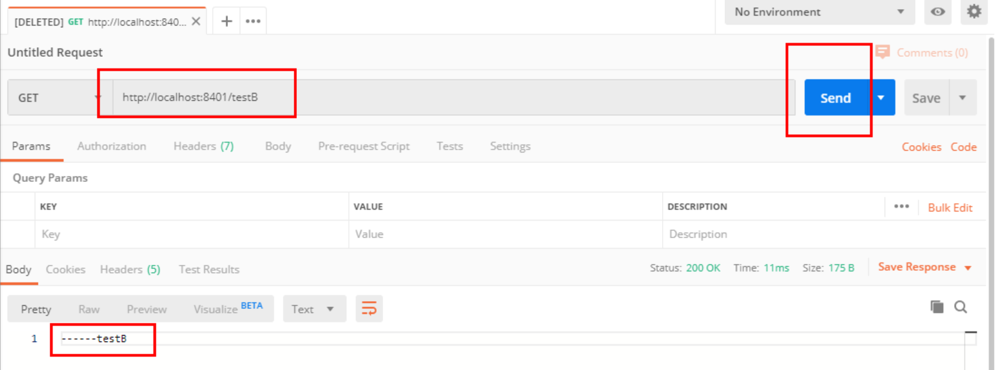

**postman里新建多线程集合组**


**将访问地址添加进新新线程组**


**运行**

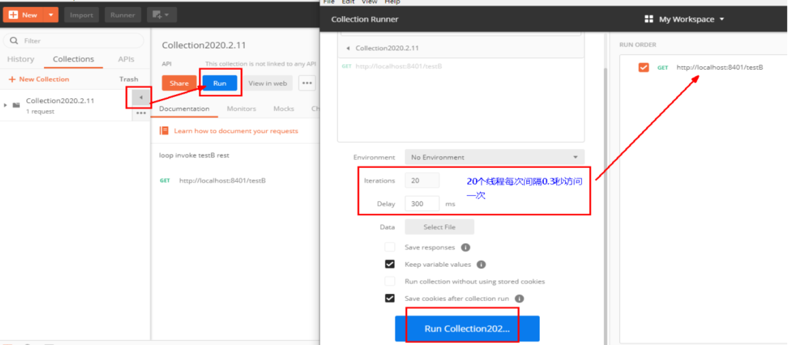

**大批量串行访问B，导致A失效了**

```sh
http://localhost:8401/testA
```

**结果**

**Blocked by Sentinel (flow limiting)**

#### 3. 链路

**链路模式**：**只针对从指定链路访问到本资源的请求做统计，判断是否超过阈值。**

**配置示例：**

**例如有两条请求链路：**

- **/test1 --> /common**

- **/test2 --> /common**

**如果只希望统计从/test2进入到/common的请求，则可以这样配置：**

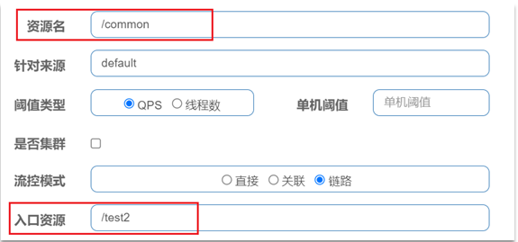

**这里基于上面的两个方法，我们添加一个QueryService给它写query方法**

**默认情况下，QueryService中的方法是不被Sentinel监控的，需要我们自己通过注解来标记要监控的方法。**

**给QueryService的query方法添加@SentinelResource注解：**

```java
@Service
public class QueryService {

    @SentinelResource("query")
    public String query() {
        return "queried by ";
    }
}
```

**然后改写之前的两个测试方法**

```java
@RestController
public class FlowLimitController {

    @Resource
    private QueryService queryService;

    @GetMapping("/testA")
    public String testA() {
        return queryService.query() + "----->testA";
    }

    @GetMapping("/testB")
    public String testB() {
        return queryService.query() + "----->testB";
    }
}
```

**链路模式中，是对不同来源的两个链路做监控。但是sentinel默认会给进入SpringMVC的所有请求设置同一个root资源，会导致链路模式失效。**

**我们需要关闭这种对SpringMVC的资源聚合，修改服务的application.yml文件：**

```yaml
spring:
  cloud:
    sentinel:
      web-context-unify: false # 关闭context整合
```

**这个设置需要新版的依赖，更改父项目的依赖**

```xml
  <!--spring cloud 阿里巴巴-->
    <dependency>
      <groupId>com.alibaba.cloud</groupId>
      <artifactId>spring-cloud-alibaba-dependencies</artifactId>
      <version>2.2.6.RELEASE</version>
      <type>pom</type>
      <scope>import</scope>
    </dependency>
```

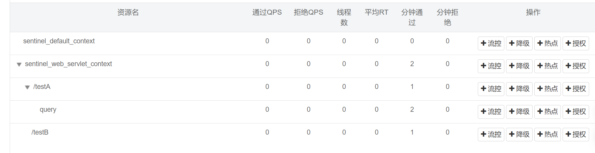

**可以看到这里已经对调用的方法，展现出资源了。**


**添加链路流控规则，对入口资源为 /testB 进行 QPS 为2的限流**

**然后创建Jmeter压力测试，我们这里模拟200个用户，在50秒内访问完，则QPS为4，超过了设置的2**

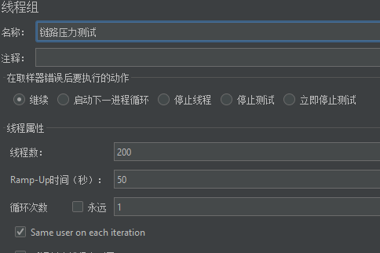

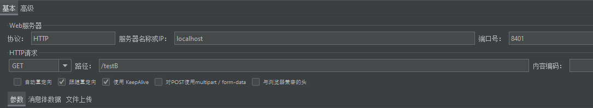

**当把路径改为 /testA 畅通无阻**

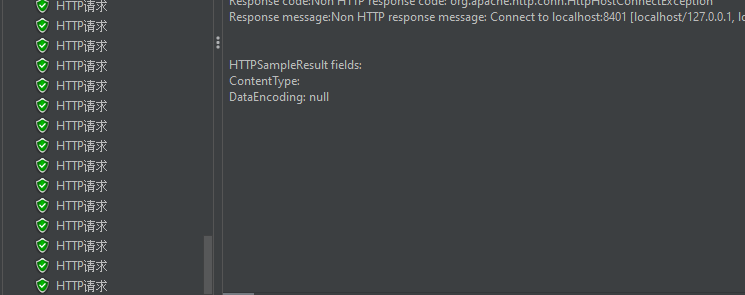

**当把路径改为 /testB 因为设置QPS为2，而实际设置Jmeter压力测试QPS为4，故每两次访问成功会出现两次失败**

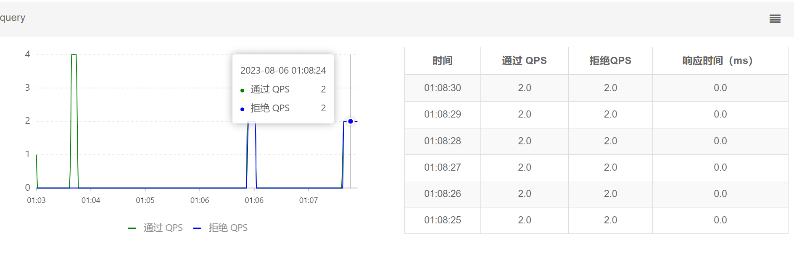

### 16.4.3. 流控效果

#### 1. 快速失败

**直接->快速失败(默认的流控处理)**

**直接失败，抛出异常**

**Blocked by Sentinel (flow limiting)**

**源码**

```sh
com.alibaba.csp.sentinel.slots.block.flow.controller.DefaultController
```

#### 2. 预热

**公式：阈值除以coldFactor(默认值为3),经过预热时长后才会达到阈值**

**官网**          https://github.com/alibaba/Sentinel/wiki/%E6%B5%81%E9%87%8F%E6%8E%A7%E5%88%B6

**限流 冷启动**  https://github.com/alibaba/Sentinel/wiki/%E9%99%90%E6%B5%81---%E5%86%B7%E5%90%AF%E5%8A%A8


**源码**

```sh
com.alibaba.csp.sentinel.slots.block.flow.controller.WarmUpController
```

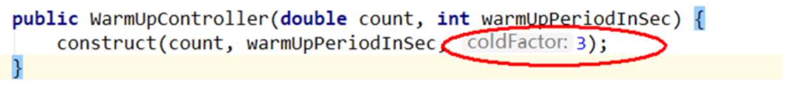

**WarmUp配置**

**默认 coldFactor 为 3，即请求QPS从(threshold / 3) 开始，经多少预热时长才逐渐升至设定的 QPS 阈值。**

**案例，阀值为10+预热时长设置5秒。**

**系统初始化的阀值为10 / 3 约等于3,即阀值刚开始为3；然后过了5秒后阀值才慢慢升高恢复到10**

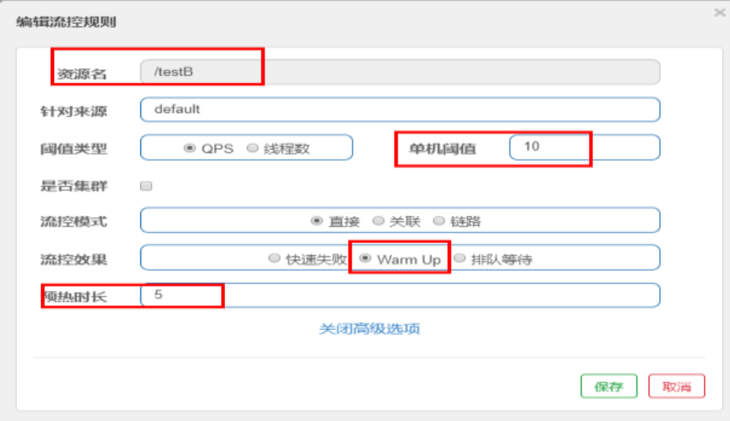

**多次点击**

```sh
http://localhost:8401/testB
```

**刚开始不行，后续慢慢OK**

**应用场景**

**如：秒杀系统在开启的瞬间，会有很多流量上来，很有可能把系统打死，预热方式就是把为了保护系统，可慢慢的把流量放进来，慢慢的把阀值增长到设置的阀值。**

#### 3. 排队等待

**匀速排队，让请求以均匀的速度通过，阀值类型必须设成QPS，否则无效。**

**设置含义：/testA每秒1次请求，超过的话就排队等待，等待的超时时间为20000毫秒。**


**匀速排队，阈值必须设置为QPS**

**官网**               https://github.com/alibaba/Sentinel/wiki/%E6%B5%81%E9%87%8F%E6%8E%A7%E5%88%B6

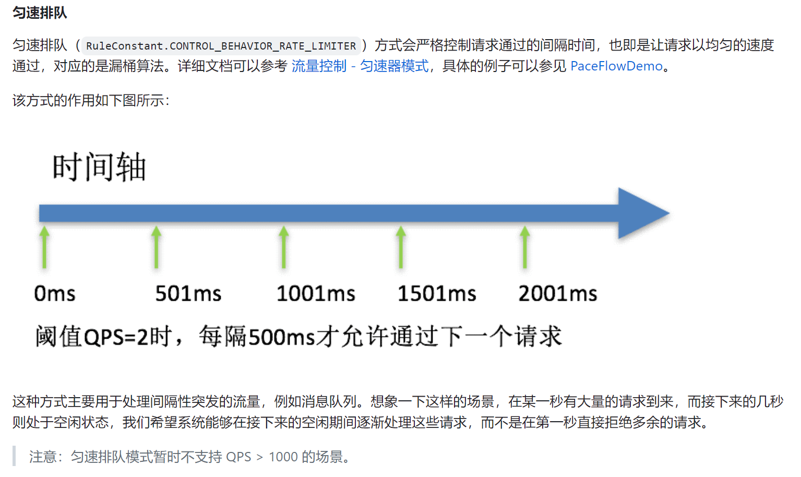

**源码**             

```sh
com.alibaba.csp.sentinel.slots.block.flow.controller.RateLimiterController
```

工作原理

例如：QPS = 5，意味着每200ms处理一个队列中的请求；timeout = 2000，意味着**预期等待时长**超过2000ms的请求会被拒绝并抛出异常。

那什么叫做预期等待时长呢？

比如现在一下子来了12 个请求，因为每200ms执行一个请求，那么：

- 第6个请求的**预期等待时长** =  200 * （6 - 1） = 1000ms
- 第12个请求的预期等待时长 = 200 * （12-1） = 2200ms

现在，第1秒同时接收到10个请求，但第2秒只有1个请求，此时QPS的曲线这样的：

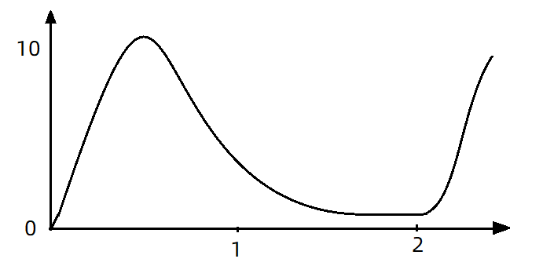

**如果使用队列模式做流控，所有进入的请求都要排队，以固定的200ms的间隔执行，QPS会变的很平滑：**

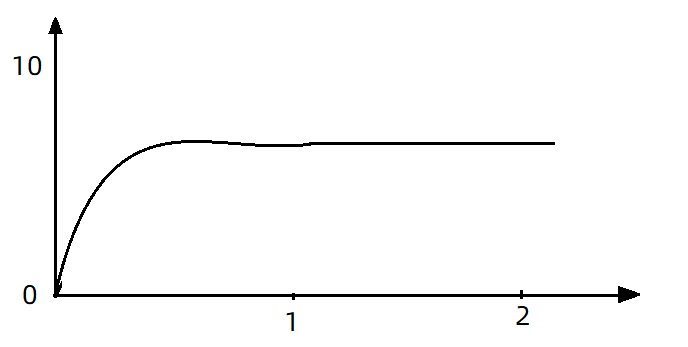

**案例**

QPS为15，已经超过了我们设定的10。

如果是之前的 快速失败、warmup模式，超出的请求应该会直接报错。

但是我们看看队列模式的运行结果：

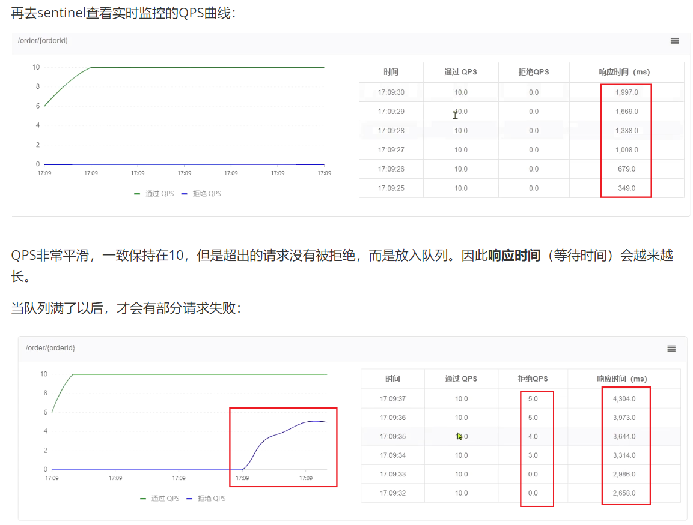

## 16.5. 降级规则

官网             https://github.com/alibaba/Sentinel/wiki/%E7%86%94%E6%96%AD%E9%99%8D%E7%BA%A7

### 16.5.1. 基本介绍

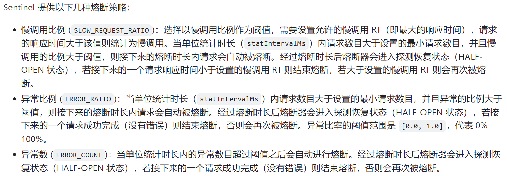


### 16.5.2. 降级策略实战

熔断降级是解决雪崩问题的重要手段。其思路是由**断路器**统计服务调用的异常比例、慢请求比例，如果超出阈值则会**熔断**该服务。即拦截访问该服务的一切请求；而当服务恢复时，断路器会放行访问该服务的请求。

断路器控制熔断和放行是通过状态机来完成的：

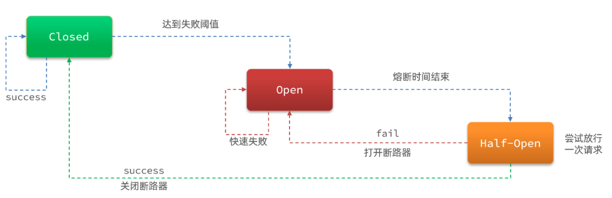

状态机包括三个状态：

- closed：关闭状态，断路器放行所有请求，并开始统计异常比例、慢请求比例。超过阈值则切换到open状态
- open：打开状态，服务调用被**熔断**，访问被熔断服务的请求会被拒绝，快速失败，直接走降级逻辑。Open状态5秒后会进入half-open状态
- half-open：半开状态，放行一次请求，根据执行结果来判断接下来的操作。
  - 请求成功：则切换到closed状态
  - 请求失败：则切换到open状态

**断路器熔断策略有三种：慢调用、异常比例、异常数**

#### 1. 慢调用

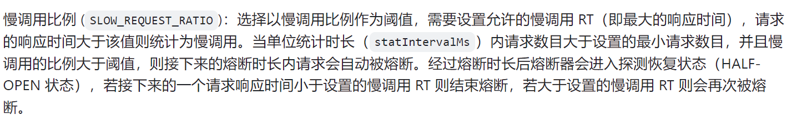

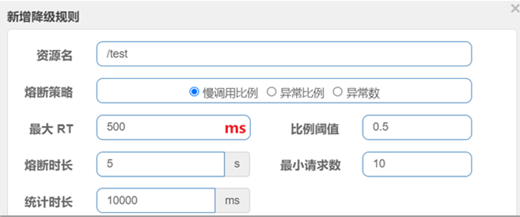

解读：RT超过500ms的调用是慢调用，统计最近10000ms内的请求，如果请求量超过10次，并且慢调用比例不低于0.5，则触发熔断，熔断时长为5秒。然后进入half-open状态，放行一次请求做测试。

**测试**

**这里设置资源为 /testD/{time}，而熔断策略如上图设置，然后我们先正常输入小于500ms的值，测试哪怕10秒内有100次，仍没有任何变化**

```java
    @GetMapping("/testD/{time}")
    public String testD(@PathVariable("time") Integer time) {
        //暂停几秒钟线程
        try { Thread.sleep(time); } catch (InterruptedException e) { e.printStackTrace(); }
        log.info("testD 测试RT");
        return "------testD";
    }
```

**压力测试**

输入501ms的值，快速进行10次请求，可以使用postman，可以发现，当熔断之后，哪怕是1ms的请求，也会服务降级，而等到熔断时间过去，进入半闭半开，如果下次还是错误，会进行第二次熔断，而如果成功，就恢复闭合状态。

#### 2. 异常比例

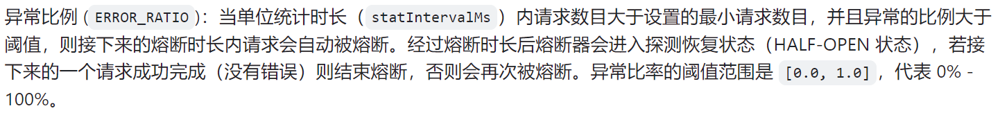

**异常比例或异常数**：统计指定时间内的调用，如果调用次数超过指定请求数，并且出现异常的比例达到设定的比例阈值（或超过指定异常数），则触发熔断。

例如，一个异常比例设置：

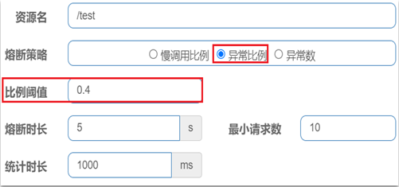

解读：统计最近1000ms内的请求，如果请求量超过10次，并且异常比例不低于0.4，则触发熔断。

**测试**

```java
    @GetMapping("/testD/{id}")
    public String testD(@PathVariable("id") Integer id) {
        //输入指定的ID会触发抛异常
        if (id == 2) throw new RuntimeException("发生异常"); 
        return "testD---> id: " + id;
    }
```

**结论**


**统计最近1000ms内的请求，如果请求量超过10次，并且异常比例不低于0.4，则触发熔断，此时哪怕输入非2的数字，也会导致出现自动服务降级**

#### 3. 异常数


一个异常数设置：

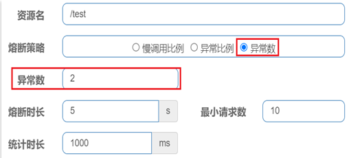

解读：统计最近1000ms内的请求，如果请求量超过10次，并且异常数不低于2次，则触发熔断。

**测试**

```java
    @GetMapping("/testD/{id}")
    public String testD(@PathVariable("id") Integer id) {
        //输入指定的ID会触发抛异常
        if (id == 2) throw new RuntimeException("发生异常"); 
        return "testD---> id: " + id;
    }
```

**配置**


```sh
http://localhost:8401/testD/2
```

**统计最近10000ms内的请求，如果请求量超过10次，并且异常数不低于2次，则触发熔断，此时哪怕输入非2的属子，在熔断期间仍然会导致服务降级**

## 16.6. 热点key限流

### 16.6.1. 是什么

官网     https://github.com/alibaba/Sentinel/wiki/%E7%83%AD%E7%82%B9%E5%8F%82%E6%95%B0%E9%99%90%E6%B5%81

**<font color='000bb'>兜底方法</font>**
**<font color='000bb'>分为系统默认和客户自定义，两种</font>**

  **之前的case，限流出问题后，都是用sentinel系统默认的提示：Blocked by Sentinel (flow limiting)**


  **我们能不能自定?类似hystrix，某个方法出问题了，就找对应的兜底降级方法？**

**结论**
    **<font color='bb000'>从HystrixCommand 到@SentinelResource</font>**


 **sentinel系统默认的提示：Blocked by Sentinel (flow limiting)**

```sh
com.alibaba.csp.sentinel.slots.block.BlockException
```

```java
    @GetMapping("/testHotKey")
    @SentinelResource(value = "testHotKey",blockHandler = "dealHandlerTestHotKey")
    public String testHotKey(@RequestParam(value = "p1",required = false) String p1,
                             @RequestParam(value = "p2",required = false) String p2){
        return "------testHotKey";
    }
    public String dealHandlerTestHotKey(String p1, String p2, BlockException exception)  {
        return "-----dealHandler_testHotKey /(ㄒoㄒ)/~~";
    }
```

### 16.6.2. 全局参数限流

**<font color='000bb'>限流模式只支持QPS模式，固定写死了。（这才叫热点）</font>**

**<font color='000bb'>@SentinelResource注解的方法参数索引，0代表第一个参数，1代表第二个参数，以此类推</font>**

**<font color='000bb'>单机阀值以及统计窗口时长表示在此窗口时间超过阀值就限流。</font>**

**<font color='bb000'>上面的抓图就是第一个参数有值的话，1秒的QPS为1，超过就限流，限流后调用</font>dealHandler_testHotKey支持方法。**

```sh
@SentinelResource(value = "testHotKey")
```

**异常打到了前台用户界面看到，不友好**

```sh
@SentinelResource(value = "testHotKey",blockHandler = "dealHandler_testHotKey")
```

**用了我们自己定义的方法，testHotKey里面第一个参数只要QPS超过每秒1次，马上降级处理**

**<font color='bb000'>以下两个 QPS 超过 1 都会限流</font>**

```sh
http://localhost:8401/testHotKey?p1=abc
http://localhost:8401/testHotKey?p1=abc&p2=33
```

**<font color='bb000'>以下 QPS 超过 1 不会限流</font>**

```sh
http://localhost:8401/testHotKey?p2=abc
```

### 16.6.3. 热点参数限流【参数例外项】

**<font color='bb000'>热点参数的注意点，参数必须是基本类型或者String</font>**


**这里上面给第一个参数设置如果为 1 的情况下，qps限制为 5，而 2 限制为10，然后分别对这两个值进行 qps=10的 压力测试**

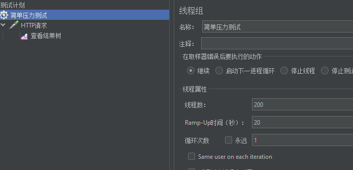

**可以看到当p1为1的情况下，访问会被拒绝，限制qps在5及以下。**

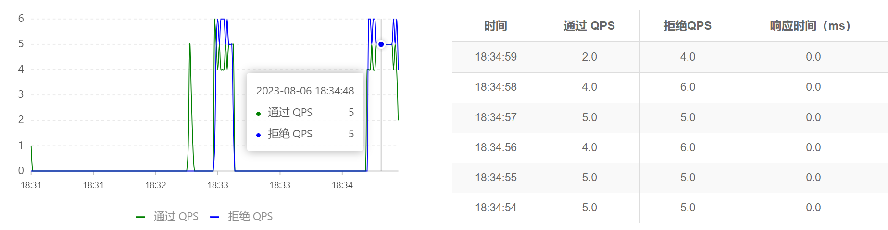

**而p1为2的情况下，qps限制在10及其以下，会由于并发访问出现波动，但不会大于10**

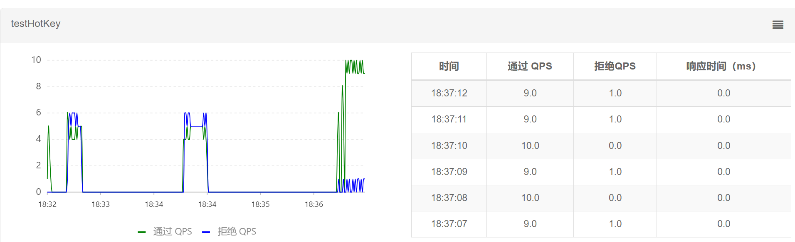

### 16.6.4. 其它

**手贱添加异常看看....../(ㄒoㄒ)/~~**

```sh
@SentinelResource
```

**处理的是Sentinel控制台配置的违规情况，有blockHandler方法配置的兜底处理；**

```sh
RuntimeException   int age = 10/0
```


**这个是java运行时报出的运行时异常RunTimeException，@SentinelResource不管**

**总结**

**@SentinelResource主管配置出错，运行出错该走异常走异常**

## 16.7. 系统规则

### 16.7.1. 背景

https://sentinelguard.io/zh-cn/docs/system-adaptive-protection.html

Sentinel 系统自适应保护从整体维度对应用入口流量进行控制，结合应用的 Load、总体平均 RT、入口 QPS 和线程数等几个维度的监控指标，让系统的入口流量和系统的负载达到一个平衡，让系统尽可能跑在最大吞吐量的同时保证系统整体的稳定性。

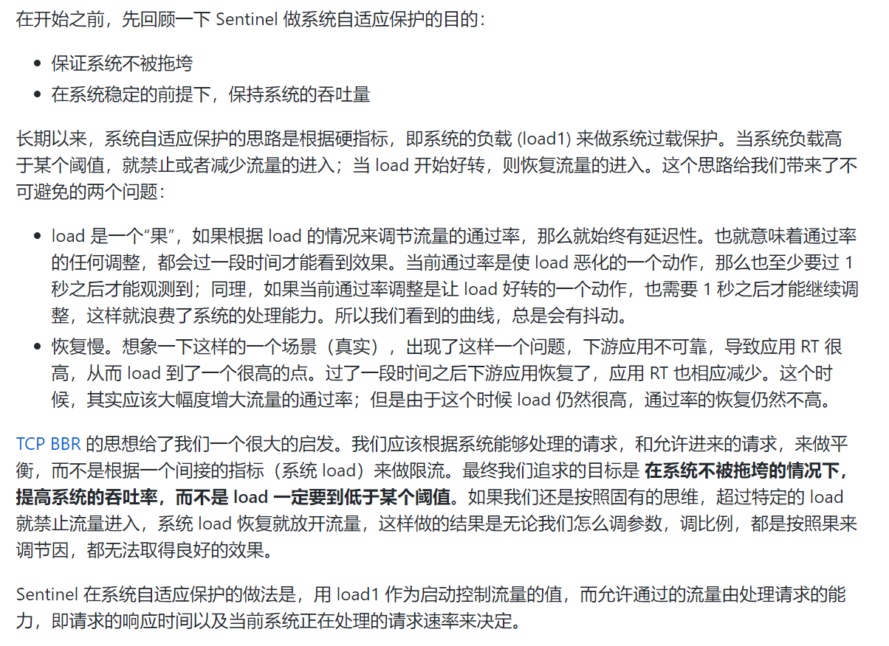

### 16.7.2. 各项配置参数说明


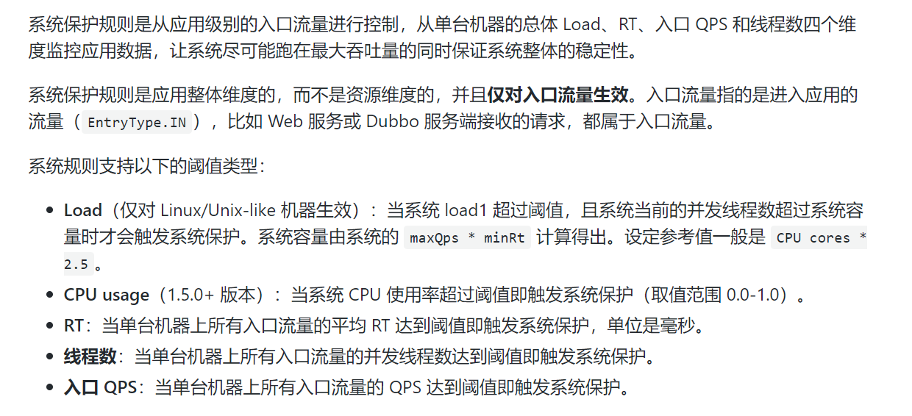

### 16.7.3. 原理

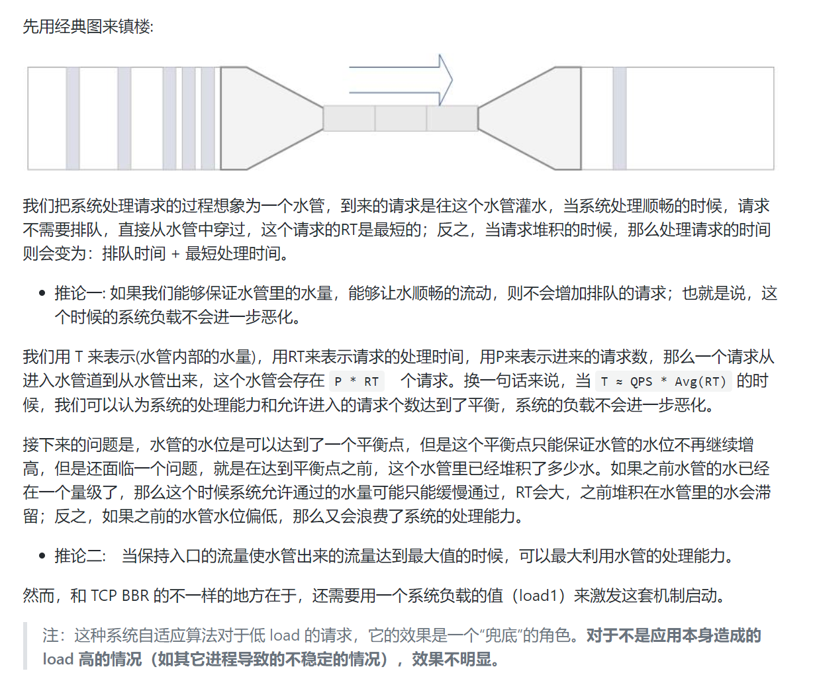

## 16.8. @SentinelResource

### 16.8.1. 按资源名称限流+后续处理

这个其实之前流控模式的笔记的链路模式已经演示过了，这里就大概重新讲一下，懂怎么用就行

```sh
cloudalibaba-sentinel-service8401
```

还是之前的模块，引入我们之前最初演示Eureka的通用包

```xml
        <dependency><!-- 引入自己定义的api通用包，可以使用Payment支付Entity -->
            <groupId>com.fanxy.springcloud</groupId>
            <artifactId>cloud-api-commons</artifactId>
            <version>${project.version}</version>
        </dependency>
```

```sh
业务类RateLimitController
```

```java
@RestController
public class RateLimitController {
    @GetMapping("/byResource")
    @SentinelResource(value = "byResource",blockHandler = "handleException")
    public CommonResult byResource() {
        return new CommonResult(200,"按资源名称限流测试OK",new Payment(2020L,"serial001"));
    }
    public CommonResult handleException(BlockException exception) {
        return new CommonResult(444,exception.getClass().getCanonicalName()+"\t 服务不可用");
    }
}
```

**配置流控规则**

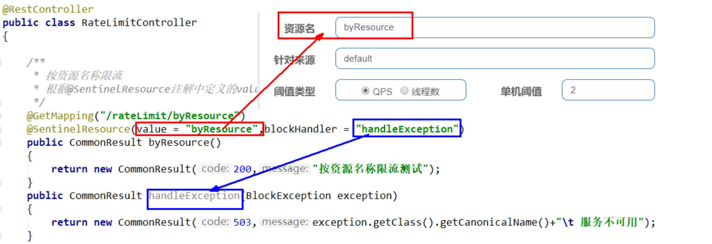

**表示1秒钟内查询次数大于1，就跑到我们自定义的处流，限流**

**测试发现确实出现了如上的限制情况。**

**<font color='bb000'>额外问题</font>**

**此时关闭问服务8401看看**

**Sentinel控制台，流控规则消失了？？？？？**

**临时/持久？**

### 16.8.2. 按照Url地址限流+后续处理

**<font color='bb000'>通过访问的URL来限流，会返回Sentinel自带默认的限流处理信息</font>**

```sh
业务类RateLimitController
```

```java
@RestController
public class RateLimitController {
    @GetMapping("/byResource")
    @SentinelResource(value = "byResource",blockHandler = "handleException")
    public CommonResult byResource() {
        return new CommonResult(200,"按资源名称限流测试OK",new Payment(2020L,"serial001"));
    }
    public CommonResult handleException(BlockException exception)
    {
        return new CommonResult(444,exception.getClass().getCanonicalName()+"\t 服务不可用");
    }

    @GetMapping("/rateLimit/byUrl")
    @SentinelResource(value = "byUrl")
    public CommonResult byUrl() {
        return new CommonResult(200,"按url限流测试OK",new Payment(2020L,"serial002"));
    }
}
```

```sh
http://localhost:8401/rateLimit/byUrl
```


**测试**

```sh
疯狂点击               http://localhost:8401/rateLimit/byUrl
```

**会返回Sentinel自带的限流处理结果**

### 16.8.3. 上面兜底方案面临的问题

1. **系统默认的，没有体现我们自己的业务要求。**

2. **依照现有条件，我们自定义的处理方法又和业务代码耦合在一块，不直观。**

3. **每个业务方法都添加一个兜底的，那代码膨胀加剧。**

4. **全局统一的处理方法没有体现。**

### 16.8.4. 客户自定义限流处理逻辑

创建CustomerBlockHandler类用于自定义限流处理逻辑

自定义限流处理类

```java
public class CustomerBlockHandler {
    public static CommonResult handleException(BlockException exception){
        return new CommonResult(2020,"自定义的限流处理信息......CustomerBlockHandler");
    }
}
```

```sh
RateLimitController
```

```java
@RestController
public class RateLimitController
{
    @GetMapping("/byResource")
    @SentinelResource(value = "byResource",blockHandler = "handleException")
    public CommonResult byResource() {
        return new CommonResult(200,"按资源名称限流测试OK",new Payment(2020L,"serial001"));
    }
    public CommonResult handleException(BlockException exception) {
        return new CommonResult(444,exception.getClass().getCanonicalName()+"\t 服务不可用");
    }

    @GetMapping("/rateLimit/byUrl")
    @SentinelResource(value = "byUrl")
    public CommonResult byUrl() {
        return new CommonResult(200,"按url限流测试OK",new Payment(2020L,"serial002"));
    }

    /**
     * 自定义通用的限流处理逻辑，
     blockHandlerClass = CustomerBlockHandler.class
     blockHandler = handleException2
     上述配置：找CustomerBlockHandler类里的handleException2方法进行兜底处理
     */
    /**
     * 自定义通用的限流处理逻辑
     */
    @GetMapping("/rateLimit/customerBlockHandler")
    @SentinelResource(
        value = "customerBlockHandler",
        blockHandlerClass = CustomerBlockHandler.class,
        blockHandler = "handleException"
    )
    public CommonResult customerBlockHandler() {
        return new CommonResult(200,"按客户自定义限流处理逻辑");
    }

}
```

启动微服务后先调用一次

```sh
http://localhost:8401/rateLimit/customerBlockHandler
```


**测试后我们自定义的出来了**

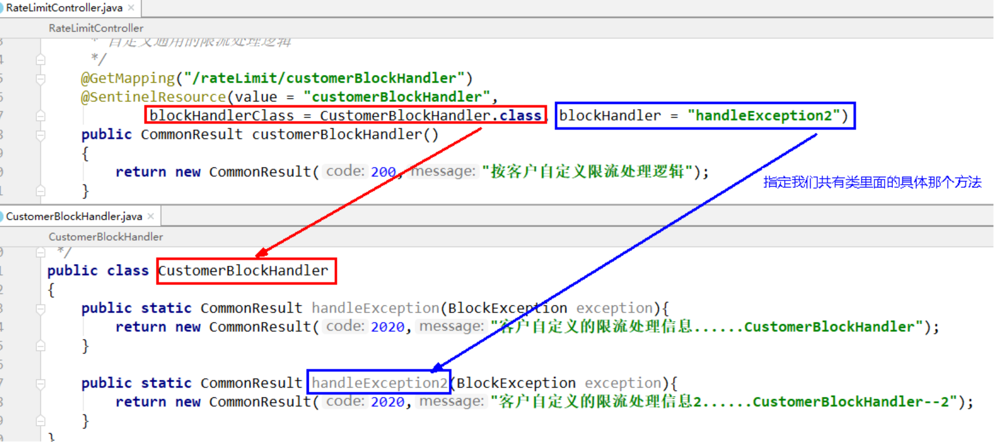

### 16.8.5. 更多注解属性说明

Sentinel主要有三个核心Api【<font color="bb000">**很少用**</font>】

- SphU定义资源
- Tracer定义统计
- ContextUtil定义了上下文

<font color="bb000">**这里注意前面配置的必须是静态public方法**</font>

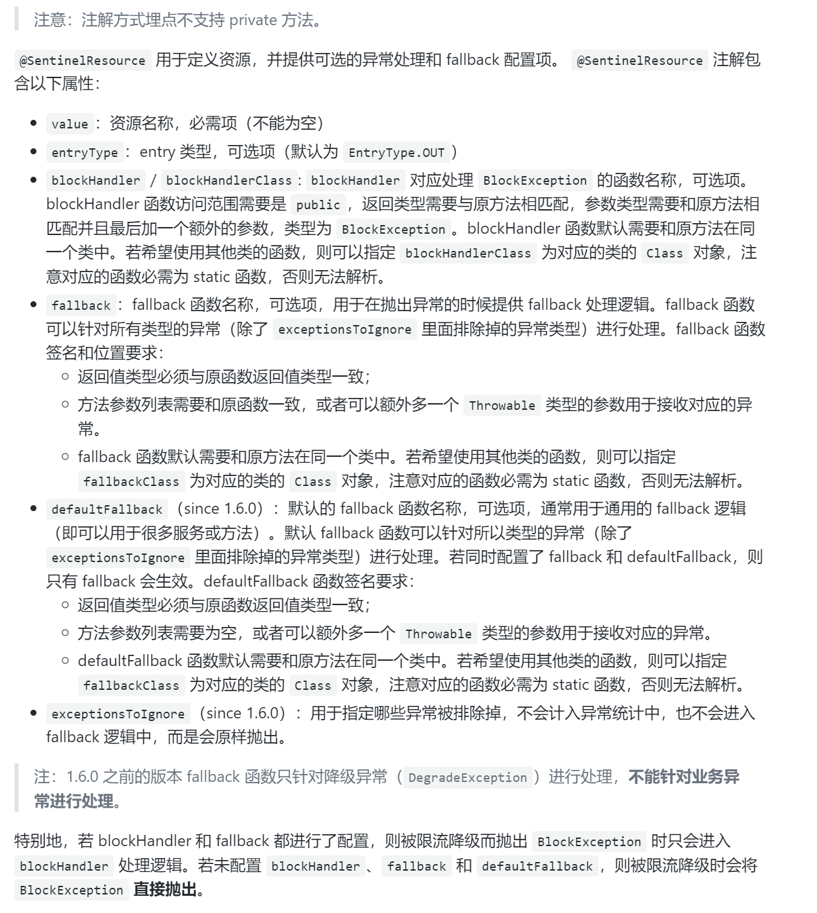

## 16.9. 服务熔断功能

**<font color='000bb'>这里基于Ribbon的就不记笔记了，因为已经被移除了，现在无论是OpenFeign还是Nacos，都是自己实现SpringCloud的`@LoadBalance`接口。</font>**

### 16.9.1. 建立服务提供者9003

**服务提供者9003**

```sh
cloudalibaba-provider-payment9003
```

```xml
    <dependencies>
        <!--SpringCloud ailibaba nacos -->
        <dependency>
            <groupId>com.alibaba.cloud</groupId>
            <artifactId>spring-cloud-starter-alibaba-nacos-discovery</artifactId>
        </dependency>
        <dependency><!-- 引入自己定义的api通用包，可以使用Payment支付Entity -->
            <groupId>com.fanxy.springcloud</groupId>
            <artifactId>cloud-api-commons</artifactId>
            <version>${project.version}</version>
        </dependency>
        <!-- SpringBoot整合Web组件 -->
        <dependency>
            <groupId>org.springframework.boot</groupId>
            <artifactId>spring-boot-starter-web</artifactId>
        </dependency>
        <dependency>
            <groupId>org.springframework.boot</groupId>
            <artifactId>spring-boot-starter-actuator</artifactId>
        </dependency>
        <!--日常通用jar包配置-->
        <dependency>
            <groupId>org.springframework.boot</groupId>
            <artifactId>spring-boot-devtools</artifactId>
            <scope>runtime</scope>
            <optional>true</optional>
        </dependency>
        <dependency>
            <groupId>org.projectlombok</groupId>
            <artifactId>lombok</artifactId>
            <optional>true</optional>
        </dependency>
        <dependency>
            <groupId>org.springframework.boot</groupId>
            <artifactId>spring-boot-starter-test</artifactId>
            <scope>test</scope>
        </dependency>
    </dependencies>
```

```yaml
server:
  port: 9003

spring:
  application:
    name: nacos-payment-provider
  cloud:
    nacos:
      discovery:
        server-addr: localhost:8848 #配置Nacos地址

management:
  endpoints:
    web:
      exposure:
        include: '*'
```

**主启动**

```java
@SpringBootApplication
@EnableDiscoveryClient
public class PaymentMain9003 {
    public static void main(String[] args) {
            SpringApplication.run(PaymentMain9003.class, args);
    }
}
```

**业务类，这里就不连接数据库创建数据和表了，直接用hashmap模拟一个数据库出来**

```java
@RestController
public class PaymentController {
    @Value("${server.port}")
    private String serverPort;

    public static HashMap<Long,Payment> hashMap = new HashMap<>();
    static {
        hashMap.put(1L,new Payment(1L,"28a8c1e3bc2742d8848569891fb42181"));
        hashMap.put(2L,new Payment(2L,"bba8c1e3bc2742d8848569891ac32182"));
        hashMap.put(3L,new Payment(3L,"6ua8c1e3bc2742d8848569891xt92183"));
    }

    @GetMapping(value = "/paymentSQL/{id}")
    public CommonResult<Payment> paymentSQL(@PathVariable("id") Long id) {
        Payment payment = hashMap.get(id);
        CommonResult<Payment> result = new CommonResult(200,"from mysql,serverPort:  "+serverPort,payment);
        return result;
    }
}
```

**测试地址**

```sh
http://localhost:9003/paymentSQL/1
```

### 16.9.2. 建立消费者84

**消费者84**

```sh
新建          	cloudalibaba-consumer-nacos-order84
```

```xml
    <dependencies>
        <!--SpringCloud ailibaba nacos -->
        <dependency>
            <groupId>com.alibaba.cloud</groupId>
            <artifactId>spring-cloud-starter-alibaba-nacos-discovery</artifactId>
        </dependency>
        <!--SpringCloud ailibaba sentinel -->
        <dependency>
            <groupId>com.alibaba.cloud</groupId>
            <artifactId>spring-cloud-starter-alibaba-sentinel</artifactId>
        </dependency>
        <!--SpringCloud openfeign -->
        <dependency>
            <groupId>org.springframework.cloud</groupId>
            <artifactId>spring-cloud-starter-openfeign</artifactId>
        </dependency>
        <!-- 引入自己定义的api通用包，可以使用Payment支付Entity -->
        <dependency>
            <groupId>com.fanxy.springcloud</groupId>
            <artifactId>cloud-api-commons</artifactId>
            <version>${project.version}</version>
        </dependency>
        <!-- SpringBoot整合Web组件 -->
        <dependency>
            <groupId>org.springframework.boot</groupId>
            <artifactId>spring-boot-starter-web</artifactId>
        </dependency>
        <dependency>
            <groupId>org.springframework.boot</groupId>
            <artifactId>spring-boot-starter-actuator</artifactId>
        </dependency>
        <!--日常通用jar包配置-->
        <dependency>
            <groupId>org.springframework.boot</groupId>
            <artifactId>spring-boot-devtools</artifactId>
            <scope>runtime</scope>
            <optional>true</optional>
        </dependency>
        <dependency>
            <groupId>org.projectlombok</groupId>
            <artifactId>lombok</artifactId>
            <optional>true</optional>
        </dependency>
        <dependency>
            <groupId>org.springframework.boot</groupId>
            <artifactId>spring-boot-starter-test</artifactId>
            <scope>test</scope>
        </dependency>
    </dependencies>
```

```yaml
server:
  port: 84


spring:
  application:
    name: nacos-order-consumer
  cloud:
    nacos:
      discovery:
        #Nacos服务注册中心地址
        server-addr: localhost:8848
    sentinel:
      transport:
        #配置Sentinel dashboard地址
        dashboard: localhost:8080
        #默认8719端口，假如被占用会自动从8719开始依次+1扫描,直至找到未被占用的端口
        port: 8719

management:
  endpoints:
    web:
      exposure:
        include: '*'
# 激活Sentinel对Feign的支持
feign:
  sentinel:
    enabled: true
```

**业务类**

**带@FeignClient注解的业务接口**

```java
//调用中关闭9003服务提供者
@FeignClient(value = "nacos-payment-provider",fallback = PaymentFallbackService.class)
public interface PaymentService {
    @GetMapping(value = "/paymentSQL/{id}")
    public CommonResult<Payment> paymentSQL(@PathVariable("id") Long id);
}
```

```java
@Component
public class PaymentFallbackService implements PaymentService {
    @Override
    public CommonResult<Payment> paymentSQL(Long id) {
        return new CommonResult<>(444,"服务降级返回,没有该流水信息",new Payment(id, "errorSerial......"));
    }
}
```

**Controller**

**下面的几个是演示分别只配置 fallback，或者只配置blockHander的情况，设置sentinel流控会发生什么情况。**

**最终实验结果是，blockHander只处理Sentinel流控的配置，而如果是其他的java异常，还是走java异常的逻辑，但qps如果超过限制【或者是违背了sentinel的其他限流配置】，会进行服务降级。即不管怎样，都需要优先遵循sentinel的流控配置，而如果违返，就返回blockHander的降级方法。**

**而fallback处理java抛出的标准异常即除了BlockException，都可以处理，除非使用exceptionsToIgnore指明可以忽略的异常，这种情况下，会按默认抛异常的情况把异常抛出。**

**<font color='bb000'>更官方的参考，可以看上面 16.8.5 的官方图解。</font>**

```java
@RestController
@Slf4j
public class CircleBreakerController {
    public static final String SERVICE_URL = "http://nacos-payment-provider";

    @Resource
    private RestTemplate restTemplate;

    @RequestMapping("/consumer/fallback/{id}")
    //@SentinelResource(value = "fallback") //没有配置
    //@SentinelResource(value = "fallback",fallback = "handlerFallback") //fallback只负责业务异常
    //@SentinelResource(value = "fallback",blockHandler = "blockHandler") //blockHandler只负责sentinel控制台配置违规
    @SentinelResource(value = "fallback",fallback = "handlerFallback",blockHandler = "blockHandler",
            exceptionsToIgnore = {IllegalArgumentException.class})
    public CommonResult<Payment> fallback(@PathVariable Long id)
    {
        CommonResult<Payment> result = restTemplate.getForObject(SERVICE_URL + "/paymentSQL/"+id,CommonResult.class,id);

        if (id == 4) {
            throw new IllegalArgumentException ("IllegalArgumentException,非法参数异常....");
        }else if (result.getData() == null) {
            throw new NullPointerException ("NullPointerException,该ID没有对应记录,空指针异常");
        }

        return result;
    }
    //本例是fallback
    public CommonResult handlerFallback(@PathVariable  Long id,Throwable e) {
        Payment payment = new Payment(id,"null");
        return new CommonResult<>(444,"兜底异常handlerFallback,exception内容  "+e.getMessage(),payment);
    }
    //本例是blockHandler
    public CommonResult blockHandler(@PathVariable  Long id,BlockException blockException) {
        Payment payment = new Payment(id,"null");
        return new CommonResult<>(445,"blockHandler-sentinel限流,无此流水: blockException  "+blockException.getMessage(),payment);
    }

    //==================OpenFeign
    @Resource
    private PaymentService paymentService;

    @GetMapping(value = "/consumer/openfeign/{id}")
    public CommonResult<Payment> paymentSQL(@PathVariable("id") Long id){
        if(id == 4) {
            throw new RuntimeException("没有该id");
        }
        return paymentService.paymentSQL(id);
    }

}
```

**主启动添加@EnableFeignClients**

```java
@EnableDiscoveryClient
@SpringBootApplication
@EnableFeignClients
public class OrderNacosMain84 {
    public static void main(String[] args) {
            SpringApplication.run(OrderNacosMain84.class, args);
    }
}
```

### 16.9.3. 测试

```sh
http://localhost:84/consumer/paymentSQL/1
```

**测试84调用9003，此时故意关闭9003微服务提供者，看84消费侧自动降级，不会被耗死**

## 16.10. 规则持久化

### 16.10.1. 是什么

**一旦我们重启应用，sentinel规则将消失，生产环境需要将配置规则进行持久化**

### 16.10.2. 怎么玩

**将限流配置规则持久化进Nacos保存，只要刷新8401某个rest地址，sentinel控制台的流控规则就能看到，只要Nacos里面的配置不删除，针对8401上sentinel上的流控规则持续有效**

### 16.10.3. 步骤

```sh
修改                cloudalibaba-sentinel-service8401
```

**这个包之前已经提前引入了**

```xml
<!--SpringCloud ailibaba sentinel-datasource-nacos -->
<dependency>
    <groupId>com.alibaba.csp</groupId>
    <artifactId>sentinel-datasource-nacos</artifactId>
</dependency>
```

**添加Nacos数据源配置**

```yaml
spring:
  cloud:
    sentinel:
      datasource:
        ds1:
          nacos:
            server-addr: localhost:8848
            dataId: ${spring.application.name}
            groupId: DEFAULT_GROUP
            data-type: json
            rule-type: flow
```

```yaml
server:
  port: 8401

spring:
  application:
    name: cloudalibaba-sentinel-service
  cloud:
    nacos:
      discovery:
        server-addr: localhost:8848 #Nacos服务注册中心地址
    sentinel:
      transport:
        dashboard: localhost:8080 #配置Sentinel dashboard地址
        port: 8719
      datasource:
        ds1:
          nacos:
            server-addr: localhost:8848
            dataId: cloudalibaba-sentinel-service
            groupId: DEFAULT_GROUP
            data-type: json
            rule-type: flow

management:
  endpoints:
    web:
      exposure:
        include: '*'

feign:
  sentinel:
    enabled: true # 激活Sentinel对Feign的支持
```

**添加Nacos业务规则配置**

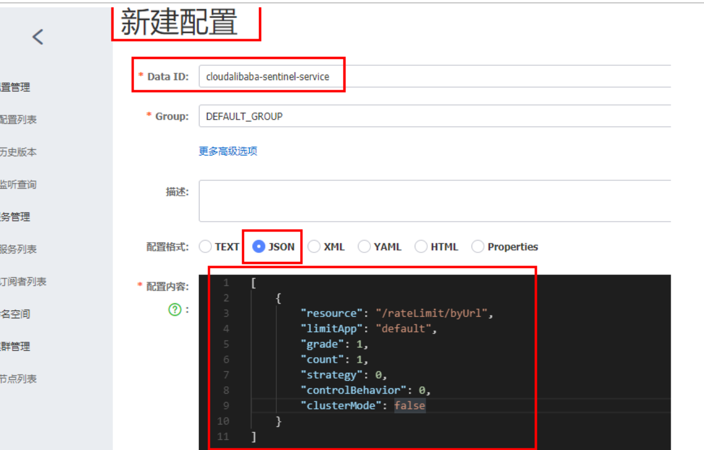

```json
[
    {
        "resource": "/testB",
        "limitApp": "default",
        "grade": 1,
        "count": 1,
        "strategy": 0,
        "controlBehavior": 0,
        "clusterMode": false
    }
]
```

```apl
resource：资源名称；
limitApp：来源应用；
grade：阈值类型，0表示线程数，1表示QPS；
count：单机阈值；
strategy：流控模式，0表示直接，1表示关联，2表示链路；
controlBehavior：流控效果，0表示快速失败，1表示Warm Up，2表示排队等待；
clusterMode：是否集群。
```

**启动8401后刷新sentinel发现业务规则有了**

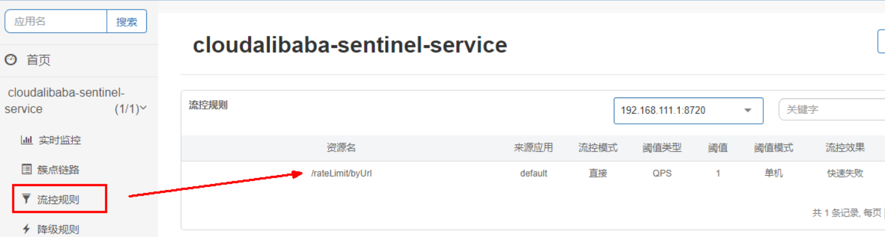

**快速访问测试接口        成功限流**

```sh
http://localhost:8401/rateLimit/byUrl
```

**停止8401再看sentinel**

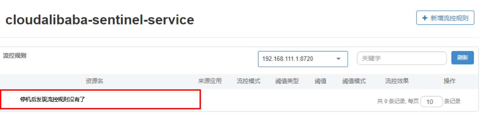

**重新启动8401再看sentinel**

**乍一看还是没有，稍等一会儿**

```sh
http://localhost:8401/rateLimit/byUrl
```

**重新配置出现了，持久化验证通过**

## 16.11. 授权规则

授权规则可以对请求方来源做判断和控制。

### 16.11.1. 基本规则

授权规则可以对调用方的来源做控制，有白名单和黑名单两种方式。

- 白名单：来源（origin）在白名单内的调用者允许访问

- 黑名单：来源（origin）在黑名单内的调用者不允许访问

点击左侧菜单的授权，可以看到授权规则：


- 资源名：就是受保护的资源，例如/order/{orderId}

- 流控应用：是来源者的名单，
  - 如果是勾选白名单，则名单中的来源被许可访问。
  - 如果是勾选黑名单，则名单中的来源被禁止访问。

比如：


我们允许请求从gateway到order-service，不允许浏览器访问order-service，那么白名单中就要填写**网关的来源名称（origin）**。

### 16.11.2. 如何获取origin

Sentinel是通过RequestOriginParser这个接口的parseOrigin来获取请求的来源的。

```java
public interface RequestOriginParser {
    /**
     * 从请求request对象中获取origin，获取方式自定义
     */
    String parseOrigin(HttpServletRequest request);
}
```

这个方法的作用就是从request对象中，获取请求者的origin值并返回。

默认情况下，sentinel不管请求者从哪里来，返回值永远是default，也就是说一切请求的来源都被认为是一样的值default。


因此，我们需要自定义这个接口的实现，让**不同的请求，返回不同的origin**。


例如order-service服务中，我们定义一个RequestOriginParser的实现类：

```java
@Component
public class HeaderOriginParser implements RequestOriginParser {
    @Override
    public String parseOrigin(HttpServletRequest request) {
        // 1.获取请求头
        String origin = request.getHeader("origin");
        // 2.非空判断
        if (StringUtils.isEmpty(origin)) {
            origin = "blank";
        }
        return origin;
    }
}
```

我们会尝试从request-header中获取origin值。

### 16.11.3. 给网关添加请求头

既然获取请求origin的方式是从reques-header中获取origin值，我们必须让**所有从gateway路由到微服务的请求都带上origin头**。

这个需要利用之前学习的一个GatewayFilter来实现，AddRequestHeaderGatewayFilter。

修改gateway服务中的application.yml，添加一个defaultFilter：

```java
spring:
  cloud:
    gateway:
      default-filters:
        - AddRequestHeader=origin,gateway
      routes:
       # ...略
```

这样，从gateway路由的所有请求都会带上origin头，值为gateway。而从其它地方到达微服务的请求则没有这个头。


### 16.11.4. 配置授权规则

接下来，我们添加一个授权规则，放行origin值为gateway的请求。

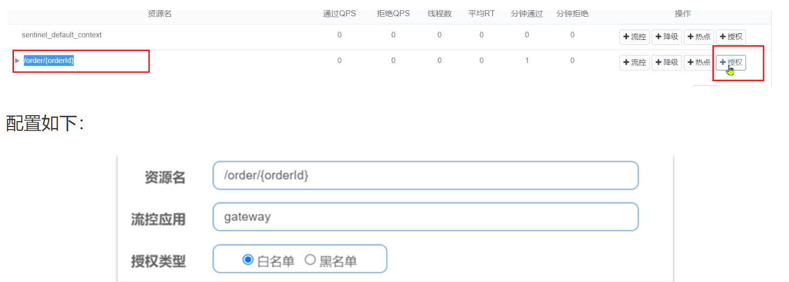

现在，我们直接跳过网关，访问order-service服务：

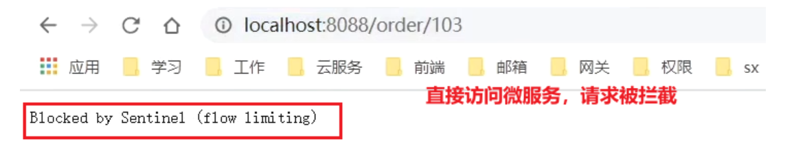

通过网关访问：

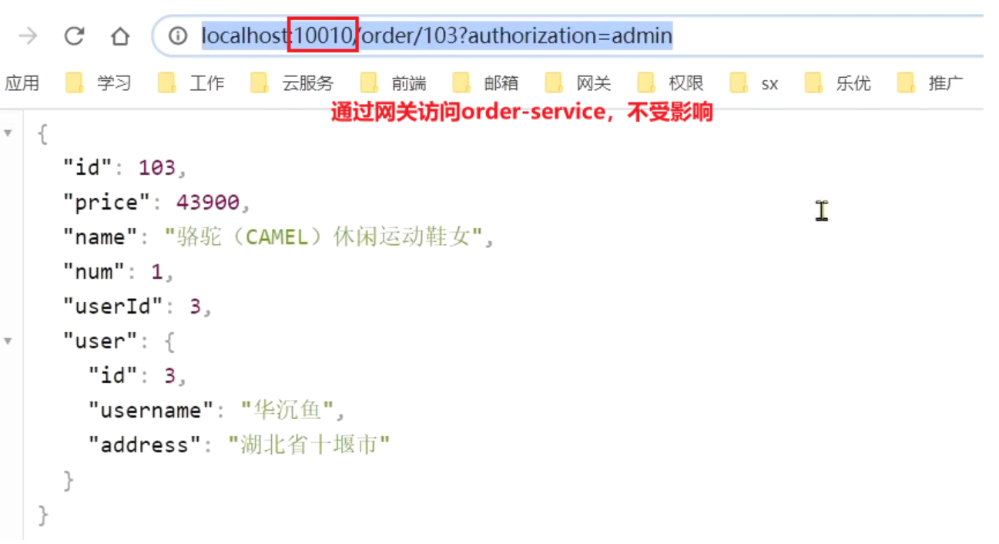

## 16.12. 自定义异常结果

默认情况下，发生限流、降级、授权拦截时，都会抛出异常到调用方。异常结果都是flow limmiting（限流）。这样不够友好，无法得知是限流还是降级还是授权拦截。

### 16.12.1.异常类型

而如果要自定义异常时的返回结果，需要实现BlockExceptionHandler接口：

```java
public interface BlockExceptionHandler {
    /**
     * 处理请求被限流、降级、授权拦截时抛出的异常：BlockException
     */
    void handle(HttpServletRequest request, HttpServletResponse response, BlockException e) throws Exception;
}
```

这个方法有三个参数：

- HttpServletRequest request：request对象
- HttpServletResponse response：response对象
- BlockException e：被sentinel拦截时抛出的异常

这里的BlockException包含多个不同的子类：

| **异常**             | **说明**           |
| -------------------- | ------------------ |
| FlowException        | 限流异常           |
| ParamFlowException   | 热点参数限流的异常 |
| DegradeException     | 降级异常           |
| AuthorityException   | 授权规则异常       |
| SystemBlockException | 系统规则异常       |

### 16.12.2. 自定义异常处理

下面，我们就在order-service定义一个自定义异常处理类：

```java
@Component
public class SentinelExceptionHandler implements BlockExceptionHandler {
    @Override
    public void handle(HttpServletRequest request, HttpServletResponse response, BlockException e) throws Exception {
        String msg = "未知异常";
        int status = 429;

        if (e instanceof FlowException) {
            msg = "请求被限流了";
        } else if (e instanceof ParamFlowException) {
            msg = "请求被热点参数限流";
        } else if (e instanceof DegradeException) {
            msg = "请求被降级了";
        } else if (e instanceof AuthorityException) {
            msg = "没有权限访问";
            status = 401;
        }

        response.setContentType("application/json;charset=utf-8");
        response.setStatus(status);
        response.getWriter().println("{\"msg\": " + msg + ", \"status\": " + status + "}");
    }
}
```

在不同场景下，会返回不同的异常消息.

# 17. SpringCloud Alibaba Seata处理分布式事务

## 17.0. 分布式事务问题

**分布式前                  单机单库没这个问题                       从1：1  ->  1：N  ->  N：N**

**分布式之后**

**单体应用被拆分成微服务应用，原来的三个模块被拆分成<font color='000bb'>三个独立的应用</font>，分别使用<font color='000bb'>三个独立的数据源</font>，业务操作需要调用三个服务来完成。此时<font color='bb000'>每个服务内部的数据一致性由</font><font color='000bb'>本地</font><font color='bb000'>事务来保证，但是</font><font color='000bb'>全局</font><font color='bb000'>的数据一致性问题没法保证。</font>**


**一次业务操作需要跨多个数据源或需要跨多个系统进行远程调用，就会产生分布式事务问题**

## 17.1. 补充知识

### 17.1.1. BASE理论

BASE理论是对CAP的一种解决思路，包含三个思想：

- **Basically Available** **（基本可用）**：分布式系统在出现故障时，允许损失部分可用性，即保证核心可用。
- **Soft State（软状态）：**在一定时间内，允许出现中间状态，比如临时的不一致状态。
- **Eventually Consistent（最终一致性）**：虽然无法保证强一致性，但是在软状态结束后，最终达到数据一致。

### 17.1.2. 解决分布式事务的思路

分布式事务最大的问题是各个子事务的一致性问题，因此可以借鉴CAP定理和BASE理论，有两种解决思路：

- AP模式：各子事务分别执行和提交，允许出现结果不一致，然后采用弥补措施恢复数据即可，实现最终一致。

- CP模式：各个子事务执行后互相等待，同时提交，同时回滚，达成强一致。但事务等待过程中，处于弱可用状态。

但不管是哪一种模式，都需要在子系统事务之间互相通讯，协调事务状态，也就是需要一个**事务协调者(TC)**：


这里的子系统事务，称为**分支事务**；有关联的各个分支事务在一起称为**全局事务**。

## 17.2. Seata简介

### 17.2.1. 是什么

**Seata是一款开源的分布式事务解决方案，致力于在微服务架构下提供高性能和简单易用的分布式事务服务。**

**官网地址**         http://seata.io/zh-cn/


### 17.2.2. 能干嘛

**一个典型的分布式事务过程**

**<font color='bb000'>分布式事务处理过程的               一ID         +               三组件模型</font>**

**Transaction ID XID      :       全局唯一的事务ID**

**<font color='000bb'>3组件概念</font>**

**Transaction Coordinator (TC)        :            事务协调器，维护全局事务的运行状态，负责协调并驱动全局事务的提交或回滚**

**Transaction Manager (TM)            :             控制全局事务的边界，负责开启一个全局事务，并最终发起全局提交或全局回滚的决议**

**Resource Manager (RM)                :             控制分支事务，负责分支注册、状态汇报，并接收事务协调器的指令，驱动分支（本地）事务的提交和回滚**

**处理过程**

1. **TM 向 TC 申请开启一个全局事务，全局事务创建成功并生成一个全局唯一的 XID；**
2. **XID 在微服务调用链路的上下文中传播；**
3. **RM 向 TC 注册分支事务，将其纳入 XID 对应全局事务的管辖；**
4. **TM 向 TC 发起针对 XID 的全局提交或回滚决议；**
5. **TC 调度 XID 下管辖的全部分支事务完成提交或回滚请求。**

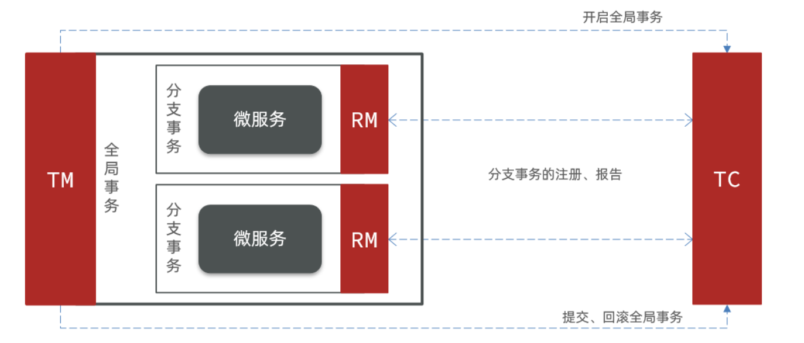

Seata基于上述架构提供了四种不同的分布式事务解决方案：

- XA模式：强一致性分阶段事务模式，牺牲了一定的可用性，无业务侵入
- TCC模式：最终一致的分阶段事务模式，有业务侵入
- AT模式：最终一致的分阶段事务模式，无业务侵入，也是Seata的默认模式
- SAGA模式：长事务模式，有业务侵入

无论哪种方案，都离不开TC，也就是事务的协调者。

### 17.2.3. 去哪下

发布说明: https://github.com/seata/seata/releases

### 17.2.4. 怎么玩

**<font color='bb000'>本地@Transactional</font>**

**<font color='000bb'>全局@GlobalTransactional</font>**

**SEATA 的分布式交易解决方案**


## 17.3. Seata-Server安装

### 17.3.1. 官网地址

https://github.com/seata/seata/releases

http://seata.io/zh-cn/blog/download.html

**我选用了最新的稳定版本 1.4.2**

### 17.3.2. 解压到指定目录并修改配置文件

在非中文目录解压缩这个zip包，其目录结构如下：


修改conf目录下的registry.conf文件：


内容如下：

```properties
registry {
  # tc服务的注册中心类，这里选择nacos，也可以是eureka、zookeeper等
  type = "nacos"

  nacos {
    # seata tc 服务注册到 nacos的服务名称，可以自定义
    application = "seata-tc-server"
    serverAddr = "127.0.0.1:8848,127.0.0.1:8847,127.0.0.1:8846"
    group = "DEFAULT_GROUP"
    namespace = ""
    # 这里是集群名字
    cluster = "SH"
    username = "nacos"
    password = "nacos"
  }
}

config {
  # 读取服务端的配置文件的方式，这里是从nacos配置中心读取，这样如果是集群，可以共享配置
  type = "nacos"
  # 配置nacos地址等信息
  nacos {
    serverAddr = "127.0.0.1:8848,127.0.0.1:8847,127.0.0.1:8846"
    namespace = ""
    group = "SEATA_GROUP"
    username = "nacos"
    password = "nacos"
    dataId = "seataServer.properties"
  }
}
```

### 17.3.3. 在nacos添加配置

特别注意，为了让服务的集群可以共享配置，我们选择了nacos作为统一配置中心。因此服务端配置文件seataServer.properties文件需要在nacos中配好。

格式如下：


配置内容如下：

```sh
seataServer.properties
```

```properties
# 数据存储方式，db代表数据库
store.mode=db
store.db.datasource=druid
store.db.dbType=mysql
store.db.driverClassName=com.mysql.cj.jdbc.Driver
store.db.url=jdbc:mysql://127.0.0.1:3306/seata?useUnicode=true&rewriteBatchedStatements=true&serverTimezone=UTC
store.db.user=root
store.db.password=123
store.db.minConn=5
store.db.maxConn=30
store.db.globalTable=global_table
store.db.branchTable=branch_table
store.db.queryLimit=100
store.db.lockTable=lock_table
store.db.maxWait=5000
# 事务、日志等配置
server.recovery.committingRetryPeriod=1000
server.recovery.asynCommittingRetryPeriod=1000
server.recovery.rollbackingRetryPeriod=1000
server.recovery.timeoutRetryPeriod=1000
server.maxCommitRetryTimeout=-1
server.maxRollbackRetryTimeout=-1
server.rollbackRetryTimeoutUnlockEnable=false
server.undo.logSaveDays=7
server.undo.logDeletePeriod=86400000

# 客户端与服务端传输方式
transport.serialization=seata
transport.compressor=none
# 关闭metrics功能，提高性能
metrics.enabled=false
metrics.registryType=compact
metrics.exporterList=prometheus
metrics.exporterPrometheusPort=9898
```


==其中的数据库地址、用户名、密码都需要修改成你自己的数据库信息。==


### 17.3.4. 创建数据库表

特别注意：服务在管理分布式事务时，需要记录事务相关数据到数据库中，你需要提前创建好这些表。

新建一个名为seata的数据库，运行

```sql
CREATE DATABASE IF NOT EXISTS `seata`;
USE `seata`;

SET NAMES utf8mb4;
SET FOREIGN_KEY_CHECKS = 0;

-- ----------------------------
-- 分支事务表
-- ----------------------------
DROP TABLE IF EXISTS `branch_table`;
CREATE TABLE `branch_table`  (
  `branch_id` bigint(20) NOT NULL,
  `xid` varchar(128) CHARACTER SET utf8 COLLATE utf8_general_ci NOT NULL,
  `transaction_id` bigint(20) NULL DEFAULT NULL,
  `resource_group_id` varchar(32) CHARACTER SET utf8 COLLATE utf8_general_ci NULL DEFAULT NULL,
  `resource_id` varchar(256) CHARACTER SET utf8 COLLATE utf8_general_ci NULL DEFAULT NULL,
  `branch_type` varchar(8) CHARACTER SET utf8 COLLATE utf8_general_ci NULL DEFAULT NULL,
  `status` tinyint(4) NULL DEFAULT NULL,
  `client_id` varchar(64) CHARACTER SET utf8 COLLATE utf8_general_ci NULL DEFAULT NULL,
  `application_data` varchar(2000) CHARACTER SET utf8 COLLATE utf8_general_ci NULL DEFAULT NULL,
  `gmt_create` datetime(6) NULL DEFAULT NULL,
  `gmt_modified` datetime(6) NULL DEFAULT NULL,
  PRIMARY KEY (`branch_id`) USING BTREE,
  INDEX `idx_xid`(`xid`) USING BTREE
) ENGINE = InnoDB CHARACTER SET = utf8 COLLATE = utf8_general_ci ROW_FORMAT = Compact;

-- ----------------------------
-- 全局事务表
-- ----------------------------
DROP TABLE IF EXISTS `global_table`;
CREATE TABLE `global_table`  (
  `xid` varchar(128) CHARACTER SET utf8 COLLATE utf8_general_ci NOT NULL,
  `transaction_id` bigint(20) NULL DEFAULT NULL,
  `status` tinyint(4) NOT NULL,
  `application_id` varchar(32) CHARACTER SET utf8 COLLATE utf8_general_ci NULL DEFAULT NULL,
  `transaction_service_group` varchar(32) CHARACTER SET utf8 COLLATE utf8_general_ci NULL DEFAULT NULL,
  `transaction_name` varchar(128) CHARACTER SET utf8 COLLATE utf8_general_ci NULL DEFAULT NULL,
  `timeout` int(11) NULL DEFAULT NULL,
  `begin_time` bigint(20) NULL DEFAULT NULL,
  `application_data` varchar(2000) CHARACTER SET utf8 COLLATE utf8_general_ci NULL DEFAULT NULL,
  `gmt_create` datetime NULL DEFAULT NULL,
  `gmt_modified` datetime NULL DEFAULT NULL,
  PRIMARY KEY (`xid`) USING BTREE,
  INDEX `idx_gmt_modified_status`(`gmt_modified`, `status`) USING BTREE,
  INDEX `idx_transaction_id`(`transaction_id`) USING BTREE
) ENGINE = InnoDB CHARACTER SET = utf8 COLLATE = utf8_general_ci ROW_FORMAT = Compact;

SET FOREIGN_KEY_CHECKS = 1;
```

### 17.3.5. 启动TC服务

进入bin目录，运行其中的**seata-server.bat**即可：

启动成功后，seata-server应该已经注册到nacos注册中心了。

打开浏览器，访问nacos地址：http://localhost:8848，然后进入服务列表页面，可以看到seata-tc-server的信息：

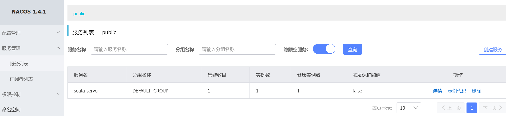

## 17.4. 微服务集成`Seata`

我们以order-service为例来演示。

seata-demo：父工程，负责管理项目依赖

- account-service：账户服务，负责管理用户的资金账户。提供扣减余额的接口
- storage-service：库存服务，负责管理商品库存。提供扣减库存的接口
- order-service：订单服务，负责管理订单。创建订单时，需要调用account-service和storage-service

```sql
CREATE DATABASE IF NOT EXISTS `seata_demo`;
USE `seata_demo`;

SET NAMES utf8mb4;
SET FOREIGN_KEY_CHECKS = 0;

-- ----------------------------
-- Table structure for account_tbl
-- ----------------------------
DROP TABLE IF EXISTS `account_tbl`;
CREATE TABLE `account_tbl`  (
  `id` int(11) NOT NULL AUTO_INCREMENT,
  `user_id` varchar(255) CHARACTER SET utf8 COLLATE utf8_general_ci NULL DEFAULT NULL,
  `money` int(11) UNSIGNED NULL DEFAULT 0,
  PRIMARY KEY (`id`) USING BTREE
) ENGINE = InnoDB AUTO_INCREMENT = 2 CHARACTER SET = utf8 COLLATE = utf8_general_ci ROW_FORMAT = COMPACT;

-- ----------------------------
-- Records of account_tbl
-- ----------------------------
INSERT INTO `account_tbl` VALUES (1, 'user202103032042012', 1000);

-- ----------------------------
-- Table structure for order_tbl
-- ----------------------------
DROP TABLE IF EXISTS `order_tbl`;
CREATE TABLE `order_tbl`  (
  `id` int(11) NOT NULL AUTO_INCREMENT,
  `user_id` varchar(255) CHARACTER SET utf8 COLLATE utf8_general_ci NULL DEFAULT NULL,
  `commodity_code` varchar(255) CHARACTER SET utf8 COLLATE utf8_general_ci NULL DEFAULT NULL,
  `count` int(11) NULL DEFAULT 0,
  `money` int(11) NULL DEFAULT 0,
  PRIMARY KEY (`id`) USING BTREE
) ENGINE = InnoDB AUTO_INCREMENT = 1 CHARACTER SET = utf8 COLLATE = utf8_general_ci ROW_FORMAT = COMPACT;

-- ----------------------------
-- Records of order_tbl
-- ----------------------------

-- ----------------------------
-- Table structure for storage_tbl
-- ----------------------------
DROP TABLE IF EXISTS `storage_tbl`;
CREATE TABLE `storage_tbl`  (
  `id` int(11) NOT NULL AUTO_INCREMENT,
  `commodity_code` varchar(255) CHARACTER SET utf8 COLLATE utf8_general_ci NULL DEFAULT NULL,
  `count` int(11) UNSIGNED NULL DEFAULT 0,
  PRIMARY KEY (`id`) USING BTREE,
  UNIQUE INDEX `commodity_code`(`commodity_code`) USING BTREE
) ENGINE = InnoDB AUTO_INCREMENT = 2 CHARACTER SET = utf8 COLLATE = utf8_general_ci ROW_FORMAT = COMPACT;

-- ----------------------------
-- Records of storage_tbl
-- ----------------------------
INSERT INTO `storage_tbl` VALUES (1, '100202003032041', 10);

SET FOREIGN_KEY_CHECKS = 1;
```

```xml
<!--seata-->
<dependency>
    <groupId>com.alibaba.cloud</groupId>
    <artifactId>spring-cloud-starter-alibaba-seata</artifactId>
    <exclusions>
        <!--版本较低，1.3.0，因此排除--> 
        <exclusion>
            <artifactId>seata-spring-boot-starter</artifactId>
            <groupId>io.seata</groupId>
        </exclusion>
    </exclusions>
</dependency>
<dependency>
    <groupId>io.seata</groupId>
    <artifactId>seata-spring-boot-starter</artifactId>
    <!--seata starter 采用1.4.2版本-->
    <version>${seata.version}</version>
</dependency>
```

**在order-service中的application.yml中，配置TC服务信息，通过注册中心nacos，结合服务名称获取TC地址：**

```yaml
seata:
  registry: # TC服务注册中心的配置，微服务根据这些信息去注册中心获取tc服务地址
    type: nacos # 注册中心类型 nacos
    nacos:
      server-addr: 127.0.0.1:8848 # nacos地址
      namespace: "" # namespace，默认为空
      group: DEFAULT_GROUP # 分组，默认是DEFAULT_GROUP
      application: seata-tc-server # seata服务名称
      username: nacos
      password: nacos
  tx-service-group: seata-demo # 事务组名称
  service:
    vgroup-mapping: # 事务组与cluster的映射关系
      seata-demo: SH
```

微服务如何根据这些配置寻找TC【seata-server】的地址呢？

我们知道注册到Nacos中的微服务，确定一个具体实例需要四个信息：

- namespace：命名空间
- group：分组
- application：服务名
- cluster：集群名

以上四个信息，在刚才的yaml文件中都能找到：

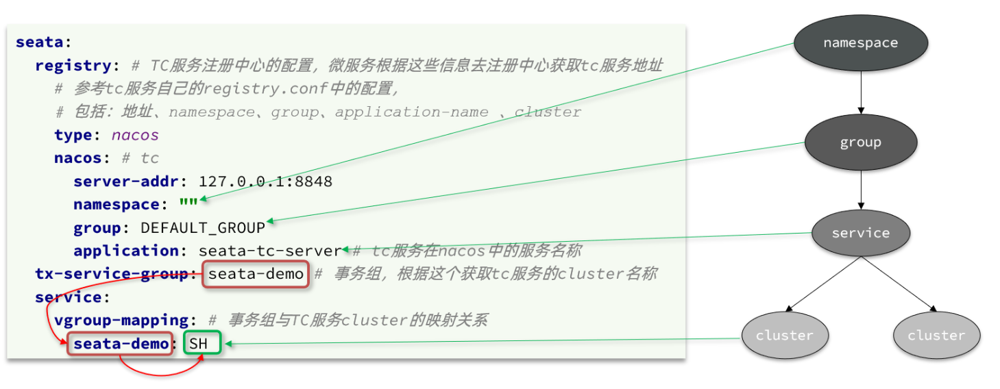

namespace为空，就是默认的public

结合起来，TC服务的信息就是：public@DEFAULT_GROUP@seata-tc-server@SH，这样就能确定TC服务集群了。然后就可以去Nacos拉取对应的实例信息了。

其它两个微服务也都参考order-service的步骤来做，完全一样。

**下面我们就一起学习下Seata中的四种不同的事务模式。**

## 17.5. XA模式

XA 规范 是 X/Open 组织定义的分布式事务处理（DTP，Distributed Transaction Processing）标准，XA 规范 描述了全局的TM与局部的RM之间的接口，几乎所有主流的数据库都对 XA 规范 提供了支持。


### 17.5.1. 两阶段提交

XA是规范，目前主流数据库都实现了这种规范，实现的原理都是基于两阶段提交。

正常情况：


异常情况：

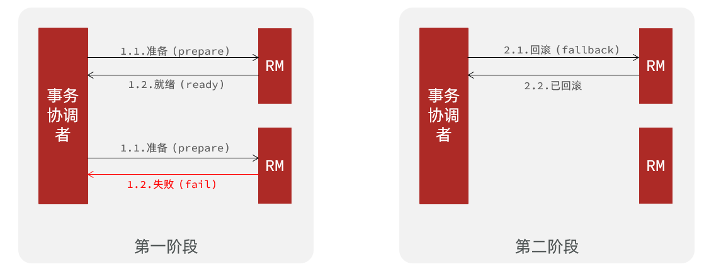

一阶段：

- 事务协调者通知每个事物参与者执行本地事务
- 本地事务执行完成后报告事务执行状态给事务协调者，此时事务不提交，继续持有数据库锁

二阶段：

- 事务协调者基于一阶段的报告来判断下一步操作
  - 如果一阶段都成功，则通知所有事务参与者，提交事务
  - 如果一阶段任意一个参与者失败，则通知所有事务参与者回滚事务

### 17.5.2. Seata的XA模型

Seata对原始的XA模式做了简单的封装和改造，以适应自己的事务模型，基本架构如图：


RM一阶段的工作：

​	① 注册分支事务到TC

​	② 执行分支业务sql但不提交

​	③ 报告执行状态到TC

TC二阶段的工作：

- TC检测各分支事务执行状态

  a.如果都成功，通知所有RM提交事务

  b.如果有失败，通知所有RM回滚事务

RM二阶段的工作：

- 接收TC指令，提交或回滚事务

### 17.5.3. 优缺点

XA模式的优点是什么？

- 事务的强一致性，满足ACID原则。
- 常用数据库都支持，实现简单，并且没有代码侵入

XA模式的缺点是什么？

- 因为一阶段需要锁定数据库资源，等待二阶段结束才释放，性能较差
- 依赖关系型数据库实现事务


### 17.5.4. 实现XA模式

Seata的starter已经完成了XA模式的自动装配，实现非常简单，步骤如下：

1）修改application.yml文件（每个参与事务的微服务），开启XA模式：

```yaml
seata:
  data-source-proxy-mode: XA
```

2）给发起全局事务的入口方法添加@GlobalTransactional注解:

本例中是OrderServiceImpl中的create方法.

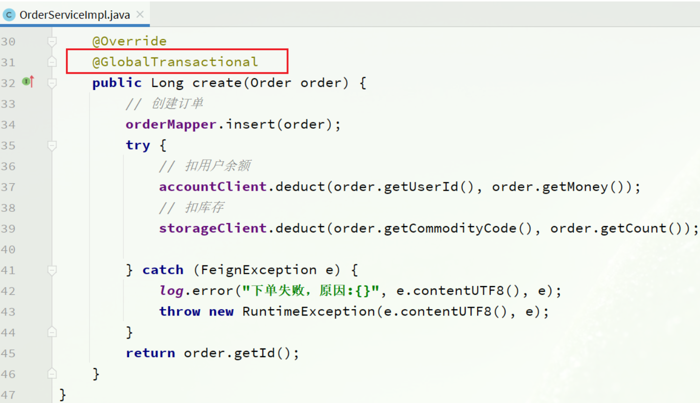


3）重启服务并测试

重启order-service，再次测试，发现无论怎样，三个微服务都能成功回滚。


## 17.6. AT模式

AT模式同样是分阶段提交的事务模型，不过缺弥补了XA模型中资源锁定周期过长的缺陷。

### 17.6.1. Seata的AT模型

基本流程图


阶段一RM的工作：

- 注册分支事务
- 记录undo-log（数据快照）
- 执行业务sql并提交
- 报告事务状态

阶段二提交时RM的工作：

- 删除undo-log即可

阶段二回滚时RM的工作：

- 根据undo-log恢复数据到更新前


### 17.6.2. 流程梳理

我们用一个真实的业务来梳理下AT模式的原理。

比如，现在又一个数据库表，记录用户余额：

| **id** | **money** |
| ------ | --------- |
| 1      | 100       |

其中一个分支业务要执行的SQL为：

```sql
update tb_account set money = money - 10 where id = 1
```


AT模式下，当前分支事务执行流程如下：

一阶段：

1）TM发起并注册全局事务到TC

2）TM调用分支事务

3）分支事务准备执行业务SQL

4）RM拦截业务SQL，根据where条件查询原始数据，形成快照。

```json
{
    "id": 1, "money": 100
}
```

5）RM执行业务SQL，提交本地事务，释放数据库锁。此时 `money = 90`

6）RM报告本地事务状态给TC


二阶段：

1）TM通知TC事务结束

2）TC检查分支事务状态

​	 a）如果都成功，则立即删除快照

​	 b）如果有分支事务失败，需要回滚。读取快照数据（`{"id": 1, "money": 100}`），将快照恢复到数据库。此时数据库再次恢复为100


流程图：


### 17.6.3. AT与XA的区别

简述AT模式与XA模式最大的区别是什么？

- XA模式一阶段不提交事务，锁定资源；AT模式一阶段直接提交，不锁定资源。
- XA模式依赖数据库机制实现回滚；AT模式利用数据快照实现数据回滚。
- XA模式强一致；AT模式最终一致


### 17.6.4. 脏写问题

在多线程并发访问AT模式的分布式事务时，有可能出现脏写问题，如图：


解决思路就是引入了全局锁的概念。在释放DB锁之前，先拿到全局锁。避免同一时刻有另外一个事务来操作当前数据。


### 17.6.5. 优缺点

AT模式的优点：

- 一阶段完成直接提交事务，释放数据库资源，性能比较好
- 利用全局锁实现读写隔离
- 没有代码侵入，框架自动完成回滚和提交

AT模式的缺点：

- 两阶段之间属于软状态，属于最终一致
- 框架的快照功能会影响性能，但比XA模式要好很多


### 17.6.6. 实现AT模式

AT模式中的快照生成、回滚等动作都是由框架自动完成，没有任何代码侵入，因此实现非常简单。

只不过，AT模式需要一个表来记录全局锁、另一张表来记录数据快照undo_log。


1）导入数据库表，记录全局锁

导入课前资料提供的Sql文件：seata-at.sql，其中lock_table导入到TC服务关联的数据库，undo_log表导入到微服务关联的数据库：


2）修改application.yml文件，将事务模式修改为AT模式即可：

```yaml
seata:
  data-source-proxy-mode: AT # 默认就是AT
```


3）重启服务并测试


## 17.7. TCC模式

TCC模式与AT模式非常相似，每阶段都是独立事务，不同的是TCC通过人工编码来实现数据恢复。需要实现三个方法：

- Try：资源的检测和预留； 

- Confirm：完成资源操作业务；要求 Try 成功 Confirm 一定要能成功。

- Cancel：预留资源释放，可以理解为try的反向操作。


### 17.8.1. 流程分析

举例，一个扣减用户余额的业务。假设账户A原来余额是100，需要余额扣减30元。

- **阶段一（ Try ）**：检查余额是否充足，如果充足则冻结金额增加30元，可用余额扣除30

初识余额：

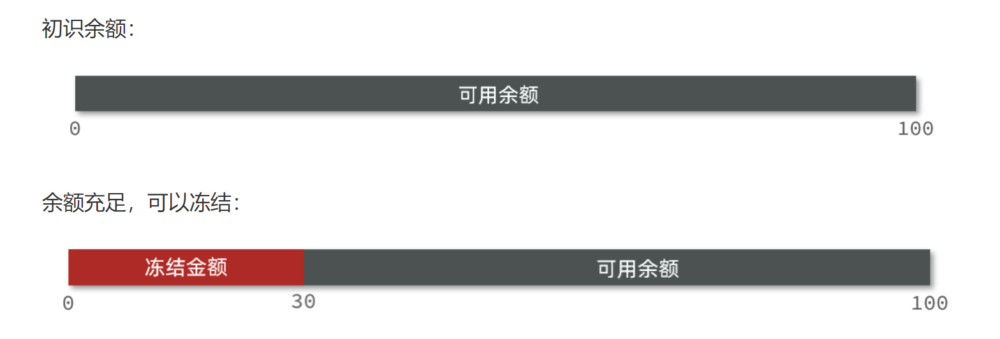

此时，总金额 = 冻结金额 + 可用金额，数量依然是100不变。事务直接提交无需等待其它事务。


- **阶段二（Confirm)**：假如要提交（Confirm），则冻结金额扣减30

确认可以提交，不过之前可用金额已经扣减过了，这里只要清除冻结金额就好了：

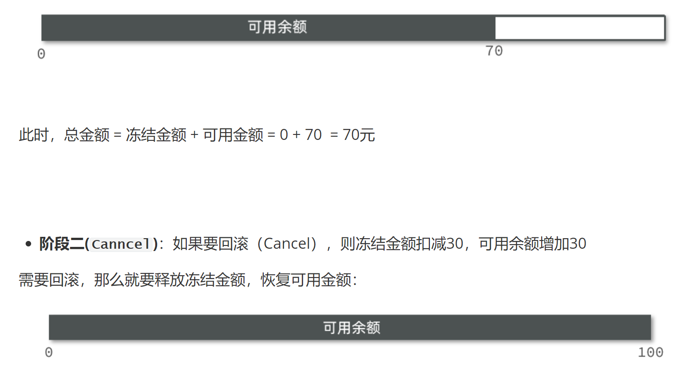

### 17.8.2. Seata的TCC模型

Seata中的TCC模型依然延续之前的事务架构，如图：


### 17.8.3. 优缺点

TCC模式的每个阶段是做什么的？

- Try：资源检查和预留
- Confirm：业务执行和提交
- Cancel：预留资源的释放

TCC的优点是什么？

- 一阶段完成直接提交事务，释放数据库资源，性能好
- 相比AT模型，无需生成快照，无需使用全局锁，性能最强
- 不依赖数据库事务，而是依赖补偿操作，可以用于非事务型数据库

TCC的缺点是什么？

- 有代码侵入，需要人为编写try、Confirm和Cancel接口，太麻烦
- 软状态，事务是最终一致
- 需要考虑Confirm和Cancel的失败情况，做好幂等处理


### 17.8.4. 事务悬挂和空回滚

#### 1）空回滚

当某分支事务的try阶段**阻塞**时，可能导致全局事务超时而触发二阶段的cancel操作。在未执行try操作时先执行了cancel操作，这时cancel不能做回滚，就是**空回滚**。

如图：


执行cancel操作时，应当判断try是否已经执行，如果尚未执行，则应该空回滚。


#### 2）业务悬挂

对于已经空回滚的业务，之前被阻塞的try操作恢复，继续执行try，就永远不可能confirm或cancel ，事务一直处于中间状态，这就是**业务悬挂**。

执行try操作时，应当判断cancel是否已经执行过了，如果已经执行，应当阻止空回滚后的try操作，避免悬挂


### 17.8.5. 实现TCC模式

解决空回滚和业务悬挂问题，必须要记录当前事务状态，是在try、还是cancel？


#### 1）思路分析

这里我们定义一张表：

```sql
CREATE TABLE `account_freeze_tbl` (
  `xid` varchar(128) NOT NULL,
  `user_id` varchar(255) DEFAULT NULL COMMENT '用户id',
  `freeze_money` int(11) unsigned DEFAULT '0' COMMENT '冻结金额',
  `state` int(1) DEFAULT NULL COMMENT '事务状态，0:try，1:confirm，2:cancel',
  PRIMARY KEY (`xid`) USING BTREE
) ENGINE=InnoDB DEFAULT CHARSET=utf8 ROW_FORMAT=COMPACT;
```

其中：

- xid：是全局事务id
- freeze_money：用来记录用户冻结金额
- state：用来记录事务状态

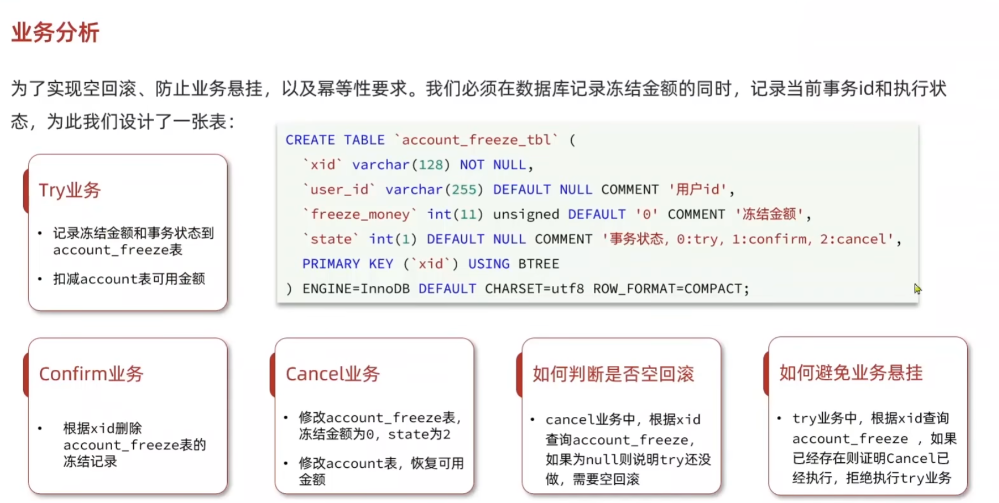

那此时，我们的业务开怎么做呢？

- Try业务：
  - 记录冻结金额和事务状态到account_freeze表
  - 扣减account表可用金额
- Confirm业务
  - 根据xid删除account_freeze表的冻结记录
- Cancel业务
  - 修改account_freeze表，冻结金额为0，state为2
  - 修改account表，恢复可用金额
- 如何判断是否空回滚？
  - cancel业务中，根据xid查询account_freeze，如果为null则说明try还没做，需要空回滚
- 如何避免业务悬挂？
  - try业务中，根据xid查询account_freeze ，如果已经存在则证明Cancel已经执行，拒绝执行try业务


接下来，我们改造account-service，利用TCC实现余额扣减功能。


#### 2）声明TCC接口

TCC的Try、Confirm、Cancel方法都需要在接口中基于注解来声明，

我们在account-service项目中的`cn.itcast.account.service`包中新建一个接口，声明TCC三个接口：

```java
@LocalTCC
public interface AccountTCCService {

    @TwoPhaseBusinessAction(name = "deduct", commitMethod = "confirm", rollbackMethod = "cancel")
    void deduct(@BusinessActionContextParameter(paramName = "userId") String userId,
                @BusinessActionContextParameter(paramName = "money")int money);

    boolean confirm(BusinessActionContext ctx);

    boolean cancel(BusinessActionContext ctx);
}
```

#### 3）编写实现类

在account-service服务中的`cn.itcast.account.service.impl`包下新建一个类，实现TCC业务：

**<font color='bb000'>由于我们这里扣除余额，设计数据库的金额故意设计成无符号类型字段，这样就省去了在第一步的 Try 判断能否可行的步骤，因为钱不够会直接报错，事务执行失败。</font>**

**<font color='000bb'>这里很复杂，除了空回滚和业务悬挂，还需要考虑是否要进行幂等判断，如果要做TCC的话，一定要记得考虑判断可行，每一步考虑幂等，考虑Try的业务悬挂，以及Cancel的空回滚</font>**

```java
@Service
@Slf4j
public class AccountTCCServiceImpl implements AccountTCCService {

    @Autowired
    private AccountMapper accountMapper;
    @Autowired
    private AccountFreezeMapper freezeMapper;

    @Override
    @Transactional
    public void deduct(String userId, int money) {
        // 0.获取事务id
        String xid = RootContext.getXID();
        // 1.1.事务悬挂判断
        AccountFreeze oldFreeze = freezeMapper.selectById(xid);
        if (odlFreeze != null){
            // 如果查到记录 说明已经进行过回滚 直接拒绝业务
            return;
        }
        
        // 1.1.扣减可用余额
        accountMapper.deduct(userId, money);
        // 2.记录冻结金额，事务状态
        AccountFreeze freeze = new AccountFreeze();
        freeze.setUserId(userId);
        freeze.setFreezeMoney(money);
        freeze.setState(AccountFreeze.State.TRY);
        freeze.setXid(xid);
        freezeMapper.insert(freeze);
    }

    @Override
    public boolean confirm(BusinessActionContext ctx) {
        // 1.获取事务id
        String xid = ctx.getXid();
        // 2.根据id删除冻结记录
        int count = freezeMapper.deleteById(xid);
        return count == 1;
    }

    @Override
    public boolean cancel(BusinessActionContext ctx) {
        // 0.查询冻结记录
        String xid = ctx.getXid();
        // 为空回滚做准备
        String usreId = ctx.getActionContext("userId").toString();
        AccountFreeze freeze = freezeMapper.selectById(xid);
		// 1.1.空回滚的判断 判断freeze是否为null 为null 表示try没有执行 需要进行空回滚
        if (freeze == null) {
            // 为null 表示try没有执行 需要进行空回滚
            // 但是空回滚不代表直接return true 这样别人也不知道你回滚了 还需要插回滚数据 需要上下文
            freeze = new AccountFreeze();
            freeze.setUserId(userId);
            freeze.setFreezeMoney(0);
            freeze.setState(freeze.State.CANCEL);
            freeze.setXid(xid);
            freezeMapper.insert(freeze);
        }
        // 做完空回滚还没结束 还得进行幂等判断 confirm不需要因为是删除操作 多次执行删除天生幂等
        if (freeze.State.CANCEL == 2) {
            return true;
        }
        
        // 1.2.恢复可用余额
        accountMapper.refund(freeze.getUserId(), freeze.getFreezeMoney());
        // 2.将冻结金额清零，状态改为CANCEL
        freeze.setFreezeMoney(0);
        freeze.setState(AccountFreeze.State.CANCEL);
        int count = freezeMapper.updateById(freeze);
        return count == 1;
    }
}
```

## 17.9. SAGA模式

Saga 模式是 Seata 即将开源的长事务解决方案，将由蚂蚁金服主要贡献。

其理论基础是Hector & Kenneth  在1987年发表的论文[Sagas](https://microservices.io/patterns/data/saga.html)。

Seata官网对于Saga的指南：https://seata.io/zh-cn/docs/user/saga.html

### 17.9.1. 原理

在 Saga 模式下，分布式事务内有多个参与者，每一个参与者都是一个冲正补偿服务，需要用户根据业务场景实现其正向操作和逆向回滚操作。

分布式事务执行过程中，依次执行各参与者的正向操作，如果所有正向操作均执行成功，那么分布式事务提交。如果任何一个正向操作执行失败，那么分布式事务会去退回去执行前面各参与者的逆向回滚操作，回滚已提交的参与者，使分布式事务回到初始状态。


Saga也分为两个阶段：

- 一阶段：直接提交本地事务
- 二阶段：成功则什么都不做；失败则通过编写补偿业务来回滚


### 17.9.2. 优缺点


优点：

- 事务参与者可以基于事件驱动实现异步调用，吞吐高
- 一阶段直接提交事务，无锁，性能好
- 不用编写TCC中的三个阶段，实现简单

缺点：

- 软状态持续时间不确定，时效性差
- 没有锁，没有事务隔离，会有脏写

## 17.10. 四种模式对比

我们从以下几个方面来对比四种实现：

- 一致性：能否保证事务的一致性？强一致还是最终一致？
- 隔离性：事务之间的隔离性如何？
- 代码侵入：是否需要对业务代码改造？
- 性能：有无性能损耗？
- 场景：常见的业务场景


如图：

这里 AT 和 TCC 其实也算是 最终一致，但是由于中间状态持续比较短，这里就写为弱一致


## 17.11. 高可用

Seata的TC服务作为分布式事务核心，一定要保证集群的高可用性。

### 17.11.1. 高可用架构模型

搭建TC服务集群非常简单，启动多个TC服务，注册到nacos即可。


但集群并不能确保100%安全，万一集群所在机房故障怎么办？所以如果要求较高，一般都会做异地多机房容灾。


比如一个TC集群在上海，另一个TC集群在杭州：


微服务基于事务组（tx-service-group)与TC集群的映射关系，来查找当前应该使用哪个TC集群。当SH集群故障时，只需要将vgroup-mapping中的映射关系改成HZ。则所有微服务就会切换到HZ的TC集群了。


### 17.11.2. TC服务的高可用和异地容灾

#### 1.模拟异地容灾的TC集群

计划启动两台seata的tc服务节点：

| 节点名称 | ip地址    | 端口号 | 集群名称 |
| -------- | --------- | ------ | -------- |
| seata    | 127.0.0.1 | 8091   | SH       |
| seata2   | 127.0.0.1 | 8092   | HZ       |

之前我们已经启动了一台seata服务，端口是8091，集群名为SH。

现在，将seata目录复制一份，起名为seata2

修改seata2/conf/registry.conf内容如下：

```nginx
registry {
  # tc服务的注册中心类，这里选择nacos，也可以是eureka、zookeeper等
  type = "nacos"

  nacos {
    # seata tc 服务注册到 nacos的服务名称，可以自定义
    application = "seata-tc-server"
    serverAddr = "127.0.0.1:8848"
    group = "DEFAULT_GROUP"
    namespace = ""
    cluster = "HZ"
    username = "nacos"
    password = "nacos"
  }
}

config {
  # 读取tc服务端的配置文件的方式，这里是从nacos配置中心读取，这样如果tc是集群，可以共享配置
  type = "nacos"
  # 配置nacos地址等信息
  nacos {
    serverAddr = "127.0.0.1:8848"
    namespace = ""
    group = "SEATA_GROUP"
    username = "nacos"
    password = "nacos"
    dataId = "seataServer.properties"
  }
}
```

进入seata2/bin目录，然后运行命令：

```powershell
seata-server.bat -p 8092
```

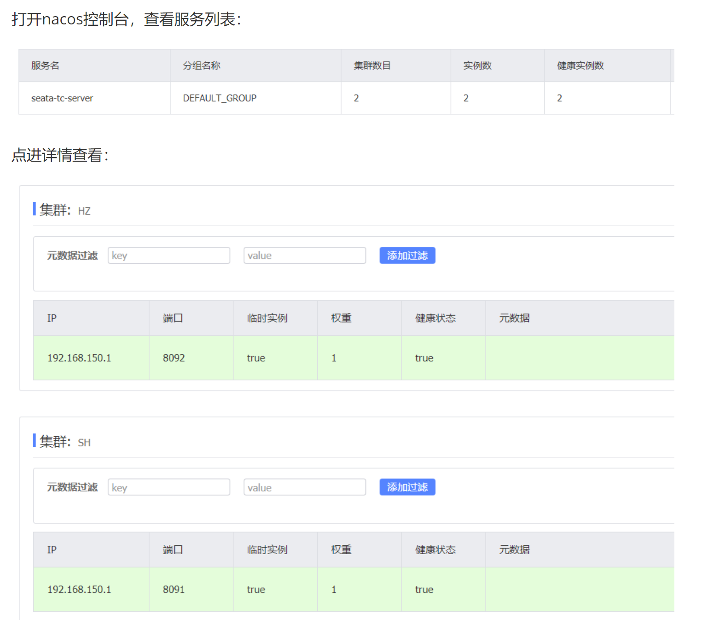

#### 2.将事务组映射配置到nacos

接下来，我们需要将tx-service-group与cluster的映射关系都配置到nacos配置中心。

新建一个配置：

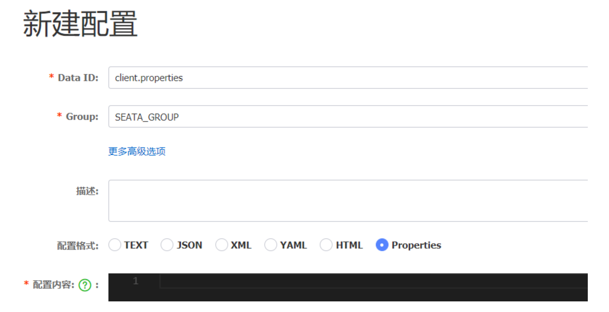

```properties
# 事务组映射关系
service.vgroupMapping.seata-demo=SH

service.enableDegrade=false
service.disableGlobalTransaction=false
# 与TC服务的通信配置
transport.type=TCP
transport.server=NIO
transport.heartbeat=true
transport.enableClientBatchSendRequest=false
transport.threadFactory.bossThreadPrefix=NettyBoss
transport.threadFactory.workerThreadPrefix=NettyServerNIOWorker
transport.threadFactory.serverExecutorThreadPrefix=NettyServerBizHandler
transport.threadFactory.shareBossWorker=false
transport.threadFactory.clientSelectorThreadPrefix=NettyClientSelector
transport.threadFactory.clientSelectorThreadSize=1
transport.threadFactory.clientWorkerThreadPrefix=NettyClientWorkerThread
transport.threadFactory.bossThreadSize=1
transport.threadFactory.workerThreadSize=default
transport.shutdown.wait=3
# RM配置
client.rm.asyncCommitBufferLimit=10000
client.rm.lock.retryInterval=10
client.rm.lock.retryTimes=30
client.rm.lock.retryPolicyBranchRollbackOnConflict=true
client.rm.reportRetryCount=5
client.rm.tableMetaCheckEnable=false
client.rm.tableMetaCheckerInterval=60000
client.rm.sqlParserType=druid
client.rm.reportSuccessEnable=false
client.rm.sagaBranchRegisterEnable=false
# TM配置
client.tm.commitRetryCount=5
client.tm.rollbackRetryCount=5
client.tm.defaultGlobalTransactionTimeout=60000
client.tm.degradeCheck=false
client.tm.degradeCheckAllowTimes=10
client.tm.degradeCheckPeriod=2000

# undo日志配置
client.undo.dataValidation=true
client.undo.logSerialization=jackson
client.undo.onlyCareUpdateColumns=true
client.undo.logTable=undo_log
client.undo.compress.enable=true
client.undo.compress.type=zip
client.undo.compress.threshold=64k
client.log.exceptionRate=100
```

#### 3.微服务读取nacos配置

接下来，需要修改每一个微服务的application.yml文件，让微服务读取nacos中的client.properties文件：

```yaml
seata:
  config:
    type: nacos
    nacos:
      server-addr: 127.0.0.1:8848
      username: nacos
      password: nacos
      group: SEATA_GROUP
      data-id: client.properties
```


重启微服务，现在微服务到底是连接tc的SH集群，还是tc的HZ集群，都统一由nacos的client.properties来决定了。


