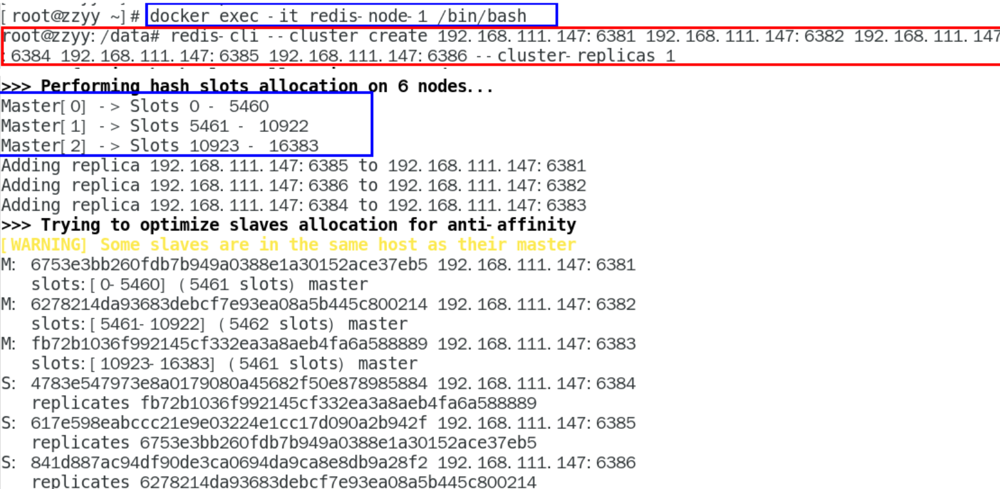
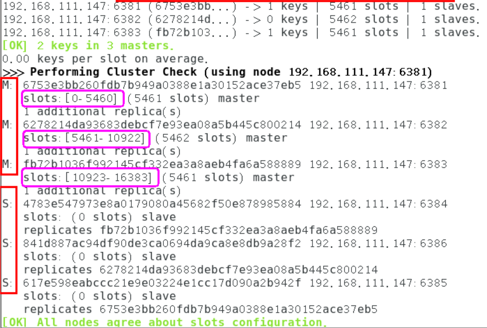
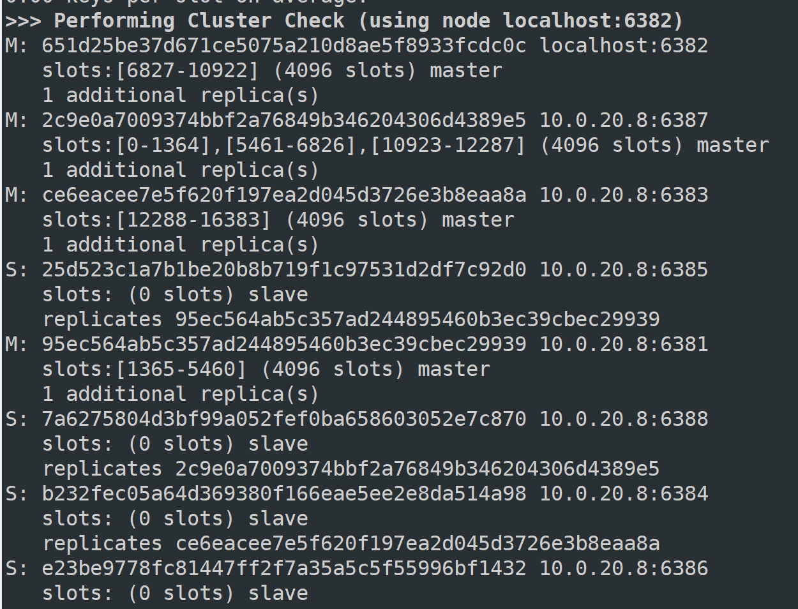

# 第一章 Docker复杂安装详说

## 1.1. 安装mysql主从复制

### 1.1.1. 新建容器实例

**这里我绑定的目录和之前的mysql不同是/fanxyuse/mysql-master**

**这里哪怕显式指明密码，其实密码都是123456，需要进去改。**

```sh
docker run -d -p 3307:3306 --privileged=true -v /fanxyuse/mysql-master/log:/var/log/mysql -v /fanxyuse/mysql-master/data:/var/lib/mysql -v /fanxyuse/mysql-master/conf:/etc/mysql/conf.d -e MYSQL_ROOT_PASSWORD=123456  --name mysql8_master mysql:8.0
```

**1.** **使用ALTER USER命令来修改当前用户密码**

```sql
ALTER USER USER() IDENTIFIED BY 'new_password';
```

**2.** **使用SET语句来修改当前用户密码**

```sql
SET PASSWORD='new_password';
```

### 1.1.2. 进入/fanxyuse/mysql-master/conf目录下新建my.cnf

```sh
vim my.cnf
```

**<font color='bb000'>配置文件行不能有空格</font>**

```ini
[mysqld]
## 设置server_id，同一局域网中需要唯一
server_id=100
## 指定不需要同步的数据库名称
binlog-ignore-db=mysql
## 开启二进制日志功能
log-bin=server-log-bin
## 设置二进制日志使用内存大小（事务)
binlog_cache_size=1M  
## 设置使用的二进制日志格式（mixed,statement,row）
binlog_format=mixed
## 二进制日志过期清理时间。默认值为0，表示不自动清理。
expire_logs_days=7
## 跳过主从复制中遇到的所有错误或指定类型的错误，避免slave端复制中断。
## 如：1062错误是指一些主键重复，1032错误是因为主从数据库数据不一致
slave_skip_errors=1062
```

### 1.1.3. 修改完配置后重启master实例

```sh
docker restart mysql8_master
```

### 1.1.4. 进入mysql-master容器

```sh
docker exec -it mysql8_master /bin/bash
```

```sh
mysql -uroot -p
```

### 1.1.5. master容器实例内创建数据同步用户

```sql
CREATE USER 'slave1'@'%' IDENTIFIED BY '123456';
```

```sql
GRANT REPLICATION SLAVE, REPLICATION CLIENT ON *.* TO 'slave1'@'%';
```

**注意：如果使用的是MySQL8，需要如下的方式建立账户，并授权slave：**

```sql
CREATE USER 'slave1'@'%' IDENTIFIED BY '123456';
GRANT REPLICATION SLAVE ON *.* TO 'slave1'@'%';
#此语句必须执行。否则见下面。
ALTER USER 'slave1'@'%' IDENTIFIED WITH mysql_native_password BY '123456';
flush privileges;
```


```sql
show master status;
```


#### 1.1.6. 新建从服务器容器实例3308

**这里我绑定的目录和之前的mysql不同是/fanxyuse/mysql-slave**

```sh
docker run -d -p 3308:3306 --privileged=true -v /fanxyuse/mysql-slave/log:/var/log/mysql -v /fanxyuse/mysql-slave/data:/var/lib/mysql -v /fanxyuse/mysql-slave/conf:/etc/mysql/conf.d -e MYSQL_ROOT_PASSWORD=123456  --name mysql8_slave mysql:8.0
```

**进入/fanxyuse/mysql-slave/conf目录下新建my.cnf**

```sh
vim: my.cnf
```

**<font color='bb000'>配置文件行不能有空格</font>**

```ini
[mysqld]
## 设置server_id，同一局域网中需要唯一
server_id=101
## 指定不需要同步的数据库名称
binlog-ignore-db=mysql
## 开启二进制日志功能，以备Slave作为其它数据库实例的Master时使用
log-bin=server-mysql-slave1-bin
## 设置二进制日志使用内存大小（事务）
binlog_cache_size=1M
## 设置使用的二进制日志格式（mixed,statement,row）
binlog_format=mixed
## 二进制日志过期清理时间。默认值为0，表示不自动清理。
expire_logs_days=7
## 跳过主从复制中遇到的所有错误或指定类型的错误，避免slave端复制中断。
## 如：1062错误是指一些主键重复，1032错误是因为主从数据库数据不一致
slave_skip_errors=1062
## relay_log配置中继日志
relay_log=server-mysql-relay-bin
## log_slave_updates表示slave将复制事件写进自己的二进制日志
log_slave_updates=1
## slave设置为只读（具有super权限的用户除外）
read_only=1
```

### 1.1.8. 修改完配置后重启slave实例

```sh
docker restart mysql8-slave
```

### 1.1.9. 在主数据库中查看主从同步状态

**此前已经写了在上面**

### 1.1.10. 进入mysql-slave容器

```sh
docker exec -it mysql8-slave /bin/bash
```

```sh
mysql -uroot -p
```

### 1.1.11. 在从数据库中配置主从复制

```sql
change master to master_host='宿主机ip', master_user='slave1', master_password='123456', master_port=3307, master_log_file='server-mysql-bin.000001', master_log_pos=617, master_connect_retry=30;
```

**`master_host`：主数据库的IP地址；**
**`master_port`：主数据库的运行端口；**
**`master_user`：在主数据库创建的用于同步数据的用户账号；**
**`master_password`：在主数据库创建的用于同步数据的用户密码；**
**`master_log_file`：指定从数据库要复制数据的日志文件，通过查看主数据的状态，获取File参数；**
**`master_log_pos`：指定从数据库从哪个位置开始复制数据，通过查看主数据的状态，获取Position参数；**
**`master_connect_retry`：连接失败重试的时间间隔，单位为秒。**


### 1.1.12. 在从数据库中查看主从同步状态

```sql
show slave status \G
```

此时发现已经完成主从同步的状态了

### 1.1.13. 主从复制测试

主机新建库-使用库-新建表-插入数据，ok

从机使用库-查看记录，ok

## 1.2. 安装redis集群

### 1.2.1. 面试题

**1~2亿条数据需要缓存，请问如何设计这个存储案例**

**单机单台100%不可能，肯定是分布式存储，用redis如何落地？**

**上述问题阿里P6~P7工程案例和场景设计类必考题目，一般业界有3种解决方案**

**1. 哈希取余分区，这里的东西redis都学过**


**2. 一致性哈希算法分区**

**一致性Hash算法背景**

**一致性哈希算法在1997年由麻省理工学院中提出的，设计目标是为了解决分布式缓存数据变动和映射问题，某个机器宕机了，分母数量改变了，自然取余数不OK了。**

**提出一致性Hash解决方案。目的是当服务器个数发生变动时，尽量减少影响客户端到服务器的映射关系**


**服务器IP节点映射**


**key落到服务器的落键规则**


**一致性哈希算法的数据倾斜问题**


**为了在节点数目发生改变时尽可能少的迁移数据**

**将所有的存储节点排列在收尾相接的Hash环上，每个key在计算Hash后会<font color='bb000'>顺时针</font>找到临近的存储节点存放。**
**而当有节点加入或退出时仅影响该节点在Hash环上<font color='bb000'>顺时针相邻的后续节点。</font>**  

**<font color='bb000'>优点</font>**
**加入和删除节点只影响哈希环中顺时针方向的相邻的节点，对其他节点无影响。**

**<font color='bb000'>缺点</font>** 
**数据的分布和节点的位置有关，因为这些节点不是均匀的分布在哈希环上的，所以数据在进行存储时达不到均匀分布的效果。**

**3. 哈希槽分区**


### 1.2.2. 配置开始

#### 1. 新建6个docker容器redis实例

```sh
docker run -d --name redis-node-1 --net host --privileged=true -v /fanxyuse/redis-cluster/redis-node-1:/data redis:7 --cluster-enabled yes --appendonly yes --port 6381
 
docker run -d --name redis-node-2 --net host --privileged=true -v /fanxyuse/redis-cluster/redis-node-2:/data redis:7 --cluster-enabled yes --appendonly yes --port 6382

docker run -d --name redis-node-3 --net host --privileged=true -v /fanxyuse/redis-cluster/redis-node-3:/data redis:7 --cluster-enabled yes --appendonly yes --port 6383
 
docker run -d --name redis-node-4 --net host --privileged=true -v /fanxyuse/redis-cluster/redis-node-4:/data redis:7 --cluster-enabled yes --appendonly yes --port 6384
 
docker run -d --name redis-node-5 --net host --privileged=true -v /fanxyuse/redis-cluster/redis-node-5:/data redis:7 --cluster-enabled yes --appendonly yes --port 6385
 
docker run -d --name redis-node-6 --net host --privileged=true -v /fanxyuse/redis-cluster/redis-node-6:/data redis:7 --cluster-enabled yes --appendonly yes --port 6386
```


#### 2. 进入容器redis-node-1并为6台机器构建集群关系

**进入容器**

```sh
docker exec -it redis-node-1 /bin/bash
```

**构建主从关系**

```sh
redis-cli --cluster create 10.0.20.8:6381 10.0.20.8:6382 10.0.20.8:6383 10.0.20.8:6384 10.0.20.8:6385 10.0.20.8:6386 --cluster-replicas 1
```

**--cluster-replicas 1 表示为每个master创建一个slave节点**



**一切OK的话，3主3从搞定**

#### 3. 链接进入6381作为切入点，查看集群状态


```sh
cluster info
```

```sh
cluster nodes
```

### 1.2.3. 主从容错切换迁移案例

```sh
cluster nodes
```


此时关系如图

```sh
M              S
6381         6385
6382         6386
6383         6384
```

**主6381和从机切换，先停止主机6381**

```sh
docker stop redis-node-1
```

**6381主机停了，对应的真实从机上位，6381作为1号主机分配的从机以实际情况为准，具体是几号机器就是几号**

**再次查看集群信息**


**此时关系如同**

```sh
M              S
6381[fali]   
6385
6382         6386
6383         6384
```

**然后测试读写仍然没问题，重新运行6381，发现主从调换**

```sh
M              S   
6385         6381
6382         6386
6383         6384
```

**redis我们学过可以通过命令重新调换主从**

```sh
cluster failover
```

**查看集群状态**

```sh
redis-cli --cluster check 自己IP:6381
```



### 1.2.4. 主从扩容案例

**新建6387、6388两个节点+新建后启动+查看是否8节点**

```sh
docker run -d --name redis-node-7 --net host --privileged=true -v /fanxyuse/redis-cluster/redis-node-7:/data redis:7 --cluster-enabled yes --appendonly yes --port 6387
 
docker run -d --name redis-node-8 --net host --privileged=true -v /fanxyuse/redis-cluster/redis-node-8:/data redis:7 --cluster-enabled yes --appendonly yes --port 6388
```

**进入6387容器实例内部**

```sh
docker exec -it redis-node-7 /bin/bash
```

**将新增的6387节点(空槽号)作为master节点加入原集群**

**将新增的6387作为master节点加入集群**

**<font color='bb000'>`redis-cli --cluster add-node 自己实际IP地址:6387 自己实际IP地址:6381`</font>**

**6387 就是将要作为master新增节点**

**6381 就是原来集群节点里面的领路人，相当于6387拜拜6381的码头从而找到组织加入集群**

```sh
redis-cli --cluster add-node 10.0.20.8:6387 10.0.20.8:6381
```

**这里只需要把6387加入，测试我发现全加入的时候6388直接是空master节点，无法成为6387的slave，把它移除重新添加才行**

```sh
redis-cli --cluster del-node localhost:6388 5d149074b7e57b802287d1797a874ed7a1a284a8
```

**检查集群情况第1次**

```sh
redis-cli --cluster check 真实ip地址:6381
```

**重新分派槽号**
**命令:<font color='bb000'>redis-cli --cluster reshard IP地址:端口号</font>**

```sh
redis-cli --cluster reshard 10.0.20.8:6381
```


**检查集群情况第2次**

```sh
redis-cli --cluster check 真实ip地址:6381
```


**为主节点6387分配从节点6388**

**<font color='bb000'>redis-cli --cluster add-node ip:新slave端口 ip:新master端口 --cluster-slave --cluster-master-id 新主机节点ID</font>**

```sh
redis-cli --cluster add-node 10.0.20.8:6388 10.0.20.8:6387 --cluster-slave --cluster-master-id 2c9e0a7009374bbf2a76849b346204306d4389e5
```

**检查集群情况第3次。完成四主四从**

```sh
redis-cli --cluster check 10.0.20.8:6383
```


### 1.2.5. 主从缩容案例

**目的：6387和6388下线**

**检查集群情况1获得6388的节点ID**

```sh
redis-cli --cluster check localhost:6382
```

**从集群中将4号从节点6388删除**

**命令：<font color="bb000">redis-cli --cluster del-node ip:从机端口 从机6388节点ID</font>**

```sh
redis-cli --cluster del-node localhost:6388 5d149074b7e57b802287d1797a874ed7a1a284a8
```


**将6387的槽号清空，重新分配，本着严谨的态度，这里我选择一个个还给他们原本的槽位，就按6387偷了它们的槽位一个个还回去**

```sh
redis-cli --cluster reshard localhost:6381
```



**检查集群情况第二次**

```sh
redis-cli --cluster check localhost:6381
```

**将6387删除**

**命令：<font color='bb000'>redis-cli --cluster del-node ip:端口 6387节点ID</font>**

```sh
redis-cli --cluster del-node localhost:6387 e4781f644d4a4e4d4b4d107157b9ba8144631451
```

**检查集群情况第三次**

```sh
redis-cli --cluster check localhost:6381
```

# 第二章 DockerFile解析

## 2.1. 是什么

**Dockerfile是用来构建Docker镜像的文本文件，是由一条条构建镜像所需的指令和参数构成的脚本。**


官网 ：https://docs.docker.com/engine/reference/builder/

**构建三步骤**

**编写Dockerfile文件  -> docker build命令构建镜像 -> docker run依镜像运行容器实例**

## 2.2. DockerFile构建过程解析

### 2.2.1. Dockerfile内容基础知识

**1：每条保留字指令都必须为<font color='bb000'>大写字母</font>且后面要跟随至少一个参数**

**2：指令按照从上到下，顺序执行**

**3：#表示注释**

**4：每条指令都会创建一个新的镜像层并对镜像进行提交**

### 2.2.2. Docker执行Dockerfile的大致流程

**（1）docker从基础镜像运行一个容器**

**（2）执行一条指令并对容器作出修改**

**（3）执行类似docker commit的操作提交一个新的镜像层**

**（4）docker再基于刚提交的镜像运行一个新容器**

**（5）执行dockerfile中的下一条指令直到所有指令都执行完成**

### 2.2.3. 小总结


**1 Dockerfile，需要定义一个Dockerfile，Dockerfile定义了进程需要的一切东西。Dockerfile涉及的内容包括执行代码或者是文件、环境变量、依赖包、运行时环境、动态链接库、操作系统的发行版、服务进程和内核进程(当应用进程需要和系统服务和内核进程打交道，这时需要考虑如何设计namespace的权限控制)等等;**

**2 Docker镜像，在用Dockerfile定义一个文件之后，docker build时会产生一个Docker镜像，当运行 Docker镜像时会真正开始提供服务;**

**3 Docker容器，容器是直接提供服务的**

## 2.3. DockerFile常用保留字指令

参考tomcat8的dockerfile入门 ： https://github.com/docker-library/tomcat

### 2.3.1. FROM

**基础镜像，当前新镜像是基于哪个镜像的，指定一个已经存在的镜像作为模板，第一条必须是from**

### 2.3.2. MAINTAINER

**镜像维护者的姓名和邮箱地址**

### 2.3.3. RUN

**容器构建时需要运行的命令 RUN是在 docker build时运行** 

**两种格式**

- **shell格式**


```sh
RUN yum -y install vim
```

- **exec格式**


### 2.3.4. EXPOSE

**当前容器对外暴露出的端口**

### 2.3.5. WORKDIR

**指定在创建容器后，终端默认登陆的进来工作目录，一个落脚点**

### 2.3.6. USER

**指定该镜像以什么样的用户去执行，如果都不指定，默认是root**

### 2.3.7. ENV

**用来在构建镜像过程中设置环境变量**

```sh
ENV MY_PATH /usr/mytest
```

**这个环境变量可以在后续的任何RUN指令中使用，这就如同在命令前面指定了环境变量前缀一样；**
**也可以在其它指令中直接使用这些环境变量，**

**比如：**

```sh
WORKDIR $MY_PATH
```

### 2.3.8. ADD

**将宿主机目录下的文件拷贝进镜像且会自动处理URL和解压tar压缩包**

### 2.3.9. COPY

**类似ADD，拷贝文件和目录到镜像中。**
**将从构建上下文目录中 <源路径> 的文件/目录复制到新的一层的镜像内的 <目标路径> 位置**

```sh
COPY src dest
```

```sh
COPY ["src", "dest"]
```

```sh
<src源路径>：源文件或者源目录
```

```sh
<dest目标路径>：容器内的指定路径，该路径不用事先建好，路径不存在的话，会自动创建。
```

### 2.3.10. VOLUME

**容器数据卷，用于数据保存和持久化工作**

### 2.3.11. CMD

**指定容器启动后的要干的事情**


**Dockerfile 中可以有多个 CMD 指令，<font color='bb000'>但只有最后一个生效，CMD 会被 docker run 之后的参数替换</font>**

**参考官网Tomcat的dockerfile演示讲解 官网最后一行命令**


**我们演示自己的覆盖操作**


**<font color='bb000'>它和前面RUN命令的区别</font>**

**<font color='bb000'>CMD是在 docker run 时运行。</font>**

**<font color='bb000'>RUN是在 docker build时运行。</font>**

### 2.3.12. ENTRYPOINT

**也是用来指定一个容器启动时要运行的命令**

**类似于 CMD 指令，<font color='bb000'>但是ENTRYPOINT不会被docker run后面的命令覆盖，而且这些命令行参数会被当作参数送给 ENTRYPOINT 指令指定的程序</font>**

**命令格式和案例说明**


**优点**

**<font color='bb000'>执行docker run的时候可以指定 ENTRYPOINT 运行所需的参数。</font>**

**注意**

**<font color='bb000'>如果 Dockerfile 中如果存在多个 ENTRYPOINT 指令，仅最后一个生效。</font>**

### 2.3.13. 小总结


## 2.4. 案例

### 2.4.1. 自定义镜像mycentosjava8

#### 1. 要求

**Centos7镜像具备vim+ifconfig+jdk8**

**JDK的下载镜像地址  https://www.oracle.com/java/technologies/downloads/#java8**

**镜像地址 ：https://mirrors.yangxingzhen.com/jdk/**

#### 2. 编写

**准备编写Dockerfile文件**


**大写字母D**

```dockerfile
FROM centos:7
MAINTAINER Fanxy<wfanxy@qq.com>
 
ENV MYPATH /usr/local
WORKDIR $MYPATH
 
#安装vim编辑器
RUN yum -y install vim
#安装ifconfig命令查看网络IP
RUN yum -y install net-tools
#安装java8及lib库
RUN yum -y install glibc.i686
RUN mkdir /usr/local/java
#ADD 是相对路径jar,把jdk-8u381-linux-x64.tar.gz添加到容器中,安装包必须要和Dockerfile文件在同一位置
ADD jdk-8u381-linux-x64.tar.gz /usr/local/java/
#配置java环境变量
ENV JAVA_HOME /usr/local/java/jdk1.8.0_381
ENV JRE_HOME $JAVA_HOME/jre
ENV CLASSPATH $JAVA_HOME/lib/dt.jar:$JAVA_HOME/lib/tools.jar:$JRE_HOME/lib:$CLASSPATH
ENV PATH $JAVA_HOME/bin:$PATH
 
EXPOSE 80
 
CMD echo $MYPATH
CMD echo "success--------------ok"
CMD /bin/bash
```

#### 3. 构建 【注意：TAG后面有个空格，有个点】

**docker build -t 新镜像名字:TAG .**

```sh
docker build -t centosjava8:1.0 .
```

#### 4. 运行

**docker run -it 新镜像名字:TAG** 

```sh
docker run -it centosjava8:1.0 /bin/bash
```


#### 5. 再体会下UnionFS（联合文件系统）


### 2.4.2. 虚悬镜像

#### 1. 是什么

**仓库名、标签都是`<none>`的镜像，俗称dangling image**

**Dockerfile写一个**

```sh
vim Dockerfile
```

```dockerfile
from ubuntu
CMD echo 'action is success'
```

```sh
docker build .
```


#### 2. 查看

```sh
docker image ls -f dangling=true
```

**命令结果**


#### 3. 删除

```sh
docker image prune
```


### 2.4.3. 家庭作业-自定义镜像myubuntu

#### 1. 编写

准备编写DockerFile文件

```sh
FROM ubuntu
MAINTAINER fanxy<fanxy@www.com>
 
ENV MYPATH /usr/local
WORKDIR $MYPATH
 
RUN apt-get update
RUN apt-get install net-tools
#RUN apt-get install -y iproute2
#RUN apt-get install -y inetutils-ping
 
EXPOSE 80
 
CMD echo $MYPATH
CMD echo "install inconfig cmd into ubuntu success--------------ok"
CMD /bin/bash
```

#### 2. 构建

**docker build -t 新镜像名字:TAG .**

#### 3. 运行

**docker run -it 新镜像名字:TAG** 

## 2.5. 小总结


# 第三章 Docker微服务实战


# 第四章 Docker网络


# 第五章 Docker-compose容器编排


# 第六章 Docker轻量级可视化工具Portainer


# 第七章 容器监控 CAdvisor+InfluxDB+Granfana


# 第八章 总结


